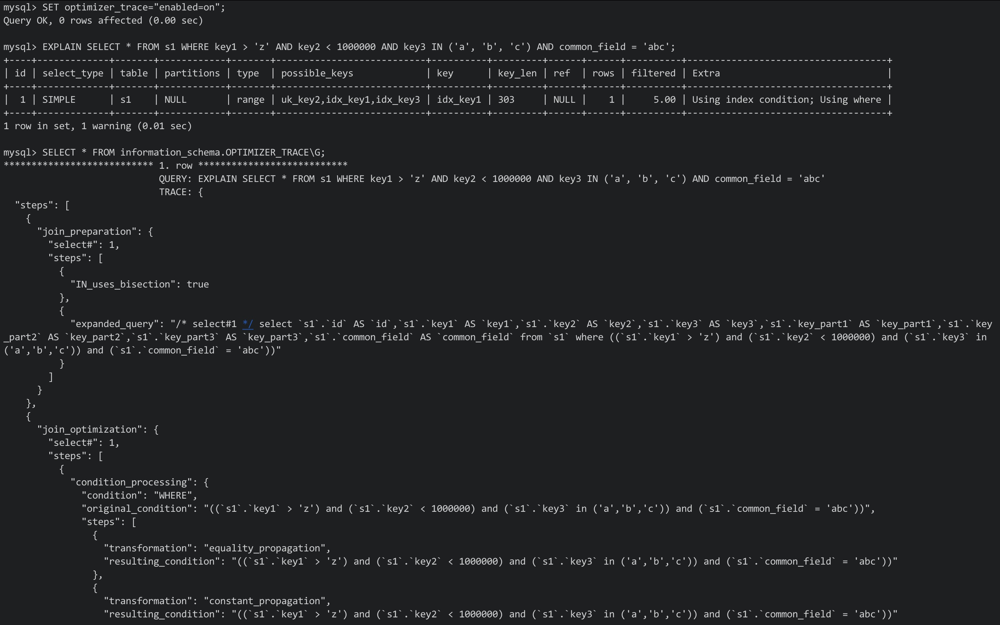

# 十六、optimizer trace


## 16.1 简介

- 在MySQL5.6以及之前的版本中，查询优化器就是一个"黑盒"，我们只能通过EXPLAIN的方式查看最终的执行计划，而无法得知其为何做出这样的决定
- 而在之后的版本中，MySQL提供了名为optimizer trace的功能，该功能可以让用户方便的查看优化器生成执行计划的全过程


该功能的开启和关闭由系统变量optimizer_trace来决定

Eg:


**注意:**one_line值用来控制输出的格式，如果值为on，则输出都将在一行中展示，并不适合阅读，所以保持为off即可


原理:

- 打开optimizer trace功能后，**需要先执行一次想要查看优化过程的SQL语句，或者使用EXPLAIN查看一个执行计划**
- 之后只需要查看information_schema库下的OPTIMIZER_TRACE表即可


该表中有4列:

- QUERY: 表示输入的查询语句(我们自己写的SQL)
- TRACE: 表示优化过程的JSON文本
- MISSING_BYTES_BEYOND_MAX_MEN_SIZE: 如果生成过程中输出的内容超出了某个限制，则多余的文本不会显示。该字段表明剩余未显示内容的文本字节数
- INSUFFICIENT_PRIVILEGES: 表示是否有查看执行计划的权限，默认为0(有权限)，某些情况下为1(暂不关心)


## 16.2 通过optimizer trace分析查询优化器的具体工作过程

Eg:




优化过程的三个阶段:

- prepare阶段
- optimize阶段
- execute阶段


基于成本的优化主要集中在optimize阶段

- **对于单表查询来说**，主要关注的是**optimize阶段的rows_estimation过程**
- **对于多表连接查询来说**，主要关注的是**considered_execution_plans过程**

****


# 十七、InnoDB的Buffer Pool


## 17.1 缓存的作用

- 数据始终会存放在磁盘内，所以而访问页中的记录时，会将整个页的数据加载到内存中
- 之后就可以进行读写访问了，**在读写访问之后并不着急释放页对应的内存空间，而是缓存起来**，之后**再次访问时就能省下读取表的I/O开销了**


## 17.2 InnoDB的Buffer Pool


### 17.2.1 Buffer Pool的定义

- 为了缓存从磁盘中读取的页，InnoDB会在MySQL服务器启动时就申请一片连续的内存，名为"Buffer Pool"
- 该缓存大小默认为128MB，可以通过在配置文件中指定innodb_buffer_pool_size这个启动项来指定其值

Configuration:

```mysql
[server]
innodb_buffer_pool_size = byte_nunmber
```

- 其单位为字节，其值不能太小，最小为5MB(小于5MB时MySQL会强制更正)


### 17.2.2 Buffer Pool内部组成

- Buffer Pool被划分成了若干页面，**该页面大小和InnoDB表空间使用的页面大小一致，都为16KB**
- 这里我们将**这些页面称为缓冲页**
- 为了管理这些缓冲页，**InnoDB为每个缓冲页都创建了一些控制信息**


- 每个缓冲页中对应的控制信息占用的内存大小是一致的，**每个页对应的控制信息占用的每块内存被称为一个控制块，控制块与缓冲页一一对应**
- **控制块在Buffer Pool的前面，缓冲页在后面**

Image:


- 我们设置的innodb_buffer_pool_size并不包含控制块占用的内存空间，所以在申请连续内存时，这片空间会比innodb_buffer_pool_size大5%
- 控制块大约占缓冲页大小的5%(DEBUG模式下，其余模式下会小一些)


### 17.2.3 free链表的管理

- 在启动服务器的时候需要完成Buffer Pool的初始化，也就是先向OS申请Buffer Pool的内存空间，划分为若干控制块和缓冲页
- 此时没有任何页面从磁盘缓存到Buffer Pool中


在从磁盘读取一个页到Buffer Pool时，该放到Buffer Pool中的哪个位置呢？或者说怎么区分Buffer Pool中哪些缓存页是空闲的？

- 我们可以把所有空闲缓冲页对应的控制块作为节点，放入一个链表内，该链表称为free链表
- 刚刚初始化后的Buffer Pool中 ，所有缓冲页都是空闲的

free链表的效果图:


- 如图，为了管理这个free链表，定义了一个基节点，其中包含了链表的头节点/尾节点地址。以及链表中节点的数量等等
- 基节点占用的内存空间并不包含在Buffer Pool中申请的大片连续的内存空间中，其是一块单独的内存空间


- 有了基节点之后，每当需要从磁盘中加载一个页到Buffer Pool中时，就**从free链表中获取一个空闲的页**，并**将该缓冲页对应的控制块的信息填好**，并**把该控制块从free链表中移除即可**


### 17.2.4 缓冲页的哈希处理

- 之前说过缓冲页的作用: 访问某个页的数据时，将该页从磁盘加载到Buffer Pool中，如果已经在Buffer Pool中了，则直接使用即可


问题是，我们怎么知道所需的页在不在Buffer Pool中呢？难道要遍历Buffer Pool中的所有缓冲页吗？

- 之前我们定位一个页面就是通过表空间号与页号来获取页的
- 对应的，表空间号 + 页号就是一个key，缓冲控制块就是对应的value，建立一个哈希表即可


### 17.2.5 flush链表的管理

- 如果我们修改了Buffer Pool中某个缓冲页的数据，其与**磁盘上的页就不一致了**(还未同步到磁盘内)，**这样的缓冲页称为脏页**(dirty page)
- 我们可以立即将修改刷新到磁盘上的对应页，但磁盘很慢，所以**频繁向磁盘写数据会影响程序的性能**
- 所以我们**并不能立即将修改同步到磁盘上**，而是**在未来的时间点进行刷新**(暂不介绍该时间点)


不能立即将修改刷新到磁盘上，那么怎么判断哪些页是脏页呢？

- 我们不得不再创建一个存储脏页的链表，其存储所有被修改过的缓冲页对应的控制块(脏页的控制块)
- 这个**链表节点对应的缓冲页都是需要刷新到磁盘上的，所以称为flush链表**，**构造和free链表差不多**

结构图:


总结: 缓冲页是空闲的，那就不可能是脏页，如果其是脏页，则肯定不是空闲的


### 17.2.6 LRU链表的管理


#### 1) 缓冲区不够的窘境

Buffer Pool对应的内存大小是有限的，如果需要缓冲的页占用的内存大小超过了Buffer Pool规定的大小，则需要将旧的缓冲页从中移除，再将新的页面放进去


问题是具体移除哪些页呢？

- 我们设立Buffer Pool的初衷是想减少磁盘I/O(减少从磁盘加载页的次数)
- 假设访问次数为n，则被访问的页在Buffer Pool中的次数 / n即为命中率，我们希望命中率越高越好
- 以聊天列表为例，经常使用的就在前面，不经常使用的就在后面，所以一旦超出了容量，则只会保留很频繁使用的列表


#### 2) 简单的LRU链表

- 管理Buffer Pool其实也用的是这个道理。不过我们怎么知道哪些缓冲页最近使用频繁，哪些最近很少使用呢？
- 我们可以再创建一个链表，由于该链表是为了按照最少使用原则去淘汰缓冲页的，所以该链表可以被称为LRU链表(Least Recently Used)，当访问页面时按照如下方式处理LRU链表
    - 如果页不在Buffer Pool中，将该页从磁盘加载到Buffer Pool中的缓冲页时，就把该缓冲页对应的控制块作为节点塞到LRU链表的头部
    - 如果该页存在于Buffer Pool中，则直接把该页对应的控制块移动到LRU链表的头部
- 所以当使用到缓冲页时，则将该页调整到LRU的头部，此时尾部就是最近很少使用的缓冲页了，当Buffer Pool中的空闲缓冲页使用完时，淘汰掉链表尾部的链表即可


#### 3) 划分区域的LRU链表

上述简单的链表其实有两个问题:


- 情况1: InnoDB提供一个服务——预读，所谓预读就是InnoDB认为执行当前请求时，可能会在后面读取某些页面，于是会预先将这些页面加载到Buffer Pool中。预读细分为两种:
    1. 线性预读: 如果读取一个区中的页面**超过了系统变量"innodb_read_aheaed_threshold"**，则会**触发一次异步读取下一个区中全部的页面到Buffer Pool中的请求**，由于是异步的，所以不会影响当前工作线程的正常执行，innodb_read_ahead_threshold系统变量的值默认为56，可以在启动时调整该变量，或者在运行时使用SET GLOBAL命令修改
    2. 随机预读: 如果某个区的13个连续的页面都被加载到了Buffer Pool中，无论这些页面是不是顺序读取的，都会触发一次异步读取本区所有页面到Buffer Pool中的请求，MySQL提供了innodb_random_ahead系统变量，默认值为OFF，说明该功能默认关闭，想开启同样需要使用SET GLOBAL设置为ON即可


预读本来是好事，如果预读到Buffer Pool中的页被成功地使用到了，那么可以提高效率，但如果用不到呢？

如果预读的页很多，但都用不到，则这些预读的页就会被很快地淘汰掉，大大降低Buffer Pool的命中率


- 情况2: 当需要全表扫描时，需要访问的页面特别多，此时Buffer Pool中的缓冲页可能会全部换一次，这回影响其他查询，从而降低Buffer Pool的命中率


总结，以下两种情况会降低Buffer Pool的命中率：

- 加载到Buffer Pool中的页不一定被用到(预读)
- 非常多使用频率较低的页被同时加载到Buffer Pool中


为了解决上述问题，LRU链表被按比例分为了两个部分:

- 一部分存储使用频率很高的缓冲页，这部分链表被称为热数据，或者young区域
- 另一部分存储使用频率不是很高的缓冲页，这部分链表被称为冷数据，或者old区域


MySQL会按照比例划分LRU链表，而不是将某些节点固定在其中一个区域，节点所处的区域随时可能改变

- 两个区域的划分比例依据系统变量innodb_old_blocks_pct来确定，其指定了old区域在整个LRU中所占的比例

Eg:


- 该变量可以通过innodb_old_blocks_pct启动项控制，或者写入配置文件:

```
[server]
innodb_old_blocks_pct=40
```

- 也可以在启动后通过SET GLOBAL命令修改


有了这两个区域后，就可以优化之前可能降低Buffer Pool命中率的情况了

- 针对预读的页面，可能不进行后续访问的优化
    - 在之前预读的基础上，磁盘上 的页首次加载到Buffer Pool上的某个缓冲页上时，该缓冲页对应的控制块会放在old区域的头部
    - 这样这些只通过预读获取了一次的页面在后续未被访问后就被移除了，这样就不会影响young区域了
- 针对全表扫描会加载大量低频页面的优化
    - 按照上一个优化方法，首次加载的页面会放在old区域，但之后又会被访问到，从而加载到young中
    - 而此时不能再使用之前的优化方法了，因为每读取其中的一条记录，就是访问一次页面，所以全表扫描就是访问该页面很多次
    - 为了解决这个问题，我们通过规定，在对处于old区域的缓冲页进行第一次访问时，先在它对应的控制块内记录下访问的时间，
    - 如果**后续再次访问的时间与上次记录的时间在某个间隔内**，则不会从old区放到young区的头部，否则就会放到young区域的头部，该间隔时间由系统变量innodb_old_blocks_time控制

Eg:


- 该值默认为1000，单位为毫秒


#### 4) 进一步优化LRU链表

- 对于young区域的缓冲页来说，每次访问其中的页都要移动到LRU链表的头部，这样的开销依然很大(这些数据都是经常访问的)
- 为了解决这个问题，我们提出一个策略比如：
    - 只有被访问的页处于后1/4位置时才移动到LRU链表的头部，这样就能降低调整链表的频率了
    - 之前的随机预读中，某个区中13个连续页面还必须都是在young区域中前1/4位置的页面


**注意：**在flush链表中的节点肯定在LRU链表中


### 17.2.7 其他链表

- 还有其他例如管理解压页的unzip LRU链表
- 管理压缩页的zip clean链表等等


### 17.2.8 刷新脏页到磁盘

**后台中有一个专门的线程负责每个一段时间将脏页刷新到磁盘中**，而不影响用户线程处理正常请求，刷新的方式主要有两种:


- **从LRU链表的冷数据中刷新一部分页面到磁盘**(old区域)
    - 后台线程会**定时从LRU链表的尾部开始扫描一些页面**，**扫描页面的数量通过系统变量innodb_lru_scan_depth控制**
    - 如果**在LRU链表内发现了脏页，则会将其刷新到磁盘**，**这种方式称为BUF_FLUSH_LRU**
- 从flush链表中刷新部分页面到磁盘
    - 后台线程也会定时**从flush链表中刷新部分页面到磁盘内**，**刷新速率取决于系统是否繁忙**
    - 这种方式称为BUF_FLUSH_LIST


有的时候，后台刷新脏页的速度很慢，此时会导致磁盘中的页需要加载到Buffer Pool时没有可用的空闲缓冲页

- 此时会尝试查看LRU链表的尾部，查看是否有可以直接从Buffer Pool中释放的未修改的缓冲页
- 如果没有则不得不将LRU链表尾部的一个脏页同步到磁盘中，这种将单个页面刷新到磁盘的刷新方式被称为BUF_FLUSH_SINGLE_PAGE


当系统繁忙时，可能出现用户线程从flush链表中刷新脏页的情况

- 在处理用户请求时刷新脏页会严重降低处理速度，这是一种迫不得已的情况


### 17.2.9 多个Buffer Pool实例

- Buffer Pool本质是一块连续的内存空间，在多线程访问时，其中的各个链表都要加锁
- 在Buffer Pool特别大且多线程并发访问量特别高时，单一的Buffer Pool会影响请求的处理速度
- 所以在Buffer Pool特别大时，可以将其拆分为多个小的Buffer Pool，每个Buffer Pool都是一个实例
- 它们有独立的内存空间，独立管理链表，并发访问时不会相互影响，从而能提高并发处理能力
- 实例的数量可以设置全局变量buffer_pool_instances值来控制，配置文件:

```
[server]
innodb_buffer_pool_instances = number
```


- 单个实例占用的内存空间大小可以通过公示算出:

```
innodb_buffer_pool_size / innodb_buffer_pool_instances
```

- 当innodb_buffer_pool_size小于1GB时，设置多个实例是无效的，数量默认为1


### 17.2.10 innodb_buffer_pool_chunk_size

- 在MySQL5.7.5之前只能在启动服务器之前通过配置innodb_buffer_pool_size来调整Buffer Pool的大小，不能在运行过程中修改
- 之后的版本中则可以在运行过程中修改了，但每次重新调整Buffer Pool大小时，都需要重新申请连续的内存，并将旧Buffer Pool中的内容复制过来，该过程及其耗时
- 所以MySQL在之后的版本中**不再一次性为某个Buffer Pool实例申请大片连续内存**，而是**以chunk为单位申请空间**
- 所以一个Buffer Pool实例其实是由若干chunk组成的，一个chunk就代表一片连续的空间，其中包含若干缓冲页和对应的控制块
- 在运行期间调整innodb_buffer_pool_size时，就以chunk为单位增加/删除空间


- innodb_buffer_pool_chunk_size的大小默认为128MB，其值只能在启动项中指定，不能在运行过程中修改
- 如果在运行中修改则会遇到和旧版本中调整Buffer Pool大小时的问题
- innodb_buffer_pool_chunk_size对应的值并不包含缓冲页对应的控制块的内存大小，每个chunk的大小要比innodb_buffer_pool_chunk_size的值要大5%(DEBUG模式)


### 17.2.11 配置Buffer Pool注意事项

- Innodb_buffer_pool_size必须是innodb_buffer_pool_chunk_size * innodb_buffer_pool_instances的整数倍
- 服务器启动时，如果innodb_buffer_pool_chunk_size * innodb_buffer_pool_instances的值大于了innodb_buffer_pool_size的值，则innodb_buffer_pool_chunk_size的值会被服务器自动配置为innodb_buffer_pool_size / ]innodb_buffer_pool_instances的值


### 17.2.12 Buffer Pool的状态信息

Syntax:

```mysql
SHOW ENGINE INNODB STATUS;
```


Eg:


****


# 十八、事务简述

- 在现实生活中，银行转账是一个不可分割的整体性操作，要么转了，要么没转
- 而**转账操作在数据库中则对应两条SQL语句的执行**(减去一个用户的金额，增加一个用户的金额)
- 如果发生意外**使得这两条记录只执行了一条时**，这个操作就出现了问题
- 就和将页面加载到Buffer Pool中一样，修改某个页面后不会立马刷新到磁盘中，而是在之后的某个时间刷新到磁盘，但如果在刷新到磁盘之前就崩溃了呢？


## 18.1 事务的起源


### 18.1.1 原子性(Automicity)

- 在现实世界中，转账是一个不可分割的操作，要么转了，要么没转，没有中间的状态。**MySQL将这种“要么全做，要么全不做”的状态称为原子性**
- 现实世界中一个不可分割的操作在数据库中却可能对应多条不同的操作，而数据库中的操作也可能对应多个步骤(修改缓冲页后刷新到磁盘中)
- 为了保证原子性： 如果在执行过程中发生了错误，则把已经执行的操作恢复成执行之前的状态


### 18.1.2 隔离性(Isolation)

- 对于某些现实世界中状态转换对应的数据库操作来说，**在保证原子性的同时，还要保证其他状态转换不会影响到本次状态转换，这个规则称为隔离性**(类似多线程中需要保证资源同步)


### 18.1.3 一致性(Consistency)

- 存放在库内的数据需要满足一定约束才是有效的(分数有最高分，身份证号不能重复等等)


保证数据一致性的方法:

- 通过数据库本身的功能
    - 例如数据库中对某个列声明为NOT NULL，或者建立唯一索引来避免重复值的插入
    - 还支持使用CHECK语句来自定义约束

Eg:


但该CHECK语法没有实际的限制作用，插入时并不会检查


- CHECK没用，但我们可以通过创建触发器来自定义一些约束条件，保证数据的一致性
- 其他更多的一致性需求需要通过业务代码来保证，而不是全部甩给MySQL


**注意：**满足原子性和隔离性不一定满足一致性，但一般在定义一致性需求时，只要满足原子性和隔离规则即可


### 18.1.4 持久性(Durability)

- 现实世界中一个状态转换完成后，这个转换的结果将永久保存，这个规则被称为持久性
- 持久性意味着转换对应修改的数据应该在磁盘中永久保留


## 18.2 事务的概念

- 现实世界转换过程中需要遵循的4个特性，统称为ACID
- 需要**保证原子性，完整性，隔离性，持久性的一个或者多个数据库操作称为事务(transaction)**


根据执行的不同阶段，事务分为5个状态:

1. 活动的(active)：操作**在执行过程中**
2. 部分提交的(partially committed)：当**事务中的最后一个操作执行完成**，操作在内存中执行，**所造成的影响并没有刷新到磁盘中**，该事务处于部分提交的状态
3. 失败的(failed)：事务**处于活动的状态或者部分提交的状态时**，**遇到某些错误而无法继续执行，或者人为停止了**，则该事务处于失败的状态
4. 中止的(aborted)：事务执行了半截而变为失败的状态，**要撤销失败事务对数据库的影响，也就是回滚**。**回滚执行完毕后，数据库恢复到了执行事务之前的状态，我们就说该事务处于中止的状态**
5. 提交的(committed)：当一个**处于部分提交的事务，将修改过的数据都刷新到磁盘后**，该**事务处于提交的状态**


- 只有事务处于提交或者中止的状态时，一个事物的生命周期才结束
- 对于已经提交的事务来说，事务对数据库所做的修改将永久生效
- 对于处于中止状态的事务来说，事务对数据库所做的修改都会被回滚到没执行事务之前的状态


## 18.3 事务的语法

- 事务只是一些符合ACID特性的数据库操作


### 18.3.1 开启事务

开启事务有两种方法:

- BEGIN [WORK]：

WORK可省略，开始事务后，之后写的若干语句都属于这个开始的事务

Eg:

```mysql
BEGIN;
```


- START TRANSACTION:

其与BEGIN语句有同样的作用

Eg:

```mysql
START TRANSACTION
```

相较BEGIN语句，START TRANSACTION语句后可以跟修饰符:

1. READ ONLY：标识当前事务只是一个可读事务，**属于该事务的数据操作只能读取不能修改**

只读事务只是不允许修改哪些其他事务也能访问的表中的数据，可以修改临时表(其他事务不可修改)

2. READ WRITE：标识当前事务是一个读写事务，**属于该事务的数据操作可以读取也能修改数据**
3. WITH CONSISTENT SNAPSHOT：启动一致性读


总结:

如果想在START TRANSACTION后跟随多个修饰符，可以使用逗号将修饰符分开

Eg:


**注意：**如果事务不显式地指定访问模式，则事务访问模式默认为读写模式


### 18.3.2 提交事务

Syntax:

```mysql
COMMIT [WORK];
```


COMMIT语句代表提交了一个事务，WORK可有可无

Eg:


### 18.3.3 手动中止事务

通过ROLLBACK可以将数据恢复到事务中的语句执行之前的状态:

Syntax:

```mysql
ROLLBACK [WORK]
```


注意:

ROLLBACK只是我们手动回滚事务时使用的，如果事务执行时遇到错误而无法继续执行，大部分情况下会回滚失败的情况(死锁等)


### 18.3.4 支持事务的存储引擎

并不是所有的引擎都支持事务，**目前只有InnoDB和NDB支持**


如果**表使用的存储引擎不支持事务，则对改变所做的修改不能回滚**


### 18.3.5 自动提交

系统变量autocommit，用来自动提交事务

Eg:


其默认为ON

**在默认情况下，如果不显式使用START TRANSACTION或者BEGIN开始事务**，则**每条语句都是一个独立的事务**


关闭自动提交的方法:

- 显式地使用START TRANSACTION或者BEGIN开启一个事务，在事务提交/回滚前，会暂时关闭自动提交
- 将该变量设置为OFF

Eg:


关闭后，写的语句都属于同一个事务，直到我们显式地写出COMMIT语句提交事务，或者显式地写出ROLLBACK回滚事务


### 18.3.6 隐式提交

当使用START TRANSACTION或者BEGIN语句开始了一个事务之后，或者将autocommit修改为OFF之后，事务就不会自动提交了


但我们输入的一些语句会导致之前的事务悄悄地提交，这种因为某些特殊语句导致事务提交的情况称为隐式提交

导致隐式提交的语句:

- 定义/修改数据库对象的定义语言

数据库对象指的是数据库、表、视图、存储过程等等，当使用CREATE、ALTER、DROP等语句修改这些数据库对象时，就会隐式提交前面语句所属的事务

Eg:

```mysql
BEGIN;

SELECT...;
UPDATE...;

CREATE TABLE... // 此语句就会将之前的事务隐式提交
```


- 隐式使用/修改MySQL库中的表

使用ALTER USER、CREATE USER、DROP USER、GRANT、RENAME USER、REVOKE、SET PASSWORD等语句时，都会隐式地提交之前的事务


- 事务控制/关于锁定的语句

当一个事务还未提交/还没回滚时，又开启了一个新的事务，此时会隐式提交上一个事务

使用LOCK TABLES、UNLOCK TABLES等关于锁定的语句时，也会隐式提交上一个事务


- 加载数据的语句

使用LOAD DATA向数据库中批量导入数据时，也会隐式提交之前的事务


- 关于MySQL复制的语句

使用START SLAVE、STOP SLAVE、RESET SLAVE、CHANGE MASTER TO等


- 其他

ANALYZE TABLE/CACHE INDEX/CHECK TABLE/FLUSH/LOAD INDEX INTO CACHE/OPTIMIE TABLE/REPAIR TABLE/RESET


### 18.3.7 保存点

- 如果发现事务中某个语句出错了，直接回滚会重置所有的语句
- 为了方便控制回滚的位置，我们可以设置保存点(savepoint)，我们可以通过ROLLBACK TO语句指定回滚的位置，而不是回滚所有操作

设置回滚点:

```mysql
SAVEPOINT savepoint_name;
```


回滚到指定的回滚点:

```mysql
ROLLBACK TO savepoint_name;
```

Eg:


****


# 十九、redo日志


