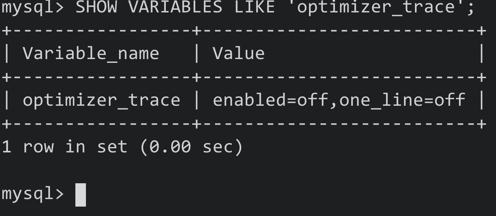
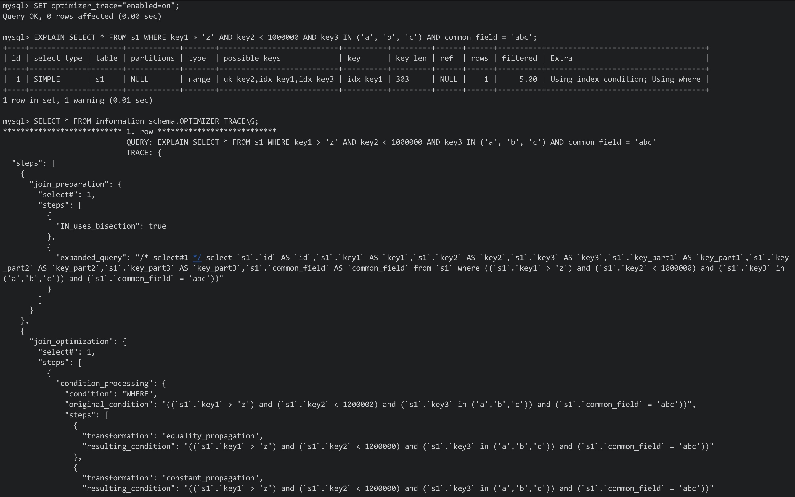

# 十六、optimizer trace

## 16.1 简介

- 在MySQL5.6以及之前的版本中，查询优化器就是一个"黑盒"，我们只能通过EXPLAIN的方式查看最终的执行计划，而无法得知其为何做出这样的决定
- 而在之后的版本中，MySQL提供了名为optimizer trace的功能，该功能可以让用户方便的查看优化器生成执行计划的全过程

该功能的开启和关闭由系统变量optimizer_trace来决定

Eg:

**注意:**one_line值用来控制输出的格式，如果值为on，则输出都将在一行中展示，并不适合阅读，所以保持为off即可

原理:

- 打开optimizer trace功能后，**需要先执行一次想要查看优化过程的SQL语句，或者使用EXPLAIN查看一个执行计划**
- 之后只需要查看information_schema库下的OPTIMIZER_TRACE表即可

该表中有4列:

- QUERY: 表示输入的查询语句(我们自己写的SQL)
- TRACE: 表示优化过程的JSON文本
- MISSING_BYTES_BEYOND_MAX_MEN_SIZE: 如果生成过程中输出的内容超出了某个限制，则多余的文本不会显示。该字段表明剩余未显示内容的文本字节数
- INSUFFICIENT_PRIVILEGES: 表示是否有查看执行计划的权限，默认为0(有权限)，某些情况下为1(暂不关心)

## 16.2 通过optimizer trace分析查询优化器的具体工作过程

Eg:

