# 一、MySQL概述


## 1. /bin目录


MySQL**在mac OS上的安装路径**:

```shell
/usr/local/mysql/
```


## 2. 启动服务器


### mysqld:

- 启动一个服务器进程
- 并不常用


### mysql_safe:

- **间接调用mysqld并一直监控服务器的运行情况**
- 进程出现问题时，**可以帮助重启服务器**
- 通过其启动时，能**将服务器的出错信息和其他诊断信息输出到错误日志**


### mysql.server:

- 会**间接调用mysql_safe**
- 其只是一个链接


### mysqld_multi:

- 启动/停止**多个服务器进程**


## 3. 启动MySQL客户端


启动MySQL客户端:

```shell
mysql -h host_name -u user_name -ppassword
```

- h: 服务器所在的域名或者IP地址
- u: 客户端用户名
- p: 用户密码


- 多个客服端之间互不影响，不输入端口号的话默认为本地


连接的注意事项:

- 不要在一行中输入密码，最好采用如下的方式(不会显示密码):

```shell
mysql -u root -p
```


- 如果非要在一行中输入密码，则密码和-p之间不能有任何空白字符
- **参数之间的顺序并不固定，可以随意更改**
- **对于UNIX系统**，省略-u后，会**将当前操作系统的用户名作为连接客服端的用户名处理**


## 4. server和client的连接过程


### 网络

- 当服务器和客服端不在同一主机上时，通常需要借助TCP/IP协议来通信
- 服务器/客户端进程使用该协议进行通信时会向系统申请一个端口，MySQL默认会申请3306端口

使用mysqld程序启动，使用-P参数指定服务器的端口:

```shell
mysqld -P
```

- 注意是大写的P，小写代表password


### 在Windows操作系统上

- 可以使用命名管道或者共享内存
- 共享内存只能用于服务器和客户端位于同一台Windows主机中的情况


### 在UNIX操作系统上

- 如果server和client都在同一台UNIX机器上，可以使用UNIX域套接字(domain socket)进行进程间通信
- 默认的套接字文件路径:

```shell
/tmp/mysql.sock
```


## 5. 服务器处理请求

最终的效果:

- 客户端进程向服务器发送一段**文本**(SQL语句)，服务器处理后向客户端进程返回一段文本(处理结果)


### 连接管理

- 通过上述过程进行连接
- 每当一个客户端进程连接服务器进程时，服务器进程都会创建一个线程专门用于与该客户端交互
- 客户端断开连接后，**服务器会将该线程缓存起来**，之后分配给新的客户端(避免频繁的创建和销毁线程)
- 为了不影响性能，我们可以指定同时连接服务器的最大client数量
- 如果两者不在同一台设备上，还可以通过TLS(HTTPS)进行传输层加密
- 建立连接后，服务器**会一直等待客户端的请求**


### 解析/优化

- 查询缓存:

把处理过的查询请求与结果保存起来，用于之后的查询

当表的结构/数据被修改后，其查询缓存都将被删除

**从MySQL5.7.20开始不推荐使用查询缓存了，在MySQL8.0被直接删除**


- 语法解析:

如果缓存没有命中，则进入查询阶段


- 查询优化:

MySQL会自动将我们的语句进行一些优化(改变表的连接方式，简化等等)

可以使用EXPLAIN来查看语句的执行计划

Eg:

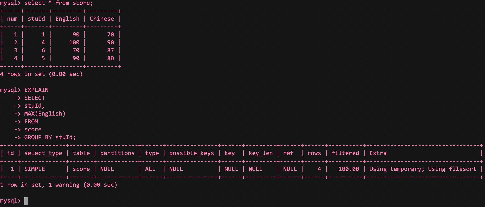


### 存储引擎

- 一个**封装了数据存储/提取操作的模块**，规定了读取数据和写入数据的方式
- 不同的存储引擎管理表的结构不同，采用的算法也不同
- 可以**简单的分为server和存储引擎层**，**不涉及数据的部分全部为server层**


## 6. 常用的存储引擎

| Storage Engine |           Description           |
| :------------: | :-----------------------------: |
|    ARCHIVE     |     用于存档(无法修改数据)      |
|   BLACKHOLE    |    丢弃写操作，读取会返回空     |
|      CSV       | 存储数据时，用","分隔各个数据项 |
|   FEDERATED    |         用于访问远程表          |
|     InnoDB     |     支持事务、行级锁、外键      |
|     MEMORY     |  数据只存储在内存(用于临时表)   |
|     MERGE      |  管理多个MyISAM表构成的表集合   |
|     MyISAM     |         处理非事务存储          |
|      NDB       |        MySQL集群专用存储        |

- 默认引擎为InnoDB(从5.5.5开始)，最常用的为MyISAM和InnoDB
- 不同的引擎功能不同


## 7. 存储引擎操作


### 查看支持的引擎

syntax:

```mysql
show engines;
```


Eg:

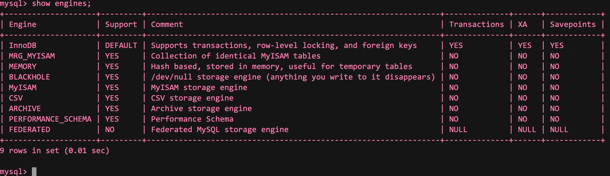


### 设置表的存储引擎


在创建表时指定

syntax:

```mysql
create table table_name(
column_1 type,
...
)engine=engine_name;
```


Eg:

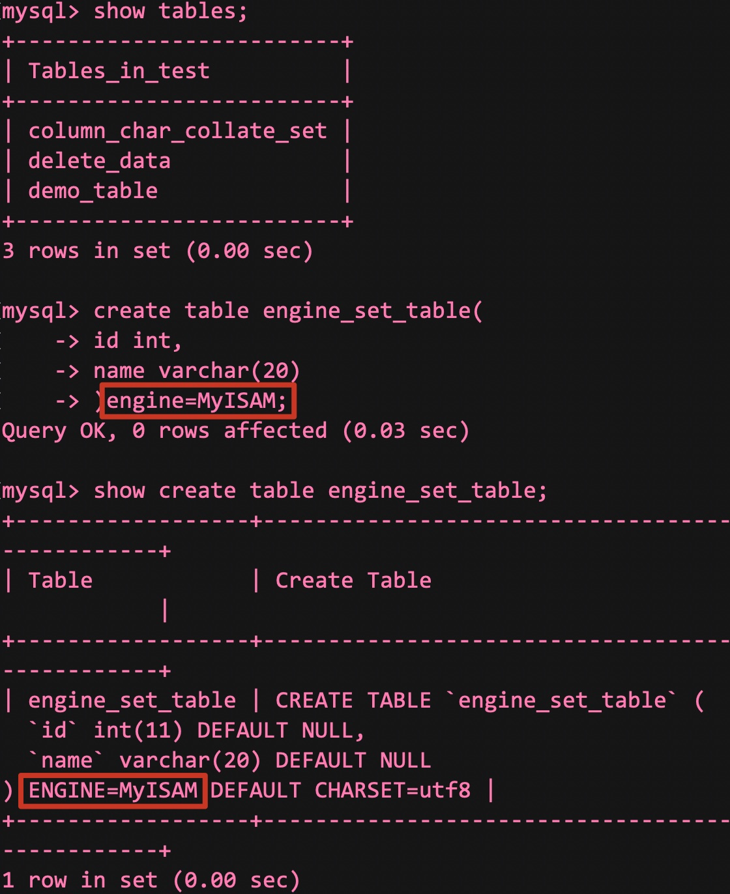


修改已存在表的存储引擎

syntax:

```mysql
alter table table_name engine = new_engine_name;
```

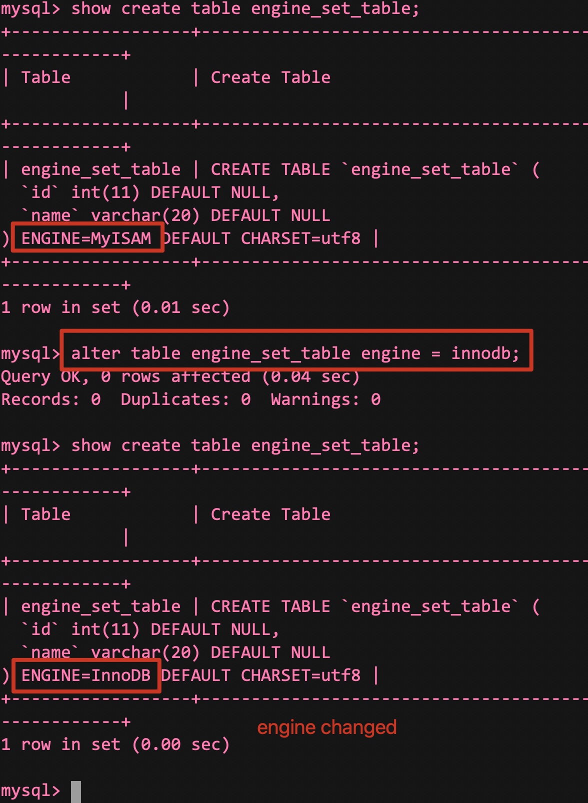

****


# 二、MySQL设置


## 1. 启动参数/配置文件


### CLI上使用选项参数

- 该方法仅针对当次启动


- 禁用TCP/IP通信

```shell
mysqld --skip-networking
```


- 设置默认的存储引擎

```shell
mysqld --default-storage-engine=engine_name
```

**注：**选项名和选项值之间不得有空格


- 查看运行程序的帮助说明

```shell
mysql --help
mysql_safe --help
mysqld --verbose --help(特殊)
```

- 许多选项参数都有对应的短形式
- 短形式允许选项名与选项值之间用space隔开


### 配置文件

- 比起CLI，修改配置文件能一劳永逸！


UNIX系统**依次读取配置文件的顺序**:

|        Path        |             Describ              |
| :----------------: | :------------------------------: |
|    /etc/my.cnf     |                                  |
| /etc/mysql/my.cnf  |                                  |
| SYSCONFDIR/my.cnf  |                                  |
| $MYSQL_HOME/my.cnf |        仅指定服务器的选项        |
| default-extra-file | 由命令行指定的额外的配置文件路径 |
|     ～/.my.cnf     |          用于用户的选项          |
|   /.mylogin.cnf    |    仅指定客户端的登录路径选项    |

- **除了$MYSQL_HOME/my.cnf和/.mylogin.cnf外**其余配置文件既能放server也能放client的文件
- **.mylogin.cnf只能用mysql_config_editor创建/修改**


Eg:

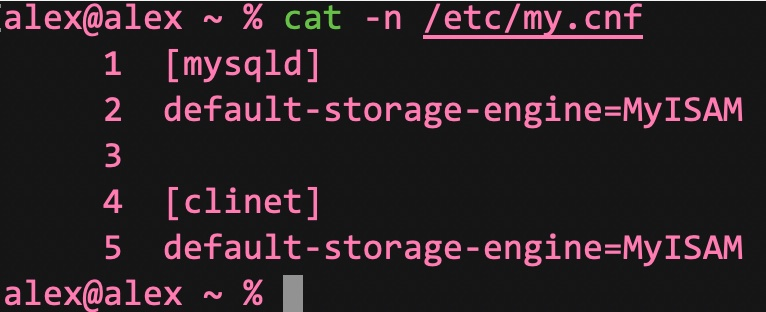


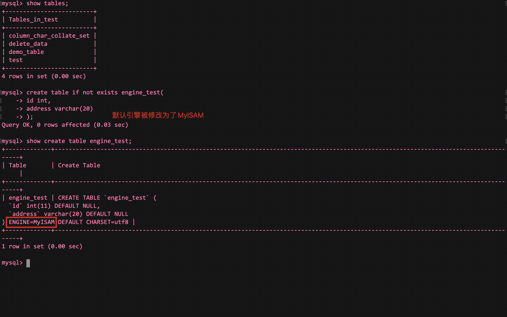


配置文件中程序对应组名以及作用

| Program_name | Effect |               Group                |
| :----------: | :----: | :--------------------------------: |
|    mysqld    | server |         [mysqld], [server]         |
| mysqld_safe  | server | [mysqld], [server], [mysqld_safe]  |
| mysql.server | server | [mysqld], [server], [mysql.server] |
|    mysql     | client |         [mysql], [client]          |
|  mysqladmin  | client |       [mysqladmin], [client]       |
|  mysqldump   | client |       [mysqldump], [client]        |

- 任意选项组后都能添加版本号，用于特定的版本


**多个配置文件**的优先级:

- 如果多个配置文件中有**重复的配置选项，且选项值不同**，则**以最后一次加载的文件为准**
- 加载顺序与读取顺序相同


**同一个配置文件中多个组**的优先级:

- 如果同一个配置文件中**有多个相同作用的组，且选项值不同**，则**以最后一个组为准**

如:

```json
[server]
default-storage-engine=InnoDB

[mysqld]
default-storage-engine=MyISAM
```

- 此时默认的引擎为MyISAM，**因为[mysqld]选项组靠后**


额外文件:

- 在CLI中，使用default-file可以指定server加载**唯一的配置文件**
- 使用default-extra-file则在加载默认的配置文件之后，**再次加载额外的文件**


### CLI和配置文件的区别

- 如果一个选项**同时出现在配置文件和命令行，则以CLI为准**
- **选项只能用于CLI**，类似default-file和default-extra-file这样的放在配置文件中无意义(部分选项不能写在配置文件里)


## 2. 系统变量

- 用于在运行中限制服务器
- 可以在运行中修改，不需要重启


### 查看系统变量

syntax:

```mysql
show variables like 'var_name';
```

- 可以结合通配符进行模糊查询
- 未指定global和session时，默认**输出为会话变量(session)**


Eg:

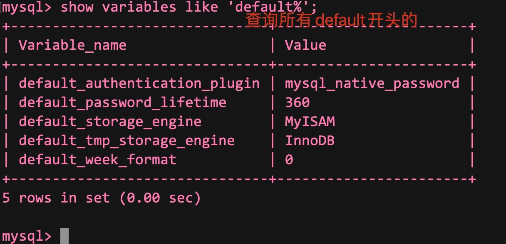


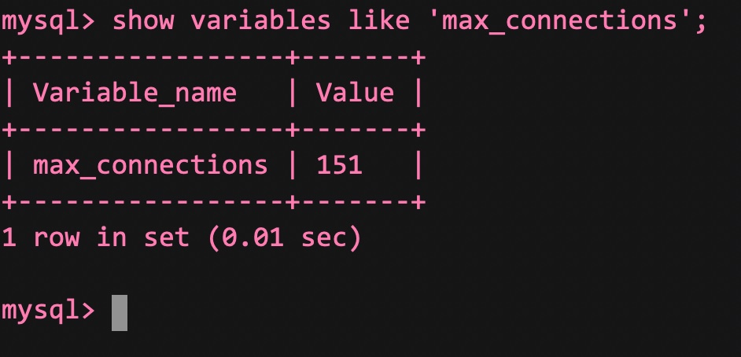


### 设置系统变量


#### 通过启动项

- 命令行直接设置(同启动参数)
- 配置文件

**注：**通过启动项的方式时，各个单词可以使用"-"隔开，也能使用"_"，**但对于系统变量而言，必须使用__(建议统一使用 _)**。


#### 运行过程中修改

- 大多数系统变量可以在运行时修改
- 但**系统变量按照作用范围可分为GLOBAL(全局)和SESSION(会话)**


全局变量(global):

- 在服务器**启动时初始化为默认值，默认值来自CLI或者配置文件**
- 会影响服务器的整体操作
- **通过CLI和配置文件设置的是全局变量**


会话变量(session):

- 影响服务器**和某个客户端的连接**(大部分会**根据全局变量进行初始化**)


#### 通过client

- 设置全局变量

syntax:

```mysql
SET GLOBAL variable_name = value
```

- 设置的全局变量对当前连接的client中会话变量无影响


Eg:

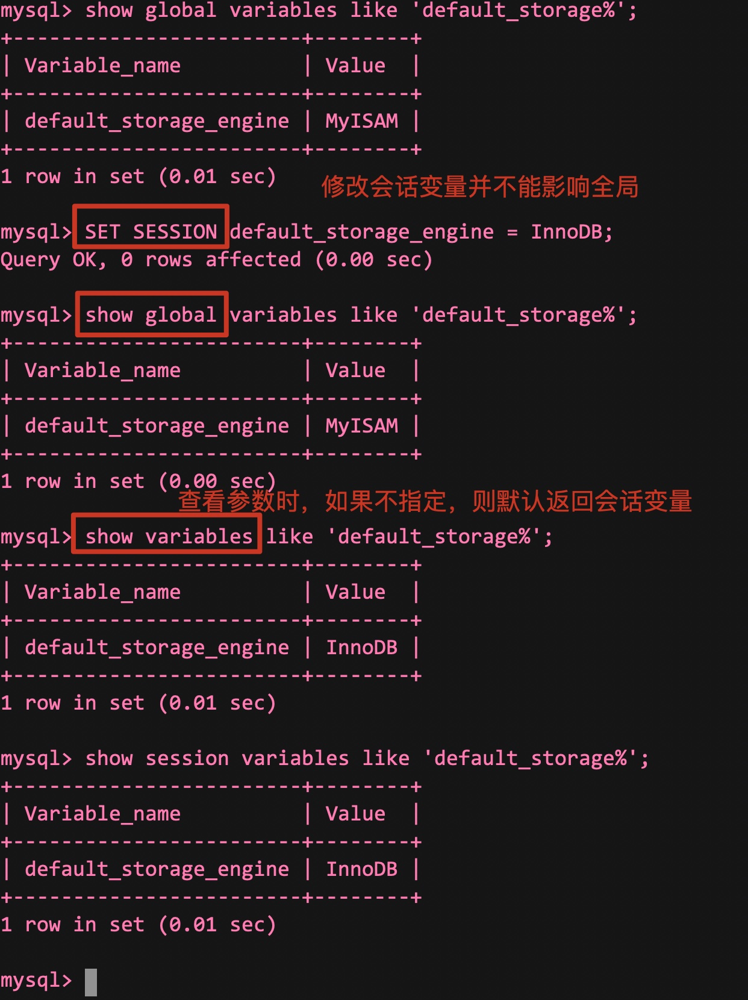


- 设置会话变量

syntax:

```mysql
SET SESSION variable_name = value;
```

- 同样，**会话变量不会影响到全局**


Eg:

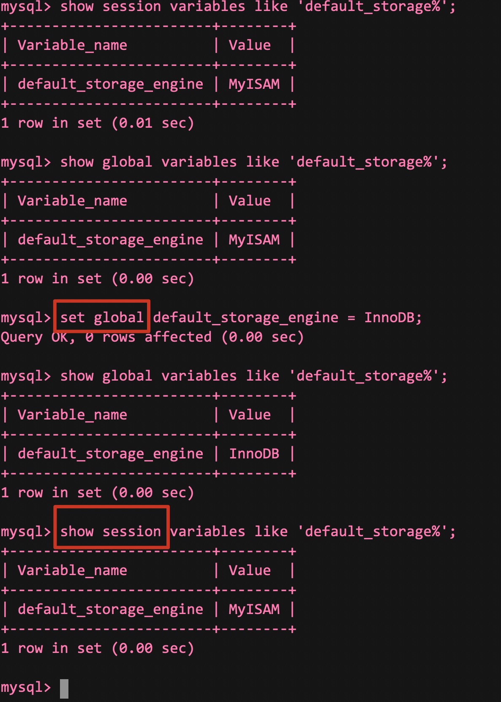


**注意：**

1. 如果在server运行中修改了global变量，**之后与其连接的client的session变量都会受到影响**
2. 修改后**不会影响已经与其建立连接的client中的session变量**
3. 如果修改后的**变量值与配置文件中不同**，则下次启动后，还是**会恢复至配置文件/CLI中的值**
4. 一些变量只有global或者session作用范围
5. 部分变量是只读的(如版本)
6. 部分启动项和系统变量相同，但部分只能作为启动项或者系统变量


## 3. 状态变量

- 显示server的运行状态
- 不能自由修改，只能自动生成
- 同样分为global和session


查看

syntax:

```mysql
show status like variable_name;
```

- 不指定范围则默认为session


Eg:

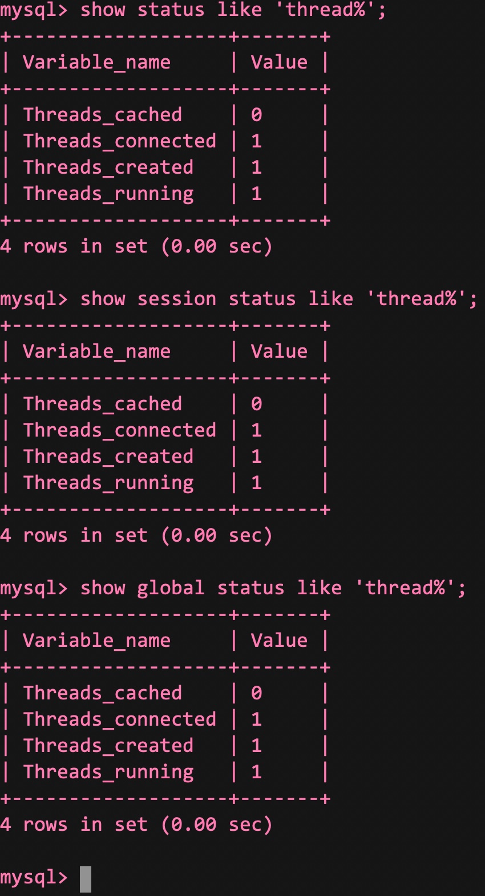

****


# 三、字符集/比较规则

- 字符集: 字符范围的编码规则，一个字符集能有多个比较规则
- 比较规则: 确定字符集后对字符进行比较的方式(是否区分大小写等等)


## 3.1 常见的字符集


### ASCII

- 共收录128个字符(2^7/128)，可以使用一个字节来编码表示


### ISO 8859-1

- 共收录256个字符(2^8/256)，在ASCII的基础上添加了128个西欧常用的字符，可以使用一个字节来编码表示，**别名为"Latin1"**
- 其为MySQL5.7及其之前版本的默认字符集


### GB2312

- 收录了较多的汉字和其他字符，兼容ASCII，如果字符在ASCII中，则用一个字节编码表示，否则用两个编码


### GBK

- GB2312的扩展，兼容GB2312


### UTF-8

- 最常用的字符编码，兼容ASCII字符集，采用变长编码(编码时使用1~4个字节)
- 其属于Unicode字符集的一种编码方式，其下还有UTF-16, UTF-32(分别采用2～4和4个字节进行编码)


## 3.2 MySQL中支持的字符集/比较规则


### utf8和utf8mb4

- 常用的字符用1～3个字节就能表示，所以定义了utf8mb3
- utf8mb3: 只使用1～3个字节表示字符
- uft8mb4: 使用1～4个字节表示，同utf8一样


### 查看支持的字符集

syntax:

```mysql
SHOW CHARSET SET (LIKE 'charset_name');
```


Eg:

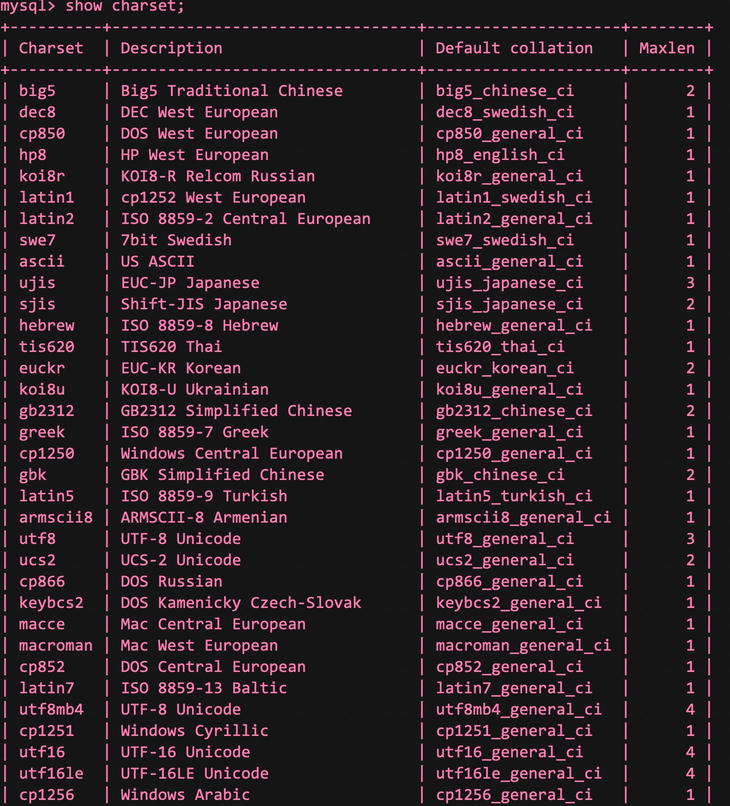

- Default collation: 表示默认的比较规则(ci: case insensitive 即忽略大小写)
- Maxlen: 表示该字符集表示字符时最多使用的字节数


### 查看比较规则

syntax:

```mysql
SHOW COLLATION (LIKE 'collation_name');
```


Eg:

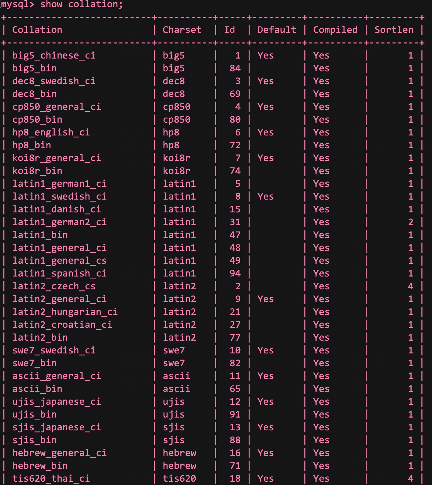

- 比较规则的命令意义: 字符集 + 语言 + 区分重音/大小写等
- Default值为Yes的比较规则为该字符集的默认比较规则
- 后缀含义:

| 后缀 |        释义        |        描述        |
| :--: | :----------------: | :----------------: |
| _ai  | accent insensitive |     不区分重音     |
| _as  |  accent sensitive  |      区分重音      |
| _ci  |  case insensitive  |    不区分大小写    |
| _cs  |   case sensitive   |     区分大小写     |
| _bin |       binary       | 以二进制的方式比较 |


## 3. 使用字符集和比较规则


### 字符集和比较规则的级别


#### 1) server

- 系统变量character_set_server和collation_server表示server级别的字符集和比较规则


查看:

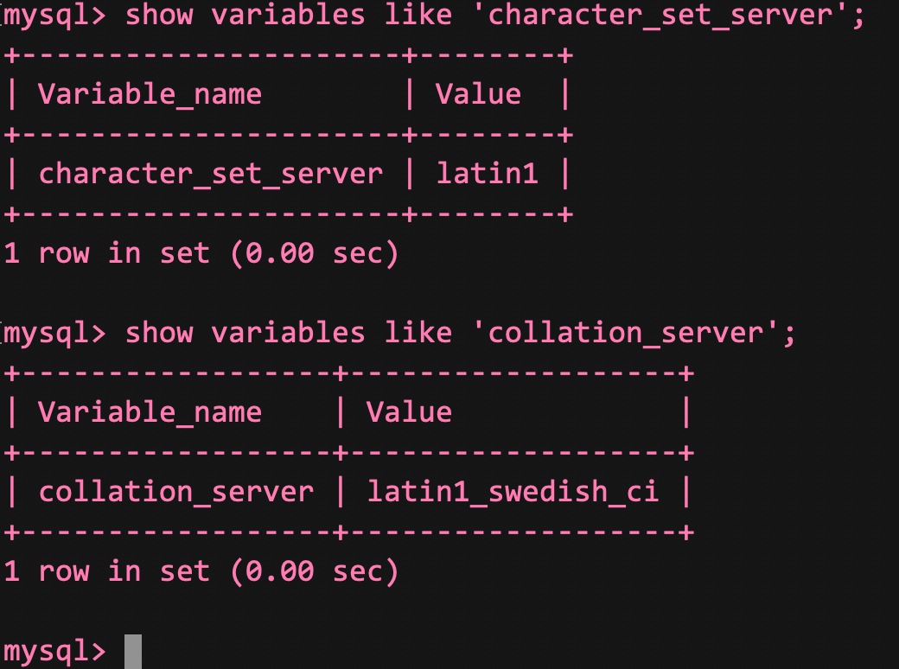


修改这两个变量的方法

- 通过CLI启动项
- 通过配置文件(Path: /etc/my.cnf):

```shell
[server]
character_set_server=charset_name
collation_server=charset_name
```


Eg:

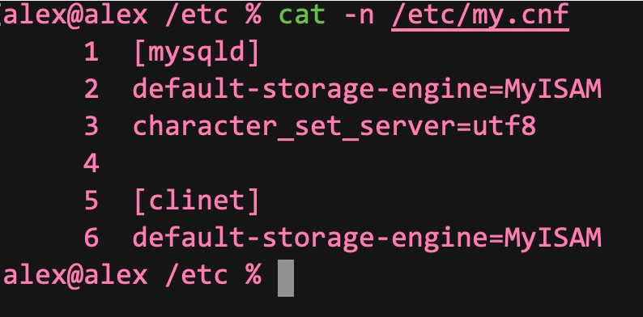


#### 2) database

- 创建时未指定则以server为准
- 该变量**用来指定一个database的默认字符集和比较规则**


查看当前database的charset和collation(需要先use选中)

```mysql
SHOW VARIABLES LIKE 'character_set_database'
SHOW VARIABLES LIKE 'collation_database'
```

- 这两个变量不能用mysql的SET语句修改，只能通过CLI和配置文件


- 在创建时指定charset和collation:

```mysql
CREATE DATABASE IF NOT EXISTS database_name
CHARACTER SET charset_name
COLLATE collation_name
```


Eg:

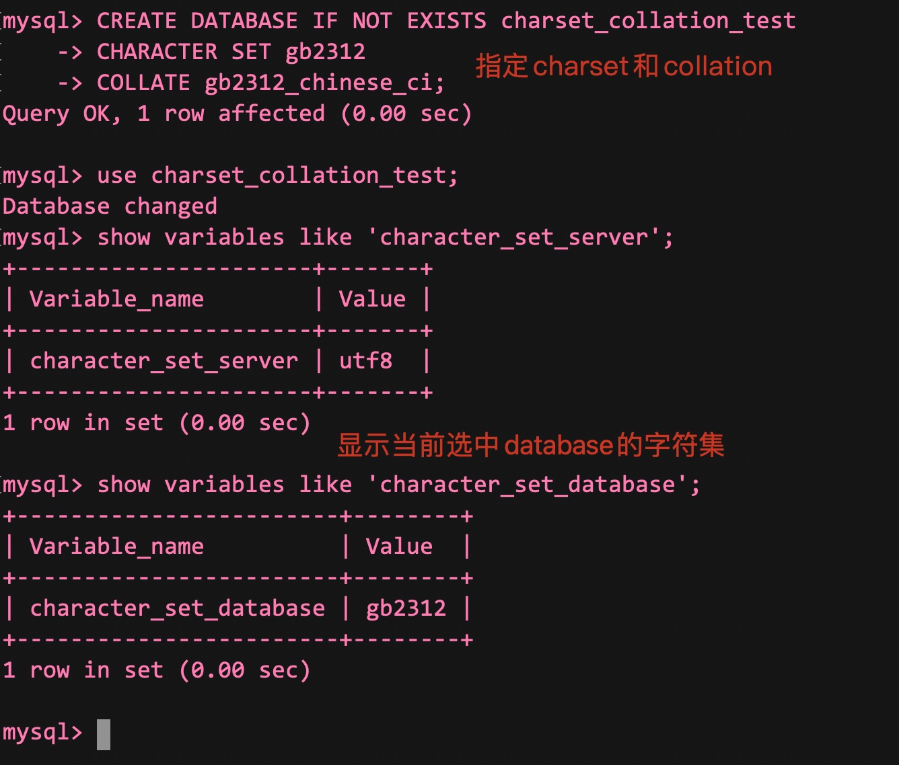


- 修改已经存在的库:

```mysql
ALTER DATABASE database_name
CHARACTER SET new_charset
COLLATE new_collation;
```


Eg:

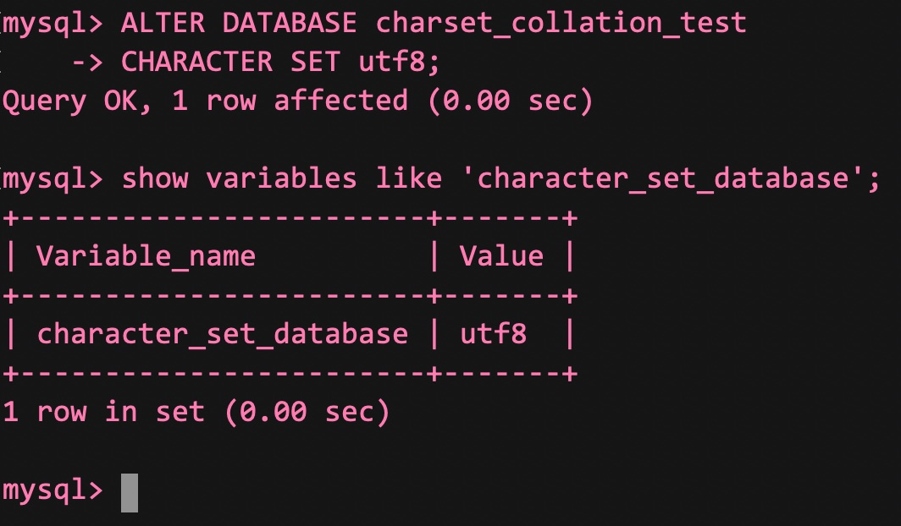


- 同时修改字符编码和比较规则

```mysql
ALTER DATABASE database_name CHARSET = charset_name COLLATE = collation_name;
```

Eg:

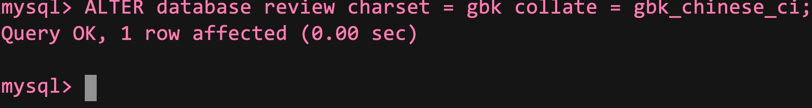


#### 3) table

- 没有指定则使用其对应database的charset和collation
- 用来**指定新创建表的默认字符集和比较规则**
- 在创建时指定:

```mysql
CREATE TABLE table_name(
column_1 type
...
)CHARACTER SET charset_name COLLATE collation_name
```


Eg:

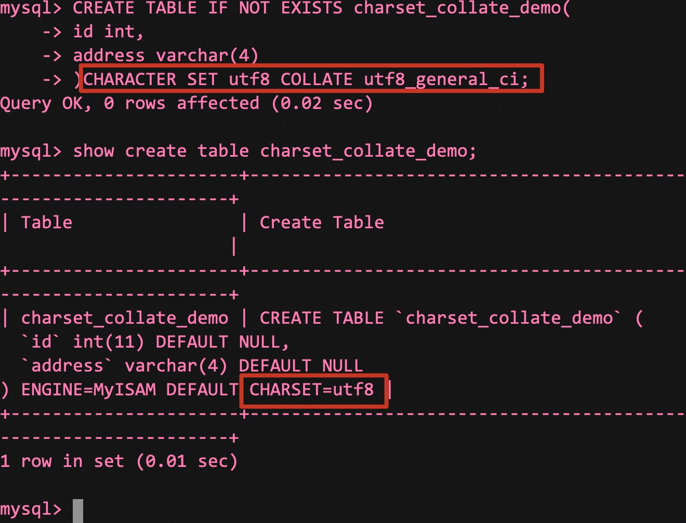


- 修改表的字符集:

```mysql
ALTER TABLE table_name
CHARACTER SET charset_name
COLLATE collation_name
```


#### 4) column

- 没有指定时则以table为准
- 创建时指定

```mysql
CREATE TABLE table_name(
column_1 type CHARACTER SET charset_name COLLATE collation_name
...
)
```


Eg:

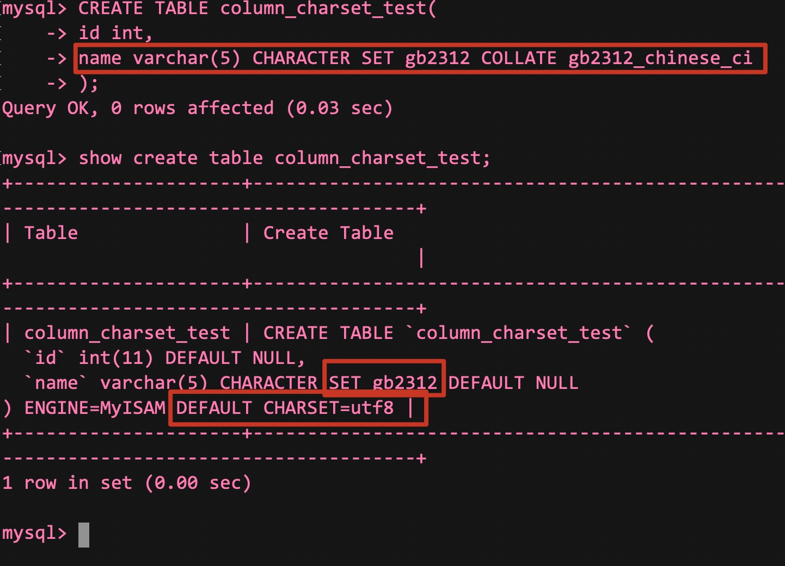


- 修改列/字段的字符编码和排序规则

```mysql
ALTER TABLE table_name MODIFY column_name type CHARACTER SET new_charset COLLATE collation;
```


Eg:

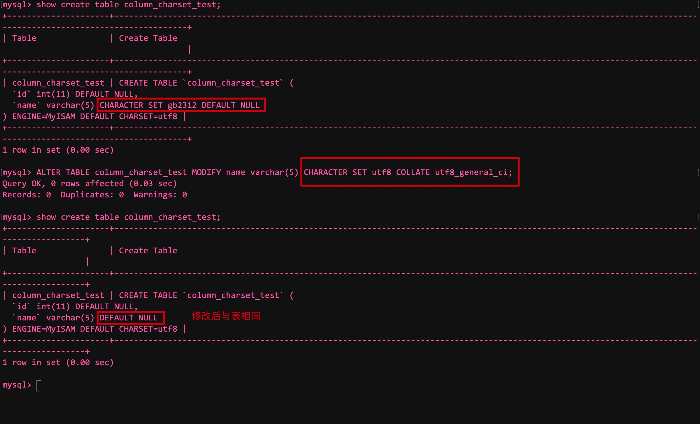


#### 5) 只修改charset/collation

- **只修改charset，collate变为该charset默认的collate**
- **只修改collate，charset变为该collate对应的charset**
- **两者会自动对应**


#### 6) 优先级总结

- charset: column未指定则取决于table，table未指定则取决于database，database未指定则取决于server
- collation: 同上


### server与client通信时charset的转换


#### 1) client sent message

- client和server通信过程中规定的数据格式为MySQL通信协议
- 该编码由client的系统决定
- 对于类UNIX系统，其字符编码决定于以下顺序:

```shell
LC_ALL -> LC_CTYPE -> LANG
```


Eg:


#### 2) server receive message

- 应该保证client和server的charset相同
- server接收请求时会根据变量character_set_client来解码，该变量可以通过SET进行修改
- 如果client发送的数据编码不能用character_set_client来表示(utf8超过了ASCII的范围)，则会报错


查看/修改 character_set_client:

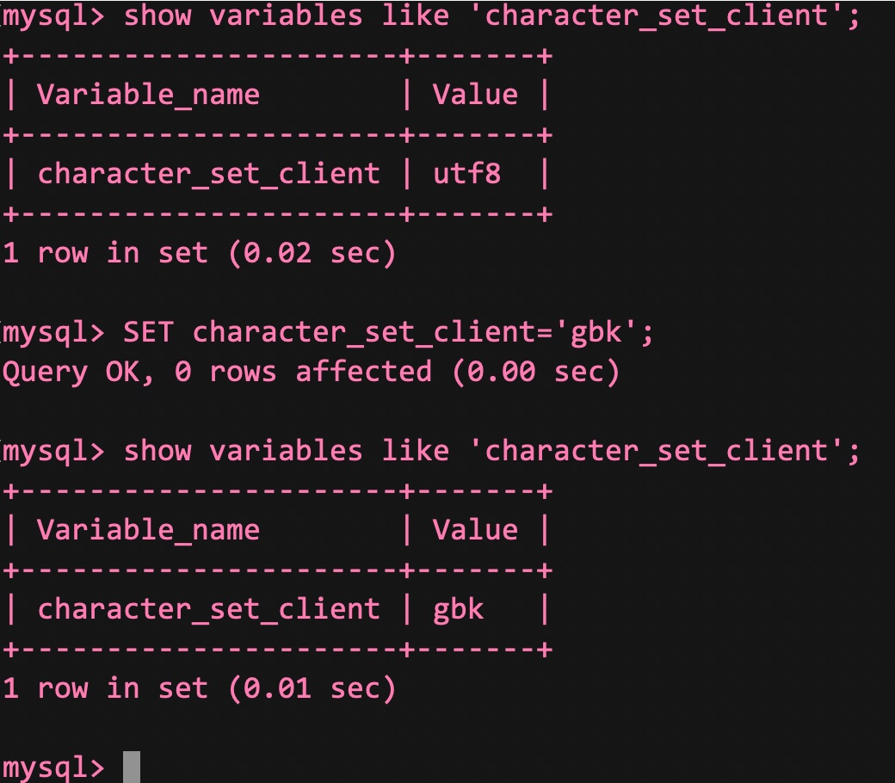


#### 3) server process

- 服务器接收请求时以"character_set_client"为准来解码，之后**将其转换为character_set_connection对应的编码**
- 在处理时(比较, 匹配等)**以session级别的"character_set_connection"和"collation_connection"为准**
- 这两个变量可以通过SET修改

**注意：**如果**比较数据列的比较规则/字符集和上述两个var不同**，则比较时**以列的为准**


查看:

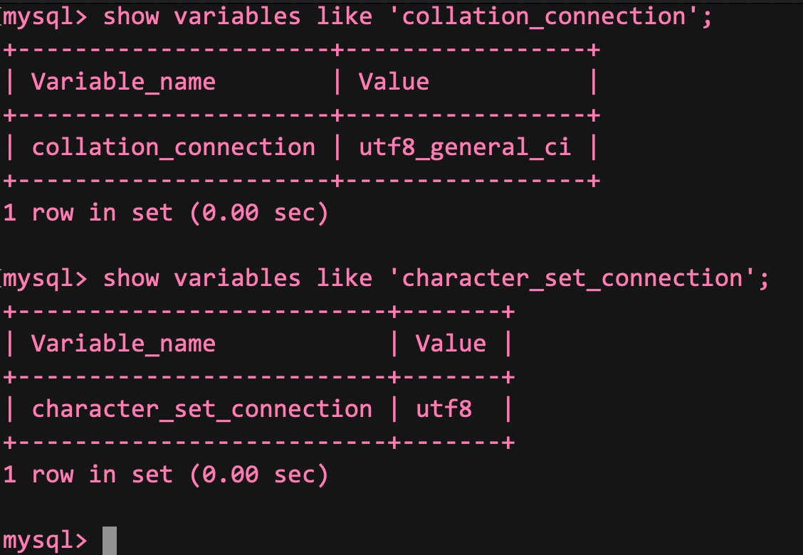


修改:

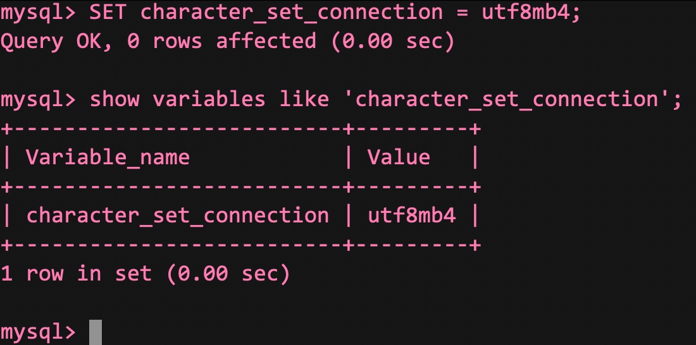


查看列的比较规则

syntax:

```mysql
SHOW FULL COLUMNS FROM table_name;
```


Eg:

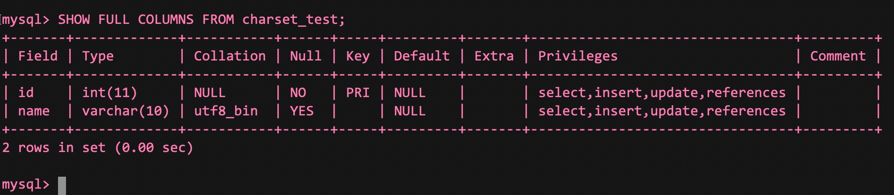


#### 4) server response

- server通过character_set_connection编码进行匹配比较后，通过SESSION级别的character_set_results返回结果
- 其同样可以通过SET来修改


查看:

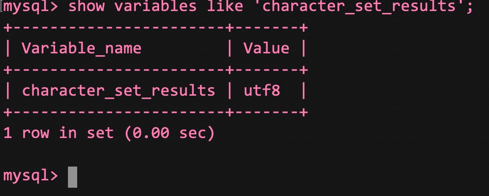


修改:

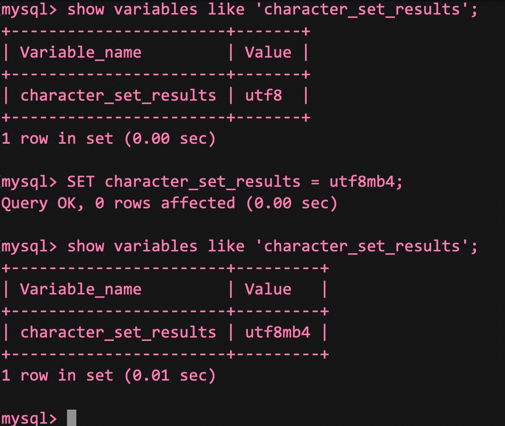


#### 5) client receive response

- client接收响应后会以其自身的字符编码来显示(UNIX默认以utf8来显示)


### 默认情况

- 如果client未指定字符集，则使用client系统的字符集，如果MySQL并不支持该charset，则使用MySQL默认的charset
- **在MySQL5.7及之前的版本中，默认charset为latin1**，之后为utf8mb4
- 如果使用了dafault_character_set启动项，则忽略client系统的字符编码


批量修改字符集:

- 通过SET NAMES可以**一次修改character_set_client/connection/results三个变量**

syntax:

```mysql
SET NAMES charset_name;
```

****


# 四、InnoDB存储结构

- **从MySQL5.5.5开始，InnoDB作为MySQL的默认存储引擎**
- InnoDB**在处理数据时会将Disk里的数据加载到memory里**，每次**读取和写入的单位为页，其默认大小为16KB**
- 变量"innodb_page_size"表明了innodb存储引擎每页的大小，**该变量无法在运行过程中修改**

查看页的大小:

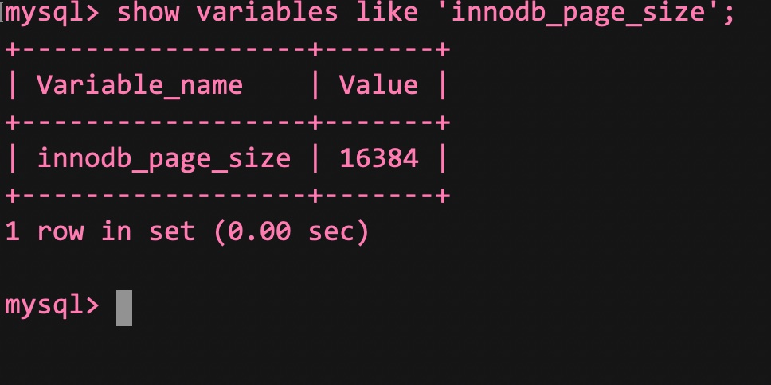


## 1. InnoDB行格式

- 我们写入的每条数据作为一条记录，**记录在表中的存放形式由行格式决定**
- 目前的四种行格式: COMPACT, REDUNDANT, DYNAMIC, COMPRESSED
- 指定/修改行格式:

```mysql
CREATE TABLE table_name(
column type
...
)CHARSET=charset_name ROW_FORMAT=row_format_name;
```


```mysql
ALTER TABLE table_name ROW_FORMAT=new_row_format_name;
```


Eg:

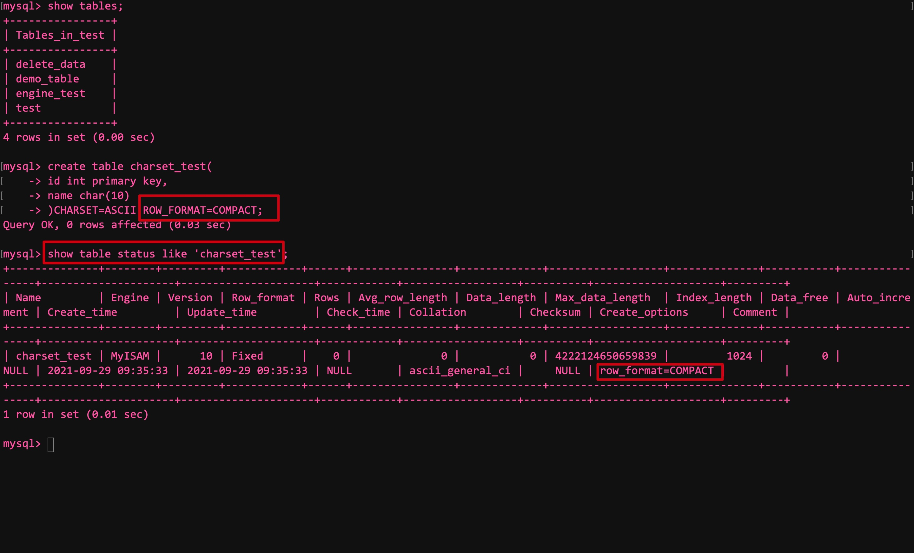


查看表的行格式等数据

syntax:

```mysql
SHOW TABLE STATUS LIKE 'table_name';
```


### COMPACT

一条COMPACT行格式的记录组成:

|                  |            |            |         |      |         |
| :--------------: | :--------: | :--------: | :-----: | :--: | :-----: |
| 变长字段长度列表 | NULL值列表 | 记录头信息 | 列1的值 | ...  | 列n的值 |

- **前三列为记录的额外信息**，其余为记录的真实数据


#### 1) 记录的额外信息

- 其有三个部分: 变长字段长度列表、NULL值列表、记录头信息


##### 1. 变长字段长度列表

- 由于**一些变长的数据类型存储数据的字节数不固定**，所以需**要存储字段所占用的实际字节数**(不然server会懵逼的)
- 由此可知，**存储变长字段会占用两部分空间**: **数据占用的字节数，数据内容**。且**分别位于一条记录的两个部分中**
- 该列表存储的变长字段字节数，**会按照列顺序的逆序进行存放**
- InnoDB**在读取数据前会先查看表结构**，如果变长字段允许存储的最大字节数(W * M)都小于255，则其数据长度用一个字节表示
- 该列表**不存储为NULL的数据**
- 如果表中**所有的列都没使用变长数据类型，或者所有的变长数据列的值都为null，则该列表不存在**


实例:

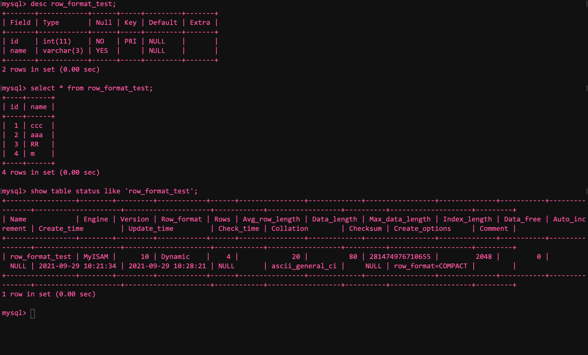

- 该表采用ASCII字符集编码，所以一个字符需要使用一个字节进行编码
- 对于name字段中的数据'aaa'，其包含三个字符，在ASCII中一个字符使用一个字节，所以该条数据占用空间为3字节
- 因为变长字段长度在记录时按照列顺序的逆序，所以对于第一条记录效果如下:

|  03  | NULL值列表 | 记录头信息 | 列1  | 。。。 | 列n  |
| :--: | :--------: | :--------: | :--: | :----: | ---- |

- 实际上没有空格


对于内容较长的字段:

- 如果W * M ≤ 255(该字段最大存储字节数)，则只用一个字节(2^8)表示变长数据占用的字节数
- 否则分情况:
- L ≤ 127，则使用1个字节(2^7)
- 否则使用两个字节


说明:

- W为**字符集规定的表示单个字符能用最长的字节数**(ASCII为1，utf8mb为4)
- M为该类型中**存储字符的最大数量**，即varchar(10)中的10
- L为**数据实际占用的字节数**


比如对于该实例:

- W为1，因为charset为ASCII
- M为3，因为varchar(3)
- 对于数据'ccc'，其实际所占字节数为3，所以L为3


##### 2. NULL值列表

- 该列表**记录所有值为NULL的列**(在一条记录中)
- 如果**列为primary key或者被NOT NULL修饰，则NULL值列表不计入**(不计入不为null的列)
- 同变长字段长度列表相同，**如果所有的列中都没有值为NULL的，则该列表不存在**
- 该列表同样通过列顺序的逆序存储，每个列都用一个二进制位存储。**该位为1，则该列的值为null，为0则反之**
- 该**列表必须使用整数个字节位表示，不足则高位补0**
- 如果表中可以为null的列有9个，则使用2个字节表示


实例:

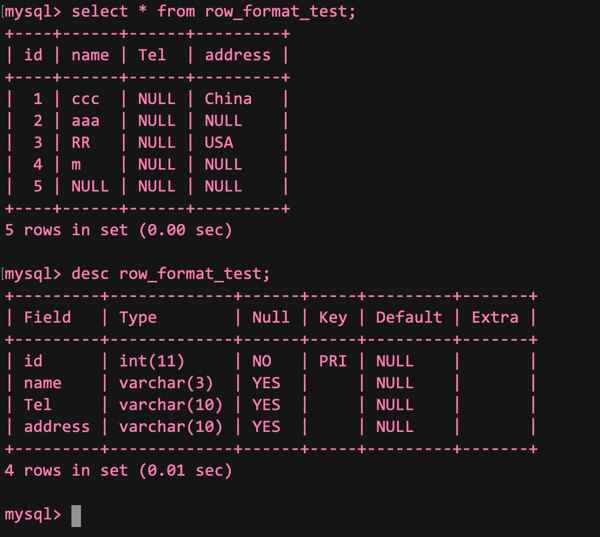

- 该表主键为列id，对于第一条记录: Tel字段值为NULL，所以记录为010(按照adress -> Tel -> name的顺序)
- 对于第二条记录: 110，高位补零后: 0000 0110


填充NULL值列表后第二条记录:

|  3   | 0000 0110 | ...  | ...  | ...  | ...  |
| :--: | :-------: | :--: | :--: | :--: | :--: |

（aaaa, null, null）


第一条记录:

| 05 03 | 0000 0010 | ...  | ...  | ...  | ...  |
| :---: | :-------: | :--: | :--: | :--: | :--: |


##### 3. 记录头信息(了解)


#### 2) 记录的真实数据

- 除了手动添加的数据外，MySQL还会默认添加一些列(隐藏列)

|   Column    | Is necessary | Space  |         Description          |
| :---------: | :----------: | :----: | :--------------------------: |
|  DB_ROW_ID  |      No      | 6bytes | ROW_ID, Unique mark a record |
|  DB_TRX_ID  |     Yes      | 6bytes |        Transaction ID        |
| DB_ROLL_PRT |     Yes      | 7bytes |      roll back pointer       |


- InnoDB的主键策略: 优先使用用户指定的主键，如果如果没有指定则选一个NOT NULL修饰的UNIQUE键作为主键
- **如果两者都没有，则自动添加隐藏列"DB_ROW_ID"作为主键**
- 除了第一个可选，其余两个是必须的


#### 3) CHAR(M)存储

- 对于一个CHAR(M)类型的列，虽然其不是变长数据类型，但**如果其对应的字符集是变长的(如utf8)**，则其占用的字节数同样会被保存在变长字段长度列表中
- 在COMPACT行格式中，**如果采用变长字符集，则CHAR(M)列至少占用M个字节，如采用utf8编码的char(10)，一个字符至少占用10个字节**
- 这样设计的初衷是**为了方便修改，而不需要动态的分配对应的空间**


### REDUNDANT(了解)

- 其在MySQL5.0之前一直使用


### 溢出列

- 当一列或多列中的数据所占的字节数大于页的大小时(16KB)，只会存储数据的一部分，其余部分存储到其他页中，记录后半部分用20个字节存储指向剩余数据的页地址
- 对于COMPACT和REDUNDANT行格式，如果列的记录数据过大，则只存储前768字节，剩余数据存储在其他页中(溢出页)
- 对于表中需要使用溢出页来存储数据的列来说，其被称为溢出列(off-page列)
- VARCHAR(M), TEXT, BLOB都可能成为溢出列


溢出页的临界点

- 每页需存储的额外信息需要132字节(规定！)
- MySQL中规定一页中至少两行记录(两行数据)
- 每条记录中的额外信息需要27bytes
- 溢出页没有这些规定

参照以上的规则可得:

132 + 2 * (27 + n) < 16384

(仅作为参考，因为实际情况中每页不一定只有两条记录)


### DYNAMIC/COMPRESSED

- MySQL5.7的默认ROW_FORMAT为DYNAMIC
- 在处理溢出数据时，DYNAMIC页中不会存储任何真实数据，**而是全部存储在溢出页中**
- COMPRESSED会使用压缩算法

****


# 五、InnoDB索引页结构

- page是InnoDB管理存储的基本单位，有多种不同的page存在
- 存放第四章中记录的page被称为INDEX页
- 每个页中有多条记录，每条记录的结构对应第四章的结构


## 1. 索引页结构概述

(了解)


|    **File Header**     |
| :--------------------: |
|    **Page Header**     |
| **Infimum + Supremum** |
|    **User Records**    |
|     **Free Space**     |
|   **Page Directory**   |
|    **File Trailer**    |


Description:

|        Name        |   Space   |            Description             |
| :----------------: | :-------: | :--------------------------------: |
|    File Header     |  38Bytes  |        General Info of page        |
|    Page Header     |  56Bytes  | Some exclusive info. of index page |
| Infimum + Supremum |  26Bytes  |        Two virtual records         |
|    User Records    | Unconfirm |    User storage record content     |
|     Free Space     | Unconfirm |           Not used Space           |
|   Page Directory   | Unconfirm |    Relative location of records    |
|    File Trailer    |  8Bytes   |      Check integrity of page       |


## 2. 记录在页中的存储

- 我们添加的数据按照指定的ROW_FORMAT存储在User Record部分
- 最初生成页时并没有User Record部分，而是插入记录时从Free Space中划分空间


### 记录中的记录头


实例:

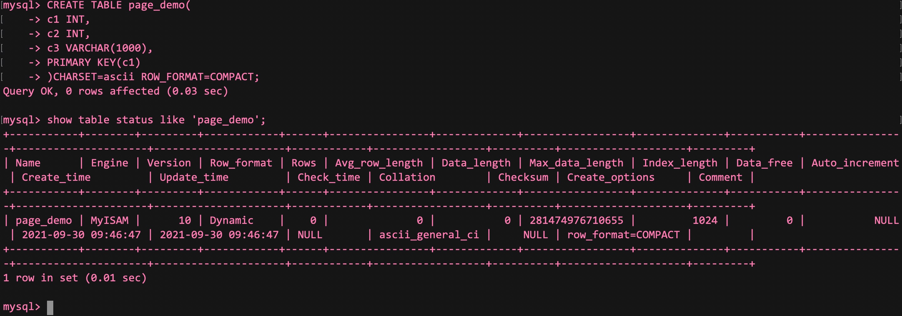

- charset为ASCII，ROW_FORMAT为COMPACT


一条记录中记录头的属性:

|     Name     | Byte |                         Description                          |
| :----------: | :--: | :----------------------------------------------------------: |
|   预留位1    |  1   |                            No use                            |
|   预留位2    |  1   |                            No use                            |
| deleted_flag |  1   |                          is deleted                          |
| min_rec_flag |  1   | Min item record <br />in the each level' non-leaf node in B+ tree |
|   n_owned    |  4   |             The number of records in each group              |
|   heap_no    |  13  |   The relative location of the current record in page heap   |
| record_type  |  3   | 0 means common, 1 means non-leaf node in B+ tree<br />2 means Infimum, 3 means Supremum |
| next_record  |  16  |           The relative position of the next record           |


测试数据:

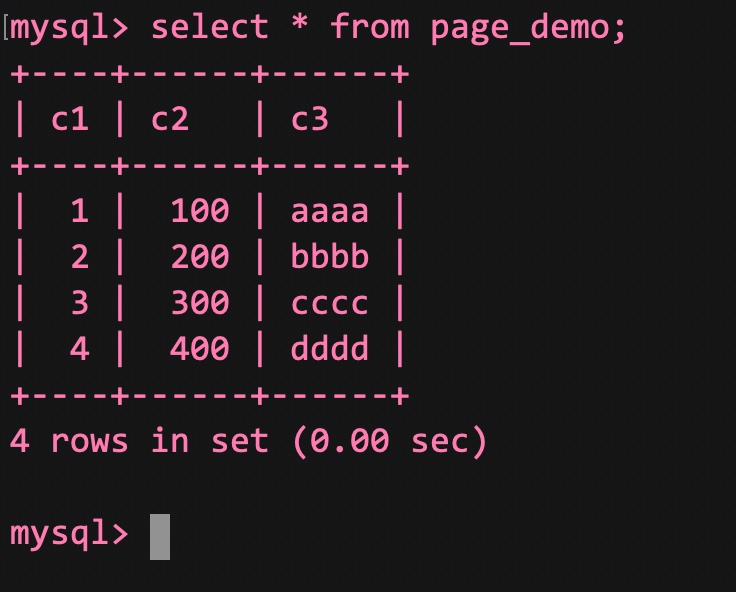


插入的记录在索引页中User Page部分的表示:


1st:

| deleted_flag | Min_rec_flag | n_owned | heap_no | record_type | next_record | data | data | data | others |
| :----------: | :----------: | :-----: | :-----: | :---------: | :---------: | ---- | ---- | ---- | ------ |
|      0       |      0       |    0    |    2    |      0      |     32      | 1    | 100  | aaaa | ...    |


2nd:

| deleted_flag | Min_rec_flag | n_owned | heap_no | record_type | next_record | data | data | data | others |
| :----------: | :----------: | :-----: | :-----: | :---------: | :---------: | ---- | ---- | ---- | ------ |
|      0       |      0       |    0    |    3    |      0      |     32      | 2    | 200  | bbbb | ...    |


3rd:

| deleted_flag | Min_rec_flag | n_owned | heap_no | record_type | next_record | data | data | data | others |
| :----------: | :----------: | :-----: | :-----: | :---------: | :---------: | ---- | ---- | ---- | ------ |
|      0       |      0       |    0    |    4    |      0      |     32      | 3    | 300  | cccc | ...    |


4th:

| deleted_flag | Min_rec_flag | n_owned | heap_no | record_type | next_record | data | data | data | others |
| :----------: | :----------: | :-----: | :-----: | :---------: | :---------: | ---- | ---- | ---- | ------ |
|      0       |      0       |    0    |    5    |      0      |    -111     | 4    | 400  | dddd | ...    |

- **注意：**省略了预留位1, 2


#### deleted_flag

- 用来标记该记录是否被删除，占用1bit，记录被删除则记为1
- 没错，**删除数据后，记录不会真正的删除，空间也不会被回收**。记录之间形成了一条链表，删除记录时则断开该链表即可O(1)
- 被"删除"的记录会组成一个"垃圾链表"，该链表占用的空间为"可重用空间"
- 如果有新记录插入，则可能会覆盖掉可重用空间


#### min_rec_flag

- 如果是**B+树每层非叶子节点中的最小目录项记录**，则会添加该标记(暂时做了解)


#### n_owned:

(之后讲解)


#### heap_no

- 所有记录在堆中的相对位置，包含deleted_flag为1的记录(堆即为记录紧靠排列形成的结构)
- 处于堆中靠前位置的记录heap_no较小


- **用户插入记录的heap_no从2开始**，0和1是InnoDB在每个页中自动添加的两条伪记录(Infimum和Supremum)，这两条记录的heap_no最小
- **对于完整的记录而言**，比较记录的大小就是比较主键的大小(只是完整的记录)
- InnoDB规定: **任何用户记录都大于Infimum，都小于Supremum**，结构:

|   记录头   |   69 6E 66 69 6D 75 6D 00   |
| :--------: | :-------------------------: |
| **记录头** | **73 75 70 72 65 6D 75 6D** |

数据部分固定，表示两个单词


- 这两条记录单独放在称为"Infimum + Supremum"的部分
- **heap_no在分配后不会改变，即使记录被删除**


#### record_type

(索引部分再讲解)


#### next_record

- 表示从当前记录到下一条记录中真实数据的距离，为正值则说明下一条记录在后面，这样形成了链表
- **如果删除一条记录，则将其next_record值变为0即可**，InnoDB**始终会根据主键维护一个单向链表**
- 如果插入新记录，则会复用原来被删除记录的存储空间

****


## 3. Page Directory

虽然记录被作为链表维护，但查询时并非像普通链表那样一条一条的查询

- InnoDB会将所有的记录(包含Infimum和Supremum但不包含被删除的记录)分作几个组
- 每组**最后一条记录中头信息的n_owned属性表示该组中记录的总数**
- 每组中最后一条记录在page的地址偏移量会被单独提取出来，存储在page中的page Directory部分，该部分中的这些偏移量被称为slot(槽)，每个slot占用2bytes
- 所以Page中的Page Directory就是由slot组成的


Eg:

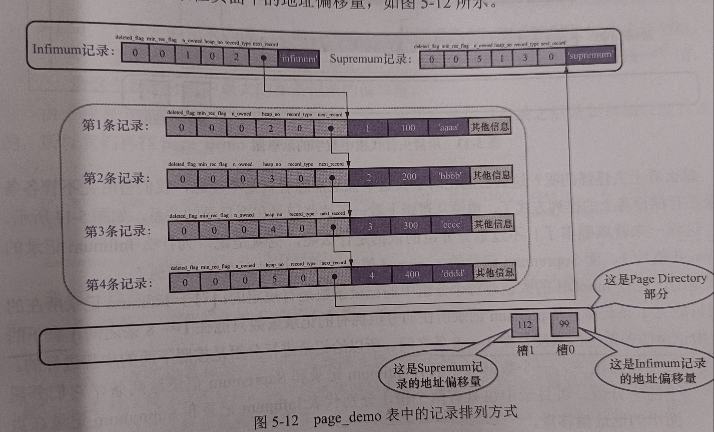


- 实例中有四条用户数据，和两条伪数据(Infimum, Supremum)，InnoDB将它们分为两组:
- 第一组只有infimum，剩余5条记录一组
- 分组的规定:

1. i**nfimum记录所在分组只能有一条记录(自成一组)**
2. Supremum记录所在分组只能为1～8条记录
3. 其余分组的记录只能有4～8条


### 对记录分组的步骤

- 初始情况: 

最初只有两条记录，分属两个组，所以只有两个slot


- 插入数据:

找到比插入数据主键大的最小主键值的slot(地址偏移量)

将该slot对应的n_owned值加一，直到记录数为8个


- 如果插入的记录等于8：

再次插入时将组中记录分为两组，一组4条，一组5条，新增一个slot


Eg:

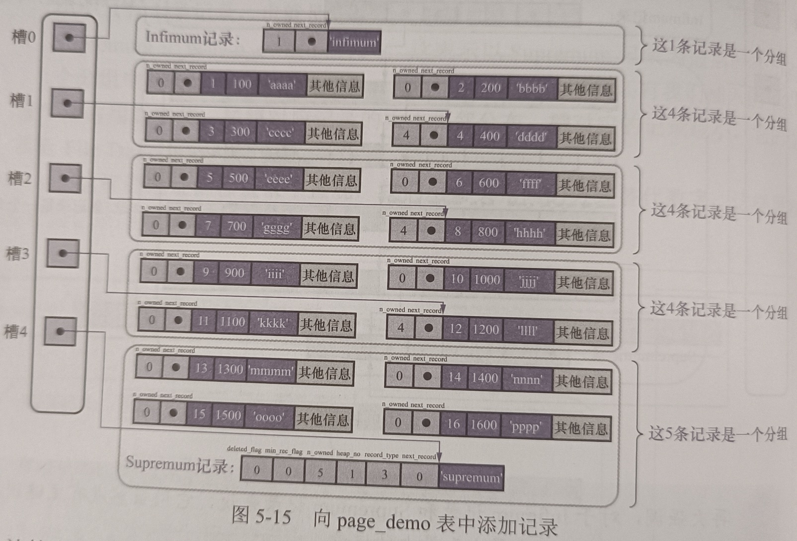

- 通过主键寻找记录，**其实是通过二分法找到对应的slot，再找该分组中对应的记录**


## 4. Page Header

- 该部分**为Index页专有**


结构及描述:

|       Name        | Bytes |                         Description                          |
| :---------------: | :---: | :----------------------------------------------------------: |
| PAGE_N_DIR_SLOTS  |   2   |           The quantity of slots in page directory            |
|   PAGE_HEAP_TOP   |   2   |                The min address in free space                 |
|    PAGE_N_HEAP    |   2   | The first bit means whether the record is compact <br />The left 15 bits means the quantity of record in this heap<br />Include Infimum, Supremum and "deleted" record |
|     PAGE_FREE     |   2   | All the deleted record will build a linked list by next_record <br />PAGE_FREE stand the offset of the linked list in page |
|   PAGE_GARBAGE    |   2   |                 The bytes of deleted records                 |
| PAGE_LAST_INSERT  |   2   |                 The last position to insert                  |
|  PAGE_DIRECTION   |   2   |                  The direction of inserting                  |
| PAGE_N_DIRECTION  |   2   |              The number of continuous inserting              |
|    PAGE_N_RECS    |   2   | The quantity of user records(not include infimum and supremum) |
|  PAGE_MAX_TRX_ID  |   8   |      The max transaction ID to modify the current page       |
|    PAGE_LEVEL     |   2   |           The level in B+ tree of the current page           |
|   PAGE_INDEX_ID   |   8   |                The index of the current page                 |
| PAGE_BTR_SEG_LEAF |  10   |                             ...                              |
| PAGE_BTR_SEG_TOP  |  10   |                             ...                              |


### PAGE_DIRECTION

- 如果插入记录的主键值大于上一条记录，则该条记录的插入方向为"右边"，反之为"左边"，其状态用PAGE_DIRECTION表示


### PAGE_N_DIRECTION

- 如果连续几次插入的方向一致，则InnoDB会记录下插入的数量，该数量用PAGE_N_DIRECTION表示
- 一旦插入的方向发生变化，则该值清零


## 5. File Header


结构/描述

|               Name                | Bytes |                         Description                          |
| :-------------------------------: | :---: | :----------------------------------------------------------: |
|      FILE_PAGE_SPACE_CHKSUM       |   4   | 在4.0.14之前，其用来表示页面所在的表空间ID <br />现在用来表示页的校验和 |
|         FILE_PAGE_OFFSET          |   4   |                             页号                             |
|          FILE_PAGE_PREV           |   4   |                         上一页的页号                         |
|          FILE_PAGE_NEXT           |   4   |                         下一页的页号                         |
|           FILE_PAGE_LSN           |   8   |          页面被修改时对应的LSN(Log Sequence Number)          |
|          FILE_PAGE_TYPE           |   2   |                           页的类型                           |
|        FILE_PAGE_FLUSH_LSN        |   8   |                             ...                              |
| FILE_PAGE_ARCH_LOG_NO_OR_SPACE_ID |   4   |                             ...                              |


### FILE_PAGE_SPACE_OR_CHKSUM

- 其代表当前page的校验和
- 通过算法用一个短的string代表一个长的string，这个短的string就代表校验和
- 省去了长字符比较的时间损耗


### FILE_PAGE_OFFSET

- 页面的页号，InnoDB通过它来唯一定位一个page


### FILE_PAGE_TYPE

- page的类型:

|           Name           | Hexadecimal |            Description             |
| :----------------------: | :---------: | :--------------------------------: |
| FILE_PAGE_TYPE_ALLOCATED |   0x0000    |              Not used              |
|    FILE_PAGE_UNDO_LOG    |   0x0002    |           undo log page            |
|     FILE_PAGE_INODE      |   0x0003    |  The info. of storage paragraphs   |
| FILE_PAGE_IBUF_FREE_LIST |   0x0004    |     "Change Buffer" free list      |
|  FILE_PAGE_IBUF_BITMAP   |   0x0005    |   Attribution of "Change Buffer"   |
|    FILE_PAGE_TYPE_SYS    |   0x0006    |       store some system data       |
|  FILE_PAGE_TYPE_TRX_SYS  |   0x0007    |   The data of transaction system   |
|  FILE_PAGE_TYPE_FSP_HDR  |   0x0008    |   The info. of table head space    |
|   FILE_PAGE_TYPE_XDES    |   0x0009    | Some attributions in storage space |
|   FILE_PAGE_TYPE_BLOB    |   0x000A    |           overflow page            |
|     FILE_PAGE_INDEX      |   0x45BF    |             Index Page             |


### FILE_PAGE_PREV/FILE_PAGE_NEXT

- **对于溢出的数据**，InnoDB会将溢出的记录存储到溢出页中
- 这两个属性代表该index页上一页和下一页的页号(双向链表)
- **并不是所有类型的页都有这个属性**


## 6. File Trailer

- 为了防止页面记录更改后没有及时写到磁盘中，**File Trailer中的数据用来检测一个page是否完整**
- 该部分由8bytes组成


### 前四个bytes

- 代表page的校验和，其与File Header的校验和对应
- 校验的方法:

先将File Header的检验和写入到磁盘中，**待所有记录都写入到磁盘后**，再将校验和写入到File Trailler中

如果两个校验和一致，则说明页面刷新成功


### 后四个bytes

- 代表最后修改时对应的LSN后四个bytes，也用于校验page的完整性

****


# 六、B+树索引

- 通过主键进行查询:
- 因为每个页的Page Directory部分都存储了该页面中每个记录分组后的slot，所以可以根据每个分组中的最大主键值通过二分查找的方式获取目标记录主键所在的分组，之后遍历该分组中的记录即可(记录通过链表的形式连接)


## 1. 无索引时查找


### 在一个页中

- **非主键列**的查找:
- 因为页中没有针对非主键列建立所谓的Page Directory页目录，所以无法通过二分的方式进行查找，**只能依次遍历所有的记录**


### 在许多页中

- 如果我们所需的记录数据在多个页中，**在没有索引的前提下**，只能依照页与页之间形成的双向链表依次寻找
- 找到记录所在的页之后再重复在一个页中查找的步骤


## 2. 索引

实例:

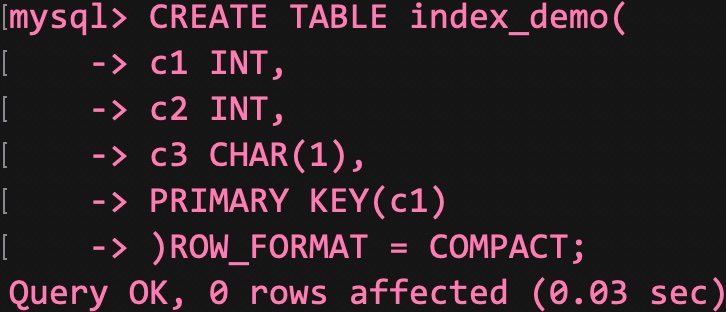


先导:

回顾一下一条记录中的部分结构

| record_type | next_record |  c1  |  c2  |  c3  | Others |
| :---------: | :---------: | :--: | :--: | :--: | :----: |


- record_type: 属于记录头的部分，表示当前记录的类型，0表示普通记录(用户记录)，2表示Infimum，3表示Supremum(1之后再说)
- next_record: 从当前到下一条记录真实数据的真实距离(可以理解为链表中的next)


### 简单的索引Demo

- 为了能够快速定位，我们需要为index_page建立一个目录页，建立的前提:
- 下一个index_page中所有记录的主键值必须大于上一页


实例:

- 假如一页中只能存放三条用户记录:

```mysql
INSERT INTO index_demo VALUE(1, 4, 'u'), (3, 9, 'd'), (5, 3, 'y');
```

Page:

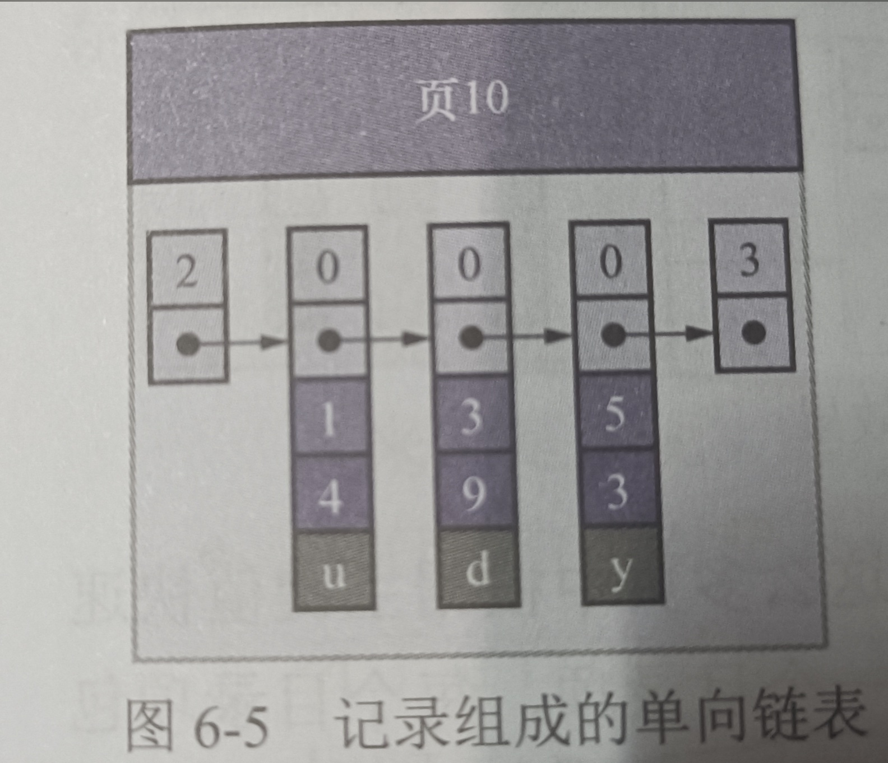


- 此时再次插入一条记录，则必须分配一个新页来存储:


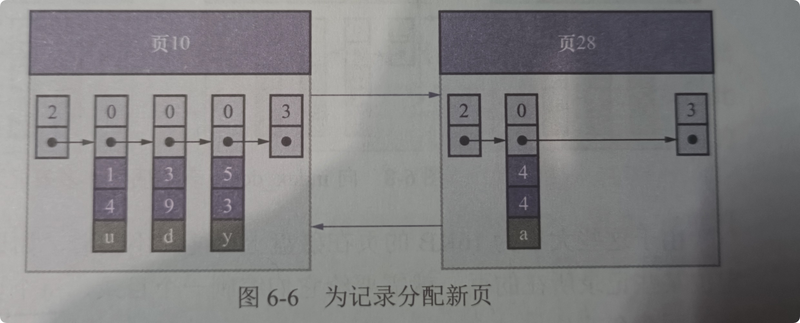

- 新分配的index_page可能与之前的page并不是物理临近的，但InnoDB会尽量让它们在一起


如图6-6，其中页28中的记录主键值为4，小于页10中主键值为5的记录，所以需要移动这两条记录:

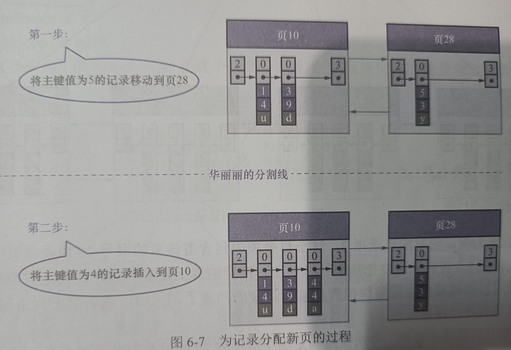

- 在对记录进行CRUD时，必须保持这项主键值原则，所以我们必须通过记录移动等操作来保持这种状态
- **这个过程称为页分裂**


当页的数量变多后，我们就需要先定位到记录所在的页，此时我们需要编制一个目录，其中的一个目录项对应一页中记录的**最小主键值和页号**

- 一页中记录的**最小主键值**: key
- 页号: page_no


效果大致如下:

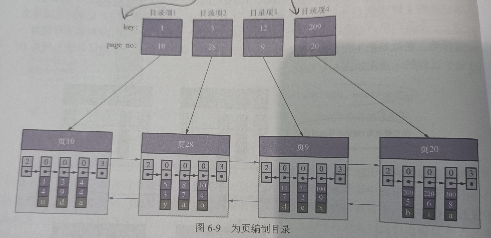


- 编制完目录后，我们根据主键值20查找记录的步骤:
- 根据二分法在目录中找到目录项3，对应页号9
- 之后根据第五章中所讲的，在页中的page directory部分通过二分法查找分组，之后根据链表一个一个查找记录即可


- **我们在这里创建的目录就是索引！**


### InnoDB中的索引

- 在上一步我们创建的简易索引中，我们创建的目录项**都是物理上紧挨着的**，但这样做会有两个问题:

1. 如果记录数量达到一定程度，则存储对应目录项**所需的连续空间也很大**，这显然不现实
2. 如果删除其中的一个目录项，或者在其中添加一个目录项，则需要移动后面所有的目录项，**也就是对数组进行增/删的复杂度O(n)**。但如果不移动留出空间的话又会显得很浪费空间


- 为了避免这两个问题，InnoDB将index_page的结构搬到了索引中，**只不过该页面中只存储主键和页号而已**
- 为了区分目录项记录和用户记录，**使用记录中的record_type即可(目录项记录标为1即可)**
- **索引和index_page其实都属于index_page，只是存储的记录类型不同而已**

Eg:

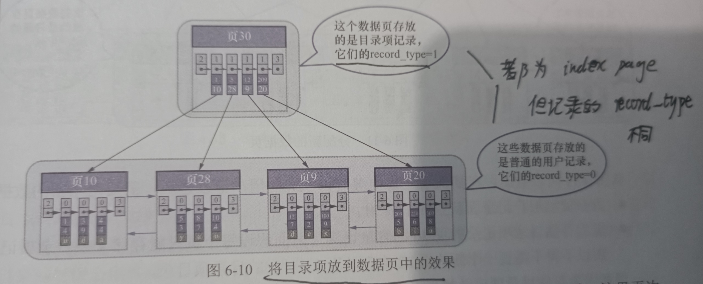


普通记录与目录项记录的区别:

- **目录项记录的record_type为1，普通用户记录为0**，Infimum为2，Supremum为3
- 一条目录项记录中**只有主键值(页中的最小主键值)，和页号两列**，普通记录中的列由用户定义，且还具有InnoDB自行添加的一些隐藏列
- 对于属性min_rec_flag，只有目录项记录才可能为1，普通用户记录都为0


根据主键值查找记录的方式同之前的简单索引一致

- 虽然目录项记录所需空间小，但如果用户记录变多，对应的目录项记录也会变多。一个页中也无法容纳所有的目录项记录，此时也需要再用一个新的页来存放新的目录项记录:

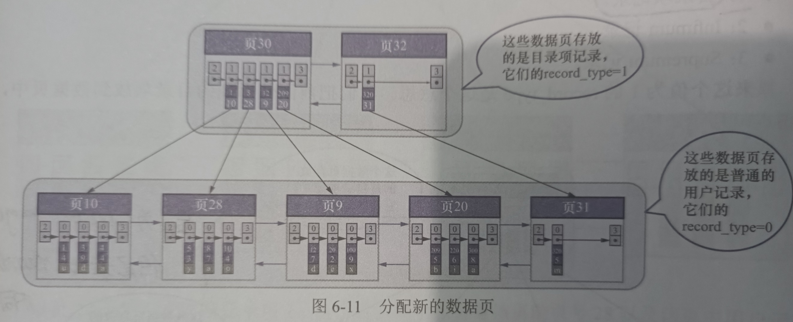


- 如果这些目录项记录一多，那么又回到了之前没有索引的用户记录页一样了，需要依次寻找，很麻烦
- 此时InnoDB以同样的思路在存储目录项的页上再创建一层索引即可:

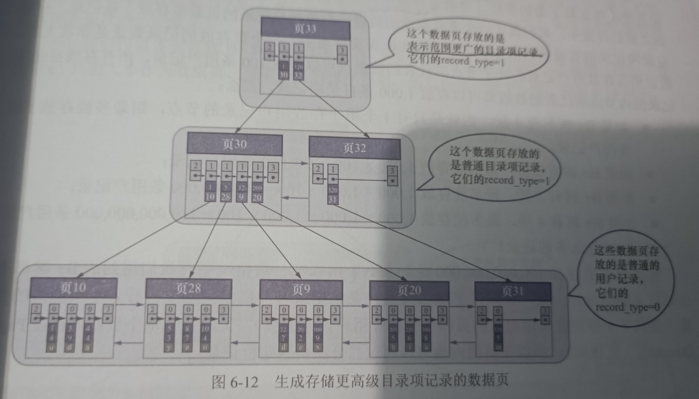


- **图6-12中的数据结构便是B+树！**
- 对于所有的页(不管是存储用户记录还是目录项记录)，都视作B+树的节点
- **真正的用户记录都在B+树的叶子结点/叶结点**
- **其余存放目录项记录的节点称为非叶子结点/內结点**
- **最上面的节点称作根节点**


- 规定**叶子结点所在的层级为第0层**(存储用户记录的页)
- 页结构中Page_Header有一个属性为PAGE_LEVEL，其代表了**这个数据页作为结点在B+树中的层级**


#### 1) 聚簇索引

- B+树本身就是一个目录/索引，其有两个特点:


1. 通过记录主键大小对记录和页排序:

- 页(叶子结点和內结点)內记录**按照主键大小顺序排成单向链表**，其中的记录被分成几组，每个组中**最大主键值的记录**在页內的偏移量被当作slot，存放在页的Page Directory部分中，在Page Directory中可以**通过二分法进行查找**
- 同级各个页之间**通过页中记录的主键大小关系排成双向链表**，**用户页和目录项页都遵从这样的方式**


2. B+树的**叶子结点存储了完整的用户记录**(包含隐藏列)


- **如果一颗B+树符合上述两个特点，则为聚簇索引**，该聚簇索引的叶子结点存储所有完整的用户记录
- 聚簇索引不需要显式创建，**InnoDB会自动为我们创建**
- 在InnoDB中聚簇索引又恰好是用户记录/数据的存储方式，所以"索引即数据，数据即索引"


#### 2) 二级索引

- 聚簇索引是基于主键创建的，只有在搜索条件为主键时才有用
- 我们同样可以对非主键列创建相同B+树结构的索引


Eg:

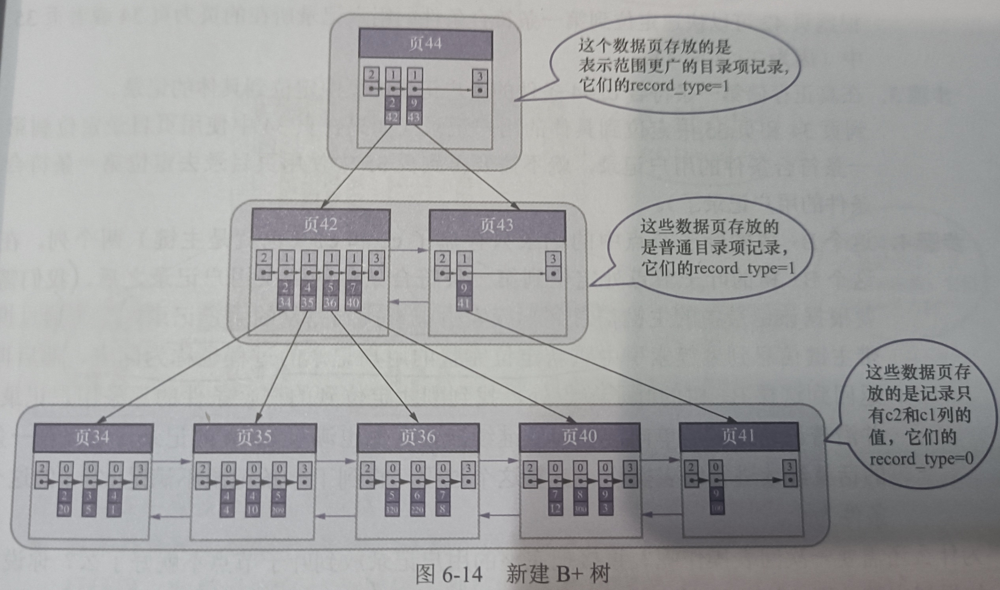


- 该B+树与之前聚簇索引的异同点:


1) 使用对应的**非主键列**对记录和页进行排序:

- 该索引建立后，页中Page_Directory部分中存储的以指定分组中**指定列的最大值记录的偏移量**为基准的slot
- 每个页之间**通过指定列的大小排成双向列表**，用户记录页和目录项页都一样

2. B+树的叶子结点只存储**指定列的值和主键值，并不是完整的记录内容**

3. 其对应的目录项记录为**指定列 + 页号(其实还有主键)**


**注：**因为除了主键外的其他列**可能没有唯一性**，所以在找到对应的第一条记录后，**还需要继续沿着记录组成的链表接着扫描下去**


在二级索引中查找(以c2=4为条件进行搜索):

1. 从根节点开始，确定第一条目录项记录在页42中(目录项记录存储记录的最小值)
2. 在页42中确定其在页34或者35中(不具有唯一性)
3. 在34和35页中定位**第一条符合条件的用户记录**(如果先34页中找到，则不在判断35页)
4. 在该B+的叶子结点中获取对应的用户记录后，还需要**根据记录中的主键到聚簇索引中查找完成的用户记录**(该过程称为回表)，回表一条数据后，**再返回到之前B+树的叶子结点处，从该条记录开始向后继续搜索，每找到一条就回表**，重复操作直到下一条记录不为4


**注:**之所以不在该索引中存放完整的用户记录，是为了不浪费空间，这样的B+树被称为**二级索引/辅助索引**

- 实例中我们将c2列作为索引列，该B+树为为c2列建立的索引
- 聚簇索引和二级索引的行格式相同，只不过二级索引没有聚簇索引那样完整
- 为了区分，聚簇索引叶子结点中的记录称为完整的用户记录，二级索引中的称为不完整的用户记录


#### 3) 联合索引

- 同时为多个列建立索引，即为联合索引


为实例中c2列和c3列建立联合索引:

1. 先同普通索引一样先按照c2列的值进行排序
2. 如果两条记录的c2列值相同，再按照c3列的值排序

Eg:

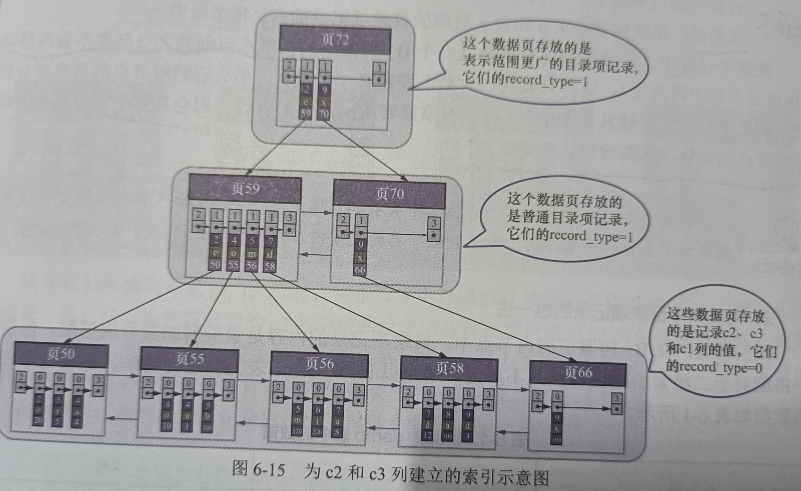

图6-15注意点:

- 每条用户记录只由**c2，c3和主键c1列**组成
- 每条目录项记录只由**c2，c3和页号**组成


像这样**由两列的大小为排序规则构建的B+树称为联合索引/复合索引/多列索引**

其本质也是一个二级索引，与二级索引不同的是，**它根据两列构建一棵树**


### InnoDB中B+树索引注意事项


#### 1) B+树形成的真实过程

- 起初为一张表创建索引时，无论表中有无记录，**都会先行创建一个根节点页面**，最开始没有任何数据时**该根节点没有用户记录和目录项记录**
- 之后向表中插入数据时，**都先把记录存储到该根节点中**
- 在该根节点页面容量使用完之后，如果再插入新的记录，**则会创建一个新页a，并将根节点中所有的用户记录复制到新页a中**，之后对该新页进行页分裂形成新页b，**此时再将所有的记录按照对应列的大小(主键或者其他列)分布到这两个新页中去**，**而原来的根节点则不再存储用户记录了，而是升级为存储目录项记录的页**，之后便把新页a，b中对应的列值(最小主键值/其他列值)和页号存储到原根节点页中即可

**注意：**根节点在创建后便不会再移动位置(根节点页号不变)，这样后续需要使用该索引时，则都会从固定的根节点页开始


#### 2) 內结点中目录项记录的唯一性

- 之前在二级索引中，目录项记录由索引列和页号组成，但有时在插入记录时，二级索引列不具有唯一性，**一旦记录中索引列与页中的索引列大小相同，则新增的记录就不知道放在哪个页中了**
- 为了解决这个问题，**实际的二级索引目录项记录中还有一列主键(对应数据页中的最小主键值)**

Eg:

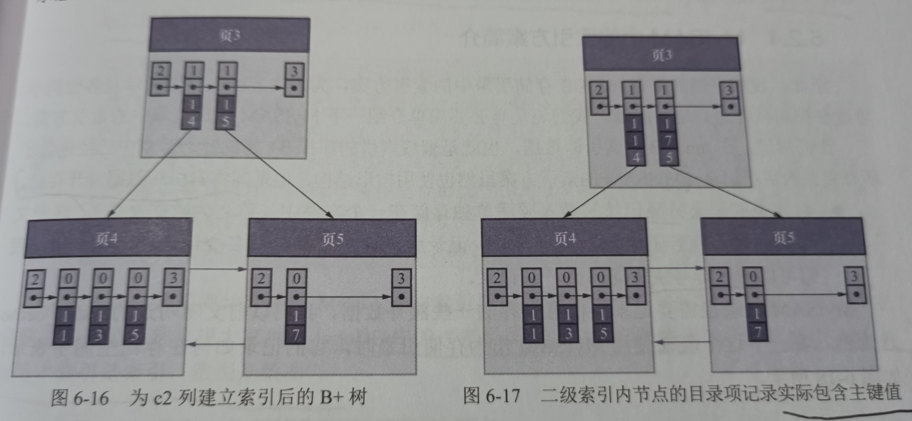

- 这样如果索引列相同，则会比较主键


#### 3) 一页中至少两条记录

- 如果一个节点/页中只存放一条记录，则整个索引层级会变得很高(参照跳表)
- 为了不让B+的层级增长得过高，于是规定一页中至少容纳两条记录


### MyISAM中的索引简介

- MyISAM不同于InnoDB，其将索引与数据分开存储
- 表中的记录**按照插入的顺序**，单独存储在一个文件中(**不分页**)，通过行号就能快速访问一条记录

Eg:

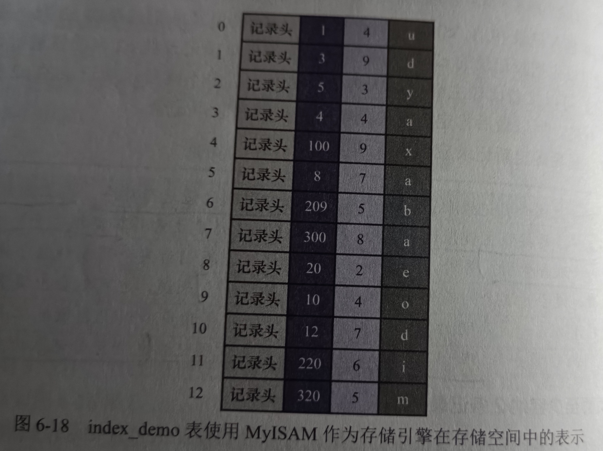


- 由于插入时未按照主键进行排序，所以不能通过二分法查找记录
- MyISAM表会把索引信息单独存储到一个索引文件中，且**会为表的主键单独创建一个索引**(B+树结构)
- 但该索引的叶子结点中的记录**不是InnoDB那样完整的用户记录，而是主键值 + 行号**
- 查找时**根据主键找到对应的行号**，再获取完整记录

**注意：**在InnoDB中，我们根据主键值进行一次查找就能获取记录(聚簇索引)，但**MyISAM的索引需要一次回表**(根据主键获取行号)，所以**MyISAM中的索引全是二级索引！**

- 在MyISAM表中创建普通索引/联合索引时，叶子结点存储的是列值 + 行号，也全都是二级索引

拓展:

- MyISAM的ROW_FORMAT有定长记录格式(Static)，变长记录格式(Dynamic)，压缩记录格式(Compressed)等
- Static即一条记录所占的存储空间固定，这样就能通过行号直接算出记录的地址偏移量(变长格式不行)
- MyISAM的索引在叶子结点处存储该记录的地址偏移量，因此MyISAM的回表操作很快


总结: 在InnoDB中"索引是数据，数据是索引"，在MyISAM中"数据是数据，索引是索引"


### 创建/删除索引


#### 创建


1. 在创建表时创建索引

syntax:

```mysql
CREATE TABLE table_name(
column1 type ...
...
KEY/INDEX index_name(column)
)
```


Eg:

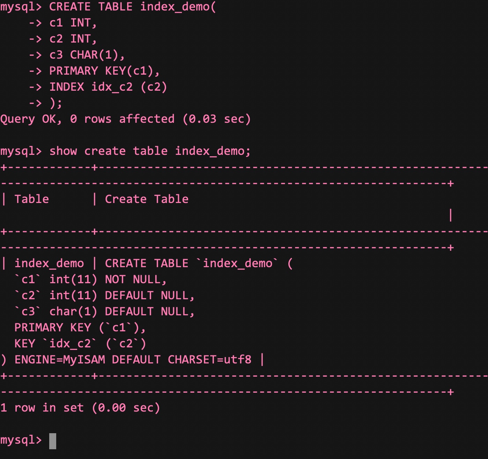


唯一键索引:

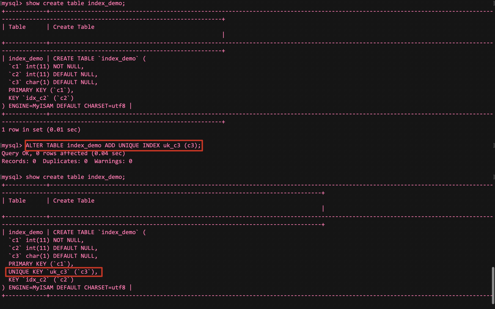


2. 对既存的表添加索引

syntax:

```mysql
ALTER TABLE table_name ADD KEY/INDEX index_name(column);
```


Eg:

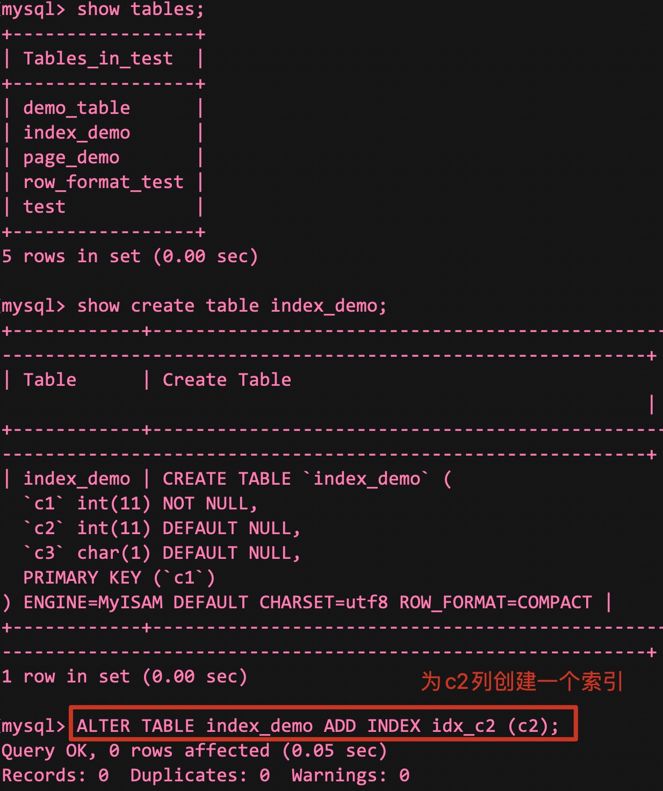


#### 删除


删除既存表中的索引

syntax:

```mysql
ALTER TABLE table_name DROP INDEX/KEY index_name;
```


Eg:

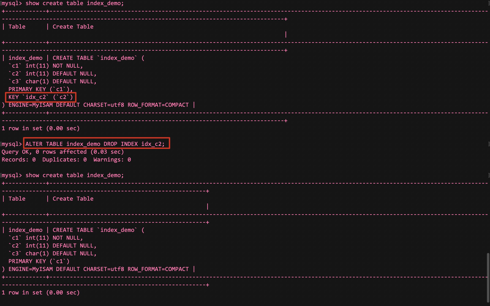


