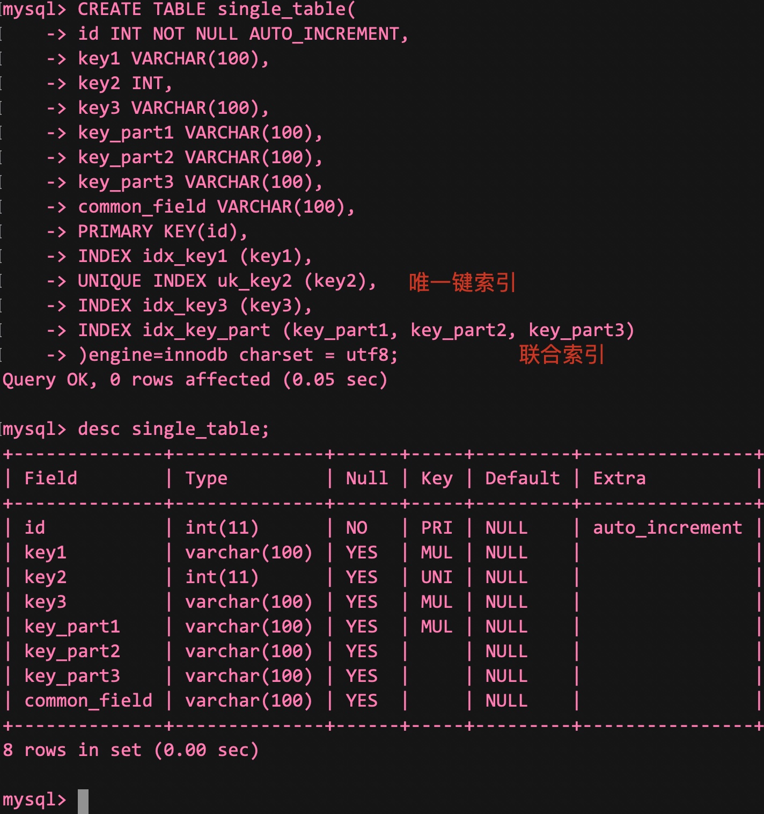
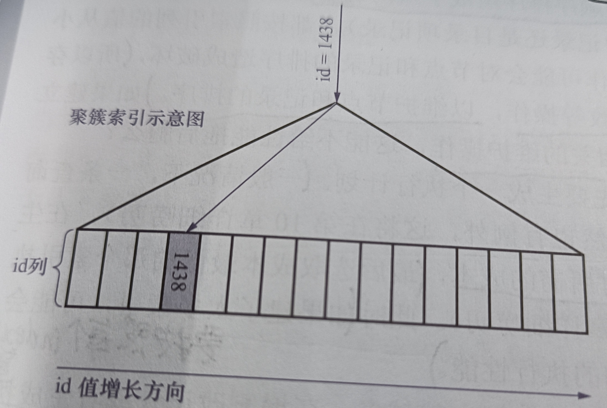
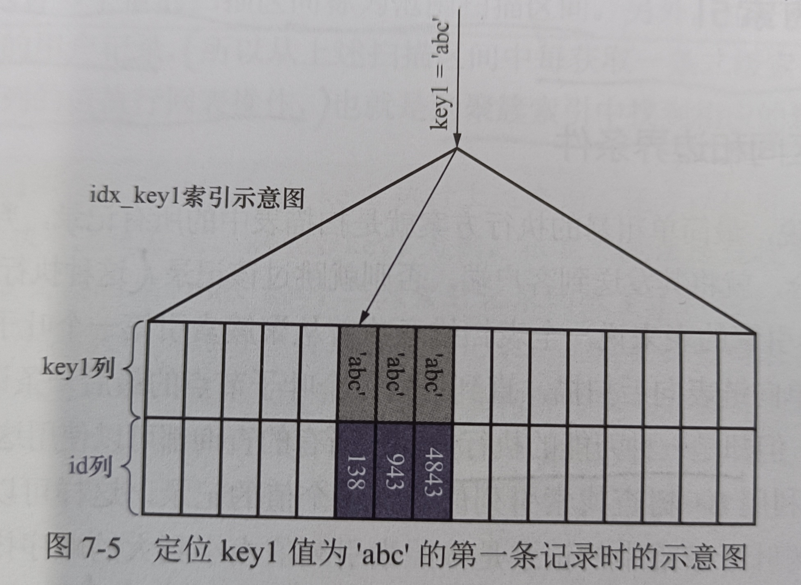
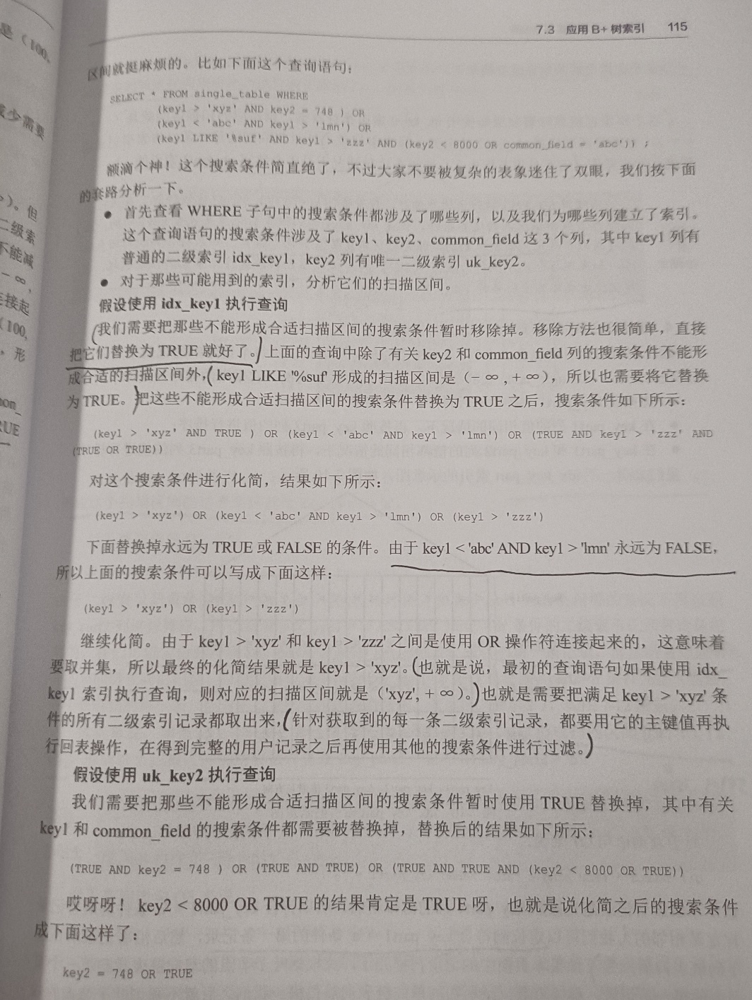
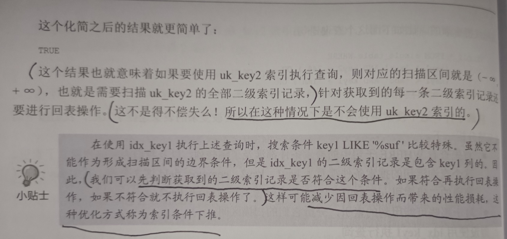
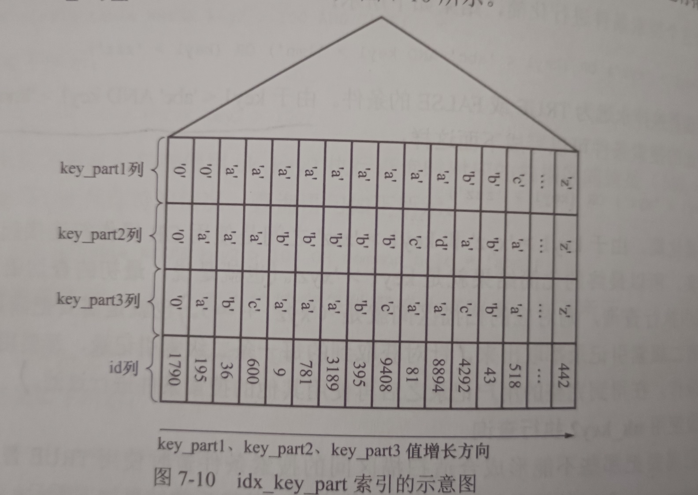
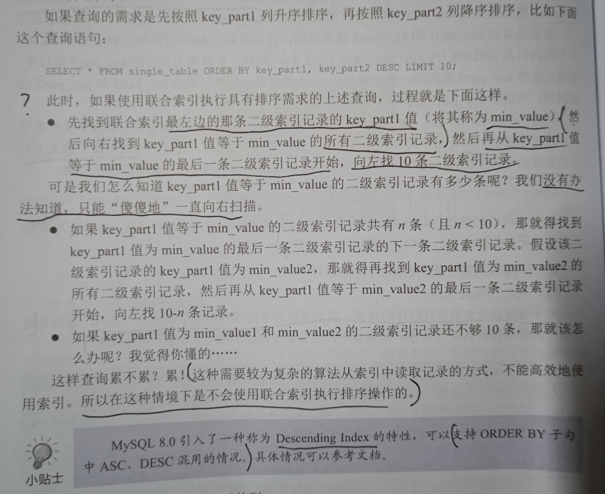

# 七、B+树索引的使用


实例表:




## 1. B+树索引的简化图

假如我们要通过主键在聚簇索引中查找id为1438的记录:



- 该图简化了页结构，且只保留了每条记录中的id列部分


假如我们要通过key1列在二级索引中查找key1为'abc'的记录:



- 定位到第一条key1值为'abc'的记录后，需要沿着记录组成的链表向后扫描(非主键列可能不具有唯一性)


## 2. 索引的代价


### 空间

- 索引本身是一颗B+数，而**每棵B+树中的每一个节点都是一个index_page**，默认占用16KB的空间


### 时间

- 每当对表中的数据进行CRUD时，索引也要进行相应的变化，**用户记录和目录项记录都要重新排序**
- 为了维护排序，**所有的页都又可能会进行页分裂或者页回收**，存储引擎要做出这些操作需要额外的时间


### 拓展

- 在执行一条SQL之前，**都要先生成一个执行计划**
- 生成该计划时，会计算**使用不同的索引进行查询时**所需的成本，最后选取成本最低的那个
- 如果索引过多，则会**导致在成本分析时耗时过多**


## 3. 应用B+树索引

- 对于任何查询来说，最简单的方式就是**扫瞄所有的记录**，**这种执行方案称作全表扫描**
- 该方案对于InnoDB表来说，就是**从聚簇索引的第一个叶子结点开始扫描，直到最后一个叶子结点**
- 全表扫描虽然笨，但是万能的，**对于任何查询都适用**


### 扫描区间/边界条件


Eg SQL1:

```mysql
SELECT * FROM single_table WHERE id >= 2 AND id <= 100;
```


该SQL的搜索步骤:

- 通过主键列id，通过聚簇索引找到id为2的索引记录
- 然后沿着该记录所在链表向后扫描


- 扫描区间为 [2, 100]
- 边界条件为 id >= 2 AND id <= 100

待扫描id值所在的区间为**扫描区间**，形成这个扫描区间的搜索条件称为形成这个扫描区间的**边界条件**


- 对于全表扫描: 其扫描区间为(-∞, +∞)


Eg SQL2:

```mysql
SELECT * FROM single_table WHERE key2 IN (1438, 6328) OR (key2 >= 38 AND key2 <= 49);
```


由该SQL可以得到三个扫描区间:

- [1438, 1438] : key2 IN (1438)
- [6328, 6328] : key2 IN (6328)
- [38, 79] : key2 >= 38 AND key2 <= 49

类似[1438, 1438]和[6328, 6328]这样，**只包含一个值的扫描区间暂时称为单点扫描器**

**包含多个值的称为范围扫描区间**


使用该SQL查询时，根据uk_key2唯一键索引**获取每一条对应的二级索引记录**，**根据这些记录中的主键值再执行回表**

**注：**

1. 我们也可以不使用uk_key2这个索引，如果使用idx_key1索引，则**无法根据WHERE子句的条件在该索引中形成合适的扫描区间**
2. 使用idx_key1执行查询的话，扫描区间为(-∞, +∞)，又因为idx_key1是一个二级索引，所以还需要回表，**效率还不如全表扫描！**
3. 如果使用某个索引执行查询，**无法通过搜索条件形成合适的扫描区间时，则不会考虑使用该索引**


Eg SQL3:

```mysql
SELECT * FROM single_table WHERE key1 < 'a' AND key3 > 'z' AND common_field = 'abc';
```


使用idx_key1索引

- 对应扫描区间为(-∞, 'a')，边界条件为key1 < 'a'，**其余两个条件为普通搜索条件**
- 通过该二级索引获取相关记录后，需要这些记录中的主键值回表获取对应的完整记录，**回表获取记录之后才用剩下两个条件进行判断**


使用idx_key3索引

- 对应扫描区间为('z', +∞)，形成区间的边界条件为key3 > 'z'，**其余两个也是普通搜索条件**
- 通过该二级索引获取相关记录后，需要这些记录中的主键值回表获取对应的完整记录，**回表获取记录之后才用剩下两个条件进行判断**


如果仅通过一个索引进行搜索:

- 需要通过**搜索条件**，获取**合适的扫描区间**，之后在**对应的B+树索引**中去扫描区间中的记录
- 对于每个扫描区间，仅需要定位到该B+索引扫描区间中第一条记录，并沿着该记录所在链表向后扫描，直到某一条不符合为止
- 对于B+树索引，只要索引和常数使用 =, IN, NOT IN, IS NULL, IS NOT NULL, >, <等等则能够形成扫描区间


对于这些操作符需要注意的是:

- IN操作符与若干用OR连接起来的(=)操作符是一样的:

```mysql
SELECT * FROM single_table WHERE key2 IN (1438, 6328);
SELECT * FROM single_table WHERE key2 = 1438 OR key2 = 6328;
```


- !=形成的扫描区间

```mysql
SELECT * FROM single_table WHERE key1 != 'a';
```

该搜索条件形成的扫描区间为(-∞, 'a') 和 ('a', +∞)


- LIKE操作符

只有匹配到了之后才会产生合适的扫描区间


#### 1) 所有搜索条件都能生成合适扫描区间的情况


SQL1:

```mysql
SELECT * FROM single_table WHERE key2 > 100 AND key2 > 200;
```

该SQL的搜索条件可以合并为key2 > 200，扫描区间为(200, +∞)


SQL2:

```mysql
SELECT * FROM single_table WHERE key2 > 100 OR key 2 > 200
```

该SQL的搜索条件可以合并为key2 > 100，扫描区间为(100, +∞)


#### 2) 部分搜索条件不能生成合适扫描区间的情况


SQL1:

```mysql
SELECT * FROM single_table WHERE key2 > 100 AND common_field = 'abc';
```


使用uk_key2索引查询时:

- Key2 > 100可以形成扫描区间(100, +∞)
- 但通过common_field = 'abc'无法在uk_key2中形成扫描区间(-∞, +∞)
- 对两个区间进行合并，则最终形成扫描区间的搜索条件为key2 > 100，最终扫描区间为(100, +∞)


如果将AND换为OR，同样使用uk_key2索引进行查询:

- 将所有用不到uk_key2索引的条件替代为TRUE，所以common_field = 'abc'用TRUE替代:
- SELECT * FROM single_table WHERE key2 > 100
- SELECT * FROM single_table WHERE TRUE
- 此时如果强制使用uk_key2索引，则**需要扫描所有二级索引记录，并都需要回表**，**代价比全表扫描都大所以不考虑使用uk_key2索引**


#### 3) 通过复杂搜索条件获取扫描区间

// Simple but complex

Eg:







#### 4) 使用联合索引执行查询时对应的扫描区间


示例的联合索引结构:




Eg SQL1:

```mysql
SELECT * FROM single_table WHERE key_part1 = 'a';
```

- 先定位到第一条符合key_part1 = 'a'的记录，之后沿着记录组成的链表向后扫描，一个页面扫描完后根据页与页组成的双向链表继续扫描
- 作为二级索引，每条记录都要在聚簇索引中执行回表操作
- 扫描区间为['a', 'a']，边界条件为key_part1 = 'a'


Eg SQL2:

```mysql
SELECT * FROM single_table WHERE key_part1 = 'a' AND key_part2 = 'b';
```

- 先定位到第一条符合key_part1 = 'a' AND key_part2 = 'b'的记录，之后沿着记录所在的链表向后扫描，直到某条不符合为止
- 作为二级索引，每条记录都要在聚簇索引中执行回表操作
- 扫描区间为[('a', 'b'), ('a', 'b')]，边界条件为key_part1 = 'a' AND key_part2 = 'b'


Eg SQL3:

```mysql
SELECT * FROM single_table WHERE key_part1 = 'a' AND key_part2 = 'b' AND key_part3 = 'c'
```

- 先定位到第一条符合key_part1 = 'a' AND key_part2 = 'b' AND key_part3 = 'c'的记录，之后沿着记录所在的链表向后扫描，直到某条不符合为止
- 作为二级索引，每条记录都要在聚簇索引中执行回表操作
- 扫描区间为[('a', 'b', 'c'), ('a', 'b', 'c')]，边界条件为key_part1 = 'a' AND key_part2 = 'b' AND key_part3 = 'c'


Eg SQL4:

```mysql
SELECT * FROM single_table WHERE key_part1 < 'a';
```

- 先定位到第一条符合key_part1 < 'a'的记录，之后沿着记录所在的链表向后扫描，直到某条不符合为止
- 作为二级索引，每条记录都要在聚簇索引中执行回表操作
- 扫描区间为(-∞, 'a')，边界条件为key_part1 < 'a'


Eg SQL5:

```mysql
SELECT * FROM single_table WHERE key_part1 = 'a' AND key_part2 > 'a' AND key_part < 'd'
```

- 先定位到第一条符合key_part1 = 'a' AND key_part2 > 'a' AND key_part < 'd'的记录，之后沿着记录所在的链表向后扫描，直到某条不符合为止
- 作为二级索引，每条记录都要在聚簇索引中执行回表操作
- 扫描区间为(('a', 'a'), ('a', 'd'))，边界条件为key_part1 = 'a' AND key_part2 > 'a' AND key_part < 'd'


Eg SQL6:

```mysql
SELECT * FROM single_table WHERE key_part2 = 'a';
```

- 由于该联合索引/二级索引不是按照key_part2的值进行排序的，索引不能通过WHERE子句获取有效的扫描区间，因此不会使用idx_key_part索引来执行该查询


Eg SQL7:

```mysql
SELECT * FROM single_table WHERE key_part1 = 'a' AND key_part3 = 'c';
```

- 对于所有符合key_part1 = 'a'的二级索引记录来说，并不是根据key_part3进行排序的，所以通过key_part3 = 'c'无法进一步减少需要扫描的记录数量
- 作为二级索引，每条记录都要在聚簇索引中执行回表操作
- 扫描区间为['a', 'a']，边界条件为key_part1 = 'a'


**注：**

1. 在SQL7中，如果没有开启**索引下推**特效，则会先执行回表操作，再通过key_part3 = 'c'进行判断
2. 如果开启后，则会先进行判断，在进行回表操作，不符合则不进行回表操作，**从MySQL5.6中引入了该特性，并默认开始**


Eg SQL8:

```mysql
SELECT * FROM single_table WHERE key_part1 < 'b' AND key_part2 = 'a'
```

- 对于所有符合key_part1 < 'b'的二级索引记录来说，并不是根据key_part2进行排序的，所以通过key_part2 = 'a'无法进一步减少需要扫描的记录数量
- 作为二级索引，每条记录都要在聚簇索引中执行回表操作
- 扫描区间为[-∞, 'b']，边界条件为key_part1 < 'b'


Eg SQL9:

```mysql
SELECT * FROM single_table WHERE key_part1 <= 'b' AND key_part2 = 'a';
```

- 对于所有符合key_part1 = 'b'的二级索引记录来说，是根据key_part2进行排序的，所以可以通过key_part2 = 'a'进一步减少需要扫描的记录数量
- 对于所有符合key_part1 < 'b'的二级索引记录来说，并不是根据key_part2进行排序的，所以通过key_part2 = 'a'无法进一步减少需要扫描的记录数量
- 作为二级索引，每条记录都要在聚簇索引中执行回表操作
- 扫描区间为[(-∞, -∞), ('b', 'a')]，边界条件为key_part1 <= 'b' AND key_part2 = 'a'


### 索引用于排序

- 通常需要对查询的结果进行排序，一般只能将记录加载到内存中，使用算法进行排序
- 有时结果集合太大，内存无法存储，则只能用磁盘空间来存放中间结果，最后将排序后的结果返回给client
- 在MySQL中，在内存或磁盘中进行排序的方式称为文件排序(filesort)


- 如果ORDER BY中使用了索引列，则有可能省去在内存或磁盘中排序的步骤

Eg SQL:

```mysql
SELECT * FROM single_table ORDER BY key_part1, keyp_part2, key_part3 LIMIT 10;
```

- 由于ORDER BY中使用了索引列，且**顺序和索引一致**，**所以只需要在索引中从第一条记录向后扫描10条记录即可**


#### 1) 使用联合索引排序的注意事项

- ORDER BY后的列必须按照索引的顺序给出


#### 2) 不能使用索引进行排序的情况


1. ASC, DESC混用

使用联合索引排序时，要求各个列的排序规则一致(都为ASC/DESC)


拓展:

- 要找到一条记录的上一条比起下一条要麻烦得多:
- 遍历该条记录直到找到该分组的"大哥"(n_owend属性不为0的记录)，通过它在Page Directory中获取上一个槽
- 通过上一个槽获取其中的最大记录，这条最大记录的下一条就是目标记录分组中的第一条记录(绕回来了)
- 然后从第一条记录开始向后找即可


一旦混用:

```mysql
SELECT * FROM single_table ORDER BY key_part1, key_part2 DESC LIMIT 10;
```


过程:




2. 排序列中有一个非索引列

排序的多个列不是同一个索引的也不能使用索引进行查询


3. 排序列是索引列，但在索引中不连续

SQL:

```mysql
SELECT * FROM single_table ORDER BY key_part1, key_part3 LIMIT 10;
```


4. 形成扫描区间的列与排序列不同

SQL:

```mysql
SELECT * FROM single_table WHERE key1 = 'a' ORDER BY key2 LIMIT 10;
```


5. 排序列不是以单独的列名出现

SQL:

```mysql
SELECT * FROM single_table ORDER BY UPPER(key1) LIMIT 10;
```

- 这里是以函数调用的方式出现的


### 索引用于分组

SQL:

```mysql
SELECT key_part1, key_part2, key_part3, COUNT(*) FROM single_table ORDER BY key_part1, key_part2, key_part3;
```

该查询执行了三次分组:

- 先按照key_par1分组
- 再将key_part1相同的按照key_part2分组
- 最后再按照key_part3分组

**注：**

1. 如果没有idx_key_part联合索引，则**需要将分组的中间结果存放到一张临时表中**，扫描完成后将临时表发给client
2. 而有了索引后，就能直接使用索引进行分组，而不需要临时表了


## 4. 回表的代价

Eg SQL:

```mysql
SELECT * FROM single_table WHERE key1 > 'a' AND key1 < 'c';
```


该SQL有两种执行方式:


1. 全表扫描

扫描所有的聚簇索引


2. 使用idx_key1

根据搜索条件可得扫描区间为('a', 'c')，之后扫描该区间内的二级索引记录

因为idx_key1是二级索引没有完整的用户记录，所以需要获取每条二级索引对应的聚簇索引记录(回表)，最后返回client


**注：**

1. 虽然根据上述的扫描区间获取的二级索引记录是连续的，但其对应的**主键值不是连续的**
2. 每获取一条二级索引记录都需要回表，**如果二级索引记录对应主键所在聚簇索引的页不在内存中，则需要从磁盘中读取**
3. 因为主键值不连续，所以读取聚簇索引页是随机的，**会产生许多的随机I/O**
4. 需要执行回表的记录越多，则查询性能越低


- 至于什么时候使用全表扫描，什么时候使用二级索引 + 回表，**则取决于查询优化器**
- 其会通过表中记录计算出需要回表操作的记录数，**越多则越倾向于使用全表扫描**


## 5. 更好的创建/使用索引


### 只对用于搜素/排序/分组的列创建索引

Eg SQL:

```mysql
SELECT common_field, key_part3 FROM single_table WHERE key1 = 'a';
```

- 这里只需要对key1列创建索引即可


### 考虑索引列中不重复值的个数

- 如果扫描区间内重复值记录过多，则会执行太多次回表操作


### 索引列数据类型尽量小

- 定义表结构时，要显式定义主键值的数据类型
- **因为每个二级索引都存储主键**，所以主键值占用空间小，则整个索引占用空间小
- 主键值占用空间小，则一页中就能存放更多的记录，磁盘I/O带来的性能损耗越小(**一次可以读取更多页到内存中**)


### 为列前缀建立索引

- 如果字符串很长，则其在B+树索引中也会占用大量空间
- 我们可以只取字符串的前缀建立索引，同样可以起相同的作用

Eg SQL

```mysql
ALTER TABLE single_table ADD INDEX idx_key1 (key1(10));
```

- 只保留字符串的前10个字符，这样可以明显减少索引的大小


**注：一旦对前缀建立索引，则无法通过该索引进行排序**，只能通过全表扫描 + 文件排序的方式


### 覆盖索引


- 想要在使用二级索引时不进行回表，则需要保证查询的字段列表中只有索引列(只有二级索引存储的列信息)


Eg SQL1:

```mysql
SELECT key1, id FROM single_table WHERE key1 > 'a' AND key1 < 'c';
```

- 由于**二级索引中已经存在key1和id列了**，所以我们只需要返回二级索引中的记录即可，**不需要回表**
- 这种**索引中已经包含所需查询列的查询方式**，称为**覆盖索引**
- 排序也能使用(如无必要，不要使用*)


### 保证索引列以列名的形式在搜索条件中单独出现

Eg SQL:

```mysql
SELECT * FROM single_table WHERE key2 * 2 < 4;
SELECT * FROM single_table WHERE key2 < 4 / 2;
```

- 这两条SQL语义相同，但MySQL不会优化key * 2 < 4，**只会认为它不能形成合适的搜索条件，而以全盘扫描的方式执行**
- 而第二条就没问题


### 新插入记录主键大小对效率的影响

- 如果插入的数据需要位于原本数据的中间，**则需要进行页分裂，记录移动等操作，但这些都是性能损耗！**
- 想要避免则最好让插入记录的主键值依次递增


**注：重复冗余的索引应该避免**

****


