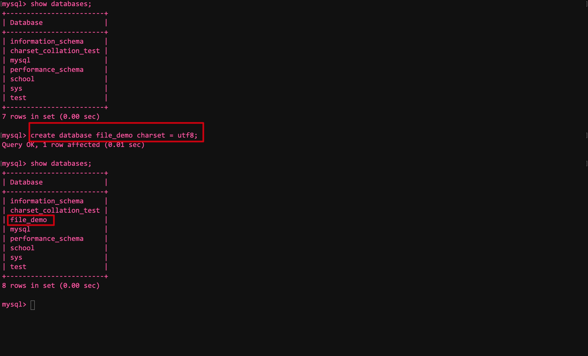

# 七、B+树索引的使用


实例表:


## 1. B+树索引的简化图

假如我们要通过主键在聚簇索引中查找id为1438的记录:


- 该图简化了页结构，且只保留了每条记录中的id列部分


假如我们要通过key1列在二级索引中查找key1为'abc'的记录:


- 定位到第一条key1值为'abc'的记录后，需要沿着记录组成的链表向后扫描(非主键列可能不具有唯一性)


## 2. 索引的代价


### 空间

- 索引本身是一颗B+数，而**每棵B+树中的每一个节点都是一个index_page**，默认占用16KB的空间


### 时间

- 每当对表中的数据进行CRUD时，索引也要进行相应的变化，**用户记录和目录项记录都要重新排序**
- 为了维护排序，**所有的页都又可能会进行页分裂或者页回收**，存储引擎要做出这些操作需要额外的时间


### 拓展

- 在执行一条SQL之前，**都要先生成一个执行计划**
- 生成该计划时，会计算**使用不同的索引进行查询时**所需的成本，最后选取成本最低的那个
- 如果索引过多，则会**导致在成本分析时耗时过多**


## 3. 应用B+树索引

- 对于任何查询来说，最简单的方式就是**扫瞄所有的记录**，**这种执行方案称作全表扫描**
- 该方案对于InnoDB表来说，就是**从聚簇索引的第一个叶子结点开始扫描，直到最后一个叶子结点**
- 全表扫描虽然笨，但是万能的，**对于任何查询都适用**


### 扫描区间/边界条件


Eg SQL1:

```mysql
SELECT * FROM single_table WHERE id >= 2 AND id <= 100;
```


该SQL的搜索步骤:

- 通过主键列id，通过聚簇索引找到id为2的索引记录
- 然后沿着该记录所在链表向后扫描


- 扫描区间为 [2, 100]
- 边界条件为 id >= 2 AND id <= 100

待扫描id值所在的区间为**扫描区间**，形成这个扫描区间的搜索条件称为形成这个扫描区间的**边界条件**


- 对于全表扫描: 其扫描区间为(-∞, +∞)


Eg SQL2:

```mysql
SELECT * FROM single_table WHERE key2 IN (1438, 6328) OR (key2 >= 38 AND key2 <= 49);
```


由该SQL可以得到三个扫描区间:

- [1438, 1438] : key2 IN (1438)
- [6328, 6328] : key2 IN (6328)
- [38, 79] : key2 >= 38 AND key2 <= 49

类似[1438, 1438]和[6328, 6328]这样，**只包含一个值的扫描区间暂时称为单点扫描器**

**包含多个值的称为范围扫描区间**


使用该SQL查询时，根据uk_key2唯一键索引**获取每一条对应的二级索引记录**，**根据这些记录中的主键值再执行回表**

**注：**

1. 我们也可以不使用uk_key2这个索引，如果使用idx_key1索引，则**无法根据WHERE子句的条件在该索引中形成合适的扫描区间**
2. 使用idx_key1执行查询的话，扫描区间为(-∞, +∞)，又因为idx_key1是一个二级索引，所以还需要回表，**效率还不如全表扫描！**
3. 如果使用某个索引执行查询，**无法通过搜索条件形成合适的扫描区间时，则不会考虑使用该索引**


Eg SQL3:

```mysql
SELECT * FROM single_table WHERE key1 < 'a' AND key3 > 'z' AND common_field = 'abc';
```


使用idx_key1索引

- 对应扫描区间为(-∞, 'a')，边界条件为key1 < 'a'，**其余两个条件为普通搜索条件**
- 通过该二级索引获取相关记录后，需要这些记录中的主键值回表获取对应的完整记录，**回表获取记录之后才用剩下两个条件进行判断**


使用idx_key3索引

- 对应扫描区间为('z', +∞)，形成区间的边界条件为key3 > 'z'，**其余两个也是普通搜索条件**
- 通过该二级索引获取相关记录后，需要这些记录中的主键值回表获取对应的完整记录，**回表获取记录之后才用剩下两个条件进行判断**


如果仅通过一个索引进行搜索:

- 需要通过**搜索条件**，获取**合适的扫描区间**，之后在**对应的B+树索引**中去扫描区间中的记录
- 对于每个扫描区间，仅需要定位到该B+索引扫描区间中第一条记录，并沿着该记录所在链表向后扫描，直到某一条不符合为止
- 对于B+树索引，只要索引和常数使用 =, IN, NOT IN, IS NULL, IS NOT NULL, >, <等等则能够形成扫描区间


对于这些操作符需要注意的是:

- IN操作符与若干用OR连接起来的(=)操作符是一样的:

```mysql
SELECT * FROM single_table WHERE key2 IN (1438, 6328);
SELECT * FROM single_table WHERE key2 = 1438 OR key2 = 6328;
```


- !=形成的扫描区间

```mysql
SELECT * FROM single_table WHERE key1 != 'a';
```

该搜索条件形成的扫描区间为(-∞, 'a') 和 ('a', +∞)


- LIKE操作符

只有匹配到了之后才会产生合适的扫描区间


#### 1) 所有搜索条件都能生成合适扫描区间的情况


SQL1:

```mysql
SELECT * FROM single_table WHERE key2 > 100 AND key2 > 200;
```

该SQL的搜索条件可以合并为key2 > 200，扫描区间为(200, +∞)


SQL2:

```mysql
SELECT * FROM single_table WHERE key2 > 100 OR key 2 > 200
```

该SQL的搜索条件可以合并为key2 > 100，扫描区间为(100, +∞)


#### 2) 部分搜索条件不能生成合适扫描区间的情况


SQL1:

```mysql
SELECT * FROM single_table WHERE key2 > 100 AND common_field = 'abc';
```


使用uk_key2索引查询时:

- Key2 > 100可以形成扫描区间(100, +∞)
- 但通过common_field = 'abc'无法在uk_key2中形成扫描区间(-∞, +∞)
- 对两个区间进行合并，则最终形成扫描区间的搜索条件为key2 > 100，最终扫描区间为(100, +∞)


如果将AND换为OR，同样使用uk_key2索引进行查询:

- 将所有用不到uk_key2索引的条件替代为TRUE，所以common_field = 'abc'用TRUE替代:
- SELECT * FROM single_table WHERE key2 > 100
- SELECT * FROM single_table WHERE TRUE
- 此时如果强制使用uk_key2索引，则**需要扫描所有二级索引记录，并都需要回表**，**代价比全表扫描都大所以不考虑使用uk_key2索引**


#### 3) 通过复杂搜索条件获取扫描区间

// Simple but complex

Eg:


#### 4) 使用联合索引执行查询时对应的扫描区间


示例的联合索引结构:


Eg SQL1:

```mysql
SELECT * FROM single_table WHERE key_part1 = 'a';
```

- 先定位到第一条符合key_part1 = 'a'的记录，之后沿着记录组成的链表向后扫描，一个页面扫描完后根据页与页组成的双向链表继续扫描
- 作为二级索引，每条记录都要在聚簇索引中执行回表操作
- 扫描区间为['a', 'a']，边界条件为key_part1 = 'a'


Eg SQL2:

```mysql
SELECT * FROM single_table WHERE key_part1 = 'a' AND key_part2 = 'b';
```

- 先定位到第一条符合key_part1 = 'a' AND key_part2 = 'b'的记录，之后沿着记录所在的链表向后扫描，直到某条不符合为止
- 作为二级索引，每条记录都要在聚簇索引中执行回表操作
- 扫描区间为[('a', 'b'), ('a', 'b')]，边界条件为key_part1 = 'a' AND key_part2 = 'b'


Eg SQL3:

```mysql
SELECT * FROM single_table WHERE key_part1 = 'a' AND key_part2 = 'b' AND key_part3 = 'c'
```

- 先定位到第一条符合key_part1 = 'a' AND key_part2 = 'b' AND key_part3 = 'c'的记录，之后沿着记录所在的链表向后扫描，直到某条不符合为止
- 作为二级索引，每条记录都要在聚簇索引中执行回表操作
- 扫描区间为[('a', 'b', 'c'), ('a', 'b', 'c')]，边界条件为key_part1 = 'a' AND key_part2 = 'b' AND key_part3 = 'c'


Eg SQL4:

```mysql
SELECT * FROM single_table WHERE key_part1 < 'a';
```

- 先定位到第一条符合key_part1 < 'a'的记录，之后沿着记录所在的链表向后扫描，直到某条不符合为止
- 作为二级索引，每条记录都要在聚簇索引中执行回表操作
- 扫描区间为(-∞, 'a')，边界条件为key_part1 < 'a'


Eg SQL5:

```mysql
SELECT * FROM single_table WHERE key_part1 = 'a' AND key_part2 > 'a' AND key_part < 'd'
```

- 先定位到第一条符合key_part1 = 'a' AND key_part2 > 'a' AND key_part < 'd'的记录，之后沿着记录所在的链表向后扫描，直到某条不符合为止
- 作为二级索引，每条记录都要在聚簇索引中执行回表操作
- 扫描区间为(('a', 'a'), ('a', 'd'))，边界条件为key_part1 = 'a' AND key_part2 > 'a' AND key_part < 'd'


Eg SQL6:

```mysql
SELECT * FROM single_table WHERE key_part2 = 'a';
```

- 由于该联合索引/二级索引不是按照key_part2的值进行排序的，索引不能通过WHERE子句获取有效的扫描区间，因此不会使用idx_key_part索引来执行该查询


Eg SQL7:

```mysql
SELECT * FROM single_table WHERE key_part1 = 'a' AND key_part3 = 'c';
```

- 对于所有符合key_part1 = 'a'的二级索引记录来说，并不是根据key_part3进行排序的，所以通过key_part3 = 'c'无法进一步减少需要扫描的记录数量
- 作为二级索引，每条记录都要在聚簇索引中执行回表操作
- 扫描区间为['a', 'a']，边界条件为key_part1 = 'a'


**注：**

1. 在SQL7中，如果没有开启**索引下推**特效，则会先执行回表操作，再通过key_part3 = 'c'进行判断
2. 如果开启后，则会先进行判断，在进行回表操作，不符合则不进行回表操作，**从MySQL5.6中引入了该特性，并默认开始**


Eg SQL8:

```mysql
SELECT * FROM single_table WHERE key_part1 < 'b' AND key_part2 = 'a'
```

- 对于所有符合key_part1 < 'b'的二级索引记录来说，并不是根据key_part2进行排序的，所以通过key_part2 = 'a'无法进一步减少需要扫描的记录数量
- 作为二级索引，每条记录都要在聚簇索引中执行回表操作
- 扫描区间为[-∞, 'b']，边界条件为key_part1 < 'b'


Eg SQL9:

```mysql
SELECT * FROM single_table WHERE key_part1 <= 'b' AND key_part2 = 'a';
```

- 对于所有符合key_part1 = 'b'的二级索引记录来说，是根据key_part2进行排序的，所以可以通过key_part2 = 'a'进一步减少需要扫描的记录数量
- 对于所有符合key_part1 < 'b'的二级索引记录来说，并不是根据key_part2进行排序的，所以通过key_part2 = 'a'无法进一步减少需要扫描的记录数量
- 作为二级索引，每条记录都要在聚簇索引中执行回表操作
- 扫描区间为[(-∞, -∞), ('b', 'a')]，边界条件为key_part1 <= 'b' AND key_part2 = 'a'


### 索引用于排序

- 通常需要对查询的结果进行排序，一般只能将记录加载到内存中，使用算法进行排序
- 有时结果集合太大，内存无法存储，则只能用磁盘空间来存放中间结果，最后将排序后的结果返回给client
- 在MySQL中，在内存或磁盘中进行排序的方式称为文件排序(filesort)


- 如果ORDER BY中使用了索引列，则有可能省去在内存或磁盘中排序的步骤

Eg SQL:

```mysql
SELECT * FROM single_table ORDER BY key_part1, keyp_part2, key_part3 LIMIT 10;
```

- 由于ORDER BY中使用了索引列，且**顺序和索引一致**，**所以只需要在索引中从第一条记录向后扫描10条记录即可**


#### 1) 使用联合索引排序的注意事项

- ORDER BY后的列必须按照索引的顺序给出


#### 2) 不能使用索引进行排序的情况


1. ASC, DESC混用

使用联合索引排序时，要求各个列的排序规则一致(都为ASC/DESC)


拓展:

- 要找到一条记录的上一条比起下一条要麻烦得多:
- 遍历该条记录直到找到该分组的"大哥"(n_owend属性不为0的记录)，通过它在Page Directory中获取上一个槽
- 通过上一个槽获取其中的最大记录，这条最大记录的下一条就是目标记录分组中的第一条记录(绕回来了)
- 然后从第一条记录开始向后找即可


一旦混用:

```mysql
SELECT * FROM single_table ORDER BY key_part1, key_part2 DESC LIMIT 10;
```


过程:


2. 排序列中有一个非索引列

排序的多个列不是同一个索引的也不能使用索引进行查询


3. 排序列是索引列，但在索引中不连续

SQL:

```mysql
SELECT * FROM single_table ORDER BY key_part1, key_part3 LIMIT 10;
```


4. 形成扫描区间的列与排序列不同

SQL:

```mysql
SELECT * FROM single_table WHERE key1 = 'a' ORDER BY key2 LIMIT 10;
```


5. 排序列不是以单独的列名出现

SQL:

```mysql
SELECT * FROM single_table ORDER BY UPPER(key1) LIMIT 10;
```

- 这里是以函数调用的方式出现的


### 索引用于分组

SQL:

```mysql
SELECT key_part1, key_part2, key_part3, COUNT(*) FROM single_table ORDER BY key_part1, key_part2, key_part3;
```

该查询执行了三次分组:

- 先按照key_par1分组
- 再将key_part1相同的按照key_part2分组
- 最后再按照key_part3分组

**注：**

1. 如果没有idx_key_part联合索引，则**需要将分组的中间结果存放到一张临时表中**，扫描完成后将临时表发给client
2. 而有了索引后，就能直接使用索引进行分组，而不需要临时表了


## 4. 回表的代价

Eg SQL:

```mysql
SELECT * FROM single_table WHERE key1 > 'a' AND key1 < 'c';
```


该SQL有两种执行方式:


1. 全表扫描

扫描所有的聚簇索引


2. 使用idx_key1

根据搜索条件可得扫描区间为('a', 'c')，之后扫描该区间内的二级索引记录

因为idx_key1是二级索引没有完整的用户记录，所以需要获取每条二级索引对应的聚簇索引记录(回表)，最后返回client


**注：**

1. 虽然根据上述的扫描区间获取的二级索引记录是连续的，但其对应的**主键值不是连续的**
2. 每获取一条二级索引记录都需要回表，**如果二级索引记录对应主键所在聚簇索引的页不在内存中，则需要从磁盘中读取**
3. 因为主键值不连续，所以读取聚簇索引页是随机的，**会产生许多的随机I/O**
4. 需要执行回表的记录越多，则查询性能越低


- 至于什么时候使用全表扫描，什么时候使用二级索引 + 回表，**则取决于查询优化器**
- 其会通过表中记录计算出需要回表操作的记录数，**越多则越倾向于使用全表扫描**


## 5. 更好的创建/使用索引


### 只对用于搜素/排序/分组的列创建索引

Eg SQL:

```mysql
SELECT common_field, key_part3 FROM single_table WHERE key1 = 'a';
```

- 这里只需要对key1列创建索引即可


### 考虑索引列中不重复值的个数

- 如果扫描区间内重复值记录过多，则会执行太多次回表操作


### 索引列数据类型尽量小

- 定义表结构时，要显式定义主键值的数据类型
- **因为每个二级索引都存储主键**，所以主键值占用空间小，则整个索引占用空间小
- 主键值占用空间小，则一页中就能存放更多的记录，磁盘I/O带来的性能损耗越小(**一次可以读取更多页到内存中**)


### 为列前缀建立索引

- 如果字符串很长，则其在B+树索引中也会占用大量空间
- 我们可以只取字符串的前缀建立索引，同样可以起相同的作用

Eg SQL

```mysql
ALTER TABLE single_table ADD INDEX idx_key1 (key1(10));
```

- 只保留字符串的前10个字符，这样可以明显减少索引的大小


**注：一旦对前缀建立索引，则无法通过该索引进行排序**，只能通过全表扫描 + 文件排序的方式


### 覆盖索引


- 想要在使用二级索引时不进行回表，则需要保证查询的字段列表中只有索引列(只有二级索引存储的列信息)


Eg SQL1:

```mysql
SELECT key1, id FROM single_table WHERE key1 > 'a' AND key1 < 'c';
```

- 由于**二级索引中已经存在key1和id列了**，所以我们只需要返回二级索引中的记录即可，**不需要回表**
- 这种**索引中已经包含所需查询列的查询方式**，称为**覆盖索引**
- 排序也能使用(如无必要，不要使用*)


### 保证索引列以列名的形式在搜索条件中单独出现

Eg SQL:

```mysql
SELECT * FROM single_table WHERE key2 * 2 < 4;
SELECT * FROM single_table WHERE key2 < 4 / 2;
```

- 这两条SQL语义相同，但MySQL不会优化key * 2 < 4，**只会认为它不能形成合适的搜索条件，而以全盘扫描的方式执行**
- 而第二条就没问题


### 新插入记录主键大小对效率的影响

- 如果插入的数据需要位于原本数据的中间，**则需要进行页分裂，记录移动等操作，但这些都是性能损耗！**
- 想要避免则最好让插入记录的主键值依次递增


**注：重复冗余的索引应该避免**

****


# 八、MySQL的数据目录


## 8.1 数据库和文件系统的关系

- InnoDB和MyISAM这样的存储引擎将表存储在磁盘内
- 而OS通过文件系统管理磁盘，所以:
- **存储引擎把数据存储在文件系统**


## 8.2 MySQL数据目录

- MySQL server启动后，会**从文件系统某个目录中加载一些数据**，之后运行过程中产生的数据都存储在这个目录中的某些文件中
- **该目录就被称为数据目录**


### 8.2.1 数据目录与安装目录的区别

- 安装目录下的**/bin目录中有许多控制client和server的命令**(mysql, mysqld_safe, mysqld等)
- 而数据目录**用来存放MySQL运行过程中产生的数据**


### 8.2.2 确定MySQL的数据目录

- 查看变量datadir即可获取MySQL的数据目录:

```mysql
SHOW VARIABLES LIKE 'datadir';
```


Eg:


## 8.3 数据目录结构

- MySQL在运行过程中产生的数据包括我们创建的database, table, view, trigger等用户数据
- 为了让程序更好的运行，MySQL还会创建一些额外的数据


### 8.3.1 database在文件系统中的表示


当我们创建一个database后，MySQL会做两件事:

- 在数据目录下创建一个和database同名的子目录(文件夹)
- 在与数据库同名子目录下创建**一个名为"dp.opt"的文件，该文件包含该database的一些属性**(字符集和比较规则等)


Eg:




**注：**数据目录中没有information_schema这个系统数据库，MySQL的设计者没有为他创建相应的子目录


### 8.3.2 table在文件系统中的表示


表的信息分为两部分:

- 表结构的定义
- 表的数据

表的结构指表的名称，列的数量，列的数据类型，约束条件和索引，字符集和比较规则等

**InnoDB和MyISAM**都在数据目录下对应database的数据库子目录中，**创建了一个专门描述表结构的文件**:

- **Table_name.frm**

Eg:


- 该文件以二进制形式存储，直接打开会出现乱码

Eg:


**注意：**InnoDB和MyISAM都将表结构存储到了 table_name.frm文件中，但两个存储数据的方式则不同！


#### InnoDB表存储表数据的方式

复习:

- InnoDB以页为基础单位，默认一页的大小为16KB
- 对于InnoDB存储引擎来说，每个索引都对应一颗B+树，该树的每个节点都是一个index_page，**页之间不一定是物理连续的**，**页之间通过一个双向链表连接**
- InnoDB的聚簇索引的叶子节点存储了完整的用户记录，"索引即数据，数据即索引"

InnoDB的设计者提出了**表空间或文件空间**的概念(table space/file space)，**一个表空间/文件空间对应文件系统上一个或多个文件**。

**一个表空间可以被划分为多个页**

**表数据就存放在表空间内对应的页中**，表空间有几种类型:


1. 系统表空间(system tablespace)

- 该系统表空间**对应文件系统中一个或多个实际文件**
- 默认情况下InnoDB会在数据目录根目录下创建一个名为"ibdata1"的文件，**该文件默认大小为12MB**，**其就是系统表空间在文件系统上的表示**，该文件为自扩展文件(不够用时会自增)

Eg:


- 可以通过配置文件的方式修改该文件的大小和对应的文件路径:


- 末尾的autoextend表示自动扩展


**注：**一个MySQL Server中，系统表空间只有一份，从MySQL5.5.7到5.6.5之间都默认存储到这个系统表空间中


2. 独立表空间

- 从MySQL5.6.6及之后的版本中，InnoDB就**默认将每张表数据存储到一个独立的表空间中**(**创建多少表就有多少独立表空间**)
- 使用独立表空间时，会在数据目录下对应子目录中**创建一个table_name.ibd文件**

Eg:


- **通过配置文件**，可**自行决定使用系统表空间还是独立表空间**

```
[server]
innodb_file_per_table=0
```

- "0"表示使用系统表空间，"1"表示使用独立表空间
- 该选项**只针对修改后新建的表**，之前**已经存储到system space的表只能手动转移:**

```mysql
ALTER TABLE table_name TABLESPACE innodb_file_per_table/innodb_system;
```


3. 其他类型的表空间

- general tablespace, undo tablespace, temporary tablespace


#### MyISAM表存储数据的方式

由于MyISAM中数据和索引是分开的，所以不能用一个文件表示，**对应子目录下加上表结构文件应该有三个文件**:

- table_name.frm(表结构)
- table_name.MYD(表数据)
- table_name.MYI(表索引)


Eg:


### 8.3.3 其他


为了保证程序更好的运行，在数据目录下还存在其他额外文件

- 服务器进程文件

每运行一个server，则意味着启动了一个进程，**MySQL server会将自己的进程id写入该文件**

- 服务器日志文件
- SSL/RSA证书: 为了client和server安全通信而创建的一些文件


## 8.4 文件系统对database的影响

- **数据库名称和表名称不能超过文件系统允许的最大长度**
- 特殊字符

当database/table中出现特殊字符，**为了避免文件系统不支持**，**则将除数字/拉丁数字外的字符映射成@ + "编码值"的组合形式**

- 文件长度首文件系统最大长度的限制


## 8.5 MySQL系统数据库简介

- mysql: 存储了用户账户和权限信息，存储过程/事件的定义信息，运行过程中产生的日志信息，一些帮助信息
- information_schema: 保存着MySQL server维护的所有其他database信息(table, view, trigger, column, index etc.)，这些信息并非真实的用户信息，而是描述性信息(元数据)
- performance_schema: 保存server运行过程中一些状态信息(**算是性能监控**)
- sys: 通过view的方式把information_schema和performance_schema结合起来，方便开发者了解server的性能信息

****


# 九、InnoDB表空间


## 9.1 复习


### 9.1.1 页的类型

- 每个B+索引节点为一个页(index_page)，该类型全称为FIL_PAGE_INDEX


常用的页面类型


### 9.1.2 页面的通用部分

- index_page有7个部分，其中的File Header和File Trailer部分是通用的

通用页结构:


- File Header: 记录page的通用信息
- File Trailer: 校验page是否完整，**保持数据在内存处理到写入磁盘后的内容一致**


File Header的组成:


重点:

- 表空间(table space)内**每个page都有一个页号**，即**FIL_PAGE_OFFSET**。

该表示**页号的部分占用4个字节**，一共32bits，所以**一个table space中可以表示2^32个page**，按照默认16KB大小来算，一个table space可以支持64TB的数据，页号从0开始


- **FIL_PAGE_INDEX类型**的页**可以组成链表。**

由File Header中的FIL_PAGE_PREV和FIL_PAGE_NEXT部分存储上一页和下一页的页号(上下页之间页号可以不连续，即物理位置可以不相邻)，可以将所有该类型的页组成双向链表(**一般类型的页面没有这两个部分**)


- **FIL_PAGE_TYPE表示页面的类型**

对于类型为FIL_PAGE_INDEX的页面，该FIL_PAGE_TYPE字段值即为0x45BF


## 9.2 独立表空间的结构

- 由上一章可知:
- 在var "datadir"中，为每个database都创建了一个对应的同名目录(除了information_schema库)
- 在database对应目录中，有一个db.opt文件，其中为每个table都创建了一个对应的同名目录
- 对于InnoDB表，对于表目录中，有一个与表同名的.frm文件表示table的结构，一个与表同名的.ibd文件存储table的数据


### 9.2.1 table space中的区

- 区(extent): **连续64个page就是一个区(extent)，一个区默认占用1MB的空间**
- 而每256个extent作为一组

Table Space:


- 其中第一组中开头区的page类型是固定的，而**其他组开头区中的page则是相同的**，**但与第一组不同**


由图可知:

- **第一组中开头区的前三页类型固定**，分别为:
  - FSP_HDR: 登记**整个表空间的整体属性**，以及**本组所有区extent的属性**，**整个table space只有一个FSR_HDR类型的page!**
  - IBUF_BITMAP: 存储有关Change Buffer的信息
  - INODE: 存储了许多INODE Entry结构的Page

- 除了第一组(0 ～ 255个extent)，**其余各组开头区的前两个page类型固定**，分别为:
  - XDES(extent descriptor): **记录本组中所有区extent的属性**，其作用同FSP_HDR类似，只不过后者还额外记录了table space的属性
  - IBUF_BITMAP: 存储有关Change Buffer的信息


### 9.2.2 table space中的段

- 为什么需要区extent:

按照之前的做法，将所有的inde_page通过File Header中的FIL_PAGE_PREV和FIL_PAGE_NEXT字段连接起来形成双向链表，这样做的话不需要页与页之间在物理空间上连续

但这样做有一个问题: 如果查询获取的对应页物理不连续，且有可能在磁盘的不同位置，那么**在通过磁盘访问时就会出现很多随机I/O！**

(不连续其实可以运行，但会影响性能)

当表中数据较多时，直接**以区为单位分配空间，分配的空间就是物理连续的，从而消除了随机I/O**，但这不是全部(有大量的空间浪费)


- 为什么需要段segment:

因为我们在扫描B+树时最终只是在扫描叶子结点中的记录，而**将记录放入分配的区中时，需要区分叶子结点和非叶子结点**(目录项记录)

InnoDB为了对B+树叶子结点和非叶子结点进行区分，让**叶子结点有自己的区，非叶子结点也有自己的区**，**存放叶子结点的所有区算是一个段，非叶子结点的区集合也算一个段**


- 碎片区fragment extent:

对于**一个InnoDB聚簇索引，其会生成两个段(叶子结点和非叶子结点)**，因为一个完整的extent大小为1MB，如果table中数据很少，**直接分配两个区则会占用2MB，会造成严重的浪费！**

为了避免区的浪费，InnoDB设计者提出了碎片区的概念(fragment extent)

碎片区: 其中的部分页可以属于段a，另一部分页可以属于段b，还有部分page可以不属于任何segment，**碎片区整体不属于任何段，其直属于table space**


- 此后为segment分配存储空间的策略:
  - 刚开始向table插入数据时，**段中的存储空间以fragment extent中的单个page为单位获取**
  - 当当segment中所占用的page数量超过32个碎片区页面后，就会用一个完整的extent来分配存储空间(之前占用的碎片区页面不会被复制到这个新分配的完整extent中)

- 目前段的定义: 一些零散页和一些完整区的集合


### 9.2.3 区的分类

- 空闲区: 其中没有任何页面被占用
- 有剩余空闲页的碎片区: 其中有可被分配的空闲页
- 没有空闲页的碎片区: 没有可被分配的空闲页
- 附属某个段的区: 之前讲过，当segment中数据量较大时，会以一个完整的extent为单位存储数据

这四个类型的区也称为区的四种状态(state):


**注意：**其中**为FREE, FREE_FRAG, FULL_FRAG状态的区直属于表空间**，而FSEG属于某个段

关系:

```shell
-- table space
  -- segment
  	-- FSEG			// 附属段的区
  -- FREE
  -- FREE_FRAG
  -- FULL_FRAG
```


- XDES Entry的引入:

为了管理这些区，InnoDB设计者**为每个区都设计了一个XDES Entry结构**(Extent Descriptor Entry)，**其记录了区的一些属性**

结构图:


各部分定义:

- Segment ID: 其表示**该区附属的段**(如果该区已经被分配给了对应的段，不然无意义)，段id唯一
- 其中包含四个结构统称为List Node: 通过该部分可以将若干XDES Entry结构**串成一个链表**
  - Prev Node Page Number和Prev Node Offset组合是指向前一个XDES Entry结构的指针
  - Next Node Page Number和next Node Offset组合是指向后一个XDES Entry结构的指针

(作用之后介绍)

- State(4 bytes): 表明对应extent的状态，也就是之前介绍的四种状态
- Page State Bitmap(16 bytes): 该部分共128bits，因为一个extent对应64个page，所以每个页对应2bits，其中第1个bit表示对应页是否空闲(第2位作用未定)


#### 1) XDES Entry链表


现在回顾向table中插入数据的过程:

- 当**segement中数据少时**，首先查看**table space中是否有状态为FREE_FRAG的extent**
- 有则**从该extent中取一个零散页将数据插入即可**
- 没有则**从table space中申请一个状态为FREE的extent**，并将**该extent的状态变为FREE_FRAG**，之后重复上述步骤，从中取一个零散页将数据插入，**之后每次都从这个状态为FREE_FRAG的extent中取零散页**
- 且**不同的segment需要零散页时都从该extent中取**，直到该页面中的空闲页面用完(状态变为FULL_FRAG)


现在出现了一个问题:

- 要实现以上步骤，需要我们明确extent的状态，而这个数据存储在区对应的XDES Entry结构中
- 难道为了知道extent的状态，我们需要遍历所有的XDES Entry结构？
- 此时就是XDES Entry结构中的List Node部分发挥作用的时候了！


- 通过List Node可以做3件事:
  - 将所有State为FREE的extent对应的XDES Entry结构连接成一个链表，称为FREE链表
  - 将所有State为FREE_FRAG的extent对应的XDES Entry结构连接成一个链表，称为FREE_FRAG链表
  - 将所有State为FULL_FRAG的extent对应的XDES Entry结构连接成一个链表，称为FULL_FRAG链表

**注意：**这些三种状态的extent直属表空间


此时通过这三个链表可以获取extent的状态:

- 从需要FREE_FRAG状态extent对应链表中获取头结点，通过该结点对应的extent获取零散页并插入数据
- 没有空闲页面则修改State为FULL_FRAG，没有节点则从FREE链表中区一个节点移动到FREE_FRAG链表，并修改State取零散页即可

- 最后如果Segment中的数据占满了32个零散页，则直接申请完整的extent即可


这里又出现了问题: 我们怎么知道被占用的extent属于哪个segment呢？

- XDES Entry结构中有一个Segment ID字段，所以要遍历一遍？
- 这里我们同样用链表的方法来解决:
- **为每个segment中的extent对应的XDES Entry建立三个链表(附属某个段)**:
  - FREE链表: **在同一个段中，所有页都是空闲页的extent**对应的XDES Entry结构构建成该链表
  - NOT_NULL链表: **在同一个段中，有空闲页的extent**对应的XDES Entry结构构建成该链表
  - FULL链表: **在同一个段中，没有空闲页的extent**对应的XDES Entry结构构建成该链表

**注意：**每个segment都有这三个对应的链表


例子:

如果一个table中有2个索引，则对应4个段，4个段对应12个链表，再加上直属表空间的三种状态的链表，**所以该table的表空间需要维护15个链表**


#### 2) 链表的基节点


问题: 之前我们在一张表空间中需要维护多个链表(直属table space和附属segment的)，但如何找到这些链表/头结点呢？

- 为了解决该问题，InnoDB中为每个链表都创建了一个名为List Base Node的结构，其包含链表的头节点、尾节点和节点数

结构如下:


各个结构如下:

- List Length: 节点数
- First Node Page Number和First Node Offset: 表示链表头节点在表空间中的位置
- Last Node Page Number和Last Node Offset: 表示链表尾节点在表空间中的位置

**注：**一般会把**每个链表对应的List Base Node结构放在表空间中的固定位置**，**这样就容易定位了**


#### 3) 小结

- table space由若干extent组成，而每个extent都对应一个XDES Entry结构
- 直属于table space的XDES Entry结构分为FREE, FREE_FRAG, FULL_FRAG三个链表
- 每个段中有若干碎片区和完整区，每个段中的extetn对应的XDES Entry结构都构成FREE, NOT_FULL, FULL三个链表
- 以上每个链表都对应一个List Base Node结构，该结构定义了链表的头节点，尾节点和节点数
- 链表的存在让extent的管理更容易了


### 9.2.4 段的结构


