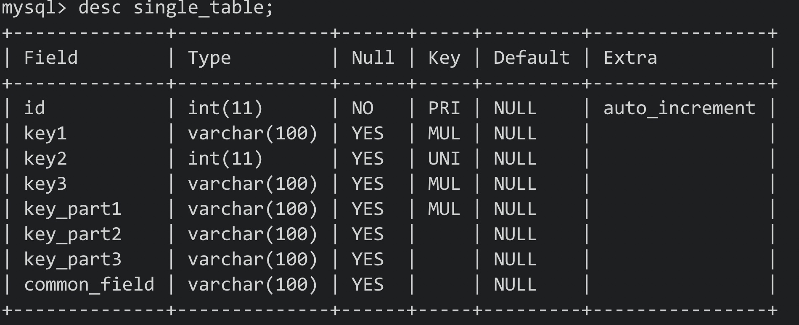
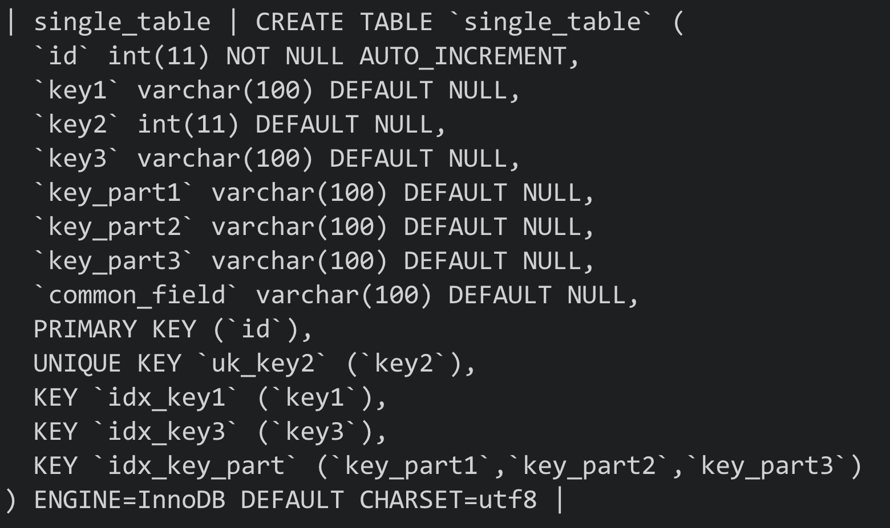
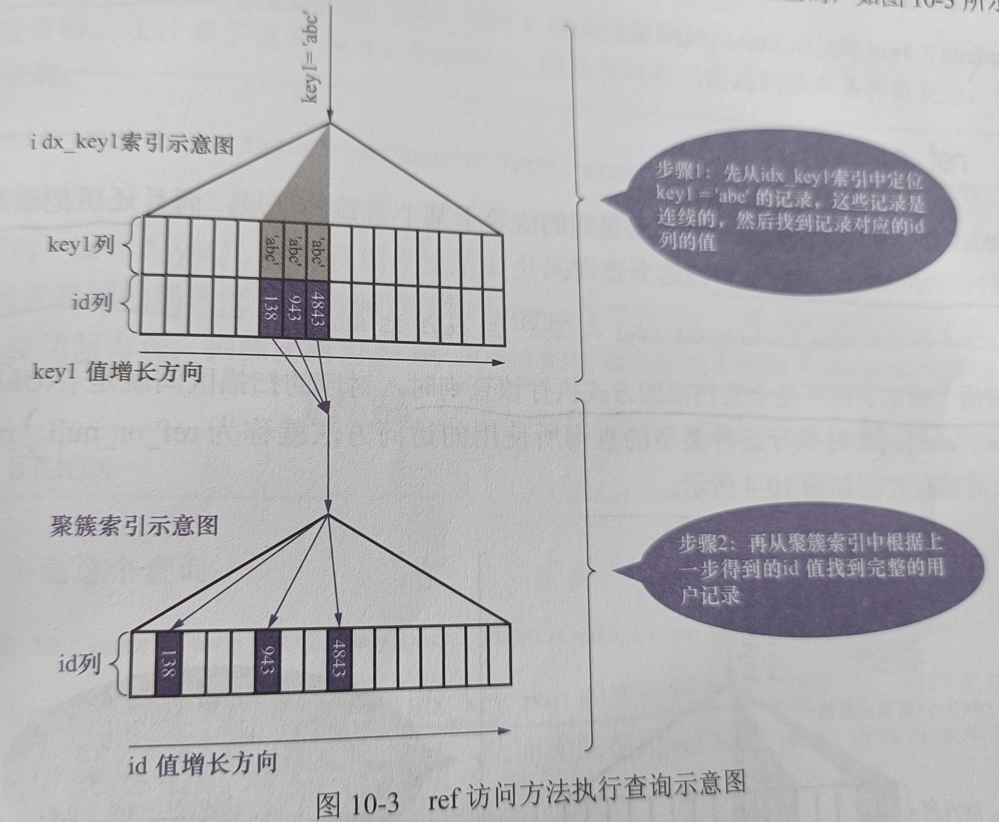
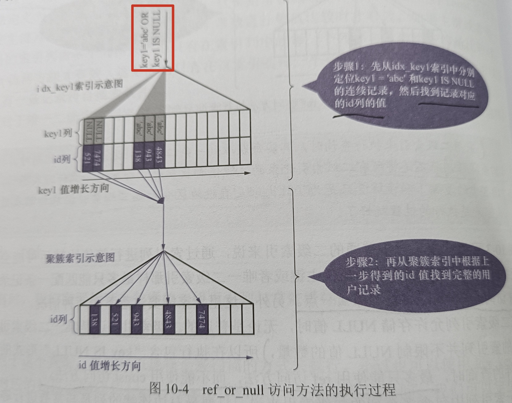
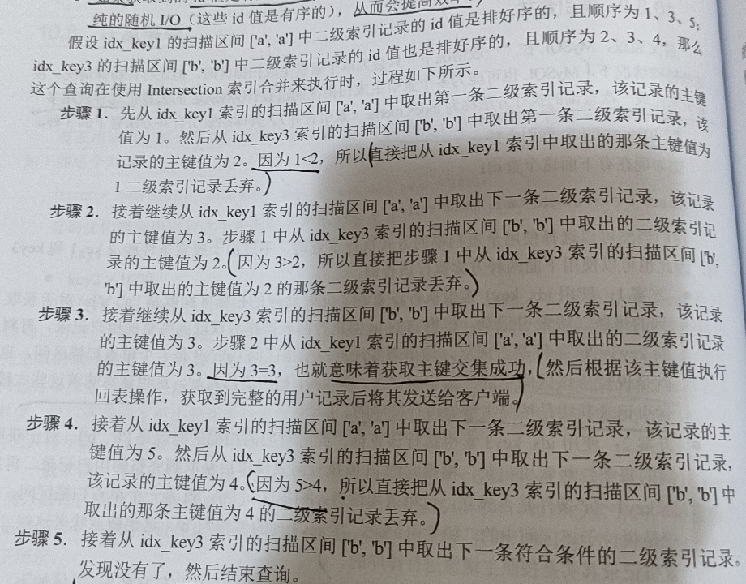
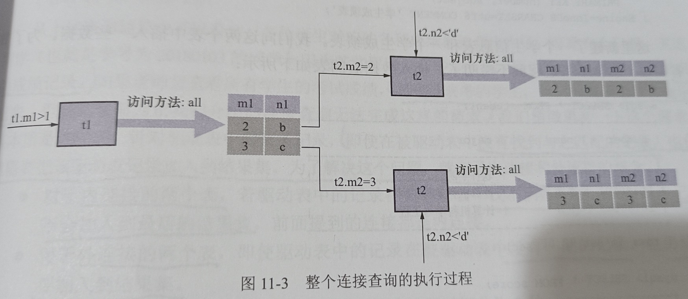
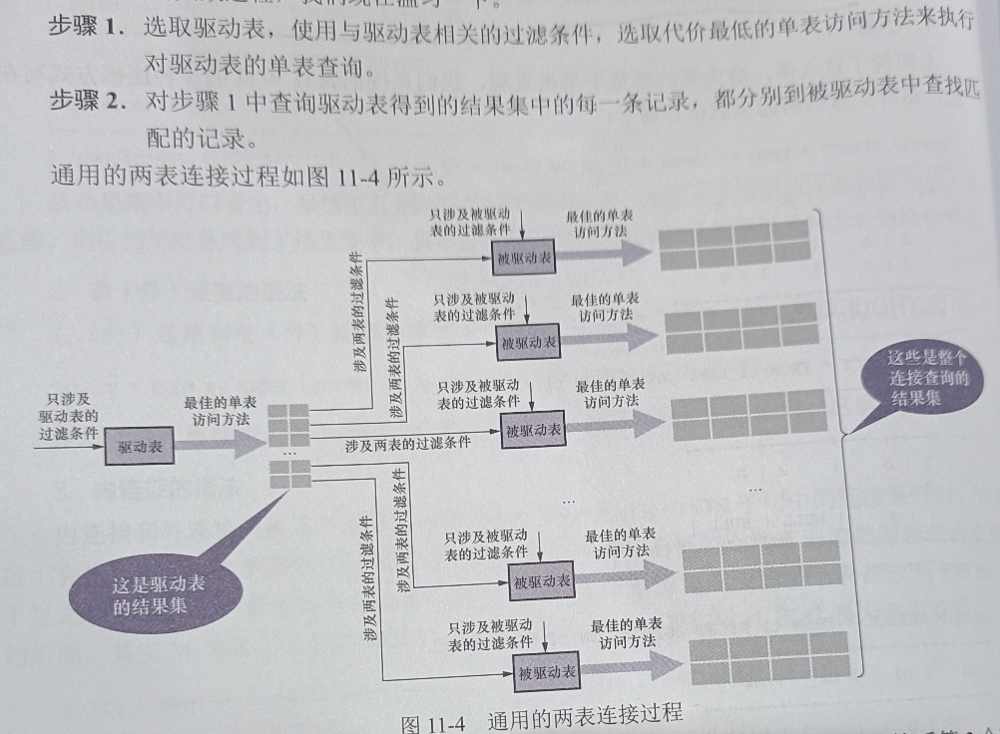
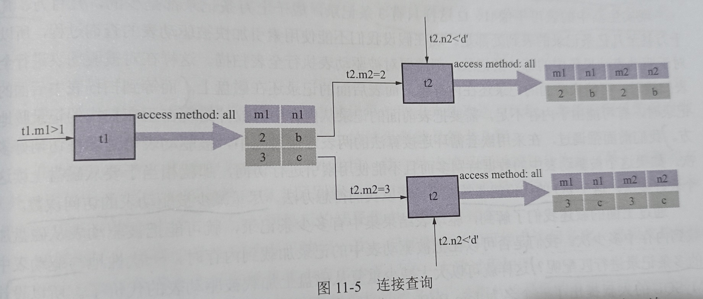
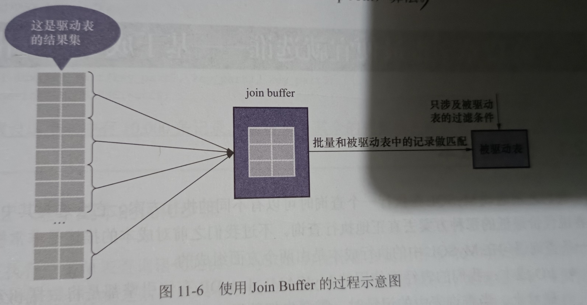
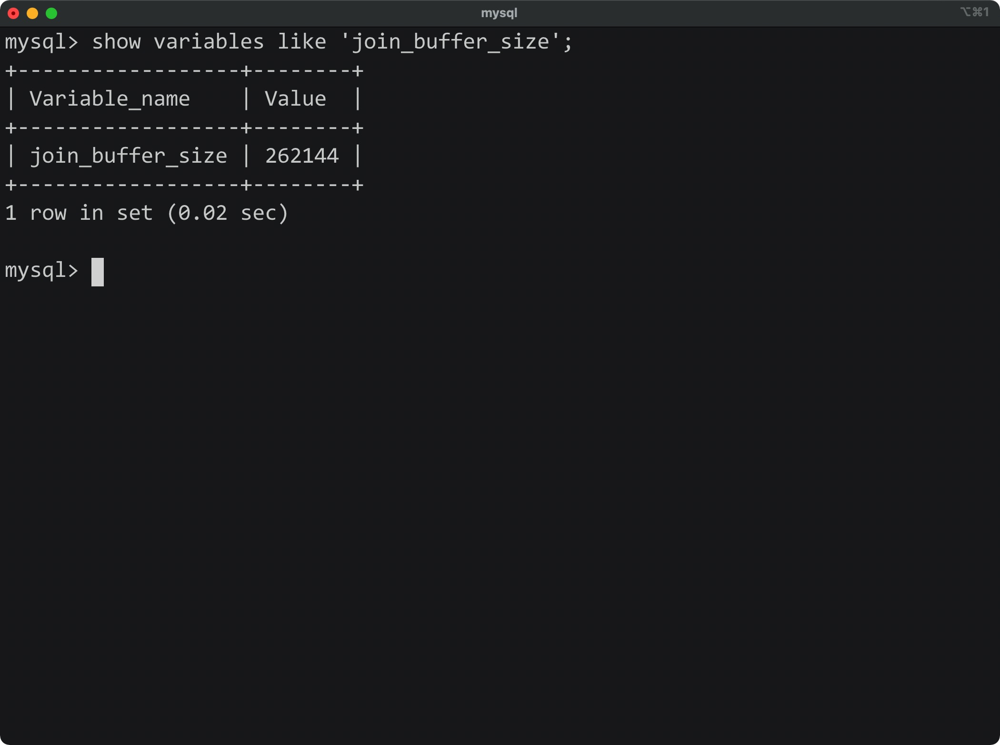

# 十、单表访问方法

- MySQL Server对一条SQL语句进行语法解析后(语法无误)，**会将其交给优化器进行优化**
- 优化的结果便是**执行计划**: 指定使用的索引、连接的顺序等等
- 最后按照执行计划中的步骤调用存储引擎接口来真正的查询，最后返回结果集


Eg Table:







## 10.1 访问方法

- MySQL官方将MySQL**执行查询语句的方式**，称为访问方法
- 同一条查询语句**可以使用多种访问方法**来执行


## 10.2 const

- **通过主键/唯一二级索引列**与**常数进行等值比较**，来**定位一条记录**的访问方法定义为const
- 如果**索引有多个列(联合索引)**，则只有索引中**每个列都与常数进行等值比较时**，const访问方法才有效

Eg SQL:

```mysql
SELECT * FROM single_table WHERE id = 1438;
SELECT * FROM single_table WHERE key2 = 3841;
```


**注意：**对于唯一二级索引列，查询列为NULL时，比较特殊

```mysql
SELECT * FROM single_table WHERE key2 IS NULL;
```

- 因为唯一二级索引中为**null值的记录数量没有限制**，所以**查询结果可能有多条记录**，**因此也不能用const**


## 10.3 ref

- 搜索条件为**二级索引列与常数进行等值比较**，**形成的扫描区间为单点扫描区间**，**采用二级索引执行查询**的访问方法为ref
- 需要回表

Eg SQL:

```mysql
SELECT * FROM single_table WHERE key1 = 'abc';
```

- 每获取一条二级索引记录，**就会立马对其执行回表操作**


过程:



- 由于通过普通二级索引列进行等值比较后，可能会匹配到多条记录，所以该ref访问方法比const要查一点


**注意：**

1. 二级索引允许存储null，其不限制null的数量，所以**在对二级索引列执行IS NULL条件查询时，只能使用ref**
2. 对于联合二级索引来说，只要前面的连续索引列是与常数进行等值比较，就能使用ref方法

Eg SQL:

```mysql
SELECT * FROM single_table WHERE key_part1 = 'god like' AND key_part2 = 'legendary'
```

- 联合索引idx_key_part，key_part1和key_part2是按照顺序的，所以能够使用ref


- 如果左边的连续列不全是等值的话，就不能用ref方法:

```mysql
SELECT * FROM single_table WHERE key_part1 = 'god like' AND key_part2 > 'legendary'
```


## 10.4 ref_or_null

- 在ref的基础上，还需要将列中值为null的记录也找出，该种执行方法即为ref_or_null
- 只是比ref访问方法多扫描了一些值为null的二级索引记录
- 值为null的记录会被放在索引的最左边

Eg SQL:

```mysql
SELECT * FROM single_table WHERE key1 = 'abc' OR Key1 IS NULL;
```


执行过程:




## 10.5 range

- 使用索引进行查询时，**对应的扫描区间为若干单点扫描区间或者范围扫描区间的访问方法为range**

Eg SQL:

```mysql
SELECT * FROM single_table WHERE key2 IN (1438, 6328) OR key2 >= 38 AND key2 <= 79;
```


**注意：**

- 仅包含一个单点扫描区间或者区间为(-∞, +∞)的访问方法不能称为range


## 10.6 index

- **扫描全部二级索引记录的访问方法为index**

Eg SQL

```mysql
SELECT key_part1, key_part2, key_part3 FROM single_table WHERE key_part2 = 'abc';
```

- 左边的索引列并不连续，无法形成合适的范围区间来减少需要扫描的记录数


其符合两个条件:

1. **索引idx_key_part包含所有查询列表中的列**(索引列包含查询列)
2. 搜索条件key_part2包含在索引中


- 我们可以**直接遍历idx_key_part索引中的所有二级索引记录**，并通过WHERE子句条件进行判断
- 该方式**不需要进行回表操作**


## 10.7 all

- 全表扫描对应的访问方法为all


## 10.8 索引合并

- **使用多个索引完成一次查询**的**执行方法为index merge索引合并**


具体的索引合并方法有三种:

### 1) Intersection

Eg SQL:

```mysql
SELECT * FROM single_table WHERE key1 = 'a' AND key3 = 'b';
```


执行该查询的三种方案:

1. 使用idx_key1索引进行查询

对应的扫描区间为['a', 'a']，对于获取到的每条二级索引记录，都会根据其中的id值(主键列)进行回表操作，再判断key3 = 'b'

因为**扫描区间为一个单点扫描区间**，**所以该区间中的二级索引记录都是按照主键值排序的**


2. 使用idx_key3进行查询

对应的扫描区间为['b', 'b']，对于获取到的每条二级索引记录，都会根据其中的id值(主键列)进行回表操作，再判断key1 = 'a'

因为**扫描区间为一个单点扫描区间**，**所以该区间中的二级索引记录都是按照主键值排序的**


3. 同时使用idx_key1和idx_key3进行查询

在idx_key1中扫描['a', 'a']内的二级索引记录，同时在idx_key3中扫描['b', 'b']内的二级索引记录，**找出两个操作结果中id值相同的记录**

最后再根据共有的id进行回表操作(能省下很多回表操作带来的开销)


**这里的方法3就是intersection索引合并**:

- 对从**不同索引中扫描到的记录id取交集**，**只为这些id执行回表操作**
- **使用二级索引时**，**从二级索引中获取的记录必须要以主键值排列**


为什么要求从二级索引获取到的记录要按照主键值排序好？

- 从两个有序集合中取交集比两个无序集合要容易
- 如果获取的id时有序的，则进行**回表时则不会进行单纯的随机I/O**，能有效的提高效率


方法3步骤:




如果**用二级索引从扫描区间中获取的二级索引记录不是按照主键值排序的**，则**不能使用Intersections索引合并方式执行**

```mysql
SELECT * FROM single_table WHERE key1 > 'a' AND key3 = 'b';
```

- 使用索引idx_key1在区间['a', +∞]中获取的记录不是按照主键值排序的，所以不能使用Intersection索引合并的方法执行


如果WHERE子句中含有聚簇索引则:

Eg SQL:

```mysql
SELECT * FROM single_table WHERE key1 = 'a' AND id > 9000;
```

ID会和key1 = 'a'形成扫描区间: (('a', 9000), ('a', +∞))，此时直接扫描二级索引idx_key1即可，不需要扫描聚簇索引


### 2) Union

- 通过二级索引查询出的二级索引记录的id值进行去重，根据去重后的id进行回表操作，重复的id只需要回表一次


Eg SQL:

```mysql
SELECT * FROM single_table WHERE key1 = 'a' OR key3 = 'b'
```

- 同时使用idx_key1和idx_key3索引执行查询，从两个获取索引记录的id中进行去重，根据去重的id执行回表操作
- 重复的id只回表一次


**注意：**从索引中获取的**记录必须都是按照主键值进行排序的**

理由同Intersection


Eg SQL:

```mysql
SELECT * FROM single_table WHERE (key_part1 = 'a' AND key_part2 = 'b' AND key_part3 = 'c') OR (key1 = 'a' AND key3 = 'b');
```

- 先通过idx_key1和idx_key3执行Intersection索引合并(key1 = 'a' AND key3 = 'b')
- 在通过idx_key_part执行索引合并即可


### 3) Sort-Union

- 使用Union的条件很苛刻: **通过索引获取的记录必须是按照主键值排序的**
- Sort-Union比起Union**只多了一步对二级索引记录的主键值进行排序的过程**

为了让Union更加易用，出现了Sort-Union


Eg SQL:

```mysql
SELECT * FROM single_table WHERE key1 < 'a' OR key3 > 'z'
```

- 先根据key1 < 'a'从索引idx_key1中获取二级索引记录，**并将获取到记录按主键值进行排序**
- 在根据key3 > 'z'从索引idx_key3中获取二级索引记录，**并将获取到记录按主键值进行排序**
- 此时对应记录都是按照主键值排序的了，**剩下的部分和Union一样**


拓展:

- MySQL中并没有Sort-intersection，但MariaDB中实现了Sort-Intersection
- Intersection是为了只回表查询多个条件都符合的主键值(回表开销过大时)，Union是为了去除重复的主键值

****


# 十一、连接原理

- 从本质上说: 连接就是把各个表中的记录都取出来进行依次匹配，并把匹配后的组合发送给client

Eg Table:

```mysql
CREATE TABLE t1 (m1 int, n1 char(1));

CREATE TABLE t2 (m2 int, n2 char(1));

INSERT INTO t1 VALUES(1, 'a'), (2, 'b'), (3, 'c');

INSERT INTO t2 VALUES(2, 'b'), (3, 'c'), (4, 'd');
```


## 11.1 连接简介


### 11.1.1 连接过程

- 如果在连接时不给出任何限制条件，则产生的笛卡尔积会非常巨大，所以连接时过滤记录是必要的
- 查询中过滤条件分为两种:


1. 单表条件:

其实就是之前说过的搜索条件

2. 涉及多表的过滤条件


连接查询大致过程

Eg SQL:

```mysql
SELECT * FROM t1, t2 WHERE t1.m1 > 1 AND t1.m1 = t2.m2 AND t2.n2 < 'd';
```


1. 确定第一个需要查询的表(**驱动表**)

单表查询其实只需要选择代价最小的那种访问方法执行即可(const, ref, ref_or_null等)

假如以t1为驱动表: 需要查找满足t1.m1 > 1的记录，因为数据量很少，所以无法创建二级索引，此时使用all执行方法(全表扫描)

2. 步骤1**每获取一条记录，都从t2中查找匹配的记录**


过程图:




- 总结:

两表连接查询中，**驱动表只需要访问一次**，而**被驱动表可能会需要访问多次**


- 强调:

这里并不是先将所有从驱动表搜索出来的记录放到一个地方，再去被驱动表中查询的，**而是每获得一条记录后马上到被驱动表中匹配**


### 11.1.2 内连接和外连接


内外连接的区分: 

有时**即使在被驱动表中没有找到匹配的记录，仍然需要把驱动表的结果放入结果集**，为了解决该问题才有了内外连接

- 内连接: 如果驱动表中的记录在被驱动表中找到不匹配的记录，则该记录不会添加到结果集
- 外连接: 如果驱动表中的记录在被驱动表中找到不匹配的记录，该记录仍然会添加到结果集


两种外连接:

- 左外连接: 选择左侧的表作为驱动表
- 右外连接: 选择右侧的表作为驱动表


WHERE和ON:

- 无论是内外连接，**被WHERE过滤掉的记录都不会被添加到结果集**
- 对于外连接驱动表中的记录: 如果**无法在被驱动表中找到匹配的记录**，该驱动表记录**依然会加入到最后的结果集**


**注意：**ON子句是专为外连接提出的，如果在内连接中使用，MySQL会把它像WHERE子句一样对待，**内连接中WHERE和ON是等价的**


#### 1) 外连接语法

```mysql
SELECT column FROM table1 LEFT/RIGHT (OUTER) JOIN table2 ON (join condition) WHERE (condition)
```

- OUTER可省略


#### 2) 内连接语法

```mysql
SELECT columns FROM table1 (INNNER/CROSS) JOIN table2 (ON condition) (WHERE condition)
```

- Inner/cross和省略的写法都是等价的
- 由于内连接中ON子句和WHERE是等价的，所以内连接可以没有ON子句


## 11.2 连接原理


### 11.2.1 嵌套循环连接(Nested-Loop Join)

- 定义：驱动表只访问一次，但被驱动表却可能访问多次，而且**访问次数取决于驱动表查询后结果集中记录的数量**
- 类似嵌套了很多for循环


简述过程:




**注意：**对于循环嵌套算法来说，**每当从驱动表中获取了一条记录，则会马上通过该记录在被驱动表中查询一次并发送给client**


### 11.2.2 使用索引加快连接速度

Eg SQL:

```mysql
SELECT * FROM t1, t2 WHERE t1.m1 > 1 AND t1.m1 = t2.m2 AND t2.n2 < 'd';
```

- 该查询使用的是嵌套循环连接算法，查询的执行过程为:



- 条件t1.m1 = t2.m2在针对t2表进行查询时，t1表的条件就已经确定了，所以我们只需要优化针对t2表的查询即可
- 根据t2条件可以进行如下尝试:


1. 在m2列上建立索引

因为针对m2列的条件是等值比较，可以使用ref访问方法执行查询，回表后再判断t2.n2 < 'd'

- 如果m2列是t2表的主键或者不为null的唯一二级索引，则单表查询时为const
- **在连接查询中**，**对被驱动表的主键或者不为null的唯一二级索引进行等值查找**的使用方法为**eq_ref**


2. 在n2列上建立索引

- 此时可能用到range访问方法，其需要回表后再判断t2.m2列的条件


**补充：**

- 如果两列都有索引，则挑一个代价低的进行查询
- 如果查询列表和过滤条件中的列存在于二级索引中，那么此时可使用index访问方法(不需要回表)，**所以为了能使用更多的访问方法，最后不要使用*作为查询列表**


### 11.2.3 基于块的嵌套循环连接

- 由于被驱动表可能被扫描多次，内存中可能会无法放下一张完整的表，此时需要频繁地释放内存
- 当被驱动表中数据很多，且无法使用索引进行访问时，相当于要从磁盘上多次读取该表，I/O代价较大
- 我们需要减少被驱动表的访问次数


- 为了减少I/O损耗，可以使用Join Buffer(连接缓冲区)**先装下若干驱动表结果集中的记录**
- 之后再**将被驱动表中的每条记录一次性地与Join Buffer中的多条驱动表记录进行匹配**(匹配过程在内存中进行，可以显著减少被驱动表的I/O损耗)
- Join Buffer: **在查询执行前申请的一块固定大小的内存**

使用过程:



- **最好的情况是Join Buffer足够大，能够容纳驱动表结果集中的所有记录**，这样就**只需要访问一次**被驱动表了
- 这种加入了块的嵌套循环连接算法称为**基于块的嵌套循环连接算法**(Block Nested-Loop Join)


设置:

- Join Buffer的大小可以通过启动项或者系统变量join_buffer_size进行配置:



- 其默认大小为256KB
- 在优化被驱动表的查询时，最好为被驱动表创建索引，**实在不能创建索引则可以尝试将join_buffer_size调大**
- join buffer并不会存放驱动表记录中的所有列，**只会存放查询列表和过滤条件中的列**，**所以最好不要使用*，这样可以在join buffer中存放更多的记录**


