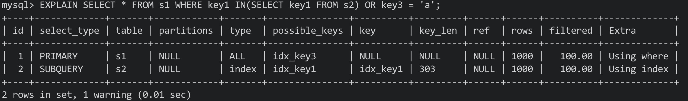
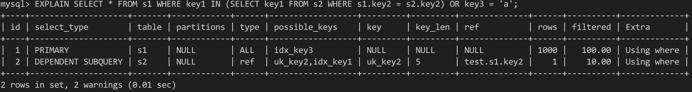

# 十、单表访问方法

- MySQL Server对一条SQL语句进行语法解析后(语法无误)，**会将其交给优化器进行优化**
- 优化的结果便是**执行计划**: 指定使用的索引、连接的顺序等等
- 最后按照执行计划中的步骤调用存储引擎接口来真正的查询，最后返回结果集


Eg Table:


## 10.1 访问方法

- MySQL官方将MySQL**执行查询语句的方式**，称为访问方法
- 同一条查询语句**可以使用多种访问方法**来执行


## 10.2 const

- **通过主键/唯一二级索引列**与**常数进行等值比较**，来**定位一条记录**的访问方法定义为**const**
- 如果**索引有多个列(联合索引)**，则只有索引中**每个列都与常数进行等值比较时**，const访问方法才有效

Eg SQL:

```mysql
SELECT * FROM single_table WHERE id = 1438;
SELECT * FROM single_table WHERE key2 = 3841;
```


**注意：**对于唯一二级索引列，查询列为NULL时，比较特殊

```mysql
SELECT * FROM single_table WHERE key2 IS NULL;
```

- 因为唯一二级索引中为**null值的记录数量没有限制**，所以**查询结果可能有多条记录**，**因此也不能用const**


## 10.3 ref

- 搜索条件为**二级索引列与常数进行等值比较，形成的扫描区间为单点扫描区间，采用二级索引执行查询的访问方法为ref**
- 需要回表

Eg SQL:

```mysql
SELECT * FROM single_table WHERE key1 = 'abc';
```

- 每获取一条二级索引记录，**就会立马对其执行回表操作**


过程:


- 由于通过普通二级索引列进行等值比较后，可能会匹配到多条记录，所以该**ref访问方法比const要差一些**(会多次回表)


**注意：**

1. 二级索引允许存储null，其不限制null的数量，所以**在对二级索引列执行IS NULL条件查询时，只能使用ref**
2. 对于联合二级索引来说，**只要前面的连续索引列**是与常数进行等值比较，就能使用ref方法

Eg SQL:

```mysql
SELECT * FROM single_table WHERE key_part1 = 'god like' AND key_part2 = 'legendary'
```

- 联合索引idx_key_part，**key_part1和key_part2是按照索引顺序的**，所以能够使用ref


- 如果左边的连续列**不全是等值的话**，就不能用ref方法:

```mysql
SELECT * FROM single_table WHERE key_part1 = 'god like' AND key_part2 > 'legendary'
```


## 10.4 ref_or_null

- 在ref的基础上，**还需要将列中值为null的记录也找出**，该种执行方法即为ref_or_null
- 只是比ref访问方法多扫描了一些值为null的二级索引记录
- 值为null的记录会被放在索引的最左边

Eg SQL:

```mysql
SELECT * FROM single_table WHERE key1 = 'abc' OR Key1 IS NULL;
```


执行过程:


## 10.5 range

- 使用索引进行查询时，**对应的扫描区间为若干单点扫描区间或者范围扫描区间的访问方法为range**

Eg SQL:

```mysql
SELECT * FROM single_table WHERE key2 IN (1438, 6328) OR key2 >= 38 AND key2 <= 79;
```


**注意：**

- 仅包含一个单点扫描区间或者区间为(-∞, +∞)的访问方法不能称为range


## 10.6 index

- **扫描全部二级索引记录的访问方法为index**

Eg SQL

```mysql
SELECT key_part1, key_part2, key_part3 FROM single_table WHERE key_part2 = 'abc';
```

- 左边的索引列并不连续，无法形成合适的范围区间来减少需要扫描的记录数


其符合两个条件:

1. **索引idx_key_part包含所有查询列表中的列**(索引列包含查询列)
2. **搜索条件key_part2包含在索引中**


- 我们可以**直接遍历idx_key_part索引中的所有二级索引记录(因为索引中有所有需要的列)**，并通过WHERE子句条件进行判断
- 该方式**不需要进行回表操作**


## 10.7 all

- 全表扫描对应的访问方法为all


## 10.8 索引合并

- **使用多个索引完成一次查询**的**执行方法为index merge索引合并**


具体的索引合并方法有三种:

### 1) Intersection

Eg SQL:

```mysql
SELECT * FROM single_table WHERE key1 = 'a' AND key3 = 'b';
```


执行该查询的三种方案:

1. 使用idx_key1索引进行查询

对应的扫描区间为['a', 'a']，对于获取到的每条二级索引记录，都会根据其中的id值(主键列)进行回表操作，再判断key3 = 'b'

因为**扫描区间为一个单点扫描区间**，**所以该区间中的二级索引记录都是按照主键值排序的**


2. 使用idx_key3进行查询

对应的扫描区间为['b', 'b']，对于获取到的每条二级索引记录，都会根据其中的id值(主键列)进行回表操作，再判断key1 = 'a'

因为**扫描区间为一个单点扫描区间**，**所以该区间中的二级索引记录都是按照主键值排序的**


3. 同时使用idx_key1和idx_key3进行查询

在idx_key1中扫描['a', 'a']内的二级索引记录，同时在idx_key3中扫描['b', 'b']内的二级索引记录，**找出两个操作结果中id值相同的记录**

最后再根据共有的id进行回表操作(能省下很多回表操作带来的开销)


**这里的方法3就是intersection索引合并**:

- 对从**不同索引中扫描到的记录id取交集**，**只为这些id执行回表操作**
- 使用二级索引时，**从二级索引中获取的记录必须要以主键值排列**


为什么要求从二级索引获取到的记录要按照主键值排序？

- 从两个有序集合中取交集比两个无序集合要容易
- 如果获取的id有序的，则进行**回表时则不会进行单纯的随机I/O**，能有效的提高效率


方法3步骤:


如果**用二级索引从扫描区间中获取的二级索引记录不是按照主键值排序的**，则**不能使用Intersections索引合并方式执行**

```mysql
SELECT * FROM single_table WHERE key1 > 'a' AND key3 = 'b';
```

- 使用索引idx_key1在区间['a', +∞]中获取的记录不是按照主键值排序的，所以不能使用Intersection索引合并的方法执行


如果WHERE子句中含有聚簇索引

Eg SQL:

```mysql
SELECT * FROM single_table WHERE key1 = 'a' AND id > 9000;
```

ID会和key1 = 'a'形成扫描区间: (('a', 9000), ('a', +∞))，此时直接扫描二级索引idx_key1即可，不需要扫描聚簇索引


### 2) Union

- 通过二级索引查询出的二级索引记录的id值进行去重，根据去重后的id进行回表操作，重复的id只需要回表一次


Eg SQL:

```mysql
SELECT * FROM single_table WHERE key1 = 'a' OR key3 = 'b'
```

- 同时使用idx_key1和idx_key3索引执行查询，从两个获取索引记录的id中进行去重，根据去重的id执行回表操作
- 重复的id只回表一次


**注意：**从索引中获取的**记录必须都是按照主键值进行排序的**，理由同Intersection


Eg SQL:

```mysql
SELECT * FROM single_table WHERE (key_part1 = 'a' AND key_part2 = 'b' AND key_part3 = 'c') OR (key1 = 'a' AND key3 = 'b');
```

- 先通过idx_key1和idx_key3执行Intersection索引合并(key1 = 'a' AND key3 = 'b')
- 在通过idx_key_part执行索引合并即可


### 3) Sort-Union

- 使用Union的条件很苛刻: **通过索引获取的记录必须是按照主键值排序的**
- Sort-Union比起Union**只多了一步对二级索引记录的主键值进行排序的过程**

为了让Union更加易用，出现了Sort-Union


Eg SQL:

```mysql
SELECT * FROM single_table WHERE key1 < 'a' OR key3 > 'z'
```

- 先根据key1 < 'a'从索引idx_key1中获取二级索引记录，**并将获取到记录按主键值进行排序**
- 在根据key3 > 'z'从索引idx_key3中获取二级索引记录，**并将获取到记录按主键值进行排序**
- 此时对应记录都是按照主键值排序的了，**剩下的部分和Union一样**


拓展:

- MySQL中并没有Sort-intersection，但MariaDB中实现了Sort-Intersection
- Intersection是为了只回表查询多个条件都符合的主键值(回表开销过大时)，Union是为了去除重复的主键值

****


# 十一、连接原理

- 从本质上说: 连接就是把各个表中的记录都取出来进行依次匹配，并把匹配后的组合发送给client

Eg Table:

```mysql
CREATE TABLE t1 (m1 int, n1 char(1));
CREATE TABLE t2 (m2 int, n2 char(1));

INSERT INTO t1 VALUES(1, 'a'), (2, 'b'), (3, 'c');
INSERT INTO t2 VALUES(2, 'b'), (3, 'c'), (4, 'd');
```


## 11.1 连接简介


### 11.1.1 连接过程

- 如果在连接时不给出任何限制条件，则**产生的笛卡尔积会非常巨大，所以连接时过滤记录是必要的**
- 查询中过滤条件分为两种:


1. 单表条件:

其实就是之前说过的搜索条件

2. 涉及多表的过滤条件


连接查询大致过程

Eg SQL:

```mysql
SELECT * FROM t1, t2 WHERE t1.m1 > 1 AND t1.m1 = t2.m2 AND t2.n2 < 'd';
```


1. 确定第一个需要查询的表(**驱动表**)

单表查询其实只需要选择代价最小的那种访问方法执行即可(const, ref, ref_or_null等)

假如以t1为驱动表: 需要查找满足t1.m1 > 1的记录，因为数据量很少，所以无法创建二级索引，此时使用all执行方法(全表扫描)

2. 步骤1**每获取一条记录，都从t2中查找匹配的记录**


过程图:


- 总结:

两表连接查询中，**驱动表只需要访问一次**，而**被驱动表可能会需要访问多次**


- 强调:

这里并不是先将所有从驱动表搜索出来的记录放到一个地方，再去被驱动表中查询的，**而是每获得一条记录后马上到被驱动表中匹配**


### 11.1.2 内连接和外连接


内外连接的区分: 

有时**即使在被驱动表中没有找到匹配的记录，仍然需要把驱动表的结果放入结果集**，为了解决该问题才有了内外连接

- 内连接: 如果驱动表中的记录在被驱动表中**找到不匹配的记录，则该记录不会添加到结果集**
- 外连接: 如果驱动表中的记录在被驱动表中**找到不匹配的记录，该记录仍然会添加到结果集**


两种外连接:

- 左外连接: 选择左侧的表作为驱动表
- 右外连接: 选择右侧的表作为驱动表


WHERE和ON:

- 无论是内外连接，**被WHERE过滤掉的记录都不会被添加到结果集**
- 对于外连接驱动表中的记录: 如果**无法在被驱动表中找到匹配的记录**，该驱动表记录**依然会加入到最后的结果集**


**注意：**ON子句是专为外连接提出的，如果在内连接中使用，MySQL会把它像WHERE子句一样对待，**内连接中WHERE和ON是等价的**


#### 1) 外连接语法

```mysql
SELECT column FROM table1 LEFT/RIGHT (OUTER) JOIN table2 ON (join condition) WHERE (condition)
```

- OUTER可省略


#### 2) 内连接语法

```mysql
SELECT columns FROM table1 (INNNER/CROSS) JOIN table2 (ON condition) (WHERE condition)
```

- Inner/cross和省略的写法都是等价的
- 由于内连接中ON子句和WHERE是等价的，所以内连接可以没有ON子句


## 11.2 连接原理


### 11.2.1 嵌套循环连接(Nested-Loop Join)

- 定义：驱动表只访问一次，但被驱动表却可能访问多次，而且**访问次数取决于驱动表查询后结果集中记录的数量**
- 类似嵌套了很多for循环


简述过程:


**注意：**对于循环嵌套算法来说，**每当从驱动表中获取了一条记录，则会马上通过该记录在被驱动表中查询一次并发送给client**


### 11.2.2 使用索引加快连接速度

Eg SQL:

```mysql
SELECT * FROM t1, t2 WHERE t1.m1 > 1 AND t1.m1 = t2.m2 AND t2.n2 < 'd';
```

- 该查询使用的是嵌套循环连接算法，查询的执行过程为:


- 条件t1.m1 = t2.m2在针对t2表进行查询时，**t1表的条件就已经确定了**(已经查询了驱动表)，所以我们**只需要优化针对t2表的查询即可**
- 根据t2条件可以进行如下尝试:


1. 在m2列上建立索引

因为针对m2列的条件是等值比较，可以使用ref访问方法执行查询，回表后再判断t2.n2 < 'd'

- 如果m2列是t2表的主键或者不为null的唯一二级索引，则单表查询时为const
- **在连接查询中**，**对被驱动表的主键或者不为null的唯一二级索引进行等值查找**的访问方法为**eq_ref**


2. 在n2列上建立索引

- 此时可能用到range访问方法(t2.n2 < 'd')，其需要回表后再判断t2.m2列的条件


**补充：**

- 如果两列都有索引，则挑一个代价低(单表访问方法更快)的进行查询
- 如果查询列表和过滤条件中的列存在于二级索引中，那么此时可使用index访问方法(不需要回表)，**所以为了能使用更多的访问方法，最好不要使用*作为查询列表**


### 11.2.3 基于块的嵌套循环连接

- 由于被驱动表可能被扫描多次，内存中可能会无法放下一张完整的表，此时需要频繁地释放内存
- 当**被驱动表中数据很多，且无法使用索引进行访问时，相当于要从磁盘上多次读取该表，I/O代价较大**
- 我们**需要减少被驱动表的访问次数**


- 为了减少I/O损耗，可以**使用Join Buffer(连接缓冲区)先装下若干驱动表结果集中的记录**
- 之后再**将被驱动表中的每条记录一次性地与Join Buffer中的多条驱动表记录进行匹配**(匹配过程在内存中进行，可以显著减少被驱动表的I/O损耗)
- Join Buffer: **在查询执行前申请的一块固定大小的内存**

使用过程:


- **最好的情况是Join Buffer足够大，能够容纳驱动表结果集中的所有记录**，这样就**只需要访问一次**被驱动表了
- 这种加入了块的嵌套循环连接算法称为**基于块的嵌套循环连接算法**(Block Nested-Loop Join)


设置:

- Join Buffer的大小可以通过启动项或者系统变量join_buffer_size进行配置:


- 其默认大小为256KB
- 在优化被驱动表的查询时，最好为被驱动表创建索引，**实在不能创建索引则可以尝试将join_buffer_size调大**
- join buffer并不会存放驱动表记录中的所有列，**只会存放查询列表和搜索条件中的列**，**所以最好不要在查询列表中使用*，这样可以在join buffer中存放更多的记录**

****


# 十二、基于成本的优化


## 12.1 成本的定义

- I/O成本: 查询记录时，需要将数据/索引从磁盘加载到内存中，之后再进行操作，**从磁盘到内存的加载过程损耗的时间称为I/O成本**
- CPU成本: 读取/检测记录是否满足对应的搜索条件，对结果集进行排序**这些操作损耗的时间称为CPU成本**


对InnoDB存储引擎来说，**页是磁盘与内存之间交互的基本单位**，读取一个页面的默认成本为1.0，读取/检测一条记录是否符合搜索条件的成本默认为0.2，**1.0和0.2这些数字被称为成本常数**(这两个成本最常用)

**注意: 即使不需要检测记录是否符合，读取记录时的成本也为0.2**


## 12.2 单表查询的成本


### 12.2.1 准备工作

Eg Table:

```mysql
CREATE TABLE single_table(
	id INT NOT NULL AUTO_INCREMENT,
  key1 VARCHAR(100),
  key2 INT,
  key3 VARCHAR(100),
  key_part1 VARCHAR(100),
  key_part2 VARCHAR(100),
  key_part3 VARCHAR(100),
  common_field VARCHAR(100),
  PRIMARY KEY(id),
  KEY_idx_key1 (key1),
  UNIQUE KEY uk_key2 (key2),
  KEY idx_key3 (key3)
  KEY idx_key_part(key_part1, key_part2, key_part3)
)Engine=InnoDB CHARSET=utf8;
```


### 12.2.2 基于成本的优化步骤

- 在**执行一条查询之前**，MySQL的**优化器会找出所有可以用来执行该查询语句的方案**
- 对比后选择**成本最低的方案，该方案就是执行计划**，之后才会调用存储引擎提供的接口执行查询

大致过程:

1. 根据搜索条件**找出所有可能使用的索引**
2. **计算全表扫描的代价**
3. 计算**使用不同索引执行查询的代价**
4. 对比各种执行方案的代价，**找出成本最低的方案**


实例:

```mysql
SELECT * FROM single_table WHERE
	key1 IN ('a', 'b', 'c') AND
	key2 > 10 AND key2 < 1000 AND
	key3 > key2 AND
	key_part1 LIKE '%hello%' AND
	common_field = '123';
```


#### 1) 根据搜索条件，找出所有可能使用的索引

- MySQL设计者将**一个查询中可能使用到的索引称为possible keys**
- key1 IN (...): 可以使用索引idx_key1
- key2 > 10 AND ...: 可以使用索引idx_key2
- key3 > key2: 没有与常数比较，无法形成合适的扫描区间
- key_part1 LIKE '%hello%': 通过LIKE和通配符匹配，不能产生合适的扫描区间
- common_field = '123': 没有在该列上建立索引，所以不会用到索引


#### 2) 计算全表扫描的代价

- 对于InnoDB表: 全表扫描即，**将所有的聚簇索引记录依次与给定的搜索条件进行比较**

- 符合搜索条件的加入到结果集中

- 需要**将聚簇索引对应页加载到内存中，再检测是否符合搜索条件**，查询成本 = I/O成本 + CPU成本

- 计算全表扫描的代价时需要两个信息:

  - 聚簇索引占用的页面数
  - 该表中的记录数

  

- 如何获取上述两个信息:

  - MySQL设计者在每个表中都维护了一系列的统计信息，可以直接查看:

Syntax:

```mysql
SHOW TABLE STATUS LIKES 'table_name'\G;		// \G可以将所有数据竖直输出
```


- 目前只关心两个选项:
  - Rows: 表示**表内记录的条数**(**对于InnoDB存储引擎表来说该值为一个估计值**，**对于MyISAM存储引擎表来说该值是准确的**)，
  - Data_length: **表示表占用的存储空间字节数**，对于MyISAM表其为数据文件的大小，**对于InnoDB表其为聚簇索引占用的存储空间大小**，可按照如下公式计算: 聚簇索引页面数 * 每个页面的大小:

65536 / 16 /1024 = 4，所以聚簇索引所占的页面数为4


计算过程:

- I/O成本: 4 * 1.0 + 1.1 = 5.1

4指的是聚簇索引页的数量，1.0指一个加载页面的成本常数，1.1为一个微调值，不用在意

- CPU成本: 1000 * 0.2 + 1.0 = 101

1000指记录的数量，0.2指访问一条记录的成本常数，1.0是一个微调值

- 总成本: 106.1

全表扫描的成本为106.1


**注意：**正常来说全表扫描中只需要扫描叶子结点，不需要扫描内节点，但**在计算成本时直接计算了整个聚簇占用的页面数**(没有区分)


#### 3) 计算不同索引执行查询的代价

- MySQL查询优化器总是**先分析唯一二级索引的成本**，再分析普通索引的成本


1) 使用uk_key2索引

执行查询该索引使用了二级索引 + 回表的方式，计算查询成本时需要考虑两方面的数据: **扫描区间数量和需要回表的记录数**

- 扫描区间数量:

无论扫描区间内的二级索引记录占用多少，查询优化器都**认为读取一个扫描区间的I/O成本与读取一个页面的成本一致**

- 需要回表的记录数:

查询优化器**需要计算二级索引某个扫描区间包含多少记录**:

1. 首先根据条件找到第一条记录(根据B+树定位记录是很快的，消耗可以忽略不计
2. 在获取最后一条满足条件的记录
3. 只要左右边界记录间隔不大，就可以精确统计出条件中的二级索引记录条数


**注意:** 在Index_Page中有一个Page Header部分，其中**一个名为PAGE_N_RECS的属性，该属性代表页面中的记录数**，所以如果条件中左右记录相差不远，则直接累加中间页面中的PAGE_N_RECS值即可

**如果左右相隔比较远，则只从左第一条记录向右读取10个页面，计算页面中的平均记录，之后用平均值 * 页面数**(粗略计算)


那怎么获取页面数呢？

- 通过**包含区间所有记录的父节点中目录项记录之间的记录数**即可
- 如果**在上一层中一个父节点页无法全部包含，则取再往上一级的父节点页即可**


- 假如在区间(10, 1000)中有大概95条记录，则读取二级索引对应的CPU成本为: 95 * 0.2 + 0.01 = 19.01(0.01为微调值)
- 回表操作:
  - 评估回表操作的I/O成本时，每次回表操作都相当于访问一个页面，也就是说二级索引扫描区内有多少记录，就需要进行多少次回表操作，共95条记录，则需要回表95次，消耗的I/O成本为95 * 1.0 = 95

- 回表后的记录需要再使用搜索条件进行判断，共95条，则读取并检测的CPU成本为: 95 * 0.2 = 19
- 最后总成本为: 
  - I/O成本: 1.0 + 95 * 1.0 = 96.0
  - CPU成本: 95 * 0.2 + 0.01 + 95 * 0.2 = 38.01

共134.01


**注意：**MySQL中在最初比较使用二级索引的时候，**会先忽略掉回表后检测聚簇索引记录的成本**。**如果计算后使用该索引的成本最低，则再加上最后检测聚簇索引记录的成本后再次进行计算**


2. 使用idx_key1执行查询

- 对应的搜索条件: key1 IN('a', 'b', 'c')，相当于三个单点扫描区间


- 扫描区间的数量

三个扫描区间，付出的I/O成本为3 * 1.0 = 3.0


之后同上:


综上:

总成本为121.0 + 47.21 = 168.21


3. 索引合并

- 查询到的二级索引不是按照主键值排列的，所以不会使用Intersection索引合并


#### 4) 对比各种执行方案的代价，找出成分最低的方案

在本例子中各种可执行方案及对应成本:

- 全表扫描: 2037.7
- 使用uk_key2: 134.01
- 使用idx_key1: 168.21

注意:


### 12.2.3 基于索引统计数据的成本计算

- 使用索引执行查询时，**需要算一下索引记录的条数**
- 先获取索引对应B+树的左右最值记录，再计算两条记录间有多少记录
- MySQL设计者将这种**通过直接访问索引对应B+树来计算某个扫描区间内索引记录条数的方法**，称为**index dive**


- 如果**对应单点扫描区间过多**，则需要多次重复扫描索引，开销极大
- MySQL设计者设定了一个变量: "eq_range_index_dive_limit"，默认为200
- 其**限定了可以使用index dive的最大单点区间数**


- 如果单点区间数超过了这个限制，则需要使用索引统计数据(index statistics)


查看索引统计数据:


各个列属性和含义:


- Cardinality: 基数，代表某个列中不重复的值的个数，对于InnoDB存储引擎来说，该Cardinality是一个估计值


- 之前说过: 如果单点扫描区间数超过了变量eq_range_index_dive_limit限定的值，则会使用索引统计数据来计算各个区间对应的索引记录数，其指如下两个值:
  - show table status里显示出来的Rows值(表示表中记录的数量)
  - show index显示出来的Cardinality属性

- 我们可以**根据这两个值来计算出一个列中一个值平均重复了多少次**: Rows / Cardinality
- **得出的平均值即为单个单点扫描区间对应的大致记录数**
- 通过统计数据来计算比扫描索引要快，**但其缺点为不准确**


**注意：**在MySQL5.7.3及之前的版本中，eq_range_index_dive_limit的默认值为10，但之后都为200


## 12.3 连接查询的成本


### 12.3.1 准备工作

- 之后将single_table写作s1，将single_table写作s2


### 12.3.2 条件过滤

- MySQL连接查询使用的是嵌套循环连接算法，所以其两表连接的查询成本分为两个方面:
  - 单次查询驱动表的成本
  - 多次查询被驱动表的成本(取决于驱动表查询后结果集中的记录数)


- 我们将**通过驱动表查询出的记录数称作扇出(fanout)**，扇出值越小，对被驱动表的查询次数越少，对于总查询成本越低

计算扇出的例子:


- 总结起来就是:**在以下两种情况中，计算驱动表扇出值时，需要靠猜测**
  - **使用全表扫描的方式执行单表扫描时**，需要**猜测满足所有搜索条件的记录条数**
  - **使用索引来执行单表查询时**，需要**猜测满足形成索引扫描区间的条件外，还满足其他搜索条件的条数**


- MySQL设计者**将这个猜测过程称为Condition Filtering(条件过滤)，可能使用索引或者统计数据**


### 12.3.3 两表连接的成本分析

- 连接查询的成本计算公式: 单次访问驱动表的成本 + 驱动表扇出值 * 单次访问被驱动表的成本
- 对于外连接查询来说，**只需要为驱动表和被驱动表选择成本最低的访问方法即可**
- 内连接则**需要考虑不同表作为驱动表的情况**，**需要考虑最佳的表连接顺序**


计算最优内连接查询方案例子:

Eg SQL:

```mysql
SELECT * FROM s1 INNER JOIN s2
	ON s1.key1 = s2.common_field
	WHERE s1.key2 > 10 AND s1.key2 < 1000 AND
	s2.key2 > 1000 AND s2.key2 < 2000;
```


#### 1) 使用s1作为驱动表

涉及s1这一单表的搜索条件:

- s1.key2 > 10 AND s1.key2 < 1000


从使用全表扫描和uk_key2索引这两个方案中选择成本最低的一个即可，之后涉及被驱动表s2的搜索条件为:

- s2.common_field = 常数(针对驱动表中每一条记录，都需要访问一次被驱动表s2，**此时s1对于的值固定，涉及两表的条件此时只涉及被驱动表**)
- s2.key2 > 1000 AND s2.key < 2000

common_field没有索引，此时访问s2表的方法只有使用全表扫描和uk_key2两种

最后使用s1作为驱动表的成本为(**暂不考虑使用Join Buffer**):

使用uk_key2访问s1的成本 + s1扇出值 * 使用访问uk_key2访问s2的成本


#### 2) 使用s2作为驱动表

涉及s2这一单表的搜索条件:

- s2.key2 > 1000 AND s2.key2 < 2000


从使用全表扫描和uk_key2索引这两个方案中选择成本最低的一个即可，之后涉及被驱动表s2的搜索条件为:

s1.key1 = 常数

s1.key2 > 10 AND s1.key2 < 1000

- 这里可以通过idx_key1使用ref访问方法，也可以通过uk_key2使用range访问方法，也可以使用全表扫描，从中选择一个即可
- 其中range方法时区间是确定的，但使用idx_key1的成本不确定，其实使用统计数据计算出一个平均每个值的重复次数即可
- 假定这里选用了idx_key1，则总成本为:

使用uk_key2访问s2的成本 + s2的扇出值 * 使用idx_key1访问s1的成本


- **其中占大头的为驱动表扇出值 * 单次访问被驱动表的成本**，所以我们需要重点优化一下两点:
  - 减少驱动表的扇出
  - 减少被驱动表的访问次数(**最好在被驱动表的连接列上建立索引，这样就能使用ref了，如果可以最好将主键或者唯一二级索引作为连接列，这就就是const了**)


### 12.3.4 多表连接的成本分析

- 连接n张表，则有n!种连接顺序
- MySQL查询优化器会计算每种连接顺序的成本，为了减少因计算不同连接顺序的成本而带来的损耗，有几种方法:


1. 提前结束某种连接顺序的成本估计

在计算各种顺序的连接成本之前，会**维护一个全局变量，其代表当前最小的连接查询成本**，一旦在**计算当前连接顺序的成本已经大于该值时，则不再继续分析了**(该方法一定不是最优)


2. 系统变量optimizer_search_depth

如果连接表的个数小于该值，则继续计算该连接顺序的成本，**如果大于，则只计算连接该变量数量以内的表的成本**。

该值越大，越能得到好执行计划，但耗时越长

Eg:


3. 启发式规则不考虑某些连接顺序

MySQL设计者提出了一些启发性规则(基于以往的经验)，不满足该规则的连接顺序则不分析，提供了一个系统变量optimizer_prune_level来控制是否使用这些规则


## 12.4 调节成本常数

之前提到的两个成本常数:

- 读取一个页面的成本默认为1.0
- 读取及检测一条记录是否符合搜索条件的成本为0.2


其余的成本常数都存储在MySQL库对应的两张表中:


- 一条语句执行时分别在server和存储引擎层执行
- 在server层执行连接管理、查询缓存、语法解析、查询优化等操作，在存储引擎层执行具体的数据存取操作
- **SQL语句在server层操作的成本与其操作表时使用的引擎无关**


### 12.4.1 mysql.server_cost

该表记录了在server进行操作对于的成本常数:


- cost_name: 成本常数的名称
- cost_value: 成本常数对应的值。该值为null时则取默认值
- last_update: 最后更新记录的时间
- comment: 注释


其对应的成本常数:


拓展:

- 在执行某些特殊情况下的子句或者排序查询时，MySQL会在内部创建一个临时表，通过这个临时表完成查询
- 如果数据量较大，则将存储在磁盘中(MyISAM/InnoDB)，如果数据量较小，则存储在内存里(MEMORY)


修改成本常数

Syntax:

```mysql
UPDATE table_name SET cost_value = new_number WHERE cost_name = 'column_name';
```


修改后需要重新加载

Syntax:

```mysql
FLUSH table_name;
```

- 如果想要恢复默认值，则改回为null即可


### 12.4.2 mysql.engine_cost表

- 其记录了在存储引擎层进行的操作对应的成本常数，具体内容如下:


比起server_cost表，其多了两个列:

- engine_name: 成本常数使用的引擎名称，**为default则成本常数适用于所有的存储引擎**
- device_type: 存储引擎使用的设备类型，主要为了区分常规的机械硬盘和固态硬盘，部分版本中，该值为0(不区分)


支持的成本常数:


- 由于目前无法判断查询需要访问的块中哪些已经加载到内存中，哪些还在磁盘上，所以认为无论这个块是否被加载到内存中，其使用成本都为1.0
- 我们可以直接修改成本常数，也可以为这张表直接插入新记录来添加针对某中存储引擎的成本常数
- 修改/插入后仍旧需要重新加载这个表的值

****


# 十三、InnoDB统计数据的收集方式

- 这里只介绍InnoDB的统计数据收集和存储方式


## 13.1 统计数据的存储方式

两种永久性地存储统计数据和非永久性地存储统计数据

- 永久性地存储统计数据:

存储在磁盘上，重启后还在

- 非永久性:

存储在内存上


MySQL通过一个系统变量来控制将统计数据存储在何处:


- 从MySQL5.6.6开始，该变量值默认为ON(默认在磁盘上)，之前为OFF
- 在创建表和修改表的时候，可以**直接指定/修改STATS_PERSISTENT属性来制定统计数据的位置**，值为1表明存储在磁盘上，值为0表明存储在内存上


## 13.2 基于磁盘的永久性统计数据

将表内数据及其索引的统计数据存放在磁盘上，**在MySQL上就是将对应的统计数据存放在两张表中**:


- innodb_table_stats: 存储了**表数据相关**的统计数据，每条记录都对应一张表数据的统计数据
- innodb_index_stats: 存储了**表索引**的统计数据，每条记录都对应一个索引的统计数据


### 13.2.1 innodb_table_stats

innodb_table_stats表中各列用途:

|       Field Name        |            Description             |
| :---------------------: | :--------------------------------: |
|      database_name      |        The name of database        |
|       table_name        |         The name of table          |
|       last_update       |      The last time to update       |
|         n_rows          |   The number of records in table   |
|  clustered_index_size   | The primary index used page number |
| sum_of_other_index_size |  The other index used page number  |

- 该表的主键为(database_name, table_name)


Eg:


- n_rows: 表中记录的数量
- clustered_index_size: 聚簇索引占用的页面数
- sum_of_other_index: 其他索引占用的页面数


#### 1) n_rows统计项的计算

- 之所以n_rows是一个估计值，是因为在innodb中，计算表中的记录数按照如下步骤:
  - 按照一定的算法，从聚簇取出一些叶子节点页面，统计每个页面中包含的记录数量之后，再计算一个页面中平均包含的记录数
  - 最后将该平均值 * 全部叶子节点的数量即可


- n_rows**精确的程度取决于统计时采样的页面数量**


MySQL提供了一个名为"innodb_stats_persistent_sample_pages"的系统变量来表示计算统计数据时采样的页面数

- 该值越大，则n_rows值越精确，但耗时也越久，该值默认为20:


- 我们也可以单独设置某张表的采样页面数:

```mysql
CREATE TABLE table_name() Engine = innodb, STATS_SAMPLE_PAGES = value;
ALTER TABLE table_name STATS_SAMPLE_PAGES = value;
```


#### 2) clustered_index_size和sum_of_other_idex_sizes统计项的收集

- 在收集这两个统计项的数据时，需要**统计各个索引对应的叶子节点段和非叶子节点段分别占用的页面数**
- 统计一个段占用的页面数的步骤:


1. 从数据字典中获取表各个索引对应的页面位置。可以在系统表SYS_INDEXEX中获取索引对应的根页面信息
2. 从根页面中的Page Header中找到叶子节点段和非叶子节点段对应的Segment Header，索引根页面的Page Header中有两个字段
   - PAGE_BTR_SEG_LEAF: 表示B+树叶子节点段的Segment Header信息
   - PAGE_BTR_SEG_TOP: 表示B+树非叶子节点段的Segment Header信息

3. 从叶子节点段和非叶子节点段的Segment Header中过找到段对应的INODE Entry结构
4. 根据INODE Entry结构，获取对应所有的零散页地址和FREE, NOT_FULL, FULL链表基节点
5. 直接统计零散页的数量，从三个链表的List Length字段中读取该段占用的区的数量，从而获取整个段占用的页面


**注意：**当段中数据非常多超过32个页面时，会直接申请一个区，以区为单位申请后，其中的部分页可能并未使用，但在计算时还是一并计算了，所以最终统计项计算出的数值可能会偏大


### 13.2.2 innodb_index_stats

Eg:


各个列的作用:


- 该表的主键为(database_name, table_name, index_name, stat_name)，stat_name代表统计项的名称

关于表single_table的索引统计数据:


查看该数据的方式:

1. 先查看index_name列，该列**说明该记录是哪个索引对应的统计信息**，可以查看到各个索引所占的记录条数

2. 对于同一个索引的记录(index_name相同)，**stat_name表示索引的统计项名称**，**stat_value表示该索引在该统计项上的值**

   索引的统计项:

   - n_left_pages: 表示该索引的**叶子节点实际占用的页面数**
   - size: 该**索引共占用的页面数**(包含分配给叶子/非叶子节点段但未使用的页面)
   - n_diff_pfxNN: 对应索引列不重复的值: 其中的NN代表索引列的序号
     - 如在索引idx_key_part中，列key_par1就对应n_diff_pfx01

3. 计算某些索引列中包含多少个不重复值时，需要对叶子节点页面进行采样。而sample_size就指定了采样的页面数

- 如果采样的页面数大于索引的叶子结点数，则需要采样所有的叶子节点页面


### 13.2.3 定期更新统计数据

- 当表中的数据发生变化时，统计数据也会相应的变化


两种更新统计数据的方法:


1. 开启innodb_stats_auto_recalc

- 系统变量innodb_stats_auto_recalc决定了服务器是否重新计算统计数据，默认为ON
- 如果**发生变动的记录数超过了表大小的10%，且该变量已开启，则服务器会重算一次统计数据**，并自动更新innodb_table_stats和innodb_index_stats表
- 该**自动重新计算统计数据的过程是异步的，所以达到条件后不会马上自动重新，会有延迟**

Eg:


我们也可以单独控制一张表是否自动重新计算统计数据:

Syntax:

```mysql
CREATE TABLE table_name (
...
)STATS_AUTO_RECALC = 1/0;

ALTER TABLE table_name STATS_AUTO_RECALC = 1/0
```


2. 手动调用ANALYZE TABLE来更新统计信息

syntax:

```mysql
ANALYZE TABLE table_name;
```

Eg:


### 13.2.4 手动更新innodb_table_stats和innodb_index_stats表

- 我们可以像普通表那样手动更新其中的值:

```mysql
UPDATE table_name 
	SET column = value 
	WHERE table_name = 'table_name';
```


- 更新后需要重新加载:

```mysql
FLUSH TABLE table_name;
```


## 13.3 基于内存的非永久性统计数据

- 当我们把innodb_stats_persistent设置为OFF后，创建的表的统计数据就都是非永久的了
- 或者我们可以在创建/修改表示将STATS_PERSISTENT设置为0


采样页面:

- 非永久性的统计数据采样的页面数由系统变量innodb_stats_transient_sample_pages来控制，默认值为8

Eg:


## 13.4 innodb_stats_method的使用

- 索引列中不重复值/唯一值的数量很重要，通过其可以计算出一个值平均重复多少次，其有两个应用场景:

  1. 单表扫描中单点扫描区间太多:

  此时不会使用index dive，而是依赖统计数据中一个值平均的重复次数来计算单点扫描区间对应的记录数量

  2. 设计两表等值匹配的连接条件时，该连接条件对应的被驱动表中的列上有索引，则可以使用ref访问方法来查询被驱动表

  在生成统计数据时，只能依赖统计数据来计算单点扫描对应的记录数


### 特殊情况

如果索引列中出现null值时，统计不重复值时会有问题:

- 有的人认为NULL代表一个不确定的值，每个NULL都是独立的
- 有的人认为NULL代表没有，是重复的
- 有的人认为NULL完全没意义，不应该计算进来

为了避免这个分歧，MySQL提供了一个名为"innodb_stats_method"的系统变量，其有三个候选值:

- nulls_equal(默认值): 认为所有的NULL值都相同，记为1次
- nulls_unequal: 认为所有的NULL值是不相等的
- nulls_ignored: 直接忽略掉NULL

****


# 十四、基于规则的优化/子查询

- MySQL设计者会通过一些规则将性能很差劲的SQL语句转换成可以高效执行的形式，**该过程称为查询重写**


## 14.1 条件从简


### 14.1.1 移除不必要的括号

Eg SQL:

```mysql
SELECT * FROM (t1, (t2, t3)) WHERE t1.a = t2.a AND t2.b = t3.b;
```


移除之后:

```mysql
SELECT * FROM t1, t2, t3 WHERE t1.a = t2.a AND t2.b = t3.b;
```


### 14.1.2 常量传递

- 如果表达式中有某个列和某个常量的等值匹配，且这个表达式与其他涉及这个列的表达式之间用AND进行连接时，可以将其他表达式中的对应列替换为常量

```mysql
等值匹配: a = 5
其他表达式：a = 5 AND b > a

替换后:
a = 5 AND b > 5
```


### 14.1.3 移除没用的条件

- 明显为true/false的表达式会被优化器移除，如下

```mysql
(a < 1 AND b = b) OR (a = 6 OR 5 != 5)
```

简化后:

```mysql
(a < 1 AND true) OR (a = 6 OR false)
a < 1 OR a = 6
```


### 14.1.4 表达式计算

- 在执行查询之前，如果表达式中只有常量的话，其值会被先行计算出来，如下

```mysql
a = 5 + 1
a = 6
```


- 如果某个列**不是以单独的形式作为表达式的操作数**，则优化器不会尝试对其进行化简，例如

```mysql
ABS(a) > 5

-a < -8
```


- 在搜索条件中**只有索引列和常数使用某些符号连接后**，才可能形成合适的范围区间来减少需要扫描的记录数量


### 14.1.5 HAVING和WHERE

- 如果查询语句中没有聚集函数以及GROUP BY子句，查询优化器就会将HAVING子句和WHERE子句合并


### 14.1.6 常量表检测

有两种类型的查询运行得很快


1. 表中一条记录都没有/只有一条记录
    - 记录数依靠的是统计数据，由于InnoDB的统计数据不准确，所以不能使用InnoDB存储引擎的表


2. 使用主键等值匹配或者唯一二级索引等值匹配作为搜索条件


- **使用这两种方式查询的表称为常量表(constant table)**
- 查询优化器**在分析一条语句时首先执行常量表查询**，之后**再把其他查询中涉及该表的条件全部替换为常数**


Eg SQL:

```mysql
SELECT 
	*
FROM 
	table1
INNER JOIN table2 ON table1.column1 = table.column2
WHER table1.primary_key = 1;
```


- 其中使用了主键值和常量进行等值匹配，所以table1常量表
- 在分析table2的查询成本之前，会先执行针对table1的查询，得到查询结果后将原查询中涉及table1的条件都替换为常量，替换后为

```mysql
SELECT
	table1的常量,
	t2.*
FROM
	table1
INNER JOIN table2 ON table1的常量 = table2.column2;
```


## 14.2 外连接消除

- 外连接无法优化表的连接顺序，为了优化连接顺序，我们可以使用一些技巧


示例表:


- 普通的外连接:

```mysql
SELECT
	*
FROM
	t1
LEFT JOIN t2 ON t1.m1 = t2.m2;
```


- 此时未在驱动表中匹配到的记录也会添加到结果集中，未匹配的列值为null


- 但如果我们在WHERE子句中执行被驱动表的列不能为null，则该外连接查询的结果就与内连接无异了


```mysql
SELECT
	*
FROM
	t1
LEFT JOIN t2 ON t1.m1 = t2.m2
WHERE t2.n2 IS NOT NULL;
```


- 除此之外，我们还可以显式地指定某个被驱动表的列符合IS NOT NULL条件如

```mysql
SELECT
	*
FROM
	t1
LEFT JOIN t2 ON t1.m1 = t2.m2
WHERE t2.m2 = 2;
```


- 此时该外连接SQL与内连接等价:

```mysql
SELECT
	*
FROM
	t1
INNER JOIN t2 ON t1.m1 = t2.m2
WHERE t2.m2 = 2;
```


**重点：**

- 在外连接查询中，**指定的WHERE子句中包含被驱动表中的列不为null值的条件**，称为空值拒绝(reject-NULL)
- 一旦被驱动表的WHERE子句**符合空值拒绝的条件，则外连接和内连接可以相互转换**
- 这样一来查询优化器就可以评估表不同连接顺序的成本，从而选择成本最低的连接顺序


## 14.3 子查询优化


### 14.3.1 子查询语法


#### 1) 子查询出现的位置

- 在SELECT查询列表中
- 在FROM子句中
    - 放在FROM子句后面的子查询称为派生表
- 在WHERE或者ON子句中(最常用)
- GROUP BY和ORDER BY
    - 没意义


#### 2) 子查询的分类


1. 按照返回的结果集

    1. 标量子查询

    只返回一个单一的值(一条一列的记录)

    

    

    2. 行子查询

    只返回一条记录(需要包含多个列，如果只有一个列那就变成标量子查询了)

    

    

    3. 列子查询

    返回多条记录，但一条记录中只有一列数据(如果只有一条记录就变成标量子查询了)

    

    4. 表子查询

    返回的结果包含多条记录，每条记录又包含多个列


2. 与外层查询的关系

    

    1. 不相关子查询

    如果子查询**可以独立运行出结果，不依赖其他外层查询的值**，则这个子查询为不相关子查询

    

    2. 相关子查询

    如果子查询**需要依赖其他外层查询的值**，则这个子查询为相关子查询

    Eg SQL:

    ```mysql
    SELECT * FROM t1 WHERE m1 IN (SELECT m2 FROM t2 WHERE n1 = n2);
    ```

    存在条件n1 = m2，n1属于外层查询的值，所以该子查询是一个相关子查询


#### 3) 子查询在布尔表达式中的使用


- 使用操作符(comparison_operator)

```mysql
操作数 comparison_operator (子查询)
```

操作数可以是列名/常量/表达式/子查询

**注意：****这里只能为标量子查询/行子查询(只能有一条记录)**


Eg SQL:

```mysql
SELECT * FROM t1 WHERE m1 < (SELECT MIN(m2) FROM t2);

SELECT * FROM t1 WHERE (m1, n1) = (SELECT m2, n2 FROM t2 LIMIT 1);
```


- [NOT] IN/ANT/SOME/ALL子查询

如果子查询为列子查询/表子查询，则结果集中包含多条记录，每条记录相当于一个集合，所以不能单纯地用操作符进行比较，使用如下语法将操作数与集合形成一个布尔表达式


1. IN/NOT IN

```mysql
操作数 [NOT] IN (subqueries);
```

- 含义为判断**某个操作数是否存在于子查询结果集中**


2. ANY/SOME

```mysql
操作数 comparison_operator ANY/SOME(subqueries);
```

- 含义: 只要**指定的操作数**通过操作符**与子查询中任意一个值**比较时，**结果为TRUE，则整个表达式为TRUE**


- ANY: **判断子查询结果结果集中**是否存在**某个值等于给定的操作数**，**其含义与IN相同**

Eg SQL:

```mysql
SELECT * FROM t1 WHERE m1 > ANY(SELECT m2 FROM t2);
```

其等价于:

```mysql
SELECT * FROM t1 WHERE m1 > (SELECT MIN(m2) FROM t2);
```


- ALL: 判断某个操作数与该子查询结果集中所有值通过操作符比较时，是否都为TRUE，都为TRUE则整个表达式才为TRUE，否则为FALSE

Eg SQL:

```mysql
SELECT * FROM t1 WHERE m1 > ALL(SELECT m2 FROM t2);
```

其等价于:

```mysql
SELECT * FROM t1 WHERE m1 > (SELECT MAX(m2) FROM t2);
```


- EXISTS子查询

只判断子查询结果结果集中是否有记录，不在乎记录的值


#### 4) 子查询语法注意事项

- 子查询必须用小括号括起来
- 在查询列表中的子查询必须时标量子查询
- 想要获取标量子查询或者行子查询，但不能保存结果集只有一条记录时，应该使用语句LIMIT 1来限制记录数量
- 对于[NOT] IN/ALL/ANY/SOME子查询来说，子查询中不允许有LIMIT语句
- 没有聚集函数的HAVING子句和GROUP BY子句是毫无意义的


- 子查询的结果相当于一个集合，集合里的值是否排序一点也不重要
- 不能在一条语句中CRUD的时候还对该表进行子查询


### 14.3.2 子查询的执行过程

示例表:


#### 1) 自以为的执行方式

- 如果子查询为不相关子查询

Eg SQL:

```mysql
SELECT
	*
FROM
	s1
WHERE key1 IN (SELECT common_field FROM s2);
```


1. 先单独执行子查询
2. 再将子查询得到的结果作为外层查询的参数(记录较多时会先存放在临时表/物化表中)，执行外层查询


- 如果该子查询是相关子查询

Eg SQL:

```mysql
SELECT
	*
FROM
	s1
WHERE key1 IN (SELECT common_field FROM s2 WHERE s1.key2 = s2.key2);
```


1. 先从外层查询中获取一条记录
2. **找出该条记录中子查询涉及的值**(s1.key1)，**通过该值执行子查询**
3. **根据子查询的结果**来**检测外层WHERE子句的条件是否成立**，**如果成立**则将这条从外层查询获取的记录加入结果集
4. 获取剩余记录重复上述步骤


#### 2) 标量/行子查询的执行方式

使用标量/行子查询的场景:

- 在查询列表中
- 使用操作符和操作数组成一个布尔表达式


不相关标量/行子查询:

- 与我们自以为的顺序相同(先执行子查询，在将结果作为外层查询的参数，最后执行外层查询)


相关标量/行子查询:

- 也同我们认为的一样(先从外层中取出一条记录，找出子查询对应的值，通过该值执行子查询，通过外层的WHERE判断子查询的结果集，符合则添加到结果集)


#### 3) IN子查询优化


##### 1. 物化表的概念

- 对于不相关的IN子查询来说，如果单独执行子查询后的结果集太多，为导致最终的结果集太多，内存可能放不下

// 对于expr IN (arg1, arg2, ...)这种IN子句来说，IN中的参数首先会被排列，如果不能利用索引将IN子句划分为若干扫描区间，则**会对已经排序好的参数进行二分查找**，加快计算IN的效率


**为了避免这种情况**，MySQL**不直接将不相关子查询的结果集作为外层查询的参数，而是将其写入到一个临时表中**，该临时表的两点注意事项:

- 该临时表的列就是子查询结果集中的列
- 写入临时表的记录会被去重


为什么要去重?

- IN**只是判断某个操作数是否存在于某个集合**，所以集合中的值是否重复并不重要，但**去重后可以让临时表变小**


临时表去重的方法:

- 创建对应的主键/唯一索引
- 通常会为它建立基于内存使用MEMORY引擎的临时表，并建立哈希索引


IN语句本质就是判断操作数是否在集合内


- 如果子查询的结果集很大，且**超过了系统变量tmp_table_size或者max_heap_table_size的值**，临时表会转为使用基于磁盘的存储引擎，索引也变为B+树


**总结：**将子查询结果集中的记录保存到临时表的过程就是**物化**，**存储子查询结果集的临时表就是物化表**，物化表中的记录都建立了对应的索引，所以查询速度很快，从而提升了子查询的速度


##### 2. 物化表转连接

Eg SQL:

```mysql
SELECT
	*
FROM
	s1
WHERE key1 IN (SELECT common_field FROM s2 WHERE key3 = 'a');
```

- 我们将存储子查询结果集的临时表称为"materialized table"，其存储子查询结果集的列为m_val


- 从表s1的角度来看:

**对于s1中的记录**来说，如果**记录的key1列值在子查询对应的物化表中**，则该条**记录会被添加到最后的结果集中**


- 从物化表的角度来看:

如果物化表中的记录能在s1表中找到对应记录的key1值与其对应，则将该物化表记录加入到最终的结果集中

Eg:


- 这样一来上面的查询就相当于s1表与物化表进行内连接!

```mysql
SELECT
	s1.*
FROM
	s1
INNER JOIN materialized_table ON key1 = m_val;
```


- 这样一来，转换为内连接之后，查询优化器就可以评估不同连接顺序所需要的成本了！


计算上述内连接的成本


1. 使用s1作为驱动表

- 物化子查询
- 扫描s1表
- s1表中的记录数量 * 通过搜索条件进行单表访问的成本(物化表中记录不重复，且有索引)


2. 使用物化表作为驱动表

- 物化子查询的成本
- 扫描物化表的成本
- 物化表记录数 * 通过搜索条件进行单表访问的成本


##### 3. 子查询转换为半连接

- 能不能不进行物化，直接将子查询转换为连接？

Eg SQL:

```mysql
SELECT
	s1.*
FROM
	s1
WHERE key1 IN (SELECT common_field FROM s2 WHERE key3 = 'a');
```

- 释义: 对于s1中的每条记录，如果能在s2表中找到一条或者多条记录符合搜索条件，则该条s1记录会被添加到最终的结果集中，该过程**其实有些类似两表相连接**:

```mysql
SELECT
	s1.*
FROM
	s1
INNER JOIN s2 ON s1.key1 = s2.common_field
WHERE s2.key3 = 'a';
```


- 不同的是，在连接过程中，**可能会有大于两条的s2记录与s1表中的记录对应**，这样一来**s1中的记录就会被多次添加到结果集中，所以IN子查询和内连接并不是完全等价的**


- 但将子查询转换为连接又能够发挥出优化器的作用，所以MySQL设计了一个新概念**半连接(semi-join)**
- 半连接的含义:

**只关心s2(子查询表)中是否存在匹配的记录**，而不考虑数量，**最终结果集也只保留s1中的记录**


半连接的实现办法:


- Table pullout(子查询中的表上拉)

当**子查询的查询列表处只有主键列或者唯一索引列时**，可以**将子查询中的表上拉到外层FROM子句中**，并**将子查询中的搜索条件合并到外层查询的搜索条件中**


为什么可以这样做？

因为这样一来**子查询中的列值就是唯一的了**，也就没有重复值，这样也就**不会有多条记录与外层记录匹配**，**同一条外层查询记录也就不会被多次添加到结果集了！**


- Duplicate Weedout(重复值消除)

Eg SQL:

```mysql
SELECT
	*
FROM
	s1
WHERE key1 IN (SELECT common_field FROM s2 WHERE key3 = 'a');
```


该查询转换为连接的话，s1中的记录在s2中可能有多条与之匹配，所以一条s1中的记录可能会被多次添加到结果集中，**为了消除重复，我们创建一个临时表**，表如下(示例而已):

```mysql
CREATE TABLE temp(
id INT PRIMARY KEY
);
```


在执行连接时，**每当s1中的记录要加入到结果集时**都将**该记录的id尝试添加到该临时表中**，如果添加成功则说明该记录还没有添加到结果集中(第一次匹配)，则可以将其添加到结果集，如果失败则直接丢去(重复了)


**使用临时表消除半连接结果集中重复值的方式称为Duplicated Weedout**


- LooseScan(松散扫描)

Eg SQL:

```mysql
SELECT
	*
FROM
	s1
WHERE key3 IN (SELECT key1 FROM s2 WHERE key1 > 'a' AND key1 < 'b');
```


此时利用到了索引，转换为连接后如果将s2作为驱动表，则过程为:


在索引中，我们每次都只取重复二级索引值中的第一条记录来执行匹配，这样的操作方式称为LooseScan


- Semi-join materialization(半连接物化)

其实前面的物化在连接查询的过程也是一种半连接的实现方法，由于物化表中对记录进行了去重，所以可以直接将子查询转换为连接


- FirstMatch(首次匹配)

首先获取外层查询中的记录，然后将其与子查询中的记录进行匹配，如果找不到该记录，则直接丢弃

如果能找到一条，则只将这一条放入结果集中，不断重复知道外层查询中没有记录


**注意：**相关子查询不是一个独立的查询，所以不能转换为物化表(Semi-join materialization)


##### 4. 半连接的适用条件

并非所有包含IN语句的子查询语句都可以转换为半连接，只有形如下面的查询才可以:

```mysql
SELECT 
	...
FROM
	outer_tables
WHERE expr IN (SELECT ... FROM inner_tables...) AND ...;

或者

SELECT 
	...
FROM
	outer_tables
WHERE (oe1, oe2) IN (SELECT ie1, ie2, ... FROM inner_tables...) AND ...;
```


条件为:

- 子查询必须是与IN操作符组成的布尔表达式，而且在外层查询中的WHERE或者ON出现
- 外层查询中的其他搜索条件必须用AND与IN子查询搜索条件连接起来
- 子查询必须是单一的查询，不能是由UNION组合成的多个查询
- 子查询中不得包含GROUP BY, HAVING或者聚集函数


##### 5. 不适用于半连接的情况

- 外层查询的WHERE子句中，存在其他搜索条件，其与IN子查询之间用OR连接

Eg SQL

```mysql
SELECT
	*
FROM
	s1
WHERE key1 IN (SELECT common_field FROM s2 WHERE key3 = 'a') OR key2 > 100;
```


- 使用了NOT IN
- 位于查询列表中的IN
- 子查询中包含GROUP BY/HAVING/聚集函数
- 包含UNION


优化不能转换为半连接查询的子查询:

- 尝试将不相关的子查询物化之后再参与查询

Eg SQL:

```mysql
SELECT
	*
FROM
	s1
WHERE key1 NOT IN (SELECT common_field FROM s2 WHERE key3 = 'a');
```

- 将子查询物化后再判断key1是否在物化表的结果集中
- 此时不能转为连接，只能进行常规扫描


##### 6. Exists

- 任意一个子查询都可以转换为EXISTS子查询

Syntax:

```mysql
outer_expr IN (SELECT inner_expr FROM ... WHERE subquery_where)
转换为
EXISTS(SELECT inner_expr FROM ... WHERE subquery_where AND outer_expr=inner_expr)
```

- 即将判断记录是否存在与子查询中，改为了是否存在符合条件的记录
- 但如果outer_expr或者subquery为null，则结果都为null，EXISTS的结果则为TRUE/FALSE


- 如果IN在WHERE/ON中，则不区分NULL和FALSE


为什么要转换为EXISTS?

- 不转换的话可能无法使用到索引

Eg SQL:

```mysql
SELECT
	*
FROM
	s1
WHERE key1 IN (SELECT key3 FROM s2 WHERE s1.common_field = s2.common_field)
OR key2 > 100;
```


转换后:

```mysql
SELECT
	*
FROM
	s1
WHERE EXISTS (SELECT key3 FROM s2 WHERE s1.common_field = s2.common_field AND s2.key3 = s1.key1)
OR key2 > 100;
```

- 这样一来就能使用到idx_key3索引了


**注意：**如果一张表既不能转换为半连接，也不能转换为物化表或成本太高，则会被转换为EXISTS子查询


**拓展：**在MySQL5.5及之前的版本中，没有引入半连接和物化表的方式来优化子查询，一律都会转换为EXISTS，所以在之前的版本中需要我们手动转换为连接


##### 7. 小结

如果子查询符合转换为半连接的条件，则查询优化器会优先将子查询转换为半连接，之后再考虑五种半连接中成本最低的策略:

- Table pullout
- Duplicate Weekout
- LooseScan
- Semi-join Materialization
- FristMatch execution

如果不符合半连接的条件，则:

- 将子查询物化，再执行查询(非连接)
- 转换为EXISTS


#### 4) ANY/ALL子查询优化

见表:


#### 5) [NOT] EXISTS 子查询的执行

- 如果[NOT]EXISTS子查询**是不相关子查询**，则可以先执行子查询，得到改结果的TRUE/FALSE后，之后带入布尔值重写原来的查询语句

Eg SQL:

```mysql
SELECT
	 *
FROM
	s1
WHERE EXISTS (SELECT 1 FROM s2 WHERE key1 = 'a')
OR key2 > 100
```

假如该子查询的结果为TRUE，则SQL如下

```mysql
SELECT
	*
FROM
	s1
WHERE TRUE OR key2 > 100;

之后简化为

SELECT
	*
FROM
	s1
WHERE TRUE ;
```


- 对于相关子查询

Eg SQL:

```mysql
SELECT
	*
FROM
	s1
WHERE EXISTS(SELECT 1 FROM s2 WHERE s1.common_field = s2.common_field);
```

- 该查询只能使用我们认为的方式进行，优化的思路只有建立索引


#### 6) 派生表的优化

- 定义: 放在FROM子句后的子查询相当于一个派生表

Eg SQL:

```mysql
SELECT
	*
FROM (
	SELECT
		id AS d_id,
  	key3 AS d_key3,
	FROM
  	s2
  WHERE key1 = 'a'
) AS derived_s1
WHERE d_key3 = 'a';
```


派生表的两种查询思路:

- 物化派生表
    - 将派生表的结果集写入到一个临时表中，之后将该临时表作为普通表进行查询
    - 物化派生表时使用了一种名为延迟物化的策略(查询时真正用到派生表时才尝试物化派生表，而不会提前物化派生表)

Eg SQL:

```mysql
SELECT * FROM (
	SELECT * FROM s1 WHERE key1 = 'a'
) AS derived_s1 INNER JOIN s2
ON derived_s1.key1 = s2.key1
WHERE s2.key2 = 1;
```

首先在s2中查找满足s2.key2 = 1的记录，如果没有找到则说明参与连接的s2是空的，所以最终的结果集也是空的，也就没必要物化派生表了


- 将派生表和外层查询合并(重写为没有派生表的形式)

Eg SQL:

```mysql
SELECT
	*
FROM
	(SELECT * FROM s1 WHERE key1 = 'a') AS 'derived_s1';

重写后

SELECT
	*
FROM
	s1
WHERE key1 = 'a';
```


不能与外层查询合并的情况:

- 派生表中有聚集函数
- DISTINCT
- GROUP BY
- HAVING
- LIMIT
- UNION/UNION ALL
- 派生表中对应的子查询的查询列表内有另一个子查询


总结:

- 先尝试与外层查询合并，再尝试将派生表物化后执行

****


# 十五、EXPLAIN详解

- 查询优化器在优化一条查询语句之后，会生成一个执行计划，其展示了执行查询的具体方式(多表的连接顺序，单表访问方法等等)
- 我们可以使用EDXPLAIN语句查看某个SQL的具体执行计划
- 了解EXPLAIN语句的输入项后，就能有针对性的提升SQL的性能了
- SELECT和DELETE, INSERT, REPLACE和UPDATE前面都可以加上EXPLAIN来查看执行计划，这里只说SELECT


EXPLAIN各个输出列的作用:

|  column_name  |                 description                  |
| :-----------: | :------------------------------------------: |
|      id       |         每个SELECT关键字都对应一个id         |
|  select_type  |    SELECT对应查询的类型(联合/子查询等等)     |
|     table     |                     表名                     |
|  partitions   |                匹配的分区信息                |
|     type      |                单表的访问方法                |
| possible_keys |              可能用到的所有索引              |
|      key      |                实际使用的索引                |
|    key_len    |              实际使用索引的长度              |
|      ref      |  当索引列等值查询时，进行等值查询匹配列信息  |
|     rows      |             估计需要读取的记录数             |
|   filtered    | 预计需要读取的记录中，过滤后的数据所占的比例 |
|     Extra     |                   额外信息                   |


Eg table: single_table


有两个构造相同的表: s1, s2


## 15.1 各列详解


### 15.1.1 table

- 该列代表该表的表名


Eg:


### 15.1.2 id

- 查询语句中每出现一个SELECT关键字，则在EXPLAIN中都有一个唯一个id
- 在连接查询中，一个SELECT后的FROM可以跟多个表，所以在连接查询的执行计划中，每张表都会对应一个记录，但这些记录的id相同(在同一个id下)

Eg:

```mysql
EXPLAIN SELECT * FROM s1 INNER JOIN s2;
```


- 在连接查询的执行计划中，每张表都对应一条记录，这些记录的id相同(在同一个SELECT下)
- 出现在前面的就是驱动表，在后面的就是被驱动表


- 在涉及多个SELECT的子查询中，每个SELECT都对应一个唯一的id

Eg:

```mysql
EXPLAIN SELECT * FROM s1 WHERE key1 IN (SELECT key1 FROM s2) OR key3 = 'a';
```


- s1表在外层查询中，所以其id为1；s2表在子查询中，其id为2


- **注意:**查询优化器可能将设计子查询的语句重写，从而转化为了连接查询(半连接)

Eg:

```mysql
EXPLAIN SELECT * FROM s1 WHERE key1 IN (SELECT key3 FROM s2 WHERE common_field = 'a');
```


- 这里就转化为了连接，并将s2物化了


- 联合查询

```mysql
EXPLAIN SELECT * FROM s1 UNION SELECT * FROM s2;
```


- 其中第三条记录为一个临时表(名为<unioin1, 2>)，因为UNION会将id为1和2的查询结果集合并起来并去重
- 其id为null说明其为临时表
- 如果改为UNION ALL则不需要去重，也就不需要临时表了

Eg:


**注意：**在MySQL5.6及之前的版本中，UNION ALL也可能使用临时表


### 15.1.3 Select_type

- Select_type表明了每个SELECT代表的小查询扮演的角色


Select_type的值

|         Name         |                         Description                          |
| :------------------: | :----------------------------------------------------------: |
|        SIMPLE        |         Simple SELECT(not using UNION or subqueries)         |
|       PRIMARY        |                       Outermost SELECT                       |
|        UNION         |         Second or later SELECT statement in a UNION          |
|     UNION RESULT     |                      Result of a UNION                       |
|       SUBQUERY       |                   First SELECT in subquery                   |
|  DEPENDENT SUBQUERY  |      Frist SELECT in subquery, dependent on outer query      |
|       DERIVED        |                        Derived table                         |
|     MATERIALIZED     |                    Materialized subquery                     |
| UNCACHEABLE SUBQUERY | A subquery for which the result cannot be cached and <br />must be re-evaluated for each row of the outer query |
|  UNCACHEABLE UNION   | The second or later select in a UNION that belongs to an <br />uncacheable subquery |
|                      |                                                              |


#### 1) SIMPLE

- **不包含子查询或者UNION的查询**都算SIMPLE，连接查询也是


#### 2) PRIMARY

- 在一个**包含UNION、UNION ALL或者子查询的大查询**来说，其由多个小查询组成
- **最左边/外层的小查询**select_type的值为PRIMARY


#### 3) UNION

- **一个包含UNION、UNION ALL的大查询**是由几个小查询组成的，**处了最左边的小查询以外，其余的都是UNION**


#### 4) UNION RESULT

- 在UNION中需要使用临时表来去重，**该临时表的Select_type为UNION RESULT**


#### 5) SUBQUERY

- 包含**子查询的查询语句不能转化为半连接，且其为不相关子查询**，最后查询优化器决定采用**将该子查询物化的方式来执行**
- 则该**子查询的第一个SELECT关键字对应查询的Select_type为SUBQUERY**

Eg: 




#### 6) DEPENDENT SUBQUERY

- 包含**子查询的语句不能被转为对应的半查询，且最终被查询优化器转换为相关子查询的形式**，则**该子查询的第一个SELECT查询对应的Select type为DEPENDENT SUBQUERY**

Eg SQL:




#### 7) DEPENDENT UNION

- **在包含UNION或者UNION ALL的大查询中**，如果**各个小查询都依赖外层查询**，则**除了最左边的小查询之外**(在这些UNION小查询中)，**其余小查询的Select_type为DEPENDENT UNION**

Eg:


#### 8) DERIVED

- 在包含派生表的查询中，如果以物化表的方式执行查询，则该派生表的Select_type为DERIVED

Eg:


- id为1的表对应的table为<derived2>，说明该查询是将派生表物化后的表进行查询的


#### 9) MATERIALIZED

- 对应包含子查询的查询，**执行时将子查询物化后与外层查询进行连接查询**，该子查询的Select_type为MATERIALIZED

Eg:


**注意：**

- UNCACHEABLE SUBQUERY和UNCACHEABLE UNION不常用


### 15.1.4 partition

- 暂不提


### 15.1.5 type

- type指明了对某个表执行查询时的具体访问方法


#### 1) system

- 如果表中只有一条记录且，该表使用存储引擎的统计数据时精确的(MyISAM，MEMORY)，则该表的访问方法为system


#### 2) const

- 根据主键/唯一二级索引与常数进行等值匹配时，访问方法为const


#### 3) eq_ref

- 执行**连接查询时**，**被驱动表通过主键/非null的唯一二级索引等值匹配的方式进行访问时**，该驱动表的访问方法为eq_ref


#### 4) ref

- 通过普通二级索引进行等值匹配的方式查询表时，访问方法为ref


- fulltext不展开讲


#### 5) ref_or_null

- 通过普通二级索引进行等值匹配或者为null的方式查询表时，访问方法为ref_or_null


#### 6) index_merge

在某些场景下可以使用索引合并的方式执行，包含Intersection、Union、Sort-Union三种索引合并


#### 7) unique_subquery

- 针对包含IN子查询的查询语句
- 如果查询优化器决定将IN子查询转换为EXISTS子查询，而且在转换之后可以使用主键/非null的唯一二级索引进行等值匹配，则该子查询执行计划对应的type列值为unique_subquery

Eg:


#### 8) index_subquery

- 其与unique_subquery类似，不过在访问子查询中的表使用的普通的索引

Eg:


#### 9) range

- 使用索引**获取某些单点扫描区间的记录或者某些范围扫描区间**，可能使用到range访问方法

Eg:


#### 10) index

- 可以**使用索引覆盖，但需要扫描全部的索引记录时**，则访问方法就是index

Eg:


- 对于InnoDB存储引擎来说，如果我们需要执行全部扫描，且需要对主键进行排序时，此时的type列值就是index


#### 11) ALL

- 全表扫描


### 15.1.6 possible_keys和key

- possible_key表示对某个表执行单表扫描时可能使用到的索引
- key表示实际使用到的索引

Eg:


- 在使用index访问方法时，possible_key是空的，而key列中是实际使用的索引

Eg:


- possible_key中的索引不是越多越好，**可以使用的索引越多，查询优化器在计算查询成本时花费的时间越长**


### 15.1.7 key_len

- 想要从查询计划中直接获取形成扫描区间的边界条件时，就能用到key_len了

Eg:


key_len值由三部分组成:

1. 该列实际数据最多占用的存储空间长度(字符集规定的单个字符所占最大子节数 * 该列最大可容纳的字符数量)
2. 再加1字节(如果改列的值可以为null)
3. 再加上2字节(如果列为变长类型，会多出两个子节来存储该列的实际数据占用的存储空间)


再回头看上面例子的输出:

- key列为idx_key1，说明查询计划使用了idx_key1索引
- key_len为303，说明形成扫描区间的搜索条件只有key1一个列(3(utf8) * 100)
- 而涉及key1的搜索条件只有key1 > 'a' AND key1 < 'b'


**注意：**这里计算每个变长类型字符都看作2个字节，是因为这里只是server层，与存储引擎不同，key_len的作用只是让我们在使用联合索引时，能够知道查询计划具体涉及了几个列的搜索条件作为形成搜索区间的边界条件


Eg:


- 这里的key_len为303，所以明显查询计划只涉及key_part1这一个列


Eg:


- key_len为606，说明查询计划涉及key_part1，key_part2两个列


### 15.1.8 ref

- 与索引列等值匹配的东西(为一个常数const/一个列)

Eg:


- ref段的值为const，说明在使用idx_key1查询时，与key1列匹配的是一个常数


Eg:


- ref段的值为test.s1.id，即一个具体的字段，说明在使用主键索引时，与id列进行等值匹配的是s1.id列


Eg:


- ref列的值为func，说明与key1列进行等值匹配的对象是一个函数


### 15.1.9 rows

- 如果查询优化器使用全表扫描的方式查询，则rows列对应**该表记录数的估计值**
- 如果使用过索引来执行查询，则rows列代表**预计扫描的索引记录数**

Eg:


### 15.1.10 filtered

- 计算驱动表扇出时采用的一个策略: condition filtering(条件过滤)
    - 使用全表扫描，则计算扇出时需要估计满足所有搜索添加的记录条数
    - 使用索引执行单表扫描时，计算扇出时需要估计在满足索引列对应搜索条件外，还满足其他搜索条件的记录数

Eg:


假如rows列为266(满足索引列条件的记录数)，因为filtered列为10，所以266条记录中满足common_field = 'a'的记录只占10%

(该字段在单表查询中意义不大，我们重点关注其在连接查询中的值)


Eg:


- 在查询计划中，s1作为驱动表，而rows为1000，filtered为10，则扇出值为100

    还要对被驱动表查询100次


### 15.1.11 Extra

提供一些额外的信息，可以更准确地理解MySQL执行查询语句的方式


#### 1) No tables used

- 没有FROM子句时的提示


Eg:


#### 2) Impossible WHERE

- WHERE子句条件永远为false


#### 3) No matching min/max row

- 查询列表中有聚集函数，但没有符合WHERE搜索条件的记录(一条都没有)


#### 4) Using index

- 使用覆盖索引时(二级索引已经包含了查询列表中的列，不需要回表)


#### 5) Using index condition

- 搜索条件中有索引列(WHERE中)，但不能形成合适的扫描区间(**使用了索引下推**)

Eg:


- 在没有索引下推特性时，server层生成执行计划会按照如下步骤:


key1 LIKE '%a'条件虽然不能用来形成合适的扫描区间，但其用到了索引列，所以还有其他的利用方法


- **这样的改进就是索引下推**


注意："key1 > 'z'"这个条件通过索引下推在存储引擎层判断时会判断key1 > 'z' AND key1 LIKE '%a'是否成立(形成扫描区间的条件作为索引条件下推进行重复判断)


- 索引下推总结:
    - 该功能的目的是为了减少回表的次数，所以针对的是二级索引
    - 该功能值适用于二级索引


#### 6) Using where

- 需要回表，并将完整的聚簇索引用户记录返回给server层判断(因为索引不包含搜索条件中的所有列)


Eg:


#### 7) Using join buffer(Block Nested Loop)

- 被驱动表需要多次访问，为了减少I/O，使用join buffer先行加载一些驱动表记录，方便一次性匹配


#### 8) Using intersection/union/sort_union

- 使用索引合并的方式执行查询


#### 9) Zero limit

- 当LIMIT子句参数为0时，说明不打算从表中读取任何数据


#### 10) Using filesort

- 需要对结果集中的记录进行排序
- 排序时无法用到索引，需要在内存(记录较少)或者磁盘中进行排序(记录较多)

Eg:


- 优化时应该尝试改为使用索引排序


#### 11) Using temporary

- 在去重/排序等操作时，如果不能利用索引，则需要建立内部的临时表

Eg:


Eg:


- 这里出现了file sort，但SQL没有ORDER BY子句
- 其实MySQL在包含GROUP BY子句的查询中，默认添加一个ORDER BY

因此上述SQL其实和加上ORDER BY的SQL查询是等价的


- 如果不想为包含GROUP BY的查询进行排序，则需要显式的加上ORDER BY NULL

Eg:


#### 12) Start temporary, End temporary

- 在将子查询转换为半查询时，当执行的策略为Duplicate Weedout时，会通过建立临时表为外层查询的记录进行去重操作，此时Extra列中会显示Start temporary，被驱动表的Extra将显示End temporary


#### 13) LooseScan

- 在将IN子查询转为半查询时，如果采用的是LooseScan执行策略，则驱动表执行计划的Extra列显示为LooseScan


#### 14) FirstMatch(table_name)

- 在将IN子查询转为半查询时，如果采用的是FirstMatch执行策略，则被驱动表执行计划的Extra列显示为FirstMatch(table_name)


## 15.2 JSON格式的执行计划

- 之前的EXPLAIN语句的输出缺少了执行计划的成本，我们可以在EXPLAIN和SQL加上FORMAT = JSON获得JSON格式的执行计划，其中就包含了执行计划的成本


Syntax:

```mysql
EXPLAIN FORMAT=JSON SQL...;
```


Eg:


以一张表为例:


s1表的read_cost由两个部分组成:

- I/O成本
- 检测的rows * (1 - filter)条记录的CPU成本


eval_cost的计算方式:

- 检测rows * filter条件记录的成本


prefix_cost就是单独s1表的总成本: read_cost + eval_cost

data_read_per_join表示查询中需要读取的数据量


总结: 只需要知道prefix_cost是查询s1表的成本即可


## 15.3 Extend EXPLAIN

- 可以使用SHOW WARNINGS语句查看的执行计划


- 当Code为1003时，Message字段展示的信息**类似查询优化器重写后的语句**
- 只是类似，并不等价，所以其并不是标准的查询语句，只是帮助理解查询优化器的一个参考依据

****


