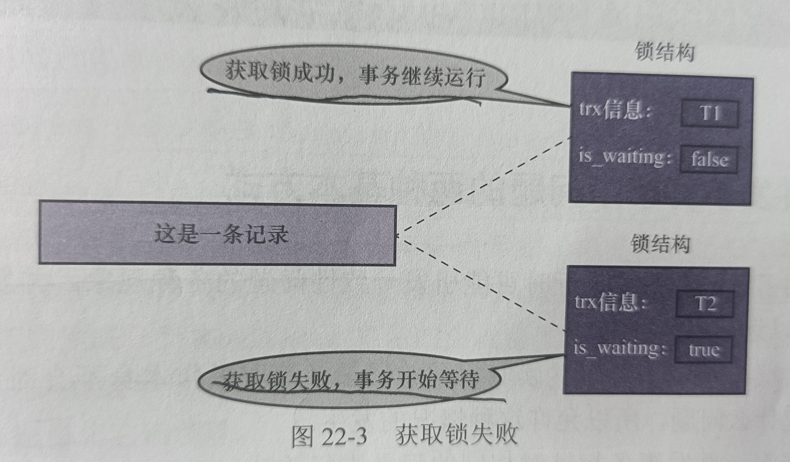
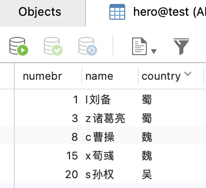
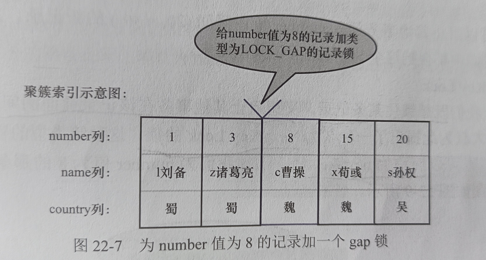
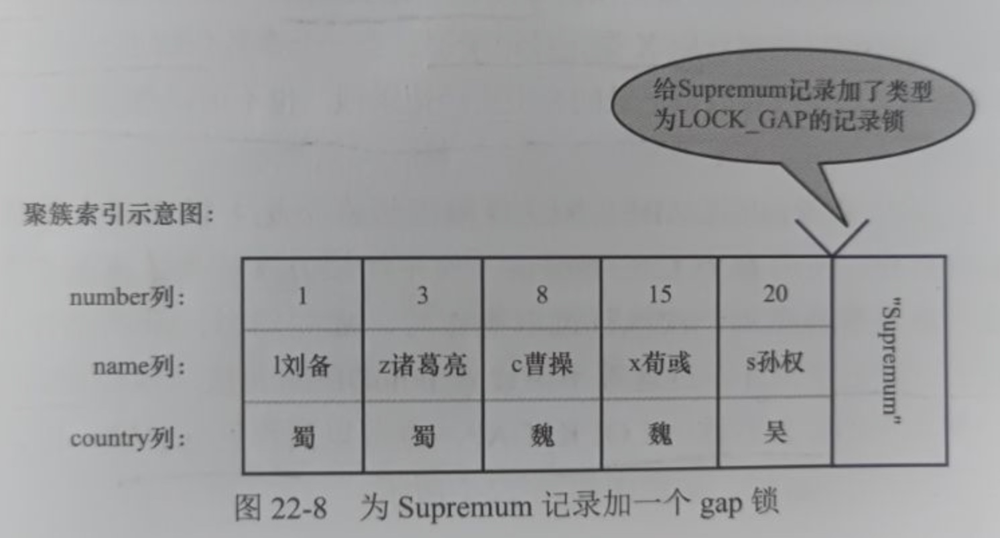
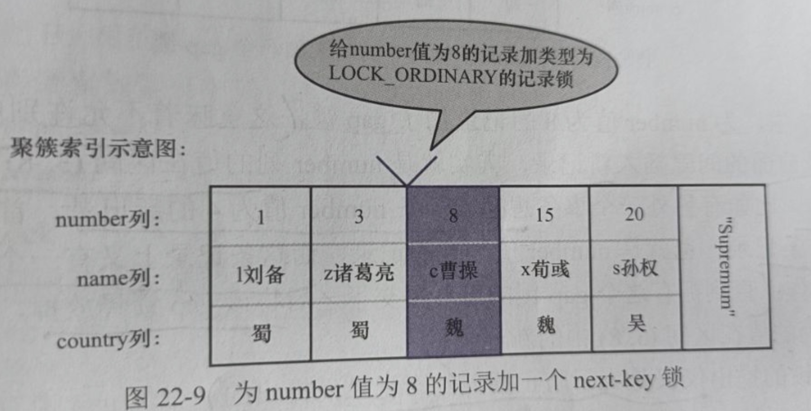
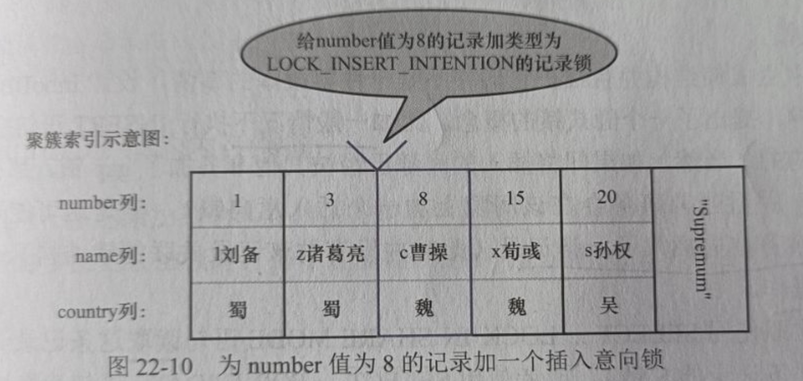
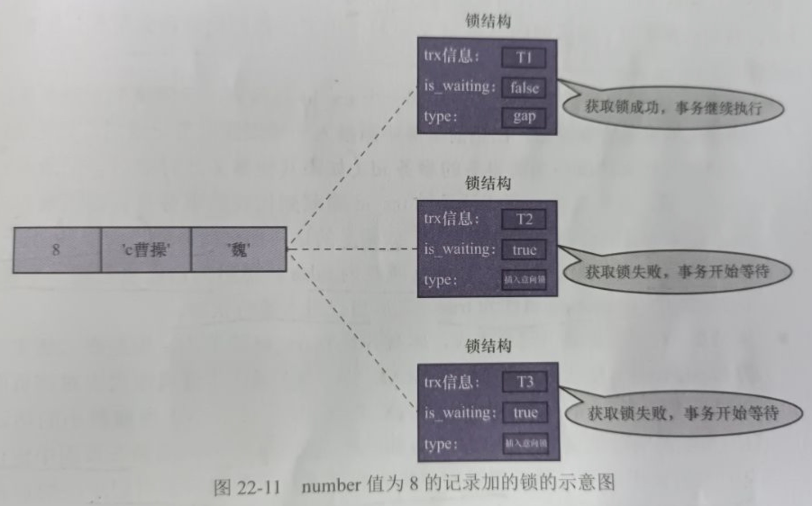
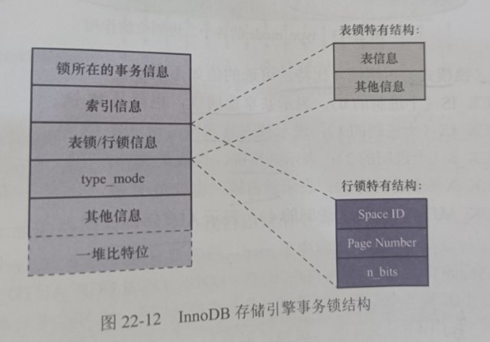

# 二十二、锁


## 22.1 并发事务带来问题的两种基本方式

- 写-写: 引发脏读
- 读-写/写-读: 前者引发不可重复读问题，后者引发脏读问题


### 22.1.1 写-写

因为任何隔离等级都不允许脏写，所以多个未提及事务相继修改同一个记录时，需要它们排队执行，**排队的过程就是为记录加锁实现的**

锁的本质就是一个内存中的结构，而在事务开始前没有锁结构与记录关联


当事务**想对记录进行修改时**，会**先到内存中查看有没有与该记录关联的锁结构**

如果没有则在内存中生成一个锁结构与该记录关联


锁结构中有很多属性，这里暂时只说两个:

- trx: 表示锁结构关联的事务
- is_waiting: 表示当前事务是否在等待

Eg:


如图，事务为T1，在事务改动记录前，就生成一个锁结构与事务关联、

**因为该记录没有锁**，所以is_waiting的属性为false，我们**称为获取锁成功/加锁成功**，然后就可以继续执行操作了


T1事务提交前，事务T2也想对记录进行改动，此时T2先查看该记录上时候有锁结构

如果有，则T2**也生成一个锁结构与该记录关联，但is_waiting属性为true，即需要等待，我们称为获取锁失败/加锁失败**

Eg:




**事务T1提交之后，会将它生成的锁结构释放，然后再检查是否还有与该记录关联的锁结构**

此时发现了之前T2关联的锁，此时**将T2对应锁结构的is_waiting属性设置为false**，并**将事务对应的线程唤醒，让T2继续执行**。这样**T2就获取到锁了**


总结:

- 获取锁成功/加锁成功: 

在内存中生成了对应的锁结构，锁结构的is_waiting属性为false，事务可以继续执行操作

注意：并不是所有的加锁操作都会生成锁结构，还有一种"加隐式锁"的说法，其不会生成实际的锁结构，但依然可以起到保护记录的作用。为记录添加隐式锁的情况也是获取锁成功/加锁成功(后文详解)


- 获取锁失败/加锁失败/没有获取到锁

在内存中生成了对应的锁结构，但锁结构的is_waiting属性为true，事务需要等待，不可以继续执行操作


- 不加锁

不需要在内存中生成对应的锁结构，可以直接执行操作(不包含加隐式锁)


### 22.1.2 读-写/写-读


在SQL92标准中，不同隔离级别事务的特点:

- 在READ UNCOMMITTED级别下: 可能发生脏读、不可重复读、幻读
- 在READ COMMITTED级别下: 不会发生脏读，可能发生不可重复读、幻读
- 在REPEATABLE READ级别下: 不会发生脏读、不可重复读，可能发生幻读
- 在SERIALIZABLE级别下: 上述现象都不会发生


但不同的数据库对SQL标准的支持可能不同

MySQL与SQL标准的不同点: MySQL在REPEATABLE READ级别下很大程度地避免了幻读现象(部分情况下会发生幻读)


避免这些现象的方法有两个:


#### 1) 读操作使用MVCC，写操作加锁

通过生成一个ReadView，通过ReadView找到符合条件的记录版本(undo日志)

查询语句只能读到生成ReadView之前已经提交事务所做的修改

生成ReadView之前未提交事务或之后才开始事务所做的修改是不可见的

写操作针对的是最新版本的记录


回顾:

ReadView本身就保证了事务不可以读取到未提交事务所做的修改，也就避免了脏读

而在REPEATABLE READ级别下，事务执行过程中只有第一次执行SELECT查询才会生成一个ReadView，之后都会复用这个ReadView，从而避免了不可重复读和幻读


#### 2) 读、写都加锁

如果业务场景不允许读取记录的旧版本，而是必须读取记录的最新版本

例如: 

银行存款时，需要先获取账号余额，再将其加上本次存款的数额，最后再写到数据库中

读取余额后就不想让其他事务访问该余额，直到当前事务执行完成后，其他事务才能访问余额

这样在读取记录时就需要对记录加锁，意味着读操作/写操作也要像写-写那样排队执行


拓展:

加锁避免幻读会比较麻烦，因为我们刚开始的时候还不知道哪些会是插入的"幻影记录"，所以不知道给谁加锁


总结:

采用MVCC方式的话，读-写操作并不冲突，性能更高；如果采用加锁方式的话，读-写需要排队，影响性能


### 22.1.3 一致性读

事务利用MVCC进行的读取操作称为一致性读(Consistent Read)，或一致性无锁读(也称快照读)

所有**普通的SELECT语句**在**READ COMMITTED、REPEATABLE READ隔离等级下**都算是一致性读


一致性读**并不会对表中的任何记录进行加锁操作**，**其他事务可以自由地对表中记录进行改动**


### 22.1.4 锁定读


#### 1) 共享锁/独占锁


给锁分类:


- 共享锁(Share Lock)

简称S锁。事务读取一条记录时，需要先获取记录的S锁


- 独占锁(Exclusive Lock)

简称X锁，常称排他锁。事务改动记录时，需要先获取记录的X锁


例子:

假设T1事务获取了一条记录的S锁，之后T2事务也要访问这条记录


1. 如果T2想要一个S锁，T2能够获取该锁，**此时T1和T2同时持有S锁**
2. 如果T2想要一个X锁，此时操作会被阻塞，**直到T1事务提交并释放S锁**


如果T1获取了记录的X锁，那么T2无法获取S锁和X锁，直到T1事务提交并释放X锁

兼容性如下:


| 兼容性 |  X锁   |  S锁   |
| :----: | :----: | :----: |
|  X锁   | 不兼容 | 不兼容 |
|  S锁   | 不兼容 |  兼容  |


#### 2) 锁定读的语句

有时我们想在读取记录的时候就获取记录的X锁，从而禁止其他事务读写该记录

想在读取记录时就为记录加锁的读取方式称为锁定读(Locked Read)


支持锁定读的两种特殊的SELECT语句


- 对读取的记录加S锁

Syntax:

```mysql
SELECT ... LOCK IN SHARE MODE;
```


如果**当前事务执行了该锁定读语句，那么其会为读取的记录加S锁**，这样**可以允许其他事务继续获取该记录的S锁**(别的事务使用SELECT...LOCK IN SHARE MODE来读取记录)

**但不能获取记录的X锁**(别的事务使用SELECT...FOR UPDATE语句来读取记录或者修改记录)

如果**别的事务想要获取记录的X锁**，那么**这些事务会被阻塞**，**直到当前事务提交之后将S锁释放**


- 对读取的记录加X锁

Syntax:

```mysql
SELECT...FOR UPDATE
```


当前事务执行了该语句后，那么它会给读取到的记录加X锁，此时其他事务既不能获取S锁，也不能获取X锁(LOCK IN SHARE MODE/FOR UPDATE)，直到当前事务提交后释放X锁


### 22.1.5 写操作


三种写操作:


#### 1) DELETE

执行DELETE的过程其实就是**先在B+树中定位到这条记录，然后获取这条记录的X锁，最后执行delete mark操作**

该操作称为**获取X锁的锁定读**


#### 2) UPDATE

进行UPDATE操作时分三种情况:


1. 如果**没有修改记录的键值**且**被更新列所占用的空间在修改前后不变**

先在B+树中定位到记录的位置，再获取记录的X锁，最后在原记录上进行修改操作

**这个过程看成一个获取X锁的锁定读**


2. 如果**未修改记录的键值**且**至少有一个被更新列占用的存储空间修改前后发生了改变**

先在B+树中定位到记录的位置，再获取记录的X锁，之后将该记录彻底删除(将记录移到垃圾链表)，最后再插入一条新记录

**这个过程看作是一个获取X锁的锁定读**，与被彻底删除记录关联的锁**会被转移到新插入的记录中**


3. 如果**修改了记录的键值**

相当于**在原记录上执行DELETE操作之后再进行了一次INSERT操作**，加锁操作**需要按照DELETE和INSERT的规则进行**


#### 3) INSERT

新插入的一条记录受隐式锁保护，不需要再内存中为其生成对应的锁结构


注意：在一个事务中加的锁一般在事务提交或中止时才会释放


## 22.2 多颗粒锁

之前的锁都是针对记录的，称为行级锁或者行锁

对一条记录加行锁，影响的只是这一条记录而已，此时我们就说这个行锁的粒度比较细


事务也可以在表级别加锁，所以也称为表级锁或者表锁，对一个表加锁，会影响表中的所有记录，我们就说这个锁的粒度比较粗。给表加的锁分为共享锁(S锁)和独占锁(X锁)


- 给表加S锁

一个事务给表加S锁后:

别的事务可以继续获得该表的S锁

别的事务可以继续获得该表某些记录的S锁

别的事务不可以继续获得该表的X锁

别的事务不可以继续获得该表某些记录的X锁


- 给表加X锁

一个事务给表加X锁后:

别的事务不可以继续获得该表的X锁

别的事务不可以继续获得该表某些记录的X锁

别的事务不可以继续获得该表的X锁

别的事务不可以继续获得该表某些记录的X锁


类比说明:


问题:

在对表加锁的时候，需要确保表中没有记录被加S锁，但通过遍历的方式效率很低

为此提出了一个意向锁(Intention Lock)的概念：


- 意向共享锁(Intention Share Lock):

简称IS锁，当事务准备给记录加S锁时，需要先在表级别加一个IS锁

- 意向独占锁(Intention Exclusive Lock):

简称IX锁，当事务准备给记录加X锁时，需要先在表级别加一个IX锁


此时回到例子中:

- 一个学生到教室自习

此时他在教学楼门口放一把IS锁，然后再到教室门口放一把S锁(行锁)

- 如果有维修工到教室维修

此时他在教学楼门口放一把IX锁，然后再到教室门口放一把X锁(行锁)

之后:


- 如果有领导想要参观教学楼

即想要到教学楼门口放S锁，首先需要看门口有没有IX锁，如果有则说明教室在维修，需要等到维修结束把IX撤掉后，才可以在教学楼门口放S锁


- 如果有考试想要占用教学楼

即想要在教学楼门口放X锁，首先需要看门口有没有IS或者IX锁，如果有则说明教室在自习/维修，需要等到上完自习或者维修结束把IS锁或者IX锁撤掉后，才可以在教学楼门口放X锁


**注意:**

在给教学楼门口加IS锁的时候，是不关心门口是否有IX锁的

维修工在教学楼门口加IX锁时，是不关心门口是否有IS锁或者IX锁的

IS锁和IX**只是用来判断当前时间教学楼里有没有被占用的教室**，只有在对教学楼加S锁或者X锁后才会用到


总结:

IS锁、IX锁是表级锁，它们的提出只是为了在之后加表级的S锁和X锁时判断表中记录是否被上锁，避免用遍历的方式查看表中记录是否上锁

也就是说IS和IX是兼容，X锁和IX锁是兼容的


表级锁的兼容性:

| 兼容性 |   X    |   IX   |   S    |   IS   |
| :----: | :----: | :----: | :----: | :----: |
|   X    | 不兼容 | 不兼容 | 不兼容 | 不兼容 |
|   IX   | 不兼容 |  兼容  | 不兼容 |  兼容  |
|   S    | 不兼容 | 不兼容 |  兼容  |  兼容  |
|   IS   | 不兼容 |  兼容  |  兼容  |  兼容  |


## 22.3 MySQL中的行锁和表锁

不同的存储引擎对锁的支持不同


### 22.3.1 其他存储引擎中的锁

**对于MyISAM、MEMORY、MERGE这些引擎来说**，它们**只支持表级锁，而且这些存储引擎不支持事务**，在**对使用这些存储引擎的表加锁时，一般都是针对当前会话的**


例如:

Session1中对一个表执行SELECT操作，就相当于为表加了一个表级别的S锁

此时如果SELECT操作未完成时，在Session2中对表执行UPDATE操作，相当于要获取表的X锁，此操作会被阻塞

直到Session1中的SELECT操作完成并释放掉表级别的S锁后，在Session2中对表执行UPDATE操作才能继续获取X锁，然后执行更新语句


拓展:

因为使用MyISAM、MEMORY、MERGE这些存储引擎的表**在同一时刻只允许一个会话对表进行写操作**，所以**这些存储引擎最好用在只读场景下**，或者**用在大部分都是读操作或单用户的情景下**


了解:

在MyISAM存储引擎中有一个称为并发插入(Concurrent Insert)的特性，其支持在读取MyISAM表的同时插入记录，这样可以提高插入速度。


### 22.3.2 InnoDB存储引擎中的锁

**InnoDB存储引擎既支持表级锁，也支持行级锁**

表级锁粒度粗，占用资源少。有时我们**只需要锁住几条记录**，如果使用表级锁，效果上相当于为表中所有记录都加锁，所以**性能差**

**行级锁颗粒细**，可以**实现更精确的并发控制**，但是**占用的资源较多**


#### 1) InnoDB中的表级锁


- 表级别的S锁、X锁

对某个表执行SELECT、INSERT、DELETE、UPDATE语句时，InnoDB存储引擎是不会为表添加表级别的S锁或者X锁


**对表执行DDL语句时**，其他事务对这个表**并发执行诸如SELECT、INSERT、DELETE、UPDATE等语句会发生阻塞**

同样的，如果**某个事务对表执行SELECT、INSERT、DELETE、UPDATE语句时**，其他**会话对表执行DDL语句也会发生阻塞**

该**过程是通过在server层使用一种称为元数据锁**(Metadata Lock, MDL)的东西实现的，一般情况不会使用InnoDB存储引擎自己提供的表级别S锁和X锁

MDL锁不是讨论内容


**InnoDB存储引擎提供的表级S锁和X锁作用很小**，只在一些特殊情况下用到(系统崩溃恢复)

我们可以手动获取InnoDB的表级锁:


前提:

在系统变量autocommit = 0、innodb_table_locks = 1时

语法:

```mysql
LOCK TABLES t READ # InnoDB存储引擎会对表t加表级别的S锁
LOCK TABLES t WRITE # InnoDB存储引擎会对表t加表级别的X锁
```

应该尽量避免在InnoDB存储引擎表上使用LOCK TABLES这种手动锁表语句，这些语句不会提供额外保护，只会降低并发能力而已

InnoDB的优势是实现了更细粒度的行级锁，其表级别的S锁和X锁了解一下即可


- 表级别的IS/IX锁

在对InnoDB表的记录加S锁之前，需要先在表级别加一个IS锁

当对InnoDB表的记录加X锁之前，需要先在表级别加一个IX锁

IS/IX锁只是为了后续在加表级别的S/X锁是，判断表中是否有已经被加锁的记录，避免用遍历的方式查看表中是否有上锁的记录


- 表级别的AUTO-INC锁

当我们为某个列添加AUTO_INCREMENT属性后，在插入记录时，可以不指定该列的值，系统会自动赋值


系统自动给AUTO_INCREMENT修饰列进行递增赋值的实现方式有两个:

1. 采用AUTO-INC锁
    - 在执行插入语句时就加一个表级别的AUTO-INC锁
    - 然后为每条插入记录AUTO_INCREMENT修饰的列分配递增的值
    - 在语句执行结束后，再把AUTO-INC锁释放掉
    - 一个事务在持有AUTO-INC锁的过程中，其他事务的插入语句都要被阻塞，从而保证一个语句中分配的递增值是连续的

如果在执行插入语句之前，我们不确定具体要插入记录的条数，一般是使用AUTO-INC锁为AUTO_INCREMENT修饰的列生成对应的值

AUTO-INC锁的作用范围只是单个插入语句，在插入语句执行后，该锁就释放了


2. 采用一个轻量级的锁
    - 在为插入语句生成AUTO_INCREMENT修饰的列的值时，获取这个轻量级锁
    - 在生成需要用的的列值后，就把该轻量级锁释放掉，而不是等到整个语句执行完后才释放锁

如果在插入语句执行前就确定要插入的语句数量，那么一般会使用轻量级锁对AUTO_INCREMENT修饰的列进行赋值。这样可以避免锁定表，从而提高插入的性能


**拓展：**

我们可以通过一个名为innodb_autoinc_lock_mode的系统变量来控制

当值为0时，一律采用AUTO-INC锁

值为2时，一律采用轻量级锁

当值为1时，两种方式混着来

当该值为2时，可能会造成不同事务中的插入语句为AUTO_INCREMENT修饰的列生成的值是交叉的，在主从复制的场景中是不安全的


#### 2) InnoDB中的行级锁

对记录加行锁，如果记录的类型不同，那么起到的功效是不同的


示例表:

```mysql
CREATE TABLE hero(
	number INT,
  name VARCHAR(100),
  country VARCHAR(100),
  PRIMARY KEY (number)
) Engine=InnoDB CHARSET=utf8;
```


存储数据:




常用的行级锁类型:


##### 1. Record Lock


记录锁，仅仅将一条记录锁上

这种锁的官方名称为: LOCK_REC_NOT_GAP，暂时称为"正经记录锁"

正经记录锁分为S型和X型

Eg:

| number  |   1   |    3    |   8   | 15    |  20   |
| :-----: | :---: | :-----: | :---: | ----- | :---: |
|  name   | l刘备 | z诸葛亮 | c曹操 | x荀彧 | s孙权 |
| country |  蜀   |   蜀    |  魏   | 魏    |  吴   |


当一个事务获取了记录的S型正经锁之后，其他的事务也可以继续获取记录的S型正经锁，但不可以继续获取X型正经锁

当事务获取了记录的X型正经锁之后，其他记录不能继续获取S/X型正经记录锁


##### 2. Gap Lock


MySQL在REPEATABLE READ隔离等级下可以很大程度上解决幻读现象

我们可以通过MVCC和加锁来解决，但加锁解决会有一定的问题:

- 事务在第一次执行读取时，这些**对应的幻影记录并不存在，所以无法加上正经记录锁**


为了解决这一问题，提出了一种称为Gap Lock的锁，这种锁的官方名称为LOCK_GAP，简称gap锁

Eg:




图中我们为number值为8的记录加了gap锁后，意味着不允许别的事务在number为8的记录前的间隙插入新记录(即number列值在区间(3, 8)的新记录是不允许插入的)

此时如果有事务想在该区间中插入，则该插入操作会被阻塞

直到拥有gap锁的事务提交后并将该gap锁释放之后，才会允许其他事务才可以插入number列的值在区间(3, 8)中的新记录


**不管是S共享gap锁还是X排他gap锁，起到的作用都是一样的**，gap锁的提出**仅仅是为了防止插入幻影记录**

如果**对记录加上了gap锁(S/X)，其他事务依然可以对记录加上正经记录锁或者gap锁**。所以gap只是为了防止插入幻影记录而已


问题:

**gap锁仅仅是为了不让其他事务向加锁记录的前面插入记录**，最后一条记录的后面怎么办？


此时需要用到两条伪记录:

- Infimum记录: 页面中最小的记录
- Supremum记录: 页面中最大的记录


为了阻止其他事务在最后一条记录的后面插入新记录，我们可以给Supremum记录加锁

这样我们就能防止在最后的区域插入记录了




##### 3. Next-Key Lock

有时，我们既想锁住记录，又想阻止其他事务在记录前面的间隙插入新的记录

为此提出了一个名为Next-Key Lock的锁，其官方名称为LOCK ORDINARY，简称next-key锁


为记录加next-key锁:



next-key锁的本质就是一个正经记录锁和一个gap锁的合体，既能保护记录本身，又能阻止其他事务将新记录插入到该被保护记录的前面


##### 4. Insert Intention Lock

在事务插入记录时，需要判断插入位置是否已经被其他事务加上了gap锁(含next-key锁)

有则插入操作需要等待，直到加上gap锁的事务提交并释放gap锁为止


然而在事务等待的时候，也需要在内存中生成一个锁结构

表明有事务想在间隙中插入记录，但事务暂时处于等待状态


这种类型的锁称为Insert Intention Lock，其官方名称为LOCK_INSERT_INTENTION，称为插入意向锁

Eg:




例子:

事务T1为number为8的记录加一个gap锁，之后T2和T3事务向hero表中插入number值为4、5的记录


示意图:




当T1事务提交后，会将其获取的锁都释放，之后T2和T3都能够对应的插入意向锁(is_waiting为false)，此时T2和T3不会左侧，可以同时获取插入意向锁


##### 5. 隐式锁

**一般情况下执行INSERT不需要在内存中生成锁结构**，但会产生问题:


一个事务首先插入了一条记录(没有关联的锁结构)，之后另一个事务执行如下操作

- 使用SELECT...LOCK IN SHARE MODE(**获取S锁**)或SELECT...FOR UPDATE(**获取X锁**)

如果直接允许，则会发生脏读

- **直接修改**

如果允许，则会发生脏写


为了解决问题，此时需要用到事务id，我们需要**将聚簇索引和二级索引中的记录分开来看**:


- 聚簇索引记录中有一个**trx_id隐藏列，其记录着最后改动该记录对应的事务id**

如果其他事务此时想对记录添加S/X锁，则会先查看该记录的trx_id列是否为活跃的事务

如果不是则正常获取锁，否则为这个活跃事务创建一个X锁结构，其is_waiting属性为false；再为这个想添加锁的其他事务创建一个锁结构，锁结构的is_waiting的属性为true，进入等待状态


- 二级索引记录**没有trx_id隐藏列，但在二级索引页面的Page Header中有一个PAGE_MAX_TRX_ID属性**

如果PAGE_MAX_TRX_ID属性**小于当前最小的活跃事务，则说明对该页面进行修改的事务都提交了**，否则需要在页面中定位到对应的二级索引记录，然后**通过回表操作获取其对应的聚簇索引记录**，再**重复聚簇索引中的做法**


总结:

由于事务id的存在，相当于加了一个隐式锁。

其他事务对记录加S/X锁时，由于隐式锁存在，会先帮助当前事务生成一个锁结构，然后再为自己生成一个锁结构


隐式锁起到了延迟生成锁结构的作用。如果别的事务在执行时不需要获取与隐式锁相冲突的锁，那么**可以避免在内存中生成锁结构**

隐式锁和在内存中显式生成锁都能起到保护记录的作用


### 22.3.3 InnoDB锁的内存结构

**对记录加锁的本质**就是**在内存中创建一个锁结构与之关联**(除了隐式锁)


但当事务对多条记录加锁时，不一定会为每个记录都创建锁结构

例子: 事务T1执行如下语句

```mysql
# 事务T1
SELECT * FROM hero LOCK IN SHARE MODE;
```


在对记录加锁的时候，如果符合一下条件，则可以放到一个锁结构中:

- 在**同一个事务中进行加锁操作**
- 被**加锁的记录在同一个页面中**
- 加锁**类型一样**
- 等待状态相同


InnoDB事务锁结构:




锁结构中的各种信息:


- 锁所在的事务信息:

表级锁/行级锁都属于同一个事务，这里记录着锁对应的事务信息

(锁所在的**事务信息在内存结构中只是一个指针**，所以不会占用内存，通过指针可以找到内存中关于事务的信息)


- 索引信息:

对于行级锁，还需要记录加锁的记录属于哪个索引


- 表锁/行锁信息:

表级锁结构和行级锁结构在此处的信息不同

表级锁记录着这是对哪个表加的锁

行级锁记录三个信息:

1. Space ID: 记录所在的表空间
2. Page Number: 记录所在的页号
3. n_bits: 一条记录对应一个bit，页面中包含多个记录，用不同的比特来记录为哪条记录加了锁。在行级锁结构的末尾放置了一堆bit，该属性表示使用了的bit数


为了之后页面中插入新记录时呼之欲重新分配锁结构，n_bits的值一般比页面中的记录数要多


- type_mode:

一个32bit的数，分为lock_mode，lock_type和rec_lock_type，3部分如下:


lock_mode: 占用低于4bit，可选值如下

- LOCK_IS: 表示意向S锁
- LOCK_IX: 表示意向X锁
- LOCK_S: S锁
- LOCK_X: X锁
- LOCK_AUTO_INC: 表示AUTO-INC锁


LOCK_S和LOCK_X既可以是表级锁的模式，也可以是行级锁的模式


lock_type: 占用5～8位(只占用5～6位)

- LOCK_TABLE: 第5比特设置为1，表示表级锁
- LOCK_REC: 当第6比特设置为1，表示行级锁


rec_lock_type: 表示行锁的类型

- LOCK_ORDINARY: next-key锁
- LOCK_GAP: 当第10bit为1时，表示gap锁
- LOCK_REC_NOT_GAP: 当第11bit设置为1时，表示正经记录锁
- LOCK_INSERT_INTENTION: 当第12bit设置为1时，表示插入意向锁

is_waiting属性也放到了type_mode中

- LOCK_WAIT: 当第9bit设置为1，表示is_waiting为true，即事务尚未获取锁，处于等待状态；当该bit为0，则为false，即事务获取锁成功


- 锁结构末尾的一堆bits:

bit位的数量使用前面的n_bits属性来表示

在页面中，每条记录在记录头信息中包含一个heap_no属性:

Infimum记录的heap_no值为0，Supremum记录的heap_no值为1；之后每申请一条记录的占用空间，heap_no就增加1

锁结构最后的一堆bit对应着页面的记录，一个bit对应一个heap_no


例子:

事务T1和T2想对hero表中的记录加锁，如果T1想为number值为15的记录加S型正经记录锁

需要先加表级别的IS锁，即生成一个表级别锁的内存结构


**生成行级锁结构的过程:**

1. 事务T1要进行加锁，所以锁结构的"锁所在的事务信息"指的就是T1

2. 如果直接对聚簇索引进行加锁，所以索引信息指的就是PRIMARY索引

3. 行级锁有三个重要的信息

    - Space ID: 表空间号为67
    - Page Number: 页号为3
    - n_bits: hero表中只插入了5条记录，但初始分配时会多分配一些，为了之后不用频繁分配bit

    n_bits计算公式: n_bits = (1 + ((n_recs + LOCK_PAGE_BITMAP_MARGIN) / 8)) * 8


其中n_recs表示页面中的记录，LOCK_PAGE_BITMAP_MARGIN的值为64


type_mode是由3个部分组成:

- lock_mode: 对记录加S锁，值为LOCK_S
- lock_type: 对记录加锁(行级锁)，值为LOCK_REC
- rec_look_type: 对记录加正经记录锁，类型为LOCK_REC_NOT_GAP(由于没有其他事务对记录加锁，所以应当获取锁，即LOCK_WAIT代表的二进制位为0)


所以type_mode为:

type_mode = LOCK_S | LOCK_REC | LOCK_REC_NOT_GAP

即

type_mode = 2 | 32 | 1024 = 1058


一堆bit位:

number为15的记录对应的heap_no值为5，根据之前的映射图，应该是第一个字节从低位往高位第6比特被设置为1


事务T1为number值为15的记录加锁是，生成的锁结构如图:


如果T2事务想对number值为3、8、15记录加X型的next-key锁，在对记录加行级锁之前，需要先加表级别的IX锁，会生成一个表级别的内存结构(暂时忽略表级别的锁)


现在T2要为这3条记录加锁，number为3、8两条记录因为没有其他事务加锁，所以T2可以成功获取相应记录的X型next-key锁，即生成的锁结构的is_waiting属性为false


