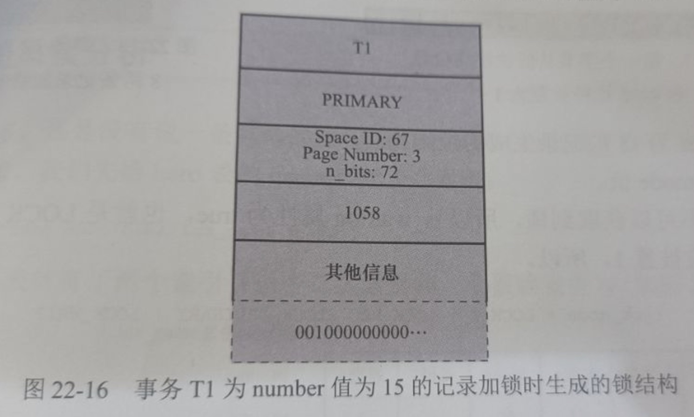
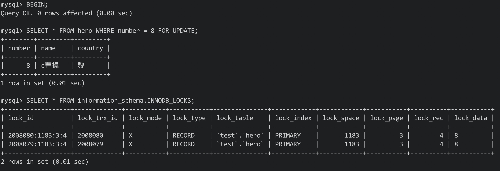
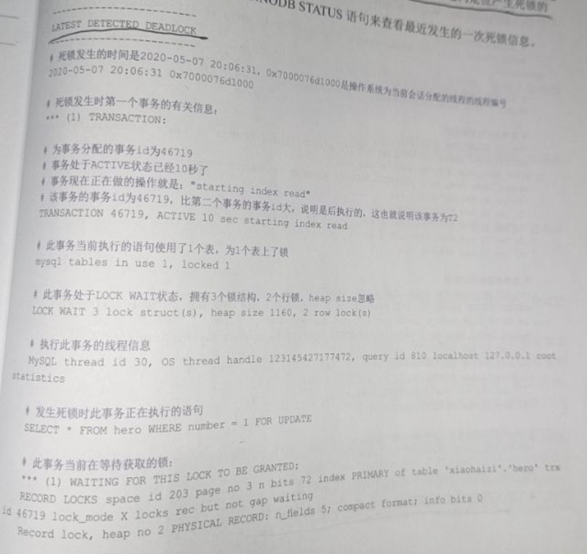

#  二十二、锁


## 22.1 并发事务带来问题的两种基本方式

- 写-写: 引发脏读
- 读-写/写-读: 前者引发不可重复读问题，后者引发脏读问题


### 22.1.1 写-写

因为任何隔离等级都不允许脏写，所以多个未提及事务相继修改同一个记录时，需要它们排队执行，**排队的过程就是为记录加锁实现的**

锁的本质就是一个内存中的结构，而在事务开始前没有锁结构与记录关联


当事务**想对记录进行修改时**，会**先到内存中查看有没有与该记录关联的锁结构**

如果没有则在内存中生成一个锁结构与该记录关联


锁结构中有很多属性，这里暂时只说两个:

- trx: 表示锁结构关联的事务
- is_waiting: 表示当前事务是否在等待

Eg:


如图，事务为T1，在事务改动记录前，就生成一个锁结构与事务关联、

**因为该记录没有锁**，所以is_waiting的属性为false，我们**称为获取锁成功/加锁成功**，然后就可以继续执行操作了


T1事务提交前，事务T2也想对记录进行改动，此时T2先查看该记录上时候有锁结构

如果有，则T2**也生成一个锁结构与该记录关联，但is_waiting属性为true，即需要等待，我们称为获取锁失败/加锁失败**

Eg:


**事务T1提交之后，会将它生成的锁结构释放，然后再检查是否还有与该记录关联的锁结构**

此时发现了之前T2关联的锁，此时**将T2对应锁结构的is_waiting属性设置为false**，并**将事务对应的线程唤醒，让T2继续执行**。这样**T2就获取到锁了**


总结:

- 获取锁成功/加锁成功: 

在内存中生成了对应的锁结构，锁结构的is_waiting属性为false，事务可以继续执行操作

注意：并不是所有的加锁操作都会生成锁结构，还有一种"加隐式锁"的说法，其不会生成实际的锁结构，但依然可以起到保护记录的作用。为记录添加隐式锁的情况也是获取锁成功/加锁成功(后文详解)


- 获取锁失败/加锁失败/没有获取到锁

在内存中生成了对应的锁结构，但锁结构的is_waiting属性为true，事务需要等待，不可以继续执行操作


- 不加锁

不需要在内存中生成对应的锁结构，可以直接执行操作(不包含加隐式锁)


### 22.1.2 读-写/写-读


在SQL92标准中，不同隔离级别事务的特点:

- 在READ UNCOMMITTED级别下: 可能发生脏读、不可重复读、幻读
- 在READ COMMITTED级别下: 不会发生脏读，可能发生不可重复读、幻读
- 在REPEATABLE READ级别下: 不会发生脏读、不可重复读，可能发生幻读
- 在SERIALIZABLE级别下: 上述现象都不会发生


但不同的数据库对SQL标准的支持可能不同

MySQL与SQL标准的不同点: MySQL在REPEATABLE READ级别下很大程度地避免了幻读现象(部分情况下会发生幻读)


避免这些现象的方法有两个:


#### 1) 读操作使用MVCC，写操作加锁

通过生成一个ReadView，通过ReadView找到符合条件的记录版本(undo日志)

查询语句只能读到生成ReadView之前已经提交事务所做的修改

生成ReadView之前未提交事务或之后才开始事务所做的修改是不可见的

写操作针对的是最新版本的记录


回顾:

ReadView本身就保证了事务不可以读取到未提交事务所做的修改，也就避免了脏读

而在REPEATABLE READ级别下，事务执行过程中只有第一次执行SELECT查询才会生成一个ReadView，之后都会复用这个ReadView，从而避免了不可重复读和幻读


#### 2) 读、写都加锁

如果业务场景不允许读取记录的旧版本，而是必须读取记录的最新版本

例如: 

银行存款时，需要先获取账号余额，再将其加上本次存款的数额，最后再写到数据库中

读取余额后就不想让其他事务访问该余额，直到当前事务执行完成后，其他事务才能访问余额

这样在读取记录时就需要对记录加锁，意味着读操作/写操作也要像写-写那样排队执行


拓展:

加锁避免幻读会比较麻烦，因为我们刚开始的时候还不知道哪些会是插入的"幻影记录"，所以不知道给谁加锁


总结:

采用MVCC方式的话，读-写操作并不冲突，性能更高；如果采用加锁方式的话，读-写需要排队，影响性能


### 22.1.3 一致性读

事务利用MVCC进行的读取操作称为一致性读(Consistent Read)，或一致性无锁读(也称快照读)

所有**普通的SELECT语句**在**READ COMMITTED、REPEATABLE READ隔离等级下**都算是一致性读

一致性读**并不会对表中的任何记录进行加锁操作**，**其他事务可以自由地对表中记录进行改动**


### 22.1.4 锁定读


#### 1) 共享锁/独占锁


给锁分类:


- 共享锁(Share Lock)

简称S锁。事务读取一条记录时，需要先获取记录的S锁


- 独占锁(Exclusive Lock)

简称X锁，常称排他锁。事务改动记录时，需要先获取记录的X锁


例子:

假设T1事务获取了一条记录的S锁，之后T2事务也要访问这条记录


1. 如果T2想要一个S锁，T2能够获取该锁，**此时T1和T2同时持有S锁**
2. 如果T2想要一个X锁，此时操作会被阻塞，**直到T1事务提交并释放S锁**


如果T1获取了记录的X锁，那么T2无法获取S锁和X锁，直到T1事务提交并释放X锁

兼容性如下:


| 兼容性 |  X锁   |  S锁   |
| :----: | :----: | :----: |
|  X锁   | 不兼容 | 不兼容 |
|  S锁   | 不兼容 |  兼容  |


#### 2) 锁定读的语句

有时我们想在读取记录的时候就获取记录的X锁，从而禁止其他事务读写该记录

想在读取记录时就为记录加锁的读取方式称为锁定读(Locked Read)


支持锁定读的两种特殊的SELECT语句


- 对读取的记录加S锁

Syntax:

```mysql
SELECT ... LOCK IN SHARE MODE;
```


如果**当前事务执行了该锁定读语句，那么其会为读取的记录加S锁**，这样**可以允许其他事务继续获取该记录的S锁**(别的事务使用SELECT...LOCK IN SHARE MODE来读取记录)

**但不能获取记录的X锁**(别的事务使用SELECT...FOR UPDATE语句来读取记录或者修改记录)

如果**别的事务想要获取记录的X锁**，那么**这些事务会被阻塞**，**直到当前事务提交之后将S锁释放**


- 对读取的记录加X锁

Syntax:

```mysql
SELECT...FOR UPDATE
```


当前事务执行了该语句后，那么它会给读取到的记录加X锁，此时其他事务既不能获取S锁，也不能获取X锁(LOCK IN SHARE MODE/FOR UPDATE)，直到当前事务提交后释放X锁


### 22.1.5 写操作


三种写操作:


#### 1) DELETE

执行DELETE的过程其实就是**先在B+树中定位到这条记录，然后获取这条记录的X锁，最后执行delete mark操作**

该操作称为**获取X锁的锁定读**


#### 2) UPDATE

进行UPDATE操作时分三种情况:


1. 如果**没有修改记录的键值**且**被更新列所占用的空间在修改前后不变**

先在B+树中定位到记录的位置，再获取记录的X锁，最后在原记录上进行修改操作

**这个过程看成一个获取X锁的锁定读**


2. 如果**未修改记录的键值**且**至少有一个被更新列占用的存储空间修改前后发生了改变**

先在B+树中定位到记录的位置，再获取记录的X锁，之后将该记录彻底删除(将记录移到垃圾链表)，最后再插入一条新记录

**这个过程看作是一个获取X锁的锁定读**，与被彻底删除记录关联的锁**会被转移到新插入的记录中**


3. 如果**修改了记录的键值**

相当于**在原记录上执行DELETE操作之后再进行了一次INSERT操作**，加锁操作**需要按照DELETE和INSERT的规则进行**


#### 3) INSERT

新插入的一条记录受隐式锁保护，不需要再内存中为其生成对应的锁结构


注意：在一个事务中加的锁一般在事务提交或中止时才会释放


## 22.2 多颗粒锁

之前的锁都是针对记录的，称为行级锁或者行锁

对一条记录加行锁，影响的只是这一条记录而已，此时我们就说这个行锁的粒度比较细


事务也可以在表级别加锁，所以也称为表级锁或者表锁，对一个表加锁，会影响表中的所有记录，我们就说这个锁的粒度比较粗。给表加的锁分为共享锁(S锁)和独占锁(X锁)


- 给表加S锁

一个事务给表加S锁后:

别的事务可以继续获得该表的S锁

别的事务可以继续获得该表某些记录的S锁

别的事务不可以继续获得该表的X锁

别的事务不可以继续获得该表某些记录的X锁


- 给表加X锁

一个事务给表加X锁后:

别的事务不可以继续获得该表的X锁

别的事务不可以继续获得该表某些记录的X锁

别的事务不可以继续获得该表的X锁

别的事务不可以继续获得该表某些记录的X锁


类比说明:


问题:

在对表加锁的时候，需要确保表中没有记录被加S锁，但通过遍历的方式效率很低

为此提出了一个意向锁(Intention Lock)的概念：


- 意向共享锁(Intention Share Lock):

简称IS锁，当事务准备给记录加S锁时，需要先在表级别加一个IS锁

- 意向独占锁(Intention Exclusive Lock):

简称IX锁，当事务准备给记录加X锁时，需要先在表级别加一个IX锁


此时回到例子中:

- 一个学生到教室自习

此时他在教学楼门口放一把IS锁，然后再到教室门口放一把S锁(行锁)

- 如果有维修工到教室维修

此时他在教学楼门口放一把IX锁，然后再到教室门口放一把X锁(行锁)

之后:


- 如果有领导想要参观教学楼

即想要到教学楼门口放S锁，首先需要看门口有没有IX锁，如果有则说明教室在维修，需要等到维修结束把IX撤掉后，才可以在教学楼门口放S锁


- 如果有考试想要占用教学楼

即想要在教学楼门口放X锁，首先需要看门口有没有IS或者IX锁，如果有则说明教室在自习/维修，需要等到上完自习或者维修结束把IS锁或者IX锁撤掉后，才可以在教学楼门口放X锁


**注意:**

在给教学楼门口加IS锁的时候，是不关心门口是否有IX锁的

维修工在教学楼门口加IX锁时，是不关心门口是否有IS锁或者IX锁的

IS锁和IX**只是用来判断当前时间教学楼里有没有被占用的教室**，只有在对教学楼加S锁或者X锁后才会用到


总结:

IS锁、IX锁是表级锁，它们的提出只是为了在之后加表级的S锁和X锁时判断表中记录是否被上锁，避免用遍历的方式查看表中记录是否上锁

也就是说IS和IX是兼容，X锁和IX锁是兼容的


表级锁的兼容性:

| 兼容性 |   X    |   IX   |   S    |   IS   |
| :----: | :----: | :----: | :----: | :----: |
|   X    | 不兼容 | 不兼容 | 不兼容 | 不兼容 |
|   IX   | 不兼容 |  兼容  | 不兼容 |  兼容  |
|   S    | 不兼容 | 不兼容 |  兼容  |  兼容  |
|   IS   | 不兼容 |  兼容  |  兼容  |  兼容  |


## 22.3 MySQL中的行锁和表锁

不同的存储引擎对锁的支持不同


### 22.3.1 其他存储引擎中的锁

**对于MyISAM、MEMORY、MERGE这些引擎来说**，它们**只支持表级锁，而且这些存储引擎不支持事务**，在**对使用这些存储引擎的表加锁时，一般都是针对当前会话的**


例如:

Session1中对一个表执行SELECT操作，就相当于为表加了一个表级别的S锁

此时如果SELECT操作未完成时，在Session2中对表执行UPDATE操作，相当于要获取表的X锁，此操作会被阻塞

直到Session1中的SELECT操作完成并释放掉表级别的S锁后，在Session2中对表执行UPDATE操作才能继续获取X锁，然后执行更新语句


拓展:

因为使用MyISAM、MEMORY、MERGE这些存储引擎的表**在同一时刻只允许一个会话对表进行写操作**，所以**这些存储引擎最好用在只读场景下**，或者**用在大部分都是读操作或单用户的情景下**


了解:

在MyISAM存储引擎中有一个称为并发插入(Concurrent Insert)的特性，其支持在读取MyISAM表的同时插入记录，这样可以提高插入速度。


### 22.3.2 InnoDB存储引擎中的锁

**InnoDB存储引擎既支持表级锁，也支持行级锁**

表级锁粒度粗，占用资源少。有时我们**只需要锁住几条记录**，如果使用表级锁，效果上相当于为表中所有记录都加锁，所以**性能差**

**行级锁颗粒细**，可以**实现更精确的并发控制**，但是**占用的资源较多**


#### 1) InnoDB中的表级锁


- 表级别的S锁、X锁

对某个表执行SELECT、INSERT、DELETE、UPDATE语句时，InnoDB存储引擎是不会为表添加表级别的S锁或者X锁


**对表执行DDL语句时**，其他事务对这个表**并发执行诸如SELECT、INSERT、DELETE、UPDATE等语句会发生阻塞**

同样的，如果**某个事务对表执行SELECT、INSERT、DELETE、UPDATE语句时**，其他**会话对表执行DDL语句也会发生阻塞**

该**过程是通过在server层使用一种称为元数据锁**(Metadata Lock, MDL)的东西实现的，一般情况不会使用InnoDB存储引擎自己提供的表级别S锁和X锁

MDL锁不是讨论内容


**InnoDB存储引擎提供的表级S锁和X锁作用很小**，只在一些特殊情况下用到(系统崩溃恢复)

我们可以手动获取InnoDB的表级锁:


前提:

在系统变量autocommit = 0、innodb_table_locks = 1时

语法:

```mysql
LOCK TABLES t READ # InnoDB存储引擎会对表t加表级别的S锁
LOCK TABLES t WRITE # InnoDB存储引擎会对表t加表级别的X锁
```

应该尽量避免在InnoDB存储引擎表上使用LOCK TABLES这种手动锁表语句，这些语句不会提供额外保护，只会降低并发能力而已

**InnoDB的优势是实现了更细粒度的行级锁，其表级别的S锁和X锁了解一下即可**


- 表级别的IS/IX锁

在对InnoDB表的记录加S锁之前，需要先在表级别加一个IS锁

当对InnoDB表的记录加X锁之前，需要先在表级别加一个IX锁

IS/IX锁**只是为了后续在加表级别的S/X锁时，判断表中是否有已经被加锁的记录**，避免用遍历的方式查看表中是否有上锁的记录


- 表级别的AUTO-INC锁

当我们为某个列添加AUTO_INCREMENT属性后，在插入记录时，可以不指定该列的值，系统会自动赋值


系统自动**给AUTO_INCREMENT修饰列进行递增赋值的实现方式有两个**:

1. 采用AUTO-INC锁
    - 在执行插入语句时就加一个表级别的AUTO-INC锁
    - 然后为每条插入记录AUTO_INCREMENT修饰的列分配递增的值
    - 在语句执行结束后，再把AUTO-INC锁释放掉
    - 一个事务在持有AUTO-INC锁的过程中，其他事务的插入语句都要被阻塞，从而保证一个语句中分配的递增值是连续的

如果在执行插入语句之前，我们不确定具体要插入记录的条数，一般是使用AUTO-INC锁为AUTO_INCREMENT修饰的列生成对应的值

AUTO-INC锁的作用范围只是单个插入语句，在插入语句执行后，该锁就释放了


2. 采用一个轻量级的锁
    - 在为插入语句生成AUTO_INCREMENT修饰的列的值时，获取这个轻量级锁
    - 在生成需要用的的列值后，就把该轻量级锁释放掉，而不是等到整个语句执行完后才释放锁

如果在插入语句执行前就确定要插入的语句数量，那么一般会使用轻量级锁对AUTO_INCREMENT修饰的列进行赋值。这样可以避免锁定表，从而提高插入的性能


**拓展：**

我们可以**通过一个名为innodb_autoinc_lock_mode的系统变量来控制**

当值为0时，一律采用AUTO-INC锁

值为2时，一律采用轻量级锁

当值为1时，两种方式混着来

当该**值为2时，可能会造成不同事务中的插入语句为AUTO_INCREMENT修饰的列生成的值是交叉的，在主从复制的场景中是不安全的**


#### 2) InnoDB中的行级锁

对记录加行锁，如果记录的类型不同，那么起到的功效是不同的


示例表:

```mysql
CREATE TABLE hero(
	number INT,
  name VARCHAR(100),
  country VARCHAR(100),
  PRIMARY KEY (number)
) Engine=InnoDB CHARSET=utf8;
```


存储数据:


常用的行级锁类型:


##### 1. Record Lock


记录锁，仅仅将一条记录锁上

这种锁的官方名称为: LOCK_REC_NOT_GAP，暂时称为"正经记录锁"

正经记录锁分为S型和X型

Eg:

| number  |   1   |    3    |   8   | 15    |  20   |
| :-----: | :---: | :-----: | :---: | ----- | :---: |
|  name   | l刘备 | z诸葛亮 | c曹操 | x荀彧 | s孙权 |
| country |  蜀   |   蜀    |  魏   | 魏    |  吴   |


当一个事务获取了记录的S型正经锁之后，其他的事务也可以继续获取记录的S型正经锁，但不可以继续获取X型正经锁

当事务获取了记录的X型正经锁之后，其他记录不能继续获取S/X型正经记录锁


##### 2. Gap Lock


MySQL在REPEATABLE READ隔离等级下可以很大程度上解决幻读现象

我们可以通过MVCC和加锁来解决，但加锁解决会有一定的问题:

- 事务在第一次执行读取时，这些**对应的幻影记录并不存在，所以无法加上正经记录锁**


为了解决这一问题，提出了一种称为Gap Lock的锁，这种锁的官方名称为LOCK_GAP，简称gap锁

Eg:


图中我们为number值为8的记录加了gap锁后，意味着不允许别的事务在number为8的记录前的间隙插入新记录(即number列值在区间(3, 8)的新记录是不允许插入的)

此时如果有事务想在该区间中插入，则该插入操作会被阻塞

直到拥有gap锁的事务提交后并将该gap锁释放之后，才会允许其他事务才可以插入number列的值在区间(3, 8)中的新记录


**不管是S共享gap锁还是X排他gap锁，起到的作用都是一样的**，gap锁的提出**仅仅是为了防止插入幻影记录**

如果**对记录加上了gap锁(S/X)，其他事务依然可以对记录加上正经记录锁或者gap锁**。所以gap只是为了防止插入幻影记录而已


问题:

**gap锁仅仅是为了不让其他事务向加锁记录的前面插入记录**，最后一条记录的后面怎么办？


此时需要用到两条伪记录:

- Infimum记录: 页面中最小的记录
- Supremum记录: 页面中最大的记录


为了阻止其他事务在最后一条记录的后面插入新记录，我们可以给Supremum记录加锁

这样我们就能防止在最后的区域插入记录了


##### 3. Next-Key Lock

有时，我们既想锁住记录，又想阻止其他事务在记录前面的间隙插入新的记录

为此提出了一个名为Next-Key Lock的锁，其官方名称为LOCK ORDINARY，简称next-key锁


为记录加next-key锁:


next-key锁的本质就是一个正经记录锁和一个gap锁的合体，既能保护记录本身，又能阻止其他事务将新记录插入到该被保护记录的前面


##### 4. Insert Intention Lock

在事务插入记录时，需要判断插入位置是否已经被其他事务加上了gap锁(含next-key锁)

有则插入操作需要等待，直到加上gap锁的事务提交并释放gap锁为止


然而在事务等待的时候，也需要在内存中生成一个锁结构

表明有事务想在间隙中插入记录，但事务暂时处于等待状态


这种类型的锁称为Insert Intention Lock，其官方名称为LOCK_INSERT_INTENTION，称为插入意向锁

Eg:


例子:

事务T1为number为8的记录加一个gap锁，之后T2和T3事务向hero表中插入number值为4、5的记录


示意图:


当T1事务提交后，会将其获取的锁都释放，之后T2和T3都能够对应的插入意向锁(is_waiting为false)，此时T2和T3不会左侧，可以同时获取插入意向锁


##### 5. 隐式锁

**一般情况下执行INSERT不需要在内存中生成锁结构**，但会产生问题:


一个事务首先插入了一条记录(没有关联的锁结构)，之后另一个事务执行如下操作

- 使用SELECT...LOCK IN SHARE MODE(**获取S锁**)或SELECT...FOR UPDATE(**获取X锁**)

如果直接允许，则会发生脏读

- **直接修改**

如果允许，则会发生脏写


为了解决问题，此时需要用到事务id，我们需要**将聚簇索引和二级索引中的记录分开来看**:


- 聚簇索引记录中有一个**trx_id隐藏列，其记录着最后改动该记录对应的事务id**

如果其他事务此时想对记录添加S/X锁，则会先查看该记录的trx_id列是否为活跃的事务

如果不是则正常获取锁，否则为这个活跃事务创建一个X锁结构，其is_waiting属性为false；再为这个想添加锁的其他事务创建一个锁结构，锁结构的is_waiting的属性为true，进入等待状态


- 二级索引记录**没有trx_id隐藏列，但在二级索引页面的Page Header中有一个PAGE_MAX_TRX_ID属性**

如果PAGE_MAX_TRX_ID属性**小于当前最小的活跃事务，则说明对该页面进行修改的事务都提交了**，否则需要在页面中定位到对应的二级索引记录，然后**通过回表操作获取其对应的聚簇索引记录**，再**重复聚簇索引中的做法**


总结:

由于事务id的存在，相当于加了一个隐式锁。

其他事务对记录加S/X锁时，由于隐式锁存在，会先帮助当前事务生成一个锁结构，然后再为自己生成一个锁结构


隐式锁起到了延迟生成锁结构的作用。如果别的事务在执行时不需要获取与隐式锁相冲突的锁，那么**可以避免在内存中生成锁结构**

隐式锁和在内存中显式生成锁都能起到保护记录的作用


### 22.3.3 InnoDB锁的内存结构

**对记录加锁的本质**就是**在内存中创建一个锁结构与之关联**(除了隐式锁)


但当事务对多条记录加锁时，不一定会为每个记录都创建锁结构

例子: 事务T1执行如下语句

```mysql
# 事务T1
SELECT * FROM hero LOCK IN SHARE MODE;
```


在对记录加锁的时候，如果符合一下条件，则可以放到一个锁结构中:

- 在**同一个事务中进行加锁操作**
- 被**加锁的记录在同一个页面中**
- 加锁**类型一样**
- 等待状态相同


InnoDB事务锁结构:


锁结构中的各种信息:


- 锁所在的事务信息:

表级锁/行级锁都属于同一个事务，这里记录着锁对应的事务信息

(锁所在的**事务信息在内存结构中只是一个指针**，所以不会占用内存，通过指针可以找到内存中关于事务的信息)


- 索引信息:

对于行级锁，还需要记录加锁的记录属于哪个索引


- 表锁/行锁信息:

表级锁结构和行级锁结构在此处的信息不同

表级锁记录着这是对哪个表加的锁

行级锁记录三个信息:

1. Space ID: 记录所在的表空间
2. Page Number: 记录所在的页号
3. n_bits: 一条记录对应一个bit，页面中包含多个记录，用不同的比特来记录为哪条记录加了锁。在行级锁结构的末尾放置了一堆bit，该属性表示使用了的bit数


为了之后页面中插入新记录时呼之欲重新分配锁结构，n_bits的值一般比页面中的记录数要多


- type_mode:

一个32bit的数，分为lock_mode，lock_type和rec_lock_type，3部分如下:


lock_mode: 占用低于4bit，可选值如下

- LOCK_IS: 表示意向S锁
- LOCK_IX: 表示意向X锁
- LOCK_S: S锁
- LOCK_X: X锁
- LOCK_AUTO_INC: 表示AUTO-INC锁


LOCK_S和LOCK_X既可以是表级锁的模式，也可以是行级锁的模式


lock_type: 占用5～8位(只占用5～6位)

- LOCK_TABLE: 第5比特设置为1，表示表级锁
- LOCK_REC: 当第6比特设置为1，表示行级锁


rec_lock_type: 表示行锁的类型

- LOCK_ORDINARY: next-key锁
- LOCK_GAP: 当第10bit为1时，表示gap锁
- LOCK_REC_NOT_GAP: 当第11bit设置为1时，表示正经记录锁
- LOCK_INSERT_INTENTION: 当第12bit设置为1时，表示插入意向锁

is_waiting属性也放到了type_mode中

- LOCK_WAIT: 当第9bit设置为1，表示is_waiting为true，即事务尚未获取锁，处于等待状态；当该bit为0，则为false，即事务获取锁成功


- 锁结构末尾的一堆bits:

bit位的数量使用前面的n_bits属性来表示

在页面中，每条记录在记录头信息中包含一个heap_no属性:

Infimum记录的heap_no值为0，Supremum记录的heap_no值为1；之后每申请一条记录的占用空间，heap_no就增加1

锁结构最后的一堆bit对应着页面的记录，一个bit对应一个heap_no


例子:

事务T1和T2想对hero表中的记录加锁，如果T1想为number值为15的记录加S型正经记录锁

需要先加表级别的IS锁，即生成一个表级别锁的内存结构


**生成行级锁结构的过程:**

1. 事务T1要进行加锁，所以锁结构的"锁所在的事务信息"指的就是T1

2. 如果直接对聚簇索引进行加锁，所以索引信息指的就是PRIMARY索引

3. 行级锁有三个重要的信息

    - Space ID: 表空间号为67
    - Page Number: 页号为3
    - n_bits: hero表中只插入了5条记录，但初始分配时会多分配一些，为了之后不用频繁分配bit

    n_bits计算公式: n_bits = (1 + ((n_recs + LOCK_PAGE_BITMAP_MARGIN) / 8)) * 8


其中n_recs表示页面中的记录，LOCK_PAGE_BITMAP_MARGIN的值为64


type_mode是由3个部分组成:

- lock_mode: 对记录加S锁，值为LOCK_S
- lock_type: 对记录加锁(行级锁)，值为LOCK_REC
- rec_look_type: 对记录加正经记录锁，类型为LOCK_REC_NOT_GAP(由于没有其他事务对记录加锁，所以应当获取锁，即LOCK_WAIT代表的二进制位为0)


所以type_mode为:

type_mode = LOCK_S | LOCK_REC | LOCK_REC_NOT_GAP

即

type_mode = 2 | 32 | 1024 = 1058


一堆bit位:

number为15的记录对应的heap_no值为5，根据之前的映射图，应该是第一个字节从低位往高位第6比特被设置为1


事务T1为number值为15的记录加锁是，生成的锁结构如图:




如果T2事务想对number值为3、8、15记录加X型的next-key锁，在对记录加行级锁之前，需要先加表级别的IX锁，会生成一个表级别的内存结构(暂时忽略表级别的锁)


现在T2要为这3条记录加锁，number为3、8的两条记录因为没有其他事务加锁，所以T2可以成功获取相应记录的X型next-key锁，即生成的锁结构的is_waiting属性为false

**但number为15的记录已经被T1加上了S型正经记录锁**，T2不能获取到该记录的X型next-key锁，即锁结构的is_waiting属性为true

因为获取**锁的等待状态不同，所以此时会生成两个锁结构**，其中相同的属性为:

- Space ID: 67
- Page Number: 3
- n_bits: 该属性的生成策略与T1一致(72)
- type_mode
    - lock_mode: 对记录加X锁，值为LOCK_X
    - lock_type: 此时为行级锁，值为LOCK_REC
    - rec_lock_type: 对记录加next-key锁，类型为LOCK_ORDINARY


不同的属性为:

- 为记录3、8生成的锁结构

    - type_mode值: 可以获取到锁，所以is_waiting的值为false，即LOCK_WAIT代表的二进制位被置为0，即: type_mode = LOCK_X | LOCK_REC | LOCK_ORDINARY
    - 末尾的一堆bits: number值为3、8的记录对应的heap_no值为3、4，所以第一个字节从低往高数第4、5bit被置为1

    


综上，事务T2生成的锁结构为:


- 为number值为15的记录生成的锁结构


拓展:

当T1事务提交后，其会释放掉number=15记录上的锁；之后事务T2再获取锁的时候会复用T1对number = 3、8记录加上的锁


## 22.4 语句加锁分析

先导:


为hero表创建一个索引


这里将语句分为四类:

普通的SELECT、锁定读语句、半一致性读、INSERT


### 22.4.1 普通的SELECT

对于不同的SELECT语句，在不同隔离等级下，有不同的表现:


- READ UNCOMMITTED:

不加锁，直接获取记录的最新版本；可能出现除了脏写外的所有情况

- READ COMMITTED:

不加锁，每次执行都生成一个ReadView，避免脏读，但没有避免不可重复读和幻读

- REPEATABLE READ:

不加锁，只在第一次执行普通的SELECT语句时生成一个ReadView，这样就将脏读、不可重复读、幻读都避免了


特殊情况:


```mysql
# T1, REPEATABLE READ
BEGIN;
SELECT * FROM hero WHERE number = 30;
Empty set

# 此时事务T2执行: INSERT INTO hero VALUES(30, 'g关羽', '魏'); 并提交

UPDATE hero SET country = '蜀' WHERE number = 30;
SELECT * FROM hero WHERE number = 30;
```

本来number=30的记录不存在

在事务T2插入记录后提交时，此时查询number = 30的记录不为empty


即：

在REPEATABLE READ隔离等级中ReadView并不能阻止T1执行UPDATE或者DELETE语句改动新插入的记录，因此事务T1修改这个新插入记录后，该记录的trx_id变为了T1的事务id

之后T1再次使用SELECT时，该记录就可见了

因此**在InnoDB中，MVCC并不能完全禁止幻读**


- SERIALIZABLE(需要分两个情况讨论):

    - 在系统变量autocommit=0时(禁止自动提交)

    普通的SELECT语句会被转换为SELECT...LOCK IN SHARE MODE，即在读取记录前需要先获取记录的S锁，其加锁情况与REPEATABLE READ一致(之后分析)

    - 当autocommit=1时(启用自动提交)

    普通的SELECT语句不会被加锁，只利用MVCC生成一个ReadView来读取记录，因为开始自动提交后，每个事务中只有一条语句，这样就不会出现不可重复读、幻读了


### 22.4.2 锁定读的语句

1. SELECT...LOCK IN SHARE MODE
2. SELECT...FOR UPDATE
3. UPDATE...
4. DELETE


其中语句1和2是MySQL规定的两种锁定读语法，而3和4因为在执行时需要先定位到被改动的记录并加锁，所以也可以认为是一种锁定读

介绍锁定读之前，需要引入两个概念: 匹配模式和唯一性搜索


- 匹配模式(match mode)

使用索引执行查询时，**查询优化器会生成若干扫描区间**

如果被扫描的区间是一个单点扫描区间，则此时的**匹配模式为精确匹配**，例如联合索引idx_a_b(a, b)


1. 如果扫描区间的边界条件为a=1，此时对应的扫描区间为[1, 1]

此时认为这是一个单点扫描区间。如果查询优化器通过访问该扫描区间的记录来执行查询，此时的匹配模式就是精确匹配


2. 如果扫描区间的搜索条件是a=1 AND b=1，此时对应的扫描区间为[(1, 1), (1, 1)]

此时也是一个单点扫描区间，如果查询优化器通过访问该扫描区间的记录来执行查询，此时的匹配模式就是精确匹配


3. 如果扫描区间的搜索条件为a=1 AND b>=1，对应的扫描区间为[(1, 1), (1, +∞)]

此时**认为该扫描区间不算是一个单点扫描区间**。如果查询优化器通过访问该扫描区间的记录来执行查询，**此时的匹配模式不是精确匹配**


- 唯一性搜索(unique search)

如果扫描某个区间之前，就**能事先确定该扫描区间内最多内只包含一条记录的话，这种情况称为唯一型搜索**


如何确定扫描区间最多只包含一条记录？符合以下条件即可:

1. 匹配模式**为精确匹配**
2. 使用的**索引为主键/唯一二级索引**
3. 如果使用的**索引是唯一二级索引**，那么**搜索条件不能为"索引列 IS NULL"的形式**
4. 如果**索引中包含多个列，在生成扫描区间时，每个列都被用到**


例如:

为某个表的a、b两个列建立了一个唯一联合索引uk_a_b(a, b)，对于搜索条件a=1形成的扫描区间来说，不能保证扫描区间中最多只包含一条记录(所以不是唯一型搜索)


了解匹配模式和唯一性搜索后，就需要着手分析语句加锁的过程了:


"语句该为哪些记录加什么锁"其实是一个伪命题，语句在执行过程中，需要访问多个扫描区间中的记录，在为这些记录加锁时，也会受到很多限制:

- 事务隔离级别
- 语句执行时使用的索引类型(聚簇索引、唯一二级索引、普通二级索引)
- 是否为精确匹配
- 是否为唯一性搜索
- 执行语句的类型


注意:

事务在执行过程中获取的锁，**一般在事务提交或者回滚时才会释放**，但在**隔离等级不大于READ COMMITTED时**，在**某些情况下会提前将不符合搜索条件的记录上的锁释放掉**(事务可以更大程度地并发执行)


锁定读的执行看成是依次读取若干扫描区间中的记录，一般情况下读取某个扫描区间中记录的过程如下:

1. 首先快速在B+树叶子节点中定位到扫描区间中的第一条记录，该记录称为当前记录
2. 为当前记录加锁

对于锁定读的语句，在隔离等级不大于READ COMMITTED时(UNCOMMITTED)时，会为当前记录加正经锁。反之会加上next-key锁


3. 判断索引条件下推的条件是否成立

根据之前名为索引条件下推的功能(Index Condition Pushdown，ICP)，**用来把查询中与被使用索引有关的搜索条件下推到存储引擎中判断**，而不是返回到server层再判断

索引下推只是为了减少回表次数，即减少读取完整聚簇索引记录次数，从而减少I/O

因此只适用于二级索引，不适用于聚簇索引

索引下推仅适用于SELECT语句，不适用于UPDATE、DELETE这些需要改动记录的语句


存在索引下推条件时，如果记录符合索引条件下推的条件，则跳到步骤4

如果不符合，则直接获取当前记录所在链表的下一条记录，并将该记录作为新的当前记录并跳回2

步骤3还会判断当前记录是否符合形成扫描区间的边界条件，如果不符合则跳过4和5，直接向server层返回一个"查询完毕"的信息

注意: 步骤3不会释放锁


4. 执行回表操作

如果读取的为二级索引记录，则会执行回表操作，获取到对应的聚簇索引记录并给该聚簇索引记录加正经记录锁


5. 判断边界条件是否成立

如果符合则跳到6

如果不符合，且隔离等级不大于READ COMMITTED，则释放掉加在记录上的锁(不小于REPEATABLE READ时不释放记录上的锁)，并向server层返回一个"查询完毕"的信息


6. server层判断其余搜索条件是否成立

除了索引条件下推中的条件外，server层还需要判断其他搜索条件是否成立

成立则将记录发送到客户端，否则在隔离级别不大于READ COMMITTED时，则释放掉加在记录上的锁

不小于REPEATABLE READ时，不释放加在记录上的锁


7. 获取当前记录所在下一条记录

将其作为新的当前记录，并跳回步骤2


......


## 22.5 查看事务加锁情况


### 22.5.1 使用information_schema中的表获取锁信息

在information_schema数据库中，有几个与事务和锁紧密相关的表


#### 1) INNODB_TRX

该表存储了InnoDB存储引擎当前正在执行的事务信息，包括事务id、事务状态等


比如在会话中执行事务T1:

```mysql
BEGIN;

SELECT * FROM hero WHERE number = 8 FOR UPDATE;
```

之后在另一个会话中查询INNODB_TRX表:


我们重点关注trx_tables_locked、trx_rows_locked和trx_lock_structs属性

- trx_tables_locked: 表示该事务目前加了多少表级锁
- trx_rows_locked: 表示该事务目前加了多少行级锁
- trx_lock_struts: 表示事务生成内存中锁结构的数量


#### 2) INNODB_LOCKS

记录了一些锁信息，包括两个方面的锁信息


- 如果事务想获取某个锁但未获取到，则记录该锁信息
- 如果事务获取到了某个锁，但这个锁阻塞了别的事务，则记录该锁的信息


**注意:**

**只有当系统中发生了某个事务因为获取不到锁被阻塞情况时，information_schema.INNODB_LOCKS表中才会有记录**


我们再到另一个会话中开启事务T2，然后执行:

```mysql
# 事务T2
BEGIN;
SELECT * FROM hero WHERE number = 8 FOR UPDATE; 	# 进入阻塞
```



此时我们获取了对应的事务id，但还不知道是哪个事务获取到了其他事务需要的锁，以及谁因为没有获取到锁而阻塞


#### 3) INNODB_LOCK_WAITS

表名每个阻塞的事务是因为获取不到哪个事务持有的锁而阻塞


- requesting_trx_id: 表示因为获取不到锁而被阻塞的事务对应的事务id
- blocking_trx_id: 表示获取到别的事务需要的锁而导致别的事务被阻塞，阻塞别人的事务id

blocking_trx_id表示事务T1的事务id

requesting_trx_id表示事务T2的事务id


在新版本中(8.0)，不鼓励我们使用这两个表来获取相关的锁信息


### 22.5.2 使用SHOW ENGINE INNODB STATUS获取锁信息

开启一个新的事务:

```mysql 
BEGIN;
SELECT 
	* 
FROM 
	hero 
FORCE INDEX(idx_name) 
WHERE name > 'c曹操' 
AND name <= '荀彧' 
AND country != '吴' 
ORDER BY name DESC 
FOR UPDATE;
```


加锁过程:


此时查看存储引擎的状态即可获取各个事务中的加锁情况

Eg:


默认是无法得知哪个事务对哪些记录加了哪些锁，我们需要将系统变量innodb_status_output_locks设置为ON(在MySQL5.6.16中引入)

```mysql
SET GLOBAL innodb_status_output_locks = ON;
```


之后再次查看引擎状态

Eg:


- TABLE LOCK table 'test'.'hero' trx id 2008083 lock mode IX

表明事务id为2008083的事务对test数据库下的hero表加了表级别的IX锁(意向独占锁)


- RECORD LOCKS space id 1183 page no 4 n bits 72 index idx_name of table 'test'.'hero' trx id 2008083 lock mode X locks gap before rec

表示一个锁结构，其Space ID为1183，Page Number为4，n_bits属性值为72，对应的索引为idx_name，其中存放的锁类型为X型gap锁

后面跟着具体的记录信息


其余:


注意:

如果某个事务没有被分配事务id，则SHOW ENGINE INNODB STATUS不会显示出该事务执行时持有的锁。SHOW ENGINE INNODB STATUS不显示隐式锁

查询中，number列值都为800XXX的形式，因为number列是存储有符号位的


## 22.6 死锁


对图进行分析:

- 3中，T1事务对number值为1的聚簇索引记录加了一个X型正经记录锁
- 4中，T2事务对number值为3的聚簇索引记录加了一个X型正经记录锁
- 5中，T1接着也想对number为3的聚簇索引记录加X型正经记录锁，但T2已经先加了一个锁，所以T1进入阻塞状态，等待获取锁
- 6中，T2想number为1的聚簇索引记录加一个X型正经记录锁，但T1已经加过了，所以T2进入阻塞状态，等待获取锁

此时T1和T2都在等待对方先释放锁，所以两个事务都不能执行，此时就称发生了死锁


InnoDB有一个死锁检测机制，当检测到死锁时，会选择一个较小的事务进行回滚(涉及的记录数少)，再向clinen发送一条消息:

```mysql
ERROR 1213 (40001): Deadlock found when trying to get lock; try restarting transaction;
```


由上可知:

- 当不同的事务以不同顺序获取某些记录的死锁时，可能会发生死锁
- 死锁发生后，InnoDB会回滚一个事务以释放掉其所获取的锁


为了了解产生死锁的原因，我们可以通过死锁发生时产生的死锁日志来逆向定位产生死锁的语句，再优化业务

Eg:

```mysql
SHOW ENGINE INNODB STATUS;
```





拓展:

SHOW ENGINE INNODB STATUS只会显示最近一次发生的死锁信息，所以如果死锁频繁出现的话，可将全局变量"innodb_print_all_deadlocks"设置为ON，这样会将每个死锁发生时的信息都记录在MySQL错误日志中，之后通过错误日志进行分析即可
