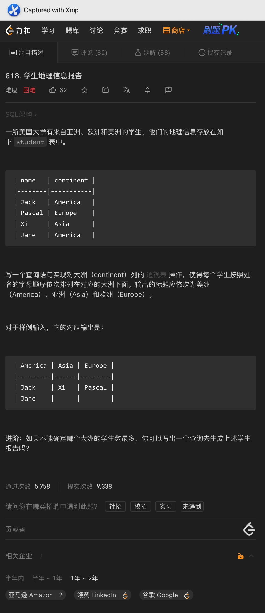
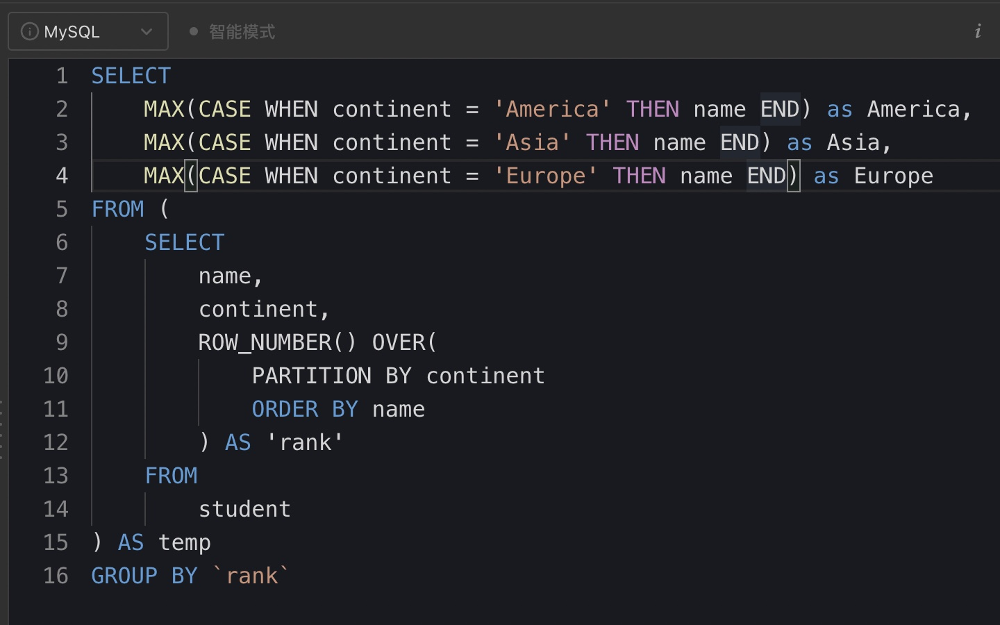
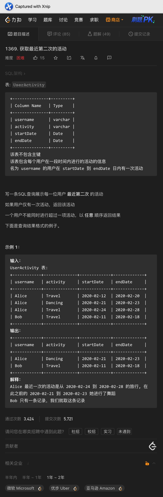
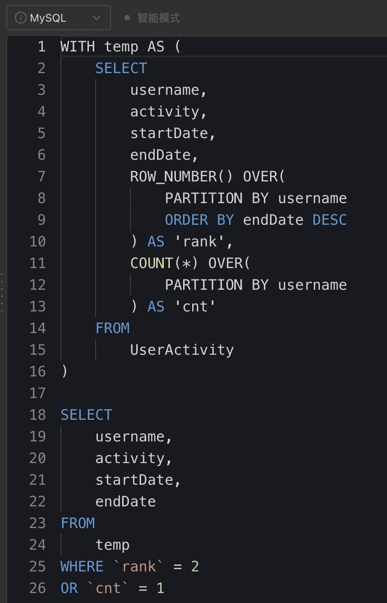
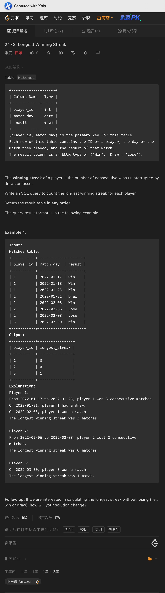
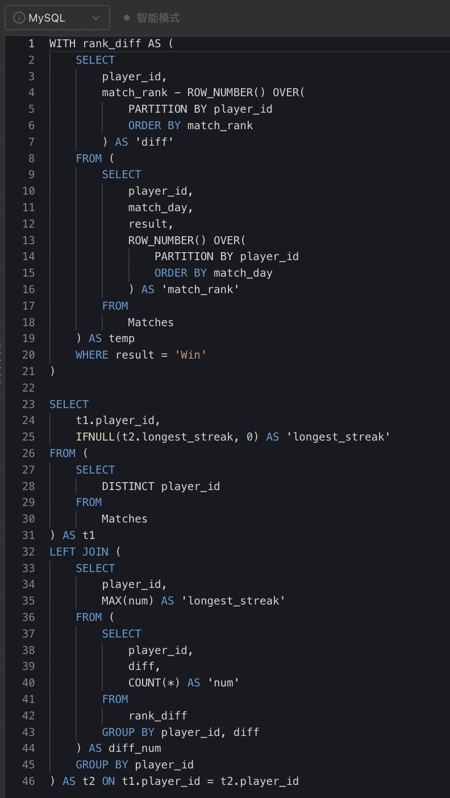
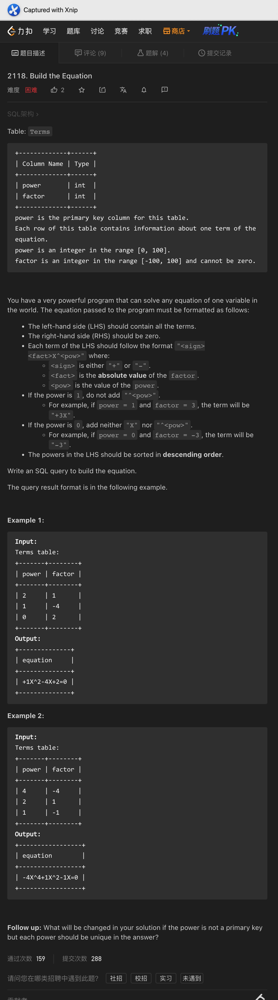
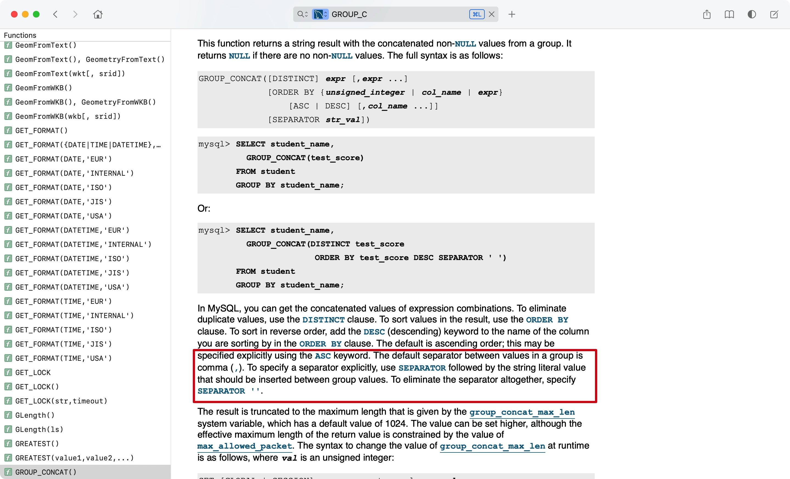
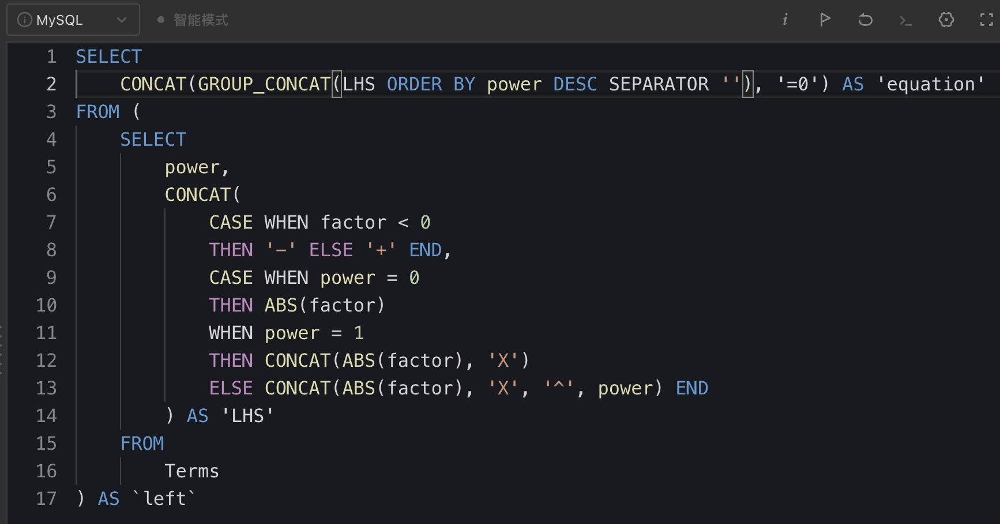

# Day231

## Tag: ROW_NUMBER






题意:

给你一张学生的来历表，请你根据地域，按照学生的姓名排序生成一张透视表


思路:

- 如果是简单的按照地域生成透视表的话，使用CASE WHEN就可以，但这里偏偏要按照学生姓名排序，这样就比较头痛了
- 为了让结果按照姓名排序，我们需要先行获取按照地区分组后的姓名排名，这里使用窗口函数即可，SQL如下

SQL1:

```mysql
SELECT 
    name,
    continent,
    ROW_NUMBER() OVER(
        PARTITION BY continent
        ORDER BY name
    ) AS 'rank'
FROM
    student
```


- 之后只需要从该表中获取对应地区的字典序最靠前的姓名即可
- 因为临时表中以及排好了序，所以我们直接使用即可，最终SQL如下

```mysql
SELECT
    MAX(CASE WHEN continent = 'America' THEN name END) as America,
    MAX(CASE WHEN continent = 'Asia' THEN name END) as Asia,
    MAX(CASE WHEN continent = 'Europe' THEN name END) as Europe
FROM (
		SQL1
) AS temp
GROUP BY `rank`
```

<hr>


# Day232

## Tag: ROW_NUMBER, COUNT() OVER






题意:

给你一张用户活动记录表，请你查询出用户最近的第二次活动，如果只有一个活动则直接查询出来即可


思路:

- 因为需要的是最近的第二次活动，所以我们需要将活动根据时间进行排序，且需要根据用户分组
- 且因为部分用户的活动次数可能只有1次，所以为了区分这两种用户，我们还需要根据用户分组后，统计其对应的活动次数，综合考虑下来，窗口函数是最适合的，SQL如下

SQL1:

```mysql
SELECT
    username,
    activity,
    startDate,
    endDate,
    ROW_NUMBER() OVER(
        PARTITION BY username
        ORDER BY endDate DESC
    ) AS 'rank',
    COUNT(*) OVER(
        PARTITION BY username
    ) AS 'cnt'
FROM
    UserActivity
```


- 获取该临时表后，我们只需要查询出排名为2，或者活动数为1的即可，最终SQL如下

```mysql
WITH temp AS (
    SQL1
)

SELECT
    username,
    activity,
    startDate,
    endDate
FROM
    temp
WHERE `rank` = 2
OR `cnt` = 1
```

<hr>


# Day233

## Tag: ROW_NUMBER, GROUP BY, LEFT JOIN






题意:

给你一张运动员的比赛记录表，请你查询出每个运动员的最长连胜次数


思路:

- 该题目可以使用窗口函数的frame解决，但说实话，我也记不住语法，这里就学习一下别人的解法:
- 首先，我们获取每个运动员对应比赛的时间次序，SQL如下

SQL1:

```mysql
SELECT
    player_id,
    match_day,
    result,
    ROW_NUMBER() OVER(
        PARTITION BY player_id
        ORDER BY match_day
    ) AS 'match_rank'
FROM
    Matches
```


- 之后重点来了，我们再查询出每个胜场的次序，并用比赛次序减去胜场次序
- 你问我为啥这么做？待会儿就知道了，此时SQL如下

SQL2:

```mysql
SELECT
    player_id,
    match_rank - ROW_NUMBER() OVER(
        PARTITION BY player_id
        ORDER BY match_rank
    ) AS 'diff'
FROM (
		SQL1
	) AS temp
WHERE result = 'Win'
)
```


- 将该表作为CTE临时表，根据player_id和diff分组，统计列数，SQL如下

SQL3:

```mysql
WITH rank_diff AS (
		SQL2
)

SELECT
    player_id,
    diff,
    COUNT(*) AS 'num'
FROM
    rank_diff
GROUP BY player_id, diff
```


- 到这里，就该解释思路了：
- 到这一步的时候，SQL的结果如图，可以看到，我们得出的结果中: 同一个运动员中diff不同的列对应的num不同
- 其实这不同的num对应的就是不同时间区间内，该运动员连胜的场次，为什么？
- 之前我们根据比赛时间获取了次序，之后又用它减去了胜场的次序，各位想想：如果处于同一连胜区间内，那么这些记录对应的差是不是都该相同呢？
- 所以我们只需要获取其中记录最多的区间对应的场次，不就是运动员的最长连胜次数了吗？语言表达有限，建议各位自己试一试，此时SQL如下

SQL4:

```mysql
WITH rank_diff AS (
		SQL2
)

SELECT
    player_id,
    MAX(num) AS 'longest_streak'
FROM (
		SQL3
) AS diff_num
GROUP BY player_id
```


- 到了这一步，我们是否成功了呢？其实还没有，在计算diff差的时候，如果某个倒霉蛋一次也没赢过，那么他在CTE临时表中是没有记录的
- 所以为了查询出所有的运动员记录，我们还必须根据原表中的运动员id来查询，这里使用外连接即可，最终SQL如下

```mysql
WITH rank_diff AS (
		SQL2
)

SELECT
    t1.player_id,
    IFNULL(t2.longest_streak, 0) AS 'longest_streak'
FROM (
    SELECT
        DISTINCT player_id
    FROM
        Matches
) AS t1
LEFT JOIN (
		SQL4
) AS t2 ON t1.player_id = t2.player_id
```

<hr>


# Day234

## Tag: GROUP_CONCAT, CONCAT









题意:

给你一张Terms表，其中一列数据为次数，另一列为系数，请你根据次数的升序构建一个一元多次等式，左边是表中的所有项，右边为0，正负号在等式中要显式表示，次数大于等于1的，则要用<符号><系数>X^<次数>的方式表示出来，如果次数等于0，则只表示系数即可


思路:

- 看结果有些复杂，但我们可以将等式拆成两边，左边就是我们要构建的
- 其中对应表中的每行数据来说，数据无非分为这几个部分: <符号>，<系数>，X，<次数>
- 因此，我们可以先构造出每行对应的部分，首先符号很简单，因为题目指明了，系数列不为0，所以我们只需要根据系数即可获取符号
- 后面三个部分就有些特殊了，因为需要分三种情况：如果次数为0，则只保留系数本身，如果次数为1，则构建为系数 + X；其余情况下才构建<系数>X<次数>
- 最后将这三个部分拼接起来即可，这里使用CONCAT即可，需要注意的是，为了之后构建出来的等式是按照次数降序的，这里我们还需要将次数一并查询出来，SQL如下

SQL1

```mysql
SELECT
    power,
    CONCAT(
        CASE WHEN factor < 0 
        THEN '-' ELSE '+' END,
        CASE WHEN power = 0 
        THEN ABS(factor)
        WHEN power = 1
        THEN CONCAT(ABS(factor), 'X')
        ELSE CONCAT(ABS(factor), 'X', '^', power) END
    ) AS 'LHS'
FROM
    Terms
```


- 之后我们只需要将这些行连在一起即可，这里需要使用GROUP_CONCAT
- 从官方文档可见，其可以在拼接时排序，且因为其默认的分隔符为","，所以我们还需要将默认分隔符改为空字符，最后只需要再右边拼接上"=0"即可，最终SQL如下

```mysql
SELECT
    CONCAT(GROUP_CONCAT(LHS ORDER BY power DESC SEPARATOR ''), '=0') AS 'equation'
FROM (
		SQL1
FROM
    Terms
) AS `left`
```


