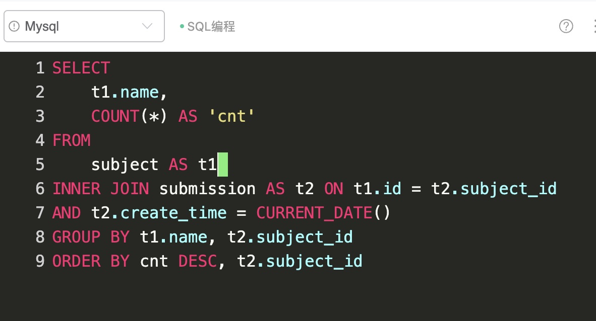
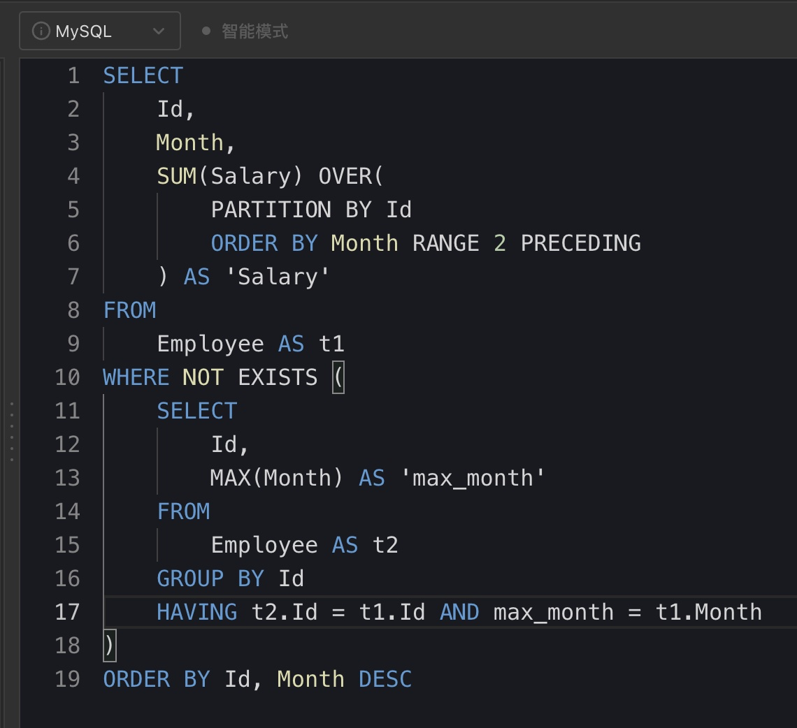
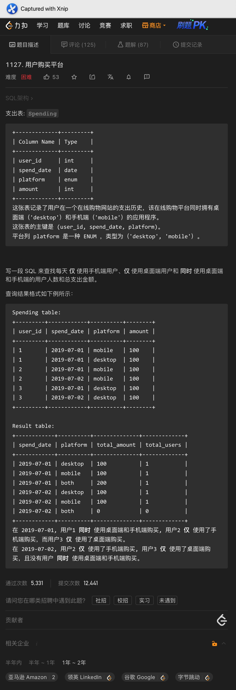

# Day231

## Tag: ROW_NUMBER


题意:

给你一张学生的来历表，请你根据地域，按照学生的姓名排序生成一张透视表


思路:

- 如果是简单的按照地域生成透视表的话，使用CASE WHEN就可以，但这里偏偏要按照学生姓名排序，这样就比较头痛了
- 为了让结果按照姓名排序，我们需要先行获取按照地区分组后的姓名排名，这里使用窗口函数即可，SQL如下

SQL1:

```mysql
SELECT 
    name,
    continent,
    ROW_NUMBER() OVER(
        PARTITION BY continent
        ORDER BY name
    ) AS 'rank'
FROM
    student
```


- 之后只需要从该表中获取对应地区的字典序最靠前的姓名即可
- 因为临时表中以及排好了序，所以我们直接使用即可，最终SQL如下

```mysql
SELECT
    MAX(CASE WHEN continent = 'America' THEN name END) as America,
    MAX(CASE WHEN continent = 'Asia' THEN name END) as Asia,
    MAX(CASE WHEN continent = 'Europe' THEN name END) as Europe
FROM (
		SQL1
) AS temp
GROUP BY `rank`
```

<hr>


# Day232

## Tag: ROW_NUMBER, COUNT() OVER


题意:

给你一张用户活动记录表，请你查询出用户最近的第二次活动，如果只有一个活动则直接查询出来即可


思路:

- 因为需要的是最近的第二次活动，所以我们需要将活动根据时间进行排序，且需要根据用户分组
- 且因为部分用户的活动次数可能只有1次，所以为了区分这两种用户，我们还需要根据用户分组后，统计其对应的活动次数，综合考虑下来，窗口函数是最适合的，SQL如下

SQL1:

```mysql
SELECT
    username,
    activity,
    startDate,
    endDate,
    ROW_NUMBER() OVER(
        PARTITION BY username
        ORDER BY endDate DESC
    ) AS 'rank',
    COUNT(*) OVER(
        PARTITION BY username
    ) AS 'cnt'
FROM
    UserActivity
```


- 获取该临时表后，我们只需要查询出排名为2，或者活动数为1的即可，最终SQL如下

```mysql
WITH temp AS (
    SQL1
)

SELECT
    username,
    activity,
    startDate,
    endDate
FROM
    temp
WHERE `rank` = 2
OR `cnt` = 1
```

<hr>


# Day233

## Tag: ROW_NUMBER, GROUP BY, LEFT JOIN


题意:

给你一张运动员的比赛记录表，请你查询出每个运动员的最长连胜次数


思路:

- 该题目可以使用窗口函数的frame解决，但说实话，我也记不住语法，这里就学习一下别人的解法:
- 首先，我们获取每个运动员对应比赛的时间次序，SQL如下

SQL1:

```mysql
SELECT
    player_id,
    match_day,
    result,
    ROW_NUMBER() OVER(
        PARTITION BY player_id
        ORDER BY match_day
    ) AS 'match_rank'
FROM
    Matches
```


- 之后重点来了，我们再查询出每个胜场的次序，并用比赛次序减去胜场次序
- 你问我为啥这么做？待会儿就知道了，此时SQL如下

SQL2:

```mysql
SELECT
    player_id,
    match_rank - ROW_NUMBER() OVER(
        PARTITION BY player_id
        ORDER BY match_rank
    ) AS 'diff'
FROM (
		SQL1
	) AS temp
WHERE result = 'Win'
)
```


- 将该表作为CTE临时表，根据player_id和diff分组，统计列数，SQL如下

SQL3:

```mysql
WITH rank_diff AS (
		SQL2
)

SELECT
    player_id,
    diff,
    COUNT(*) AS 'num'
FROM
    rank_diff
GROUP BY player_id, diff
```


- 到这里，就该解释思路了：
- 到这一步的时候，SQL的结果如图，可以看到，我们得出的结果中: 同一个运动员中diff不同的列对应的num不同
- 其实这不同的num对应的就是不同时间区间内，该运动员连胜的场次，为什么？
- 之前我们根据比赛时间获取了次序，之后又用它减去了胜场的次序，各位想想：如果处于同一连胜区间内，那么这些记录对应的差是不是都该相同呢？
- 所以我们只需要获取其中记录最多的区间对应的场次，不就是运动员的最长连胜次数了吗？语言表达有限，建议各位自己试一试，此时SQL如下

SQL4:

```mysql
WITH rank_diff AS (
		SQL2
)

SELECT
    player_id,
    MAX(num) AS 'longest_streak'
FROM (
		SQL3
) AS diff_num
GROUP BY player_id
```


- 到了这一步，我们是否成功了呢？其实还没有，在计算diff差的时候，如果某个倒霉蛋一次也没赢过，那么他在CTE临时表中是没有记录的
- 所以为了查询出所有的运动员记录，我们还必须根据原表中的运动员id来查询，这里使用外连接即可，最终SQL如下

```mysql
WITH rank_diff AS (
		SQL2
)

SELECT
    t1.player_id,
    IFNULL(t2.longest_streak, 0) AS 'longest_streak'
FROM (
    SELECT
        DISTINCT player_id
    FROM
        Matches
) AS t1
LEFT JOIN (
		SQL4
) AS t2 ON t1.player_id = t2.player_id
```

<hr>


# Day234

## Tag: GROUP_CONCAT, CONCAT


题意:

给你一张Terms表，其中一列数据为次数，另一列为系数，请你根据次数的升序构建一个一元多次等式，左边是表中的所有项，右边为0，正负号在等式中要显式表示，次数大于等于1的，则要用<符号><系数>X^<次数>的方式表示出来，如果次数等于0，则只表示系数即可


思路:

- 看结果有些复杂，但我们可以将等式拆成两边，左边就是我们要构建的
- 其中对应表中的每行数据来说，数据无非分为这几个部分: <符号>，<系数>，X，<次数>
- 因此，我们可以先构造出每行对应的部分，首先符号很简单，因为题目指明了，系数列不为0，所以我们只需要根据系数即可获取符号
- 后面三个部分就有些特殊了，因为需要分三种情况：如果次数为0，则只保留系数本身，如果次数为1，则构建为系数 + X；其余情况下才构建<系数>X<次数>
- 最后将这三个部分拼接起来即可，这里使用CONCAT即可，需要注意的是，为了之后构建出来的等式是按照次数降序的，这里我们还需要将次数一并查询出来，SQL如下

SQL1

```mysql
SELECT
    power,
    CONCAT(
        CASE WHEN factor < 0 
        THEN '-' ELSE '+' END,
        CASE WHEN power = 0 
        THEN ABS(factor)
        WHEN power = 1
        THEN CONCAT(ABS(factor), 'X')
        ELSE CONCAT(ABS(factor), 'X', '^', power) END
    ) AS 'LHS'
FROM
    Terms
```


- 之后我们只需要将这些行连在一起即可，这里需要使用GROUP_CONCAT
- 从官方文档可见，其可以在拼接时排序，且因为其默认的分隔符为","，所以我们还需要将默认分隔符改为空字符，最后只需要再右边拼接上"=0"即可，最终SQL如下

```mysql
SELECT
    CONCAT(GROUP_CONCAT(LHS ORDER BY power DESC SEPARATOR ''), '=0') AS 'equation'
FROM (
		SQL1
FROM
    Terms
) AS `left`
```

<hr>


# Day235

## Tag: DATE_FORMAT, LEFT JOIN, TIMESTAMPDIFF


题意:

给你一张用户日志表，请你查询出其中每天新用户的次日留存率


思路:

- 次日留存的计算无非就是次日再次登陆的用户人数 / 当天的新用户人数
- 我们将分子和分母拆开来看，因为要求每天的新用户，所以我们需要根据用户分组并获取每个用户的注册日期，SQL如下

SQL1

```mysql
SELECT
		uid,
		MIN(DATE(in_time)) AS 'first_time'
FROM
		tb_user_log
GROUP BY uid
```


- 接下来，我们只需要按照该临时表的数据，连接上原表后获取每个用户的次日记录即可，这里我们需要使用外连接
- 等等，这样真的可以吗？题目中有一点需要注意: 如果in_time和out_time跨天了，则也算做两天活跃，所以一张表中的in_time和out_time都需要与注册日期进行比较
- 这里我们需要将这两个同行的数据转换为同列才行，所以这里我们还需要对原表进行一次UNION查询，SQL如下

SQL2:

```mysql
SELECT
		uid,
		DATE(in_time) AS 'dt'
FROM
		tb_user_log
UNION
SELECT
		uid,
		DATE(out_time) AS 'dt'
FROM
		tb_user_log
```


- 一切就绪，接下来就很常规了，我们只需要将SQL1作为驱动表，对两表使用外连接，并限制两表的日期关系(注意这里要用AND，外连接的AND和WHERE分别指连接时判断和连接前判断)
- 最后再限制一下日期为2021-10，对日期分组排序即可，最终SQL如下

```mysql
SELECT
	t1.first_time AS 'dt',
	ROUND(COUNT(t2.uid) / COUNT(t1.uid), 2) AS 'uv_left_rate'
FROM (
	SQL1
LEFT JOIN (
  SQL2
) AS t2 ON t1.uid = t2.uid
AND TIMESTAMPDIFF(DAY, t1.first_time, t2.dt) = 1
WHERE DATE_FORMAT(t1.first_time, '%Y%m') = '202111'
GROUP BY t1.first_time
```

<hr>


# Day236

## Tag: GROUP BY, 日活, 新用户占比


题意:

给你一张用户活动日志表，请你查询出每天的日活用户数和新用户的占比


思路:

- 首先自然需要查询出所有新用户对应的首次使用日期，之后才好进行对比，SQL如下

SQL1:

```mysql
SELECT
		uid,
		MIN(DATE(in_time)) AS 'first_time'
FROM
		tb_user_log
GROUP BY uid
```


- 有了该表后，按理说我们只需要再连接上原表后，统计每天的总用户数和新用户数即可
- 但题目中又提到了：如果in_time和out_time跨天了，则两天都算做活跃
- 是不是有点眼熟，对，昨天有这个要求，所以我们参照昨天的做法，将行转换为列即可，SQL如下

SQL2

```mysql
SELECT
		uid,
		DATE(in_time) AS 'dt'
FROM
		tb_user_log
UNION
SELECT
		uid,
		DATE(out_time) AS 'dt'
FROM
		tb_user_log
```


- 最后，我们才应该连接两表，注意应该以原表数据为主，因为有些日期中可能没有新用户，所以要用到外连接，最终SQL如下

```mysql
SELECT
    DATE(t2.dt) AS 'dt',
    COUNT(t2.uid) AS 'dau',
    ROUND(IFNULL(COUNT(t1.uid), 0) / COUNT(t2.uid), 2) AS 'uv_new_ratio'
FROM (
    SQL1
    ) AS t1
RIGHT JOIN (
    SQL2
) AS t2 ON t1.uid = t2.uid AND t1.first_time = t2.dt
GROUP BY dt
ORDER BY dt
```

<hr>


# Day237

## Tag: DENSE_RANK


题意:

给你一张店铺销售记录表，请查询出11月中连续2天以上购物的用户对应的购物天数


思路:

- 对于连续的购物天数来说，如果对其进行排序的话，其实对于的rank应该是连续的
- 所以我们只需要获取每个用户按照日期排序的记录，最后留下≥2的即可，首先获取每个日期对应的次序，SQL如下

SQL1:

```mysql
SELECT
		user_id,
		sales_date,
		DENSE_RANK() OVER(
			PARTITION BY user_id
			ORDER BY sales_date
		) AS 'rn'
FROM sales_tb
```


- 之后只需要限制月份和对应的次序大小即可，最终SQL如下

```mysql
SELECT
    user_id,
    MAX(rn) AS 'days_count'
FROM (
    SQL1
    ) AS temp
WHERE rn >= 2
AND MONTH(sales_date) = 11
GROUP BY user_id
ORDER BY user_id
```


拓展:

- 是不是感觉哪里不对？
- 要是一个用户间隔1天及以上后又有一次购买记录呢？这种算法不还是把他算进去了吗？
- 没错，一旦表中有间隔1天以上的用户记录的话，这种算法就是错的了
- 这其实是牛客网的数据不严谨造成的，各位可以去试试，在有间隔一天及以上的用户记录存在的情况下
- 随便拿一个题解的答案去运行，会发现这条本不连续的记录还是被查询出来了

<hr>


# Day238

## Tag: CURRENT_TIME




题意:

给你一张提交记录表，一张题目信息表，请你查询出今天每个题目对应的提交数


思路:

- 这道题目可能说得不是很清楚，所以这位按照我们给的题意来理解就是了
- 首先，该题目要求按照不同的题目统计，所以需要分组，并且需要我们限制日期为当前日期
- 获取当前日期的函数可以是CURRENT_DATE()/CURRENT_DATE/CURDATE()
- 所以题目就很明显了，分组再统计就是了
- 但需要注意的是，我们在排序的时候用到了subject_id字段，所以在分组的时候需要加上该字段才行
- 最后在牛客网上做这道题目的时候不要按照我的格式写，否则会报错的，建议先把SELECT列表放在一行中运行通过了再改回来(已经给维护者反馈了)

<hr>


# Day239

## Tag: GMV, 动销率


题意:

给你一张产品信息表，一张销售记录表，请你计算每款产品的动销率和售罄率


思路:

- 该题目不是难在SQL的编写上，而是理解题目中动销率和售罄率这两个概念上
- 动销率其实可以理解为: 售出的数量 / (总数 - 售出的数量)
- 而售罄率 = GMV / 备货值，其中GMV = 销售总额，备货值 = 吊牌价 * 备货数
- 这么一看好想不难对吧？其实这里有一个坑
- 按照常规的思路，直接根据style_id分组，连接另外一个表后直接就能统计各个数据，这样子写出来的SQL如下

```mysql
SELECT
    t1.style_id,
    ROUND(100 * SUM(t2.sales_num) / (SUM(t1.inventory) - SUM(t2.sales_num)), 2) AS 'pin_rate',
    ROUND(100 * SUM(t2.sales_price) / SUM(t1.tag_price * t1.inventory), 2) AS 'sell-through_rate'
FROM
    product_tb AS t1
INNER JOIN sales_tb AS t2 ON t1.item_id = t2.item_id
GROUP BY t1.style_id
ORDER BY t1.style_id
```


- 但提交时就会发现是错误的，为啥呀？明明是按照定义来的呀？
- 其实在连接的时候，如果同一个item_id的商品在销售表中出现多次的话，连接时就会将其对应的数据查询多次，这样一来对应的数值都会减少
- 部分题解可能直接就在对应的字段或者乘积上去重就过了，但其实是不严谨的:
- 如果两个item_id不同的商品，其对应的tag_price * inventory恰巧相同呢？
- 所以这种方式不可行


- 为了解决重复计算的问题，这里我们可以先按照item_id分组查询出对应的sku和gmv，SQL如下

SQL1

```mysql
SELECT
		item_id,
		SUM(sales_num) AS 'sku',
		SUM(sales_price) AS 'gmv'
FROM
		sales_tb
WHERE MONTH(sales_date) = 11 AND YEAR(sales_date) = 2021
GROUP BY item_id
```


- 最后我们再连接计算记录，最终SQL如下

```mysql
SELECT
    t1.style_id,
    ROUND(100 * SUM(t2.sku) / SUM(t1.inventory - t2.sku), 2) AS 'pin_rate',
    ROUND(100 * SUM(t2.gmv) / SUM(t1.tag_price * t1.inventory), 2) AS 'sell-through_rate'
FROM
    product_tb AS t1
INNER JOIN (
    SQL1
    ) AS t2 ON t1.item_id = t2.item_id
GROUP BY t1.style_id
ORDER BY t1.style_id
```

<hr>


# Day240

## Tag: ROW_NUMBER


题意:

给你一张体育馆的人流量表，请你查询出其中人数大于等于100且id连续的三行或以上的记录


思路:

- 该思路借鉴自: [row_number方式解决连续性问题 - 体育馆的人流量 - 力扣（LeetCode） (leetcode-cn.com)](https://leetcode-cn.com/problems/human-traffic-of-stadium/solution/row_numberfang-shi-jie-jue-lian-xu-xing-42uhh/)
- 按照题意，id连续其实就是日期连续，因此该题目的最简单的解法就是两个自连接，限制彼此的日期关系即可

- 官方题解就是这个思路，但说实话，这种做法其实开销巨大
- 这里我们可以将问题转换一下: 在筛选去所有人数大于100的记录后，如果记录对应的行号减去id对应的差值相同的话，就说明这几个日期是连续的
- 因此我们可以先查询出每条记录对应的id与行号的差值，SQL如下

SQL1:

```mysql
SELECT
		t2.id - ROW_NUMBER() OVER( 
				ORDER BY t2.id
		) AS 'step',
		t2.id,
		t2.visit_date,
		t2.people 
FROM
		Stadium AS t2
WHERE t2.people >= 100 
```


- 又因为题目要求连续3天的，所以我们只需要根据差值分组(因此差值相同的才是连续的)，统计记录数即可获取每个连续时段内对应的日期数，SQL如下

SQL2:

```mysql
SELECT
		COUNT(*) OVER(
            PARTITION BY t1.step
        ) AS 'count',
		t1.id,
		t1.visit_date,
		t1.people 
FROM (
		SQL1
		) AS t1 
) AS t2
```


- 最后只需要限制count字段，进行排序即可，最终SQL如下

```mysql
SELECT
	t2.id,
	t2.visit_date,
	t2.people
FROM (
	SQL2
	) AS t2
WHERE t2.count >= 3
ORDER BY t2.id
```

<hr>


# Day241

## Tag: DENSE_RANK, LEFT JOIN


题意:

给你一张用户信息表，一张订单表，一张物品信息表，请你查询出每个用户按日期顺序卖出的第二件商品的品牌是否为其喜爱的品牌，如果用户没有卖出记录或者没有卖出两件则默认为no


思路:

- 因为涉及到按照日期排序，所以我们应该先获取每个用户按照日期排序后卖出的第二件商品，SQL如下

SQL1:

```mysql
SELECT
    t1.seller_id,
    t2.item_brand,
    DENSE_RANK() OVER(
        PARTITION BY seller_id
        ORDER BY order_date
    ) AS 'date_rank'
FROM
    Orders AS t1
INNER JOIN Items AS t2 ON t1.item_id = t2.item_id
```


- 之后再限定date_rank为2来获取用户卖出的第二件商品，SQL如下

SQL2:

```mysql
SELECT
		seller_id,
		item_brand
	FROM (
		SQL1
		) AS temp
	WHERE date_rank = 2
```


- 最后只需要再连接Users表，比较商品品牌即可，最终SQL如下

```mysql
SELECT
	t1.user_id AS 'seller_id',
	CASE WHEN t1.favorite_brand = t2.item_brand THEN 'yes'
	ELSE 'no' END AS '2nd_item_fav_brand'
FROM
	Users AS t1
LEFT JOIN (
	SQL2
	) AS t2 ON t1.user_id = t2.seller_id
```


提醒:

- 注意：部分老铁可能会这样想：SQL2不是脱裤子放屁吗？我直接以Users表为驱动表，将三张表进行外连接不就行了吗?
- 想法不错，但这里有个问题:
- 刚开始使用Users表和获取rank的Orders表进行外连接后，确实查询出了每个用户对于的交易记录，且没有交易记录的用户也为NULL
- 但之后与Items表进行外连接的时候会出现问题:
- 如果用户没有任何交易记录，则其对应的item_id字段为NULL，这样在与Items表进行连接的时候就是Items.item_id = NULL，这个表达式的结果一定不为真
- 对应的没有交易记录的用户则不会出现在结果集中
- 为了避免这样的结果，我不得已才先将后面两张表进行了连接
- 类似的问题各位可以参考《SQL进阶教程》中第一章第五节中外连接的内容

<hr>


# Day242

## Tag: RANGE, SUM OVER





题意:

给你一张员工薪资表，请你查询出其中每个员工除了最近一个月外，每个月近三个月的累积薪资


思路:

- 首先因为不能统计最近一个月的数据，所以我们需要先获取每个员工对应的最近一个月用于之后的排除，SQL如下

SQL1

```mysql
SELECT
		Id,
		MAX(Month) AS 'max_month'
FROM
		Employee
GROUP BY Id
```


- 对于累加，我说过这是SUM OVER擅长的事，但这里不是简单的累加这么简单，而是需要累加近两个月的值
- 这就涉及到窗口函数的frame参数了，窗口函数在OVER中一般只用到了两个参数: PARTITION分组和ORDER BY排序，但其实第三个参数frame也非常有用
- frame可以用来限制窗口的范围，在这道题目中，我们可以使用“RANGE 2 PRECODING”这样的表达式，其代表每个值前面的两个值
- 和它类似的有ROW，但其统计的是前面的两行，所以这里并不适用，最终将SQL1通过EXISTS改写如下

```mysql
SELECT
    Id,
    Month,
    SUM(Salary) OVER(
        PARTITION BY Id
        ORDER BY Month RANGE 2 PRECEDING
    ) AS 'Salary'
FROM 
    Employee AS t1
WHERE NOT EXISTS (
    SELECT
        Id,
        MAX(Month) AS 'max_month'
    FROM
        Employee AS t2
    GROUP BY Id
    HAVING t2.Id = t1.Id AND max_month = t1.Month
)
ORDER BY Id, Month DESC
```

<hr>


# Day243

## Tag: LEFT JOIN




题意:

给你一张消费记录表，请你查询出每天只使用手机、桌面端和两者都使用的用户人数和消费金额


思路:

- 从结果示例可知，不管有没有我们需要查询出每一天对应三种情况的数据，所以这里就需要外连接制作嵌套式表侧栏了
- 从结果可知：表侧栏就是日期和平台情况的笛卡尔积，SQL如下

SQL:

```mysql
SELECT
		DISTINCT spend_date,
		t2.platform
FROM
		Spending,
		(
		SELECT
			DISTINCT platform
		FROM
			Spending
		UNION ALL
		SELECT
			'both'
		) AS t2
```


- 之后我们需要根据原表查询出每天每个人对应的平台和累加的金额，SQL如下

SQL2:

```mysql
SELECT 
		user_id,
		spend_date,
		CASE WHEN COUNT(platform)=2 THEN 'both' ELSE platform END AS 'platform',
		SUM(amount) AS 'amount'
FROM 
		Spending 
GROUP BY user_id, spend_date
```


- 最后以表侧栏为驱动表，进行外连接即可，最终SQL如下

```mysql
SELECT
	t1.spend_date,
	t1.platform,
	IFNULL(SUM(t2.amount), 0) AS 'total_amount',
	COUNT(t2.user_id) AS 'total_users'
FROM (
	SQL1
	) AS t1
LEFT JOIN (
	SQL2
	) AS t2 ON t1.spend_date = t2.spend_date AND t1.platform = t2.platform
GROUP BY t1.spend_date, t1.platform
```


