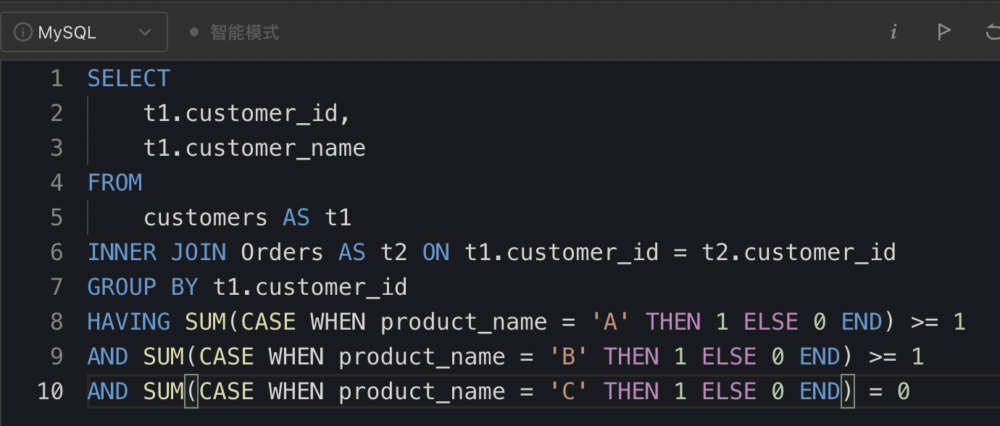

# Day261

## Tag: EXISTS, LIMIT


<hr>


<hr>


题意:

给你一张成绩表，请你查询出其中每个学生的最高成绩和对应的科目，如果有多个科目的成绩相同，则取course_id小的那个


思路:

- 因为课程id可能会有多个，所以我们需要先查询出每个学生对应的最高分数，SQL如下

SQL1:

```mysql
SELECT
	student_id,
	MAX(grade) AS 'max_grade'
FROM
	Enrollments
GROUP BY student_id
```


- 之后通过id和分数进行匹配，并取最小的course_id即可，最终SQL如下

```mysql
SELECT
    student_id,
    MIN(course_id) AS 'course_id',
    grade
FROM
    Enrollments AS t1
WHERE (student_id, grade) IN (
    SQL1
)
GROUP BY student_id, grade
ORDER BY student_id
```

<hr>




<hr>


# Day262

## Tag: CASE


题意:

给你一张变量表，一张表达式表，请你查询出其中所有表达式的结果


思路:

- 很明显，我们需要将变量的值对应在表达式中去，但两个变量结合三个符号有很多种情况，所以直接列出所有情况是不太好的
- 其实我们只需要根据三种符号列出对应的结果即可，且为了获取变量值的时候不受到表达式表中同行不同变量的影响，我们应该将变量表连接两次以分别获取两个值，最终SQL如下

```mysql
SELECT
    t1.left_operand,
    t1.operator,
    t1.right_operand,
    CASE WHEN (operator = '>' AND t2.value > t3.value)
    OR (operator = '=' AND t2.value = t3.value)
    OR (operator = '<' AND t2.value < t3.value)
    THEN 'true'
    ELSE 'false' END AS 'value'
FROM
    Expressions AS t1
INNER JOIN Variables AS t2 ON t1.left_operand = t2.name
INNER JOIN Variables AS t3 ON t1.right_operand = t3.name
```

<hr>


<hr>


<hr>


<hr>


# Day263

## Tag: CROSS JOIN


题意:

给你一张学生信息表，一张学科信息表，一张考试记录表，请你查询出其中每个学生参加每个科目的次数


思路:

- 这里需要注意的是，不管该学生是否参与了所有的科目，我们都要查询出每个学生对应的每个科目的次数
- 所以这里需要一个由学生id和学科组成的嵌套表侧栏，我们通过交叉连接生成一个笛卡尔积即可
- 最后将生成的笛卡尔积作为驱动表连接到考试记录表即可，最终SQL如下(COUNT(字段)不会统计NULL)

```mysql
SELECT
    t1.student_id,
    t1.student_name,
    t2.subject_name,
    COUNT(t3.subject_name) AS 'attended_exams'
FROM
    Students AS t1
CROSS JOIN Subjects AS t2
LEFT JOIN Examinations AS t3 ON t1.student_id = t3.student_id
AND t2.subject_name = t3.subject_name
GROUP BY t1.student_id, t1.student_name, t2.subject_name
ORDER BY t1.student_id, t2.subject_name
```

<hr>


<hr>


<hr>


