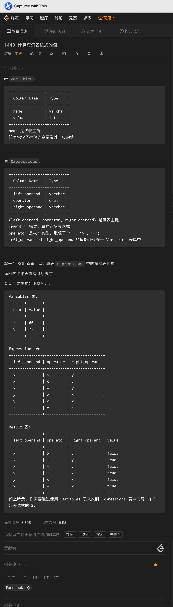
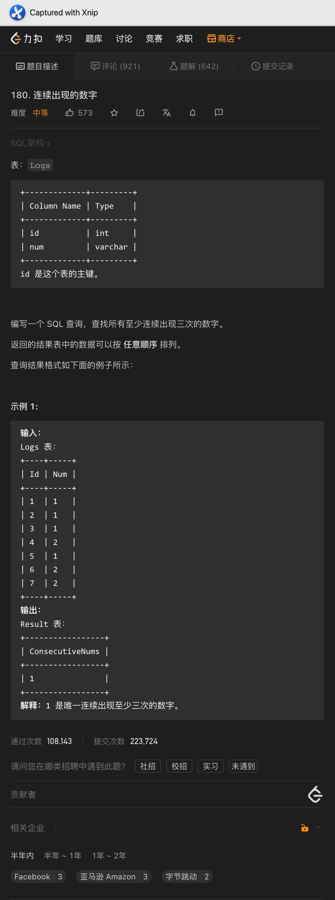

# Day261

## Tag: EXISTS, LIMIT


<hr>


<hr>


题意:

给你一张成绩表，请你查询出其中每个学生的最高成绩和对应的科目，如果有多个科目的成绩相同，则取course_id小的那个


思路:

- 因为课程id可能会有多个，所以我们需要先查询出每个学生对应的最高分数，SQL如下

SQL1:

```mysql
SELECT
	student_id,
	MAX(grade) AS 'max_grade'
FROM
	Enrollments
GROUP BY student_id
```


- 之后通过id和分数进行匹配，并取最小的course_id即可，最终SQL如下

```mysql
SELECT
    student_id,
    MIN(course_id) AS 'course_id',
    grade
FROM
    Enrollments AS t1
WHERE (student_id, grade) IN (
    SQL1
)
GROUP BY student_id, grade
ORDER BY student_id
```

<hr>


<hr>


# Day262

## Tag: CASE




题意:

给你一张变量表，一张表达式表，请你查询出其中所有表达式的结果


思路:

- 很明显，我们需要将变量的值对应在表达式中去，但两个变量结合三个符号有很多种情况，所以直接列出所有情况是不太好的
- 其实我们只需要根据三种符号列出对应的结果即可，且为了获取变量值的时候不受到表达式表中同行不同变量的影响，我们应该将变量表连接两次以分别获取两个值，最终SQL如下

```mysql
SELECT
    t1.left_operand,
    t1.operator,
    t1.right_operand,
    CASE WHEN (operator = '>' AND t2.value > t3.value)
    OR (operator = '=' AND t2.value = t3.value)
    OR (operator = '<' AND t2.value < t3.value)
    THEN 'true'
    ELSE 'false' END AS 'value'
FROM
    Expressions AS t1
INNER JOIN Variables AS t2 ON t1.left_operand = t2.name
INNER JOIN Variables AS t3 ON t1.right_operand = t3.name
```

<hr>


<hr>


<hr>


<hr>


# Day263

## Tag: CROSS JOIN


题意:

给你一张学生信息表，一张学科信息表，一张考试记录表，请你查询出其中每个学生参加每个科目的次数


思路:

- 这里需要注意的是，不管该学生是否参与了所有的科目，我们都要查询出每个学生对应的每个科目的次数
- 所以这里需要一个由学生id和学科组成的嵌套表侧栏，我们通过交叉连接生成一个笛卡尔积即可
- 最后将生成的笛卡尔积作为驱动表连接到考试记录表即可，最终SQL如下(COUNT(字段)不会统计NULL)

```mysql
SELECT
    t1.student_id,
    t1.student_name,
    t2.subject_name,
    COUNT(t3.subject_name) AS 'attended_exams'
FROM
    Students AS t1
CROSS JOIN Subjects AS t2
LEFT JOIN Examinations AS t3 ON t1.student_id = t3.student_id
AND t2.subject_name = t3.subject_name
GROUP BY t1.student_id, t1.student_name, t2.subject_name
ORDER BY t1.student_id, t2.subject_name
```

<hr>


<hr>


<hr>


<hr>


# Day264

## Tag: CASE


题意:

给你一张国家信息表，一张天气信息表，请你根据每个国家2019年11月的平均天气状态值查询出每个国家对应的天气类型


思路:

- 很明显，我们需要根据状态值的平均值查询进行分支判断
- 获取平均值则需要分组，而分支判断则使用CASE即可，最后用WHERE子句限制日期即可，最终SQL如下

```mysql
SELECT
    t1.country_name,
    CASE WHEN AVG(t2.weather_state) <= 15 THEN 'Cold'
    WHEN AVG(t2.weather_state) >= 25 THEN 'Hot'
    ELSE 'Warm' END AS 'weather_type'
FROM
    Countries AS t1
INNER JOIN Weather AS t2 ON t1.country_id = t2.country_id
WHERE YEAR(t2.day) = 2019
AND MONTH(t2.day) = 11
GROUP BY t1.country_name
```

<hr>


题意:

给你一张座位信息表，请你将其中相邻座位的学生进行交换，如果最后一个学生的id是奇数则他/她不交换，请你查询出交换后的信息


思路:

- 这里一看到交换可能就想到要更新表，或者通过判断id的奇偶来交换姓名，但这样做其实很麻烦
- 最简单的方式还是替换id:
- 如果id为奇数，当前id等于总数，那么说明其是最后一个学生，则不对其进行任何处理；如果只是奇数，则id + 1；是偶数则id - 1，就这样解决了
- 最终SQL如下

```mysql
SELECT
    CASE WHEN id % 2 != 0 AND id = (SELECT COUNT(*) FROM Seat) THEN id
    WHEN id % 2 != 0 THEN id + 1
    WHEN id % 2 = 0 THEN id - 1
    ELSE NULL END AS 'id',
    student
FROM
    Seat
ORDER BY id
```

<hr>


<hr>


<hr>


# Day265

## Tag: 连续空余座位


题意:

给你一张电影院的座位信息，请你查询出其中连续的空缺座位号


思路:

- 连续其实意味着id相差为1，而空缺则说明free字段值为1，所以我们通过自连接即可，SQL如下

```mysql
SELECT
    t1.seat_id
FROM
    Cinema AS t1
INNER JOIN Cinema AS t2 ON ABS(t2.seat_id - t1.seat_id) = 1
WHERE (t1.free && t2.free) = 1
GROUP BY t1.seat_id
ORDER BY t1.seat_id
```

<hr>


<hr>


<hr>


题意:

给你一张用户日志表，请你查询出其中在同一时刻通过不同ip地址登陆的用户


思路:

- 其实所谓的某一时刻，就是其他的登陆记录时间在其他登陆记录的区间内
- 所以我们通过BETWEEN AND就能进行限制，SQL如下

```mysql
SELECT
    t1.account_id
FROM
    LogInfo AS t1
INNER JOIN LogInfo AS t2 ON t2.login BETWEEN t1.login AND t1.logout
AND t1.account_id = t2.account_id
AND t1.ip_address != t2.ip_address
GROUP BY t1.account_id
```

<hr>


# Day266

## Tag: INNER JOIN


 题意:

给你一张点的坐标表，请你查询出其中任意两点可以形成的矩形的面积(需要大于0)


思路:

- 题目说是任意两点，但其实有一些限制在其中:
- 首先不能和自身组合，其次不能向两边延伸，否则会出现重复计算，所以我们只能使用不等式连接
- 其次，面积不得为0，面积其实就是两点横纵坐标之差的绝对值的乘积
- 最简单的方法是使用`HAVING`子句，因为面积是查询之后得到的字段信息，通过`HAVING`才能对其进行限制，所以我们使用`HAVING > 0`就能解决
- 但为什么我用了`WHERE`子句呢？这样需要写两行，明显没有`HAVING`来得优雅
- 其实`WHERE`的写法性能会更好一些，因为`HAVING`是针对所有计算出来的结果进行限制，而`WHERE`则是在计算之前进行限制，所以节省了部分开销，所以我选择使用看起来更麻烦的`WHERE` 
- SQL如下

```mysql
SELECT
    t1.id AS 'p1',
    t2.id AS 'p2',
    ABS(t2.x_value - t1.x_value) * ABS(t2.y_value - t1.y_value) AS 'area'
FROM
    Points AS t1
INNER JOIN Points AS t2 ON t1.id < t2.id
WHERE (t2.x_value - t1.x_value) != 0
AND (t2.y_value - t1.y_value) != 0
ORDER BY area DESC, t1.id, t2.id
```

<hr>





<hr>


<hr>


# Day267

## Tag: EXISTS, HAVING


题意:

给你一张商品信息表，一张订单信息表，请你查询出其中每类商品最近一天的订单信息


思路:

- 最近一天即日期值最大，所以我们需要先分组获取每种商品的最大日期值才行
- 获取后，我们可以直接使用IN来匹配product_id和order_date字段，但对于子查询参数使用IN显然不太好，所以我选择改写为EXISTS，最终SQL如下

```mysql
SELECT
    t1.product_name,
    t1.product_id,
    t2.order_id,
    t2.order_date
FROM
    Products AS t1
INNER JOIN Orders AS t2 ON t1.product_id = t2.product_id
WHERE EXISTS (
    SELECT
        t3.product_id,
        MAX(t3.order_date) AS 'order_date'
    FROM
        Orders AS t3
    WHERE t1.product_id = t3.product_id
    GROUP BY product_id
    HAVING order_date = t2.order_date
)
ORDER BY t1.product_name, t1.product_id, t2.order_id
```

<hr>


<hr>


题意:

给你一张用户信息表，一张产品信息表，请你查询出其中购买了所有产品的用户id


思路:

- 如果将所有的用户进行分组，可以发现我们需要的用户与其他用户的不同点: 其购买产品的种类 = 产品表中的产品种类
- 所以我们只需要利用目标集合的特点即可，针对集合进行筛选需要使用HAVING，所以SQL如下

```mysql
SELECT
    t1.customer_id
FROM
    Customer AS t1
INNER JOIN Product AS t2 ON t1.product_key = t2.product_key
GROUP BY t1.customer_id
HAVING COUNT(DISTINCT t2.product_key) = (SELECT COUNT(*) FROM Product)
```

<hr>


# Day268

## Tag: UNION ALL, GROUP BY, LIMIT


题意:

给你一张电影信息表，一张用户信息表，一张评分记录表，请你查询出其中评论次数最多的用户对应的用户名，以及2020年2月中平均评分最高的电影名称


思路:

- 很明显，我们需要查询两个不同的结果并对两个结果做加法
- 评论次数只需要分组后直接在`ORDER BY`中对`COUNT(*)`排序即可
- 之后电影评分也是如此，只不过多了对日期的限制，并换为按照`AVG`排序即可
- 最后要将两个查询视作两个集合，对它们做并集操作，因为两个查询的结果截然不同，所以我们最好使用`UNION ALL`而不是简单的`UNION`
- 因为`UNION`在去重的同时会进行排序，加上`ALL`选项就能避免这个操作，从而节省开销，实现SQL优化

<hr>


<hr>


# Day269

## Tag: Sub Query


题意:

给你一张用户活跃记录表，请你查询出首次登陆后第二天再次登陆的玩家比率


思路:

- 从题目上看，我们需要统计首次登陆后第二天的人数，以及总人数
- 但在统计首次登陆后第二天的人数之前，我们需要知道每个用户第一次登陆的时间才行，SQL如下

SQL1:

```mysql
SELECT
	player_id,
	MIN(event_date) AS 'first_day'
FROM
	Activity
GROUP BY player_id
```


- 有了首次登陆的记录后，我们只需要根据日期和id进行外连接即可
- 这样一来，根据这张临时表可以获取总人数，而与其连接的表中不为NULL的字段数量就是第二天的登陆人数了，SQL如下

SQL2:

```mysql
SELECT
    ROUND(COUNT(t2.player_id) / COUNT(*), 2) AS 'fraction'
FROM (
    SQL1
) AS t1
LEFT JOIN Activity AS t2 ON DATEDIFF(t2.event_date, t1.first_day) = 1
AND t1.player_id = t2.player_id
```

<hr>


<hr>


# Day270

## Tag: COUNT() OVER


SQL:

```mysql
SELECT
    employee_id,
    COUNT(*) OVER(
        PARTITION BY team_id
    ) AS 'team_size'
FROM
    Employee
```

<hr>


题意:

给你一张分数记录表，请你查询出其中每种性别在每一天的累积分数


思路:

- 题目本身其实很简单，因为是求不同性别的分数，所以需要根据性别分组，之后需要根据日期值来累加
- 如果熟悉窗口函数的话，其实很容易就会想到使用SUM(col) OVER()，此时SQL如下

```mysql
SELECT
    gender,
    day,
    SUM(score_points) OVER(
        PARTITION BY gender
        ORDER BY day
    ) AS 'total'
FROM
    Scores
```


- 那么问题来了，MySQL目前只有8.0才实现了窗口函数，如果是之前那些不支持的版本呢？
- 此时我们就要考虑标准SQL的解法了，其实累加计算就是在根据性别分组的前提下，生成每个日期对应的递归子集，每个子集的和值就是对应日期范围内的累计值
- 而获取递归子集的方法就是非等值自连接，用连接的方式写如下:

```mysql
SELECT
    t1.gender,
    t1.day,
    SUM(t2.score_points) AS 'total'
FROM
    Scores AS t1
INNER JOIN Scores AS t2 ON t1.day >= t2.day
AND t1.gender = t2.gender
GROUP BY t1.gender, t1.day
ORDER BY t1.gender, t1.day
```


- 其实这个连接的部分也可以放在SELECT列表里，此时SQL如下

```mysql
SELECT
    t1.gender,
    t1.day,
    (
        SELECT
            SUM(t2.score_points)
        FROM
            Scores AS t2
        WHERE t1.day >= t2.day
        AND t1.gender = t2.gender
    ) AS 'total'
FROM
    Scores AS t1
ORDER BY gender, day
```

<hr>


