# Day31

## Tag: ORDER BY, Sub Query, LIMIT


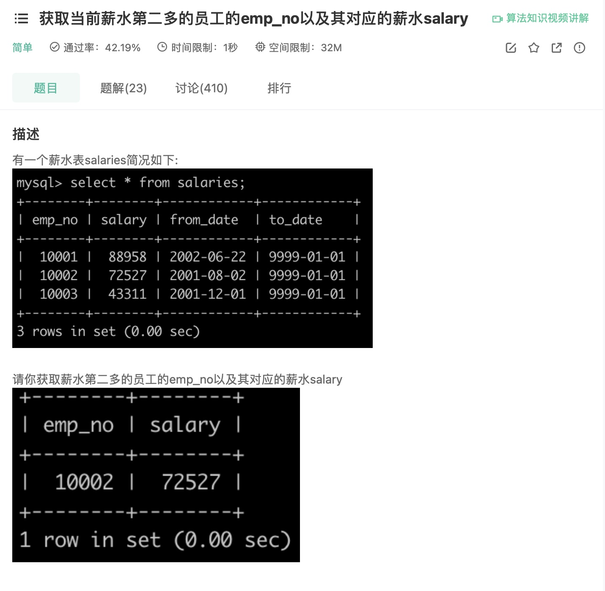


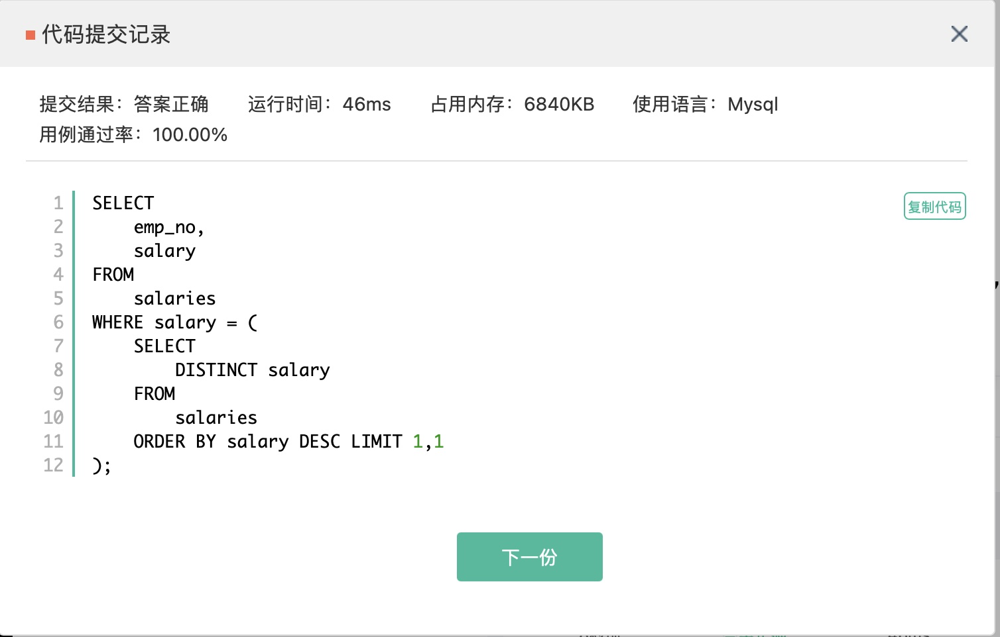


题意:

根据给出的表，查询出工资排名第二员工的编号和工资数目


思路:

- 首先考虑获取对应的salary值，因为不是获取最大值且涉及到排序，那么很明显就应该用ORDER BY，并且指定为DESC降序，再使用LIMIT获取第二位即可，SQL如下


SQL1:

```mysql
SELECT
	salary
FROM
	salaries
ORDER BY salary LIMIT 1, 1;
```

- LIMIT 1, 1: 

参数一: 从索引为1的位置开始

参数二: 一共获取1条数据


- 这里还可以使用OFFSET进行搭配:

最后一行改为: ORDER BY salary LIMIT 1 OFFSET 1(即一共取一条数据，但跳过第一条数据)


同: SQL Day11


- 最后再将其作为子查询条件即可，SQL如下

SQL2

```mysql
SELECT
	emp_no,
	salary
FROM
	salaries
WHERE salary = (SQL2);
```

- 因为子查询结果只有一条数据，所以这里可以用"="

****


# Day32

## Tag: DELETE, Sub Query


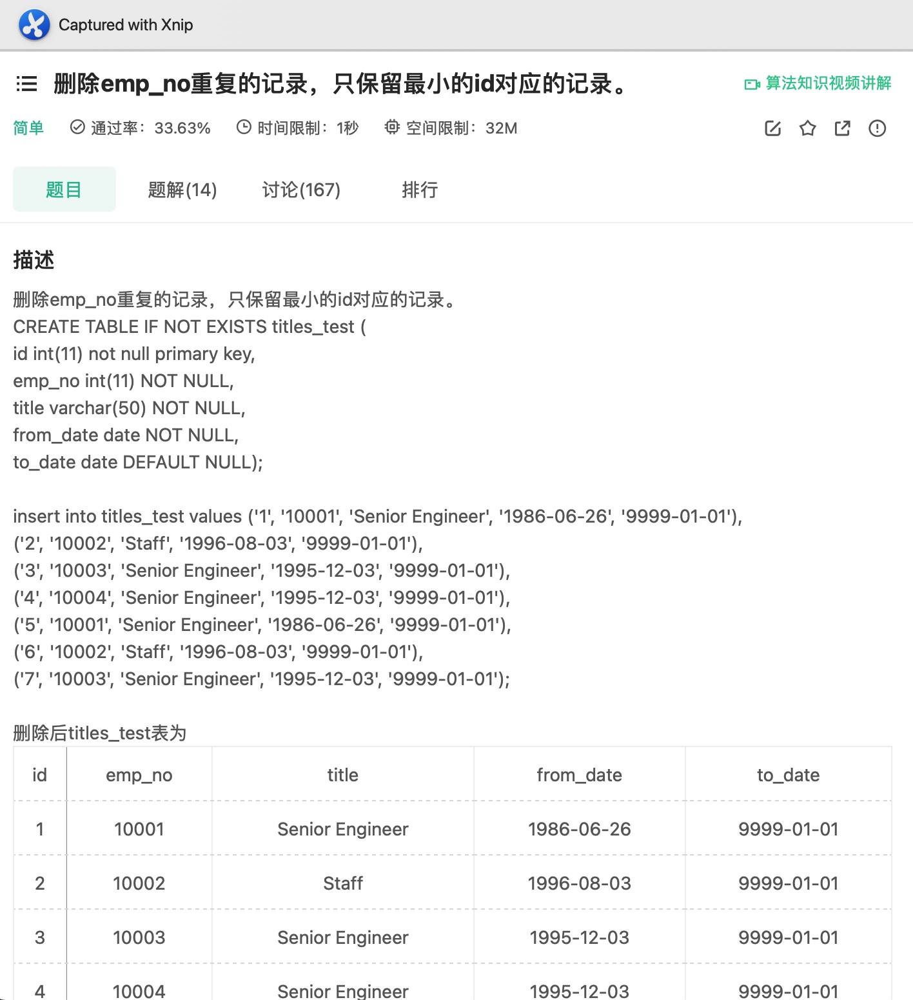


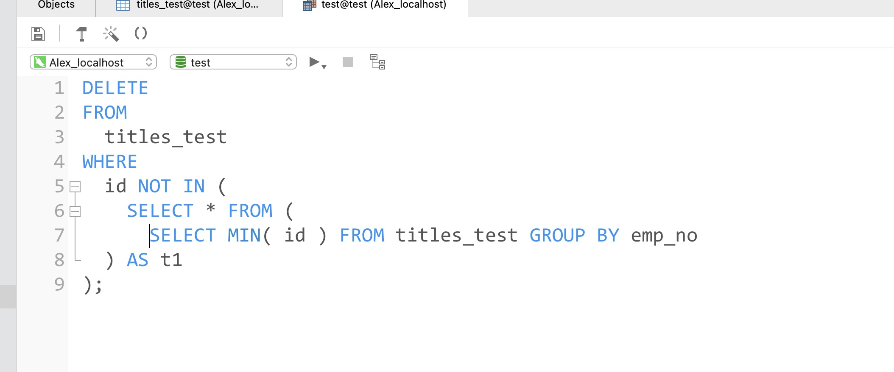


题意:

删除重复的员工号重复的数据(emp_no)，保留每个员工号中id值最小的数据


思路:

- 首先通过聚合函数查询出最小的员工id，并用GROUP BY限制在每个emp_no内，SQL如下：

SQL1

```mysql
SELECT
	MIN(id)
FROM
	titles_test
GROUP BY emp_no
```


- 之后再将其作为子查询结果，注意因为我们用到了删除操作，这里不能直接作为条件使用(不能一边用条件，一边删除条件中的数据)，我们可以在SQL1的基础上在套一层，对SQL1进行一次查询，将该结果表作为条件进行删除即可，SQL如下：


SQL2

```mysql
DELETE 
FROM
	titles_test
WHERE id NOT IN(
	SELECT * FROM (
  	SQL1
  ) AS t1
);
```

****


# Day33

## Tag: UPDATE, JOIN


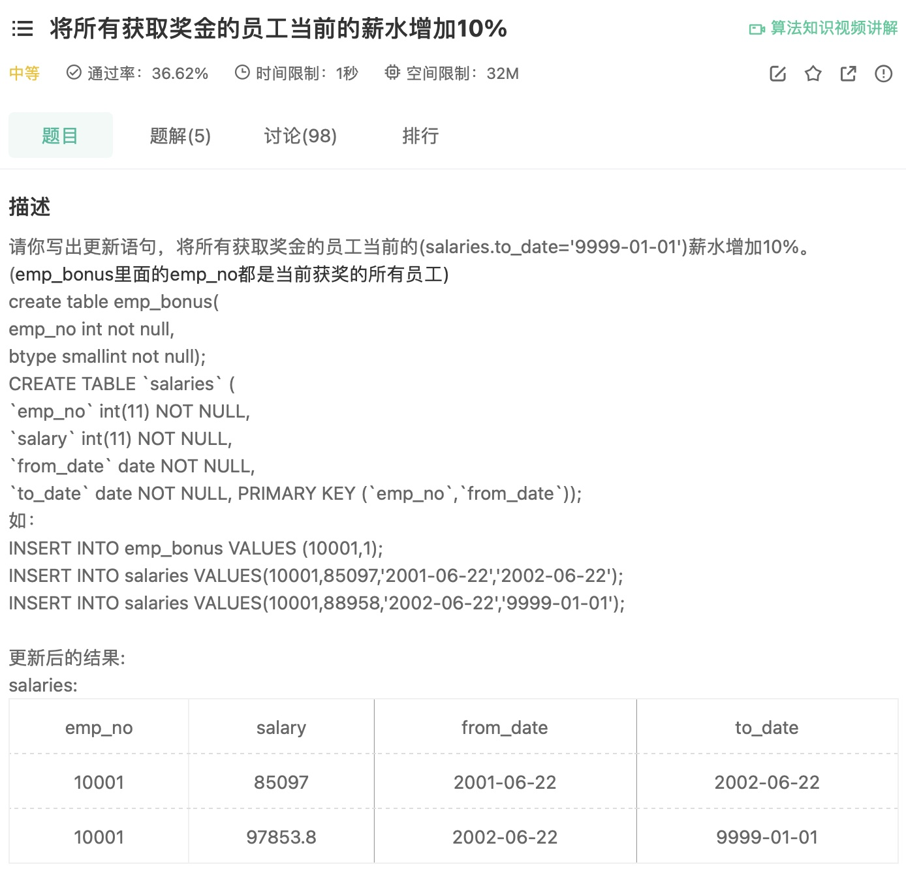


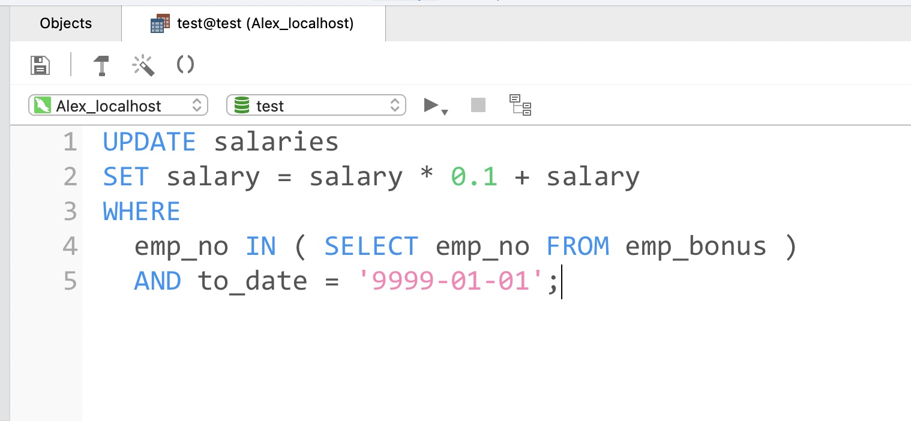


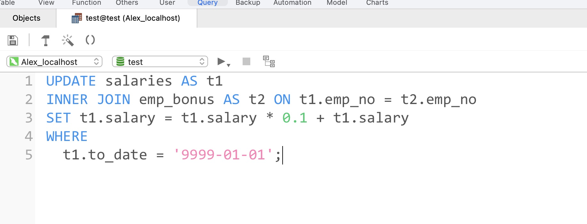


题意:

将奖金表emp_bonus中的员工在工资表salaries中的salary增加10%


思路:

- 查出奖金表中的员工号，SQL如下

SQL1

```mysql
SELECT
	emp_no
FROM
	emp_bonus;
```


- 将其作为子查询条件，进行查询，注意要更新的是员工当前的薪水(to_date为'9999-01-01')，SQL如下

SQL2

```mysql
UPDATE salaries
SET salary = salary * 0.1 + salary
	WHERE emp_no IN (SQL1)
	AND to_date = '9999-01-01'
```

****


# Day34

## Tag: DATEDIFF, ORDER BY


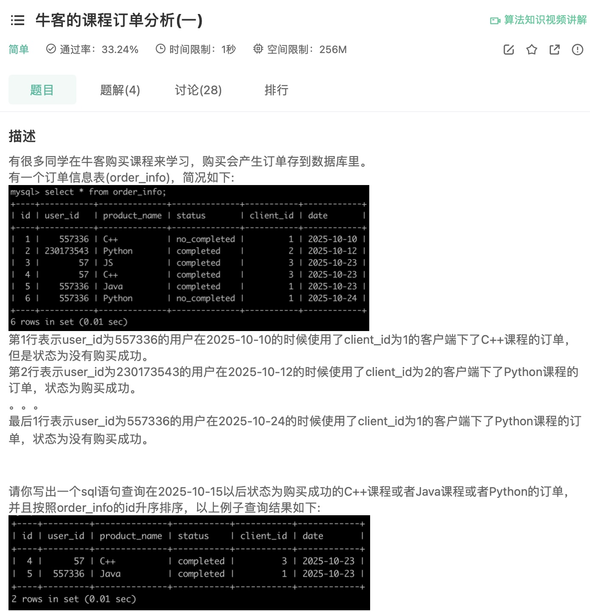


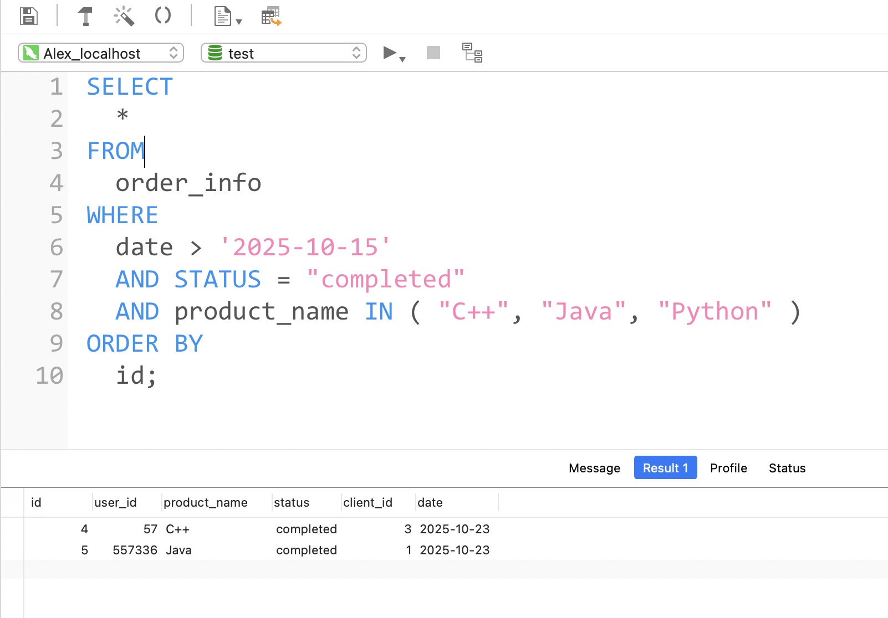


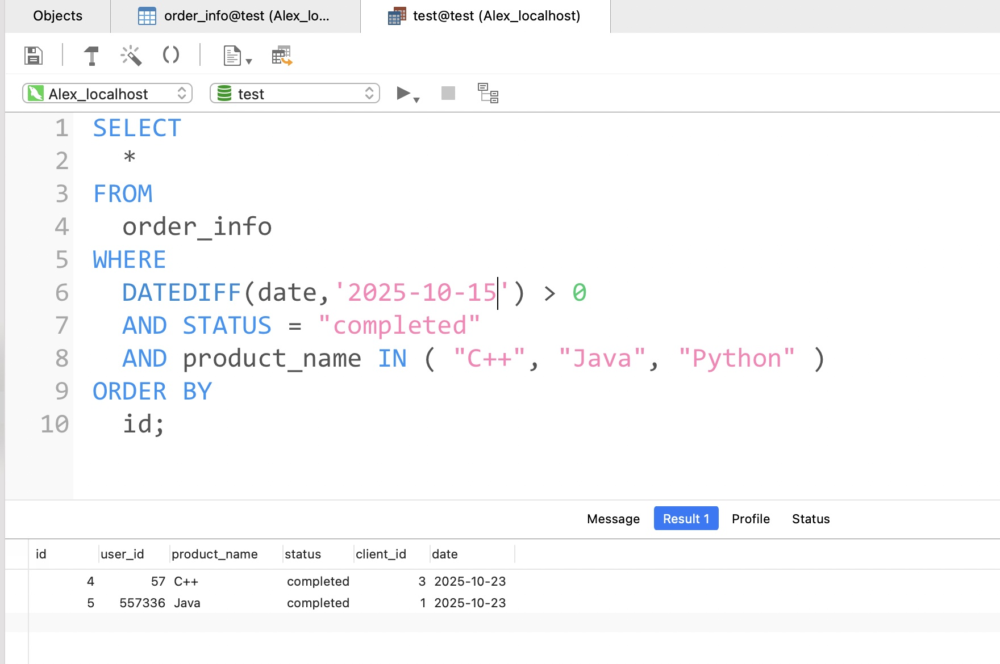


题意:

查询出2025-10-15之后已完成的C++, Java, 和Python订单信息，并将结果以id进行升序排列


思路:

- 常规的写出条件语句，每个条件用AND并列即可，其中prodect_name可用使用IN，SQL如下

```mysql
SELECT
	*
FROM 
	order_info 
WHERE date > '2025-10-15'
	AND status = "completed"
	AND product_name IN ("C++", "Java", "Python") 
ORDER BY 
	id;
```


- 也可以将date条件用DATEOFF()函数替代，SQL如下

```mysql
SELECT
	* 
FROM
	order_info 
WHERE
	DATEDIFF(date,'2025-10-15') > 0 
	AND STATUS = "completed" 
	AND product_name IN ( "C++", "Java", "Python" ) 
ORDER BY
	id;
```

****


# Day35

## Tag: HAVING, GROUP BY


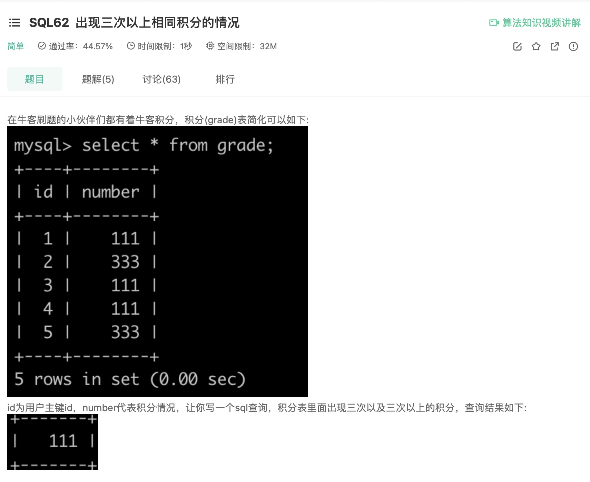


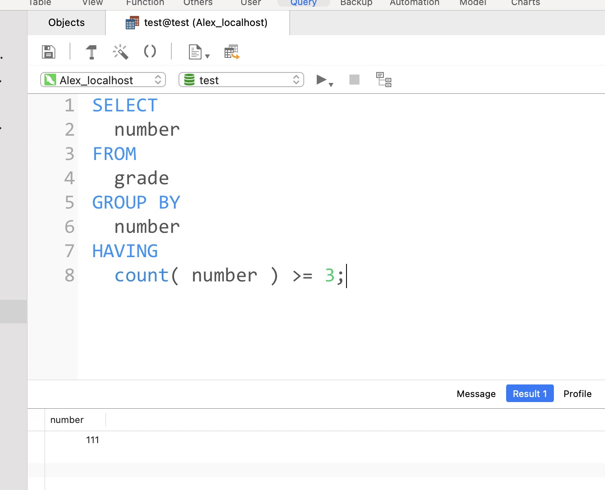


题意:

查询出现次数>=3次的积分


思路:

计算次数就需要用到COUNT()函数，由于需要按积分进行划分，所以需要先使用GROUP BY，再使用HAVING对分组结果进行进一步查询，SQL如下

SQL

```mysql
SELECT
	number
FROM
	grade
GROUP BY
	number
HAVING
	COUNT (number) >= 3;
```

****


# Day36

## Tag: ASCII, Swap, UPDATE


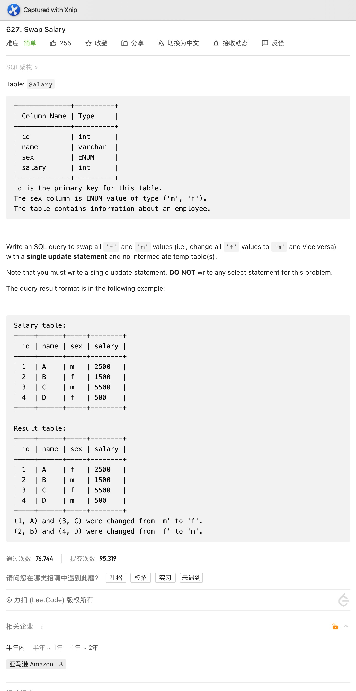


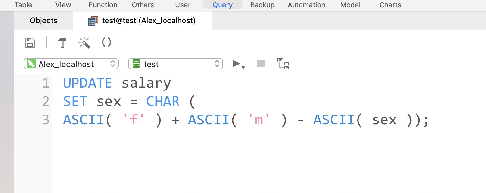


题意:

将表中的性别字段值全部反转


思路:

- 获取字符'f'和'm'的ASCII码值之和，再减去每条数据的sex值，则会取得其反转，SQL如下

```mysql
UPDATE
	salary
SET sex = CHAR (
ASCII('f') + ASCII('m') - ASCII(sex);
```

****


# Day37

## Tag: Sub Query, GROUP BY, IN


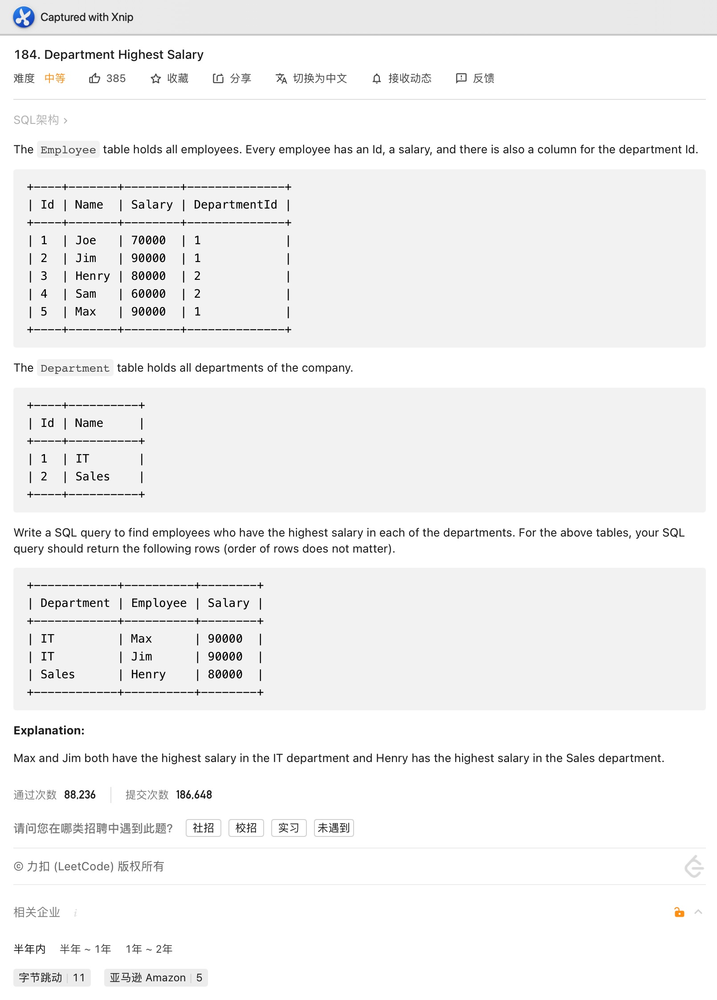


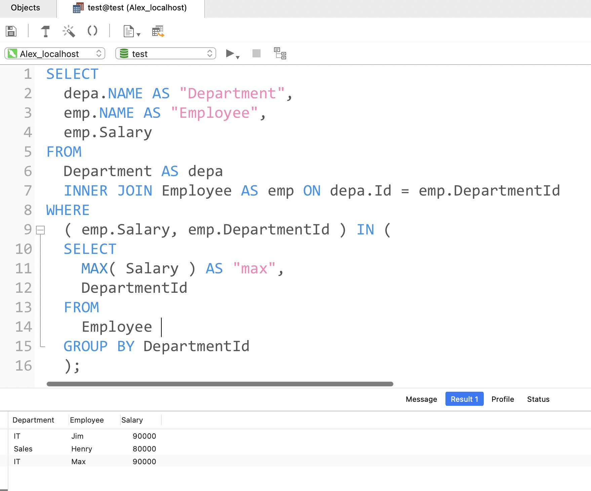


题意:

给你一张员工信息表，和一张部门id表，要求你查询出各个部门中，工资最高员工的所属部门，姓名和工资金额数


思路:

- 首先，必然是查询最大的Salary值，并通过部门进行分组，SQL如下

SQL1:

```mysql
SELECT
	MAX(Salary) AS "max",
	DepartmentId
FROM
	Employee
GROUP BY DepartmentId;
```


- 鉴于部门中拥有相同工资数的人会有多个，所以我们通过上面的查询结果，对部门进行匹配，并将员工表中的部门id替换为具体的部门名称，SQL如下

SQL2:

```mysql
SELECT
	depa.Name AS "Department",
	emp.Name AS "Employee",
	emp.Salary
FROM
	Department AS depa
	
# 使用内连接，将部门id替换为具体的部门名称
INNER JOIN Employee AS emp ON emp.DepartmentId = depa.Id

# 匹配上述查询的条件，避免将数据归位不同的部门(在本部门不是最高，但在其他部门是最高)
# 注意查询条件的顺序，需要和子查询结果的相关字段顺序相同
WHERE (emp.Salary, emp.DepartmentId) IN (
SQL2
);
```

****


#  Day38

## Tag: DELETE JOIN


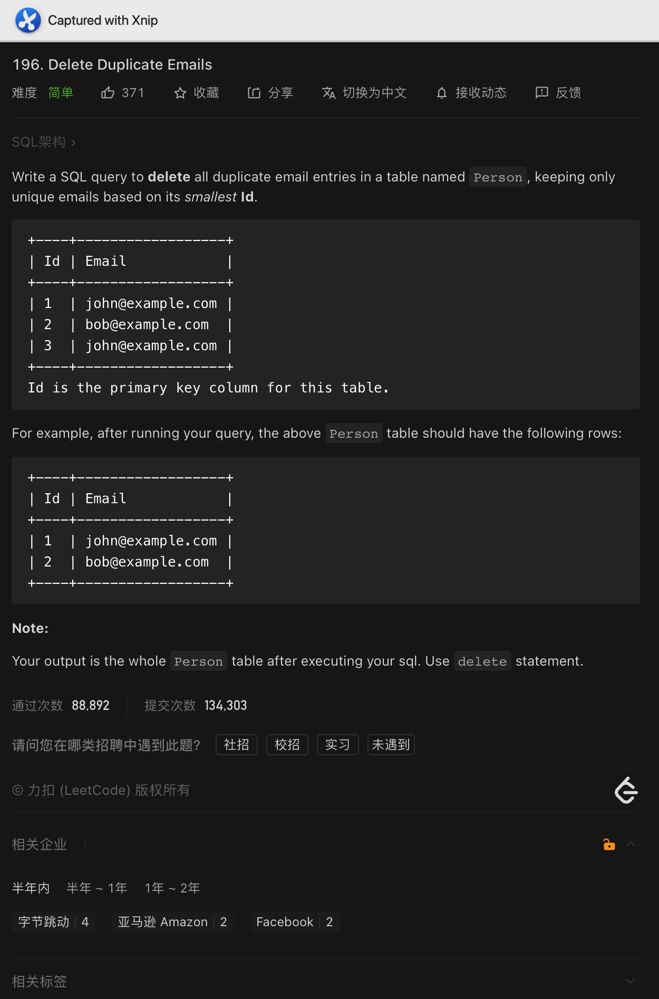


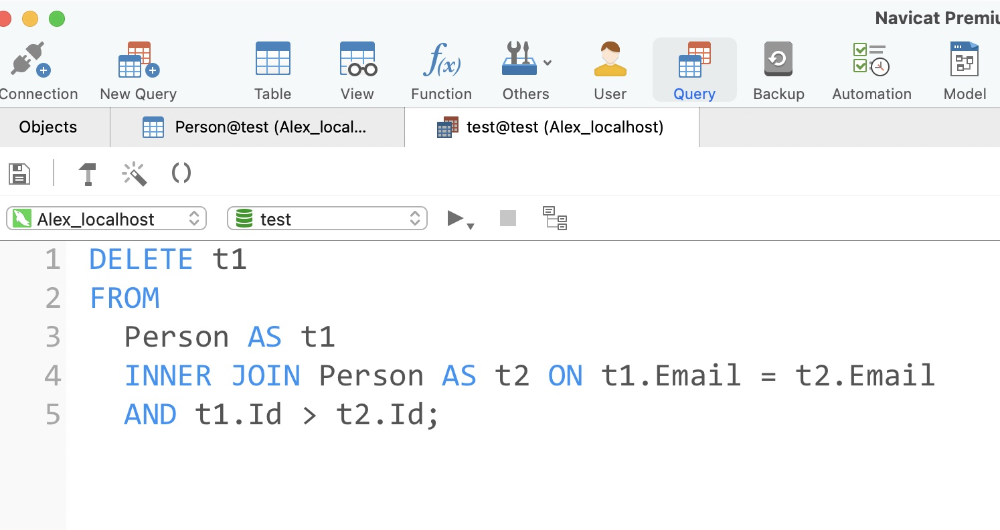


题意:

有一个Person表，其中部分邮箱是重复的，请你删除表中重复的数据


思路:

- 明确一点，每条数据的id都不同，所以我们只需要找出需要删除数据的id即可
- 由于只有一张表，我们需要将这张表进行自连接，通过限定Email字段找到重复数据，再通过比较Id，将Id较大的删除即可，SQL如下:

```mysql
DELETE
	t1
FROM
	Person AS t1,
INNER JOIN Person AS t2 ON t1.Email = t2.Email
AND t1.Id > t2.Id;
```

****


# Day39

## Tag: ROUND, ORDER BY, GROUP BY


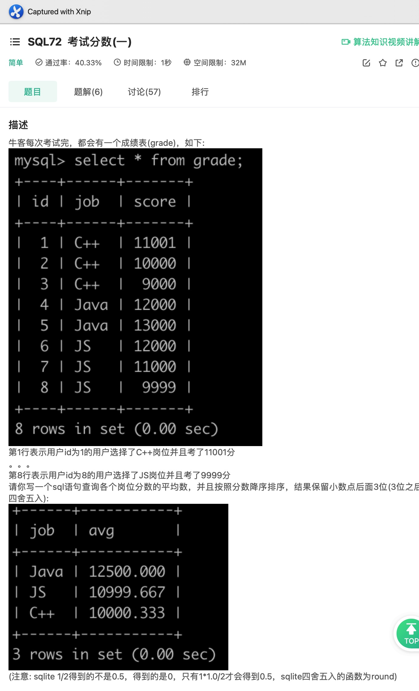


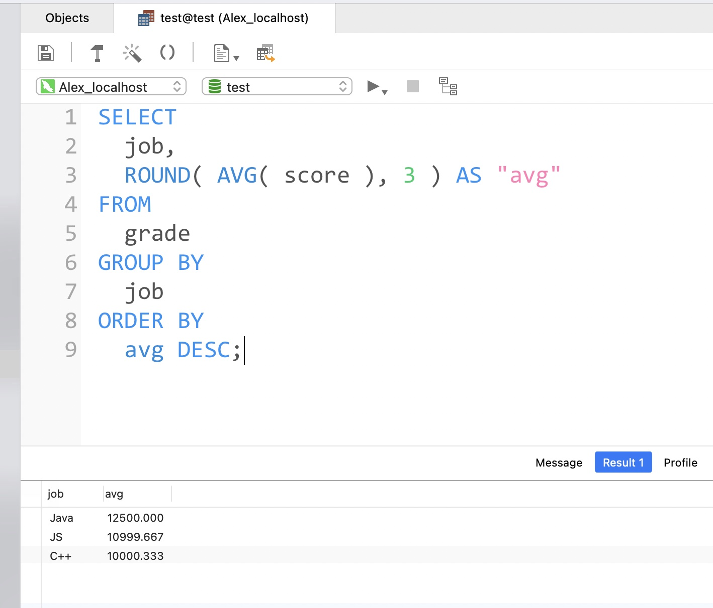


题意:

给你一张成绩表，请查询出每个考试的平均值且保留三位小数，并按倒序排列


思路:

- 查询平均值，那么就需要AVG()函数，保留三位小数就需要使用ROUND()函数，并指定为3
- 由于需要按照不同的科目分类，所以需要使用GROUP BY，最后再使用ORDER BY排序并指定DESC倒序即可

****


# Day40

## Tag: SUM, GROUP BY, ORDER BY, DATE


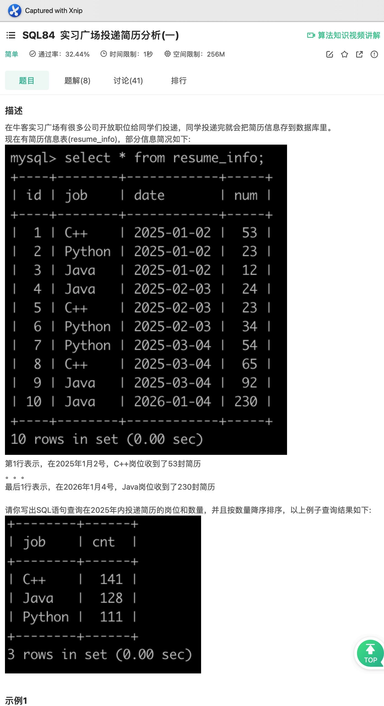


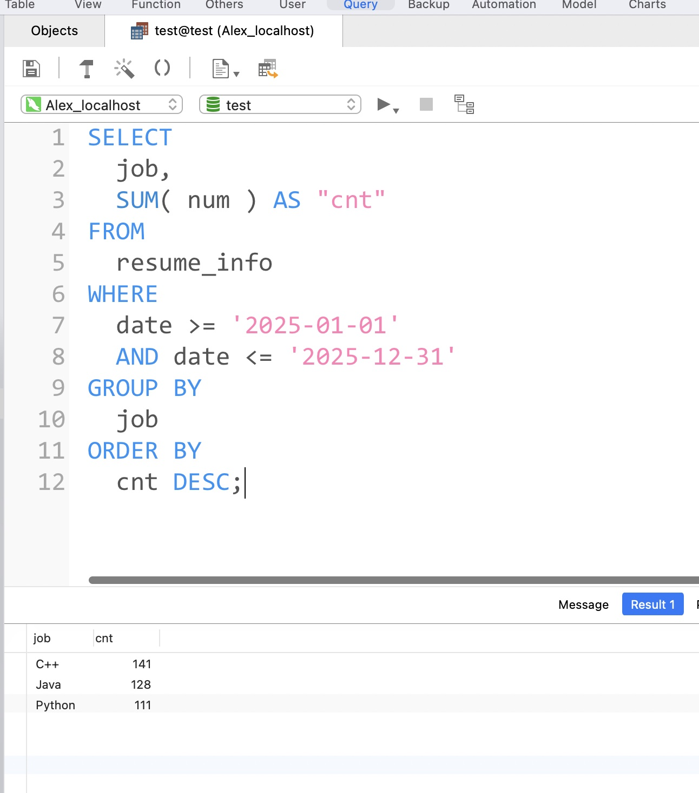


题意:

给你一张简历表，请查询出各个岗位在2025年内投递的简历总数，并按照总数倒序排列


思路:

- 既然要计算总数，那么就会用到SUM()函数(注意不能使用COUNT()，其只能用来计算数据的条数)，按照岗位分就意味着使用GROUP BY，最后需要倒序排序，那么就使用ORDER BY再指定DESC即可
- 对于日期，就简单的使用WHERE指定范围即可，SQL如下

SQL

```mysql
SELECT
	job,
	SUM(num) AS "cnt"
FROM
	resume_info
WHERE date >= '2025-01-01'
AND date <= '2025-12-31'
GROUP BY
	job
ORDER BY
	cnt DESC;
```

****


# Day41

## Tag: GROUP_CONCAT


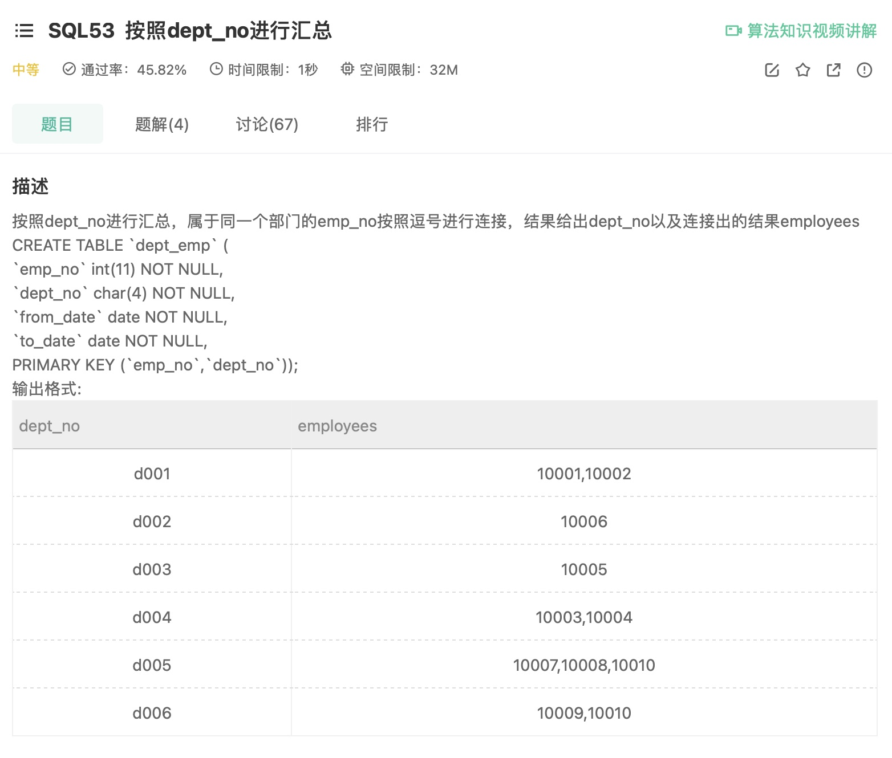


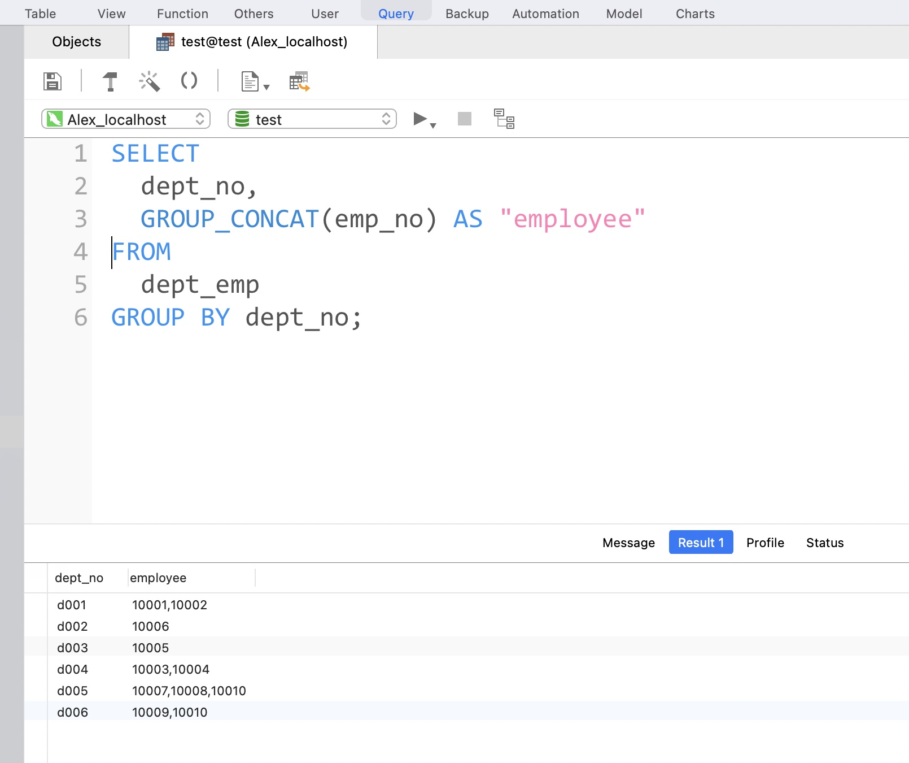


题意:

给你一张部门职员表，请你查询出每个部门对应的所有职员，每个职员用","分隔


思路:

- 按照部门分类，自然想到用GROUP BY
- 要求用","分隔，难道用CONCAT()?
- 其实直接使用GROUP_CONCAT()即可，SQL如下:

```mysql
SELECT
	dept_no,
	GROUP_CONCAT(emp_no) AS "employee"
FROM
	dept_emp
GROUP BY dept_no;
```

****


# Day42

## Tag: Sub Query, AVG, GROUP BY


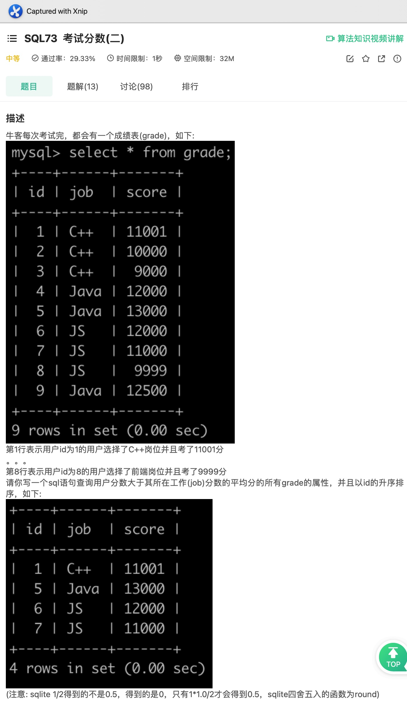


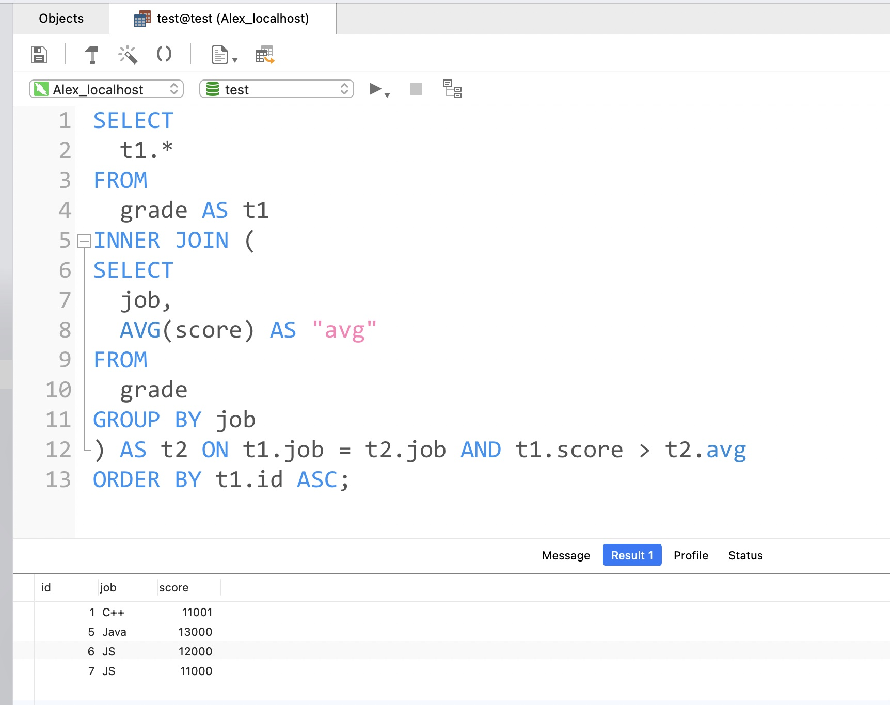


题意:

给你一张成绩表，请查询出每个科目中大于该科目平均值的所有数据


思路:

- 首先需要获取每个科目的平均值，求平均值自然想到使用AVG()函数，而按照科目划分自然想到GROUP BY，SQL如下

SQL1

```mysql
SELECT
	job,
	AVG(score) AS "avg"
FROM
	grade
GROUP BY job;
```


- 之后再将源表与其进行连接查询，限定job和score字段条件即可，最后再使用ORDER BY排序(默认为升序，可以用ASC标明)，SQL如下

SQL2

```mysql
SELECT
	t1.*
FROM
	grade
INNER JOIN (SQL2) AS t2 ON t1.job = t2.job
AND t1.score > t2.avg
ORDER BY id ASC;
```

****


# Day43

## Tag: RIGHT(String Func)


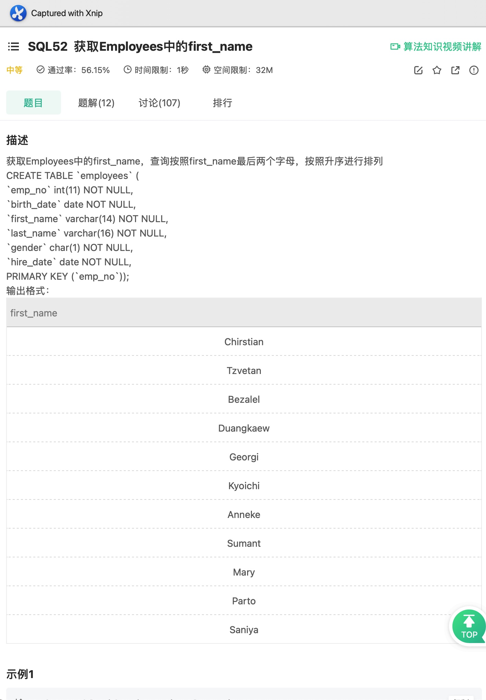


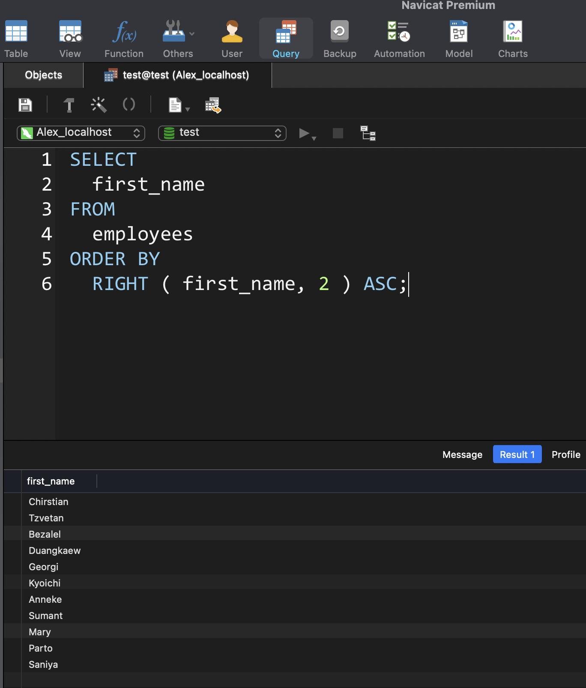


题意:

给你一张职员信息表，请你查询出其中的"first_name"，并按照该字段的最后两个字符进行排序


思路:

- 前半部分很容易就能实现，SQL如下

```mysql
SELECT
	first_name
FROM
	employees;
```


- 那么剩下的排序要求呢？
- 我们知道排序需要使用ORDER BY，但这里进行排序的对象不是一个直接的字段，而是对一个字段处理后的结果
- 在这道题目中，我们需要截取字符串的后两个字符
- 这里需要使用一个新的函数"RIGHT()"，我们可以使用它从字符串字段的右边开始截取任意长度的字符
- 该函数的格式如下:

```mysql
RIGHT(column_name, length);
```


- 所以我们的排序条件应该写为:

```mysql
ORDER BY RIGHT(first_name, 2);
```


- 所以我们的SQL语句应该写为:

```mysql
SELECT
	first_name
FROM
	employees
ORDER BY RIGHT(first_name, 2);
```

****


# Day44

## Tag: Manual Count, Func


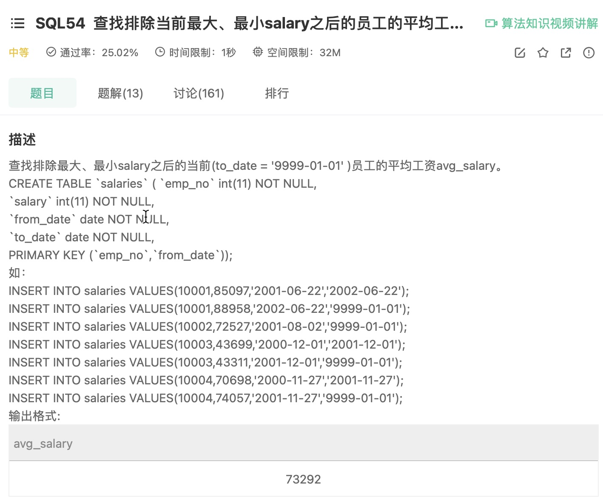


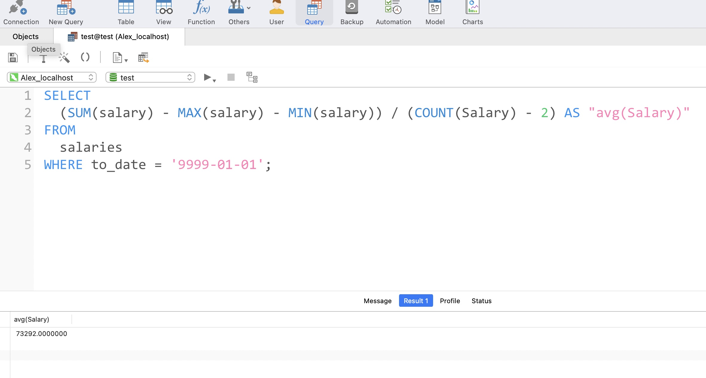


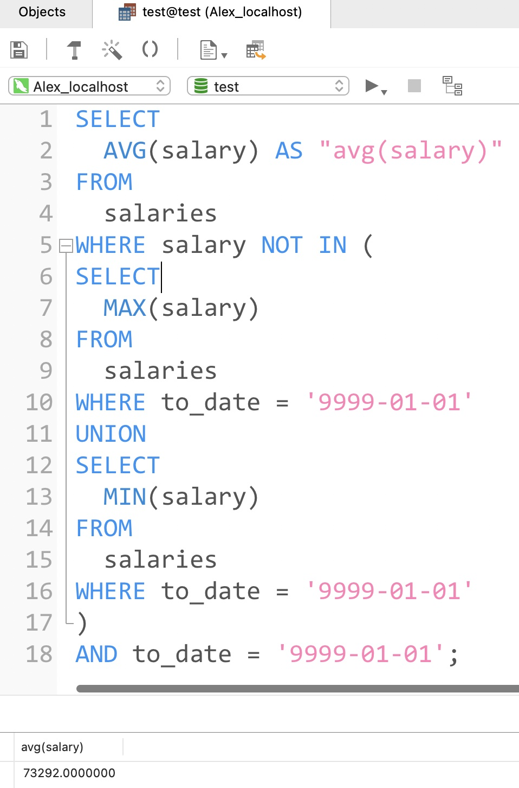


题意:

给你一张工资表，请查询出除去最高和最低工资后，当前工资的平均值


思路:

- 提取最高和最低工资很简单，使用聚合函数即可，再使用WHERE限定日期以确认数据为当前的工资，为了方便作为子查询条件，我们可以使用UNION将两者连接为一列，SQL如下

SQL1

```mysql
SELECT
	MAX(salary)
FROM
	salaries
 WHERE to_date = '9999-01-01'
UNION
SELECT
	MIN(salary)
FROM
	salaries
WHERE to_date = '9999-01-01'
```


- 将其作为子查询语句，再使用AVG()函数即可，SQL如下

SQL2:

```mysql
SELECT
	AVG(salary) AS "avg(salary)"
FROM
	salaries
WHERE salary IN (SQL1)
AND to_date = '9999-01-01';
```

- 这样写虽然能解决问题，但我们光是to_date限定语句就重复写了三次，不够优雅，我们换一种更好的


- 在查询中，使用SUM()函数求和，再将其减去最值后，除以有效数据的数量即可，最后再限定日期，SQL如下

```mysql
SELECT
	(SUM(salary) - MAX(salary) - MIN(salary)) / (COUNT(salary) - 2) AS "avg(salary)"
FROM
	salaries
WHERE to_date = '9999-01-01';
```

****


# Day45

## Tag: LIMIT, OFFSET


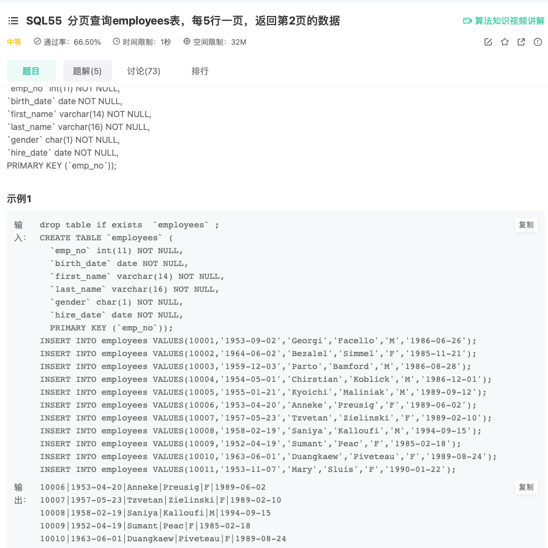


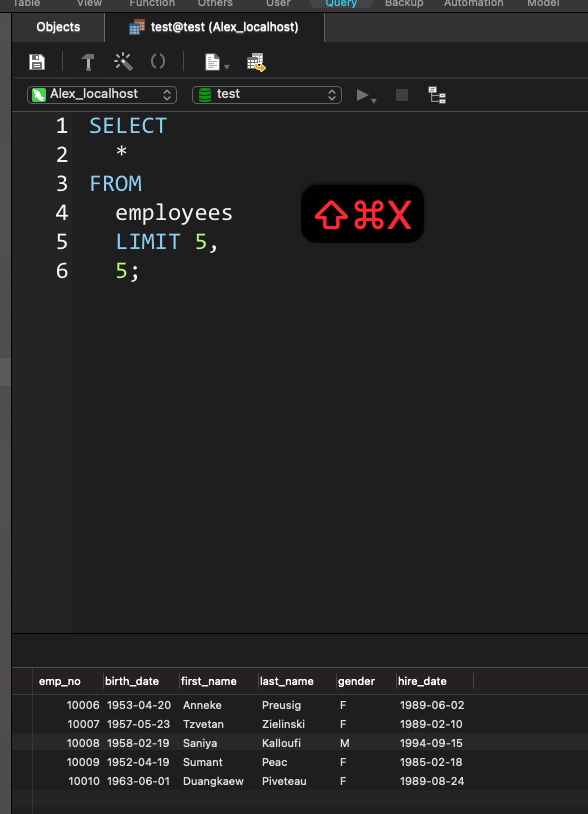


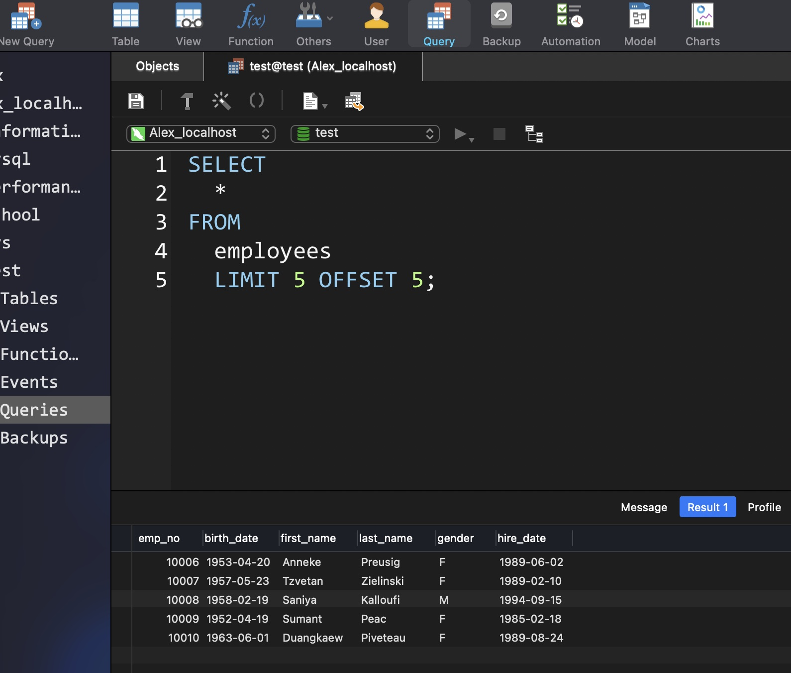


题意:

给你一张员工信息表，要求你使用分页查询且每页只有5条数据，请查出第二页的数据


思路:

- 所谓的分页查询，其实就是限制查询的数据数量，自然想到使用LIMIT进行限定，而题目要求从第二页开始，那么就是从第6条数据开始，SQL如下(这里不再解释LIMIT的语法了)

```mysql
SELECT
	*
FROM
	employees
LIMIT 5, 5;
```


拓展:

- 在《MySQL必知必会》一书第29页中，明确提到：LIMIT 5, 5这样的写法会使人混淆两个参数，所以推荐使用OFFSET代替这种写法，SQL如下

```mysql
SELECT
	*
FROM
	employees
LIMIT 5 OFFSET 5;
```

- 该写法仅限MySQL 5或更新的版本

****


# Day46

## Tag: EXISTS, Sub Query


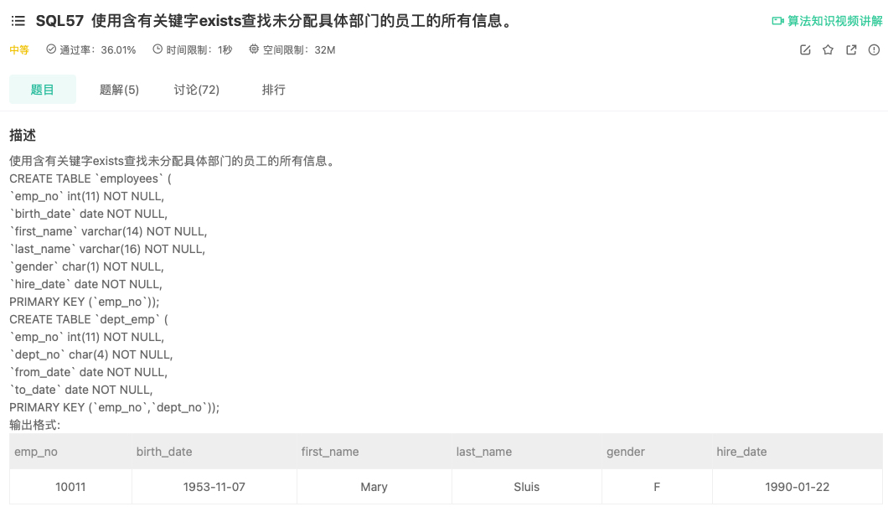


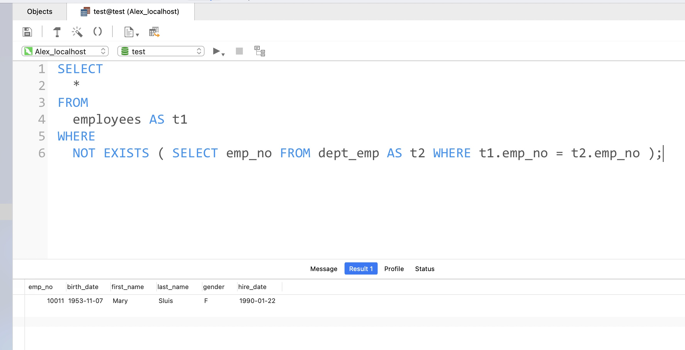


题意:

给你一张员工基础信息表和一张对应部门信息表，请你使用exists查询出其中没有分配部门的员工的信息


思路:

- 很明显，我们可以查询出已分配部门的员工的emp_no，SQL如下

SQL

```mysql
SELECT
	t2.emp_no
FROM
	dept_emp AS t1,
	employees AS t2
WHERE t2.emp_no = t1.emp_no;
```


- 再将其作为子查询语句，使用NOT EXISTS排除掉即可，这里可以做一些小改动以精简SQL，SQL如下

SQL

```mysql
SELECT
	*
FROM
	employees AS t1
WHERE NOT EXISTS (
	SELECT
  	emp_no
	FROM
	  dept_emp AS t2
	WHERE t1.emp_no = t2.emp_no
);
```


