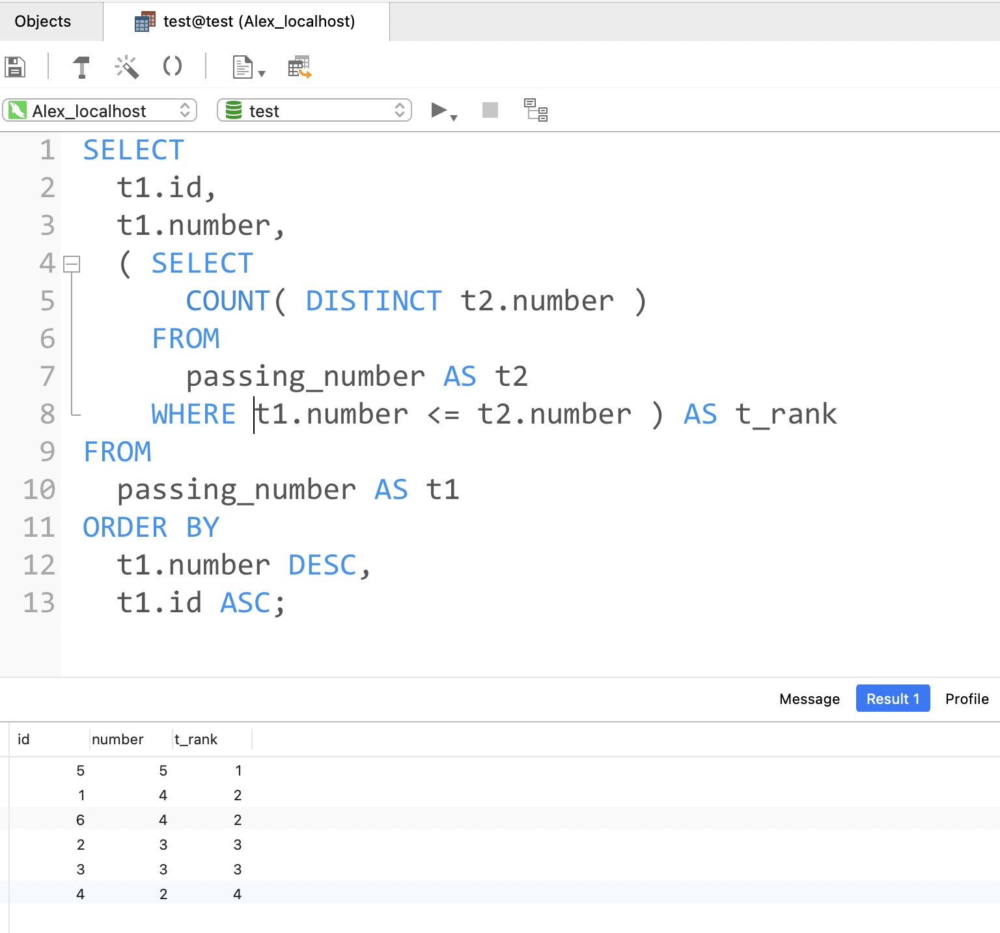

# Day31

## Tag: ORDER BY, Sub Query, LIMIT


题意:

根据给出的表，查询出工资排名第二员工的编号和工资数目


思路:

- 首先考虑获取对应的salary值，因为不是获取最大值且涉及到排序，那么很明显就应该用ORDER BY，并且指定为DESC降序，再使用LIMIT获取第二位即可，SQL如下


SQL1:

```mysql
SELECT
	salary
FROM
	salaries
ORDER BY salary LIMIT 1, 1;
```

- LIMIT 1, 1: 

参数一: 从索引为1的位置开始

参数二: 一共获取1条数据


- 这里还可以使用OFFSET进行搭配:

最后一行改为: ORDER BY salary LIMIT 1 OFFSET 1(即一共取一条数据，但跳过第一条数据)


同: SQL Day11


- 最后再将其作为子查询条件即可，SQL如下

SQL2

```mysql
SELECT
	emp_no,
	salary
FROM
	salaries
WHERE salary = (SQL2);
```

- 因为子查询结果只有一条数据，所以这里可以用"="

****


# Day32

## Tag: DELETE, Sub Query


题意:

删除重复的员工号重复的数据(emp_no)，保留每个员工号中id值最小的数据


思路:

- 首先通过聚合函数查询出最小的员工id，并用GROUP BY限制在每个emp_no内，SQL如下：

SQL1

```mysql
SELECT
	MIN(id)
FROM
	titles_test
GROUP BY emp_no
```


- 之后再将其作为子查询结果，注意因为我们用到了删除操作，这里不能直接作为条件使用(不能一边用条件，一边删除条件中的数据)，我们可以在SQL1的基础上在套一层，对SQL1进行一次查询，将该结果表作为条件进行删除即可，SQL如下：


SQL2

```mysql
DELETE 
FROM
	titles_test
WHERE id NOT IN(
	SELECT * FROM (
  	SQL1
  ) AS t1
);
```

****


# Day33

## Tag: UPDATE, JOIN


题意:

将奖金表emp_bonus中的员工在工资表salaries中的salary增加10%


思路:

- 查出奖金表中的员工号，SQL如下

SQL1

```mysql
SELECT
	emp_no
FROM
	emp_bonus;
```


- 将其作为子查询条件，进行查询，注意要更新的是员工当前的薪水(to_date为'9999-01-01')，SQL如下

SQL2

```mysql
UPDATE salaries
SET salary = salary * 0.1 + salary
	WHERE emp_no IN (SQL1)
	AND to_date = '9999-01-01'
```

****


# Day34

## Tag: DATEDIFF, ORDER BY


题意:

查询出2025-10-15之后已完成的C++, Java, 和Python订单信息，并将结果以id进行升序排列


思路:

- 常规的写出条件语句，每个条件用AND并列即可，其中prodect_name可用使用IN，SQL如下

```mysql
SELECT
	*
FROM 
	order_info 
WHERE date > '2025-10-15'
	AND status = "completed"
	AND product_name IN ("C++", "Java", "Python") 
ORDER BY 
	id;
```


- 也可以将date条件用DATEOFF()函数替代，SQL如下

```mysql
SELECT
	* 
FROM
	order_info 
WHERE
	DATEDIFF(date,'2025-10-15') > 0 
	AND STATUS = "completed" 
	AND product_name IN ( "C++", "Java", "Python" ) 
ORDER BY
	id;
```

****


# Day35

## Tag: HAVING, GROUP BY


题意:

查询出现次数>=3次的积分


思路:

计算次数就需要用到COUNT()函数，由于需要按积分进行划分，所以需要先使用GROUP BY，再使用HAVING对分组结果进行进一步查询，SQL如下

SQL

```mysql
SELECT
	number
FROM
	grade
GROUP BY
	number
HAVING
	COUNT (number) >= 3;
```

****


# Day36

## Tag: ASCII, Swap, UPDATE


题意:

将表中的性别字段值全部反转


思路:

- 获取字符'f'和'm'的ASCII码值之和，再减去每条数据的sex值，则会取得其反转，SQL如下

```mysql
UPDATE
	salary
SET sex = CHAR (
ASCII('f') + ASCII('m') - ASCII(sex);
```

****


# Day37

## Tag: Sub Query, GROUP BY, IN


题意:

给你一张员工信息表，和一张部门id表，要求你查询出各个部门中，工资最高员工的所属部门，姓名和工资金额数


思路:

- 首先，必然是查询最大的Salary值，并通过部门进行分组，SQL如下

SQL1:

```mysql
SELECT
	MAX(Salary) AS "max",
	DepartmentId
FROM
	Employee
GROUP BY DepartmentId;
```


- 鉴于部门中拥有相同工资数的人会有多个，所以我们通过上面的查询结果，对部门进行匹配，并将员工表中的部门id替换为具体的部门名称，SQL如下

SQL2:

```mysql
SELECT
	depa.Name AS "Department",
	emp.Name AS "Employee",
	emp.Salary
FROM
	Department AS depa
	
# 使用内连接，将部门id替换为具体的部门名称
INNER JOIN Employee AS emp ON emp.DepartmentId = depa.Id

# 匹配上述查询的条件，避免将数据归位不同的部门(在本部门不是最高，但在其他部门是最高)
# 注意查询条件的顺序，需要和子查询结果的相关字段顺序相同
WHERE (emp.Salary, emp.DepartmentId) IN (
SQL2
);
```

****


#  Day38

## Tag: DELETE JOIN


题意:

有一个Person表，其中部分邮箱是重复的，请你删除表中重复的数据


思路:

- 明确一点，每条数据的id都不同，所以我们只需要找出需要删除数据的id即可
- 由于只有一张表，我们需要将这张表进行自连接，通过限定Email字段找到重复数据，再通过比较Id，将Id较大的删除即可，SQL如下:

```mysql
DELETE
	t1
FROM
	Person AS t1,
INNER JOIN Person AS t2 ON t1.Email = t2.Email
AND t1.Id > t2.Id;
```

****


# Day39

## Tag: ROUND, ORDER BY, GROUP BY


题意:

给你一张成绩表，请查询出每个考试的平均值且保留三位小数，并按倒序排列


思路:

- 查询平均值，那么就需要AVG()函数，保留三位小数就需要使用ROUND()函数，并指定为3
- 由于需要按照不同的科目分类，所以需要使用GROUP BY，最后再使用ORDER BY排序并指定DESC倒序即可

****


# Day40

## Tag: SUM, GROUP BY, ORDER BY, DATE


题意:

给你一张简历表，请查询出各个岗位在2025年内投递的简历总数，并按照总数倒序排列


思路:

- 既然要计算总数，那么就会用到SUM()函数(注意不能使用COUNT()，其只能用来计算数据的条数)，按照岗位分就意味着使用GROUP BY，最后需要倒序排序，那么就使用ORDER BY再指定DESC即可
- 对于日期，就简单的使用WHERE指定范围即可，SQL如下

SQL

```mysql
SELECT
	job,
	SUM(num) AS "cnt"
FROM
	resume_info
WHERE date >= '2025-01-01'
AND date <= '2025-12-31'
GROUP BY
	job
ORDER BY
	cnt DESC;
```

****


# Day41

## Tag: GROUP_CONCAT


题意:

给你一张部门职员表，请你查询出每个部门对应的所有职员，每个职员用","分隔


思路:

- 按照部门分类，自然想到用GROUP BY
- 要求用","分隔，难道用CONCAT()?
- 其实直接使用GROUP_CONCAT()即可，SQL如下:

```mysql
SELECT
	dept_no,
	GROUP_CONCAT(emp_no) AS "employee"
FROM
	dept_emp
GROUP BY dept_no;
```

****


# Day42

## Tag: Sub Query, AVG, GROUP BY


题意:

给你一张成绩表，请查询出每个科目中大于该科目平均值的所有数据


思路:

- 首先需要获取每个科目的平均值，求平均值自然想到使用AVG()函数，而按照科目划分自然想到GROUP BY，SQL如下

SQL1

```mysql
SELECT
	job,
	AVG(score) AS "avg"
FROM
	grade
GROUP BY job;
```


- 之后再将源表与其进行连接查询，限定job和score字段条件即可，最后再使用ORDER BY排序(默认为升序，可以用ASC标明)，SQL如下

SQL2

```mysql
SELECT
	t1.*
FROM
	grade
INNER JOIN (SQL2) AS t2 ON t1.job = t2.job
AND t1.score > t2.avg
ORDER BY id ASC;
```

****


# Day43

## Tag: RIGHT(String Func)


题意:

给你一张职员信息表，请你查询出其中的"first_name"，并按照该字段的最后两个字符进行排序


思路:

- 前半部分很容易就能实现，SQL如下

```mysql
SELECT
	first_name
FROM
	employees;
```


- 那么剩下的排序要求呢？
- 我们知道排序需要使用ORDER BY，但这里进行排序的对象不是一个直接的字段，而是对一个字段处理后的结果
- 在这道题目中，我们需要截取字符串的后两个字符
- 这里需要使用一个新的函数"RIGHT()"，我们可以使用它从字符串字段的右边开始截取任意长度的字符
- 该函数的格式如下:

```mysql
RIGHT(column_name, length);
```


- 所以我们的排序条件应该写为:

```mysql
ORDER BY RIGHT(first_name, 2);
```


- 所以我们的SQL语句应该写为:

```mysql
SELECT
	first_name
FROM
	employees
ORDER BY RIGHT(first_name, 2);
```

****


# Day44

## Tag: Manual Count, Func


题意:

给你一张工资表，请查询出除去最高和最低工资后，当前工资的平均值


思路:

- 提取最高和最低工资很简单，使用聚合函数即可，再使用WHERE限定日期以确认数据为当前的工资，为了方便作为子查询条件，我们可以使用UNION将两者连接为一列，SQL如下

SQL1

```mysql
SELECT
	MAX(salary)
FROM
	salaries
 WHERE to_date = '9999-01-01'
UNION
SELECT
	MIN(salary)
FROM
	salaries
WHERE to_date = '9999-01-01'
```


- 将其作为子查询语句，再使用AVG()函数即可，SQL如下

SQL2:

```mysql
SELECT
	AVG(salary) AS "avg(salary)"
FROM
	salaries
WHERE salary IN (SQL1)
AND to_date = '9999-01-01';
```

- 这样写虽然能解决问题，但我们光是to_date限定语句就重复写了三次，不够优雅，我们换一种更好的


- 在查询中，使用SUM()函数求和，再将其减去最值后，除以有效数据的数量即可，最后再限定日期，SQL如下

```mysql
SELECT
	(SUM(salary) - MAX(salary) - MIN(salary)) / (COUNT(salary) - 2) AS "avg(salary)"
FROM
	salaries
WHERE to_date = '9999-01-01';
```

****


# Day45

## Tag: LIMIT, OFFSET


题意:

给你一张员工信息表，要求你使用分页查询且每页只有5条数据，请查出第二页的数据


思路:

- 所谓的分页查询，其实就是限制查询的数据数量，自然想到使用LIMIT进行限定，而题目要求从第二页开始，那么就是从第6条数据开始，SQL如下(这里不再解释LIMIT的语法了)

```mysql
SELECT
	*
FROM
	employees
LIMIT 5, 5;
```


拓展:

- 在《MySQL必知必会》一书第29页中，明确提到：LIMIT 5, 5这样的写法会使人混淆两个参数，所以推荐使用OFFSET代替这种写法，SQL如下

```mysql
SELECT
	*
FROM
	employees
LIMIT 5 OFFSET 5;
```

- 该写法仅限MySQL 5或更新的版本

****


# Day46

## Tag: EXISTS, Sub Query


题意:

给你一张员工基础信息表和一张对应部门信息表，请你使用exists查询出其中没有分配部门的员工的信息


思路:

- 很明显，我们可以查询出已分配部门的员工的emp_no，SQL如下

SQL

```mysql
SELECT
	t2.emp_no
FROM
	dept_emp AS t1,
	employees AS t2
WHERE t2.emp_no = t1.emp_no;
```


- 再将其作为子查询语句，使用NOT EXISTS排除掉即可，这里可以做一些小改动以精简SQL，SQL如下

SQL

```mysql
SELECT
	*
FROM
	employees AS t1
WHERE NOT EXISTS (
	SELECT
  	emp_no
	FROM
	  dept_emp AS t2
	WHERE t1.emp_no = t2.emp_no
);
```

****


# Day47

## Tag: Multiple Field IN


题意:

给你三张表，包含的信息分别为登陆信息，用户名，客户端类型。请你根据这些数据查询出每个用户的在最后一次登录时使用的设备(客户端类型)和登录时间，并按照用户名升序排列


思路:

- 首先我们需要获取最后一次登录的记录，由于我们需要按照用户查询出数据，自然想到使用GROUP BY进行分组，而最后一次登录自然就是日期值最大，可以使用聚合函数MAX()，SQL如下

SQL1

```mysql
SELECT
	user_id,
	MAX(date) AS date
FROM
	login
GROUP BY user_id;
```


- 暂且不管上述的结果，我们再获取其他数据，题目要求我们查询出用户名和客户端，而这两个字段在没有关联字段的不同的两张表中，而与这两张表都有关联的只有login表中的user_id和client_id字段，所以我们需要将三张表连接起来，SQL如下(以下表的别名顺序并不规范，请注意)

SQL2

```mysql
SELECT
	t1.name AS u_n,
	t2.name AS c_n,
	t3.date
FROM login AS t3
INNER JOIN user AS t1 ON t3.user_id = t1.id
INNER JOIN client AS t2 ON t3.client_id = t2.id
```

- 此时我们已经获取了每个用户对应的用户名，登录的客户端，登录日期


- 最后再结果之前的日期条件进行限定，并对用户名排序即可，SQL如下

SQL3

```mysql
SQL2
WHERE (t3.user_id, t3.date) IN (
SQL1)
ORDER BY u_n;
```

****


# Day48

## Tag: CASE WHEN


题意:

给你三张表，分别保存了工资信息，员工信息，奖金情况

请你根据这三张表对所有员工的信息进行汇总，并查询出其奖金类型和奖金的金额(如果奖金类型为1、2，则奖金为当前工资 * 0.1倍的奖金类型，其余类型为30%)


思路:

- 题目给出的三张表中只有一个公共字段，即emp_no，那么我们使用WHERE字句进行查询便可获取，但问题是奖金
- 奖金是需要我们计算的，而且需要分情况，这里介绍一种新的写法
- 如题解所示，我们使用CASE WHEN THEN END 的结构可以对奖金字段进行分情况讨论，其实用法和switch语句类似，SQL如下

SQL

```mysql
SELECT
	t1.emp_no,
	t2.first_name,
	t2.last_name,
	t3.btype,
	t1.salary,
CASE

		WHEN t3.btype <= 3 THEN
		t1.salary * (0.1 * t3.btype) ELSE t1.salary * 0.3
	END bonus
FROM
	salaries AS t1,
	employees AS t2,
	emp_bonus AS t3
WHERE t1.emp_no = t2.emp_no
AND t1.emp_no = t3.emp_no
AND t1.to_date = '9999-01-01';

```

****


# Day49

## Tag: COUNT, DISTINCT





题意:

给你一张答题通过数目表，请你将其中的数据以答题数为准进行排序，并给出相应的排名(分数相同时排名相同，id按照升序排列)


思路:

- 首先考虑排序，对答题数目排序很简单，直接使用ORDER BY再加上DESC即可，但分数相同时对id进行升序排列该怎么写？
- 这里其实就是排序顺序的问题，在使用ORDER BY的时候，我们可以指定多个字段作为条件，排序的基准则取决于字段的顺序，SQL如下

SQL1:

```mysql
SELECT
	id,
	number
FROM
	passing_number
ORDER BY number DESC, id ASC;
```

- 具体解释可以参照《MySQL必知必会》第39, 40页的内容

## 


- 最后就是排名了，计算排名其实有套路:
- 对所有大于等于该成绩的数据进行计数，然后去重(题目要求可以重复排名)，此时的数据就是排名，SQL如下

SQL2:

```mysql
SELECT
	COUNT(DISTINCT t2.number)
FROM
	passing_number AS t2
WHERE t1.number <= t2.number;
```


- 综合后结果如下:

```mysql
SELECT
	t1.id,
	t1.number
	SQL2
FROM
	passing_number AS t1
ORDER BY t1.number DESC, t1.id ASC;
```

****


# Day50

## Tag: Sub Query In WHERE


题意:

给你一张雇员信息表，请你筛选出所有按照名字升序排列后，次序为奇数的名字


思路:

- 很凑巧，昨天的题目就是排序题，不过今天这道题不需要考虑重复，所以我们还是老套路
- 先将我们所需的信息查找出来，按照昨天的思路，将该表查询两次，计算大于等于first_name字段的数据量即为该名字的排名(按照字母次序)，SQL如下

SQL1

```mysql
SELECT
	COUNT(t1.first_name)
FROM
	employees t2
WHERE t1.first_name >= t2.first_name;
```


- 最后将其作为WHERE子句的查询字段，判断奇偶即可

```mysql
SELECT
	t1.first_name
FROm
	employee AS t1
WHERE (SQL1) % 2 != 0;
```

****


# Day51

## Tag: HAVING, GROUP BY, COUNT


题意:

给你一张订单信息，请查出在2025-10-15及之后的，产品为Java或C++或Python且订单完成数大于等于2的所以用户的id，并按照升序的方式排序


思路:

- 题目要求的一堆条件都可以用WHERE子句再结合AND来实现，但问题是获取完成的订单数大于2
- 计数明显会用到COUNT()，因为要求为查找对应的用户id，所以为使用到GROUP BY，指定分组字段为user_id
- 但如果按照常规的方式查询，我们会得到含有两个字段的数据，想获得结果还得再套一个SELECT，明显不够优雅
- 这里我们可以使用HAVING，并将COUNT()作为HAVING的限定条件，这样就可以保证一次SELECT解决问题了
- 最后再加上ORDER BY排序即可，SQL如下

```mysql
SELECT
	user_id
FROM
	order_info
WHERE date >= '2025-10-15'
AND product_name IN ('Java', 'Python', 'C++')
AND status = 'completed'
GROUP BY user_id HAVING (COUNT(status)) >= 2
ORDER BY user_id ASC;
```

****


# Day52

## Tag: HAVING, Sub Query, GROUP BY,  COUNT


题意:

同昨天的题目一样，给你一张订单表，请你查出对应的数据，不过昨天是查询对应的用户id，今天需要你查询出所有符合条件的数据(user_id可重复)


思路:

- 由于我们需要的是所有的数据，所以不能再使用像昨天一样GROUP BY分组查询的方式，我们只能将每个条件都一一对应
- 按照题目的要求，我们需要对数据进行限定，其中只有user_id是进行比较复杂的筛选的
- 很凑巧的是，昨天的题目就是查询对应的user_id，所以我们可以直接将昨天的语句作为子查询条件，对uer_id进行限定即可，昨天的SQL如下

SQL1

```mysql
SELECT
	user_id
FROM
	order_info
WHERE date >= '2025-10-15'
AND product_name IN ('Java', 'Python', 'C++')
AND status = 'completed'
GROUP BY user_id HAVING (COUNT(status)) >= 2
ORDER BY user_id ASC;
```


- 将其作为子查询条件，对user_id进行限定，其他字段条件使用AND连接即可，注意我们只需要将ORDER BY写一次即可，SQL如下

SQL2:

```mysql
SELECT
    *
FROM
    order_info
WHERE user_id IN (
SQL2
)
AND date >= '2025-10-15'
AND product_name IN ('Java', 'C++', 'Python')
AND status = 'completed'
ORDER BY id ASC;
```

****


# Day53

## Tag: COUNT, HAVING, GROUP BY


题意:

给你一张订单信息表，请你查询出满足下列条件的用户id、满足该条件的第一条订单的时间、完成的订单总数，最后按照用户id升序排列

条件：日期在2025-10-15之后，状态为已完成，产品为java或C++或Python，总订单数大于等于2


思路:

- 参照SQL Day51的做法，我们只需要添加两个字段即可
- 要求中的第一条订单的时间其实就是去最小的日期值，使用MIN()即可，而订单数在我们之前查询user_id的时候就出现在的HAVING的限定字段里，所以只需要提前即可，SQL如下

```mysql
SELECT 
    user_id,
    MIN(date) AS 'first_buy_date',
    COUNT(status) AS 'cnt'
FROM
    order_info
WHERE date >= '2025-10-15'
AND status = 'completed'
AND product_name IN ('C++', 'Java', 'Python') 
GROUP BY user_id HAVING cnt >= 2
ORDER BY user_id;
```

****


# Day54

## Tag: WITH...AS


题意:

基于昨天的题目，请你再多查出用户第二次购买的时间


思路:

- 第二次购买时间也就是第二最小值，我们可以通过排序并结合LIMIT的方式获取第二位
- 为了防止重复，这里引入新的写法: WITH...AS，通过这种方式，我们可以将重复的条件查询出来备用，SQL如下

SQL1:

```mysql
WITH temp AS (
SELECT
	*
FROM
	order_info
WHERE date >= '2025-10-15'
AND status = 'completed'
AND product_name IN ('Java', 'Python', 'C++')
)
```

- 我的MySQL版本并不支持这种写法(MySQL 5.7,10)，但牛客的测试环境可以(MySQL8.0)


- 之后，我们再从这张临时表中获取我们想要的字段即可，SQL如下

SQL:

```mysql
SQL1

SELECT
	user_id,
	MIN(date) AS 'first_buy_date',
	(
	SELECT
		date
	FROM 
		temp
	WHERE t1.user_id = user_id
	ORDER BY date
	LIMIT 1 OFFSET 1) AS 'second_buy_date',
	COUNT(status) AS 'cnt'
FROM
	temp AS t1
GROUP BY user_id HAVING (COUNT(status)) >= 2
ORDER BY user_id ASC;
```

****


# Day55

## Tag: LEFT JOIN, Sub Query


题意:

给你两张表，一张订单信息表，一张客户端表，请你查询出符合条件的订单id，拼单情况，以及对应的客户端


思路:

- 题目要求如果是拼单，则客户端显示为null，而订单表中的is_group_buy字段为yes的数据对应的client_id为0，正好不在client表中，所以我们可以使用LEFT JOIN的方式来处理客户端字段
- 这里比较麻烦的是id，因为对id的限制条件是基于之前题目中的user_id字段的，所以我们需要先查询出user_id，SQL如下

SQL1:

```mysql
SELECT
	user_id
FROM
	order_info
WHERE date >= '2025-10-15'
AND prodect_name IN ('Java', 'C++', 'Python')
AND status = 'completed'
GROUP BY user_id HAVING COUNT(status) >= 2;
```


- 之后再通过它对user_id进行限制，查询出对应的id，SQL如下

SQL2:

```mysql
SELECT
	*
FROM
	order_info
WHERE user_id IN (
  SQL1
)
AND prodect_name IN ('Java', 'C++', 'Python')
AND status = 'completed'
AND date >= '2025-10-15'
```


- 到了这一步就有两种做法了，第一种，我们可以使用WITH AS将其作为临时表，再与client表进行左连接即可，SQL如下


SQL:

```mysql
WITH temp AS (
SQL2
)

SELECT
	t1.id,
	t1.is_group_buy,
	t2.name AS 'client_name'
FROM
	temp AS t1
LEFT JOIN client AS t2 ON t1.client_id = t2.id;
ORDER BY id ASC;
```


- 第二种，我们也可以将其直接作为一张表进行查询，SQL如下

SQL:

```mysql
SELECT
	t1.id,
	t1.is_group_buy,
	t2.name AS 'client_name'
FROM
	SQL2 AS t1
LEFT JOIN client AS t2 ON t1.client_id = t2.id;
ORDER BY id ASC;
```

