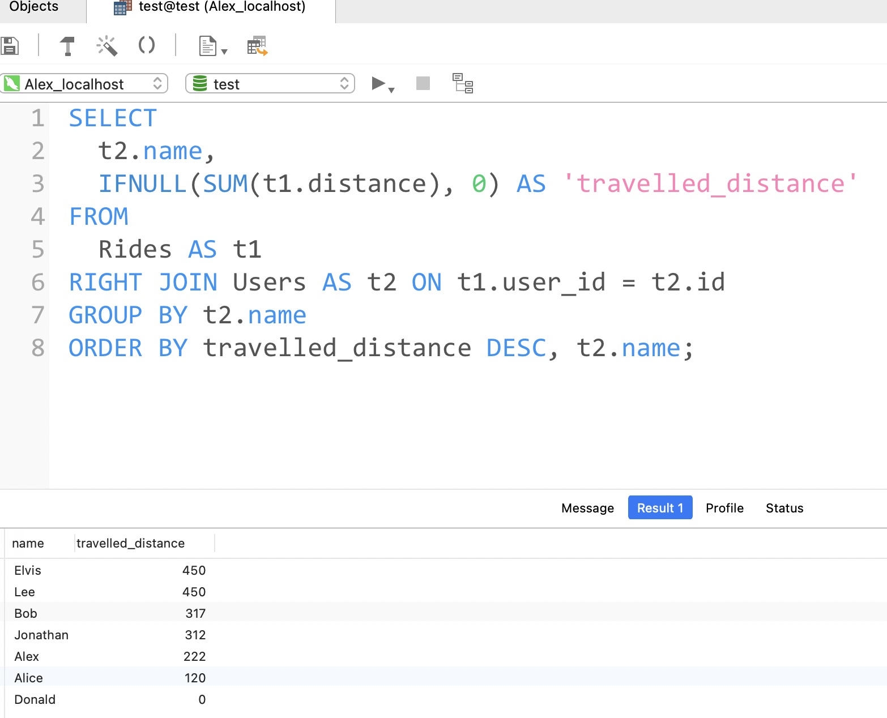
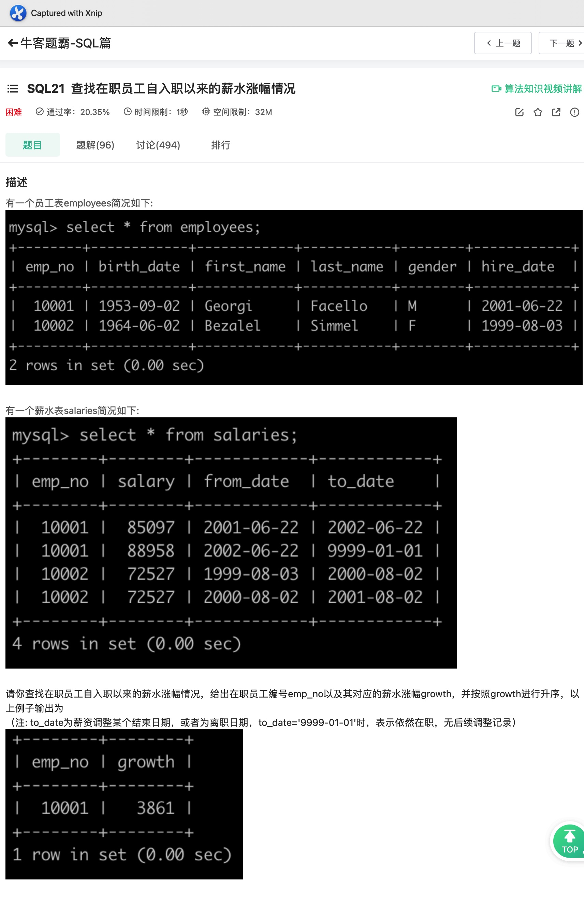

# Day61

## Tag: DENSE_RANK(), ORDER BY


题意:

给你一张员工信息表和一张部门表，请你查询出每个部门中薪资排名前三的员工信息和对应的部门(包含相同排名)


思路1:

- 既然要按照部门分类还要考虑排名，我们可以使用窗口函数DENSE_RANK()，在其中指定DepartmentId为PARTITION BY字段即可实现按照部门分组，再指定ORDER BY字段为Salary即可进行排名，最后再取上别名来记录排名并对应其他的数据，SQL如下:

SQL1:

```mysql
SELECT
	DENSE_RANK() OVER (
PARTITION BY DepartmentId
ORDER BY Salary DESC
	) AS 'ranking', DepartmentId, Name, Salary
FROM
	Employee
```


- 之后我们只需要取出该结果中ranking字段小于等于3的数据，并将DepartmentId字段与部门表进行连接对应即可，SQL如下

SQL2:

```mysql
SELECT
	t2.Name AS 'Department',
	t1.Name AS 'Employee',
	t1.Salary
FROM
	(
   SQL1
  ) AS t1
INNER JOIN Department AS t2 ON t1.DepartmentId = t2.Id
WHERE t1.ranking <= 3;
```


思路2:

- 当然也可以不使用窗口函数，将员工表自连接，并对重复的数据去重后，计算大于每个数据本身的数据个数即为其排名
- 最后判断排名小于3即可，SQL如下:

```mysql
SELECT
	t2.Name AS 'Department',
	t1.Name AS 'Employee',
	t1.Salary
FROM
	Employee AS t1
INNER JOIN Department AS t2 ON t1.DepartmentId = t2.Id
WHERE 3 > (
	SELECT
  	COUNT(DISTINCT t3.Salary)
 	FROM
  	Employee AS t3
 	WHERE t3.Salary > t1.Salary
  AND t1.DepartmentId = t3.DepartmentId
);
```

****


# Day62

## Tag: CASE, MOD, COUNT


题意:

给你一张座位表，请你查询出将相邻两个位置的人员进行交换后的结果(如果总人数为奇数，则不改变最后一个人员)


思路:

- 题意虽然是改变位置上的人员，但我们反过来想：改变每个人对应的id不就行了吗？
- 如果总人数为偶数，那么只需要将原来id为奇数的加一即可，原来为偶数的减一即可
- 如果总人数为奇数，那么我们只需要对最后一位进行判定就行了
- 总人数的计算可以使用COUNT()，查询后作为一个单独的数据进行判断就是了，SQL如下:

SQL1

```mysql
SELECT
		COUNT(id) AS 'counts'
	FROM
		seat
```


- 之后再根据其中的计数结果分情况讨论就是了，SQL如下

SQL:

```mysql
SELECT
	(CASE 
	WHEN id % 2 != 0 AND counts = id THEN
		id
	WHEN id % 2 != 0 AND counts != id THEN
	  id + 1
	ELSE
		id - 1
END) AS id,
	student
FROM
	seat,
	(
	SQL1
	) AS t1
ORDER BY id;
```

****


# Day1

2021-07-24

## Tag: SUM() OVER


题意:

给你一张成绩统计表，其中统计了各个等级的总人数，请你根据这张表查询出每个等级的学生最差的排名


例子:

A | 3

B | 2

结果:

A | 3

B | 5

(等级为A的人排名至少为3，而等级为B的人排名至少为5)


思路:

- 这道题其实就是简单的排序累加，很巧的是，在SQL Day59中我们通过SUM() OVER这个窗口函数实现了这样的操作，所以我们将排序字段换一下就能解决这个问题，SQL如下:

```mysql
SELECT
	grade,
	SUM(number) OVER(
  ORDER BY grade
  ) AS 't_rank'
FROM
	class_grade;
```

****


# Day2

## Tag: SUM() OVER, SUM


题意:

给你一张等级表，请你找出所有排名为中位数的等级


思路:

- 中位数要么有一个，要么有两个，所以为了将两个都取到，我们需要从倒序和顺序两个方向取中位数
- 为了比较，我们需要从倒序和顺序两个方向获取各个等级的排名，这里就需要使用昨天的写法了，SQL如下:

SQL1:

```mysql
SELECT
		grade,
		(SELECT
			SUM(number)
		FROM
			class_grade
		) AS 'total',
		SUM(number) OVER (
		ORDER BY grade
		) AS 'a',
		SUM(number) OVER (
		ORDER BY grade DESC
		) AS 'd'
	FROM class_grade
```


- 之后我们将等级限定在这个范围内，并制定排名要大于等于总数的一半，SQL如下:

SQL:

```mysql
SELECT
	grade
FROM (
	SQL1) AS t1
WHERE a >= total / 2 AND d >= total / 2
ORDER BY grade;
	
```

****


# Day3

## Tag: SUM(), LIMIT, INNER JOIN


题意:

给你一张积分表，其中记录了每个用户id的加分情况；再给你一张用户表，其中记录了用户ID与用户名的对应关系

请你查出总分最高的用户名和对应的分数


思路:

- 由于我们要查询的是积分最高的用户，所以我们需要将每个用户的积分加起来比较每个用户的积分情况
- 所以需要使用SUM()来累加各个用户的积分，再使用GROUP BY来划分出各个用户即可
- 之后再将积分表和用户表连接起来就能将id变为用户名了
- 鉴于给出的表有可能是乱序的，所以我们需要按照积分总和进行倒序排列
- 之后再使用LIMTI取出一条数据即可，SQL如下

```mysql
SELECT 
    t2.name,
    SUM(t1.grade_num) AS 'grade_sum'
FROM
    grade_info AS t1
INNER JOIN user AS t2 ON t1.user_id = t2.id
GROUP BY t2.name
ORDER BY grade_sum DESC
LIMIT 1;
```

****


# Day4

## Tag: DENSE_RANK(), ORDER BY


题意:

给你一张分数表和一张id对应的语言表，请你找出其中每个语言得分前二名的id，语言和分数信息


思路:

- 首先我们需要获取每条数据的排名，且需要按照语言分类排序，这里可以想到使用DENSE_RANK()，在OVER()中指定PARTITION字段为language_id即可实现按照语言分组，再指定ORDER BY字段为score且为降序DESC即可，SQL如下:

SQL1:

```mysql
SELECT
	id,
	language_id,
	score,
	DENSE_RANK() OVER(
	PARTITION BY language_id
	ORDER BY score DESC
	) AS 'rank'
FROM
	grade;
```


- 之后我们再用language表连接这张临时表，将language_id转换为name，并限定排名字段rank小于等于2即可
- 在最后还需要满足题目要求的排序，只需要我们按照顺序写好就行了，SQL如下:

```mysql
SELECT
	t2.id,
	t1.name,
	t2.score
FROM
	`language` AS t1
INNER JOIN
(
SQL1
	) AS t2 ON t2.language_id = t1.id
WHERE t2.rank <= 2
ORDER BY t1.name ASC, t2.score DESC, t2.id ASC;
```

****


# Day5

## Tag: FLOOR(), COUNT(), GROUP BY


题意:

给你一张成绩表，请你找出每个科目中的中位数所在的排名


思路:

- 首先中位数有两种情况: 如果总人数为偶数，那么中位数就有两个，相应的排名就有两个，为奇数则只有一个
- 可以确定的是，如果将总数+1后再除以二的整数部分和+2后再除以二的整数部分一定都是中位数，所以我们需要使用COUNT()来计算总数，再使用FLOOR()来向下取整，SQL如下

```mysql
SELECT 
	job,
  FLOOR((COUNT(*) + 1) / 2) AS 'start',
  FLOOR((COUNT(*) + 2) / 2) AS 'end'
FROM
	grade
GROUP BY job ORDER BY job;
```

****


# Day6

## Tag: WHERE


题意:

给你一张员工表employees，一张部门员工关系表dept_emp，一张部门经理关系表dept_manager，一张工资表salaries

请你查询出其中所有非经理员工的所属单位，员工号和工资


思路:

- 首先，员工号和部门号的对应关系在dept_emp中，而经理的信息在dept_manager中，所有员工的部门号和员工号在dept_emp中
- 所以我们用不到employees表，有用的只有三张表而已
- 要排除经理，就需要指定员工号不等于经理表中的员工号，且要将经理与其部门对应，其需要指定经理表和员工表中的部门号相同
- 为了保证工资对应，还必须指定工资表中的员工号与部门员工关系表中的员工号对应，所以一共有3个WHERE条件子句，SQL如下

```mysql
SELECT 
    t1.dept_no,
    t1.emp_no,
    t3.salary
FROM
    dept_emp AS t1,
    dept_manager AS t2,
    salaries AS t3
WHERE t1.emp_no != t2.emp_no 
AND t3.emp_no = t1.emp_no;
```

****


# Day7

## Tag: DISTINCT, GROUP BY


题意:

给你一张登陆记录表，请你通过该表计算出用户的留存率，结果保留3位小数，用户留存率为注册第二天还登录的用户数/注册使用的总用户数


思路:

- 首先查找注册的总用户数是最简单的，对user_id去重，再使用COUNT()计算即可，SQL如下

SQL1

```mysql
SELECT
	COUNT(DISTINCT user_id) AS 'sum'
FROM
	login;
```


- 而用户第二天登录则是相对于每个用户而言的，所以需要使用GROUY BY分组
- 注册的第二天则为最小的时间值加一，可以使用DATE_ADD()，SQL如下

SQL2

```mysql
SELECT
	user_id,
	DATE_ADD(MIN(date), INTERVAL 1 DAY) AS 'second'
FROM
		login
GROUP BY user_id
```


- 最后只需要限定user_id和date的组合，即可通过COUNT()计算第二天还登录的用户数量了
- 而保留三位小数则可以使用ROUND()函数，在第二参数的位置指定保留的数位即可，SQL如下:

```mysql
SELECT
	ROUND(COUNT(user_id) / SQL1, 3) AS 'p'
FROM
	login
WHERE (user_id, date) IN
(	
	SQL2
	);
```

****


# Day8

## Tag: DENSE_RANK(), GROUP BY, ORDER BY


题意:

给你一张用户信息表和一张积分表，请你查出其中积分最高的用户信息和其对应的积分(相同分数也要查询出来)


思路:

- 由于需要获取最高的积分，所以我们需要先将积分按照用户分类相加，并将其作为临时表备用，SQL如下:

SQL1:

```mysql
WITH temp AS (SELECT
	t1.id,
	t1.name,
	SUM(t2.grade_num) AS 'sum'
FROM
	user AS t1
INNER JOIN grade_info AS t2 ON t1.id = t2.user_id
GROUP BY t1.id)
```


- 最后再通过MAX来获取最高分，之后用最高分来匹配用户即可，SQL如下

```mysql
SQL1

SELECT
	temp.id,
	temp.name,
	temp.sum AS 'grade_num'
FROM
	temp
WHERE temp.sum IN (
	SELECT
		MAX(temp.sum)
	FROM
		temp
	)
ORDER BY temp.id;
```


- 当然也可以用DENSE RANK()来获取每个id对应的排名，最后匹配所有排名为1的即可

****


# Day9

## Tag: CASE WHEN, LEFT, MOD


题意:

给你一张员工表，其中有员工的id、姓名和工资信息，请你查询出每个员工的id和奖金，其中奖金要求如下:

如果该员工的id为奇数，且他的名字不是"M"开头的，那么输出的奖金为原来的工资，否则为0


思路:

- 该题目的重点就在实现两个条件: id为奇数和名字的开头
- 首先通过条件来限定字段就需要使用CASE WHEN THEN ELSE END这样的语法
- 判断id为奇数则使用%取余后判断其是否等于1即可，或者使用更直观的MOD()函数
- 判断名字开头，我们可以使用LEFT()函数取出第一个字符，或者使用SUBSTRING()也是一样的，SQL如下

```mysql
SELECT
	employee_id,
CASE
		
		WHEN MOD ( employee_id, 2 ) = 1 
		AND LEFT ( NAME, 1 ) != 'M' THEN
			salary ELSE 0 
			END AS 'bonus' 
FROM
	Employees;
```

****


# Day10

## Tag: LEFT JOIN, WHERE, IS NULL


题意:

给你一张员工信息表和一张奖金表，请你查询出其中所有奖金小于1000的员工的姓名与奖金(包含无奖金的员工)


思路:

- 由于Bonus表中没有所有员工的信息，所以没有奖金的员工需要输出NULL，也就是以员工为准，所以想到使用LEFT JOIN
- 最后再筛选Bonus小于1000以及为NULL即可，SQL如下

```mysql
SELECT 
    t1.name,
    t2.bonus
FROM
    Employee AS t1
LEFT JOIN Bonus AS t2 ON t1.empId = t2.empId 
WHERE t2.bonus < 1000 OR t2.bonus IS NULL;
```

****


# Day11

## Tag: ABS, DISTINCT


题意:

给你一个影院座位状态表，请你查询出其中所有连续的空座位(连续2个及以上)


思路:

- 首先，判断空座位即判断free字段是否为1即可
- 对于判断连座，则需要判断seat_id是否相差为1，这里要么多1要么少1，所以使用ABS计算差值的绝对值为1即可
- 既然要相减，自然需要将这张表查询两次，而连接后会出现笛卡尔积，所以需要对结果进行去重处理，SQL如下

```mysql
SELECT
	DISTINCT t1.seat_id
FROM
	cinema AS t1,
	cinema AS t2
WHERE t1.free = 1
AND t2.free = 1
AND ABS(t1.seat_id - t2.seat_id) = 1
ORDER BY t1.seat_id;
```

****


# Day12

## Tag: Sub Query, HAVING, GROUP BY


题意:

给你一张产品表和一张销售表，请你查询出销售业绩最好的员工的id(销售额相同的也要显示)


思路:

- 首先，在销售表中有每一单的销售总额，所以不需要我们手动计算每单的price了，直接通过SUM再分组即可求出每个销售员的总业绩，SQL如下:

SQL1:

```mysql
SELECT
	SUM(price) AS 'sum'
FROM
	Sales
GROUP BY seller_id;
```


- 之后，我们只需要在这张表中查找最大值即可，SQL如下:

SQL2:

```mysql
SELECT
		MAX(sum) AS 'max'
	FROM
	(
		SQL1
	) AS t2
```


- 最后使用该最大值进行匹配即可，由于我匹配的是原表中不存在的字段，所以需要先分组计算后，再筛选，这里就不能使用WHERE而是要用HAVING了，SQL如下：

```mysql
SELECT
	seller_id
FROM
	Sales
GROUP BY seller_id
HAVING SUM(price) = (
	SQL2
);
```

****


# Day13

## Tag: IFNULL, RIGHT JOIN, GROUP BY




题意:

给你一张用户表，一张骑行记录表，请你返回所有用户骑行的记录排行表，如果成绩相同则按照名字的字母顺序升序排列，没有成绩的用户记为0


思路:

- 按照用户计算累计的骑行距离很明显需要使用SUM和GROUP BY
- 排序更是不必多说，不管排序要求有多少，处理好排序字段的顺序即可
- 有点问题的是没有成绩的用户记0，在两表连接中，如果要以其中一张表为准则需要使用LEFT/RIGHT JOIN，但这样查找出来的数据为null，怎么将NULL转换为0呢？这里使用IFNULL(expr1, expr2)即可，SQL如下

```mysql
SELECT
	t2.name,
	IFNULL(SUM(t1.distance), 0) AS 'travelled_distance'
FROM
	Rides AS t1
RIGHT JOIN Users AS t2 ON t1.user_id = t2.id
GROUP BY t2.name
ORDER BY travelled_distance DESC, t2.name;
```

****


# Day14

## Tag: UNION, IS NULL


题意:

给你一张产品表，请你将其中的数据重构为商品id，商店，价格的形式


思路:

- 在要求中，商店名称在原表中是字段名，不是数据，所以需要我们手动构造
- 因为一次最多只能查询出两条数据，所以我们需要使用UNION将多个查询结果合并在一起
- 为了排除其中不存在的数据(某商店不出售)，需要在WHERE中使用IS NOT NULL来排除，SQL如下:

```mysql
SELECT 
    product_id,
    'store1' AS 'store',
    store1 AS 'price'
FROM
    Products
WHERE store1 IS NOT NULL
UNION
SELECT 
    product_id,
    'store2' AS 'store',
    store2 AS 'price'
FROM
    Products
WHERE store2 IS NOT NULL
UNION
SELECT 
    product_id,
    'store3' AS 'store',
    store3 AS 'price'
FROM
    Products
WHERE store3 IS NOT NULL
```

****


# Day15

## Tag: DISTINCT, GROUP BY, HAVING


题意:

给你一张课程表，请你查询出其中选课学生数量大于等于5的课程


思路:

- 需要明确一点的是: 统计选课的学生时一定是统计不同的学生，所以需要使用COUNT并结合DISTINCT，SQL如下:

```mysql
SELECT
	class
FROM (
SELECT
	class,
	COUNT(DISTINCT student) AS 'sum'
FROM
	courses
GROUP BY class
HAVING sum >= 5
) AS t1
```

****


# Day16

## Tag: DISTINCT, ROUND, IFNULL


题意:

给你一张表好友申请记录表和一张申请通过记录表，请你计算好友申请的通过率，且保留两位小数


思路:

- 首先在通过表中，同一个申请可能会被通过多次，所以需要去重，在申请表中，同一个好友申请也可能被发送多次，所以也需要去重
- 其次，如果表为空的话，我们需要返回的数据为0而不是null，所以需要进行判断
- 通过去重我们可以计算申请总数，SQL如下:

SQL1

```mysql
SELECT 
	COUNT(DISTINCT sender_id, send_to_id) AS 'request'
FROM 
	FriendRequest
```


- 同样还需要计算通过总数，SQL如下:

SQL2:

```mysql
SELECT
	COUNT(DISTINCT requester_id, accepter_id) AS 'accept'
FROM
	RequestAccepted
```


- 最后通过通过数除以申请数即可，为了防止表为空，我需要使用IFNULL进行讨论判断，SQL如下

```mysql
SELECT
	ROUND(IFNULL(t1.accept / t2.request, 0), 2) AS 'accept_rate'
FROM
(SQL1) AS t1,
(SQL2) AS t2;
```

****


# Day17

## Tag: IN, MIN, GROUP BY




题意:

给你一张员工表和一张工资表，请你查询出其中还在职的员工从入职以来的工资涨幅和对应的员工号


思路:

- 首先，在职员工的to_date字段数据为9999-01-01，通过WHERE子句限定即可
- 而工资涨幅就需要我们计算了，其等于最初入职时的工资 - 现在的工资
- 而最初入职自然就是to_date最早了，使用MIN再根据员工号分组即可查询出，SQL如下:

SQL1:

```mysql
SELECT
	emp_no,
	MIN(to_date) AS 'min'
FROM
	salaries
GROUP BY emp_no;
```


- 我们所需要的数据全在salaries表中，所以不需要连接employees表，进行自连接即可
- 而计算涨幅时，我们需要用to_date = '9999-01-01'的字段中对应的工资减去相同no但to_date日期最早的工资，利用之前的表即可，SQL如下:

```mysql
SELECT
	t1.emp_no,
	t1.salary - t2.salary AS 'growth'
FROM
	salaries AS t1,
	salaries AS t2
WHERE t1.to_date = '9999-01-01'
AND t1.emp_no = t2.emp_no
AND (t2.emp_no, t2.to_date) IN (
	SQL1
	)
ORDER BY growth;
```

****


# Day18

## Tag: JOIN, IN


题意:

给你一张工资表，一张部门经理表，一张部门员工表。请你查询出其中工资大于其部门经理的员工的no，其经理的no，其工资，其经理工资(共四个字段)


思路:

- 首先我们可以根据部门经理表和员工表中的dept_no字段查询出员工和其对应部门的经理，再通过经理表排除掉其中的经理，即可获取员工号和其对应的部门经理号，SQL如下:

SQL1:

```mysql
SELECT
	t1.emp_no AS 'emp_no',
	t2.emp_no AS 'manager',
FROM
	dept_emp AS t1,
	dept_manager AS t2,
WHERE t1.dept_no = t2.dept_no
AND t1.emp_no != t2.emp_no;
```


- 获取该信息后，我们可以通过其中各自的emp_no在工资表中查询出两者的工资，并限定大小关系后，即为本题答案，SQL如下:

```mysql
SELECT
	t1.emp_no AS 'emp_no',
	t2.emp_no AS 'manager',
	t3.salary AS 'emp_salary',
	t4.salary AS 'manager_salary'
FROM
	dept_emp AS t1,
	dept_manager AS t2,
	salaries AS t3,
	salaries AS t4
WHERE t1.dept_no = t2.dept_no
AND t1.emp_no != t2.emp_no
AND t3.emp_no = t1.emp_no
AND t4.emp_no = t2.emp_no
AND t3.salary - t4.salary > 0;
```

****


# Day19

## Tag: GROUP BY


题意:

给你一张部门表，一张员工信息表，一张职称表。请你查询出每个部门的no和部门名称，以及部门下所有职位和其对应员工的数量(共4个字段)，结果按照dept_no升序排列


思路:

- 前三个字段其实很简单，连接三个表，匹配部门no和员工no即可，SQL如下:

```mysql
SELECT
	t1.dept_no,
	t2.dept_name,
	t3.title
FROM
	dept_emp AS t1,
	departments AS t2,
	titles AS t3
WHERE t1.dept_no = t2.dept_no
AND t1.emp_no = t3.emp_no;
```


- 至于计算岗位数的话，使用COUNT计算tital，之后再分组即可(注意需要写上我列出的所有非聚合函数字段)，SQL如下:

```mysql
SELECT
	t1.dept_no,
	t2.dept_name,
	t3.title,
	COUNT(t3.title) AS 'count'
FROM
	dept_emp AS t1,
	departments AS t2,
	titles AS t3
WHERE t1.dept_no = t2.dept_no
AND t1.emp_no = t3.emp_no
GROUP BY t1.dept_no, t2.dept_name, t3.title
ORDER BY t1.dept_no;
```

****


# Day20

## Tag: HAVING, IN


题意:

给你一张电影信息表，一张分类表，一张电影分类表，请你查询出当前分类包含电影总数 >= 5，且电影描述信息中有"robot"的电影对应的分类名称以及其数量


思路:

- 首先我们需要找出包含电影数超过5的分类，SQL如下:

SQL1:

```mysql
SELECT
	category_id
FROM
	film_category
GROUP BY category_id
HAVING COUNT(category_id) >= 5;
```


- 之后使用模糊搜索(如果能用全文本搜索的话就不推荐用这种方法)，并连接三个表，并以SQL1作为条件进行限定即可，SQL如下:

```mysql
SELECT
	t3.name,
	COUNT(t1.film_id) AS 'sum'
FROM
	film AS t1,
	film_category AS t2,
	category AS t3
WHERE t1.description LIKE "%robot%"
AND t1.film_id = t2.film_id
AND t2.category_id = t3.category_id
AND t2.category_id IN (
	SQL1
	)
GROUP BY t3.name;
```

****


# Day21

## Tag: Sum, COUNT, JOIN


题意:

给你一张用户表，其中is_blacklist为0的是正常用户，其他为黑名单用户。再给你一张邮件表，其中包含每封邮件的发件人id、收件人id、发送状态和发送日期。请你根据这两张表，查询出每天正常用户给正常用户发送邮件失败的概率，并保留三位小数


思路:

- 计算失败率很明显就是计算状态为no_completed的个数除以所有数据，但前提是要保证发送者的id和接受者的id都为正常用户
- 所以需要我们连接email和user表来限定正常用户，而结果需要按照日期来划分，所以自然使用GROUP BY，并将date指定为ORDER BY字段
- 需要注意的是，我们之间计算的是type = 'completed'的逻辑运算结果，该结果是一个boolean值，为真则是1，为假则是0，所以需要我们使用SUM来计算，不能使用统计数据个数的COUNT，SQL如下:

```mysql
SELECT
	t1.date,
	round( SUM( t1.type = "no_completed" ) / count(*), 3 ) AS 'p'
FROM
	email AS t1
	JOIN user AS t2 ON t1.send_id = t2.id
	JOIN user AS t3 ON t1.receive_id = t3.id 
WHERE t2.is_blacklist = 0 
AND t3.is_blacklist = 0 
GROUP BY date 
ORDER BY date;
```

****


# Day22

## Tag: DISTINCT, GROUP BY


题意:

给你一张登录记录表，请你查询出其中每天登录的新用户数量


思路:

- 看起来数据和结果很少，但我们需要获取每个用户最早登录的日期，即他作为新用户的日期，SQL如下

SQL1:

```mysql
SELECT
	user_id,
	MIN(date) AS 'first_login'
FROM
	login
GROUP BY user_id
```


- 之后我们还需要获取所有的日期，才能使得我们的数据能够按照日期划分，SQL如下

SQL2:

```mysql
SELECT
	DISTINCT date
FROM
	login
```


- 最后我们将这两张表连接起来，通过SQL2的日期来连接两张表，并计算对应日期里SQL1中对应的数据量即为新用户登录数量SQL如下

```mysql
SELECT
	t1.date,
	COUNT(t2.user_id)
FROM (
	SQL2
	) AS t1
LEFT JOIN (
	SQL1) AS t2 ON t1.date = t2.first_login
GROUP BY t1.date
ORDER BY t1.date;
```

****


# Day23

## Tag: UNION, IN


题意:

给你一张登录表，请你查询出其中每一天新用户的留存率(注册第二天还登录的数量/前一天注册的新用户数量)


思路:

- 计算分母很简单，找出各个id最小的日期值即可，SQL如下

SQL1:

```mysql
SELECT
	user_id,
	MIN(date) AS 'date'
FROM
	login
GROUP BY user_id
```


- 之后在这张表的基础上与login表连接，使用DATE_ADD指定login中的日期为每个id注册日期的后一天，并制定两表的id相同，在同一id下计算后一天的id数，再计算这一天的注册数，两者相除，即为一天的留存率，最后再根据日期进行划分即可，SQL如下:

SQL2

```mysql
SELECT
	t1.date,
	ROUND(COUNT(DISTINCT t2.user_id )/ COUNT(t1.user_id), 3 ) AS 'p'
FROM
	(SQL1) AS t1
LEFT JOIN login AS t2 ON t2.user_id = t1.user_id 
AND t2.date = DATE_ADD(t1.date, INTERVAL 1 DAY ) 
GROUP BY t1.date;
```


- 这样查询后有一个纰漏: 要是某一天没有新用户注册呢？那么他的下一天的用户留存率就不会被计算到
- 所以我们需要吧所有没有新用户注册的情况连接进来才行，SQL如下

SQL3:

```mysql
SQL2
UNION
SELECT
	date,
	0.000 AS 'p'
FROM
	login 
WHERE
	date NOT IN (SELECT MIN(date) FROM login GROUP BY user_id) 
ORDER BY date;
```

****


# Day24

## Tag: SUM() OVER


题意:

给你一张用户信息表，一张登录表，一张答题记录表。请你查询出截止每天每个用户累计答题的数量，未答题的用户不需要计算


思路:

- 首先未答题的用户分为两种: 登陆了但未答题，未登录
- 所以我们只需要在答题记录表中获取数据即可，用不到登录表
- 计算的答题记录需要按照用户划分，但同时还需要随着日期递增累加，所以用窗口函数再合适不过了，SQL如下

```mysql
SELECT
	t1.name AS 'u_n',
	t2.date,
	SUM(t2.number) OVER (
	PARTITION BY t2.user_id ORDER BY t2.date
	) AS 'ps_num'
FROM
	user AS t1
INNER JOIN passing_number AS t2 ON t1.id = t2.user_id
ORDER BY t2.date, t1.name;
```

****


# Day25

## Tag: DENSE_RANK(), COUNT() OVER, MID


题意:

给你一张分数表，请你查询出每个岗位的中位数对应的信息(id, job, score, rank共4个字段)


思路:

- 首先需要明确的是，求中位数有一个规则: ((总数 + 1) / 2)即为中位数
- 但如果总数为偶数，那么该结果一定是两个中位数之间的数字例如:
- 总数 = 4，中位数应该为第2，3位，我们的结果为: (4 + 1)/2 = 2.5，恰好处于两个中位数之间
- 所以我们只需要限定中位数的id满足以下条件即可: |id - (总数 + 1) / 2| <= 0.5
- 所以要获取中位数则只需要求出每个岗位的总数即可
- 排名可以使用DENSE_RANK，而想要不使用GROUP BY获取总数则可以使用COUNT() OVER，SQL如下

SQL1:

```mysql
SELECT
	*,
	(DENSE_RANK() OVER ( PARTITION BY job ORDER BY score DESC )) AS 't_rank',
	(COUNT(score) OVER ( PARTITION BY job )) AS 'num'
FROM
	grade;
```


- 在此基础上使用我们获取中位数的限定条件即可，SQL如下

```mysql
SELECT
	id,
	job,
	score,
	t_rank
FROM (
	SQL1
	) AS t1
WHERE ABS(t1.t_rank - (t1.num + 1) / 2) <= 0.5
ORDER BY id;
```

****


# Day26

## Tag: TRIGGER


题意:

给你一张员工信息测试表和一张审计表，请你创建一个触发器，使得所有往员工测试表中插入的数据都被自动保存到审计表中


思路:

- 这道题目其实就是考察触发器的创建，但其中还需要我们把触发的数据读取出来并存储到另一张表中
- 其中对数据的操作需要写在触发器体本身中，需要我们使用BEGIN END块(同存储过程)来限定
- 需要明确的是: 对应插入操作的触发器，每次执行相应表的操作后，插入的数据都会被保存在一个名为"NEW"的临时表中
- 所以我们需要在触发器体中即BEGIN END块内，将NEW表中的数据插入到需要的其他表中，以完成插入数据的读取操作与保存
- 创建触发器的语法如下:

Syntax: 

```mysql
CREATE TRIGGER trigger_name operate(INSERT/UPDATE/DELETE) AFTER/BEFORE ON trigger_table
(FOR EACH ROW)
BEGIN
...
END
```


- 我们需要创建一个名为audit_log的插入触发器，且需要将所以数据都另行存储至另一张表中，为了对所有插入的数据生效，我们需要标记FOR EACH ROW，在BEGIN END块中，我们又需要将另时表NEW中的数据记录到audit表中，SQL如下

```mysql
CREATE TRIGGER audit_log AFTER INSERT ON employees_test
FOR EACH ROW
BEGIN
    INSERT INTO audit(EMP_NO, NAME) VALUES(NEW.ID, NEW.NAME);
END;
```

****


# Day27

## Tag: DATE_FORMAT, YEAR, RIGHT


题意:

给你一张简历投递统计表，请你查询出每个岗位在2025年每个月的简历投递情况和2026对应月份的投递情况，最后先根据第一年的月份倒序排列，再根据岗位倒序排列


思路:

- 结果表有5个字段，看起来很复杂，但我们可以先看其中一半，将问题简化为: 2025年每个月各个岗位简历的投递情况
- 首先要解决日期输出的问题，想要将日期输出为"XXXX-XX"的格式需要借助函数"DATE_FORMAT"，并使用对应的格式"%Y-%m"
- 统计投递数量则使用SUM函数即可，想要限制年份的话，我们可以使用YEAR函数取出日期值中年份的部分并限定在2025即可
- 最后再分组即可，SQL如下

SQL1:

```mysql
SELECT
	job,
	DATE_FORMAT(date, '%Y-%m') AS 'first_year_mon',
	SUM(num) AS 'first_year_cnt'
FROM
	resume_info
WHERE YEAR(date) = '2025'
GROUP BY job, first_year_mon;
```


- 以同样的方式，我们可以获取2026年对应的数据，SQL如下:

SQL2:

```mysql
SELECT
	job,
	DATE_FORMAT(date, '%Y-%m') AS 'second_year_mon',
	SUM(num) AS 'second_year_cnt'
FROM
	resume_info
WHERE YEAR(date) = '2026'
GROUP BY job, second_year_mon
```


- 最后我们根据两表的联系，限定job和月份字段后将两表连接即可
- 在限定月份时，我们可以通过RIGHT函数截取后两个字符，从而比对两表中日期值的月份，SQL如下

```mysql
SELECT
	t1.job,
	t1.first_year_mon,
	t1.first_year_cnt,
	t2.second_year_mon,
	t2.second_year_cnt
FROM (
SELECT
	SQL1
	) AS t1,
(
SQL2
	) AS t2
WHERE t1.job = t2.job
AND RIGHT(t1.first_year_mon, 2) = RIGHT(t2.second_year_mon, 2)
ORDER BY t1.first_year_mon DESC, t1.job DESC;

```

****


# Day28

## Tag: IF, WITH AS


题意:

给你一张用户信息表和一张积分统计表，请你查出其中积分最高的所有用户的信息


思路:

- 想要找到积分最高用户，则需要计算每个用户的积分，计算加分很容易，使用SUM即可，但减分怎么计算呢？
- 这里我们可以使用IF，其含有三个参数: 条件，为真时执行内容，为假时执行内容
- 将IF嵌套到SUM中，我们就可以很方便地计算积分值了
- 计算出结果后我们还需要用这张表本身来查找最高值，通过最高值来查询出相应的用户id，所以这张表会被多次利用
- 我们需要将这张表作为临时表，所以使用WITH AS即可，SQL如下

SQL1:

```mysql
WITH temp AS(
SELECT
	t1.user_id,
	t2.name,
	SUM(IF(t1.type = 'add', grade_num, -1 * grade_num)) AS 'grade_sum'
FROM
	grade_info AS t1
INNER JOIN user AS t2 ON t1.user_id = t2.id
GROUP BY user_id, t2.name
ORDER BY grade_sum DESC
)
```


- 最后查询出这张表中的所有数据，但分数限定为最高值，SQL如下:

```mysql
SQL1

SELECT
	*
FROM
	temp
WHERE grade_sum = (SELECT MAX(grade_sum) FROM temp);
```

****


# Day29

## Tag: IN


题意:

给你一张用户活跃表，请你查询出所有用户第一次登录时使用的设备id


思路:

- 题目要求每个用户的第一次，所以我们需要使用MIN找出最小的日期值，并按照用户id分类，SQL如下

SQL1:

```mysql
SELECT
	player_id,
	MIN(event_date) AS 'first_play'
FROM
	Activity
GROUP BY player_id;
```


- 之后再通过同时限制这两个字段，来获取用户的id和设备id，SQL如下

```mysql
SELECT
	t1.player_id,
	t1.device_id
FROM
	Activity AS t1
WHERE (t1.player_id, t1.event_date) IN (
	SQL1
);
```

****


# Day30

## Tag: DISTINCT, IF


题意:

给你一个机械工作表，其中每个机械都有相同数量的线程，而每个线程都有一个开始时间和终止时间。请你查询出每个机械执行一个线程的平均用时，并保留三位有效数字


思路:

- 首先需要明确的是，每台机械每个线程的平均用时计算公式为: 线程用时之和 / 线程数
- 线程数按照机械id分类后再使用COUNT便能很快得到，但问题是线程用时怎么求？
- 这里我们可以在SUM中嵌套使用IF，对线程类型进行判断
- 如果为start，则计算为-timestamp，否则为timestamp，这样我们就成功计算出了线程用时之和
- 最后再嵌套一个ROUND函数来限定小数位数即可，SQL如下

```mysql
SELECT 
	machine_id,
	ROUND(SUM(IF(activity_type = 'start', -timestamp , timestamp)) 
	/
	COUNT(DISTINCT process_id) ,3) AS 'processing_time'
FROM 
	Activity
GROUP BY machine_id
```

