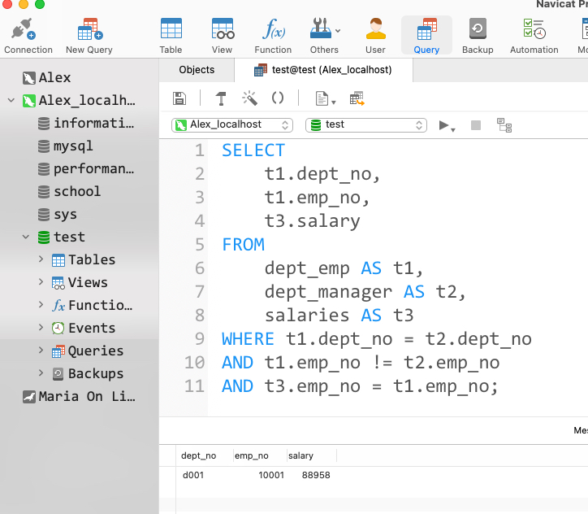

# Day61

## Tag: DENSE_RANK(), ORDER BY


题意:

给你一张员工信息表和一张部门表，请你查询出每个部门中薪资排名前三的员工信息和对应的部门(包含相同排名)


思路1:

- 既然要按照部门分类还要考虑排名，我们可以使用窗口函数DENSE_RANK()，在其中指定DepartmentId为PARTITION BY字段即可实现按照部门分组，再指定ORDER BY字段为Salary即可进行排名，最后再取上别名来记录排名并对应其他的数据，SQL如下:

SQL1:

```mysql
SELECT
	DENSE_RANK() OVER (
PARTITION BY DepartmentId
ORDER BY Salary DESC
	) AS 'ranking', DepartmentId, Name, Salary
FROM
	Employee
```


- 之后我们只需要取出该结果中ranking字段小于等于3的数据，并将DepartmentId字段与部门表进行连接对应即可，SQL如下

SQL2:

```mysql
SELECT
	t2.Name AS 'Department',
	t1.Name AS 'Employee',
	t1.Salary
FROM
	(
   SQL1
  ) AS t1
INNER JOIN Department AS t2 ON t1.DepartmentId = t2.Id
WHERE t1.ranking <= 3;
```


思路2:

- 当然也可以不使用窗口函数，将员工表自连接，并对重复的数据去重后，计算大于每个数据本身的数据个数即为其排名
- 最后判断排名小于3即可，SQL如下:

```mysql
SELECT
	t2.Name AS 'Department',
	t1.Name AS 'Employee',
	t1.Salary
FROM
	Employee AS t1
INNER JOIN Department AS t2 ON t1.DepartmentId = t2.Id
WHERE 3 > (
	SELECT
  	COUNT(DISTINCT t3.Salary)
 	FROM
  	Employee AS t3
 	WHERE t3.Salary > t1.Salary
  AND t1.DepartmentId = t3.DepartmentId
);
```

****


# Day62

## Tag: CASE, MOD, COUNT


题意:

给你一张座位表，请你查询出将相邻两个位置的人员进行交换后的结果(如果总人数为奇数，则不改变最后一个人员)


思路:

- 题意虽然是改变位置上的人员，但我们反过来想：改变每个人对应的id不就行了吗？
- 如果总人数为偶数，那么只需要将原来id为奇数的加一即可，原来为偶数的减一即可
- 如果总人数为奇数，那么我们只需要对最后一位进行判定就行了
- 总人数的计算可以使用COUNT()，查询后作为一个单独的数据进行判断就是了，SQL如下:

SQL1

```mysql
SELECT
		COUNT(id) AS 'counts'
	FROM
		seat
```


- 之后再根据其中的计数结果分情况讨论就是了，SQL如下

SQL:

```mysql
SELECT
	(CASE 
	WHEN id % 2 != 0 AND counts = id THEN
		id
	WHEN id % 2 != 0 AND counts != id THEN
	  id + 1
	ELSE
		id - 1
END) AS id,
	student
FROM
	seat,
	(
	SQL1
	) AS t1
ORDER BY id;
```

****


# Day1

2021-07-24

## Tag: SUM() OVER


题意:

给你一张成绩统计表，其中统计了各个等级的总人数，请你根据这张表查询出每个等级的学生最差的排名


例子:

A | 3

B | 2

结果:

A | 3

B | 5

(等级为A的人排名至少为3，而等级为B的人排名至少为5)


思路:

- 这道题其实就是简单的排序累加，很巧的是，在SQL Day59中我们通过SUM() OVER这个窗口函数实现了这样的操作，所以我们将排序字段换一下就能解决这个问题，SQL如下:

```mysql
SELECT
	grade,
	SUM(number) OVER(
  ORDER BY grade
  ) AS 't_rank'
FROM
	class_grade;
```

****


# Day2

## Tag: SUM() OVER, SUM


题意:

给你一张等级表，请你找出所有排名为中位数的等级


思路:

- 中位数要么有一个，要么有两个，所以为了将两个都取到，我们需要从倒序和顺序两个方向取中位数
- 为了比较，我们需要从倒序和顺序两个方向获取各个等级的排名，这里就需要使用昨天的写法了，SQL如下:

SQL1:

```mysql
SELECT
		grade,
		(SELECT
			SUM(number)
		FROM
			class_grade
		) AS 'total',
		SUM(number) OVER (
		ORDER BY grade
		) AS 'a',
		SUM(number) OVER (
		ORDER BY grade DESC
		) AS 'd'
	FROM class_grade
```


- 之后我们将等级限定在这个范围内，并制定排名要大于等于总数的一半，SQL如下:

SQL:

```mysql
SELECT
	grade
FROM (
	SQL1) AS t1
WHERE a >= total / 2 AND d >= total / 2
ORDER BY grade;
	
```

****


# Day3

## Tag: SUM(), LIMIT, INNER JOIN


题意:

给你一张积分表，其中记录了每个用户id的加分情况；再给你一张用户表，其中记录了用户ID与用户名的对应关系

请你查出总分最高的用户名和对应的分数


思路:

- 由于我们要查询的是积分最高的用户，所以我们需要将每个用户的积分加起来比较每个用户的积分情况
- 所以需要使用SUM()来累加各个用户的积分，再使用GROUP BY来划分出各个用户即可
- 之后再将积分表和用户表连接起来就能将id变为用户名了
- 鉴于给出的表有可能是乱序的，所以我们需要按照积分总和进行倒序排列
- 之后再使用LIMTI取出一条数据即可，SQL如下

```mysql
SELECT 
    t2.name,
    SUM(t1.grade_num) AS 'grade_sum'
FROM
    grade_info AS t1
INNER JOIN user AS t2 ON t1.user_id = t2.id
GROUP BY t2.name
ORDER BY grade_sum DESC
LIMIT 1;
```

****


# Day4

## Tag: DENSE_RANK(), ORDER BY


题意:

给你一张分数表和一张id对应的语言表，请你找出其中每个语言得分前二名的id，语言和分数信息


思路:

- 首先我们需要获取每条数据的排名，且需要按照语言分类排序，这里可以想到使用DENSE_RANK()，在OVER()中指定PARTITION字段为language_id即可实现按照语言分组，再指定ORDER BY字段为score且为降序DESC即可，SQL如下:

SQL1:

```mysql
SELECT
	id,
	language_id,
	score,
	DENSE_RANK() OVER(
	PARTITION BY language_id
	ORDER BY score DESC
	) AS 'rank'
FROM
	grade;
```


- 之后我们再用language表连接这张临时表，将language_id转换为name，并限定排名字段rank小于等于2即可
- 在最后还需要满足题目要求的排序，只需要我们按照顺序写好就行了，SQL如下:

```mysql
SELECT
	t2.id,
	t1.name,
	t2.score
FROM
	`language` AS t1
INNER JOIN
(
SQL1
	) AS t2 ON t2.language_id = t1.id
WHERE t2.rank <= 2
ORDER BY t1.name ASC, t2.score DESC, t2.id ASC;
```

****


# Day5

## Tag: FLOOR(), COUNT(), GROUP BY


题意:

给你一张成绩表，请你找出每个科目中的中位数所在的排名


思路:

- 首先中位数有两种情况: 如果总人数为偶数，那么中位数就有两个，相应的排名就有两个，为奇数则只有一个
- 可以确定的是，如果将总数+1后再除以二的整数部分和+2后再除以二的整数部分一定都是中位数，所以我们需要使用COUNT()来计算总数，再使用FLOOR()来向下取整，SQL如下

```mysql
SELECT 
	job,
  FLOOR((COUNT(*) + 1) / 2) AS 'start',
  FLOOR((COUNT(*) + 2) / 2) AS 'end'
FROM
	grade
GROUP BY job ORDER BY job;
```

****


# Day6

## Tag: WHERE




题意:

给你一张员工表employees，一张部门员工关系表dept_emp，一张部门经理关系表dept_manager，一张工资表salaries

请你查询出其中所有非经理员工的所属单位，员工号和工资


思路:

- 首先，员工号和部门号的对应关系在dept_emp中，而经理的信息在dept_manager中，所有员工的部门号和员工号在dept_emp中
- 所以我们用不到employees表，有用的只有三张表而已
- 要排除经理，就需要指定员工号不等于经理表中的员工号，且要将经理与其部门对应，其需要指定经理表和员工表中的部门号相同
- 为了保证工资对应，还必须指定工资表中的员工号与部门员工关系表中的员工号对应，所以一共有3个WHERE条件子句，SQL如下

```mysql
SELECT 
    t1.dept_no,
    t1.emp_no,
    t3.salary
FROM
    dept_emp AS t1,
    dept_manager AS t2,
    salaries AS t3
WHERE t1.emp_no != t2.emp_no 
AND t3.emp_no = t1.emp_no;
```

****


# Day7

## Tag: DISTINCT, GROUP BY


题意:

给你一张登陆记录表，请你通过该表计算出用户的留存率，结果保留3位小数，用户留存率为注册第二天还登录的用户数/注册使用的总用户数


思路:

- 首先查找注册的总用户数是最简单的，对user_id去重，再使用COUNT()计算即可，SQL如下

SQL1

```mysql
SELECT
	COUNT(DISTINCT user_id) AS 'sum'
FROM
	login;
```


- 而用户第二天登录则是相对于每个用户而言的，所以需要使用GROUY BY分组
- 注册的第二天则为最小的时间值加一，可以使用DATE_ADD()，SQL如下

SQL2

```mysql
SELECT
	user_id,
	DATE_ADD(MIN(date), INTERVAL 1 DAY) AS 'second'
FROM
		login
GROUP BY user_id
```


- 最后只需要限定user_id和date的组合，即可通过COUNT()计算第二天还登录的用户数量了
- 而保留三位小数则可以使用ROUND()函数，在第二参数的位置指定保留的数位即可，SQL如下:

```mysql
SELECT
	ROUND(COUNT(user_id) / SQL1, 3) AS 'p'
FROM
	login
WHERE (user_id, date) IN
(	
	SQL2
	);
```

****


# Day8

## Tag: DENSE_RANK(), GROUP BY, ORDER BY


题意:

给你一张用户信息表和一张积分表，请你查出其中积分最高的用户信息和其对应的积分(相同分数也要查询出来)


思路:

- 由于需要获取最高的积分，所以我们需要先将积分按照用户分类相加，并将其作为临时表备用，SQL如下:

SQL1:

```mysql
WITH temp AS (SELECT
	t1.id,
	t1.name,
	SUM(t2.grade_num) AS 'sum'
FROM
	user AS t1
INNER JOIN grade_info AS t2 ON t1.id = t2.user_id
GROUP BY t1.id)
```


- 最后再通过MAX来获取最高分，之后用最高分来匹配用户即可，SQL如下

```mysql
SQL1

SELECT
	temp.id,
	temp.name,
	temp.sum AS 'grade_num'
FROM
	temp
WHERE temp.sum IN (
	SELECT
		MAX(temp.sum)
	FROM
		temp
	)
ORDER BY temp.id;
```


- 当然也可以用DENSE RANK()来获取每个id对应的排名，最后匹配所有排名为1的即可

****


# Day9

## Tag: CASE WHEN, LEFT, MOD


题意:

给你一张员工表，其中有员工的id、姓名和工资信息，请你查询出每个员工的id和奖金，其中奖金要求如下:

如果该员工的id为奇数，且他的名字不是"M"开头的，那么输出的奖金为原来的工资，否则为0


思路:

- 该题目的重点就在实现两个条件: id为奇数和名字的开头
- 首先通过条件来限定字段就需要使用CASE WHEN THEN ELSE END这样的语法
- 判断id为奇数则使用%取余后判断其是否等于1即可，或者使用更直观的MOD()函数
- 判断名字开头，我们可以使用LEFT()函数取出第一个字符，或者使用SUBSTRING()也是一样的，SQL如下

```mysql
SELECT
	employee_id,
CASE
		
		WHEN MOD ( employee_id, 2 ) = 1 
		AND LEFT ( NAME, 1 ) != 'M' THEN
			salary ELSE 0 
			END AS 'bonus' 
FROM
	Employees;
```

****


# Day10

## Tag: LEFT JOIN, WHERE, IS NULL


题意:

给你一张员工信息表和一张奖金表，请你查询出其中所有奖金小于1000的员工的姓名与奖金(包含无奖金的员工)


思路:

- 由于Bonus表中没有所有员工的信息，所以没有奖金的员工需要输出NULL，也就是以员工为准，所以想到使用LEFT JOIN
- 最后再筛选Bonus小于1000以及为NULL即可，SQL如下

```mysql
SELECT 
    t1.name,
    t2.bonus
FROM
    Employee AS t1
LEFT JOIN Bonus AS t2 ON t1.empId = t2.empId 
WHERE t2.bonus < 1000 OR t2.bonus IS NULL;
```


