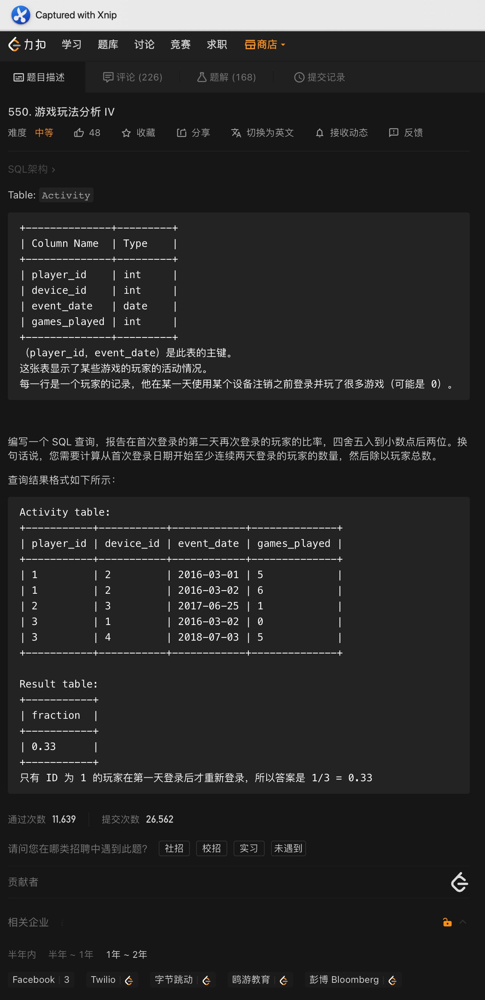

# Day31

## Tag: Sub Query, IN, SUM, IF


题意:

给你一张用户表和一张行程表，请你查询2013-10-01到2013-10-03每天正常用户订单的取消率(正常用户是指客户和司机都没有被ban)，结果保留两位小数


思路:

- 从简单的开始，限制日期我们可以使用BETWEEN AND
- 想要指定正常用户，我们可先查询出被ban的用户，再使用NOT IN即可进行排除
- 难点在于如果计算取消的订单数，平时计算数量会想到使用COUNT
- 但这里一旦使用COUNT则必须对CONUT内的字段进行限定，而之后计算总数时COUNT中使用的字段会收到影响
- 如果一定要使用COUNT，则需要将Trip表重复查询两次，以确保前后两次COUNT字段不会相互干扰
- 这样其实很麻烦，我们完全可以利用IF将COUNT变为SUM，如果Status为completed则为0，否则为1
- 这样我们只将Trip表查询了一次，还没有影响到之后的分母，SQL如下

```mysql
SELECT
	Request_at AS 'Day',
	ROUND(SUM(IF(Status = 'completed', 0, 1)) / COUNT(Status), 2) AS 'Cancellation Rate'
FROM
	Trips
WHERE Client_Id NOT IN (SELECT Users_Id FROM Users WHERE Banned = 'Yes')
AND Driver_Id NOT IN (SELECT Users_Id FROM Users WHERE Banned = 'Yes')
AND Request_at BETWEEN '2013-10-01' AND '2013-10-03'
GROUP BY Day;
```

****


# Day32

## Tag: OR, IS NULL


题意:

给你一张客户表，请你查询出所有推荐人id不为2的客户名称


思路:

- 这道题目看起来一个referee_id != 2就能解决，但这样其实只能查询出所有非null的数据，所以我们还需要将所有为null的数据也包含其中，SQL如下

```mysql
SELECT
	name
FROM
	customer
WHERE referee_id != 2 OR referee_id IS NULL
```

****


# Day33

## Tag: SUM() OVER


题意:

给你一张用户游戏活动表，请你查询出每个用户截止每个日期累计游玩的游戏数量


思路:

- 题目要求中有一个重要提示: 截止日期累计，换句话说就是累加，那不正是SUM() OVER擅长的吗？
- 划分字段指定为用户的id，排序则为日期值，所以SQL如下

```mysql
SELECT
	player_id,
	event_date,
	SUM(games_played) OVER(
	PARTITION BY player_id
	ORDER BY event_date
	) AS 'games_played_so_far'
FROM
	Activity;
```

****


# Day34

## Tag: AVG, DATEDIFF




题意:

给你一张用户游玩记录表，请你查询出其中所有用户在第一天登录后第二天再次登录的比例，并保留两位小数


思路:

- 要获取的比例构成为: 第二天还游玩的玩家数量 / 总玩家数量，想要获取第二天自然需要先查询出每个用户第一天的日期值，SQL如下

SQL1:

```mysql
SELECT 
		player_id,
		MIN(event_date) AS 'first_login'
	FROM 
		activity 
	GROUP BY player_id
```


- 之后将其作为临时表，连接上原表，限定两张表的玩家id，限制第二天的日期则使用DATEDIFF即可，参数为t2.event_date, t1,event_date
- 如果DATEDIFF的结果为1，则说明前者日期值比后者大1，就是我们需要的第二天
- 最后使用AVG计算其中的NOT NULL的数据比例(如果对应的第二天数据存在则记为1，最后除以总数即可)，SQL如下

```mysql
SELECT
	ROUND(AVG(t2.event_date IS NOT NULL), 2) AS 'fraction'
FROM
	(
		SQL1
	) AS t1
LEFT JOIN Activity AS t2 ON t1.player_id = t2.player_id 
AND DATEDIFF(t2.event_date, t1.first_login)=1
```

****


# Day35

## Tag: LEFT JOIN, DATEDIFF


题意:

给你一张玩家游玩记录表，请你返回所有有新用户登录的日期的留存率(注册第二天还登录的人/注册的人数)


思路:

- 首先依然需要我们查询出每个id第一天的登录日期，将这些日期作为我们的字段，SQL如下

SQL1:

```mysql
SELECT 
	player_id,
	MIN(event_date) AS 'first_login'
FROM Activity
GROUP BY player_id;
```


- 对于留存的计算，由于只有一张表，所以我们需要将我们的临时表与原表进行连接
- 又因为有日期的限制，所以应该以临时表为主，应该使用LEFT JOIN，两表的id应该相同，表二的日期应该是临时表的后一天，我们使用DATEDIFF或者DATE_ADD/DATE_SUB都可以，SQL如下

```mysql
SELECT 
	first_login AS install_dt,
	COUNT(t1.player_id) AS installs,
	ROUND(COUNT(t2.player_id) / COUNT(t1.player_id),2) AS Day1_retention
FROM
  (
	SQL1
	) AS t1
LEFT JOIN Activity AS t2 ON t1.player_id=t2.player_id
AND DATEDIFF(t2.event_date, first_login) = 1
GROUP BY first_login;
```

****


# Day36

## Tag: 


题意:

给你一张回放表，一张广告表，请你返回回放表中没有广告的剧集


思路:

- 因为查询的字段和限制结果的字段出现在两张表中，所以我们需要连接两张表才行
- 因为广告出现的时间值是一个时刻，而回放表中的时间是一个时间段，所以我们需要使用BETWEEN AND来限制
- 两表用相同的用户id来限制，将两表以回放表为准连接后，查询剧集和广告id时会发现: 有广告的剧集都有对应的ad_id，而没有广告的都为null
- 所以我们只需要再限定ad_id为null即可，SQL如下

```mysql
SELECT
	t1.session_id
FROM
	Playback AS t1
LEFT JOIN Ads AS t2 ON t1.customer_id = t2.customer_id
AND t2.timestamp BETWEEN t1.start_time AND t1.end_time
WHERE t2.ad_id IS NULL;
```

****


# Day37

## Tag: LIMIT, GROUP BY


题意:

给你一张订单表，请你查询出其中订单数最多的用户


思路:

- 统计订单数自然需要COUNT，按照用户划分自然需要GROUP BY分组
- 又因为只需要最多的那一位用户，所以我们只需要其中一天数据，使用LIMIT即可，SQL如下

```mysql
SELECT 
    customer_number
FROM 
    orders
GROUP BY customer_number 
ORDER BY COUNT(order_number) DESC 
LIMIT 1;
```


