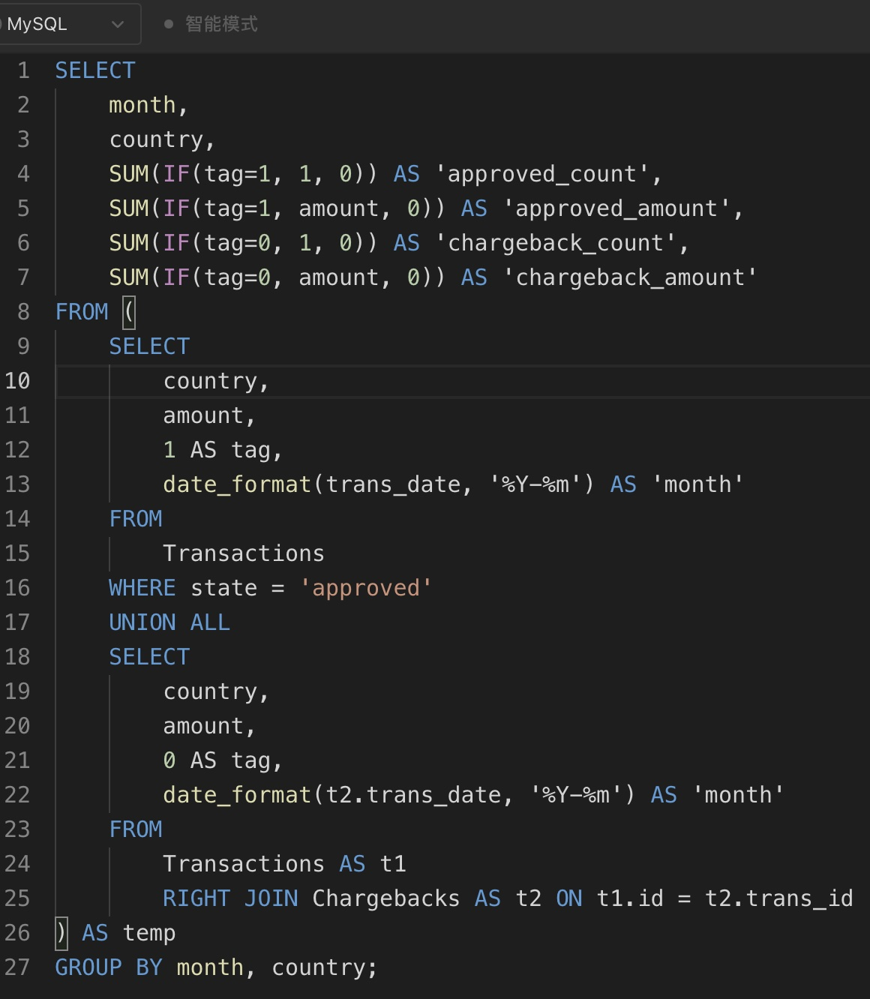
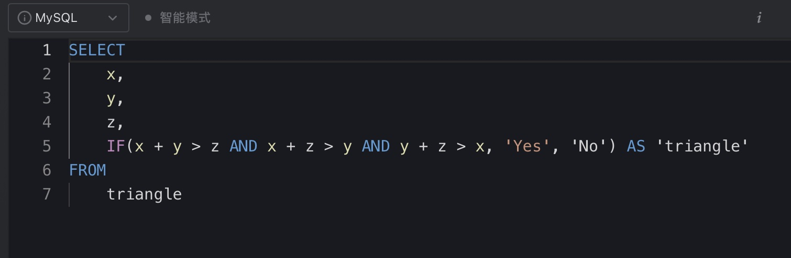
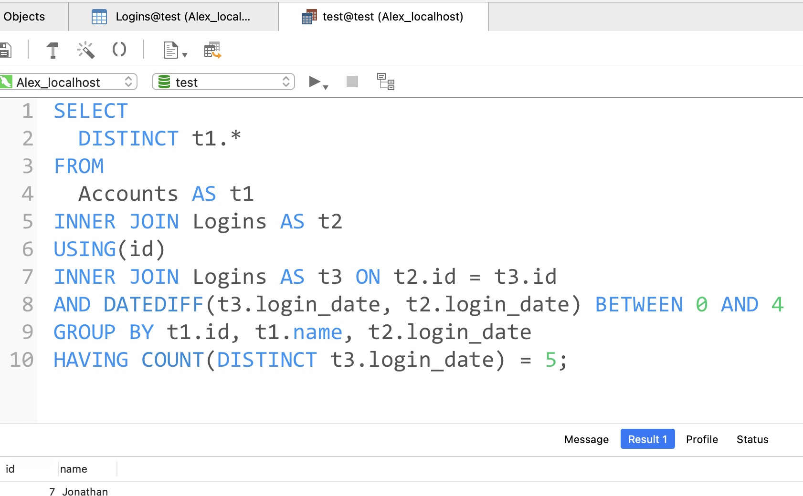

# Day31

## Tag: Sub Query, IN, SUM, IF


题意:

给你一张用户表和一张行程表，请你查询2013-10-01到2013-10-03每天正常用户订单的取消率(正常用户是指客户和司机都没有被ban)，结果保留两位小数


思路:

- 从简单的开始，限制日期我们可以使用BETWEEN AND
- 想要指定正常用户，我们可先查询出被ban的用户，再使用NOT IN即可进行排除
- 难点在于如果计算取消的订单数，平时计算数量会想到使用COUNT
- 但这里一旦使用COUNT则必须对CONUT内的字段进行限定，而之后计算总数时COUNT中使用的字段会收到影响
- 如果一定要使用COUNT，则需要将Trip表重复查询两次，以确保前后两次COUNT字段不会相互干扰
- 这样其实很麻烦，我们完全可以利用IF将COUNT变为SUM，如果Status为completed则为0，否则为1
- 这样我们只将Trip表查询了一次，还没有影响到之后的分母，SQL如下

```mysql
SELECT
	Request_at AS 'Day',
	ROUND(SUM(IF(Status = 'completed', 0, 1)) / COUNT(Status), 2) AS 'Cancellation Rate'
FROM
	Trips
WHERE Client_Id NOT IN (SELECT Users_Id FROM Users WHERE Banned = 'Yes')
AND Driver_Id NOT IN (SELECT Users_Id FROM Users WHERE Banned = 'Yes')
AND Request_at BETWEEN '2013-10-01' AND '2013-10-03'
GROUP BY Day;
```

****


# Day32

## Tag: OR, IS NULL


题意:

给你一张客户表，请你查询出所有推荐人id不为2的客户名称


思路:

- 这道题目看起来一个referee_id != 2就能解决，但这样其实只能查询出所有非null的数据，所以我们还需要将所有为null的数据也包含其中，SQL如下

```mysql
SELECT
	name
FROM
	customer
WHERE referee_id != 2 OR referee_id IS NULL
```

****


# Day33

## Tag: SUM() OVER


题意:

给你一张用户游戏活动表，请你查询出每个用户截止每个日期累计游玩的游戏数量


思路:

- 题目要求中有一个重要提示: 截止日期累计，换句话说就是累加，那不正是SUM() OVER擅长的吗？
- 划分字段指定为用户的id，排序则为日期值，所以SQL如下

```mysql
SELECT
	player_id,
	event_date,
	SUM(games_played) OVER(
	PARTITION BY player_id
	ORDER BY event_date
	) AS 'games_played_so_far'
FROM
	Activity;
```

****


# Day34

## Tag: AVG, DATEDIFF


题意:

给你一张用户游玩记录表，请你查询出其中所有用户在第一天登录后第二天再次登录的比例，并保留两位小数


思路:

- 要获取的比例构成为: 第二天还游玩的玩家数量 / 总玩家数量，想要获取第二天自然需要先查询出每个用户第一天的日期值，SQL如下

SQL1:

```mysql
SELECT 
		player_id,
		MIN(event_date) AS 'first_login'
	FROM 
		activity 
	GROUP BY player_id
```


- 之后将其作为临时表，连接上原表，限定两张表的玩家id，限制第二天的日期则使用DATEDIFF即可，参数为t2.event_date, t1,event_date
- 如果DATEDIFF的结果为1，则说明前者日期值比后者大1，就是我们需要的第二天
- 最后使用AVG计算其中的NOT NULL的数据比例(如果对应的第二天数据存在则记为1，最后除以总数即可)，SQL如下

```mysql
SELECT
	ROUND(AVG(t2.event_date IS NOT NULL), 2) AS 'fraction'
FROM
	(
		SQL1
	) AS t1
LEFT JOIN Activity AS t2 ON t1.player_id = t2.player_id 
AND DATEDIFF(t2.event_date, t1.first_login)=1
```

****


# Day35

## Tag: LEFT JOIN, DATEDIFF


题意:

给你一张玩家游玩记录表，请你返回所有有新用户登录的日期的留存率(注册第二天还登录的人/注册的人数)


思路:

- 首先依然需要我们查询出每个id第一天的登录日期，将这些日期作为我们的字段，SQL如下

SQL1:

```mysql
SELECT 
	player_id,
	MIN(event_date) AS 'first_login'
FROM Activity
GROUP BY player_id;
```


- 对于留存的计算，由于只有一张表，所以我们需要将我们的临时表与原表进行连接
- 又因为有日期的限制，所以应该以临时表为主，应该使用LEFT JOIN，两表的id应该相同，表二的日期应该是临时表的后一天，我们使用DATEDIFF或者DATE_ADD/DATE_SUB都可以，SQL如下

```mysql
SELECT 
	first_login AS install_dt,
	COUNT(t1.player_id) AS installs,
	ROUND(COUNT(t2.player_id) / COUNT(t1.player_id),2) AS Day1_retention
FROM
  (
	SQL1
	) AS t1
LEFT JOIN Activity AS t2 ON t1.player_id=t2.player_id
AND DATEDIFF(t2.event_date, first_login) = 1
GROUP BY first_login;
```

****


# Day36

## Tag: 


题意:

给你一张回放表，一张广告表，请你返回回放表中没有广告的剧集


思路:

- 因为查询的字段和限制结果的字段出现在两张表中，所以我们需要连接两张表才行
- 因为广告出现的时间值是一个时刻，而回放表中的时间是一个时间段，所以我们需要使用BETWEEN AND来限制
- 两表用相同的用户id来限制，将两表以回放表为准连接后，查询剧集和广告id时会发现: 有广告的剧集都有对应的ad_id，而没有广告的都为null
- 所以我们只需要再限定ad_id为null即可，SQL如下

```mysql
SELECT
	t1.session_id
FROM
	Playback AS t1
LEFT JOIN Ads AS t2 ON t1.customer_id = t2.customer_id
AND t2.timestamp BETWEEN t1.start_time AND t1.end_time
WHERE t2.ad_id IS NULL;
```

****


# Day37

## Tag: LIMIT, GROUP BY


题意:

给你一张订单表，请你查询出其中订单数最多的用户


思路:

- 统计订单数自然需要COUNT，按照用户划分自然需要GROUP BY分组
- 又因为只需要最多的那一位用户，所以我们只需要其中一天数据，使用LIMIT即可，SQL如下

```mysql
SELECT 
    customer_number
FROM 
    orders
GROUP BY customer_number 
ORDER BY COUNT(order_number) DESC 
LIMIT 1;
```

****


# Day38

## Tag: 




题意:

给你一张交易记录表和一张退款表，请你查出每个月每个国家接受的退款订单数和金额，以及拒绝的退款订单数和金额


思路:

- 看起来要查询的字段很多，但我们可以分开查询接受退款的部分和拒绝的部分，其中接受的部分我们只需要限定state为'approved'即可，SQL如下

SQL1:

```mysql
SELECT
	country,
	amonut,
	1 AS 'tag',
	DATE_FORMAT('%Y-%m') AS 'month'
FROM
	Transactions
WHERE state = 'approved';
```

- 格式化输出日期采用DATE_FORMAT，为了方便后期统计，我们将这些数据统一标记为tag'1'


- 之后我们再连接两表查询出被拒绝的订单数据，SQL如下

SQL2:

```mysql
SELECT 
	country,
	amount, 
0 AS 'tag',
	DATE_FORMAT(t2.trans_date, '%Y-%m') AS 'month'
FROM 
	Transactions AS t1
RIGHT JOIN Chargebacks AS t2 ON t1.id = t2.trans_id
```

- 退款的日期以Chargebacks表为准，所以需要使用RIGHT JOIN右连接


- 最后联合两SQL，并根据了留下的tag进行分类统计，SQL如下:

```mysql
SELECT 
	month,
	country,
	SUM(IF(tag=1, 1, 0)) AS 'approved_count',
	SUM(IF(tag=1, amount, 0)) AS 'approved_amount',
	SUM(IF(tag=0, 1, 0)) AS 'chargeback_count',
	SUM(IF(tag=0, amount, 0)) AS 'chargeback_amount'
FROM (
  SQL1
	UNION ALL
  SQL2
) AS temp
GROUP BY month, country;
```

****


# Day39

## Tag: AVG, ROUND, IF


题意:

给你一张查询结果表，请你根据查询名称，查询出查询的质量和劣质查询的百分比，查询结果保留两位小数，其中查询质量大的定义为:(查询评分(rating) / 位置(position) 之和) / 查询总数


思路:

- 查询质量其实就是一个平均值而已，我们直接在AVG里写上rating / position的关系就行了
- 筛选劣质查询则需要限定rating字段，由于rating小于3为劣质查询，所以我们直接使用IF来区分两种情况即可，最后再乘以100来表示百分数，SQL如下

```mysql
SELECT
	query_name,
	ROUND(AVG(rating / position), 2) AS 'quality',
	ROUND(SUM(IF(rating < 3, 1, 0)) / COUNT(*) * 100, 2) AS 'poor_query_percentage'
FROM 
	Queries
GROUP BY query_name
```

****


# Day40

## Tag: Sub Query, NOT IN


题意:

给你一张销售员工表，一张订单表，一张公司信息表，请你查询出所有未和公司"RED"产生交易的员工名称


思路:

- 在订单表中有公司id和员工id的对应关系，而公司表中又有公司id和公司名的对应关系，所有我们可以连接两表来获取所有与公司RED进行交易的员工id，SQL如下

SQL1

```mysql
SELECT
	t2.sales_id
FROM
	company AS t1,
	orders AS t2
WHERE t1.com_id = t2.com_id
AND t1.name = 'RED'
```


- 之后直接通过该表来排除对于的员工id即可，SQL如下

```mysql
SELECT
	name
FROM
	salesperson
WHERE sales_id NOT IN (
	SQL1
)
```

****


# Day41

## Tag: HAVING, IF


题意:

给你一张产品信息表和一张销售记录表，请你查询出所有购买了S8但没有购买iPhone的用户id


思路:

- 由于需要查询的字段和限制的字段在两张表中，所以我们需要进行连接
- 限制条件是根据用户id来划分的，所以我们需要分组
- 最后在分组的前提下用HAVING进行限制，分别计算购买两种产品的数量即可，SQL如下:

```mysql
SELECT
	t1.buyer_id
FROM
	Sales AS t1
LEFT JOIN Product AS t2 ON t1.product_id = t2.product_id
GROUP BY t1.buyer_id
HAVING SUM(IF(t2.product_name = 'S8', 1, 0)) >= 1 AND SUM(IF(t2.product_name = 'iPhone', 1, 0)) = 0;
```

****


# Day42

## Tag: HAVING, SUM, LEFT


题意:

给你一张消费者信息表，一张产品表，一张订单记录表请你查询出所有在2020年6月和7月累加的销售金额超过100的用户id和姓名


思路1:

- 首先，我们需要限制日期，之后再计算金额，这里我们可以用YEAR和MONTH来分别限制月份和年
- 由于金额需要按照月份和用户划分计算，所以我们需要DATE_FORMAT来格式化输出，分组后使用HAVING筛选出所有累计金额大于等于100的数据，SQL如下:

SQL1:

```mysql
SELECT
	t3.name,
	t3.customer_id,
	DATE_FORMAT(t1.order_date, '%Y-%m') AS 'month',
	SUM(t1.quantity * t2.price) AS 'cost'
FROM
	Orders AS t1,
	Product AS t2,
	Customers AS t3
WHERE t1.product_id = t2.product_id
AND YEAR(t1.order_date) = '2020'
AND MONTH(t1.order_date) REGEXP '[67]'
AND t1.customer_id = t3.customer_id
GROUP BY t3.name, month, t3.customer_id
HAVING cost >= 100
```

- 月份这里我们使用了正则表达式，这样可以避免写两个MONTH判断


- 根据这张临时表，我们可以获得对应时期内所有交易大于100的用户数据
- 由于数据是按照月份和用户划分的，所以如果一个用户在表中有两条数据，则说明他在两个月份都达到了100及以上的消费金额，SQL如下

SQL2:

```mysql
SELECT
	customer_id,
	name
FROM (
	SQL1
 ) AS t1
GROUP BY name, customer_id
HAVING COUNT(name) > 1;
```


思路2:

- 分组的思路不变，我们可以利用SUM嵌套IF来计算符合日期的金额
- 取日期的时候，可利用LEFT来获取左边的7位字符，限定SUM结果 >= 100即可，这样便简洁了不少，SQL如下

```mysql
SELECT
	t1.customer_id,
	t1.name
FROM
	Customers AS t1
JOIN Orders AS t20N t1.customer_id =t2.customer_id
JOIN Product AS t3 oN t2.product_id =t3.product_id
GROUP BY t1.customer_id, t1.name
HAVING SUM(IF (LEFT(t2.order_date,7) ='2020-06', t2.quantity * t3.price,8)) >=100 
AND SUM(IF(LEFT(t2.order_date,7) ='2020-07', t2.q2uantity * t3.price,8))>=100;
```

****


# Day43

## Tag: AND in IF




题意:

给你一张表，其中每条数据有三个字段，分别代表三角形的三个边，请你判断每一条数据是否可以构成三角形


思路:

- 按照传统的方法，我们需要判断三次两边之和是否大于第三边，这里我们可以使用IF中嵌套使用AND的方式来做，SQL如下

```mysql
SELECT
	x,
	y,
	z,
	IF(x + y > z AND x + z > y AND y + z > x, 'Yes', 'No') AS 'triangle'
FROM
	triangle
```


- 当然还可以使用更有逼格的余弦定理，SQL如下

```mysql
SELECT
	x,
	y,
	z,
	IF(ABS((POWER(x, 2) - POWER(y, 2) - POWER(z, 2)) / (2 * y * z)) < 1,'Yes','No') AS 'triangle'
FROM 
	triangle
```

****


# Day44

## Tag: CASE WHEN, IF


题意:

给你一张队伍信息表和一张比赛记录表，请你查询出每个队伍的的比赛次数、比赛总得分、进球总数、对手的进球总数和与对手进球总数的差值。如果两队比分相同，则各加1分，否则胜者加3分


思路:

- 因为比赛记录和对我名称在两张表中，所以我们需要通过id来连接
- 计算比赛次数可以通过两边的id匹配来获得，由于记录中的id有两列，所以我们可以使用OR来覆盖匹配两列字段，SQL如下

```mysql
SUM(IF(t2.home_team_id = t1.team_id OR t2.away_team_id = t1.team_id, 1, 0)) AS 'matches_played',
```


- 分数的计算大致有三种情况，但每种情况又要分为主队和客队，所以我们可以通过CASE WHEN来连接三种情况，每种情况又用OR来覆盖主队和客队的情况，SQL如下

```mysql
SUM(
	CASE 
	WHEN (t1.team_id = t2.home_team_id AND t2.home_team_goals > t2.away_team_goals) OR
	(t1.team_id = t2.away_team_id AND t2.away_team_goals > t2.home_team_goals) THEN 3
	WHEN (t1.team_id = t2.home_team_id AND t2.home_team_goals < t2.away_team_goals) OR
	(t1.team_id = t2.away_team_id AND t2.away_team_goals < t2.home_team_goals) THEN 0
	ELSE 1 END) AS 'points',
```


- 进球数则简单的用IF来划分主客队的情况，并用SUM来计算即可，对手的进球数也是如此
- 最后再将这两个查询相减即可，SQL如下

```mysql
SUM(IF(team_id = home_team_id, home_team_goals, away_team_goals)) AS 'goal_for',
	SUM(IF(team_id = home_team_id, away_team_goals, home_team_goals)) AS 'goal_against',
	SUM(IF(team_id = home_team_id, home_team_goals, away_team_goals)) - SUM(IF(team_id = home_team_id, away_team_goals, home_team_goals)) AS 'goal_diff'
```


- 连接这些字段，最终SQL如下

```mysql
SELECT
	t1.team_name,
	SUM(IF(t2.home_team_id = t1.team_id OR t2.away_team_id = t1.team_id, 1, 0)) AS 'matches_played',
	SUM(
	CASE
	WHEN (t1.team_id = t2.home_team_id AND t2.home_team_goals > t2.away_team_goals) OR
	(t1.team_id = t2.away_team_id AND t2.away_team_goals > t2.home_team_goals) THEN 3
	WHEN (t1.team_id = t2.home_team_id AND t2.home_team_goals < t2.away_team_goals) OR
	(t1.team_id = t2.away_team_id AND t2.away_team_goals < t2.home_team_goals) THEN 0
	ELSE 1 END) AS 'points',
	SUM(IF(team_id = home_team_id, home_team_goals, away_team_goals)) AS 'goal_for',
	SUM(IF(team_id = home_team_id, away_team_goals, home_team_goals)) AS 'goal_against',
	SUM(IF(team_id = home_team_id, home_team_goals, away_team_goals)) - SUM(IF(team_id = home_team_id, away_team_goals, home_team_goals)) AS 'goal_diff'
FROM
	Teams AS t1,
	Matches AS t2
WHERE t1.team_id = t2.home_team_id OR t1.team_id = t2.away_team_id
GROUP BY t1.team_name
ORDER BY points DESC, goal_diff DESC, t1.team_name;
```

****


# Day45

## Tag: HAVING, AVG


题意:

给你一张国家号码对照表，一张用户信息表，一张通话记录表，请你查询出其中平均通话时长大于全球平均时长的国家名称


思路:

- 首先我们需要查询出平均时长，这里使用AVG即可，SQL如下

SQL1:

```mysql
SELECT 
	AVG(duration)
FROM
	Calls
```


- 之后我们需要连接三张表，其中用户id和用户号码之间靠caller_id和callee_id关联
- 用户电话号码则通过LEFT提取左边三位后与国家号码匹配即可，SQL如下

SQL2:

```mysql
SELECT
	t3.name AS 'country'
FROM
	Calls AS t1,
	Person AS t2,
	Country AS t3
WHERE (t1.caller_id = t2.id OR t1.callee_id = t2.id) 
AND t3.country_code = LEFT(t2.phone_number, 3) 
```


- 在SQL2的基础上，我们可以获取每个国家的平均通话时长，SQL如下:

```mysql
SELECT
	t3.name AS 'country',
	AVG(t1.duration)
FROM
	Calls AS t1,
	Person AS t2,
	Country AS t3
WHERE (t1.caller_id = t2.id OR t1.callee_id = t2.id) 
AND t3.country_code = LEFT(t2.phone_number, 3) 
GROUP BY t3.name
```


- 因此，我们在SQL2的基础上使用HAVING进行分组后查询，并结合SQL1来判断，SQL如下:

```mysql
SQL1 
GROUP BY t3.name
HAVING AVG(t1.duration) > (SQL1);
```

****


# Day46

## Tag: IFNULL, LEFT JOIN


题意:

给你一张学校招生限额表和一张学生分数段统计表，请你根据这两张表查询出每个学校应该设置的分数线，其中每个学校的分数线应该尽可能高，且应该招收尽可能多的学生，无法满足的学校设置为-1


思路:

- 因为需要招收尽可能多的学生，所以我们需要满足学校容量大于等于对应分数段的人数，而容量大的学校对应的分数应该尽可能低，所以需要取最小值
- 又因为部分学校名额不足，可能无法获取对应的分数段，所以连接两表时需要以学校表为主，使用左/右连接
- 如果出现名额不足，则分数查询结果为NULL，此时需要我们将NULL转换为-1，使用IFNULL即可，SQL如下

```mysql
SELECT
    t1.school_id,
    IFNULL(MIN(t2.score), -1) AS 'score'
FROM
    Schools AS t1
LEFT JOIN Exam AS t2 ON t1.capacity >= t2.student_count
GROUP BY t1.school_id;
```

****


# Day47

## Tag: LEFT JOIN, IFNULL


题意:

给你一张大箱子的表，其中每个大箱子里可能有小箱子，没有小箱子的话chest_id为null，但每个大箱子都有一定数量的苹果和橘子，

请你计算出每个大箱子中所有的苹果和桃子的数量(有小箱子的话也要计算小箱子里的数量)


思路:

- 首先不考虑null，如果每个大箱子里都有小箱子，则连接两张表(以大箱子为主的左/右连接)
- 直接将两个表中的两字段通过SUM相加即可
- 但如果部分大箱子内没有小箱子的话，我们就要讨论null的情况了
- 这里我们直接使用IFNULL即可，如果连接后为null，则记为0即可，SQL如下:

```mysql
SELECT
	SUM(IFNULL(t1.apple_count, 0) + IFNULL(t2.apple_count, 0)) AS 'apple_count',
	SUM(IFNULL(t1.orange_count, 0) + IFNULL(t2.orange_count, 0)) AS 'orange_count'
FROM
	Boxes AS t1
LEFT JOIN Chests AS t2 ON t1.chest_id = t2.chest_id;
```

****


# Day48

## Tag: LEFT JOIN, HAVING, AVG


题意:

给你一张业务记录表，请你找出其中活跃业务的id，其中活跃业务是指其业务中至少有两个类型的事件发生数大于平均值


思路:

- 首先自然需要算出每个类型时间的平均值，方便后面的比对，SQL如下

SQL1:

```mysql
SELECT
	event_type,
	AVG(occurences) AS 'avg_occurence'
FROM
	Events
GROUP BY event_type;
```


- 根据这张临时表，我们再连接上原表后，以原表的记录为主，找出所有对应类型事件发生数大于平均值的数据，SQL如下:

SQL2:

```mysql
SELECT
	business_id
FROM
	Events AS t1
LEFT JOIN (
	SQL1
	) AS t2 ON t1.event_type = t2.event_type
WHERE t1.occurences > t2.avg_occurence;
```


- 执行这段SQL后可以发现符合条件的id出现了两次以上，所以我们只需要再分组后计算id出现次数大于1的即可，SQL如下

```mysql
SQL1
GROUP BY business_id
HAVING COUNT(business_id) > 1;
```

****


# Day49

## Tag: WHERE, BETWEEN AND


题意:

给你一张用户活动记录表，请你查询出截止2019-07-27，近30天中每天活跃用户的数量


思路:

- 很明显需要按照时间来分组，但用户的id在一天中可能出现多次，所以需要去重
- 限制的条件为日期值区间，所以我们使用BETWEEN AND即可，但这里需要注意的是，左边界应该为2019-06-28，SQL如下

```mysql
SELECT
	activity_date AS 'day',
	COUNT(DISTINCT user_id) AS 'active_users'
FROM
	Activity
WHERE activity_date BETWEEN '2019-06-28' AND '2019-07-27'
GROUP BY activity_date;
```

****


# Day50

## Tag: CROSS JOIN, LEFT JOIN


题意:

给你一张学生信息表，一张学科表，一张测试记录表，请你计算出每个学生在这次测试中每个科目的参与次数


思路:

- 看起来只需要简单的连接学生信息表和测试记录表，使用COUNT计算subject_name字段就行了，但需要注意的是，部分学生可能并没有参加所有的科目，因此其在部分科目的参与次数为0
- 为了解决这个问题，我们首先需要将学生表和科目表进行交叉连接得到笛卡尔积才行，这样才能将每个学生与每个学科都对应上，SQL如下

SQL1:

```mysql
SELECT
	t1.student_id,
	t1.student_name,
	t2.subject_name
FROM
	Students AS t1
CROSS JOIN Subjects AS t2
```


- 通过得到的笛卡尔积，再以此为基础连接测试记录表，得出连接结果为null的部分则说明该学生没有参加该科目，此时我们用COUNT进行计算便能成功计入每个学生在每个科目的测试次数了，SQL如下:

SQL2:

```mysql
SELECT
	t1.student_id AS 'student_id',
	t1.student_name AS 'student_name',
	t2.subject_name AS 'subject_name',
	COUNT(t3.subject_name) AS 'attended_exams'
FROM
	Students AS t1
CROSS JOIN Subjects AS t2
LEFT JOIN Examinations AS t3 ON t1.student_id = t3.student_id 
AND t2.subject_name = t3.subject_name 
GROUP BY t1.student_id, t2.subject_name, t1.student_name 
ORDER BY t1.student_id, t2.subject_name;
```

****


# Day51

## Tag: JOIN, HAVING




题意:

给你一张用户信息表，一张登录记录表，请你其中连续5天都登录的用户信息


思路:

- 因为用户姓名与登录记录在不同的表中，所以需要我们连接两张表，有因为需要我们找到联系五天登录的用户，所以需要将登陆表进行自连接后进行较
- 为了找到连续的五天的登录用户，连接登录表后我们只需要找到其中一张表的日期减去另一张表在0到4的范围即可，SQL如下

SQL1:

```mysql
SELECT
	DISTINCT t1.*,
	COUNT(t3.login_date)
FROM
	Accounts AS t1
INNER JOIN Logins AS t2 ON t1.id = t2.id
INNER JOIN Logins AS t3 ON t2.id = t3.id
AND DATEDIFF(t3.login_date, t2.login_date) BETWEEN 0 AND 4
```


- 这样我们就找到了每条原始数据的日期值中对比起本身所具有的连续日期的数量，之后我们只需要找出其中连续日期数为5的数据中对应的用户信息即可，SQL如下

```mysql
SELECT
	DISTINCT t1.*
FROM
	Accounts AS t1
INNER JOIN Logins AS t2 ON t1.id = t2.id
INNER JOIN Logins AS t3 ON t2.id = t3.id
AND DATEDIFF(t3.login_date, t2.login_date) BETWEEN 0 AND 4
GROUP BY t1.id, t1.name, t2.login_date
HAVING COUNT(DISTINCT t3.login_date) = 5;
```


