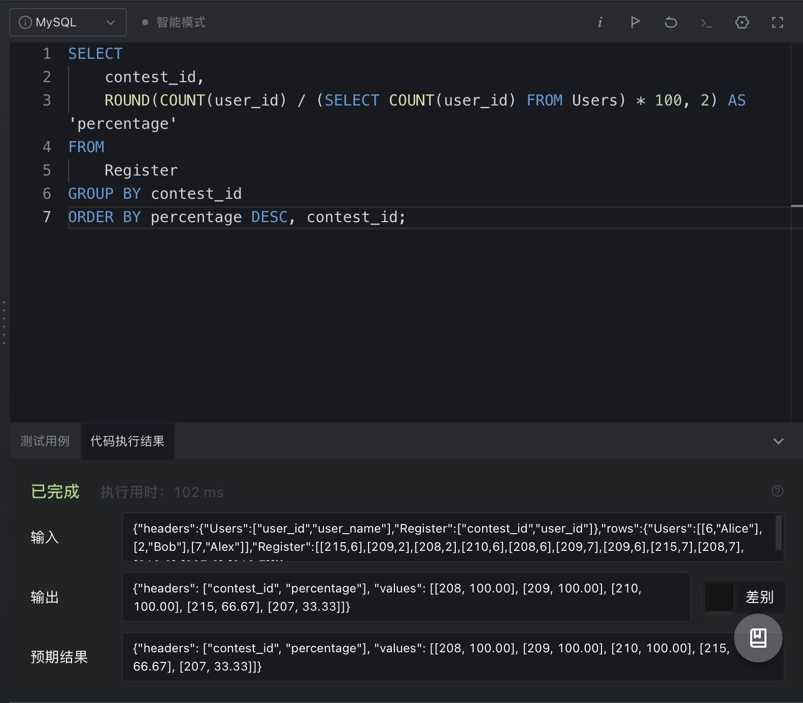
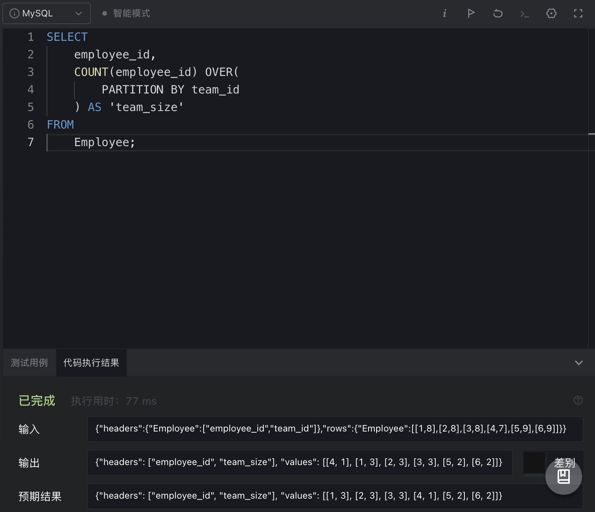
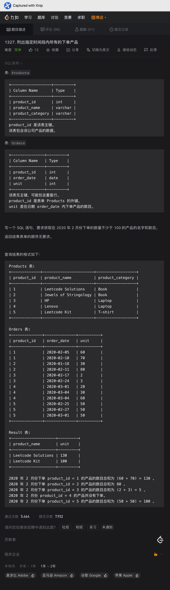
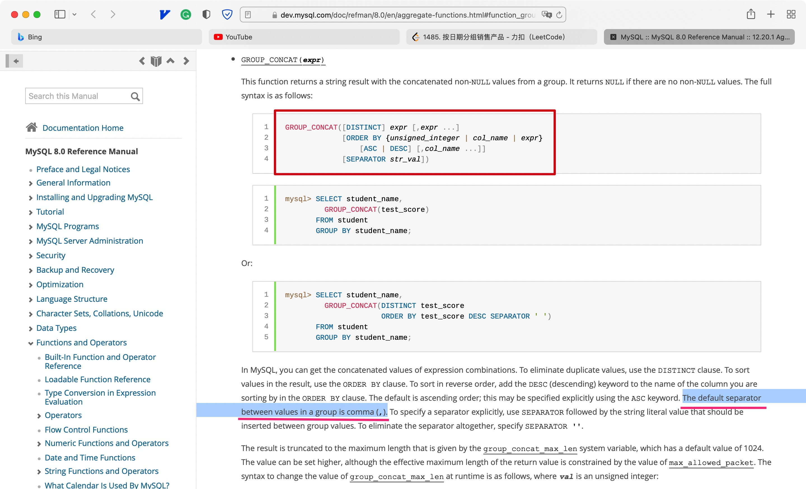
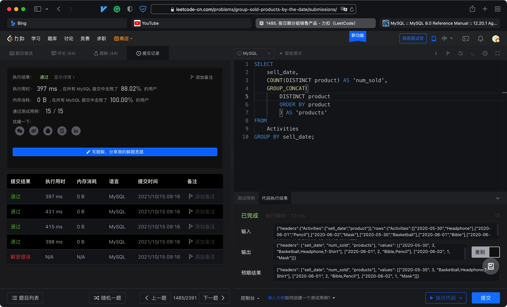

# Day61

## Tag: DISTINCT


题意:

给你一张论坛信息表，其中parent_id为null的表示帖子，其余为parent_id对应的评论，请你查询出每个帖子对应的评论数


思路:

- 首先选择帖子需要筛选出parent_id为null的数据，且因为数据中有重复的部分，所以需要去重
- 之后计算评论也需要去重，且需要通过parent_id与表的sub_id进行自连接匹配，SQL如下

```mysql
select 
    DISTINCT t1.sub_id AS 'post_id',
    (
        select 
            COUNT(distinct t2.sub_id)
        FROM 
            Submissions AS t2
        WHERE t2.parent_id = t1.sub_id) AS 'number_of_comments'
FROM 
    Submissions AS t1
WHERE t1.parent_id is null
ORDER BY t1.sub_id
```

****


# Day62

## Tag: LEFT JOIN


题意:

给你一张项目人员对应表，一张员工信息表，请你查询出每个项目对应的平均人员工作年限


思路:

- 求平均年限即对employee表中的experience_year字段求平均值，一个AVG就能搞定
- 但项目信息在另一张表中，所以需要我们连接两张表，SQL如下

```mysql
SELECT
    t1.project_id,
    ROUND(AVG(t2.experience_years), 2) AS 'average_years'
FROM
    Project AS t1
LEFT JOIN Employee AS t2 ON t1.employee_id = t2.employee_id
GROUP BY t1.project_id;
```

****


# Day63

## Tag: GROUP BY, HAVING


题意:

给你一张项目表，请你查询出其中员工数最多的项目


思路:

- 需要注意的是，员工数最多的项目很可能不知一个，所以我们需要先查询出其中最大的员工数量，SQL如下

SQL1:

```mysql
SELECT
	COUNT(employee_id) AS 'emp_num'
FROM
	Project
GROUP BY project_id
ORDER BY emp_num DESC
LIMIT 1;
```


- 之后再根据这个数据来匹配即可，SQL如下

```mysql
SELECT
    project_id
FROM
    Project
GROUP BY project_id
HAVING COUNT(employee_id) = SQL1;
```

****


# Day64

## Tag: DISTINCT, BETWEEN AND


题意:

给你一张用户活动表，请你计算出截止2019-07-27(包含)30天内平均每个用户的通话数


思路:

- 题目虽然强调了一个有效通话，但其实没什么用，这里唯一的限制就是日期，我们使用DATE_DIFF或者BETWEEN AND都行
- 这里由于数据中存在很多重复字段，所以只能通过COUNT再DISTINCT去重的方式来计算
- 且如果没有匹配数据，则需要将null变为0，所以需要使用IFNULL，SQL如下

```mysql
SELECT
    IFNULL(ROUND(COUNT(DISTINCT session_id) / COUNT(DISTINCT user_id), 2), 0) AS 'average_sessions_per_user'
FROM
    Activity
WHERE activity_date BETWEEN '2019-06-28' AND '2019-07-27'
```

****


# Day65

## Tag: DISTINCT, COUNT


题意:

给你一张活动表，一张移除表。请你计算出所有被举报的帖子中，平均每天被移除的比例


思路:

- 查询被举报的表也就是限制字段extra为'spam'，而被移除的帖子id在移除表中，也就是分子
- 而对应的分母在活动表中，两者都用COUNT即可计算，不用直接使用AVG是因为表中id可能重复，所以我们还需要使用DISTINCT去重
- 在计算平均每天的删除比例前，我们还需要计算出每天的删除比例，SQL如下

SQL1:

```mysql
SELECT
    t1.action_date,
    COUNT(DISTINCT t2.post_id) / COUNT(DISTINCT t1.post_id) AS 'remove_percent'
FROM
    Actions AS t1
LEFT JOIN Removals AS t2 ON t1.post_id = t2.post_id
WHERE t1.extra = 'spam'
GROUP BY t1.action_date
```


- 之后再对每天的删除比例求平均值，SQL如下

```mysql
SELECT
    ROUND(AVG(remove_percent * 100), 2) AS 'average_daily_percent'
FROM (
SQL1
) AS t1
```

****


# Day66

## Tag: UNION ALL


题意:

给你一张好友申请通过表，请你计算出其中好友最多的用户id和其好友数


思路:

- 一个好友申请通过后，双方应该互为好友，但我们计算的时候必须要将一列作为id进行分组，才能计算另一列
- 所以为了将两列都计算在内，我们需要将表中的申请和通过ID交换后，与原表上下连接，SQL如下

SQL1:

```mysql
SELECT 
	requester_id AS 'id',
	accepter_id AS 'friend'
FROM
	request_accepted
UNION all
SELECT 
	accepter_id AS 'id',
	requester_id AS 'friend'
FROM
	request_accepted;
```


- 之后再进行常规的分组和排序即可，SQL如下

```mysql
SELECT
    id,
    COUNT(friend) AS 'num'
FROM (
    SQL1
) AS t1
GROUP BY id
ORDER BY num DESC
LIMIT 1;
```

****


# Day67

## Tag: ORDER BY, LEFT JOIN


题意:

给你一张学生信息表，一张部门表，请你查询出其中每个部门的学生数量(没有学生的部门也要显示)，结果按照学生数量降序排列，如果数量相同则按照部门名称的字典序排列


思路:

- 因为没有学生的部门也需要显示，所以我们需要以部门表最主，需要使用左/右连接，最后的排序无非就是两个条件而已，SQL如下

```mysql
SELECT
    t1.dept_name,
    COUNT(t2.student_id) AS 'student_number'
FROM
    department AS t1
LEFT JOIN student AS t2 ON t1.dept_id = t2.dept_id
GROUP BY t1.dept_name
ORDER BY student_number DESC, t1.dept_name;
```

****


# Day68

## Tag: LEFT JOIN, IFNULL


题意:

给你一张产品信息表，请你查询出其中所有产品在2019-08-16时的价格，如果表中没有2019-08-16及之前的价格，则认为之前的价格为10


思路:

- 首先不去操心没有价格时的判断，先获取16号有价格数据的产品信息
- 将日期进行限制，取出最接近目标日期的，就是我们需要的数据，SQL如下

SQL1:

```mysql
SELECT
	product_id,
	new_price
FROM
	Products
WHERE (product_id, change_date) IN (
	SELECT
		product_id,
		MAX(change_date)
	FROM
		Products
	WHERE change_date <= '2019-08-16'
	GROUP BY product_id
		)
```


- 之后再用原表的id进行连接，对于不符合的数据连接后会出现null值，也就是在目标日期前没有数据的产品
- 使用IFNULL对于null值进行讨论，将其变为10即可，SQL如下

```mysql
SELECT
	t1.product_id,
	IFNULL(t2.new_price, 10) AS 'price'
FROM (
	SELECT
		DISTINCT product_id
	FROM
		Products
	) AS t1
LEFT JOIN (
	SQL1
	) AS t2 ON t1.product_id = t2.product_id
```

****


# Day69

## Tag: ROUND


题意:

给你一张配送表，请你计算出其中即时订单的百分比(即订单日期与用户期望日期相同)


思路:

- 因为只有一张表，而需求的数据有一个条件限制，所以需要自连接
- 首先查询出所有即时订单的数量，SQL如下

SQL1:

```mysql
SELECT 
	COUNT(delivery_id) 
FROM
	Delivery
WHERE order_date = customer_pref_delivery_date
```


- 之后再查询出所有订单的数量，SQL如下

SQL2:

```mysql
SELECT 
	COUNT(delivery_id)
FROM
	Delivery
```


- 最后再将结果相除并用ROUND指定小数位数即可，SQL如下

```mysql
SELECT
    ROUND( (SQL1) / (SQL2) * 100 , 2) AS 'immediate_percentage'
```

****


# Day70

## Tag: BETWEEN AND


题意:

给你一张产品表，一张销售记录表，请你查询出每种产品的平均售价(注意售价会随日期变动)


思路:

- 由于价格会变动，所以我们使用价格乘以数量时还需要限定时间段，使用BETWEEN AND即可
- 之后常规的分组，并计算数量即可，SQL如下

```mysql
SELECT
    t1.product_id,
    ROUND(SUM(t2.units * t1.price) / SUM(t2.units), 2) AS 'average_price'
FROM
    Prices AS t1
INNER JOIN UnitsSold AS t2 ON t1.product_id = t2.product_id
WHERE t2.purchase_date BETWEEN t1.start_date AND t1.end_date
GROUP BY t1.product_id;
```

****


# Day71

## Tag: CASE WHEN


题意:

给你一张国家信息表，一张天气表，请你查询出每个国家在11月的天气(取决于weather_state的平均值)


思路:

- 平均值只需分组后用AVG即可，但对应的天气有3个选项，所以我们需要分情况才行，可以使用IF嵌套，还是使用CASE WHEN更简洁一些
- 对于日期的限定，如果是年/月，个人建议之间使用YAER()或者MONTH()，这样比较直观，也不需要自己去写具体的左右边界日期，SQL如下

```mysql
SELECT
    t1.country_name,
    CASE 
    WHEN AVG(t2.weather_state) <= 15 THEN 'Cold'
    WHEN AVG(t2.weather_state) >= 25 THEN 'Hot'
    ELSE 'Warm'
    END AS 'weather_type'
FROM
    Countries AS t1
INNER JOIN Weather AS t2 ON t1.country_id = t2.country_id
WHERE MONTH(t2.day) = 11
GROUP BY t1.country_name;
```

****


# Day72

## Tag: DISTINCT, ROUND




题意:

给你一张用户信息表，一张注册记录表，请你查询出所有赛事的用户注册率


思路:

- 分子为每个赛事的报名人数，在注册记录表中，使用COUNT计算即可
- 分子则为用户表中用户的数量，同样使用COUNT计算即可，SQL如下:

```mysql
SELECT
    contest_id,
    ROUND(COUNT(user_id) / (SELECT COUNT(user_id) FROM Users) * 100, 2) AS 'percentage'
FROM
    Register
GROUP BY contest_id
ORDER BY percentage DESC, contest_id;
```

****


# Day73

## Tag: COUNT OVER()




题意:

给你一张员工信息表，请查询出每个员工的id和其对应组内的员工总数


思路:

- 要求对应组内的员工数，常规思路就是通过team_id分组，使用COUNT进行计算，但这样写的话就需要创建一张临时表了，可行但不够优雅
- 最简单的方式则是直接使用窗口函数CONUT OVER()，SQL如下

```mysql
SELECT
    employee_id,
    COUNT(employee_id) OVER(
        PARTITION BY team_id
    ) AS 'team_size'
FROM
    Employee;
```

- 这样在一个字段中就解决了分组和求和的操作，不需要连接表


- 但这样的操作仅限于MySQL8.0或者MariaDB等支持窗口函数的高版本才行，如果和我一样在用5.7呢？
- 那么我们借鉴这样的思路，同样通过一个字段自连接来解决问题，SQL如下

```mysql
SELECT
    t2.employee_id,
    (
        SELECT
            COUNT(employee_id)
        FROM
            Employee AS t1
        WHERE t1.team_id = t2.team_id
    ) AS 'team_size'
FROM
    Employee AS t2;
```

****


# Day74

## Tag: REGEXP, *


题意:

给你一张用户信息表，请你查询出邮箱地址符合条件的用户的所有信息，邮箱地址条件:

以字母开头，邮箱前缀为字母，数字，"-"，"_"，"."，"/"，后缀为"@leetcode.com"


思路:

- 该题目明显考察的是正则表达式，我们一点一点的处理
- 首先是开头，正则表达式中使用"^"来表示开头，题目要求开头为字母(大小写)，所以我们使用[]包裹可以表示匹配其中的一个
- 在[]中使用-表示匹配这个范围内的，所以开头如下:

```mysql
^[a-zA-Z]
```


- 除了开头，前缀剩余的部分还应该匹配数字，和其他特殊符号，由于这些特殊符号在正则表达式中会被解释，所以我们要在它们前面使用\来转义，此时正则为:

```
^[a-zA-Z][a-zA-Z0-9\_\-\.]
```


- 这样写只是匹配了前两个位置而已，前缀剩余部分的规则与第二个位置相同，此时我们使用*即可将前一个任意字符匹配任意次，正则如下

```
^[a-zA-Z][a-zA-Z0-9\_\-\.]*
```


- 最后我们匹配一下邮箱后缀，正则表达式用$来表示结尾，其中邮箱的"."也需要转义，所以最终正则为:

```
^[a-zA-Z][a-zA-Z0-9\_\.\-]*@leetcode\.com$
```


- 将该正则结合到MySQL的WHERE字句中，最终SQL如下:

```mysql
SELECT
    *
FROM
    Users
WHERE mail REGEXP '^[a-zA-Z][a-zA-Z0-9\_\.\-]*@leetcode\.com$'
```

****


# Day75

## Tag: IFNULL


题意:

- 给你一张广告信息表，请你根据给出的公式计算广告的点击率


思路:

- 由公式可知有两种情况，我们先不管为0的特殊情况，正常来说就是计算点击数 / (点击数 + 观看数) * 100，对应到SQL中就是计算action字段为'Clicked'和'Viewed'的情况
- 因为匹配的结果为0和1，而COUNT只区分null，所以这里需要使用SUM
- 如果分母为0，则公式结果为null，此时再使用IFNULL来区分即可，所以SQL如下

```mysql
SELECT
    ad_id,
    ROUND(IFNULL(SUM(action = 'Clicked') / (SUM(action = 'Clicked') + SUM(action = 'Viewed')) * 100, 0), 2) AS 'ctr'
FROM
    Ads
GROUP BY ad_id
ORDER BY ctr DESC, ad_id;
```

****


# Day76

## Tag: HAVING




题意:

给你一张产品信息表，一张订单表，请你查询出在2020年2月下单数量不低于100的产品的名称和数量


思路:

- 计算数量很简单，一个SUM就解决了，又因为所需信息在两张表中，所以需要连接
- 对于日期的限制个人建议使用YEAR和MONTH，这样更加直观，至此我们已经解决了大半，SQL如下

SQL1:

```mysql
SELECT
    t1.product_name,
    SUM(t2.unit) AS 'unit'
FROM
    Products AS t1
INNER JOIN Orders AS t2 ON t1.product_id = t2.product_id
WHERE YEAR(t2.order_date) = '2020'
AND MONTH(t2.order_date) = '02'
GROUP BY t1.product_name
```


- 上述操作已经进行了分组，但我们还需要限制unit ≥ 100所以在分组后进行限制就需要HAVING了，SQL如下

```mysql
SQL1
HAVING unit >= 100;
```

****


# Day77

## Tag: String, Concat, substring


题意:

给你一张用户信息表，请你将其中用户姓名的开头字母全部转换为大写字母，其余字符全部小写


思路:

- 首先确定转换字符为大小写的函数为Upper()和Lower()，下一步就是取出对应的字符了
- 取首字母就是取最左边一个，所以使用LEFT即可，取剩下的字符则需要使用substring，且参数为2即可
- 最后将字符截取和大小写转换函数结合在一起即可，SQL如下

```mysql
SELECT
    user_id,
    CONCAT(Upper(LEFT(name, 1)), lower(substring(name, 2))) AS 'name'
FROM
    Users
ORDER BY user_id;
```

****


# Day78

## Tag: NULL


题意:

给你一张学生信息表，一张学院表，请你查询出所有学院信息不存在的学生


思路:

- 所谓不存在即学生对应的department_id在学院表中不存在，要表现出来的话可以将其与学生表进行连接
- 以学生表为主后，如果其对应的department_id不存在，则结果为null，我们只需要筛选出学院名为null的即可，SQL如下

```mysql
SELECT
    t1.id,
    t1.name
FROM
    Students AS t1
LEFT JOIN Departments AS t2 ON t1.department_id = t2.id
WHERE t2.name IS NULL;
```

****


# Day79

## Tag: LEFT JOIN


题意:

给你一张员工信息表，一张唯一识别码表，请你查询出其中每个员工对应的识别码，没有的员工显示null


思路:

- 很明显，要以员工表为主，使用左右连接后，没有对应识别码的自然为null，SQL如下

```mysql
SELECT
    t2.unique_id AS 'unique_id',
    t1.name
FROM
    Employees AS t1
LEFT JOIN EmployeeUNI AS t2 ON t1.id = t2.id;
```

****


# Day80

## Tag: Regular Expression, LIKE


题意:

给你一张患者信息表，请你查出其中患有1类糖尿病的患者信息(condition中包含DIAB1)


思路:

- 由于condition字段中每种病都由space分隔，所以不能简单的使用LIKE '%DIAB1%'，而是需要考虑该病症在开头和结尾的情况
- 对应LIKE如下

```mysql
SELECT
    patient_id,
    patient_name,
    conditions
FROM
    Patients
WHERE conditions LIKE '% DIAB1'
OR conditions LIKE 'DIAB1%';
```


- 当然也可以使用正则

```mysql
SELECT
    patient_id,
    patient_name,
    conditions
FROM
    Patients
WHERE conditions REGEXP '^DIAB1|\\sDIAB1'
```

- 其中"\\s"对应任意空白字符

****


# Day81

## Tag: UNION


题意:

给你一张用户会话表，请你根据时长，查询出对应访问时间的用户数量


思路:

- 根据result表可以得知，字段bin中的内容是自定义的字符串，无法从原表中获取，所以需要手动写入
- 又因为统计过程中需要变换字符串，所以我们需要根据duration的情况来讨论，可以使用CASE WHEN，但为了直观，这里可以使用UNION，SQL如下

```mysql
SELECT
    '[0-5>' AS bin,
    COUNT(DISTINCT session_id) AS 'total'
FROM
    Sessions
WHERE duration BETWEEN 0 AND 5 * 60
UNION
SELECT
    '[5-10>' AS bin,
    COUNT(DISTINCT session_id) AS 'total'
FROM
    Sessions
WHERE duration BETWEEN 5 * 60 AND 10 * 60
UNION
SELECT
    '[10-15>' AS bin,
    COUNT(DISTINCT session_id) AS 'total'
FROM
    Sessions
WHERE duration BETWEEN 10 * 60 AND 15 *60
UNION
SELECT
    '15 or more' AS bin,
    COUNT(DISTINCT session_id) AS 'total'
FROM
    Sessions
WHERE duration >= 15 * 60;
```

****


# Day82

## Tag: WHERE


题意:

给你一张问题表，请你查询出其中likes比例低于60%的id


思路:

- likes比例使用likes / (likes + dislikes)即可，将其作为WHERE子句的条件就行了，SQL如下

```mysql
SELECT
    problem_id
FROM
    Problems
WHERE likes / (dislikes + likes) < 0.6
ORDER BY problem_id;
```

****


# Day83

## Tag: GROUP_CONCAT







题意:

给你一张销售表，请你按日期查询出每天销售的数量和对应的产品，产品名列表要按照字典序排列，且用"，"分隔


思路:

- 按日期就是分组，统计销量就是用COUNT，而对应的产品列表则需要使用GROUP_CONCAT，其会默认使用","分隔数据
- 但产品列表怎么排序呢？通过MySQL官方文档中对GROUP_CONCAT的描述可知，在其中嵌套使用ORDER BY即可，且还可以指定分隔符(默认为",")，所以最终SQL如下

```mysql
SELECT
    sell_date,
    COUNT(DISTINCT product) AS 'num_sold',
    GROUP_CONCAT(
        DISTINCT product
        ORDER BY product
        ) AS 'products'
FROM
    Activities
GROUP BY sell_date;
```

****


# Day84

## Tag: MONTH, INNER JOIN


题意:

给你一张电视台放送表，一张节目内容表，请你查询出其中在2020年6月期间播放的适用儿童的电影


思路:

- 根据条件一个一个来，我们需要查询的是电影的名称，其在内容表中，但放送时间在另一张表中，自然需要连接
- 限制日期使用MONTH和YEAR即可(测试用例没有考虑年份)，剩下两个条件就是简单的限制字段值，SQL如下

```mysql
SELECT
    DISTINCT t2.title
FROM
    TVProgram AS t1,
    Content AS t2
WHERE t1.content_id = t2.content_id
AND MONTH(t1.program_date) = '6'
AND t2.Kids_content = 'Y'
AND t2.content_type = 'Movies'
```

****


# Day85

## Tag: TRIM, LOWER


题意:

给你一张销售记录表，请你将其中的数据按照产品名和月份进行数量统计，并去除原表中产品名的空格，且将产品名转换为小写


思路:

- 首先处理产品名，取出空格可以使用TRIM()，转换为小写则使用LOWER()即可
- 按月份可以简单的用LEFT从原表中取前7个字符，也可以使用DATE_FORMAT
- 最后数量统计使用COUNT即可，需要注意的是，分组不能简单的用原表中的产品名，而是处理后的产品名，月份也是一样，所以要在GROUP BY中使用完整的表达式，SQL如下:

```mysql
SELECT
    Lower(TRIM(product_name)) AS 'product_name',
    DATE_FORMAT(sale_date, '%Y-%m') AS 'sale_date',
    COUNT(sale_id) AS 'total'
FROM
    Sales 
GROUP BY Lower(TRIM(product_name)), DATE_FORMAT(sale_date, '%Y-%m')
ORDER BY product_name;
```

****


# Day86

## Tag: SUM


题意:

给你一张仓库信息表，再给你一张产品信息表，请你根据这两张表计算出每个仓库的存货量


思路:

- 首先明确存货量的定义: 所有商品所占的容积，所以需要计算出每个商品的单个容量再乘以数量，最后将所有商品相加即可
- SQL如下

```mysql
SELECT
    t1.name AS 'WAREHOUSE_NAME',
    SUM(t1.units * t2.Width * t2.Length * t2.Height) AS 'VOLUME'
FROM
    Warehouse AS t1,
    Products AS t2
WHERE t1.product_id = t2.product_id
GROUP BY t1.name;
```

****


# Day87

## Tag: UNION, IS NULL


题意:

给你一张员工信息表，一张工资表，请你找出其中缺失姓名或工资信息的员工id


思路:

- 因为姓名和工资在两张不同的表中，所以如果使用左右连接的话一次只能以一张表为准，也就是说我们一次只能查询出其中一个条件

既然一次只能查询出一个，那我们干脆查询两次，之后将结果用UNION连接起来即可，SQL如下

```mysql
SELECT
    t2.employee_id
FROM
    Employees AS t1
RIGHT JOIN Salaries AS t2 ON t1.employee_id = t2.employee_id
WHERE t1.name IS NULL
UNION
SELECT
    t2.employee_id
FROM
    Salaries AS t1
RIGHT JOIN Employees AS t2 ON t1.employee_id = t2.employee_id
WHERE t1.salary IS NULL
ORDER BY employee_id;
```

****


# Day88

## Tag: IFNULL, SUM


题意:

给你一张商场的顾客访问表，和一张订单表，请你查询出访问表中所有未消费过的顾客的id，并计算出他们访问的次数


思路:

- 所谓未消费过就是其id出现在了访问表中，但没有出现在订单表中，所以以访问表为基础进行连接后，其中订单id为null的用户就是查询的答案
- 之后想要计算出访问次数，则只需要限定订单id为null即可，并统计transaction_id或者customer_id即可，SQL如下

```mysql
SELECT
    t1.customer_id,
    COUNT(t1.customer_id) AS 'count_no_trans'
FROM
    Visits AS t1
LEFT JOIN Transactions AS t2 ON t1.visit_id = t2.visit_id
WHERE t2.transaction_id IS NULL
GROUP BY t1.customer_id
```

****


# Day89

## Tag: HAVING


题意:

给你一张用户信息表，再给你一张交易记录表，请你计算出其中余额大于10000的所有用户的姓名与余额信息


思路:

- 首先姓名在用户表中，而余额计算需要使用交易记录表中的amount字段的值，所以需要连接两张表
- 而余额计算需要按照用户区别，所以需要先分组后筛选，所以只能用HAVING，SQL如下

```mysql
SELECT
    t1.name,
    SUM(t2.amount) AS 'balance'
FROM
    Users AS t1,
    Transactions AS t2
WHERE t1.account = t2.account
GROUP BY t1.name
HAVING balance > 10000;
```


