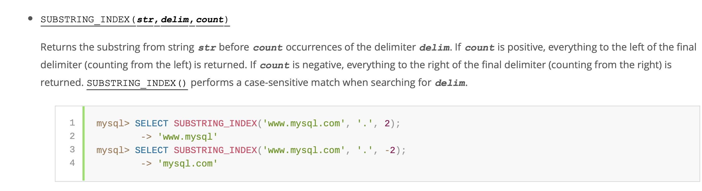

# Day91

## Tag: TIMESTAMPDIFF


题意:

给你一张用户请求记录表，请你查询出其中所有在24小时内发出至少两次请求的用户id


思路:

- 至少两次也就是说有两条记录在24内就行了，我们只需要判断两条记录的时间差在24小时内即可
- 同一张表中无法就一个字段进行比较，所以我们这里需要对这张表进行内连接，判断另一张表中时间晚于另一张表的记录中，是否存在时间差小于24小时的
- 限制两个datatimel类型可使用TIMESTAMPDIFF函数，将单位设置为SECOND即可，SQL如下

```mysql
SELECT
	DISTINCT t1.user_id
FROM
	Confirmations AS t1
INNER JOIN Confirmations AS t2 ON t1.user_id = t2.user_id
AND t1.time_stamp < t2.time_stamp
AND TIMESTAMPDIFF(SECOND, t1.time_stamp, t2.time_stamp) <= 24 * 60 * 60;
```


# Day92

## Tag: UNION


题意:

给你一张体验信息表，请你查询出三种平台上三种体验的尝试次数


思路:

- 该题目就是分组的问题，但在计算次数之前，需要我们重组三个平台和三种体验
- 所以需要我们手动写出三个平台的名称和三种体验的名称，并构成笛卡尔积，最后再连接上次数
- 其中左边的笛卡尔积为驱动表，对应未在被驱动表中匹配的记录，也需要统计为0，所以需要外连接，SQL如下

```mysql
SELECT
    t1.platform,
    t2.experiment_name,
    COUNT(t3.platform) AS 'num_experiments'
FROM (
SELECT
    'Android' AS 'platform'
UNION
SELECT
    'IOS' AS 'platform'
UNION
SELECT
    'Web' AS 'platform'
) AS t1
INNER JOIN (
    SELECT
        'Reading' AS 'experiment_name'
    UNION
    SELECT
        'Sports' AS 'experiment_name'
    UNION
    SELECT
        'Programming' AS 'experiment_name'
) AS t2
LEFT JOIN Experiments AS t3 USING(platform, experiment_name)
GROUP BY t1.platform, t2.experiment_name;
```

****


# Day93

## Tag: IFNULL, HAVING


题意:

给你一张图书信息表，再给你一张订单表，请你查询出过去一年中订单数不足10的书籍信息(不考虑上架不满1个月的书籍)，今天的日期为2019-06-23


思路:

- 根据示例来看，结果需要以图书表为驱动表，其中在被驱动表(订单表)中未被匹配的记录则需要从null变为0
- 因为计算订单数时只考虑一年以内的，所以在连接时就可以限制被驱动表中的订单时间
- 在总体数据中再限制上架时间大于等于一个月
- 最后在分组后，使用HAVING统计订单数并限制即可，SQL如下

```mysql
SELECT
    t2.book_id,
    t2.name
FROM
    Orders AS t1
RIGHT JOIN Books AS t2 ON t1.book_id = t2.book_id
AND t1.dispatch_date >= '2018-06-23'
WHERE t2.available_from >= 30
GROUP BY t1.book_id
HAVING SUM(IFNULL(t1.quantity, 0)) < 10;
```

****


# Day94

## Tag: HAVING


题意:

给你一张员工信息表，请你查询出其中有至少5名下属经理的名字


思路1:

- 首先我们可以直接获取经理的Id，并通过计算经理id出现的次数筛选出其中下属数大于5的经理，SQL如下

SQL1

```mysql
SELECT
	ManagerId
FROM
	Employee
GROUP BY ManagerId
HAVING (COUNT(ManagerId)) >= 5;
```


- 之后再将其作为临时表，与原表进行内连接即可，SQL如下

```mysql
SELECT
	t2.Name
FROM (
SQL1
) AS t1
INNER JOIN Employee AS t2 ON t1.ManagerId = t2.Id;
```


思路2:

- 其实我们可以直接将两张表进行内连接，我们需要查询的无非是MangerId对应Id的名字
- 所以将原表进行内连接，对应Id后以经理Id进行分组，并计算并限制分组后ManagerId的数量即可，SQL如下

```mysql
SELECT
	t1.Name
FROM
	Employee AS t1
INNER JOIN Employee AS t2 ON t1.Id = t2.ManagerId
GROUP BY t1.Id
HAVING (COUNT(t2.ManagerId)) >= 5;
```

****


# Day95

## Tag: LIMIT, INNER JOIN


题意:

给你一张候选人信息表，一张投票记录表，请你查询出最终当选者的信息


思路:

- 当选者即为票数最多的候选人，由于候选人的信息在Candidate表中，而需要统计的票数在Vote表中，所以需要连接两张表才行
- 首先查询出票数最多的候选人ID，使用COUNT进行分组，将查询结果按照票数进行排序，最后第一条数据就是当选人的信息，使用LIMIT只查询第一条即可，SQL如下

SQL1

```mysql
SELECT
	CandidateId,
	COUNT(CandidateId) AS 'number'
FROM
	Vote
GROUP BY CandidateId
ORDER BY number DESC
LIMIT 1;
```


- 最后再将该临时表与候选人信息表连接起来即可，SQL如下

```mysql
SELECT
	t1.Name
FROM
	Candidate AS t1
INNER JOIN (
SQL1
) AS t2 ON t1.id = t2.CandidateId;
```

****


# Day96

## Tag: LIMIT


题意:

给你一张调查日志表，请你计算出其中回答率最高的问题id


思路:

- 观察表的结构可以看到，所有回答的记录中，action列的值都为answer，而回答率最高其实也就是回答数量最多
- 所以我们只需要分组计算每个问题的回答率，并取出其中的最大值即可
- 一次分组后只能求出所有回答id对应的回答次数，但我们可以对结果进行倒序排序，之后第一条数据就是我们想要的，使用LIMIT取第一条即可，SQL如下

```mysql
SELECT
    question_id AS 'survey_log'
FROM
    SurveyLog
WHERE action = 'answer'
GROUP BY question_id
ORDER BY COUNT(action) DESC
LIMIT 1;
```

****


# Day97

## Tag: HAVING


题意:

给你一张商品信息表，一张交易记录表，请你计算出购买个数大于20，而单个商品质量小于50的所有商品信息


思路:

- 因为查询列表中需要我们统计购买个数，所以需要使用SUM，并分组
- 而商品的信息和交易记录在两张不同的表中，所以还需要连接两张表才行
- 连接时我们可以先筛选出质量小于50的商品
- 之后我们需要在分组的基础上限制商品的数量，此时使用HAVING即可，最后再根据要求排序，SQL如下

```mysql
SELECT
    t1.id,
    t1.name,
    t1.weight,
    SUM(t2.count) AS 'total'
FROM
    goods AS t1
INNER JOIN trans AS t2 ON t1.id = t2.goods_id
WHERE t1.weight < 50
GROUP BY t1.id
HAVING total > 20
ORDER BY t1.id;
```

****


# Day98

## Tag: IF


题意:

给你一张销售表，请你查询出每天苹果和橘子的销售数量差


思路:

- 因为苹果和橘子的记录可以通过字段fruit来判断，所以我们使用IF来区别是该加还是减数量即可，SQL如下

```mysql
SELECT
    sale_date,
    SUM(IF(fruit = 'apples', sold_num, -sold_num)) AS 'diff'
FROM
    Sales
GROUP BY sale_date
ORDER BY sale_date
```

****


# Day99

## Tag: UNION, Temperary Table


题意:

给你一张电影信息表，一张用户信息表，一张电影评分记录表，请你查询出其中评论电影最多的用户名(如果有评论数相同的则按照用户名字典序取靠前的)，并查询出2020年2月中平均评分最高的电影(如有同分则按照电影名字典序取靠前的)


思路:

- 题目中要求我们查询出两种数据，最终还要在一个结果集中，所以很明显需要写两个SQL再用UNION连接起来
- 先写第一个，题目要找评论数最多的用户名，然而用户名在用户表中，而评论的信息在评分表中，所以需要内连接两张表
- 为了找到最值，我们需要根据用户来分组计算对应的评论数并排序，其中排序除了按照评论数倒序排列外，还需要按照用户名升序排列(字典序)，最后排列出的第一条数据就是我们想要的用户名，用LIMIT取第一个即可，SQL如下

SQL1:

```mysql
SELECT
    t1.name AS 'results'
FROM
    Users AS t1
INNER JOIN MovieRating AS t2 ON t1.user_id = t2.user_id
GROUP BY t1.name
ORDER BY COUNT(t2.rating) DESC, t1.name
LIMIT 1
```


- 搞定了第一条，接下来需要搞定平均评分最高的电影，其中求平均评分使用AVG即可，限制日期则使用YEAR和MONTH函数即可
- 注意电影名和评分信息不在同一张表中，所以仍旧需要内连接，最终排列也需要加上对电影名进行升序排列(字典序)
- 最后用LIMIT取第一条记录即可，SQL如下

SQL2:

```mysql
SELECT
	t1.title AS 'results'
FROM
	Movies AS t1
INNER JOIN MovieRating AS t2 ON t1.movie_id = t2.movie_id
WHERE YEAR(t2.created_at) = 2020 AND MONTH(t2.created_at) = 2
GROUP BY t1.title
ORDER BY AVG(t2.rating) DESC, t1.title
LIMIT 1
```


- 最后的最后，我们需要将这两张表上下连接起来，注意这两张表都是查询出的临时表，所以查询列表中的字段别名需要一致，且两张表都需要添加括号以表示一张表，SQL如下


```mysql
(SQL1)
UNION
(SQL2)
```

****


# Day100

## Tag: SQRT, MIN


题意:

给你一张二维坐标表，请你查询出其中最短的两点间距离


思路:

- 单纯地求两点间距离很简单，获取x、y的距离平方和再开方即可，开方可以使用SQRT函数，平方可以使用POW函数
- 然而所有点都在同一张表中的同一字段，所以需要对该表两次查询，进行自连接，注意自连接条件只需要其中一个坐标不相等即可
- 最后可以按照距离进行升序排列，然后取第一条记录
- 但我们其实可以在计算距离时就使用MIN来获取最短距离，这样就不需要排序和取第一条记录了，SQL如下

```mysql
SELECT
    ROUND(SQRT(MIN(POW((t1.x - t2.x), 2) + POW(t1.y - t2.y, 2))), 2) AS 'shortest'
FROM
    point2D AS t1
INNER JOIN point2D AS t2 ON t1.x != t2.x OR t1.y != t2.y
```

****


# Day101

## Tag: IF, IN


题意:

给你一张二叉树节点表，请你通过查询得出其中每个节点的类型(p_id为该节点对应的父节点)


思路:

- 该题目其实就是一个判断的过程
- 如果一个节点为根节点，则其对应的父节点p_id为null，我们使用IF之间进行逻辑判断即可
- 之后就行需要判断剩下的节点为内节点还是叶子节点了，其实在p_id列中的节点不是根节点就是内节点，而之前我们已经判断了根节点，所以我们只需要判读剩余节点是否在p_id中即可，SQL如下

```mysql
SELECT
	id,
	IF(p_id IS NULL, 'Root', IF(id IN (SELECT p_id FROM Tree), 'Inner', 'Leaf')) AS 'Type'
FROM
	Tree;
```

****


# Day102

## Tag: IN


题意:

给你一张关注信息表，请你找出其中的二级关注者，并计算他们各自的关注者数量(二级关注者指的是至少关注了一个人的同时也至少被一个人关注)


思路:

- 在题目给我们的表中，其实就有关注者和被关注者的关系，所以满足二级关注者的人一定是这两列的交集，我们单独查出一列，再用IN来限制另一列即可
- 最后记得分组和排序，SQL如下

```mysql
SELECT
    DISTINCT followee AS 'follower',
    COUNT(follower) AS 'num'
FROM
    Follow
WHERE followee IN (SELECT follower FROM Follow)
GROUP BY followee
ORDER BY followee;
```

****


# Day103

## Tag: () IN


题意:

给你一张学生的成绩登记表，请你查询出每个学生分数最高的那门课程和对应的分数(如果有同分课程，则只考虑course_id小的那门)


思路:

- 因为题意要求我们获取最高成绩的同时还需要获取course_id较小的那门课程，所以需要我们使用一次MAX再使用一次MIN
- 但这两条语句不可能同时写在一起，所以我们需要将这两个条件分开来
- 先获取每个学生对应的最高分数，SQL如下

SQL1:

```mysql
SELECT
	student_id,
	MAX(grade) AS 'grade'
FROM
	Enrollments
GROUP BY student_id
```


- 之后再获取最小的course_id，再用上面的临时表限制其中的student_id和grade即可，SQL如下


```mysql
SELECT
    t1.student_id,
    MIN(t1.course_id) AS 'course_id',
    t1.grade
FROM Enrollments AS t1
WHERE (t1.student_id, t1.grade) IN (
    SQL1
) 
GROUP BY t1.student_id
ORDER BY t1.student_id;
```

****


# Day104

## Tag: DAY, MONTH


题意:

给你一张题目练习表，请你查询出8月份每天用户练习的题目数量


思路:

- 该题目的难点其实就是对日期的限制，题目要求查询2021年8月的数据，所以我们使用MONTH就可以取出日期值中的月份并进行限定
- 结果集中日期的格式只需要日，所以我们使用DAY就可以取出日期值中的日(测试用例有问题，并没有非2021年的数据)，SQL如下

```mysql
SELECT
    DAY(date),
    COUNT(question_id) AS 'question_cnt'
FROM
    question_practice_detail
WHERE MONTH(date) = 8
GROUP BY date;
```

****


# Day105

## Tag: LEFT JOIN, COUNT


题意:

给你一张用户刷题记录表，请你查询出其中用户第二天还会刷题的平均概率


思路:

- 从题目来看，很明显只需要计算出第二天做题的记录数，再除以对应第一天做题的记录数即可，这两天的记录只需要限制日期关系并保持device_id相同即可
- 因为只有一张表，所以需要连接，那么问题就来了，该用内连接还是外连接？
- 如果使用内连接，则那些不存在第二天做题记录的数据则不会被统计到，做除法后的结果为1，因为自连接后的结果全是第二天做题记录存在的数据，分子和分母相同
- 因此，我们只能使用外连接，且作为分母的表要作为驱动表，最后限制两表的device_id相同，且日期相差一天(使用DATEDIFF)，SQL如下:

```mysql
SELECT
    COUNT(t2.date) / COUNT(t1.date) AS 'avg_cnt'
FROM
    question_practice_detail AS t1
LEFT JOIN question_practice_detail AS t2 ON t1.device_id = t2.device_id
AND DATEDIFF(t2.date, t1.date) = 1;
```


- 看起来没问题，但提交后发现不对，仔细观察一下数据，发现原表中有一些数据是重复的，所以我们需要去重
- 直接在上述SQL的查询列表中加入DISTINCT吗？不行，因为查询列表中的值是两张表连接后的值了，我们需要在连接前去重，所以要分别先对两张表去重，SQL如下

SQL1:

```mysql
SELECT
		DISTINCT device_id,
		date
	FROM
		question_practice_detail
```


- 最后再连接两张表即可，SQL如下

```mysql
SELECT
	COUNT(t2.device_id) / COUNT(t1.device_id) AS 'avg_cnt'
FROM (
	SQL1
		) AS t1
LEFT JOIN (
	SQL1
		) AS t2 ON t1.device_id = t2.device_id
AND DATEDIFF(t2.date, t1.date) = 1;
```

****


# Day106

## Tag: SUBSTRING_INDEX




题意:

给你一张参赛申请的记录表，请你查询出其中男性和女性各自的人数


思路1:

- 判断性别的根据其实就是profile字段中最后一组字符串，所以我们只需要取出最后一组字符串进行判断即可
- 由于位于最后，我们可以取出最后的6个字符，使用RIGHT即可，判断其是否为"female"，最后分组统计即可，SQL如下

```mysql
SELECT
	IF(RIGHT(profile, 6) = 'female', "female", 'male') AS 'gender',
	COUNT(profile) AS 'number'
FROM
	user_submit
GROUP BY gender;
```


思路2:

- 观察profile字段，其中的每项数据都用","隔开了，而这样就刚好能使用一个名为"SUBSTRING_INDEX"的函数，具体语法看图，所以SQL如下

```mysql
SELECT
	SUBSTRING_INDEX(profile, ',', -1) AS 'gender',
	COUNT(profile) AS 'number'
FROM
	user_submit
GROUP BY gender;
```

****


# Day107

## Tag: SUBSTRING_INDEX


题意:

给你一张用户申请表，请你查询出各个年龄中申请人的数量


思路:

- 该题目很明显需要按照年龄分组统计，但问题就是如果从profile中获取年龄
- 如果使用SUBSTRING_INDEX，取参数-2的话，获取的就是最后的两个字符串
- 在该基础上，我们其实可以再次使用SUBSTRING_INDEX，取参数1，这样就取出了年龄字段，SQL如下

```mysql
SELECT
    SUBSTRING_INDEX(SUBSTRING_INDEX(profile, ',', -2), ',', 1) AS 'age',
    COUNT(profile) AS 'number'
FROM
    user_submit
GROUP BY age;
```

****


# Day108

## Tag: WHERE IN


题意:

给你一张用户信息表，请你查询出每个学校中gpa最低的用户信息


思路:

- 查询列表中有三个字段: device_id, university, 最小gpa
- 其中想要获取最小gpa只能通过根据学校分组的方式，SQL如下

SQL1:

```mysql
SELECT
	university,
	MIN(gpa) AS 'gpa'
FROM
	user_profile
GROUP BY university
```


- 这样一来我们就差device_id了，根据上表的信息，我们只需要限定univerisity和gpa字段即可，SQL如下


```mysql
SELECT
    device_id,
    university,
    gpa
FROM 
    user_profile
WHERE (university, gpa) IN
(
    SQL1
    )
ORDER BY university
```

- 注意不能直接这样写:

```mysql
SELECT
    device_id,
    university,
    MIN(gpa) AS 'gpa'
FROM
    user_profile
GROUP BY university
ORDER BY university;
```

- 因为学生和学校是多对一的关系，所以在对应上会出现问题
- 什么？为啥最后要排序？别问，问就是题目太拉没说清楚，得自己翻评论pwq


