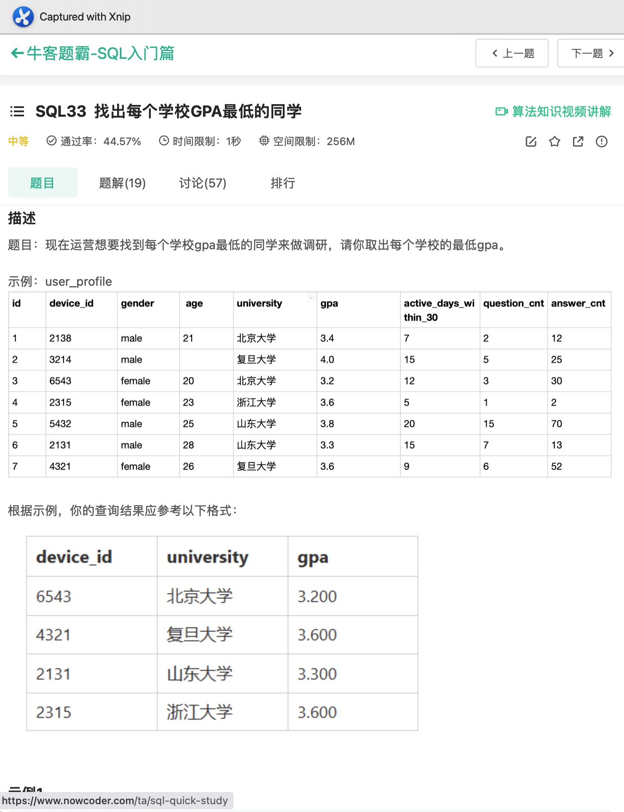

# Day91

## Tag: TIMESTAMPDIFF


题意:

给你一张用户请求记录表，请你查询出其中所有在24小时内发出至少两次请求的用户id


思路:

- 至少两次也就是说有两条记录在24内就行了，我们只需要判断两条记录的时间差在24小时内即可
- 同一张表中无法就一个字段进行比较，所以我们这里需要对这张表进行内连接，判断另一张表中时间晚于另一张表的记录中，是否存在时间差小于24小时的
- 限制两个datatimel类型可使用TIMESTAMPDIFF函数，将单位设置为SECOND即可，SQL如下

```mysql
SELECT
	DISTINCT t1.user_id
FROM
	Confirmations AS t1
INNER JOIN Confirmations AS t2 ON t1.user_id = t2.user_id
AND t1.time_stamp < t2.time_stamp
AND TIMESTAMPDIFF(SECOND, t1.time_stamp, t2.time_stamp) <= 24 * 60 * 60;
```


# Day92

## Tag: UNION


题意:

给你一张体验信息表，请你查询出三种平台上三种体验的尝试次数


思路:

- 该题目就是分组的问题，但在计算次数之前，需要我们重组三个平台和三种体验
- 所以需要我们手动写出三个平台的名称和三种体验的名称，并构成笛卡尔积，最后再连接上次数
- 其中左边的笛卡尔积为驱动表，对应未在被驱动表中匹配的记录，也需要统计为0，所以需要外连接，SQL如下

```mysql
SELECT
    t1.platform,
    t2.experiment_name,
    COUNT(t3.platform) AS 'num_experiments'
FROM (
SELECT
    'Android' AS 'platform'
UNION
SELECT
    'IOS' AS 'platform'
UNION
SELECT
    'Web' AS 'platform'
) AS t1
INNER JOIN (
    SELECT
        'Reading' AS 'experiment_name'
    UNION
    SELECT
        'Sports' AS 'experiment_name'
    UNION
    SELECT
        'Programming' AS 'experiment_name'
) AS t2
LEFT JOIN Experiments AS t3 USING(platform, experiment_name)
GROUP BY t1.platform, t2.experiment_name;
```

****


# Day93

## Tag: IFNULL, HAVING


题意:

给你一张图书信息表，再给你一张订单表，请你查询出过去一年中订单数不足10的书籍信息(不考虑上架不满1个月的书籍)，今天的日期为2019-06-23


思路:

- 根据示例来看，结果需要以图书表为驱动表，其中在被驱动表(订单表)中未被匹配的记录则需要从null变为0
- 因为计算订单数时只考虑一年以内的，所以在连接时就可以限制被驱动表中的订单时间
- 在总体数据中再限制上架时间大于等于一个月
- 最后在分组后，使用HAVING统计订单数并限制即可，SQL如下

```mysql
SELECT
    t2.book_id,
    t2.name
FROM
    Orders AS t1
RIGHT JOIN Books AS t2 ON t1.book_id = t2.book_id
AND t1.dispatch_date >= '2018-06-23'
WHERE t2.available_from >= 30
GROUP BY t1.book_id
HAVING SUM(IFNULL(t1.quantity, 0)) < 10;
```

****


# Day94

## Tag: HAVING


题意:

给你一张员工信息表，请你查询出其中有至少5名下属经理的名字


思路1:

- 首先我们可以直接获取经理的Id，并通过计算经理id出现的次数筛选出其中下属数大于5的经理，SQL如下

SQL1

```mysql
SELECT
	ManagerId
FROM
	Employee
GROUP BY ManagerId
HAVING (COUNT(ManagerId)) >= 5;
```


- 之后再将其作为临时表，与原表进行内连接即可，SQL如下

```mysql
SELECT
	t2.Name
FROM (
SQL1
) AS t1
INNER JOIN Employee AS t2 ON t1.ManagerId = t2.Id;
```


思路2:

- 其实我们可以直接将两张表进行内连接，我们需要查询的无非是MangerId对应Id的名字
- 所以将原表进行内连接，对应Id后以经理Id进行分组，并计算并限制分组后ManagerId的数量即可，SQL如下

```mysql
SELECT
	t1.Name
FROM
	Employee AS t1
INNER JOIN Employee AS t2 ON t1.Id = t2.ManagerId
GROUP BY t1.Id
HAVING (COUNT(t2.ManagerId)) >= 5;
```

****


# Day95

## Tag: LIMIT, INNER JOIN


题意:

给你一张候选人信息表，一张投票记录表，请你查询出最终当选者的信息


思路:

- 当选者即为票数最多的候选人，由于候选人的信息在Candidate表中，而需要统计的票数在Vote表中，所以需要连接两张表才行
- 首先查询出票数最多的候选人ID，使用COUNT进行分组，将查询结果按照票数进行排序，最后第一条数据就是当选人的信息，使用LIMIT只查询第一条即可，SQL如下

SQL1

```mysql
SELECT
	CandidateId,
	COUNT(CandidateId) AS 'number'
FROM
	Vote
GROUP BY CandidateId
ORDER BY number DESC
LIMIT 1;
```


- 最后再将该临时表与候选人信息表连接起来即可，SQL如下

```mysql
SELECT
	t1.Name
FROM
	Candidate AS t1
INNER JOIN (
SQL1
) AS t2 ON t1.id = t2.CandidateId;
```

****


# Day96

## Tag: LIMIT


题意:

给你一张调查日志表，请你计算出其中回答率最高的问题id


思路:

- 观察表的结构可以看到，所有回答的记录中，action列的值都为answer，而回答率最高其实也就是回答数量最多
- 所以我们只需要分组计算每个问题的回答率，并取出其中的最大值即可
- 一次分组后只能求出所有回答id对应的回答次数，但我们可以对结果进行倒序排序，之后第一条数据就是我们想要的，使用LIMIT取第一条即可，SQL如下

```mysql
SELECT
    question_id AS 'survey_log'
FROM
    SurveyLog
WHERE action = 'answer'
GROUP BY question_id
ORDER BY COUNT(action) DESC
LIMIT 1;
```

****


# Day97

## Tag: HAVING


题意:

给你一张商品信息表，一张交易记录表，请你计算出购买个数大于20，而单个商品质量小于50的所有商品信息


思路:

- 因为查询列表中需要我们统计购买个数，所以需要使用SUM，并分组
- 而商品的信息和交易记录在两张不同的表中，所以还需要连接两张表才行
- 连接时我们可以先筛选出质量小于50的商品
- 之后我们需要在分组的基础上限制商品的数量，此时使用HAVING即可，最后再根据要求排序，SQL如下

```mysql
SELECT
    t1.id,
    t1.name,
    t1.weight,
    SUM(t2.count) AS 'total'
FROM
    goods AS t1
INNER JOIN trans AS t2 ON t1.id = t2.goods_id
WHERE t1.weight < 50
GROUP BY t1.id
HAVING total > 20
ORDER BY t1.id;
```

****


# Day98

## Tag: IF


题意:

给你一张销售表，请你查询出每天苹果和橘子的销售数量差


思路:

- 因为苹果和橘子的记录可以通过字段fruit来判断，所以我们使用IF来区别是该加还是减数量即可，SQL如下

```mysql
SELECT
    sale_date,
    SUM(IF(fruit = 'apples', sold_num, -sold_num)) AS 'diff'
FROM
    Sales
GROUP BY sale_date
ORDER BY sale_date
```

****


# Day99

## Tag: UNION, Temperary Table


题意:

给你一张电影信息表，一张用户信息表，一张电影评分记录表，请你查询出其中评论电影最多的用户名(如果有评论数相同的则按照用户名字典序取靠前的)，并查询出2020年2月中平均评分最高的电影(如有同分则按照电影名字典序取靠前的)


思路:

- 题目中要求我们查询出两种数据，最终还要在一个结果集中，所以很明显需要写两个SQL再用UNION连接起来
- 先写第一个，题目要找评论数最多的用户名，然而用户名在用户表中，而评论的信息在评分表中，所以需要内连接两张表
- 为了找到最值，我们需要根据用户来分组计算对应的评论数并排序，其中排序除了按照评论数倒序排列外，还需要按照用户名升序排列(字典序)，最后排列出的第一条数据就是我们想要的用户名，用LIMIT取第一个即可，SQL如下

SQL1:

```mysql
SELECT
    t1.name AS 'results'
FROM
    Users AS t1
INNER JOIN MovieRating AS t2 ON t1.user_id = t2.user_id
GROUP BY t1.name
ORDER BY COUNT(t2.rating) DESC, t1.name
LIMIT 1
```


- 搞定了第一条，接下来需要搞定平均评分最高的电影，其中求平均评分使用AVG即可，限制日期则使用YEAR和MONTH函数即可
- 注意电影名和评分信息不在同一张表中，所以仍旧需要内连接，最终排列也需要加上对电影名进行升序排列(字典序)
- 最后用LIMIT取第一条记录即可，SQL如下

SQL2:

```mysql
SELECT
	t1.title AS 'results'
FROM
	Movies AS t1
INNER JOIN MovieRating AS t2 ON t1.movie_id = t2.movie_id
WHERE YEAR(t2.created_at) = 2020 AND MONTH(t2.created_at) = 2
GROUP BY t1.title
ORDER BY AVG(t2.rating) DESC, t1.title
LIMIT 1
```


- 最后的最后，我们需要将这两张表上下连接起来，注意这两张表都是查询出的临时表，所以查询列表中的字段别名需要一致，且两张表都需要添加括号以表示一张表，SQL如下


```mysql
(SQL1)
UNION
(SQL2)
```

****


# Day100

## Tag: SQRT, MIN


题意:

给你一张二维坐标表，请你查询出其中最短的两点间距离


思路:

- 单纯地求两点间距离很简单，获取x、y的距离平方和再开方即可，开方可以使用SQRT函数，平方可以使用POW函数
- 然而所有点都在同一张表中的同一字段，所以需要对该表两次查询，进行自连接，注意自连接条件只需要其中一个坐标不相等即可
- 最后可以按照距离进行升序排列，然后取第一条记录
- 但我们其实可以在计算距离时就使用MIN来获取最短距离，这样就不需要排序和取第一条记录了，SQL如下

```mysql
SELECT
    ROUND(SQRT(MIN(POW((t1.x - t2.x), 2) + POW(t1.y - t2.y, 2))), 2) AS 'shortest'
FROM
    point2D AS t1
INNER JOIN point2D AS t2 ON t1.x != t2.x OR t1.y != t2.y
```

****


# Day101

## Tag: IF, IN


题意:

给你一张二叉树节点表，请你通过查询得出其中每个节点的类型(p_id为该节点对应的父节点)


思路:

- 该题目其实就是一个判断的过程
- 如果一个节点为根节点，则其对应的父节点p_id为null，我们使用IF之间进行逻辑判断即可
- 之后就行需要判断剩下的节点为内节点还是叶子节点了，其实在p_id列中的节点不是根节点就是内节点，而之前我们已经判断了根节点，所以我们只需要判读剩余节点是否在p_id中即可，SQL如下

```mysql
SELECT
	id,
	IF(p_id IS NULL, 'Root', IF(id IN (SELECT p_id FROM Tree), 'Inner', 'Leaf')) AS 'Type'
FROM
	Tree;
```

****


# Day102

## Tag: IN


题意:

给你一张关注信息表，请你找出其中的二级关注者，并计算他们各自的关注者数量(二级关注者指的是至少关注了一个人的同时也至少被一个人关注)


思路:

- 在题目给我们的表中，其实就有关注者和被关注者的关系，所以满足二级关注者的人一定是这两列的交集，我们单独查出一列，再用IN来限制另一列即可
- 最后记得分组和排序，SQL如下

```mysql
SELECT
    DISTINCT followee AS 'follower',
    COUNT(follower) AS 'num'
FROM
    Follow
WHERE followee IN (SELECT follower FROM Follow)
GROUP BY followee
ORDER BY followee;
```

****


# Day103

## Tag: () IN


题意:

给你一张学生的成绩登记表，请你查询出每个学生分数最高的那门课程和对应的分数(如果有同分课程，则只考虑course_id小的那门)


思路:

- 因为题意要求我们获取最高成绩的同时还需要获取course_id较小的那门课程，所以需要我们使用一次MAX再使用一次MIN
- 但这两条语句不可能同时写在一起，所以我们需要将这两个条件分开来
- 先获取每个学生对应的最高分数，SQL如下

SQL1:

```mysql
SELECT
	student_id,
	MAX(grade) AS 'grade'
FROM
	Enrollments
GROUP BY student_id
```


- 之后再获取最小的course_id，再用上面的临时表限制其中的student_id和grade即可，SQL如下


```mysql
SELECT
    t1.student_id,
    MIN(t1.course_id) AS 'course_id',
    t1.grade
FROM Enrollments AS t1
WHERE (t1.student_id, t1.grade) IN (
    SQL1
) 
GROUP BY t1.student_id
ORDER BY t1.student_id;
```

****


# Day104

## Tag: DAY, MONTH


题意:

给你一张题目练习表，请你查询出8月份每天用户练习的题目数量


思路:

- 该题目的难点其实就是对日期的限制，题目要求查询2021年8月的数据，所以我们使用MONTH就可以取出日期值中的月份并进行限定
- 结果集中日期的格式只需要日，所以我们使用DAY就可以取出日期值中的日(测试用例有问题，并没有非2021年的数据)，SQL如下

```mysql
SELECT
    DAY(date),
    COUNT(question_id) AS 'question_cnt'
FROM
    question_practice_detail
WHERE MONTH(date) = 8
GROUP BY date;
```

****


# Day105

## Tag: LEFT JOIN, COUNT


题意:

给你一张用户刷题记录表，请你查询出其中用户第二天还会刷题的平均概率


思路:

- 从题目来看，很明显只需要计算出第二天做题的记录数，再除以对应第一天做题的记录数即可，这两天的记录只需要限制日期关系并保持device_id相同即可
- 因为只有一张表，所以需要连接，那么问题就来了，该用内连接还是外连接？
- 如果使用内连接，则那些不存在第二天做题记录的数据则不会被统计到，做除法后的结果为1，因为自连接后的结果全是第二天做题记录存在的数据，分子和分母相同
- 因此，我们只能使用外连接，且作为分母的表要作为驱动表，最后限制两表的device_id相同，且日期相差一天(使用DATEDIFF)，SQL如下:

```mysql
SELECT
    COUNT(t2.date) / COUNT(t1.date) AS 'avg_cnt'
FROM
    question_practice_detail AS t1
LEFT JOIN question_practice_detail AS t2 ON t1.device_id = t2.device_id
AND DATEDIFF(t2.date, t1.date) = 1;
```


- 看起来没问题，但提交后发现不对，仔细观察一下数据，发现原表中有一些数据是重复的，所以我们需要去重
- 直接在上述SQL的查询列表中加入DISTINCT吗？不行，因为查询列表中的值是两张表连接后的值了，我们需要在连接前去重，所以要分别先对两张表去重，SQL如下

SQL1:

```mysql
SELECT
		DISTINCT device_id,
		date
	FROM
		question_practice_detail
```


- 最后再连接两张表即可，SQL如下

```mysql
SELECT
	COUNT(t2.device_id) / COUNT(t1.device_id) AS 'avg_cnt'
FROM (
	SQL1
		) AS t1
LEFT JOIN (
	SQL1
		) AS t2 ON t1.device_id = t2.device_id
AND DATEDIFF(t2.date, t1.date) = 1;
```

****


# Day106

## Tag: SUBSTRING_INDEX


题意:

给你一张参赛申请的记录表，请你查询出其中男性和女性各自的人数


思路1:

- 判断性别的根据其实就是profile字段中最后一组字符串，所以我们只需要取出最后一组字符串进行判断即可
- 由于位于最后，我们可以取出最后的6个字符，使用RIGHT即可，判断其是否为"female"，最后分组统计即可，SQL如下

```mysql
SELECT
	IF(RIGHT(profile, 6) = 'female', "female", 'male') AS 'gender',
	COUNT(profile) AS 'number'
FROM
	user_submit
GROUP BY gender;
```


思路2:

- 观察profile字段，其中的每项数据都用","隔开了，而这样就刚好能使用一个名为"SUBSTRING_INDEX"的函数，具体语法看图，所以SQL如下

```mysql
SELECT
	SUBSTRING_INDEX(profile, ',', -1) AS 'gender',
	COUNT(profile) AS 'number'
FROM
	user_submit
GROUP BY gender;
```

****


# Day107

## Tag: SUBSTRING_INDEX


题意:

给你一张用户申请表，请你查询出各个年龄中申请人的数量


思路:

- 该题目很明显需要按照年龄分组统计，但问题就是如果从profile中获取年龄
- 如果使用SUBSTRING_INDEX，取参数-2的话，获取的就是最后的两个字符串
- 在该基础上，我们其实可以再次使用SUBSTRING_INDEX，取参数1，这样就取出了年龄字段，SQL如下

```mysql
SELECT
    SUBSTRING_INDEX(SUBSTRING_INDEX(profile, ',', -2), ',', 1) AS 'age',
    COUNT(profile) AS 'number'
FROM
    user_submit
GROUP BY age;
```

****


# Day108

## Tag: WHERE IN




题意:

给你一张用户信息表，请你查询出每个学校中gpa最低的用户信息


思路:

- 查询列表中有三个字段: device_id, university, 最小gpa
- 其中想要获取最小gpa只能通过根据学校分组的方式，SQL如下

SQL1:

```mysql
SELECT
	university,
	MIN(gpa) AS 'gpa'
FROM
	user_profile
GROUP BY university
```


- 这样一来我们就差device_id了，根据上表的信息，我们只需要限定univerisity和gpa字段即可，SQL如下


```mysql
SELECT
    device_id,
    university,
    gpa
FROM 
    user_profile
WHERE (university, gpa) IN
(
    SQL1
    )
ORDER BY university
```

- 注意不能直接这样写:

```mysql
SELECT
    device_id,
    university,
    MIN(gpa) AS 'gpa'
FROM
    user_profile
GROUP BY university
ORDER BY university;
```

- 因为学生和学校是多对一的关系，所以在对应上会出现问题
- 什么？为啥最后要排序？别问，问就是题目太拉没说清楚，得自己翻评论pwq

****


# Day109

## Tag: IF, SUM, LEFT JOIN


题意:

给你一张用户信息表，一张练习记录表，请你查询出每个复旦大学用户在8月份的总答题数和回答正确的题目数量


思路:

- 我们需要限定的条件为月份和学校，月份可以直接使用MONTH，然而答题记录和用户信息在两张表中，所以我们需要连接两张表
- 又因为我们需要查询出所有的用户信息，所以用户信息表要作为驱动表，先尝试连接一下，SQL如下

```mysql
SELECT
    t1.device_id,
    t1.university,
    t2.question_id AS 'question_cnt',
    t2.result AS 'right_question_cnt'
FROM
    user_profile AS t1
LEFT JOIN question_practice_detail AS t2 ON t1.device_id = t2.device_id
AND MONTH(t2.date) = 8 
WHERE t1.university = '复旦大学'
```


- 此时我们发现部分用户的question_id和result为null(该用户在8月份没有对应的答题记录)
- 所以我们需要将这些为null的记录处理为0，而存在记录的用户则需要判断其result来计算正确的答题数
- 因为COUNT自动忽略null，所以我们使用COUNT计算总答题数即可，而result则只需要使用IF来判断其是否为right即可
- 注意不能使用COUNT来计算result，因为COUNT只计算记录的条数而不在乎结果，所以我们要使用SUM才行，最终SQL如下

```mysql
SELECT
    t1.device_id,
    t1.university,
    COUNT(t2.question_id) AS 'question_cnt',
    SUM(IF(t2.result = 'right', 1, 0)) AS 'right_question_cnt'
FROM
    user_profile AS t1
LEFT JOIN question_practice_detail AS t2 ON t1.device_id = t2.device_id
AND MONTH(t2.date) = 8 
WHERE t1.university = '复旦大学'
GROUP BY t1.device_id, t1.university
```

****


# Day110

## Tag: AVG, INNER JOIN


题意:

给你一张用户信息表，一张练习记录表，一张练习详情表，请你查询出所有浙江大学用户在不同难度题目下答题的正确率


思路:

- 首先，我们需要计算不同难度下的正确率，所以需要按照难度的来分组，从题目示例来看，查询出的结果集需要以练习记录表作为参考，所以我们需要将练习详情表和记录表进行连接，这里使用内连接即可
- 为了限定学校，我们还需要连接上用户信息
- 在计算正确率时有两种方法，要么手动写出分子和分母，要么直接使用AVG，使用前者SQL如下

```mysql
SELECT
    t2.difficult_level,
    SUM(IF(t1.result = 'right', 1, 0)) / COUNT(t1.result) AS 'correct_rate'
FROM
    question_practice_detail AS t1
INNER JOIN question_detail AS t2 ON t1.question_id = t2.question_id
INNER JOIN user_profile AS t3 ON t1.device_id = t3.device_id
WHERE t3.university = '浙江大学'
GROUP BY t2.difficult_level
ORDER BY correct_rate
```


- 使用后者则SQL如下


```mysql
SELECT
    t2.difficult_level,
    AVG(IF(t1.result = 'right', 1, 0)) AS 'correct_rate'
FROM
    question_practice_detail AS t1
INNER JOIN question_detail AS t2 ON t1.question_id = t2.question_id
INNER JOIN user_profile AS t3 ON t1.device_id = t3.device_id
WHERE t3.university = '浙江大学'
GROUP BY t2.difficult_level
ORDER BY correct_rate
```

****


# Day111

## Tag: DISTINCT


题意:

给你一张题目练习记录表，请你查询出2021年8月份练习题目的用户数，和练习的总次数


思路:

- 练习的用户数其实就是device_id，所以直接使用COUNT即可，但需要注意的是，一个用户在8月可能多次答题
- 所以我们还需要使用DISTINCT去重，而练习的次数则直接通过统计result即可，最后限制日期通过日期函数即可，SQL如下

```mysql
SELECT
    COUNT(DISTINCT device_id) AS 'did_cnt',
    COUNT(result) AS 'question_cnt'
FROM
    question_practice_detail
WHERE MONTH(date) = 8 AND YEAR(date) = 2021
```

****


# Day112

## Tag: UNION, MAX/MIN


题意:

给你一张考题记录表，一张考试信息表，请你查询出所有用户在SQL项目中高难度题目的截断平均分


思路1(自己的naive方法):

- 首先截断的意思就是在统计时去除最高分和最低分，所以我们只需要查询出最值后限制score字段就行了，使用NOT IN即可(注意，我们只限制了score一个字段，所以对应的子查询也只能有一个字段，所以必须为列子查询)
- 因为子查询必须为列子查询，所以我们只能单独查询出最值后再上下连接，SQL如下

SQL1

```mysql
SELECT
	MIN(t1.score)
FROM
	exam_record AS t1
INNER JOIN examination_info AS t2 ON t1.exam_id = t2.exam_id
AND t2.tag = 'SQL' AND t2.difficulty = 'hard'
UNION
SELECT
	MAX(t1.score)
FROM
	exam_record AS t1
INNER JOIN examination_info AS t2 ON t1.exam_id = t2.exam_id
AND t2.tag = 'SQL' AND t2.difficulty = 'hard'
```


- 有了最值后，我们只需要在计算平均值时排除即可，最终SQL如下


```mysql
SELECT
	t1.tag,
	t1.difficulty,
	ROUND(AVG(t2.score), 1) AS 'clip_avg_score'
FROM
	examination_info AS t1
INNER JOIN exam_record AS t2 ON t1.exam_id = t2.exam_id
AND t1.tag = 'SQL' AND t1.difficulty = 'hard'
WHERE t2.score NOT IN (
	SQL1
);
	
```


优化1:

- 使用EXPLAIN查看一下预计的查询计划，发现大量的SELECT对应的Extra都为Using Where，说明这些查询都需要回表后在server层进行判断，而被驱动表使用了join buffer，也就是基于块的嵌套循环算法，最后的UNION则需要使用临时表
- 优化这条SQL语句的思路如下:
    - 在多次查询的字段上添加索引，加快搜索非主键字段的速度，将UNION改为UNION ALL避免使用临时表去重

- 修改后再次使用EXPLAIN，此时查询优化器生成的执行计划使用了我们创建的索引，最后的联合查询不会用到临时表了


思路2:

- 这道题目解题很简单，但按照我们的写法来查询其实很浪费性能，所以还有优化的空间吗？
- 其实我们可以直接用分数的总和减去最值来表示截断，最后分母只需要减2即可，所以SQL如下

```mysql
SELECT
    t1.tag,
    t1.difficulty,
    ROUND((SUM(t2.score) - MAX(t2.score) - MIN(t2.score)) / (COUNT(t2.score) - 2), 1) AS 'clip_avg_score'
FROM
    examination_info AS t1
INNER JOIN exam_record AS t2 ON t1.exam_id = t2.exam_id
WHERE t1.tag = 'SQL' AND t1.difficulty = 'hard';
```


优化2:

- 再次使用EXPLAIN，发现只有两条记录，且id相同，因为我们的SQL语句中只有一个SELECT，所以是内连接
- 这时优化就很简单了，只需要添加索引即可

****


# Day113

## Tag: Sub Query


题意:

给你一张试卷作答记录表，一张试卷信息表，请你查询出其中SQL科目中不小于平均成绩的最小分数


思路:

- 首先要做的肯定就是要先查询出平均值了，唯一的限制条件只是科目而已，所以我们简单的连接后使用AVG函数即可，SQL如下

SQL1:

```mysql
SELECT
    AVG(t1.score)
FROM
    exam_record AS t1
INNER JOIN examination_info AS t2 ON t1.exam_id = t2.exam_id
WHERE t2.tag = 'SQL'
```


- 之后我们只需要正常的获取SQL科目的分数，并以上述SQL作为WHERE中的子查询条件即可
- 最后再对获取的所有分数进行升序排序，并取第一条记录即可，SQL如下

```mysql
SELECT
    t1.score
FROM
    exam_record AS t1
INNER JOIN examination_info AS t2 ON t1.exam_id = t2.exam_id
WHERE t1.score >= (
	SQL1
    )
AND t2.tag = 'SQL'
ORDER BY t1.score
LIMIT 1
```


优化:

- 通过EXPLAIN可以看到，查询计划多次使用了临时表，且因为对应字段没有索引，所以还要使用文件排序，而且还需要回表
- 添加索引的话只能解决子查询中的连接问题，但还是会使用临时表和文件排序，因此我们需要优化SQL
- 获取其中的最小值除了排序后取第一条记录外，其实可以直接使用MIN，这样一来就不需要文件排序和临时表了，极大的节约了资源！

****


# Day114

## Tag: COUNT多字段


题意:

给你一张作答记录表，请你查询出2021年中每月每个用户作答的平均次数和活跃天数(活跃天数指当天有交卷行为)


思路:

- 首先是限制条件，限制年份可以使用YEAR函数，而限制活跃天数则限定submit_time不为null即可
- 在示例的查询列表中，我们需要将日期重新输出为新的格式，所以需要使用DATE_FORMAT
- 而在统计平均天数的时候就需要注意了，分母很简单，统计不重复的用户id即可
- 但分子需要注意: 同一天但不同id的情况下不能算作一天，所以我们不能简单的统计不重复的天数
- 而是同时统计不重复的不同id不同日期的天数，所以SQL如下

```mysql
SELECT
    DATE_FORMAT(submit_time, "%Y%m") AS 'month',
    ROUND(COUNT(DISTINCT uid, DATE_FORMAT(submit_time, '%Y%m%d')) / COUNT(DISTINCT uid), 2) AS 'avg_active_days',
    COUNT(DISTINCT uid) AS 'mau'
FROM
    exam_record
WHERE submit_time IS NOT NULL
AND YEAR(submit_time) = 2021
GROUP BY month;
```


优化:

- 优化空间不大，可以在uid和submit_time上面建立联合索引

****


# Day115

## Tag: GROUP BY, ORDER BY


题意:

给你一张试卷信息表，一张试卷作答记录表，一张用户信息表，请你查询出每张SQL类别的试卷发布后，当天5级以上用户作答的人数和平均分，最后按照人数降序，人数相同则按照平均分升序


思路:

- 按照题目的说法，我们需要对每张SQL类别试卷进行查询，也就是按照不同的试卷分组
- 计算人数则只需要使用COUNT即可，但需要注意的是，在作答记录中，有些用户会对同一张试卷重复作答，所以需要去重
- 计算平均分则使用AVG即可
- 在连接三张表的时候需要注意: 我们要查询出所有SQL类别试卷的信息，所以要保证查询出所有类别的SQL的试卷，也就是要以试卷信息表为准，因此exam_record要作为驱动表
- 之后就是常规的WHERE子句限定，最后注意排序字段的先后顺序即可，SQL如下

```mysql
SELECT
    t1.exam_id,
    COUNT(DISTINCT t2.uid) AS 'uv',
    ROUND(AVG(t2.score), 1) AS 'avg_score'
FROM
    examination_info AS t1
LEFT JOIN exam_record AS t2 ON t1.exam_id = t2.exam_id
LEFT JOIN user_info AS t3 ON t2.uid = t3.uid
WHERE t1.tag = 'SQL'
AND t3.level > 5
GROUP BY t1.exam_id
ORDER BY uv DESC, avg_score
```


优化:

- 从执行计划来看，貌似能够建立索引来加快查询，其实不然
- examination_info表中需要查询两个字段: exam_id和tag，创建联合索引的话意义不大，因为在判断完exam_id后还是需要重新查询tag字段
- 如果为exam_record中的exam_id创建索引的话，则查询优化器不会用到user_info中的主键索引，相比之下还是使用user_info的主键索引要好，因为前两张表连接后得出的扇出值决定了访问user_info表的次数，第一张表的扇出值肯定小于前两张表连接后的扇出值，从所以我们应该想办法减少扇出值较对多的连接对应的访问表开销，因此我们选择减少对user_info的访问开销，因为对user_info的访问次数远大于对应exam_record的访问次数(扇出值大)

****


# Day116

## Tag: GROUP BY, ORDER BY


题意:

给你一张用户信息表，一张试卷信息表，一张作答信息表，请你查询出作答SQL试卷得分大于80的用户的等级分布，结果按照数量降序排列


思路:

- 所谓的统计等级分布，其实就是按照等级分组，并计算对应等级的用户数量，在计算用户数量的时候同样需要注意去重
- 在写好三张表的连接后，在WHERE子句中写好对应的限制条件即可
- 需要注意的是，题目其实还需要在分数相同的时候按照等级降序排列(出题人出来挨打！)，最后SQL如下

```mysql
SELECT
    t1.level,    
    COUNT(DISTINCT t2.uid) AS 'level_cnt'
FROM
    user_info AS t1
LEFT JOIN exam_record AS t2 ON t1.uid = t2.uid
LEFT JOIN examination_info AS t3 ON t2.exam_id = t3.exam_id
WHERE t3.tag = 'SQL'
AND t2.score > 80 
GROUP BY t1.level
ORDER BY level_cnt DESC, t1.level DESC
```


优化:

- 首先先看输入的JSON格式执行计划，查询消耗为7.00
- 通过EXPLAIN发现查询优化器其实将我们的连接顺序进行了修改，说明我们写的外连接被改成了内连接，所以可以修改表的连接顺序
- 在执行计划中，t3也就是表examination_info作为了驱动表，其对应的访问方法为全表扫描，而扫描后还需要在server层中判断(因为WHERE中有t3.tag ='SQL')，t2的访问方法同样为全表扫描
- 能不能创建索引让t2和t3使用覆盖索引呢？当然可以，只需要在t3的exam_id和tag字段上建立联合索引，在t2的exam_id，uid，score字段上建立联合索引即可(按照连接的顺序创建)
- 此时再次查看执行计划后发现这两张表都用到了我们创建的联合索引，且匹配的记录条数也变少了
- 此时再查看一下JSON格式的执行计划，查询消耗降为了5.81！


- 查询的性能是提高了，但我们创建的联合索引比较庞大，而且索引列的数据都是会经常CRUD的，所以维护这两个联合索引会消耗很多性能和空间，能不能只创建一个简单的索引呢？
- 从未优化之前的执行计划来看，t3和t2连接后的扇出是最大的，而且访问方法为全表扫描，那么我们需要想办法减少t2表的访问开销
- 在t3和t2连接时对应的列为两表的exam_id，那么我们可以在t2的exam_id列上建立索引，此时t2表的访问方法就变为了ref，JSON中的查询消耗降为了6.80，虽然降得不多，但比起创建庞大的联合索引，这样的方式明显更合理一些，具体怎取舍就看对应业务的需求了


