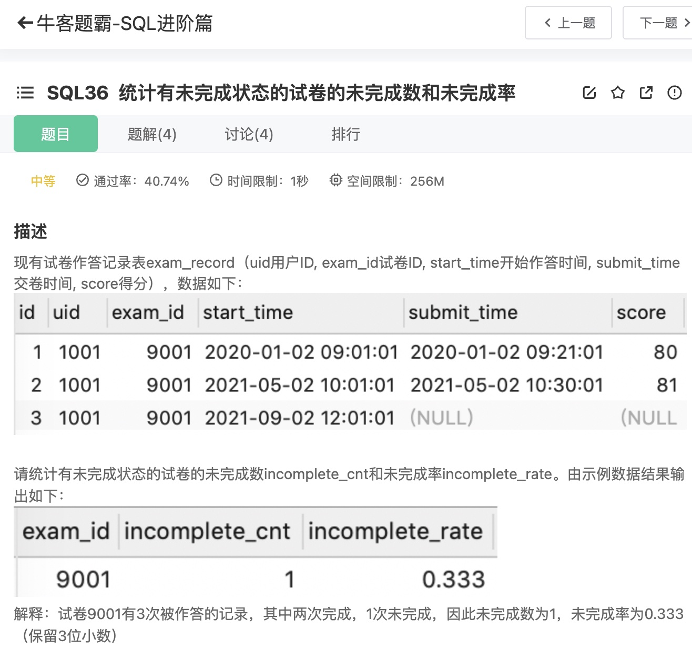
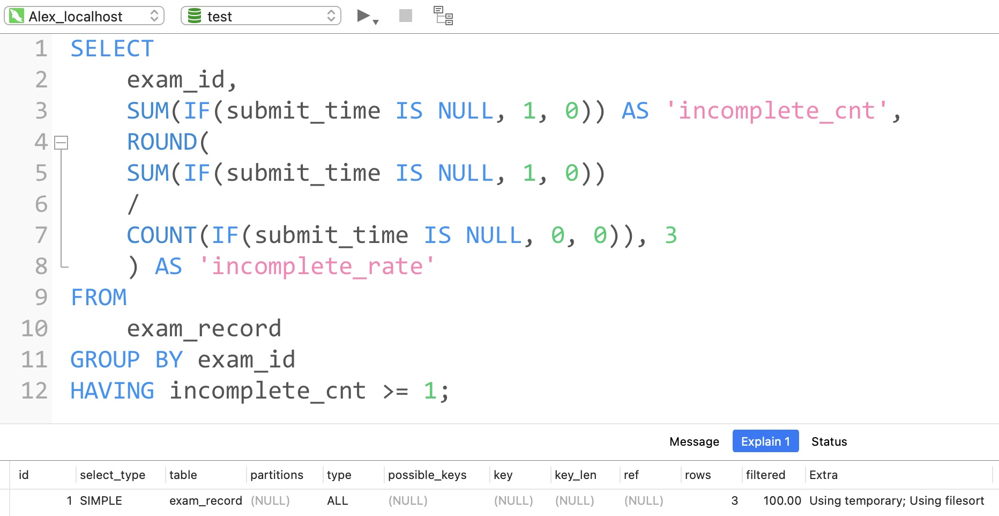
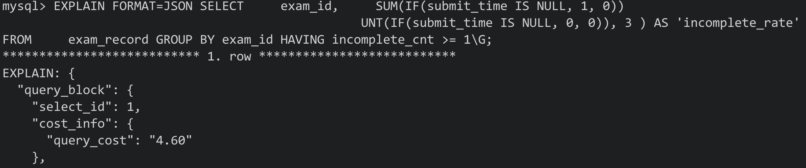
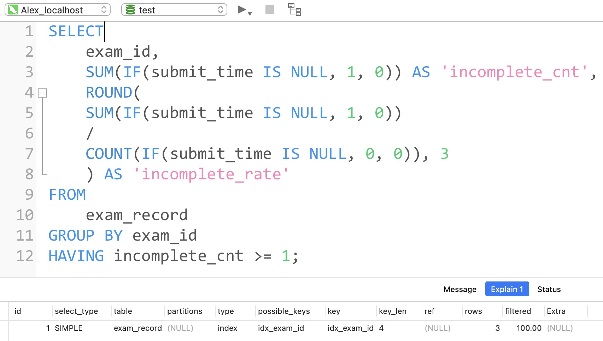
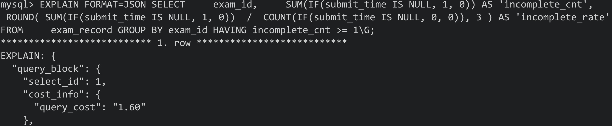

# Day121

## Tag: HAVING















题意:

给你一张试卷作答记录表，请你计算出其中未完成试卷的次数和未完成率


思路:

- 计算未完成数其实就是计算score或者submit_time为null的值的数量，所以我们只需要判断一下NULL再用SUM计数即可
- 而未完成率则需要在获取未完成数量的基础上，还需要除以所有的作答数，该数值不能简单地用COUNT，因为COUNT不计算NULL值，所以需要我们将NULL转换一下才行，最后记得用ROUND保留三位小数
- 在获取值之后进行分组，但最后需要注意，题目并不需要我们将没有未完成记录的试卷也查询出来，所以需要我们在分组后对未完成数进行限定，只取出该值≥1的数据，SQL如下

```mysql
SELECT
    exam_id,
    SUM(IF(submit_time IS NULL, 1, 0)) AS 'incomplete_cnt',
    ROUND(
		SUM(IF(submit_time IS NULL, 1, 0)) 
		/ 
		COUNT(IF(submit_time IS NULL, 0, 0)), 3
		) AS 'incomplete_rate'
FROM
    exam_record
GROUP BY exam_id
HAVING incomplete_cnt >= 1;
```


优化:

- 根据执行计划，最终需要使用临时表和文件排序，明显是因为最后的分组字段
- 所以在该字段上建立索引即可，可见文件排序和临时表都消失了，查询消耗直接降为1.60


