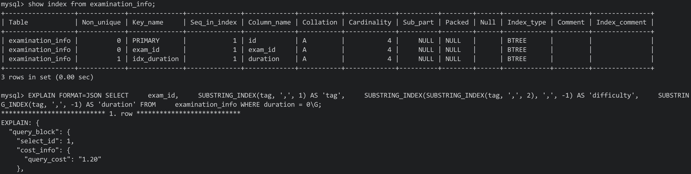
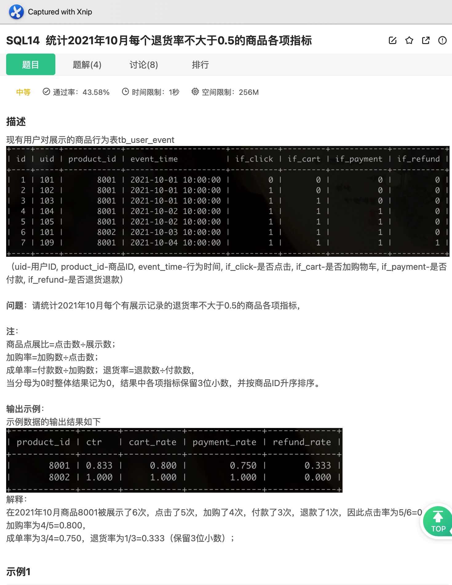

# Day121

## Tag: HAVING


题意:

给你一张试卷作答记录表，请你计算出其中未完成试卷的次数和未完成率


思路:

- 计算未完成数其实就是计算score或者submit_time为null的值的数量，所以我们只需要判断一下NULL再用SUM计数即可
- 而未完成率则需要在获取未完成数量的基础上，还需要除以所有的作答数，该数值不能简单地用COUNT，因为COUNT不计算NULL值，所以需要我们将NULL转换一下才行，最后记得用ROUND保留三位小数
- 在获取值之后进行分组，但最后需要注意，题目并不需要我们将没有未完成记录的试卷也查询出来，所以需要我们在分组后对未完成数进行限定，只取出该值≥1的数据，SQL如下

```mysql
SELECT
    exam_id,
    SUM(IF(submit_time IS NULL, 1, 0)) AS 'incomplete_cnt',
    ROUND(
		SUM(IF(submit_time IS NULL, 1, 0)) 
		/ 
		COUNT(IF(submit_time IS NULL, 0, 0)), 3
		) AS 'incomplete_rate'
FROM
    exam_record
GROUP BY exam_id
HAVING incomplete_cnt >= 1;
```


优化:

- 根据执行计划，最终需要使用临时表和文件排序，明显是因为最后的分组字段
- 所以在该字段上建立索引即可，可见文件排序和临时表都消失了，查询消耗直接降为1.60

****


# Day122

## Tag: IFNULL, TIMESTAMPDIFF


题意:

给你一张用户信息表，一张试卷信息表，一张作答记录表，请你查询出每个0级用户所有高难度题目的平均用时和平均分数，如果试卷未完成则按照默认时间和0分处理


思路:

- 求分数本身其实就是求出总分再除以总人数，但我们统计总分的时候需要考虑未完成的情况(分数为null)，所以要用IF来转换NULL值为0
- 统计总人数也是如此，使用IFNULL处理即可，给的值随意，只要不为null就都能被COUNT计算到，最外层记得用ROUND保留整数
- 在计算平均用时的时候也需要处理NULL值，正常计算用时则需要TIMESTAMPDIFF并制定单位为MINUTE，为null则用IFNULL设置为duration，记得最外层使用ROUND保留一位小数
- 最后连接三张表，写上剩余的限制条件即可，SQL如下

```mysql
SELECT
    t1.uid,
    ROUND(
			SUM(IF(t1.score IS NULL, 0, t1.score)) 
			/
			COUNT(IFNULL(t1.score IS NULL, 0)), 0
		) AS 'avg_score',
    ROUND(
			AVG(IFNULL(TIMESTAMPDIFF(MINUTE, t1.start_time, t1.submit_time), t2.duration)), 1
		) AS 'avg_time_took'
FROM
    exam_record AS t1
INNER JOIN examination_info AS t2 ON t1.exam_id = t2.exam_id
INNER JOIN user_info AS t3 ON t1.uid = t3.uid
WHERE t3.level = 0
AND t2.difficulty = 'hard'
GROUP BY t1.uid
```


优化:

- 由查询计划可知，查询消耗为5.33，最终驱动表为t3且只有t1使用了索引
- 在t3的Extra列中有Using where，说明最终需要回表，涉及到t3的列只有uid和level，其中uid上已经有了一个唯一键，所以我们在level上建立一个索引即可
- 查看查询计划，消耗降为了5.13，同样，我们也可以在examination_info上的difficulty列上建立索引，但效果差不多
- 但t1就比较难优化了，因为涉及到的列很多，想要强行走索引的话需要创建多个索引或者一个很大的联合索引

****


# Day123

## Tag: SUBSTRING_INDEX




题意:

给你一张试卷信息表，其中部分记录的试题类别tag、难度、时长被同时输入到了tag字段中，请你找出这些字段，并将它们正确拆分后列出


思路:

- 所谓的输入错误其实就是将多个字段值用","隔开后放到了同一个字段里，使用SUBSTRING_INDEX就能实现拆分
- 而确定这些字段可以根据difficulty(空字符长度为0)或者duration(为0)，SQL如下

```mysql
SELECT
    exam_id,
    SUBSTRING_INDEX(tag, ',', 1) AS 'tag',
    SUBSTRING_INDEX(SUBSTRING_INDEX(tag, ',', 2), ',', -1) AS 'difficulty',
    SUBSTRING_INDEX(tag, ',', -1) AS 'duration'
FROM
    examination_info
WHERE duration = 0;
```


优化:

- 由查询计划可知，最终的查询需要回表，且没有用到索引，查询消耗为1.80 
- 在WHERE子句中只有一个等值边界条件，所以很明显，在这个条件列上建立索引即可，此时消耗降为1.20
- 需要注意的是，MySQL5.7并不支持索引列以函数的形式出现，所以如果我们改为WHERE LENGTH(difficulty) = 0的话就不会用到索引了，除非通过虚拟列的方式，而MySQL8.0是支持函数索引的(也是通过虚拟列的方式)

****


# Day124

## Tag: CHAR_LENGTH


题意:

给你一张用户信息表，请你将其中用户昵称长度大于10个字符的用户查询出来，并根据昵称长度做相应的处理


思路:

- 统计字符串长度的时候下意识会想到用LENGTH函数，但这个函数在统计时会受到编码的影响，所以并不准确
- 因此我们需要换用CHAR_LENGTH，在处理时只需要判断长度是否大于13即可，大于则使用LEFT进行截断，再使用CONCAT进行拼接即可


SQL:

```mysql
SELECT
    uid,
    IF(CHAR_LENGTH(nick_name) > 13, CONCAT(LEFT(nick_name, 10), '...'), nick_name) AS 'nick_name'
FROM
    user_info
WHERE CHAR_LENGTH(nick_name) > 10;
```

****


# Day125

## Tag: UPPER, JOIN


题意:

给你一张试卷信息表，一张试卷作答表，请你查询出其中作答数小于3，且tag转换为大写后依然有数据的试卷信息和大写对应的作答数，tag转换为大写后无变化的则不需要查询出来


思路:

- 首先肯定是先找出作答数小于3的试卷了，而且还需要筛掉变为大写后无变化的数据，因此需要分组求和，大写转换则可以使用UPPER，SQL如下

SQL1

```mysql
SELECT
	t1.exam_id,
	t1.tag,
	COUNT( t2.start_time ) AS 'answer_cnt' 
FROM
	examination_info AS t1
INNER JOIN exam_record AS t2 ON t1.exam_id = t2.exam_id 
WHERE t1.tag != UPPER( t1.tag ) 
GROUP BY t1.exam_id, t1.tag
HAVING answer_cnt < 3 
```


- 之后需要寻找出其对应的大写数据，所以我们还需要查询出所有的作答记录，从中选取，SQL如下

SQL2

```mysql
SELECT
	t1.exam_id,
	t1.tag,
	COUNT( t2.start_time ) AS 'answer_cnt' 
FROM
	examination_info AS t1
INNER JOIN exam_record AS t2 ON t1.exam_id = t2.exam_id 
GROUP BY t1.exam_id, t1.tag
```


- 最后连接两张表，通过转换后的tag连接起来，并将对应的大写记录加起来，SQL如下


```mysql
SELECT
	t1.tag,
	SUM( t2.answer_cnt ) AS 'answer' 
FROM (
	SQL1
	) AS t1
INNER JOIN (
	SQL2
	) AS t2 ON UPPER( t1.tag ) = t2.tag 
GROUP BY t1.tag
```

****


# Day126

## Tag: TIMESTAMPDIFF


题意:

给你一张试卷信息表，一张用户信息表，一张试卷作答记录表，请你查询出求职方向为算法工程师，且注册当天就完成了算法类试卷的人，并按照考试的最高分进行排序。最后查询的结果应该分页显示，每页3条，需要你取出第3页


思路:

- 题目中的限制条件很少，求职方向只需要限制用户信息表的tag为算法即可，同样试卷的tag也限制为算法即可
- 但要限制为注册当天的话，要么使用YEAR，MONTH，DAY将注册试卷和提交时间进行等值匹配，要么使用日期差值函数，这里我们选择TIMESTAMPDIFF，将unit设置为HOUR即可，注意要加上绝对值
- 最高分就很简单的了，使用MAX后再分组就是了
- 最后分页其实就是跳过前两页的数据，每页3条，所以我们跳过前6条就行，使用OFFSET，再使用LIMIT限制3条数据，SQL如下

```mysql
SELECT
	t1.uid,
	t1.level,
	t1.register_time,
	MAX(t2.score) AS 'max_score'
FROM
	user_info AS t1
INNER JOIN exam_record AS t2 ON t1.uid = t2.uid
INNER JOIN examination_info AS t3 ON t2.exam_id = t3.exam_id
WHERE t1.job = '算法'
AND ABS(TIMESTAMPDIFF(HOUR, t1.register_time, t2.submit_time)) <= 24
AND t3.tag = '算法'
GROUP BY t1.uid
ORDER BY max_score DESC
LIMIT 3 OFFSET 6
```

****


# Day127

## Tag: UNION


题意:

给你一张用户信息表，一张题目练习记录表，一张试卷作答记录表，请你查询出其中用户名以"牛客"开头，以"号"结尾，成就值在1200到2500，且最近一次试卷获取或者题目活跃在2021年9月的用户信息


思路:

- 

- 需要注意的是，题目要求的是最近一次的活跃日期，所以需要我们先查询出每个用户最近一次的活跃日期才行，其实就是取试卷和题目作答记录中每个用户的最近一次日期，用MAX分组即可
- 两张表的话自然就需要连接了，SQL如下

SQL1

```mysql
SELECT
	uid
FROM (
	SELECT
		DISTINCT
		uid,
		submit_time AS 'last_time'
	FROM
		practice_record
	UNION
	SELECT
		uid,
		start_time AS 'last_time'
	FROM
		exam_record
	) AS t1
GROUP BY uid
HAVING LEFT(MAX(last_time), 7) = '2021-09'
```


- 之后用这张临时表作为uid字段的限制条件即可，其余条件就很简单了，SQL如下

```mysql
SELECT
	uid,
	nick_name,
	achievement
FROM
	user_info
WHERE nick_name LIKE '牛客%号'
AND achievement BETWEEN 1200 AND 2500
AND uid IN (
	SQL1
)
```

****


# Day128

## Tag: REGEXP, LIKE, AVG


题意:

给你一张用户信息表，一张试卷作答记录表，一张试卷信息表，请你查询出昵称以"牛客" + 纯数字 + "号"或者以纯数字组成的用户，在试卷类别以c(C/c)开头的已完成试卷中的平均id，最后按照用户id，平均分升序排列


思路:

- 在用户名的匹配上，我们可以使用LIKE进行模糊匹配，但这样只能勉强解决第一个，纯数字该怎么匹配呢？
- 这时候就需要正则表达式了，[0-9]表示任意数字，"*"表示将前面的表达式重复一次或多次
- 将这两个条件用OR连接起来即可
- 以c开头的话，使用LEFT取第一个字符即可，再统一转换为大写或者小写后与字母c比较即可
- 求平均值自然需要AVG，所以最后需要分组，需要注意的是，我们这里需要排除掉没有分数的记录，最后SQL如下

```mysql
SELECT
	t1.uid,
	t2.exam_id,
	ROUND(AVG(t2.score), 0) AS 'avg_score'
FROM
	user_info AS t1
INNER JOIN exam_record AS t2 ON t1.uid = t2.uid
INNER JOIN examination_info AS t3 ON t2.exam_id = t3.exam_id
WHERE t2.score IS NOT NULL
AND (t1.nick_name LIKE '牛客%号'
OR t1.nick_name REGEXP '^[0-9]*$')
AND UPPER(LEFT(t3.tag, 1)) = 'C'
GROUP BY t2.exam_id, t1.uid
ORDER BY t1.uid, avg_score
```

****


# Day129

## Tag: LAST_DAY, ROLL UP, IFNULL


题意:

给你一张刷题记录表，请你查询出其中每个月用户的刷题数量和每月中平均每天的刷题记录，最后再查询出一年中的刷题总数


思路:

- 在计算月份时，需要我们求出当月的天数，可以使用LAST_DAY获取对应日期的当月最后一天，再使用DAY获取天数
- 而月份格式则使用DATE_FORMAT即可，SQL如下

SQL1

```mysql
SELECT 
	DAY(LAST_DAY(submit_time)) AS days_of_month,
	DATE_FORMAT(submit_time, "%Y%m") AS month
FROM
	practice_record 
WHERE YEAR(submit_time) = '2021'
```


- 之后直接按照月份分组即可，但我们还需要计算出全年的总和
- 其实使用WITH ROLLUP就可以在最后一行获取总和，但获取的数据列为null
- 所以我们需要将null转换为我们需要的字段，使用IFNULL即可，SQL如下

```mysql
SELECT
	IFNULL( t1.month, '2021汇总' ) AS submit_month,
	COUNT( 1 ) AS month_q_cnt,
	ROUND( count( 1 ) / MAX( days_of_month ), 3 ) AS avg_day_q_cnt 
FROM ( 
	SQL1
	) AS t1 
GROUP BY t1.month
WITH ROLLUP
```

****


# Day130

## Tag: ROUND, IF


题意:

给你一张用户-视频互动表，一张短视频信息表，请你查询出其中有观看记录的视频的完播率


思路:

- 首先我们需要判断该视频是否完播，所以需要我们通过开始和结尾的时间与视频的时长进行判断，完播则记为1次
- 再除以总的观看视频数即可，注意限制年份，SQL如下

```mysql
SELECT
    t1.video_id,
    ROUND(
		SUM(IF((t1.end_time - t1.start_time - t2.duration) >= 0, 1, 0))
		/ 
		COUNT(t1.start_time), 3
		) AS 'avg_comp_play_rate'
FROM
    tb_user_video_log AS t1
INNER JOIN tb_video_info AS t2 ON t1.video_id = t2.video_id
WHERE YEAR(t1.start_time) = 2021
GROUP BY t1.video_id
ORDER BY avg_comp_play_rate DESC;
```

****


# Day131

## Tag: GROUP_CONCAT, CONCAT


题意:
给你一张试卷信息表，一张试卷作答记录表，请你查询出2021年每个未完成试卷数大于1的有效用户数据(有效用户指试卷完成数大于等于1，且未完成数小于5)，输出用户id、未完成试卷作答数、完成试卷作答数、作答过的试卷tag集合，最后按照未完成的试卷数倒序排列


思路:

- 未完成试卷数其实就是submit_time为null的记录数，完成数则统计submit_time不为null的即可，因此我们通过SUM和IF组合就可以计算这两个数据
- 比较麻烦的是detail字段，观察后发现用";"分隔的数据为日期 + ":" + tag，拼接字符串可以使用CONCAT，将连接符指定为":"即可
- 之后，这样的组合需要根据id分组，而每个id对应的数据又必须在同一个数据框内，所以需要使用GROUP_CONCAT，并指定SEPARATOR为";"
- 最后就是分组后查询了，使用HAVING即可，SQL如下

```mysql
SELECT
	t1.uid,
	SUM(IF(t1.submit_time IS NULL, 1, 0 )) AS 'incomplete_cnt',
	SUM(IF(t1.submit_time IS NULL, 0, 1 )) AS 'complete_cnt',
	GROUP_CONCAT(DISTINCT CONCAT(DATE_FORMAT(t1.start_time, '%Y-%m-%d' ), ':', t2.tag) SEPARATOR ';') AS 'detail'
FROM
	exam_record AS t1
INNER	JOIN examination_info AS t2 ON t1.exam_id = t2.exam_id 
WHERE YEAR (t1.start_time) = 2021 
GROUP BY t1.uid 
HAVING incomplete_cnt > 1 AND incomplete_cnt < 5 AND complete_cnt >= 1 
ORDER BY incomplete_cnt DESC
```

<hr>


# Day132

## Tag: CONCAT, TIMESTAMPDIFF, HAVING


题意:
给你一张视频-用户交互记录表，一张视频信息表，请你查询出每个视频分类中，平均播放进度大于60%的类别


思路:

- 求一条记录的播放进度很简单，使用TIMSTAMPDIFF获取end_time和start_time相差的时间，并除以视频时长即可，至于平均值，使用AVG就是了
- 但这里有所不同的是，需要判断观看时长是否超过了视频时长，如果超过了，则只能记为1
- 因此，我们需要先获取每条视频的观看时长，SQL如下

SQL:

```MYSQL
SELECT
	video_id,
	TIMESTAMPDIFF(SECOND, start_time, end_time) AS 'diff'
FROM
	tb_user_video_log;
```


- 之后通过IF判断diff和duration的大小关系，输出对应的值并取平均值，最后还需要保留两位小数并拼接上"%"
- 因为平均播放进度是在分组后获取的，所以想要限制该字段，则必须使用HAVING，SQL如下

```mysql
SELECT
	t1.tag,
	CONCAT(ROUND(AVG(IF(diff > t1.duration, 1, diff / t1.duration) * 100), 2), '%') AS 'avg_play_progress'
FROM
	tb_video_info AS t1
INNER JOIN (
	SQL1
	) AS t2 ON t1.video_id = t2.video_id
GROUP BY t1.tag
HAVING avg_play_progress > 60
ORDER BY avg_play_progress DESC
```

<hr>


# Day133

## Tag: IF, DISTINCT


题意:
给你一张试卷作答记录表，请你查询出其中作答的总次数、完成作答的次数、已经完成的试卷数


思路:

- 作答次数随便统计一个字段就行，完成的次数其实就是submit_time不为null的次数，使用COUNT可以排除null
- 最后一项则需要首先判断对应的submit_time或者score是否为null，只统计不为null的部分，且注意去重

<hr>


# Day134

## Tag: HAVING, Sub query


题意:

给你一张试卷信息表，一张试卷作答记录表，请你查询出其中月均作答数不小于3的用户作答不同类别试卷的次数，并按照次数倒序排列


思路:

- 首先我们需要查询出每个用户的月均作答数，并选出不小于3的
- 计算月均作答数其实就是总的作答数 / 月份数，月份数在题目中需要对submit_time字段进行处理，并且在统计时需要去重，最后分组后筛选即可所以SQL如下

SQL1:

```mysql
SELECT
	uid,
	COUNT(submit_time) / COUNT(DISTINCT DATE_FORMAT(submit_time, '%Y%m')) AS 'avg'
FROM
	exam_record
GROUP BY uid
HAVING avg >= 3;
```


- 下一步则将该表作为临时表，以tag分组，计算出每种试卷的作答次数即可，最后排序一下，SQL如下

```mysql
SELECT
    t1.tag,
    COUNT(t2.exam_id) AS 'tag_cnt'
FROM
    examination_info AS t1
INNER JOIN exam_record AS t2 ON t1.exam_id = t2.exam_id
INNER JOIN (
    SQL1
    ) AS t3 ON t2.uid = t3.uid
GROUP BY t1.tag
ORDER BY tag_cnt DESC
```

<hr>


# Day135

## Tag: TIMESTAMPDIFF


题意:

给你一张用户-视频互动表，一张视频信息表，请你计算出每类视频在近30天中的转发量和转发率


思路:

- 计算转发量只需要计算if_retweet字段即可
- 而转发率则需要用转发量除以视频的总数，我们同样可以通过计算if_retweet字段得到，不过需要使用COUNT而不是SUM
- 最后我们需要限制日期，因为题目要求为近30天，所以我们首先需要查询出最近的日期，SQL如下

SQL1:

```mysql
SELECT MAX(end_time) AS 'max' FROM tb_user_video_log
```


- 之后我们将其作为其中一个表，通过TIMESTAMPDIFF获取日期差值即可，SQL如下

```mysql
SELECT
    t1.tag,
    SUM(t2.if_retweet) AS 'retweet_cnt',
    ROUND(SUM(t2.if_retweet) / COUNT(t2.if_retweet), 3) AS 'retweet_rate'
FROM
    tb_video_info AS t1
INNER JOIN tb_user_video_log AS t2 ON t1.video_id = t2.video_id
INNER JOIN (
	SELECT MAX(end_time) AS 'max' FROM tb_user_video_log
) AS t3
WHERE TIMESTAMPDIFF(DAY, t2.end_time, t3.max) <= 30
GROUP BY t1.tag
ORDER BY retweet_rate DESC
```

// 牛客这道题目的判题系统有bug，本地运行明明好好的，一提交就报错

<hr>


# Day136

## Tag: SUM() OVER


题意:

给你一张用户视频互动表，一张短视频信息表，请你查询出2021年中每个创作者每月的涨粉率和当前的粉丝数


思路:

- 要求每月涨粉量自然需要根据月份来分组，在计算时还需要我们根据if_follow字段判断是掉粉还是涨粉，因此使用IF嵌套即可
- 而当前粉丝数需要单独排序，因为该字段所求的和是前几个月的粉丝总和，所以我们使用SUM的窗口函数
- 最后限制一下年份，写好分组顺序即可，SQL如下

```mysql
SELECT
    t2.author,
    DATE_FORMAT(t1.end_time, '%Y-%m') AS 'month',
    ROUND(SUM(IF(t1.if_follow = 1, 1, IF(t1.if_follow = 2, -1, 0))) / COUNT(end_time), 3) AS 'fans_growth_rate',
    SUM(SUM(IF(if_follow = 1, 1,0)) - SUM(IF(if_follow = 2, 1, 0))) OVER(
			PARTITION BY author 
			ORDER BY DATE_FORMAT(start_time,'%Y-%m')
		) AS 'total_fans'
FROM
    tb_user_video_log AS t1
INNER JOIN tb_video_info AS t2 ON t1.video_id = t2.video_id
WHERE YEAR(t1.end_time) = 2021
GROUP BY t2.author, month
ORDER BY t2.author, total_fans
```

<hr>


# Day137

## Tag: COUNT OVER()


题意:
给你一张用户信息表，一张试卷作答记录表，请你根据用户的等级查询出每个等级的用户在各个分数段中的占比数


思路:

- 这里的各个分数段需要按照具体的分数来区分，所以需要我们做判断，这里使用CASE WHEN或者IF都可以
- 但在统计占比时，需要用当前等级当前分数段的用户数 / 当前等级下的用户总数，如果之间分组的话，则分母不正确
- 所以我们需要先行查询出分母，并与等级和分数段对应，使用普通的GROUP BY的话需要创建临时表将总数结果和等级与分数段连接起来，效率较低
- 所以我们选择更简洁的COUNT() OVER窗口函数，SQL如下

SQL1

```mysql
SELECT
	t1.level,
	IF(t2.score < 60, '差', IF(t2.score < 75, '中', IF(t2.score < 90, '良', '优'))) AS 'score_grade',
	COUNT(t1.uid) OVER (
		PARTITION BY t1.level
	) AS 'total'
FROM
	user_info AS t1
INNER JOIN exam_record AS t2 ON t1.uid = t2.uid
WHERE t2.score IS NOT NULL
```


- 之后再使用这张临时表即可，SQL如下


```mysql
SELECT
	t1.level,
	t1.score_grade,
	ROUND(COUNT(t1.level) / t1.total, 3) AS 'ratio'
FROM (
SQL1
	) AS t1
GROUP BY t1.level, t1.score_grade
ORDER BY t1.level DESC, ratio DESC
```

<hr>


# Day138

## Tag: DATE_FORMAT, TIMESTAMPDIFF


题意:

给你一张用户行为日志表，请你查询出2021年11月中每个用户每天浏览文章的平均时长，单位为秒


思路:

- 很明显需要我们按照日期来分组，而计算的过程就是每日的时长之和 / 用户数
- 因此需要我们首先获取每条记录中观看文章的时长，再统计用户总数即可
- 最后再限定一下文章id和年月即可
- 注意这里不能使用AVG，因为记录中的用户有重复的，直接使用AVG的话结果回偏小，因为每日的用户数重复计算了，SQL如下

```mysql
SELECT
    DATE(in_time) AS 'dt',
    ROUND(SUM(TIMESTAMPDIFF(SECOND, in_time, out_time)) / COUNT(DISTINCT uid), 1) AS 'avg_view_len_sec'
FROM
    tb_user_log
WHERE artical_id != 0
AND DATE_FORMAT(in_time, '%Y-%m') = '2021-11'
GROUP BY dt
ORDER BY avg_view_len_sec
```

<hr>


# Day139

## Tag: UNION ALL, SUM() OVER, 


题意:

给你一张用户行为日志表，请你查询出每篇文章在同一时间的最大的观看人数，同一时间先计算进入的记录


思路:

- 该题目明显需要我们按照文章和时刻分组，然后求出各个时间内的人数后，再根据文章分组并求最大人数即可
- 然而进入和退出的时间在同一行中，不能好统计，所以可以先通过上下连接联合起来，SQL如下

SQL1:

```mysql
SELECT
		artical_id,
		in_time AS 'time',
		1 AS 'access'
FROM
		tb_user_log
WHERE artical_id != 0
UNION ALL
SELECT
		artical_id,
		out_time AS 'time',
		-1 AS 'access'
FROM
		tb_user_log
WHERE artical_id != 0
```


- 之后就需要按照文章id和时间分组了，但我们其实只需要文章id和每个时段的总数，并不需要时段
- 所以我们可以借助SUM窗口函数形式完成分组，SQL如下

SQL2

```mysql
SELECT
		artical_id,
		SUM(access) OVER (
				PARTITION BY artical_id
				ORDER BY time, access DESC
		) AS 'sum'
FROM (
	SQL1
		) AS t1
```


- 最后就是取出每个文章对应的最大阅读人数了，使用MAX或者MAX的窗口函数形式分组获取即可，SQL如下

```mysql
SELECT
    artical_id,
    MAX(sum) AS 'max_uv'
FROM (
	SQL2
) AS t1
GROUP BY artical_id
ORDER BY max_uv DESC
```

<hr>


# Day140

## Tag: UNION ALL, EXISTS


题意:

给你一张用户信息表，一张试卷作答记录表，当有任意一个0级用户未完成试卷数大于2时，输出每个0级用户的试卷未完成数和未完成率(保留3位小数)；如果不存在这样的数据，则查询出所有有作答记录用户的试卷未完成数和未完成率，结果按照未完成率升序排列


思路:

- 首先我们需要先根据条件尝试查询出满足条件的0级用户，简单的分组和指定null即可，SQL如下

SQL1:

```mysql
SELECT
	t1.uid,
	COUNT(DISTINCT t2.exam_id) AS 'uncomplete_count'
FROM
	user_info AS t1
INNER JOIN exam_record AS t2 ON t1.uid = t2.uid
WHERE t2.submit_time IS NULL AND t1.level = 0
GROUP BY t1.uid
HAVING uncomplete_count > 2
```


- 或者这里临时表之后，我们可以通过EXISTS判断该查询是否存在作为之后查询的依据
- 因为需要查询的部分有两个，且是对立的，所以我们使用UNION ALL连接起来就可以，两个查询中只会有一个有效
- 首先写出存在满足条件的0级用户时的查询，注意这里需要查询出所有0级用户的记录，所以要以用户表为准，因此要以用户表为驱动表，SQL如下

SQL2:

```mysql
SELECT
	t1.uid,
	COUNT(t2.start_time) - COUNT(t2.submit_time) AS 'incomplete_cnt',
	ROUND(IFNULL(SUM(IF(t2.submit_time IS NULL, 1, 0)) / COUNT(t2.start_time), 0), 3) AS 'incomplete_rate'
FROM
	user_info AS t1 
LEFT JOIN exam_record AS t2 ON t1.uid = t2.uid
WHERE EXISTS (
	SQL1
	)
AND t1.level = 0
GROUP BY t1.uid
```


- 部分人可能会有疑惑：计算未完成数时为什么不用SUM(IF)呢？这样只需要写submit_time这一个字段就行呀？
- 注意，这里我们写的是外连接，所以在IF处理null之前，其余未出现在记录表中的用户会与记录表连接存在submit_time为null的记录
- 如果按照SUM(IF)的方式计算未完成数，那么原本没有作答记录的用户也会被计算出对应的作答记录数


- 之后便是另一个部分，此时我们需要查询出所有有作答记录的用户数，所以此时我们应该使用内连接，并改为NOT EXISTS，且不设等级限制，SQL如下

SQL3

```mysql
SELECT
	t1.uid,
	COUNT(t2.start_time) - COUNT(t2.submit_time) AS 'incomplete_cnt',
	ROUND(IFNULL(SUM(IF(t2.submit_time IS NULL, 1, 0)) / COUNT(t2.start_time), 0), 3) AS 'incomplete_rate'
FROM
	user_info AS t1 
INNER JOIN exam_record AS t2 ON t1.uid = t2.uid
WHERE NOT EXISTS (
	SQL1
	)
GROUP BY t1.uid
```


- 最后上下连接两表，并对未完成率排序即可，SQL如下


```mysql
SQL2
UNION ALL
SQL3
ORDER BY incomplete_rate;
```


- 当然，如果MySQL版本为8.0及以上，可用使用CTE(common table expression)也就是所谓的公用表表达式
- 使用WITH AS创建一个公用表即可，这样能简洁很多

<hr>


# Day141

## Tag: HAVING


题意:

给你一张订单信息表，请你查询出2021年中每月大于10万的GMV值(已付款和未支付订单金额的总和)


思路:

- 首先肯定就是按照月份分组了，所以我们使用DATE_FORMAT或者LEFT取出对应的格式即可
- 而总金额就是total_amount字段的和了
- 之后限制条件中排除掉退款的记录并限制年份即可
- 注意GMV的限制应该在分组后进行，所以使用HAVING

<hr>


# Day142

## Tag: HAVING




题意:

给你一张用户对展示商品的行为表，请你查询出2021年10月中每个退货率不大于0.5的所有商品的各项指标


思路:

- 首先各项指标其实就根据给出的列和对各项指标的定义就能解决了，其中商品展示数就是这张表中出现的次数罢了
- 之后常规的限制日期，注意对退货率的限制是在分组之后，所以我们应该使用HAVING，SQL如下

```mysql
SELECT
    product_id,
    ROUND(SUM(if_click) / COUNT(event_time), 3) AS 'ctr',
    ROUND(SUM(if_cart) / SUM(if_click), 3) AS 'cart_rate',
    ROUND(SUM(if_payment) / SUM(if_cart), 3) AS 'payment_rate',
    ROUND(SUM(if_refund) / SUM(if_payment), 3) AS 'refund_rate'
FROM
    tb_user_event
WHERE YEAR(event_time) = 2021
AND MONTH(event_time) = 10
GROUP BY product_id
HAVING refund_rate <= 0.5
ORDER BY product_id
```

<hr>


# Day143

## Tag: RANK() OVER


题意:

给你一张消费者信息表，一张订单信息表，请你查询出每个用户最近的三笔订单，如果该用户总订单数小于3，则查询出其所有的订单即可


思路:

- 很明显，我们需要根据每个用户进行分组，之后将订单按照日期排序
- 但我们同时还需要订单日期和订单号，所以使用GROUP BY分组的话就不能一次性获取我们想要的字段
- 因此我们需要在排名的时候不影响到其他字段，所以窗口函数是最好的选择
- 我们可以使用RANK() OVER、DENSE_RANK()、ROW_NUM() OVER()，这三个只是在数值相同时，输出的排名有所差异而已，但都能满足我们的需求，因此SQL如下

SQL1:

```mysql
SELECT
	order_id,
	order_date,
	customer_id,
	RANK() OVER (
		PARTITION BY customer_id
		ORDER BY order_date DESC
	) AS 'rank'
FROM
	Orders
```


- 之后我们只需要简单的获取其中的字段并连接用户信息表即可，限制条件为排名小于等于3，最后注意排序字段的先后顺序即可，SQL如下

```mysql
SELECT
	t1.name AS 'customer_name',
	t2.customer_id,
	t2.order_id,
	t2.order_date
FROM
	Customers AS t1
INNER JOIN (
	SQL1
	) AS t2 ON t1.customer_id = t2.customer_id
WHERE t2.rank <= 3
ORDER BY customer_name, t2.customer_id, order_date DESC
```


