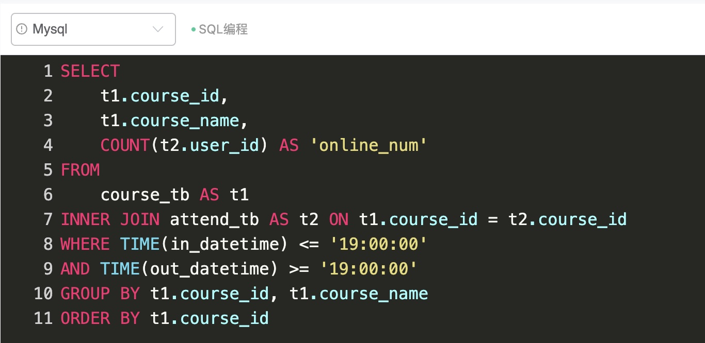
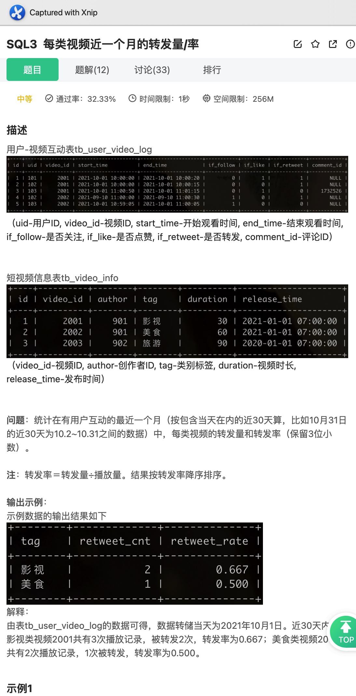
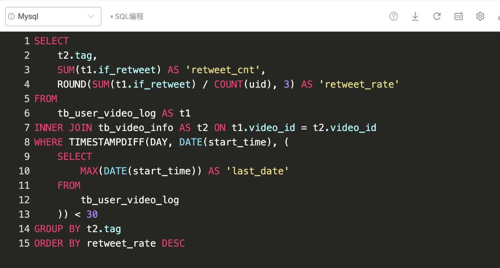

# Day171

## Tag: TIME




题意:

给你一张课程信息表，一张上课情况记录表，请你查询出每个课程在开始时在线的人数


思路:

- 因为需要每个课程分开来看，所以需要分组，而其中每个课程的上课时间都是固定的，
- 上课时间都是19:00，所以我们只需要限定学员在直播间的时间中有19:00即可，这里使用TIME函数，所以SQL如下

```mysql
SELECT
    t1.course_id,
    t1.course_name,
    COUNT(t2.user_id) AS 'online_num'
FROM
    course_tb AS t1
INNER JOIN attend_tb AS t2 ON t1.course_id = t2.course_id
WHERE TIME(in_datetime) <= '19:00:00'
AND TIME(out_datetime) >= '19:00:00'
GROUP BY t1.course_id, t1.course_name
ORDER BY t1.course_id
```

<hr>


# Day172

## Tag: TIMESTAMPDIFF






题意:

给你一张视频互动信息表，一张视频信息表，请你查询有用户互动的近一个月内，每类视频的转发量和转发率


思路:

- 转发量很好计算，统计if_retweet字段即可
- 同样的，转发率只需要使用转发量除以播放量即可
- 但问题是，如何限制日期在最近的一个月内呢？
- 首先，我们需要找出最近的日期，这里使用MAX即可，SQL如下

SQL1:

```mysql
SELECT
	MAX(DATE(start_time)) AS 'last_date'
FROM
	tb_user_video_log
```


有了最近日期后，我们只需要加以限制即可，这里我使用TIMESTAMPDIFF，当然使用其他函数也未尝不可，最终SQL如下

```mysql
SELECT
    t2.tag,
    SUM(t1.if_retweet) AS 'retweet_cnt',
    ROUND(SUM(t1.if_retweet) / COUNT(uid), 3) AS 'retweet_rate'
FROM
    tb_user_video_log AS t1
INNER JOIN tb_video_info AS t2 ON t1.video_id = t2.video_id
WHERE TIMESTAMPDIFF(DAY, DATE(start_time), (
    SQL1
    )) < 30
GROUP BY t2.tag
ORDER BY retweet_rate DESC
```


