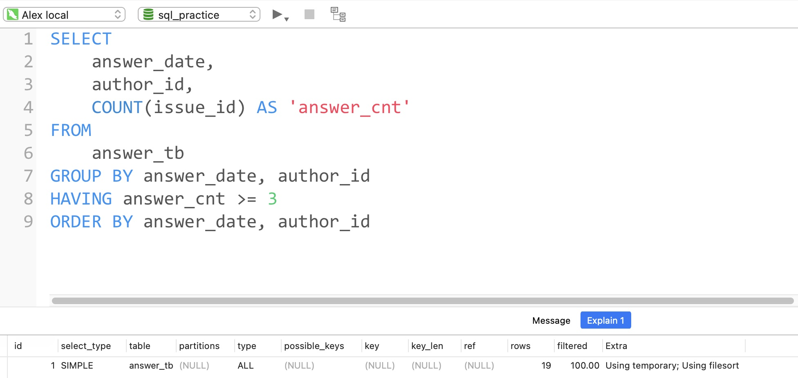

# Day171

## Tag: TIME


题意:

给你一张课程信息表，一张上课情况记录表，请你查询出每个课程在开始时在线的人数


思路:

- 因为需要每个课程分开来看，所以需要分组，而其中每个课程的上课时间都是固定的，
- 上课时间都是19:00，所以我们只需要限定学员在直播间的时间中有19:00即可，这里使用TIME函数，所以SQL如下

```mysql
SELECT
    t1.course_id,
    t1.course_name,
    COUNT(t2.user_id) AS 'online_num'
FROM
    course_tb AS t1
INNER JOIN attend_tb AS t2 ON t1.course_id = t2.course_id
WHERE TIME(in_datetime) <= '19:00:00'
AND TIME(out_datetime) >= '19:00:00'
GROUP BY t1.course_id, t1.course_name
ORDER BY t1.course_id
```

<hr>


# Day172

## Tag: TIMESTAMPDIFF


题意:

给你一张视频互动信息表，一张视频信息表，请你查询有用户互动的近一个月内，每类视频的转发量和转发率


思路:

- 转发量很好计算，统计if_retweet字段即可
- 同样的，转发率只需要使用转发量除以播放量即可
- 但问题是，如何限制日期在最近的一个月内呢？
- 首先，我们需要找出最近的日期，这里使用MAX即可，SQL如下

SQL1:

```mysql
SELECT
	MAX(DATE(start_time)) AS 'last_date'
FROM
	tb_user_video_log
```


有了最近日期后，我们只需要加以限制即可，这里我使用TIMESTAMPDIFF，当然使用其他函数也未尝不可，最终SQL如下

```mysql
SELECT
    t2.tag,
    SUM(t1.if_retweet) AS 'retweet_cnt',
    ROUND(SUM(t1.if_retweet) / COUNT(uid), 3) AS 'retweet_rate'
FROM
    tb_user_video_log AS t1
INNER JOIN tb_video_info AS t2 ON t1.video_id = t2.video_id
WHERE TIMESTAMPDIFF(DAY, DATE(start_time), (
    SQL1
    )) < 30
GROUP BY t2.tag
ORDER BY retweet_rate DESC
```

<hr>


# Day173

## Tag: ROUND, GROUP BY


题意:

给你一张课程信息表，一张用户行为表，请你查询出其中每种科目转换率(报名人数/浏览人数)


思路:

- 报名人数只需要统计if_sign字段即可，浏览人数则统计if_vw字段即可，SQL如下

```mysql
SELECT
    t1.course_id,
    t1.course_name,
    ROUND(100 * SUM(t2.if_sign) / COUNT(t2.if_vw), 2) AS 'sign_rate'
FROM
    course_tb AS t1
INNER JOIN behavior_tb AS t2 ON t1.course_id = t2.course_id
GROUP BY t1.course_id, t1.course_name
ORDER BY course_id
```

<hr>


# Day174

## Tag: TIMESTAMPDIFF, AVG


题意:

给一张课程信息表，一张课程参与表，请你查询出其中每个课程的平均时长(分钟)


思路:

- 首先，每个用户的参与时长为出入直播间的时间之差，这里我使用TIMESTAMPDIFF，然后使用AVG计算平均值
- 剩余部分就比较常规了，所以SQL如下

```mysql
SELECT
    t1.course_name,
    ROUND(AVG(TIMESTAMPDIFF(MINUTE, t2.in_datetime, t2.out_datetime)), 2) AS 'avg_Len'
FROM
    course_tb AS t1
INNER JOIN attend_tb AS t2 ON t1.course_id = t2.course_id
GROUP BY t1.course_name
ORDER BY avg_Len DESC
```

<hr>


# Day175

## Tag: IF


题意:
给你一张创作者信息表，一张回答信息表，请你查询出高质量回答中，不同等级的用户对应的数量


思路:

- 因为需要根据等级来分组，所以我们需要对作者等级author_level字段做简单的逻辑判断，可以使用CASE WHEN，也可以使用IF，个人比较懒，所以就用IF了
- 至于高质量回答，则限制char_len字段即可，最后注意分组和排序，SQL如下

```mysql
SELECT
    IF(t1.author_level <= 2, '1-2级', IF(t1.author_level >= 5, '5-6级', '3-4级')) AS 'level_cnt',
    COUNT(t2.author_id) AS 'num'
FROM
    author_tb AS t1
INNER JOIN answer_tb AS t2 ON t1.author_id = t2.author_id
WHERE char_len >= 100
GROUP BY level_cnt
ORDER BY num DESC
```


优化:

MySQL版本为5.7.10


优化前:

- 使用EXPLAIN查看执行计划，由于原表中没有创建任何索引，所以Extra字段中出现了"Using where"，即需要回表到server层中再做判断
- 又因为我们使用了ORDER BY进行排序，所以Extra字段中又出现了"Using filesort"，又因为排序时没有用到索引，所以需要使用临时表，因此Extra字段中出现了"Using temporary"
- 最后，因为两表需要连接且需要多次访问驱动表，为了减少I/O，MySQL默认使用了join buffer来一次性加载多条驱动表记录，方便与其他表匹配
- 再使用EXPLAIN FORMAT=JSON查看其查询开销，发现当前开销为18.46


分析:

- 从Extra列中的信息来看，我们可以尝试将回表操作变为走覆盖索引，其中两表连接时使用了字段author_id，而t2表又用到了char_len字段，所以我们可以尝试用这两个字段建立一个联合索引，这样t2表就能走覆盖索引了

- 此时查看执行计划，果然t2表中的"Using temporary"消失了，变为了"Using index"，说明执行计划使用了我们的联合索引，此时再查看开销，发现已经降为了16.81！


- t2表搞定了，那么t1表呢？首先肯定是对连接字段author_id创建索引
- 由于排序时没有使用索引，所以还是用到了临时表和文件排序
- 正常思路来看，一般都会想到在分组字段和排序字段上创建索引，但这里没这么简单
- 因为排序的字段是一个聚合函数表达式，不是表中的既存字段
- 那么就没办法了吗？有的朋友可能会想到函数索引，也就是借助虚拟列来创建函数索引，其中COUNT(t2.author_id)是没办法的，因为它需要分组，所以不考虑
- 但level_cnt可以考虑一下，因此我们可以在author_tb创建一个虚拟列，DDL语句如下

```mysql
ALTER TABLE author_tb ADD level_cnt varchar(10) AS (IF(t1.author_level <= 2, '1-2级', IF(t1.author_level >= 5, '5-6级', '3-4级')));
```

- 此时表结构如下


- 此时我们再对该虚拟列创建一个索引即可，这时再看查询计划和开销: 优化了个寂寞，查询计划只用到了我们创建的author_id索引，幸好查询开销降为了12.40！
- 那就这样吧，还是太菜了...


虚拟列的官方文档说明:

[MySQL :: MySQL 5.7 Reference Manual :: 13.1.18.7 CREATE TABLE and Generated Columns](https://dev.mysql.com/doc/refman/5.7/en/create-table-generated-columns.html)

<hr>


# Day176

## Tag: HAVING




题意:

给你一张回答记录表，请你查询出其中单日回答数大于等于3的所有用户信息


思路:

- 

- 因为需要限制的是回答数是分组后的的信息，所以我们需要在分组后使用HAVING，SQL如下

```mysql
SELECT
    answer_date,
    author_id,
    COUNT(issue_id) AS 'answer_cnt'
FROM
    answer_tb
GROUP BY answer_date, author_id
HAVING answer_cnt >= 3
ORDER BY answer_date, author_id
```


优化:

MySQL版本为5.7.10，数据基于牛客网的示例


分析:

- 首先原表中没有任何索引，又因为我们需要分组和排序，所以用到了临时表和文件排序，因此Extra中有"Using temporary"和"Using filesort"
- 此时查询计划使用的是全表扫描，查询开销为23.80


思考:

- 既然是因分组和排序而起，那么在这两个字段上创建索引不就行了？
- 其实不然，因为分组和排序的字段是有先后顺序的，而如果两个字段的索引是独立的，那么在使用除第一个字段外的字段索引时是很低效的(会重复扫描)，此时索引会失效
- 因此，我们应该根据顺序创建一个联合索引，此时查看执行计划发现Extra字段变为了null，再查看查询开销发现降为了4.80!


<hr>


# Day177

## Tag: Sub Query


题意:

给你一张题目信息表，一个回答情况表，请你查询出其中回答过教育类问题的用户中，回答过职场问题的用户数量


思路:

- 因为在统计前，我们需要对用户回答过的问题类型进行限制，而这个限制本身又有个条件(即在回答过教育类的用户中去查询)
- 因此我们首先应该为这个限制，获取对应的记录，因此我们需要先查询出所有回答过教育类问题的用户，SQL如下

SQL1:

```mysql
SELECT
	t2.author_id
FROM
	issue_tb AS t1
INNER JOIN answer_tb AS t2 ON t1.issue_id = t2.issue_id
WHERE t1.issue_type = 'Education'
```


- 将该查询结果作为条件之一，再统计用户数量即可，SQL如下

```mysql
SELECT
    COUNT(DISTINCT t2.author_id) AS 'num'
FROM
    issue_tb AS t1
INNER JOIN answer_tb AS t2 ON t1.issue_id = t2.issue_id
WHERE t2.author_id IN (
    SQL1
    )
AND t1.issue_type = 'Career';
```


优化:

- 按照惯例查看执行计划，因为没有索引，所以全为全表扫描
- 此时开销为21.38


分析:

- 对于没有任何索引的表(其实还是有隐藏列的)，我们可以利用《阿里巴巴Java开发手册》中对索引的约束，对两表连接的字段添加索引
- 所以我们对两表的issue_id添加索引，再为answer_tb中的author_id字段添加索引
- 为什么不为issue_type建立索引呢？首先，这个字段在表中的区分度并不高，就算加上，也作用不大，甚至会起反作用(各位可以去试试)
- 优化后，我们再次查看开销，降为了13.50


