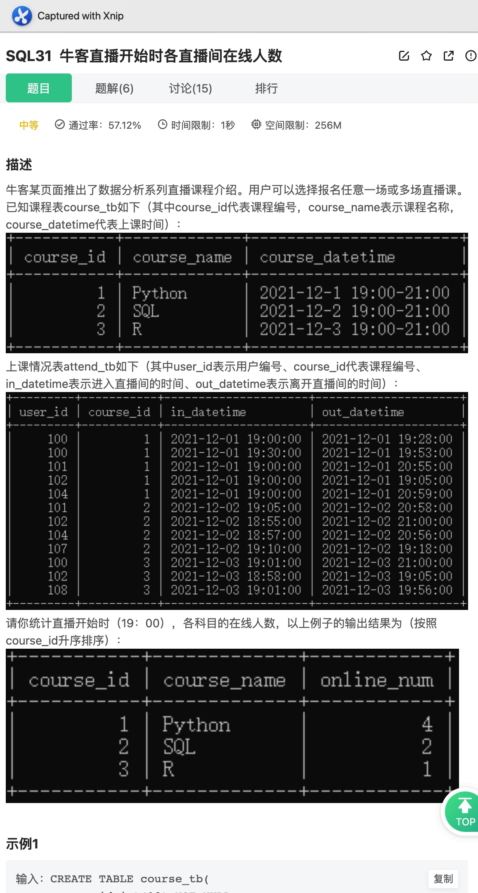
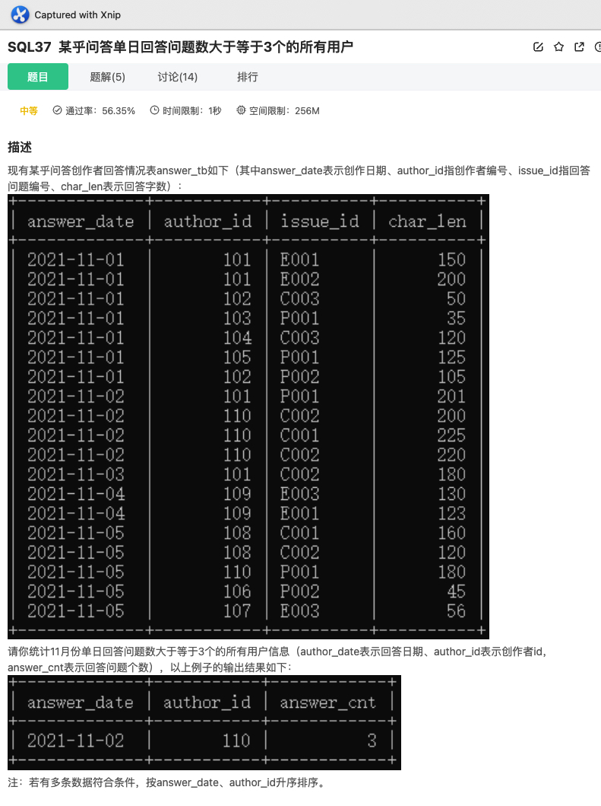
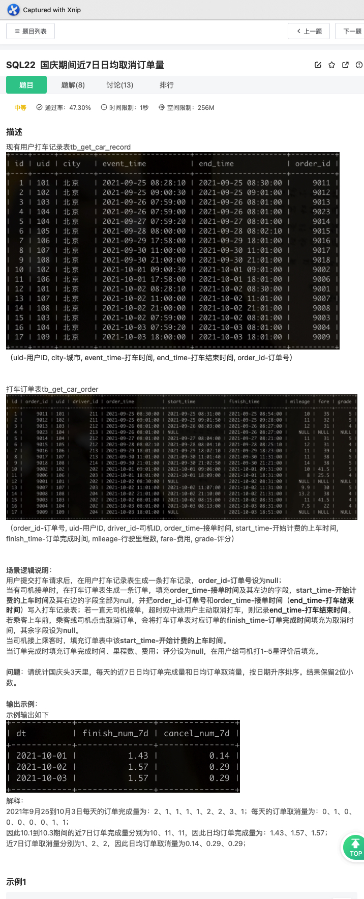
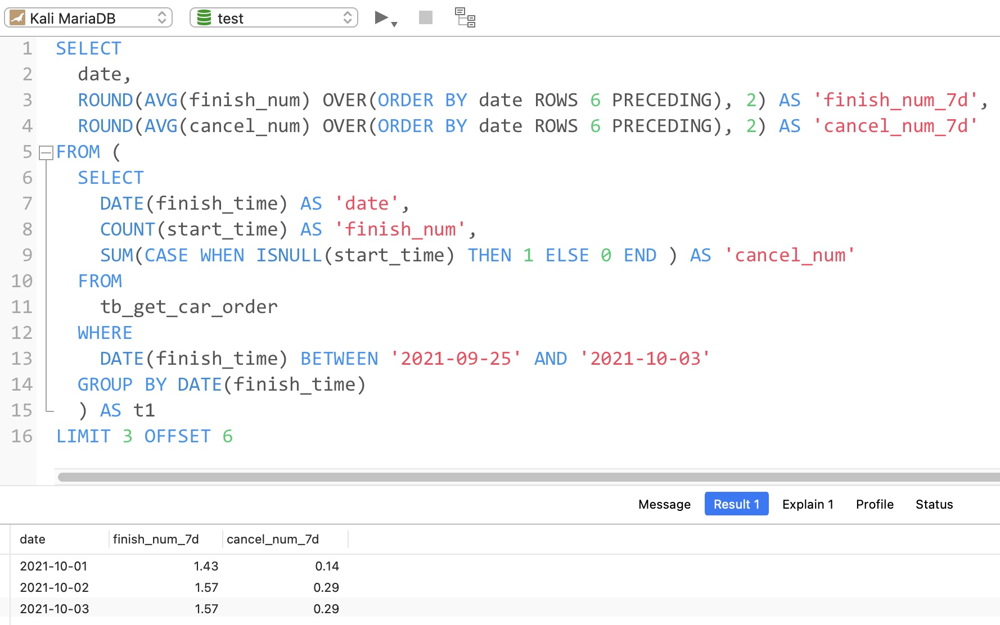

# Day171

## Tag: TIME




题意:

给你一张课程信息表，一张上课情况记录表，请你查询出每个课程在开始时在线的人数


思路:

- 因为需要每个课程分开来看，所以需要分组，而其中每个课程的上课时间都是固定的，
- 上课时间都是19:00，所以我们只需要限定学员在直播间的时间中有19:00即可，这里使用TIME函数，所以SQL如下

```mysql
SELECT
    t1.course_id,
    t1.course_name,
    COUNT(t2.user_id) AS 'online_num'
FROM
    course_tb AS t1
INNER JOIN attend_tb AS t2 ON t1.course_id = t2.course_id
WHERE TIME(in_datetime) <= '19:00:00'
AND TIME(out_datetime) >= '19:00:00'
GROUP BY t1.course_id, t1.course_name
ORDER BY t1.course_id
```

<hr>


# Day172

## Tag: TIMESTAMPDIFF


题意:

给你一张视频互动信息表，一张视频信息表，请你查询有用户互动的近一个月内，每类视频的转发量和转发率


思路:

- 转发量很好计算，统计if_retweet字段即可
- 同样的，转发率只需要使用转发量除以播放量即可
- 但问题是，如何限制日期在最近的一个月内呢？
- 首先，我们需要找出最近的日期，这里使用MAX即可，SQL如下

SQL1:

```mysql
SELECT
	MAX(DATE(start_time)) AS 'last_date'
FROM
	tb_user_video_log
```


有了最近日期后，我们只需要加以限制即可，这里我使用TIMESTAMPDIFF，当然使用其他函数也未尝不可，最终SQL如下

```mysql
SELECT
    t2.tag,
    SUM(t1.if_retweet) AS 'retweet_cnt',
    ROUND(SUM(t1.if_retweet) / COUNT(uid), 3) AS 'retweet_rate'
FROM
    tb_user_video_log AS t1
INNER JOIN tb_video_info AS t2 ON t1.video_id = t2.video_id
WHERE TIMESTAMPDIFF(DAY, DATE(start_time), (
    SQL1
    )) < 30
GROUP BY t2.tag
ORDER BY retweet_rate DESC
```

<hr>


# Day173

## Tag: ROUND, GROUP BY


题意:

给你一张课程信息表，一张用户行为表，请你查询出其中每种科目转换率(报名人数/浏览人数)


思路:

- 报名人数只需要统计if_sign字段即可，浏览人数则统计if_vw字段即可，SQL如下

```mysql
SELECT
    t1.course_id,
    t1.course_name,
    ROUND(100 * SUM(t2.if_sign) / COUNT(t2.if_vw), 2) AS 'sign_rate'
FROM
    course_tb AS t1
INNER JOIN behavior_tb AS t2 ON t1.course_id = t2.course_id
GROUP BY t1.course_id, t1.course_name
ORDER BY course_id
```

<hr>


# Day174

## Tag: TIMESTAMPDIFF, AVG


题意:

给一张课程信息表，一张课程参与表，请你查询出其中每个课程的平均时长(分钟)


思路:

- 首先，每个用户的参与时长为出入直播间的时间之差，这里我使用TIMESTAMPDIFF，然后使用AVG计算平均值
- 剩余部分就比较常规了，所以SQL如下

```mysql
SELECT
    t1.course_name,
    ROUND(AVG(TIMESTAMPDIFF(MINUTE, t2.in_datetime, t2.out_datetime)), 2) AS 'avg_Len'
FROM
    course_tb AS t1
INNER JOIN attend_tb AS t2 ON t1.course_id = t2.course_id
GROUP BY t1.course_name
ORDER BY avg_Len DESC
```

<hr>


# Day175

## Tag: IF


题意:
给你一张创作者信息表，一张回答信息表，请你查询出高质量回答中，不同等级的用户对应的数量


思路:

- 因为需要根据等级来分组，所以我们需要对作者等级author_level字段做简单的逻辑判断，可以使用CASE WHEN，也可以使用IF，个人比较懒，所以就用IF了
- 至于高质量回答，则限制char_len字段即可，最后注意分组和排序，SQL如下

```mysql
SELECT
    IF(t1.author_level <= 2, '1-2级', IF(t1.author_level >= 5, '5-6级', '3-4级')) AS 'level_cnt',
    COUNT(t2.author_id) AS 'num'
FROM
    author_tb AS t1
INNER JOIN answer_tb AS t2 ON t1.author_id = t2.author_id
WHERE char_len >= 100
GROUP BY level_cnt
ORDER BY num DESC
```


优化:

MySQL版本为5.7.10


优化前:

- 使用EXPLAIN查看执行计划，由于原表中没有创建任何索引，所以Extra字段中出现了"Using where"，即需要回表到server层中再做判断
- 又因为我们使用了ORDER BY进行排序，所以Extra字段中又出现了"Using filesort"，又因为排序时没有用到索引，所以需要使用临时表，因此Extra字段中出现了"Using temporary"
- 最后，因为两表需要连接且需要多次访问驱动表，为了减少I/O，MySQL默认使用了join buffer来一次性加载多条驱动表记录，方便与其他表匹配
- 再使用EXPLAIN FORMAT=JSON查看其查询开销，发现当前开销为18.46


分析:

- 从Extra列中的信息来看，我们可以尝试将回表操作变为走覆盖索引，其中两表连接时使用了字段author_id，而t2表又用到了char_len字段，所以我们可以尝试用这两个字段建立一个联合索引，这样t2表就能走覆盖索引了

- 此时查看执行计划，果然t2表中的"Using temporary"消失了，变为了"Using index"，说明执行计划使用了我们的联合索引，此时再查看开销，发现已经降为了16.81！


- t2表搞定了，那么t1表呢？首先肯定是对连接字段author_id创建索引
- 由于排序时没有使用索引，所以还是用到了临时表和文件排序
- 正常思路来看，一般都会想到在分组字段和排序字段上创建索引，但这里没这么简单
- 因为排序的字段是一个聚合函数表达式，不是表中的既存字段
- 那么就没办法了吗？有的朋友可能会想到函数索引，也就是借助虚拟列来创建函数索引，其中COUNT(t2.author_id)是没办法的，因为它需要分组，所以不考虑
- 但level_cnt可以考虑一下，因此我们可以在author_tb创建一个虚拟列，DDL语句如下

```mysql
ALTER TABLE author_tb ADD level_cnt varchar(10) AS (IF(t1.author_level <= 2, '1-2级', IF(t1.author_level >= 5, '5-6级', '3-4级')));
```

- 此时表结构如下


- 此时我们再对该虚拟列创建一个索引即可，这时再看查询计划和开销: 优化了个寂寞，查询计划只用到了我们创建的author_id索引，幸好查询开销降为了12.40！
- 那就这样吧，还是太菜了...


虚拟列的官方文档说明:

[MySQL :: MySQL 5.7 Reference Manual :: 13.1.18.7 CREATE TABLE and Generated Columns](https://dev.mysql.com/doc/refman/5.7/en/create-table-generated-columns.html)

<hr>


# Day176

## Tag: HAVING




题意:

给你一张回答记录表，请你查询出其中单日回答数大于等于3的所有用户信息


思路:

- 

- 因为需要限制的是回答数是分组后的的信息，所以我们需要在分组后使用HAVING，SQL如下

```mysql
SELECT
    answer_date,
    author_id,
    COUNT(issue_id) AS 'answer_cnt'
FROM
    answer_tb
GROUP BY answer_date, author_id
HAVING answer_cnt >= 3
ORDER BY answer_date, author_id
```


优化:

MySQL版本为5.7.10，数据基于牛客网的示例


分析:

- 首先原表中没有任何索引，又因为我们需要分组和排序，所以用到了临时表和文件排序，因此Extra中有"Using temporary"和"Using filesort"
- 此时查询计划使用的是全表扫描，查询开销为23.80


思考:

- 既然是因分组和排序而起，那么在这两个字段上创建索引不就行了？
- 其实不然，因为分组和排序的字段是有先后顺序的，而如果两个字段的索引是独立的，那么在使用除第一个字段外的字段索引时是很低效的(会重复扫描)，此时索引会失效
- 因此，我们应该根据顺序创建一个联合索引，此时查看执行计划发现Extra字段变为了null，再查看查询开销发现降为了4.80!


<hr>


# Day177

## Tag: Sub Query


题意:

给你一张题目信息表，一个回答情况表，请你查询出其中回答过教育类问题的用户中，回答过职场问题的用户数量


思路:

- 因为在统计前，我们需要对用户回答过的问题类型进行限制，而这个限制本身又有个条件(即在回答过教育类的用户中去查询)
- 因此我们首先应该为这个限制，获取对应的记录，因此我们需要先查询出所有回答过教育类问题的用户，SQL如下

SQL1:

```mysql
SELECT
	t2.author_id
FROM
	issue_tb AS t1
INNER JOIN answer_tb AS t2 ON t1.issue_id = t2.issue_id
WHERE t1.issue_type = 'Education'
```


- 将该查询结果作为条件之一，再统计用户数量即可，SQL如下

```mysql
SELECT
    COUNT(DISTINCT t2.author_id) AS 'num'
FROM
    issue_tb AS t1
INNER JOIN answer_tb AS t2 ON t1.issue_id = t2.issue_id
WHERE t2.author_id IN (
    SQL1
    )
AND t1.issue_type = 'Career';
```


优化:

- 按照惯例查看执行计划，因为没有索引，所以全为全表扫描
- 此时开销为21.38


分析:

- 对于没有任何索引的表(其实还是有隐藏列的)，我们可以利用《阿里巴巴Java开发手册》中对索引的约束，对两表连接的字段添加索引
- 所以我们对两表的issue_id添加索引，再为answer_tb中的author_id字段添加索引
- 为什么不为issue_type建立索引呢？首先，这个字段在表中的区分度并不高，就算加上，也作用不大，甚至会起反作用(各位可以去试试)
- 优化后，我们再次查看开销，降为了13.50


<hr>


# Day178

## Tag: CAST, SUBSTRING_INDEX


题意:

给你一张产品信息表，一张订单明细表，一张订单总表，请你查询出901店铺2021年10月份以来所有毛利率大于24.9%的商品信息和店铺的整体毛利率


思路:

- 既然需要商品和店铺两种，那么我们直接将问题分为两个部分不就行了？所以我们可以先行查询店铺的整体毛利率
- 因为店铺毛利率 = (1 - 总进价成本 / 总销售成本) * 100%，所以我们应该求出卖出的商品进价总和以及销售总和(两者对应的商品数量应该一致)，而最终结果的"%"符号则只需要使用CONCAT进行连接即可，所以SQL如下

SQL1

```mysql
SELECT
	'店铺汇总' AS 'product_id',
	CONCAT(ROUND(100 * (1 - (SUM(t1.in_price * t2.cnt) / SUM(t2.price * t2.cnt))), 1), '%') AS 'profit_rate'
FROM
	tb_product_info AS t1
INNER JOIN tb_order_detail AS t2 ON t1.product_id = t2.product_id
INNER JOIN tb_order_overall AS t3 ON t2.order_id = t3.order_id
WHERE t1.shop_id = 901
AND DATE(t3.event_time) >= '2021-10-01'
```


- 剩下的就是单个商品了，我们采用类似的方法即可，注意这里的毛利率需要基于单价计算
- 问题是，在获取901店铺每个商品的毛利率后，怎么筛选出毛利率大于24.9%的呢？此时我们的SQL为

SQL2

```mysql
SELECT
	t1.product_id,
	CONCAT(ROUND(100 * (1 - t1.in_price / AVG(t2.price)), 1), '%') AS 'profit_rate'
FROM
	tb_product_info AS t1
INNER JOIN tb_order_detail AS t2 ON t1.product_id = t2.product_id
INNER JOIN tb_order_overall AS t3 ON t2.order_id = t3.order_id
WHERE t1.shop_id = 901
AND DATE(t3.event_time) >= '2021-10-01'
GROUP BY t1.product_id
```


- 直接在HAVING中使用profit_rate吗？profit_rate是CONCAT连接后的结果，它是一个字符串呀，不能与数字直接比较，那咋办？类型转换？但它还带有一个"%"呀
- 不怕，我们可以先使用SUBSTRING_INDEX分割出数字部分，再使用CAST将其转换为DECIMAL类型即可，最终SQL如下

```mysql
SQL1
UNION ALL
SQL2
HAVING CAST(SUBSTRING_INDEX(profit_rate, '%', 1) AS DECIMAL(3, 1)) > 24.9
```


- 其他题解中用到了ROLLUP，在MySQL8.0确实没问题，但在MySQL5.7中ROLLUP和ORDER BY不能一起使用，因此我这里并未选择ROLLUP


官方文档:


<hr>


# Day179

## Tag: COUNT() OVER, TIMESTAMPDIFF


题意:

给你一张产品信息表，一张订单明细表，一张订单总表，请你查询出近90天中，所有零食类商品中复购率最高的商品


思路:

- 首先，对日期的限制是在最近一天的基础上的，所以我们应该先查询出最近一天的日期值，SQL如下

SQL1

```mysql
SELECT
	MAX(event_time) AS 'last_date'
FROM
	tb_order_overall
```


- 有了日期基准后，我们再获取每个用户对应购买每种产品的次数即可
- 获取购买次数的时候可以使用窗口函数，也可以使用GROUP BY，SQL如下

SQL2

```mysql
SELECT
		DISTINCT t1.uid,
		t2.product_id,
		COUNT(t2.product_id) OVER(
				PARTITION BY t1.uid, t2.product_id
		) AS 'purchase_time'
FROM
		tb_order_overall AS t1
INNER JOIN tb_order_detail AS t2 ON t1.order_id = t2.order_id
INNER JOIN tb_product_info AS t3 ON t2.product_id = t3.product_id AND t3.tag = '零食'
WHERE TIMESTAMPDIFF(DAY, t1.event_time, (
		SQL1
		)) < 90
```


- 之后根据购买次数统计对应的次数即可，最终SQL如下

```mysql
SELECT
    product_id,
    ROUND(SUM(IF(purchase_time = 2, 1, 0)) / COUNT(DISTINCT uid), 3) AS 'repurchase_rate'
FROM (
	SQL2
    ) AS t1
GROUP BY product_id
ORDER BY repurchase_rate DESC, product_id
LIMIT 3
```

<hr>


# Day180

## Tag: HAVING


题意:

给你一张用户打车记录表，和一张打车记录表，请你查询出2021年国庆7天期间，在北京接单至少三次的司机平均的接单数和平均兼职收入


思路:

- 首先，我们需要查询出的是每个司机的平均接单数和平均的兼职收入，但每个司机的接单数和收入不是既存字段，所以我们需要先获取这两个数据才行
- 获取这两个数据的同时，我们也要限制订单的时间和接单地点，并在分组后筛选出接单数大于3的，SQL如下

SQL1

```mysql
SELECT
	t1.driver_id,
	COUNT(t1.order_id) AS 'order_num',
	SUM(t1.fare) AS 'income'
FROM
	tb_get_car_order AS t1
	INNER JOIN tb_get_car_record AS t2 ON t1.order_id = t2.order_id
WHERE DATE(finish_time) BETWEEN '2021-10-01' AND '2021-10-07'
AND t2.city = '北京'
GROUP BY driver_id
HAVING COUNT(t1.order_id) >= 3
```


- 有了这两个字段后，我们再统计平均接单数和收入即可，SQL如下

```mysql
SELECT
    '北京' AS 'city',
    ROUND(AVG(t1.order_num), 3) AS 'avg_order_num',
    ROUND(AVG(t1.income), 3) AS 'avg_income'
FROM (
    SQL1
    ) AS t1
```


优化:

- 查看执行计划的开销: 10.50
- 由于我们使用了子查询，而子查询的数据量较大，所以这里使用了物化表(将子查询结果放到临时表中，并建立哈希(较少)/B+索引(较多))，因此后面两个表的select_type为DERIVED，且PRIMARY表的表名为derived2
- 今天借着这单题整点花活: MySQL5.7的隐式排序(implicit sort)，即MySQL5.7中会在GROUP BY后面默认为分组字段加上一个排序(2019.4在MySQL8.0中已经移除)
- 因此，明明没有写ORDER BY，但我们的执行计划Extra中有一个"Using filesort"
- 其余的"Using where"、"Using temporary"和"Using join buffer"就比较常规了，即临时表分组，回表和存储驱动表记录的join buffer


分析

- 先从解决隐式排序开始，我们其实并不需要排序，所以这里我们使用ORDER BY NULL来避免排序，相应的再加上对应的索引，不过对应数据量少，开销并未减少


官方文档:


<hr>


# Day181

## Tag: WITH ROLLUP


题意:

给你一张用户打车记录表，一张打车订单表，请你查询出2021年10月有过取消订单的司机中，所有已经完成的订单对应的平均评分和司机的整体评分


思路:

- 因为分为整体和各个司机两个部分，因此我们可以使用UNION ALL连接两个SQL来获取结果
- 但这里我们可以使用ROLLUP，ROLLUP会统计出整体的数据，但其分组字段为NULL，因此我们对分组字段(这里是driver_id)进行判断，就能分为单个司机和整体
- 但在这之前，我们需要获取对应的driver_id，SQL如下

SQL1

```mysql
SELECT
	driver_id
FROM
	tb_get_car_order
WHERE DATE(finish_time) BETWEEN '2021-10-01' AND '2021-10-31'
AND ISNULL(grade)
```


- 之后将该表作为物化表即可，并限制查询的记录为已经完成的订单(评分不为NULL)，最终SQL如下

```mysql
SELECT
	IFNULL(driver_id, '总体') AS 'driver_id',
	ROUND(AVG(grade), 1) AS 'avg_grade'
FROM
	tb_get_car_order
WHERE NOT ISNULL(grade)
AND driver_id IN (
	SQL1
)
GROUP BY driver_id
WITH ROLLUP
```

<hr>


# Day182

## Tag: DENSE_RANK


题意:

给你一张用户打车记录表，一张打车订单表，请你查询出每个城市中评分最高的司机的平均评分、日均接单量和日均里程数。当多个司机评分并列时，需一并查询出来


思路:

- 首先结果需要不同城市中的司机，所以我们需要按照城市来分类，又因为我们还需要每个司机的平均分，并需要根据这个平均分来排序
- 所以我们还需要根据城市和司机来分组，SQL如下

SQL1:

```mysql
SELECT
	t1.city,
	t2.driver_id,
	ROUND(AVG(t2.grade), 1) AS 'avg_grade'
FROM
	tb_get_car_record AS t1
INNER JOIN tb_get_car_order AS t2 ON t1.order_id = t2.order_id
GROUP BY t1.city, t2.driver_id
ORDER BY NULL
```


- 有了平均分后，我们再根据分数来获取每个城市中对应司机的排名，SQL如下

SQL2:

```mysql
SELECT
	city,
	driver_id,
	DENSE_RANK() OVER(
		PARTITION BY city
		ORDER BY avg_grade DESC
	) AS 'rank',
	avg_grade
FROM (
	SQL1
) AS t1
```


- 最后，我们再限制对应的排名为1，最后连接上述的临时表，再计算出日均接单数和历程即可，最终SQL如下

```mysql
SELECT
    t1.city,
    t2.driver_id,
    t3.avg_grade,
    ROUND(COUNT(t2.order_id) / COUNT(DISTINCT DATE(t2.order_time)), 1) AS 'avg_order_num',
    ROUND(SUM(t2.mileage) / COUNT(DISTINCT DATE(t2.order_time)), 3) AS 'avg_mileage'
FROM
    tb_get_car_record AS t1
INNER JOIN tb_get_car_order AS t2 ON t1.order_id = t2.order_id
INNER JOIN (
    SQL2
    ) AS t3 ON t1.city = t3.city AND t2.driver_id = t3.driver_id AND t3.rank = 1
GROUP BY t1.city, t2.driver_id
ORDER BY avg_order_num
```

<hr>


# Day183

## Tag: Window Func, Frame






题意:

给你一张打车订单表，请你查询出2021年10月1号到3号这三天中，每天近7天的日均订单完成量和取消量


思路:

- 因为题目已经给了我们最终查询结果的依据了，那么我只需要在该表上进行查询即可，所以我们需要先查询出对应日期内每天的订单完成量和取消量，SQL如下

SQL1:

```mysql
SELECT
	DATE(finish_time) AS 'date',
	COUNT(start_time) AS 'finish_num',
	SUM(CASE WHEN ISNULL(start_time) THEN 1 ELSE 0 END ) AS 'cancel_num' 
FROM
	tb_get_car_order 
WHERE
	DATE(finish_time) BETWEEN '2021-09-25' AND '2021-10-03' 
GROUP BY DATE(finish_time)
```


- 之后再查询出每天的平均值即可，但需要注意的是，我们这里的平均值是在累加的基础上进行的，所以我们可以利用窗口函数指定ORDER BY字段为累加字段即可
- 这样就行了吗？注意我们需要的是每天近7日的订单记录，所以这三个日期需要限制对应的累加范围，这该咋办？
- 其实窗口函数还有一个可选参数即frame: 这里我们使用ROWS 6再使用PRECEDING即可指定累加范围为近7天，具体的解释可以去看这篇文章:

[新特性解读 | MySQL 8.0 窗口函数框架用法 (actionsky.com)](https://opensource.actionsky.com/20210125-mysql/)


- 最后我们再跳过不需要的那几天即可，因此最终SQL如下

```mysql
SELECT
	date,
	ROUND(AVG(finish_num) OVER(ORDER BY date ROWS 6 PRECEDING), 2) AS 'finish_num_7d',
	ROUND(AVG(cancel_num) OVER(ORDER BY date ROWS 6 PRECEDING), 2) AS 'cancel_num_7d'
FROM (
	SQL1
	) AS t1
LIMIT 3 OFFSET 6
```

<hr>


# Day184

## Tag: DATE_FORMAT


题意:

给你一张订单明细表和一张订单总表，请你查询出2021年10月，所有新用户的首单交易金额和平均获客成本


思路:

- 因为有日期限制，所以我们需要先获取10月份中对应新用户首单日期，SQL如下

SQL1:

```mysql
SELECT
		uid,
		MIN(DATE(event_time)) AS 'first_order_date'
FROM
		tb_order_overall
GROUP BY uid
HAVING DATE_FORMAT(first_order_date, '%Y-%m') = '2021-10'
```


- 有了对应的用户id和日期后，我们只需要根据这两个字段查询出对应订单的总金额和每单的优惠金额，SQL如下

SQL2:

```mysql
SELECT 
	t1.order_id,
	t2.total_amount,
	SUM(t1.price * t1.cnt) - total_amount AS 'discount_amount'
FROM
	tb_order_detail AS t1
LEFT JOIN tb_order_overall AS t2 ON t1.order_id = t2.order_id
WHERE (t2.uid, DATE(t2.event_time)) IN (
	SQL1
	)
GROUP BY t1.order_id
```


- 有了这些数据后我们再求平均值即可，最终SQL如下

```mysql
SELECT
	ROUND(AVG(total_amount), 1) AS 'avg_amount',
	ROUND(AVG(discount_amount), 1) AS 'avg_cost'
FROM (
	SQL2
	) AS temp
```


优化:


分析:

- 原表中只有主键列id，但id并未出现在我们的条件中，所以暂时无用，此时查询开销为11.50
- 因为我们使用了子查询的形式，所以id为3的SELECT中的select_type为"DEPENDENT SUBQUERY"即相关子查询，而t2和t1都以物化表的形式执行派生表查询，所以select_type为"DERIVED"


尝试:

- 从里到外，我们先尝试在最内层的查询中添加索引，又因为使用的是MySQL5.7，所以这里在所有的GROUP BY后面写一个ORDER BY NULL
- 因为我们最终需要按照uid来分组，所以这里我选择在uid上建立索引
- 此时再看发现除了t2表的Extra列外，其他的都变为null了，但因为表中数据太少，所以并未有什么开销上的收效


<hr>


# Day185

## Tag: DENSE_RANK


题意:

给你一张创作者信息表，一张回答信息表，请你查询出其中最大连续回答天数大于等于3天的用户对应的id、等级和最大的连续回答天数


思路:

- 很明显，这里最大的限制就是最大的连续回答天数，这里可以利用到一个函数即DENSE_RANK，因为它能够在保持连续相同的排名，可以利用它来获取每个用户的连续回答天数，SQL如下

SQL1:

```mysql
SELECT
	answer_date,
	author_id,
	DENSE_RANK() OVER(
		PARTITION BY author_id
		ORDER BY answer_date
	) AS 'consecutive_day_num'
FROM
	answer_tb
```


- 有了连续回答天数后，我们只需要获取每个用户的最大回答天数，并限制从3开始即可，这样再连接上用户的信息表，获取对应的用户等级即可，最终SQL如下

```mysql
SELECT
	t1.author_id,
	t2.author_level,
	MAX(t1.consecutive_day_num) AS 'day_cnt'
FROM (
	SQL1
	) AS t1
INNER JOIN author_tb AS t2 ON t1.author_id = t2.author_id
WHERE t1.consecutive_day_num >= 3
GROUP BY t1.author_id
ORDER BY author_id
```

<hr>


# Day186

## Tag: TIMESTAMPDIFF, HAVING


题意:

给你一张课程信息表，一张用户行为表，一张上课情况表，请你查询出其中每个科目的出勤率(在线时长10分钟及以上)


思路:

- 首先，我们需要查询出有效出勤的用户信息和对应的课程id，SQL如下

SQL1:

```mysql
SELECT
		user_id,
		course_id,
		SUM(TIMESTAMPDIFF(MINUTE, in_datetime, out_datetime)) AS 'online_time'
FROM
		attend_tb
GROUP BY user_id, course_id
HAVING online_time >= 10
```


- 有了这个临时表后，我们再根据课程进行分组统计其中的客户id，这样就能统计出其中的出勤人数
- 再连接其余两表，统计行为表中的if_sign字段获取报名人数，这样我们就获取了出勤率了，最终SQL如下

```mysql
SELECT
	t1.course_id,
	t3.course_name,
	ROUND(100 * COUNT(t2.user_id) / SUM(t1.if_sign), 2) AS 'attend_rate'
FROM
	behavior_tb AS t1
LEFT JOIN (
	SQL1
	) AS t2 ON t1.user_id = t2.user_id AND t1.course_id = t2.course_id
LEFT JOIN course_tb AS t3 ON t1.course_id = t3.course_id
GROUP BY t1.course_id, t3.course_name;
```

<hr>


# Day187

## Tag: UNION ALL, SUM() OVER()


题意:

给你一张课程信息表，一张上课情况表，请你查询出每个课程最大同时在线人数


思路:

- 首先，由上课情况表可知，一个用户可能某时刻进入直播或退出直播，所以我们应该计算进入的同时也计算退出直播，而此时的直播间人数应该以时间为序，依次添加或减少人数
- 但因为in_datetime和out_datetime字段在同一张表中，所以我们这里要将其放到同一列中，并按照in_datetime和out_datetime进行相反的标记，SQL如下

SQL1:

```mysql
SELECT
	course_id,
	in_datetime AS 'time',
	1 AS 'state'
FROM
	attend_tb
UNION ALL
SELECT
	course_id,
	out_datetime AS 'time',
	-1 AS 'state'
FROM
	attend_tb
```


- 此时我们再根据课程进行分组，以时间和state为序依次计算人数(应该先计算进入的人数，所以这里以state升序排列)，此时SQL如下

SQL2:

```mysql
SELECT
	course_id,
	SUM(state) OVER(
		PARTITION BY course_id
		ORDER BY time, state DESC
	) AS 'num'
FROM (
	SQL1
) AS t1
```


- 以该表为基础，再获取其中最大的num值即可，最终SQL如下

```mysql
SELECT
    t1.course_id,
    t1.course_name,
    MAX(t2.num) AS 'max_num'
FROM
    course_tb AS t1
INNER JOIN (
    SQL2
    ) AS t2 ON t1.course_id = t2.course_id
GROUP BY t1.course_id, t1.course_name
ORDER BY t1.course_id
```

<hr>


# Day188

## Tag: 点赞数和转发量


题意:

给你一张用户-视频互动表，一张短视频信息表，请你查询出2021年国庆前3天中每类视频每天近一周总点赞量和一周内最大单天转发量


思路:

- 因为有官方解释，那么我们按照这个解释来获取结果就行，所以我们先获取这个解释表，即2021-09-25到2021-10-03的数据，SQL如下

SQL1:

```mysql
SELECT
	t1.tag,
	DATE(t2.start_time) AS 'date',
	SUM(t2.if_like) AS 'like_cnt',
	SUM(t2.if_retweet) AS 'retweet_cnt'
FROM
	tb_video_info AS t1
INNER JOIN tb_user_video_log AS t2 ON t1.video_id = t2.video_id
WHERE DATE(start_time) BETWEEN '2021-09-25' AND '2021-10-03'
GROUP BY t1.tag, `date`
```


- 此时再获取每天对应的数据即可，同Day183一样我们这里使用了窗口函数中的Frame选项，SQL如下

SQL2:

```mysql
SELECT
	t1.tag,
	t1.date,
	SUM(t1.like_cnt) OVER(
		PARTITION BY t1.tag
		ORDER BY t1.date
		ROWS 6 PRECEDING
	) AS 'sum_like_cnt_7d',
	MAX(t1.retweet_cnt) OVER(
		PARTITION BY t1.tag
		ORDER BY t1.date
		ROWS 6 PRECEDING
	) AS 'max_retweet_cnt_7d'
FROM (
	SQL1
	) AS t1
```


- 此时有人可能会想到加一个WHERE限制日期，但其实不行，因为我们的窗口函数数据是从09-25开始的，此时加上一个WHERE的话就将这些数据排除了，基准数据就出错了
- 所以我们这里在外面套一层后再限制日期即可，最终SQL如下

```mysql
SELECT
    *
FROM (
    SQL2
    ) AS temp
WHERE date BETWEEN '2021-10-01' AND '2021-10-03'
ORDER BY tag DESC, date
```

<hr>


# Day189

## Tag: TIME, DATE_FORMAT


题意:

给你一张用户打车记录表，一张订单信息表，请你查询出周一到周五中各个时段的叫车量、平均接单时间和平均调度时间


思路:

- 因为时段分为四个，所以我们可以根据时间来划分，这里可以使用CASE，也可以使用IF，获取时间可使用TIME
- 为了可移植性，我们这里选择CASE，注意不要忘了ELSE(非必需，但可以帮助排错)
- 又怎么限制日期在周一到周五呢？这里我们使用DATE_FORMAT，参数设为'%w'即可
- 接单时间即为event_time和order_time的时间差，调度时间即为start_time和order_time的时间差
- 各位可能会想，这里使用TIMESTAMPDIFF，参数设置为MINUTE不就行了？但这里不行，因为MINUTE会舍弃小数部分，所以这里我们应该使用SECOND再除以60
- 最终SQL如下

```mysql
SELECT
	CASE WHEN TIME(t1.event_time) < '09:00:00' AND TIME(t1.event_time) >= '07:00:00' THEN '早高峰' 
			 WHEN TIME(t1.event_time) < '17:00:00' AND TIME(t1.event_time) >= '09:00:00' THEN '工作时间'
			 WHEN TIME(t1.event_time) < '20:00:00' AND TIME(t1.event_time) >= '17:00:00' THEN '晚高峰'
			 WHEN TIME(t1.event_time) < '07:00:00' OR TIME(t1.event_time) >= '20:00:00' THEN '休息时间'
			 ELSE NULL END AS 'period',
	COUNT(t1.order_id) AS 'get_car_num',
	ROUND(AVG(TIMESTAMPDIFF(SECOND, t1.event_time, t2.order_time) / 60), 1) AS 'avg_wait_time',
	ROUND(AVG(TIMESTAMPDIFF(SECOND, t2.order_time, t2.start_time) / 60), 1) AS 'avg_dispatch_time'
FROM
	tb_get_car_record AS t1
INNER JOIN tb_get_car_order AS t2 ON t1.uid = t2.uid AND t1.order_id = t2.order_id
WHERE DATE_FORMAT(t1.event_time, "%w") BETWEEN 1 AND 5 
GROUP BY period 
ORDER BY get_car_num
```

<hr>


# Day190

## Tag: TIMESTAMPDIFF, DATEDIFF


题意:
给你一张视频互动记录表，一张视频信息表，请你查询出近一个月发布的视频中热度前三的视频，热度根据给出的公式和权重来计算即可


思路:

- 我们先来分析这个公式:
- a, b, c, d都是给出的固定数字，所以不需要考虑，其中完播率就是用户观看一个视频的时间是否超过了视频的时长即: end_time - start_time是否大于等于duration
- 点赞数、评论数和转发数则统计if_like、comment_id和if_retweet即可
- 个人认为比较难的是新鲜度，因为题目也没说明白，其实我们只需要统计每个视频的最近一个观看时间和最近一次记录之间的日期差值，即为最近无播放天数
- 在限制上，我们只需要判断发布日期和最近一次观看日期的天数差值在29以内即可，最终SQL如下

```mysql
SELECT
	t1.video_id,
	ROUND(
	(
	100 * (SUM(CASE WHEN TIMESTAMPDIFF(SECOND, t1.start_time, t1.end_time) >= t2.duration THEN 1 ELSE 0 END) / COUNT(t1.start_time))
	+ 
	5 * SUM(t1.if_like)
	+ 
	3 * COUNT(t1.comment_id)
	+
	2 * SUM(t1.if_retweet)
	)
	*
	(1 / (DATEDIFF((SELECT DATE(MAX(end_time)) FROM tb_user_video_log), DATE(MAX(t1.end_time))) + 1))
	) AS 'hot_index'
FROM
	tb_user_video_log AS t1
INNER JOIN tb_video_info AS t2 ON t1.video_id = t2.video_id
WHERE TIMESTAMPDIFF(DAY, DATE(t2.release_time), DATE((SELECT MAX(end_time) FROM tb_user_video_log))) <= 29
GROUP BY t1.video_id
ORDER BY hot_index DESC
LIMIT 3
```

<hr>


# Day191

## Tag: SUM() OVER(), UNION ALL


题意:

给你一张打车记录表，一张打车订单表，请你查询出其中每个城市在2021年10月份时，单日最大同时等车的人数


思路:

- 这道题目的做法其实和Day187差不多，我们首先需要将数据分为+1和-1，其中开始等车为+1，取消订单和上车为-1，这里我们查询两次后上下连接起来即可
- 细节方面，注意限制时间，且为了方便后续查询，这里我们将城市也一并查询出来，SQL如下(这里我使用了保留字status，各位不要学我)

SQL1:

```mysql
SELECT
	t2.city,
	t2.event_time AS 'time',
	1 AS 'status' 
FROM
	tb_get_car_order AS t1
	LEFT JOIN tb_get_car_record AS t2 ON t1.order_id = t2.order_id 
WHERE DATE_FORMAT(event_time, '%Y-%m') = '2021-10' 
AND NOT ISNULL(t1.start_time) 
UNION ALL
SELECT
	t2.city,
	CASE WHEN ISNULL(t1.start_time) THEN t1.finish_time ELSE t1.start_time END AS 'time',
	-1 AS 'status' 
FROM
	tb_get_car_order AS t1
LEFT JOIN tb_get_car_record AS t2 ON t1.order_id = t2.order_id 
WHERE DATE_FORMAT(event_time, '%Y-%m') = '2021-10' 
ORDER BY time, status DESC
```


- 有了该临时表后，我们再按照城市和每天进行分组累加，这里只需要使用窗口函数SUM() OVER()，最后再获取最大值即可，最终SQL如下

```mysql
SELECT
  city,
  MAX(instant_wait_cnt) AS 'max_wait_uv'
FROM (
  SELECT
    city,
    SUM(status) OVER (
        PARTITION BY city, DATE(time)
        ORDER BY time, status DESC
    ) AS 'instant_wait_cnt'
  FROM (
     SQ1
      ) AS temp
  )AS t1
GROUP BY city
ORDER BY max_wait_uv, city
```


# Day192

## Tag: DISTINCT


题意:

给你一张关注表，一张音乐喜爱表，一张音乐信息表，请你查询出id为1的用户关注的人习惯的歌曲，作为该用户的音乐推荐(不能推荐该用户已经习惯的歌曲)


思路:

- 首先我们自然需要查询出id为1的用户喜欢的音乐来作为排除的依据，SQL如下

SQL1:

```mysql
SELECT
	music_id AS 'user_liked'
FROM
	music_likes
WHERE user_id = 1
```


- 之后我们连接三张表，查询出其关注的人习惯的音乐，并以上述临时表作为排除依据即可，注意歌曲去重，SQL如下

```mysql
SELECT
	DISTINCT (t3.music_name)
FROM
	follow AS t1
INNER JOIN music_likes AS t2 ON t1.follower_id = t2.user_id
INNER JOIN music AS t3 ON t2.music_id = t3.id
WHERE t1.user_id = 1
AND t3.id NOT IN (
	SQL1
	)
ORDER BY t3.id
```


# Day193

## NTH_VALUE


题意:

给你一张试卷信息表，一张试卷作答记录表，请你查询出其中所有慢用时之差大于试卷规定时长一半的试卷信息(满用时之差=第二慢用时 - 第二快用时)


思路:

- 

- 因为我们需要用慢用时与试卷时长进行比较，所以这里我们要先获取试卷的满用时之差才行
- 按照常规做法，我们需要获取每个试卷作答记录，并按照升降序排列后才能获取第二快和第二慢的作答用时
- 但这里我们可以使用一个窗口函数: NTH_VALUE，其可以获取对应排序数据中的第N个数据，具体说明见图中的官方文档说明，所以这里，我们可以直接获取每个作答记录对应的第二快和第二慢用时和对应的试卷信息，SQL如下

SQL1:

```mysql
SELECT
	DISTINCT t1.exam_id,
	t1.duration,
	t1.release_time,
	NTH_VALUE(TIMESTAMPDIFF(SECOND, t2.start_time, t2.submit_time) / 60, 2) OVER(
		PARTITION BY t1.exam_id
		ORDER BY TIMESTAMPDIFF(SECOND, t2.start_time, t2.submit_time) DESC
	) AS 'second_max_cost_time',
	NTH_VALUE(TIMESTAMPDIFF(SECOND, t2.start_time, t2.submit_time) / 60, 2) OVER(
		PARTITION BY t1.exam_id
		ORDER BY TIMESTAMPDIFF(SECOND, t2.start_time, t2.submit_time)
	) AS 'second_min_cost_time'
FROM
	examination_info AS t1
INNER JOIN exam_record AS t2 ON t1.exam_id = t2.exam_id
WHERE NOT ISNULL(t2.submit_time)
```


- 之后再比较慢用时之差和duraion的一半即可，最终SQL如下

```mysql
SELECT
    exam_id,
    duration,
    release_time
FROM (
    SQL1
    ) AS t1
WHERE second_max_cost_time - second_min_cost_time > duration / 2
ORDER BY exam_id DESC
```

<hr>


# Day194

## Tag: MAX


题意:
给你一张订单明细表，请你查询出其中最大订单数大于最大平均订单数的订单id


思路:

- 因为需要大于最大的平均订单数，所以我们需要做的是获取最大的平均数，那么只需要获取每个订单的平均数排序后取第一个即可，SQL如下

SQL1:

```mysql
SELECT
	AVG(quantity) AS 'avg_quantity'
FROM
	OrdersDetails
GROUP BY order_id
ORDER BY avg_quantity DESC
LIMIT 1
```


- 最后再获取每个订单的最大数量并与最大平均数比较即可，最终SQL如下

```mysql
SELECT
    order_id
FROM
    OrdersDetails
GROUP BY order_id
HAVING MAX(quantity) > (
    SQL1
)
```


优化:


分析:

- 由查询计划可知，因为没有索引，且用到了排序和分组，因此Extra列中有"Using temporary"和"Using filesort"，此时开销为17.80


- 解决方法很简单，在分组列"order_id"上建立索引即可，此时开销为3.80，但子查询表的Extra列信息没有变化，这是因为我们排序使用的是分组后得到的数据而不是表中的既存字段


- 这时就应该想到使用虚拟列了！但这里的平均数字段需要分组，所以无法建立

<hr>


# Day195

## Tag: IN


题意:
给你一张顾客信息表，一张订单信息表，请你查询出买过产品A和B，但没买过C的顾客信息


思路:

- 

- 最简单的方法就是单独查询出所有买过产品A、B、C的客户，将这三个临时表作为条件进行限制即可，SQL如下

```mysql
SELECT
    customer_id,
    customer_name
FROM
    Customers
WHERE customer_id IN (
    SELECT
        customer_id
    FROM
        Orders
    WHERE product_name = 'A'
)
AND customer_id IN (
    SELECT
        customer_id
    FROM
        Orders
    WHERE product_name = 'B'
)
AND customer_id NOT IN (
    SELECT
        customer_id
    FROM
        Orders
    WHERE product_name = 'C'
)
```


- 当然我们也可以通过统计顾客订单中对应product_name为A和B的数量，如果两者数量成绩为正数则说明买过A和B，而如果C的数量为0则说明没买过C，此时SQL如下

```mysql
SELECT
    t1.customer_id,
    t1.customer_name
FROM
    Customers t1
INNER JOIN Orders AS t2 ON t1.customer_id = t2.customer_id
GROUP BY t1.customer_id
HAVING SUM(t2.product_name = 'A') * SUM(t2.product_name = 'B') > 0 
AND SUM(t2.product_name = 'C') = 0
ORDER BY t1.customer_id
```

<hr>


# Day196

## Tag: UNION ALL


题意:

给你一张账户信息表，请你按照薪资水平查询出对应水平的人数


思路:

- 

- 系统学过CASE的老哥可能下意识会想到用CASE加GROUP BY解决，但不幸的是，这样并不能统计出数量为0的类别，所以这里还是只能用UNION ALL进行连接，SQL如下

```mysql
SELECT
    'High Salary' AS 'category',
    SUM(CASE WHEN income > 50000 THEN 1 ELSE 0 END) AS 'accounts_count'
FROM
    Accounts
UNION ALL
SELECT
    'Low Salary' AS 'category',
    SUM(CASE WHEN income < 20000 THEN 1 ELSE 0 END) AS 'accounts_count'
FROM
    Accounts
UNION ALL
SELECT
    'Average Salary' AS 'category',
    SUM(CASE WHEN income >= 20000 AND income <= 50000 THEN 1 ELSE 0 END) AS 'accounts_count'
FROM
    Accounts
```

<hr>


# Day197

## Tag: IFNULL


题意:

给你一张注册统计表，一张记录确认表，请你查询出每个账户的确认率(注意题目中的表名采用大驼峰，并不规范)


思路:

- 首先题目要求是以注册表中用户id为准的，所以我们应该以注册表为驱动表进行外连接
- 确认率无非就是确认的次数 / 尝试的所有次数，需要注意的是，部分用户可能并没有记录，所以结果为NULL，结果为null的需要输出0.00，这里我们套一个IFNULL处理一下即可，最终SQL如下

```mysql
SELECT
    t1.user_id,
    IFNULL(ROUND(
        SUM(CASE WHEN t2.action = 'confirmed' THEN 1 ELSE 0 END) 
    / 
        COUNT(t2.action)
    , 2), 0.00) AS 'confirmation_rate'
FROM
    Signups AS t1
LEFT JOIN confirmations AS t2 ON t1.user_id = t2.user_id
GROUP BY t1.user_id
```


优化


分析:

- 原表中只有"Signups"表中有主键(聚簇索引)，此时查看查询计划:
- 因为MySQL5.7有隐式排序，所以t1的Extra列中有"Using temporary"和"Using filesort"，这里我们加上ORDER BY NULL就能去掉"Using filesort"
- 而t2因为没有任何索引，所以需要回表，且这里使用了join buffer，此时该SQL的开销为36.40


- 加上ORDER BY NULL，为order_id和action列加上联合索引后，此时t2表就能走覆盖索引了，此时我们的开销直接降为7.67 芜湖～


<hr>


# Day198

## Tag: CTE, HAVING


题意:

给你一张好友关系表，请你查询出所有互为好友的用户中有三个及以上共同好友的好友关系


思路:

- 

- 因为每个用户都有可能出现，所以表中的user1_id和user2_id都需要进行判断
- 这里我们先使用UNION ALL该一下格式，SQL如下

SQL1

```mysql
SELECT
	user1_id,
	user2_id 
FROM
	Friendship 
UNION ALL
SELECT
	user2_id,
	user1_id 
FROM
	Friendship
```


- 将该表作为CTE临时表，再以原表为驱动表，连接两次该表
- 第一连接是判断user1_id的好友，第二次连接是判断user2_id的好友
- 最后再限定两次连接后的t2.user2_id = t3.user3_id，也就是限制两人的共同好友
- 最后使用COUNT(*)统计人数即可，最终SQL如下

```mysql
WITH temp AS (
    SQL1
)

SELECT
    t1.user1_id,
    t1.user2_id,
    COUNT(*) AS 'common_friend'
FROM
    Friendship AS t1
LEFT JOIN temp AS t2 ON t1.user1_id = t2.user1_id
LEFT JOIN temp AS t3 ON t1.user2_id = t3.user1_id
WHERE t2.user2_id = t3.user2_id
GROUP BY t1.user1_id, t1.user2_id
HAVING COUNT(*) >= 3
```


拓展:

- 在统计行数时，最好使用COUNT(*)
- 因为它在遍历整张表的时候不会取出具体的数据进行NULL的判断，所以效率比较高，且MySQL为COUNT(*)做了专门的优化

<hr>


# Day199

## Tag: Sub Query


题意:

给你两张表，一张是纽约大学学生的成绩表，一张是加州大学学生的成绩表，请你判断两个学校中哪所的优秀学生人数最多，将最多的那个作为胜者输出，如果是平局则没有胜者


思路:

- 

- 很明显，这里的判断依据是两个大学的优秀学生人数，所以我们只需要查询出两所大学对应的优秀学生人数即可，SQL如下

SQL1

```mysql
SELECT
    SUM(CASE WHEN t1.score >= 90 THEN 1 ELSE 0 END) AS 'newyork',
    SUM(CASE WHEN t2.score >= 90 THEN 1 ELSE 0 END) AS 'california'
FROM
    NewYork AS t1,
    California AS t2
```


- 将其作为子查询，根据人数关系输出对应的大学即可，最终SQL如下

```mysql
SELECT
	CASE WHEN newyork > california
	THEN 'New York University'
	WHEN newyork < california
	THEN 'California University'
	WHEN newyork = california
	THEN 'No Winner'
	ELSE NULL END AS 'winner'
FROM (
	SQL1
    ) AS temp
```

<hr>


# Day200

## Tag: UNION ALL


题意:

给你一张好友关系表，一张喜欢表，请你向id为1的用户推荐其好友喜欢的页面，同时注意不能向他推荐他喜欢的页面


思路:

- 该题目其实和Day192的那道网易的音乐推荐题差不多，但稍微难一点:
- 因为该题目中的好友信息表内的有两种可能: 要么user1_id为1，要么user2_id为1，所以我们需要将两种情况下的好友id都查询出来
- 这里大部分人会第一时间想到UNION ALL，但其实用CASE WHEN就可以，而且CASE的效率更高，更优雅，SQL如下

SQL1:

```mysql
SELECT
    CASE WHEN user1_id = 1
    THEN user2_id
    WHEN user2_id = 1
    THEN user1_id
    ELSE NULL END AS 'user_id'
FROM
    Friendship
```


- 之后为了排除该用户喜欢的页面，我们需要查询出他喜欢的页面才行，SQL如下

SQL2:

```mysql
SELECT
    page_id
FROM
    Likes
WHERE user_id = 1
```


- 最后运用所有的条件，查询结果即可，注意去重，最终SQL如下

```mysql
SELECT
    DISTINCT t2.page_id AS 'recommended_page'
FROM (
	SQL1
) AS t1
INNER JOIN Likes AS t2 ON t1.user_id = t2.user_id
WHERE NOT IN (
	SQL2
)
```


