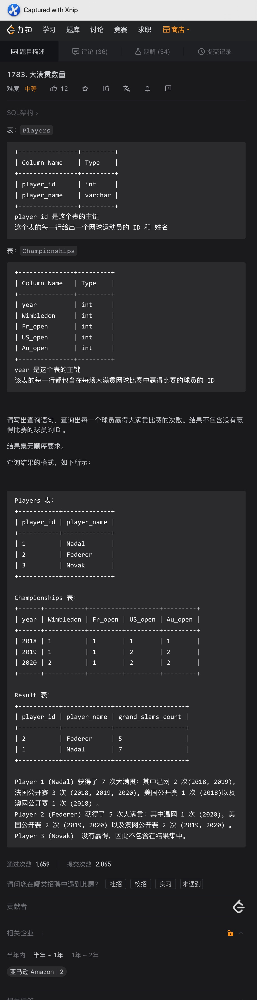

# Day201

## Tag: CASE, CROSS JOIN




题意:

给你一张运动员信息表，一张冠军记录表，请你查询出每个球员目前的冠军数量


思路:

- 我们需要的是记录下运动员夺冠的次数，但这里的问题是: 每年有不同的比赛，所以不止一个列
- 那么我们在连接匹配的时候就需要多次匹配才行，这里我们使用多个CASE相加即可，SQL如下

```mysql
SELECT
    t1.player_id,
    t1.player_name,
    SUM(
        CASE WHEN t1.player_id = t2.Wimbledon THEN 1 ELSE 0 END
        +
        CASE WHEN t1.player_id = t2.Fr_open THEN 1 ELSE 0 END
        +
        CASE WHEN t1.player_id = t2.US_open THEN 1 ELSE 0 END
        +
        CASE WHEN t1.player_id = t2.Au_open THEN 1 ELSE 0 END
    ) AS 'grand_slams_count'
FROM
    Players AS t1
INNER JOIN Championships AS t2
GROUP BY t1.player_id, t1.player_name
HAVING grand_slams_count > 0
```

<hr>


# Day202

## Tag: BETWEEN AND, INNER JOIN


题意:

给你一张登陆记录表，请你查询出其中同一时间在不同的ip地址登陆的账号


思路:

- 分析一下题意: 同一时间、不同ip地址
- 因为只有一张表，所以我们需要自连接，这里按照题目按照用户id连接后，再限制ip地址不同
- 而同一时间则让其中一张表的login字段处在另一张表的login和logout时间之间即可，最后注意去重，最终SQL如下

```mysql
SELECT
    DISTINCT t1.account_id
FROM
    LogInfo AS t1
INNER JOIN LogInfo AS t2 ON t1.account_id = t2.account_id
AND t1.ip_address != t2.ip_address
AND t1.login BETWEEN t2.login AND t2.logout
```

<hr>


# Day203

## Tag: HAVING, DENSE_RANK


题意:

给你一张员工信息表，请你将相同工资人数大于1的员工分为一组，并获取每组的排序


思路:

- 因为查询的数据必需为相同人数大于1，所以我们需要先查询出相同人数大于1的工资金额，这里用自连接后再分组统计人数后使用HAVING限制即可，SQL如下

SQL1:

```mysql
SELECT
    t1.salary,
    DENSE_RANK() OVER(
        ORDER BY t1.salary
    ) AS 'team_id'
FROM
    Employees AS t1
INNER JOIN Employees AS t2 ON t1.employee_id = t2.employee_id
GROUP BY t1.salary
HAVING COUNT(t1.employee_id) > 1
```


- 有了该临时表后，我们再用对应的金额进行连接即可，最终SQL如下

```mysql
SELECT
    t1.employee_id,
    t1.name,
    t1.salary,
    t2.team_id
FROM
    Employees AS t1
INNER JOIN (
	SQL1
) AS t2 ON t1.salary = t2.salary
ORDER BY t2.team_id, t1.employee_id
```

<hr>


# Day204

## Tag: EXISTS, IN, HAVING


题意:

(根据《阿里巴巴Java开发手册》表名不能出现大写字母，且表名不能为复数)

给你一张消费者信息表，一张订单表，一张产品信息表，请你查询出其中每个产品的最新一天的订单信息


思路:

- 

- 因为需要的是每个产品的最新一天的信息，所以这里我们需要先获取每个产品对应的最新一天，SQL如下

SQL1:

```mysql
SELECT
	product_id,
	MAX(order_date) AS 'order_date'
FROM
	Orders
GROUP BY product_id
```


- 获取后以该临时表为WHERE子句的参数，进行限制即可，最后注意连接顺序，最终SQL如下

```mysql
SELECT
    t1.product_name,
    t2.product_id,
    t2.order_id,
    t2.order_date
FROM
    Products AS t1
INNER JOIN Orders AS t2 ON t1.product_id = t2.product_id
WHERE (t2.product_id, t2.order_date) IN (
    SQL1
)
ORDER BY t1.product_name, t2.product_id, t2.order_id
```


拓展:

- 如果了解过EXISTS的朋友可能知道：EXISTS的性能往往要比IN要好，如果还恰巧读过《阿里巴巴Java开发手册》的话，可能会记得其中SQL语句部分有这样一句话:
- 【推荐】in 操作能避免则避免，若实在避免不了，需要仔细评估 in 后边的集合元素数量，控制在 1000 个之内。
- 那么我们就把IN改写为EXISTS，SQL如下

```mysql
SELECT
    t1.product_name,
    t2.product_id,
    t2.order_id,
    t2.order_date
FROM
    Products AS t1
INNER JOIN Orders AS t2 ON t1.product_id = t2.product_id
WHERE EXISTS (
    SELECT
        product_id,
        MAX(order_date) AS 'last_order_date'
    FROM
        Orders AS t3
    GROUP BY product_id
    HAVING t1.product_id = t3.product_id AND t2.order_date = last_order_date
)
ORDER BY t1.product_name, t2.product_id, t2.order_id
```


- 但此时力扣的提交记录上却显示改为EXISTS后用时几乎翻倍了？！这是什么情况？难道是那些写书的在乱写？其实不然
- 在用IN的版本中，我们的子查询为“不相关子查询”，不相关子查询的执行顺序如图


- 而在EXISTS的版本中，我们使用的是相关子查询，其执行顺序如图:


- 很明显，相关子查询的步骤较多，自然用时就长

// 笔记来自《MySQL是怎样运行的》


优化:

- 因为IN的版本为不相关子查询，所以我们以IN的版本为基础来优化
- 由查询计划可知，因为Orders表中的product_id上没有任何索引，所以子查询表中的Extra列为"Using temporary"和"Using filesort"，此时开销为10.81


尝试:

- 那么很明显需要为Orders表中的"product_id"列建立索引才行，又因为我这里使用的MySQL5.7.10，所以存在隐式排序，所以还需要添加一行"ORDER BY NULL"
- 但在表t2中，我们同时使用了t2.product_id和t2.order_date两个列来和临时表进行匹配
- 所以为了不让t2回表(Using where)，我们应该为这两个列创建联合索引(也叫组合索引)，只要保证product_id是第一个字段，那么该联合索引同样可以用到子查询中
- 最后t1表该怎么优化呢？因为排序字段中有t1.product_name，那么我们在product_name上建立索引？
- 并不，在该字段上建立索引后，也不过是将ALL变为了Index而已，提升微乎其微，更别说对于varchar字段建立索引还需要根据文本区分度决定具体的索引长度


结果:

- 此时再查看执行计划，t2和子查询都分别由ALL变为了ref和range，查询开销降为了8.48!


