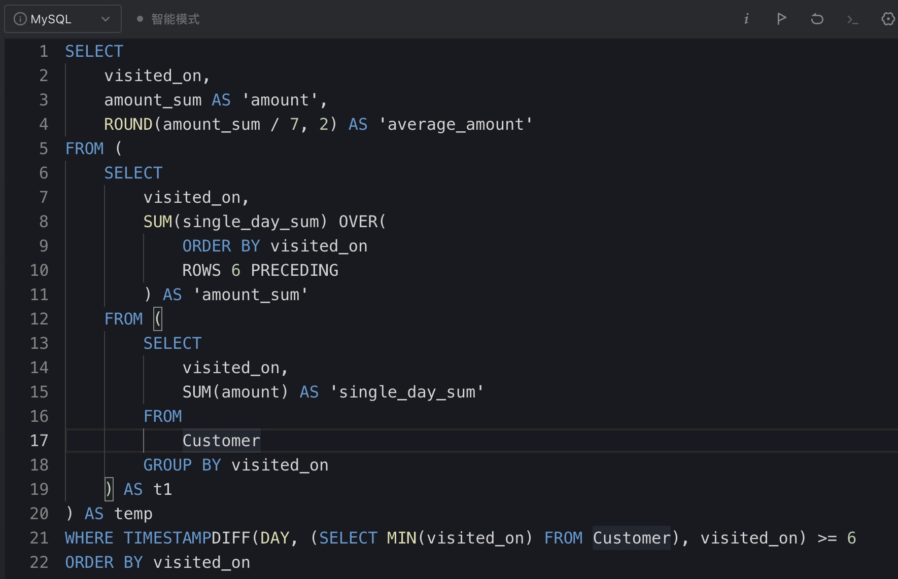

# Day201

## Tag: CASE, CROSS JOIN


题意:

给你一张运动员信息表，一张冠军记录表，请你查询出每个球员目前的冠军数量


思路:

- 我们需要的是记录下运动员夺冠的次数，但这里的问题是: 每年有不同的比赛，所以不止一个列
- 那么我们在连接匹配的时候就需要多次匹配才行，这里我们使用多个CASE相加即可，SQL如下

```mysql
SELECT
    t1.player_id,
    t1.player_name,
    SUM(
        CASE WHEN t1.player_id = t2.Wimbledon THEN 1 ELSE 0 END
        +
        CASE WHEN t1.player_id = t2.Fr_open THEN 1 ELSE 0 END
        +
        CASE WHEN t1.player_id = t2.US_open THEN 1 ELSE 0 END
        +
        CASE WHEN t1.player_id = t2.Au_open THEN 1 ELSE 0 END
    ) AS 'grand_slams_count'
FROM
    Players AS t1
INNER JOIN Championships AS t2
GROUP BY t1.player_id, t1.player_name
HAVING grand_slams_count > 0
```

<hr>


# Day202

## Tag: BETWEEN AND, INNER JOIN


题意:

给你一张登陆记录表，请你查询出其中同一时间在不同的ip地址登陆的账号


思路:

- 分析一下题意: 同一时间、不同ip地址
- 因为只有一张表，所以我们需要自连接，这里按照题目按照用户id连接后，再限制ip地址不同
- 而同一时间则让其中一张表的login字段处在另一张表的login和logout时间之间即可，最后注意去重，最终SQL如下

```mysql
SELECT
    DISTINCT t1.account_id
FROM
    LogInfo AS t1
INNER JOIN LogInfo AS t2 ON t1.account_id = t2.account_id
AND t1.ip_address != t2.ip_address
AND t1.login BETWEEN t2.login AND t2.logout
```

<hr>


# Day203

## Tag: HAVING, DENSE_RANK


题意:

给你一张员工信息表，请你将相同工资人数大于1的员工分为一组，并获取每组的排序


思路:

- 因为查询的数据必需为相同人数大于1，所以我们需要先查询出相同人数大于1的工资金额，这里用自连接后再分组统计人数后使用HAVING限制即可，SQL如下

SQL1:

```mysql
SELECT
    t1.salary,
    DENSE_RANK() OVER(
        ORDER BY t1.salary
    ) AS 'team_id'
FROM
    Employees AS t1
INNER JOIN Employees AS t2 ON t1.employee_id = t2.employee_id
GROUP BY t1.salary
HAVING COUNT(t1.employee_id) > 1
```


- 有了该临时表后，我们再用对应的金额进行连接即可，最终SQL如下

```mysql
SELECT
    t1.employee_id,
    t1.name,
    t1.salary,
    t2.team_id
FROM
    Employees AS t1
INNER JOIN (
	SQL1
) AS t2 ON t1.salary = t2.salary
ORDER BY t2.team_id, t1.employee_id
```

<hr>


# Day204

## Tag: EXISTS, IN, HAVING


题意:

(根据《阿里巴巴Java开发手册》表名不能出现大写字母，且表名不能为复数)

给你一张消费者信息表，一张订单表，一张产品信息表，请你查询出其中每个产品的最新一天的订单信息


思路:

- 

- 因为需要的是每个产品的最新一天的信息，所以这里我们需要先获取每个产品对应的最新一天，SQL如下

SQL1:

```mysql
SELECT
	product_id,
	MAX(order_date) AS 'order_date'
FROM
	Orders
GROUP BY product_id
```


- 获取后以该临时表为WHERE子句的参数，进行限制即可，最后注意连接顺序，最终SQL如下

```mysql
SELECT
    t1.product_name,
    t2.product_id,
    t2.order_id,
    t2.order_date
FROM
    Products AS t1
INNER JOIN Orders AS t2 ON t1.product_id = t2.product_id
WHERE (t2.product_id, t2.order_date) IN (
    SQL1
)
ORDER BY t1.product_name, t2.product_id, t2.order_id
```


拓展:

- 如果了解过EXISTS的朋友可能知道：EXISTS的性能往往要比IN要好，如果还恰巧读过《阿里巴巴Java开发手册》的话，可能会记得其中SQL语句部分有这样一句话:
- 【推荐】in 操作能避免则避免，若实在避免不了，需要仔细评估 in 后边的集合元素数量，控制在 1000 个之内。
- 那么我们就把IN改写为EXISTS，SQL如下

```mysql
SELECT
    t1.product_name,
    t2.product_id,
    t2.order_id,
    t2.order_date
FROM
    Products AS t1
INNER JOIN Orders AS t2 ON t1.product_id = t2.product_id
WHERE EXISTS (
    SELECT
        product_id,
        MAX(order_date) AS 'last_order_date'
    FROM
        Orders AS t3
    GROUP BY product_id
    HAVING t1.product_id = t3.product_id AND t2.order_date = last_order_date
)
ORDER BY t1.product_name, t2.product_id, t2.order_id
```


- 但此时力扣的提交记录上却显示改为EXISTS后用时几乎翻倍了？！这是什么情况？难道是那些写书的在乱写？其实不然
- 在用IN的版本中，我们的子查询为“不相关子查询”，不相关子查询的执行顺序如图


- 而在EXISTS的版本中，我们使用的是相关子查询，其执行顺序如图:


- 很明显，相关子查询的步骤较多，自然用时就长

// 笔记来自《MySQL是怎样运行的》


优化:

- 因为IN的版本为不相关子查询，所以我们以IN的版本为基础来优化
- 由查询计划可知，因为Orders表中的product_id上没有任何索引，所以子查询表中的Extra列为"Using temporary"和"Using filesort"，此时开销为10.81


尝试:

- 那么很明显需要为Orders表中的"product_id"列建立索引才行，又因为我这里使用的MySQL5.7.10，所以存在隐式排序，所以还需要添加一行"ORDER BY NULL"
- 但在表t2中，我们同时使用了t2.product_id和t2.order_date两个列来和临时表进行匹配
- 所以为了不让t2回表(Using where)，我们应该为这两个列创建联合索引(也叫组合索引)，只要保证product_id是第一个字段，那么该联合索引同样可以用到子查询中
- 最后t1表该怎么优化呢？因为排序字段中有t1.product_name，那么我们在product_name上建立索引？
- 并不，在该字段上建立索引后，也不过是将ALL变为了Index而已，提升微乎其微，更别说对于varchar字段建立索引还需要根据文本区分度决定具体的索引长度


结果:

- 此时再查看执行计划，t2和子查询都分别由ALL变为了ref和range，查询开销降为了8.48!


<hr>


# Day205

## Tag: Window Func, Frame




题意:

给你一张消费记录表，请你查询出最近几天中各自6天内的总营业额和日均营业额


思路:

- 该题目其实类似Day183，只不过这道题目的日期需要我们自己获取
- 首先因为表中的记录是分为单个订单的，所以我们要将其整理为每天的营业额，SQL如下

SQL1:

```mysql
SELECT
    visited_on,
    SUM(amount) AS 'single_day_sum'
FROM
    Customer
GROUP BY visited_on
```


- 之后我们直接获取每天近6日的营业额总和，这里使用了窗口函数的Frame选项，SQL如下

SQL2

```mysql
SELECT
    visited_on,
    SUM(single_day_sum) OVER(
        ORDER BY visited_on
        ROWS 6 PRECEDING
    ) AS 'amount_sum'
FROM (
		SQL1
    ) AS t1
```


- 最后我们再对日期进行限制即可，这里只需要保证日期与表中最小日期的差值≥6即可，SQL如下

```mysql
SELECT
    visited_on,
    amount_sum AS 'amount',
    ROUND(amount_sum / 7, 2) AS 'average_amount'
FROM (
		SQL2
) AS temp
WHERE TIMESTAMPDIFF(DAY, (SELECT MIN(visited_on) FROM Customer), visited_on) >= 6
ORDER BY visited_on
```

<hr>


# Day206

## Tag: LEFT JOIN, ISNULL


题意:

给你一张订单信息表，请你根据题目对应的条件查询出订单信息


思路:

- 最容易的想到方法的就是查询出有类型为0的订单对应的客户id，再用IN或者EXISTS结合UNION来做查询，这种写法的SQL如下

```mysql
SELECT
    t1.order_id,
    t1.customer_id,
    t1.order_type
FROM
    Orders AS t1
WHERE NOT EXISTS (
    SELECT
        t2.customer_id
    FROM
        Orders AS t2
    WHERE t2.order_type = 0
    GROUP BY t2.customer_id
    HAVING t1.customer_id = t2.customer_id
)
UNION
SELECT
    t1.order_id,
    t1.customer_id,
    t1.order_type
FROM
    Orders AS t1
WHERE order_type = 0
AND EXISTS (
    SELECT
        t2.customer_id
    FROM
        Orders AS t2
    WHERE t2.order_type = 0
    GROUP BY t2.customer_id
    HAVING t1.customer_id = t2.customer_id
)
```


- 但其实可以通过自连接得到一种简单的写法:
- 自连接时指定两表的"order_type"字段不同(该字段只有两个值)，且连接使用外连接
- 此时查询出来的结果有两种情况: 要么该客户只有一种类型的订单(只有0或者只有1)，此时他的order_type字段就为NULL；要么该客户有两种类型的订单，此时其order_type自度就不为NULL
- 此时如果该用户只有一种类型的订单，那么直接输出其记录即可。但如果有两种，那么不能输出类型为1的订单，这在SQL中如何体现呢？
- 这就是这种写法最巧妙也是最费解的地方了，我们输出的字段数据是来自表t1的，而WHERE子句中限制的是t2表的字段，此时WHERE子句的内容为:

```mysql
WHERE ISNULL(t2.order_type) OR t2.order_type = 1;
```


- 前面判断NULL很容易理解，那后面是啥？这里可以这样理解:
- 这里我们使用的是逻辑OR，如果该字段不为NULL，那么此时就会判断其值是否为1
- 如果其值为1，说明t1.order_type = 0(两表连接时的条件为"order_type"字段不同)，此时直接输入就能保证t1.order_type全为0了！
- 最终SQL如下

```mysql
SELECT
    DISTINCT t1.order_id,
    t1.customer_id,
    t1.order_type
FROM
    Orders AS t1
LEFT JOIN Orders AS t2 ON t1.customer_id = t2.customer_id AND t1.order_type != t2.order_type
WHERE ISNULL(t2.order_type) OR t2.order_type = 1
```

<hr>


# Day207

## Tag: HAVING, ABS


题意:

给你一张点的坐标表，请你查询出其中任意两个点可以形成的面积不为0的矩形面积


思路:

- 从题目的示例来看，矩形的计算方法就是横纵坐标之差的乘积的绝对值
- 而确保任意两点的方法就是自连接后让两表的id列值不同，但简单的使用id不相等还不够，这里ing更改使用<以保证不会重复计算
- 最后只需要使用HAVING排除掉面积为0的组合并按规则排序即可，最终SQL如下

```mysql
SELECT
    t1.id AS 'p1',
    t2.id AS 'p2',
    ABS((t1.x_value - t2.x_value) * (t1.y_value - t2.y_value)) AS 'area'
FROM
    Points AS t1
INNER JOIN Points AS t2 ON t1.id < t2.id
HAVING area > 0
ORDER BY area DESC, p1, p2
```

<hr>


# Day208

## Tag: CASE, OR, Boolean


题意:

给你一张变量取值表，一张表达式表，请你查询出表达式表中每条数据对应的boolean结果


思路:

- 因为表中只有两个变量，而符号有三种，所以一共有六种情况
- 当然，我们可以将6种情况都一一列出再用CASE来做分支，但其实不用这么麻烦
- 我们只需要将为true或者为false的所有情况都列出来并用OR连接即可，剩下的情况就是false了
- 需要注意的是，在比较值的时候，我们不能比较同一张variables表中的字段值，所以这里需要分别用left_operand和right_operand连接variables表两次，所以最终SQL如下

```mysql
SELECT
    t1.left_operand,
    t1.operator,
    t1.right_operand,
    CASE WHEN (t1.operator = '>' AND t2.value > t3.value) 
    OR 
    (t1.operator = '<' AND t2.value < t3.value)
    OR
    (t1.operator = '=' AND t2.value = t3.value)
    THEN 'true'
    ELSE 'false' END AS 'value'
FROM
    Expressions AS t1
INNER JOIN Variables AS t2 ON t1.left_operand = t2.name
INNER JOIN Variables AS t3 ON t1.right_operand = t3.name
```

<hr>


# Day209

## Tag: CTE


题意:

给你一张飞机起降记录表，请你查询出其中承载最多飞机的机场id


思路:

- 由表可知: 每条记录中记录的是离港的机场id、降落的机场id和架次
- 因为离港的和降落的机场id都要统计，所以这里我们首先需要将两张表连接起来，SQL如下

SQL1:

```mysql
SELECT
    departure_airport AS 'airport_id',
    flights_count
FROM
    Flights
UNION ALL
SELECT
    arrival_airport AS 'airport_id',
    flights_count
FROM
    Flights
```


- 之后再统计每个机场对应的架次，且为了之后好找出最大承载量，按照架次进行排序，SQL如下

SQL2:

```mysql
SELECT
    airport_id,
    SUM(flights_count) AS 'num'
FROM (
		SQL1
) AS t1
GROUP BY airport_id
ORDER BY num DESC
```


- 最后我们再通过取第一条记录的num字段，就能获取最大的承载量了，再用这个承载量去匹配对应的机场id即可
- 这里需要将SQL2生成的表使用两次，如果是MySQL5.7的话写两次确实很难看，所以这里我们可以运用MySQL8.0的特性: CTE，这样就只需要写一次了，最终SQL如下

```mysql
WITH temp AS (
		SQL2
)

SELECT
    airport_id
FROM 
    temp
WHERE num = (SELECT num FROM temp LIMIT 1)
```

<hr>


# Day210

## Tag: EXISTS, IN, JOIN


题意:

给你一张订阅信息表，一张流媒体访问记录表，请你查询出2021年有订阅但2021没有访问流媒体的用户数量


思路:

- 这里存在两种限制关系，这里我们需要的是订阅表中的用户信息，所以我们需要先查询出2021年没有访问流媒体的用户id，SQL如下

SQL1:

```mysql
SELECT
    t2.account_id
FROM
    Streams AS t2
WHERE YEAR(t2.stream_date) = 2021
```


- 之后再以此作为WHERE子句的参数，使用NOT IN即可，最终SQL如下

```mysql
SELECT
    COUNT(*) AS 'accounts_count'
FROM
    Subscriptions AS t1
WHERE (YEAR(t1.start_date) = 2021 OR YEAR(t1.end_date) = 2021)
AND account_id NOT IN (
		SQL1
)
```


拓展:

- 从解题的角度来说，这样其实就完结了，但从实用的角度呢？
- 这里我们使用到了IN，在实际生产/业务中，如果IN中的数据个数一旦超过了1000个，那么就会出问题，在《阿里巴巴Java开发手册》中也有类似的建议
- 那么为什么不建议使用IN，且用的时候需要限制参数个数在1000个以内呢？
- 我们先来查看一个MySQL系统变量: max_allowed_packet，它代表了任何生成值/中间值/参数的最大大小，其默认值为4MB，官方文档如图:


- 再发挥一下想象力，MySQL中单个字符最多占用4个字节(utf8mb4)，那么1000个参数*4不就是4000bytes了吗？刚好4MB！


- 所以在实际业务中，如果没有在配置文件中修改max_allowed_packet这个变量的话，最好不要在SQL中使用IN查询
- 因此这里我们将其改为使用EXISTS

```mysql
SELECT
    COUNT(*) AS 'accounts_count'
FROM
    Subscriptions AS t1
WHERE (YEAR(t1.start_date) = 2021 OR YEAR(t1.end_date) = 2021)
AND NOT EXISTS (
    SELECT
        t2.account_id
    FROM
        Streams AS t2
    WHERE t1.account_id = t2.account_id
    AND YEAR(t2.stream_date) = 2021
)
```


最后推荐各位阅读一篇运维老哥写的文章，相信能对IN的使用有更深的理解:

[技术分享｜mysql in溢出bug和排查经历 - 力扣（LeetCode） (leetcode-cn.com)](https://leetcode-cn.com/circle/discuss/c40Pde/)

<hr>


# Day211

## Tag: EXISTS


题意:

给你一张员工信息表，请你查询出直接或间接向老板汇报的员工id


思路:

- 如果是有多个中间层的话，其实这道题目很难，但题目中指明最多只有3层间接关系
- 所以最简单的方法就是三次IN子查询或者连接三张表，但其中IN有参数个数限制，连接时驱动表对应的结果集也可能会很大，所以两种方式都不太好
- 这里我们可以改为使用EXISTS，依次查询每层即可，SQL如下

```mysql
SELECT
	t1.employee_id
FROM
	Employees AS t1
WHERE EXISTS (
	SELECT
		t2.employee_id
	FROM
		Employees AS t2
	WHERE EXISTS (
    SELECT
      t3.employee_id
    FROM
      Employees AS t3
    WHERE t3.manager_id = 1
    AND t2.manager_id = t3.employee_id
		)
	AND t1.manager_id = t2.employee_id
	)
AND t1.employee_id != 1
```

