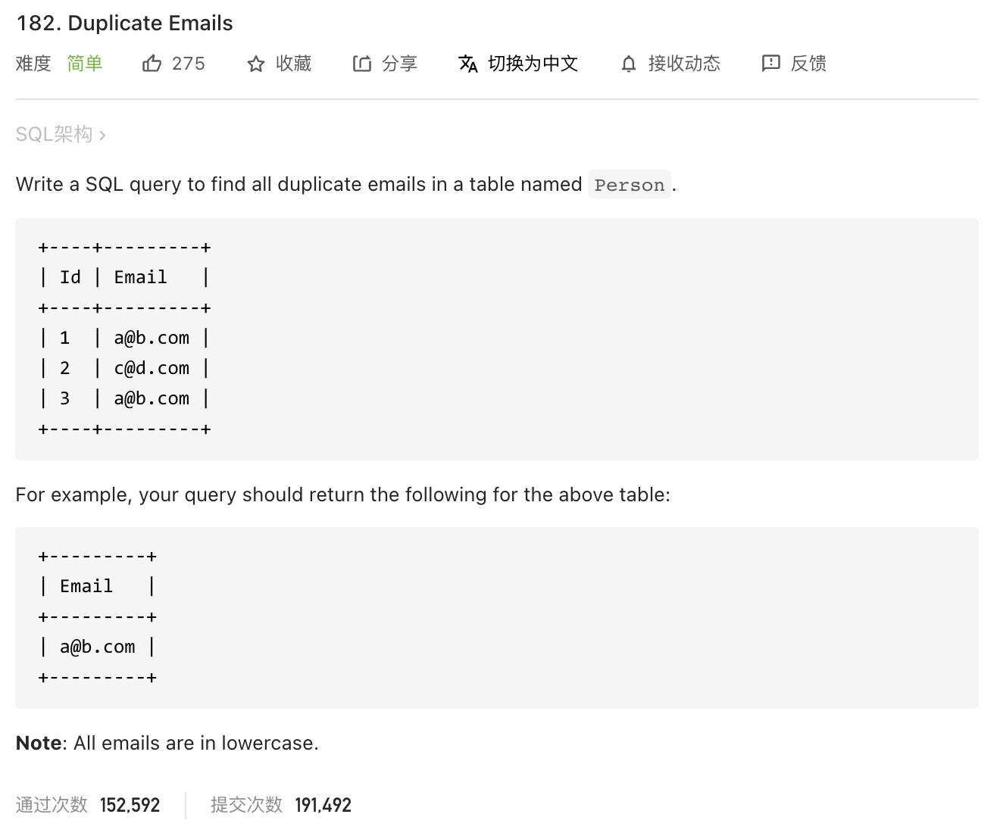
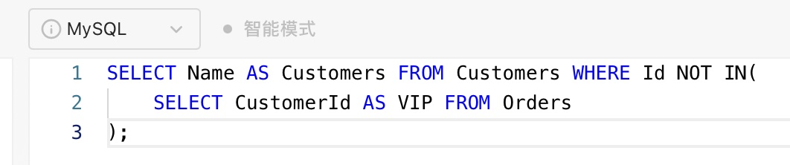
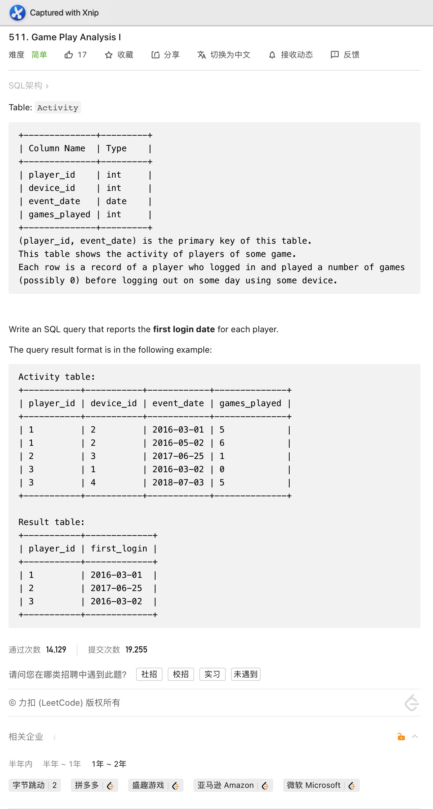

# Day01

****

# Day02

****

# Day03

****

# Day04

****

# Day05

****

# Day06

****

# Day07

****

# Day08

左连接:

自然连接:

****

# Day09

****

# Day10

## Tag: Order, Limit

****

# Day11

## Tag: Order, Limit

****

# Day12

## Tag: DATEDIFF

****

# Day13

## Tag: Unite

****

# Day14

## Tag: Having

****

# Day15

## Tag: DISTINCT, ORDER BY

****

# Day16

## Tag: Sub Query

****

# Day17

## Tag: Bit Operate, ORDER

****

# Day18

## Tag: Sub Query, ORDER BY

