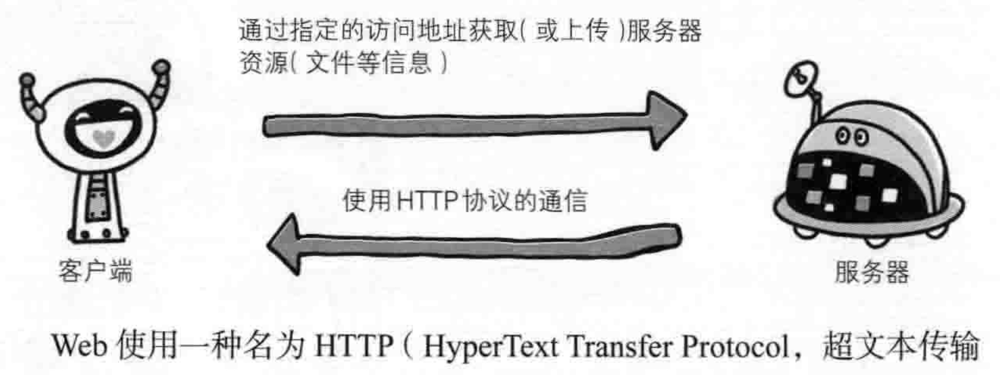
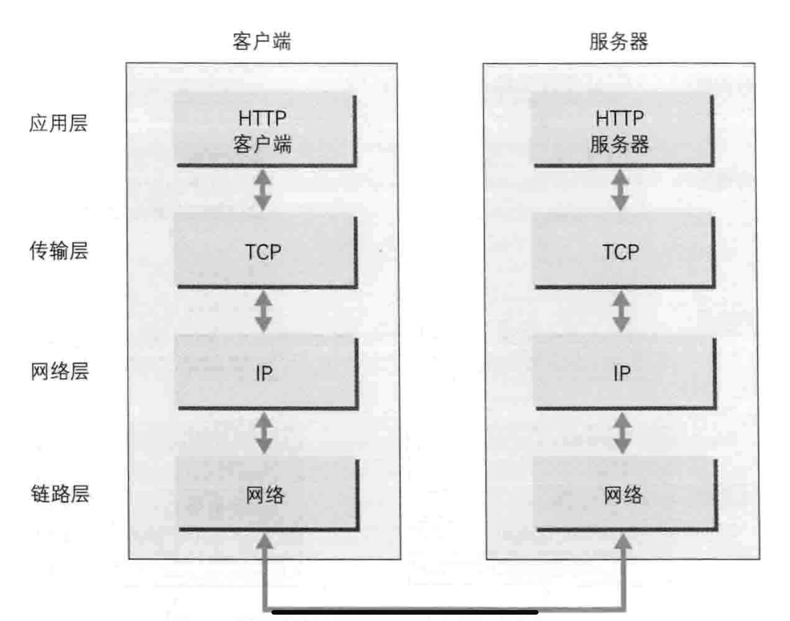
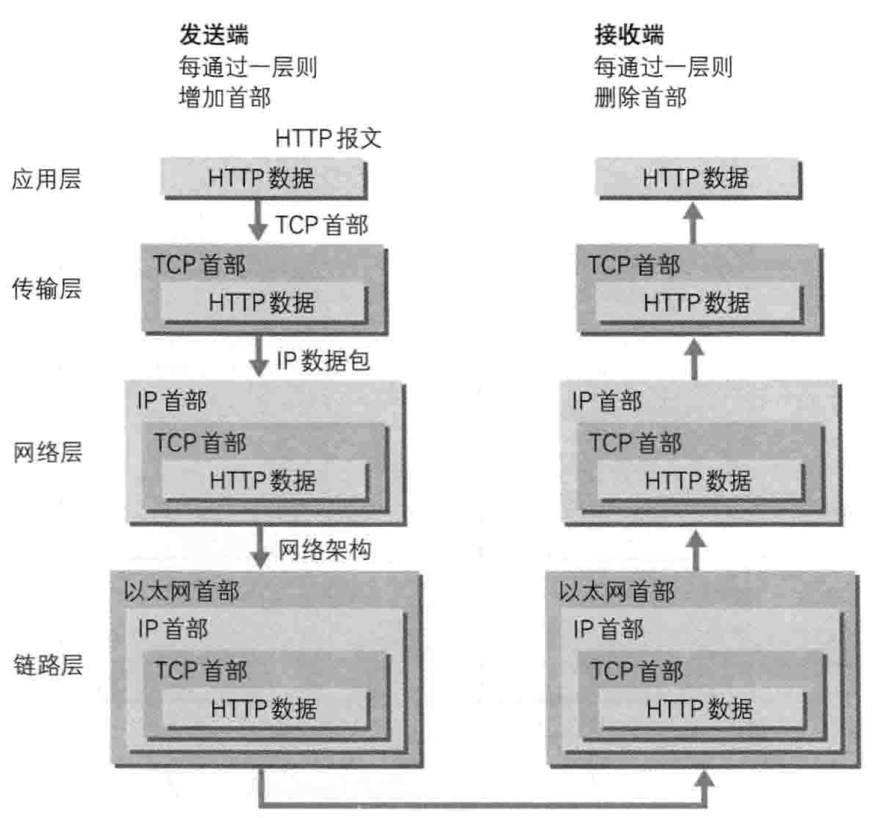

# 一、Web/网络基础

## 1.1 使用HTTP协议访问Web

Web页面的显示:

**根据Web浏览器地址栏中指定的URL**，Web浏览器从Web服务器端获取文件资源等，从而显示出Web页面

通过**发送请求获取服务器资源的Web浏览器等**，都称为**客户端Client**

传输文件等资源时，Web使用HTTP协议作为规范，完成从client到server的一系列运作流程

**协议就是规定的约定**，可以说，Web是建立在HTTP协议上通信的

## 1.2 HTTP的诞生

### 1.2.1 为了知识共享而规划Web

- 最初设想的理念是：

**借助多文档之间相互关联形成的超文本**(Hyper Text)，**连成可相互参阅的WWW**(World Wide Web，万维网)

3项WWW构建技术:

文本标记语言HTML、文档传输协议HTTP，指定文档所在地址URL(Uniform Resource Locator，统一资源定位符)

WWW是以前**Web浏览器用来浏览超文本的客户端应用程序**时的名称，现在用来表示这一系列的集合，简称Web

### 1.2.3 驻足不前的HTTP

- HTTP/0.9

刚开始问世时，HTTP没有作为正式的标准被建立，所以被称为HTTP/0.9

- HTTP/1.0

在1996年作为正式标准被公布，记载于RFC1945。该协议沿用至今

- HTTP/1.1

1997年1月发布，**是目前主流的HTTP协议版本**

HTTP作为文档传输协议，其版本几乎没有更新

其出现原本只是为了解决文本传输的问题，现在早已超出了Web这个框架的限制

## 1.3 TCP/IP

通常使用的网络是在TCP/IP协议族的基础上运作的。HTTP只是它内部的子集

### 1.3.1 TCP/IP协议族

设备之间相互通信需要基于相同的方法。如何探测通信目标、谁先发起通信、使用哪种语言通信、怎样结束通信等等。不同的硬件、系统之间的通信，这些都需要一种规则

**我们将这种规则称为协议**

把与互联网相关联的协议集合起来总称为TCP/IP族

### 1.3.2 TCP/IP的分层管理

TCP/IP协议族里最重要的一点就是分层，TCP/IP协议族按照层次分为四层:

- 应用层
- 传输层
- 网络层
- 数据链路层

分层的好处:

如果互联网只由一个协议统筹，那么在改变设计时，必须将整体都替换掉；但**分层后只需把改动的层替换即可**。在规划好各层之间的接口后，**每个层次内部的设计就能够自由改动了**

**层次化之后，每层的应用则考虑分配给自己的任务即可**，而不需要考虑其他任务

TCP/IP协议族各层的作用:

- 应用层

决定了向用户提供应用服务时通信的活动

例如: FTP(File Transfer Protocal), DNS(Domain Name System), HTTP

- 传输层

传输层对上层应用层，**提供在网络连接中两台设备间的信息传输**

该层有**两个性质不同**的协议: **TCP**(Transmission Control Protocol)/**UDP**(User Data Protocol)

- 网络层

用来处理在网络上流动的数据包(**数据包是网络传输最小数据单位**)

该层**规定了通过怎样的路径到达对方设备，并将数据包传送给对方**

当与对方设备之间通过多个设备进行传输时，网络层的作用就是**在众多选项中选择一条传输路线**

- 链路层(数据链路层)

处理网络中的硬件部分(OS、驱动、NIC、光纤等)

### 1.3.3 TCP/IP 通信传输流

通过TCP/IP协议族通信时，会按照分层顺序与对方进行通信。发送端从应用层往下走，接收端反之

用 HTTP 举例来说明:

- 首先作为发送端的客户端在应用层(HTTP 协议)发出一个想看某个Web页面的 HTTP 请求。
- 接着，为了传输方便，**在传输层(TCP协议)把从应用层处收到的数据(HTTP 请求报文)进行分割**，并在各个报文上打上标记序号及端口号后转发给网络层。
- 在网络层(IP协议)，**增加作为通信目的地的MAC地址**后转发给链路层
- 接收端的服务器在链路层接收到数据，按序往上层发送，一直到应用层。**当传输到应用层，才能算真正接收到由客户端发送过来的 HTTP请求**

发送端在层与层之间传输数据时，每经过一层时都会被打上一个该层所属的首部信息

反之，接收端在层与层之间传输数据时，每经过一层都会将对应的首部去除

这种将数据信息包装起来的方式称为封装(encapsulate)

