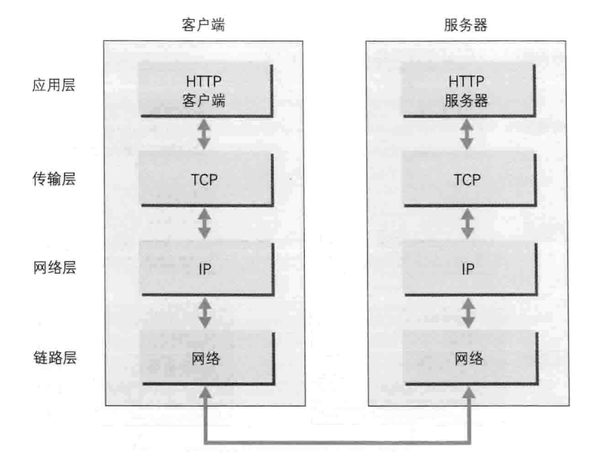
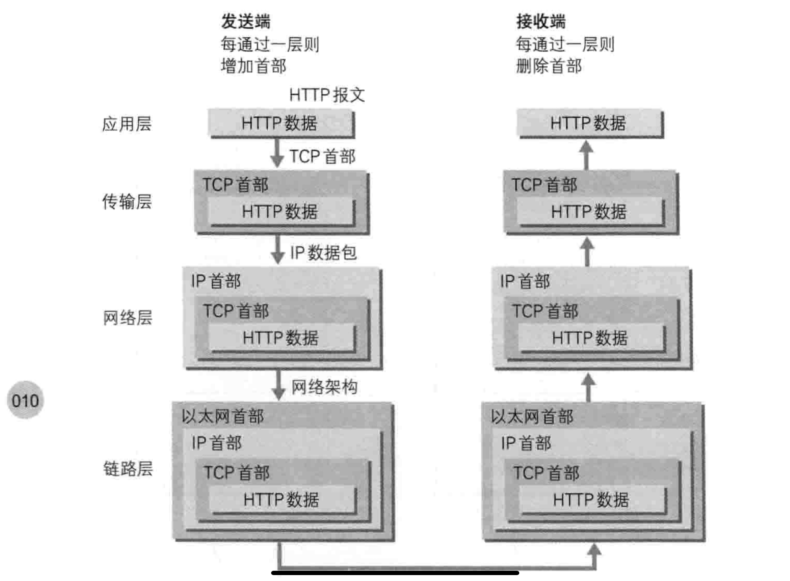
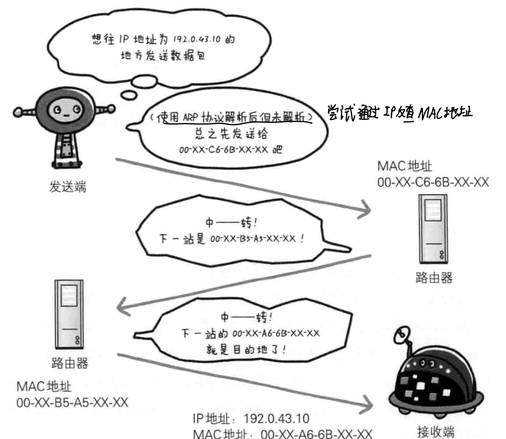
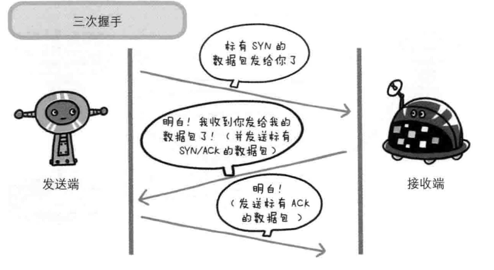
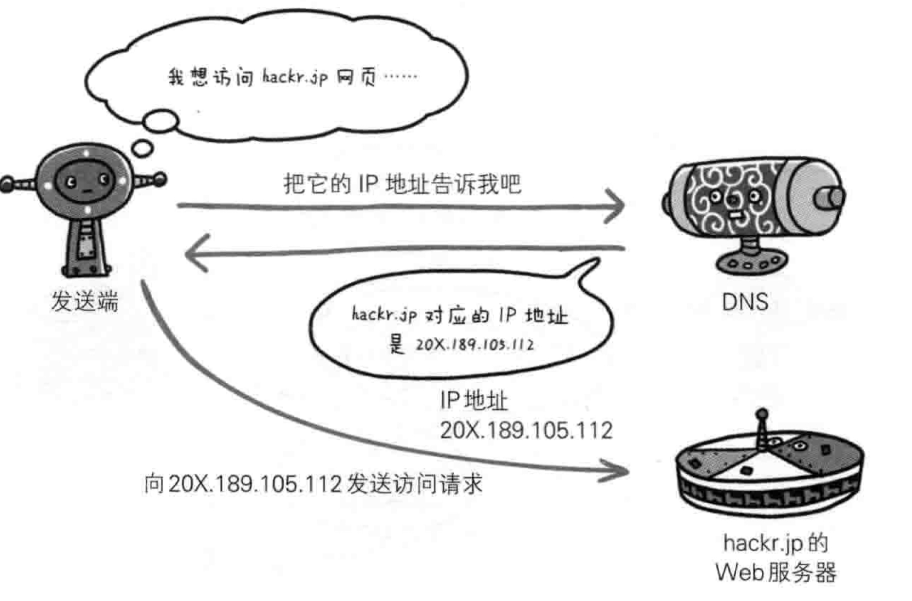
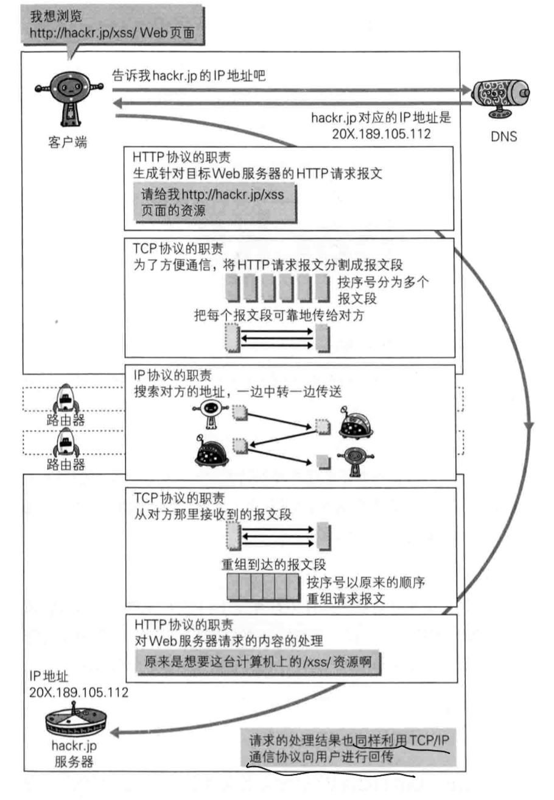
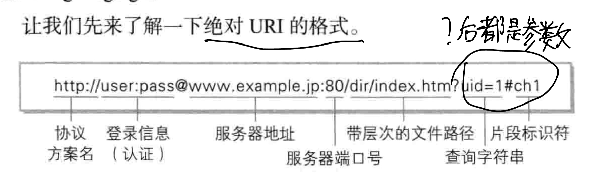

# 一、Web/网络基础

## 1) 使用HTTP协议访问Web

当我们在浏览其中输入URL时(地址栏的信息)，信息会送往某处，然后某处会发来回应，从而得以显示内容在Web页面上

大致原理:

- 根据浏览器地址栏中指定的URL，Web浏览器能够从Web服务器端获取对应的文件资源(resource)等信息，从而显示出对应的Web页面

通过发送请求获取服务器资源的Web浏览器等，都称为客户端(client)

在Web中，使用HTTP协议(Hyper Text Transfer Protocol)作为规范，完成从客户端到服务器的一系列流程，**协议是指规则的约定**

> 可以说，Web是建立在HTTP协议上通信的

## 2) HTTP诞生

### 1. 为了共享

最初的设计理念:

- 借助多文档之间互相关联形成的超文本(HyperText)，连成可以相互参阅的WWW
- 现在提出的3项WWW技术: 
    - HTML: 页面的文本标记语言
    - HTTP: **文档传输协议**
    - URL: 指定文档**所在地址**

WWW以前用来指代浏览超文本内容的客户端，现在指一系列的集合，可简称为Web

### 2. HTTP版本

- HTTP/1.0

1996-05，该协议标准至今仍被广泛使用在服务器端

- HTTP/1.1

1997-01，是目前最主流的HTTP版本

1999年发布RFC2616改进版

- HTTP/2.0

2015-02

## 3) 网络基础——TCP/IP

网络通常是在TCP/IP协议族的基础上运作的，**而HTTP是其内容的一个子集**

### 1. TCP/IP协议族

网络中的设备想要通信，则必须基于相同的方法，需要一种规则

> 这种规则称为协议

互联网相关的协议集合的总称就是TCP/IP

### 2. TCP/IP的分层管理

分层是TCP/IP协议族里重要的一点

TCP/IP协议族按照层次分为四层:

- 应用层
- 传输层
- 网络层
- 数据链路层

TCP/IP分层的好处:

> 各层之间的接口规划好之后，每层内部的设计就能自由改动了(解耦)
>
> 每层的应用只考虑自己的任务即可，而不必考虑整个过程

TCP/IP各层的作用:

1. 应用层

决定了提供应用服务时通信的活动

该层具有的协议:

- FTP: 文件传输协议
- DNS: 域名系统
- HTTP: 文档传输

2. 传输层

对应用层提供网络连接中的，两台设备之间的数据传输

该层的协议:

- TCP(Transmission Control Protocol): 传输控制协议
- UDP(User Data Protocol): 用户数据报协议

3. 网络层(网络互联层)

处理网络上流动的数据包，该层规定了传输路线，和数据包的发送形式

> 数据包是网络传输的最小单位

概括:

- 网络层就是在多条传输路线中选择一条路线

4. 链路层(数据链路层/网络接口层)

处理网络中的硬件部分(OS，驱动，网卡，光纤等等)

### 3. TCP/IP 通信传输流

- 通过TCP/IP进行通信时，发送端从应用层往下走；接收端则从链路层往上走

例子: 客户端想看一个Web页面

- 客户端:
    1. 在应用层发出一个HTTP请求(HTTP协议)
    2. 传输层将应用层的HTTP请求报文(数据)进行分割，并给每段打上标记序号和端口号(TCP协议)
    3. 网络层为这些分割后的报文段增加上目的地的MAC地址后，发给链路层

Eg:

在发送时，每到一层就会被打上一个该层对应的首部信息，接收端则会依次消去

**这种将数据信息进行包装的方法称为封装(encapsulate)**

## 4) IP、TCP

### 1. IP协议

IP协议位于网络层，几乎所有的网络协议都会用到IP协议

作用:

- 将各种数据包传给对方

要保证传送的准确性，需要两个重要的条件:

- IP地址: 指明了节点分配到的地址，可更换
- MAC地址(Media Access Control): 网卡所属的地址，基本不会更改

IP地址和MAC地址可以进行配对

- ARP协议

IP节点之间通信依赖MAC地址，但通常双方不再一个局域网内，所以需要经过多台设备的中转，中转时会利用中转设备的MAC地址来搜索下一个中转目标

> 此时会使用ARP协议，其能够根据通信方的IP地址反查出对应的MAC地址
>
> ARP协议是一种用以解析地址的协议

- 各司其职

在中转时，每个设备都是会知悉传输路线的一部分，或者大概的传输路线

> 这种机制称为"路由选择"

无论哪台设备，都无法全面掌握互联网中的细节

### 2. TCP协议

TCP协议位于传输层，其提供可靠的字节流服务(byte stream service)

- 字节流服务:

> 为了方便传输，将大块数据分割成以报文段(segment)为单位的数据包进行管理

总结:

TCP协议**为了方便传输，将报文数据进行分割，得到报文段**

为了服务的可靠，**TCP协议能够确认数据是否送达**

- 确认数据送达

为了将数据准确无误的送达，TCP协议采用了三次握手策略(three-way handshaking)

TCP协议发送数据后，会向对方确认是否送达，在确认的过程中，使用了TCP的标志——SYN(synchronize)和ACK(acknowledgement)

过程:

> 1. 发送端首先发送一个带有SYN标志的数据包
> 2. 接收端接收后，回传一个带有SYN/ACK标志的数据包表示确认(数据送达)
> 3. 最后，发送端再回传一个带ACK标志的数据包，表示握手结束

**注：**如果握手在某个阶段中断了，那么TCP协议会再以相同的顺序发送相同的数据包

Eg:

除了三次握手外，也有其他的手段确保通信的可靠性

## 3) DNS服务

DNS是位于应用层的协议

作用:

提供域名到IP地址的解析服务

问题:

用户通常使用主机名/域名来访问对方的计算机上的资源，但计算机无法理解域名

- 为了解决上述问题，DNS服务就诞生了

> DNS协议提供域名查找IP地址，或者逆向从IP地址反查域名的服务

## 4) 各种协议与HTTP协议的关系

## 5) URI和URL

- URL(uniform resource locator)，统一资源定位符，其实就是浏览器中输入的网页地址

### 1. URI(统一资源标识符)

URI: Uniform Resource Identifier

> URI就是由某个协议方案表示的资源定位标识符
>
> 协议方案: 访问资源所使用的协议类型名称

协议方案:

使用HTTP协议时，协议方法就是http。还有ftp等等

总结:

> URI用字符串标识某一Web资源
>
> URL表示资源的地点
>
> URL是URI的子集

### 2. URI格式

绝对URI:

- 登陆信息(可选项)

- 服务器地址:

可以是域名(DNS解析)，可以是IPv4/IPv6地址

- 端口号(可选项)
- 文件路径:

指定服务器上的文件路径来定位特定的资源

- 查询字符串(可选项)
- 片段标识符(可选项)

# 二、初入HTTP协议

