# 一、Web/网络基础


## 1) 使用HTTP协议访问Web

当我们在浏览其中输入URL时(地址栏的信息)，信息会送往某处，然后某处会发来回应，从而得以显示内容在Web页面上


大致原理:

- 根据浏览器地址栏中指定的URL，Web浏览器能够从Web服务器端获取对应的文件资源(resource)等信息，从而显示出对应的Web页面


通过发送请求获取服务器资源的Web浏览器等，都称为客户端(client)


在Web中，使用HTTP协议(Hyper Text Transfer Protocol)作为规范，完成从客户端到服务器的一系列流程，**协议是指规则的约定**

> 可以说，Web是建立在HTTP协议上通信的

<hr>


## 2) HTTP诞生


### 1. 为了共享

最初的设计理念:

- 借助多文档之间互相关联形成的超文本(HyperText)，连成可以相互参阅的WWW
- 现在提出的3项WWW技术: 
    - HTML: 页面的文本标记语言
    - HTTP: **文档传输协议**
    - URL: 指定文档**所在地址**


WWW以前用来指代浏览超文本内容的客户端，现在指一系列的集合，可简称为Web

<hr>


### 2. HTTP版本


- HTTP/1.0

1996-05，该协议标准至今仍被广泛使用在服务器端


- HTTP/1.1

1997-01，是目前最主流的HTTP版本

1999年发布RFC2616改进版


- HTTP/2.0

2015-02

<hr>


## 3) 网络基础——TCP/IP

网络通常是在TCP/IP协议族的基础上运作的，**而HTTP是其内容的一个子集**


### 1. TCP/IP协议族

网络中的设备想要通信，则必须基于相同的方法，需要一种规则

> 这种规则称为协议


互联网相关的协议集合的总称就是TCP/IP


<hr>


### 2. TCP/IP的分层管理

分层是TCP/IP协议族里重要的一点


TCP/IP协议族按照层次分为四层:

- 应用层
- 传输层
- 网络层
- 数据链路层


TCP/IP分层的好处:

> 各层之间的接口规划好之后，每层内部的设计就能自由改动了(解耦)
>
> 每层的应用只考虑自己的任务即可，而不必考虑整个过程


TCP/IP各层的作用:


1. 应用层

决定了提供应用服务时通信的活动


该层具有的协议:

- FTP: 文件传输协议
- DNS: 域名系统
- HTTP: 文档传输

<hr>


2. 传输层

对应用层提供网络连接中的，两台设备之间的数据传输


该层的协议:

- TCP(Transmission Control Protocol): 传输控制协议
- UDP(User Data Protocol): 用户数据报协议

<hr>


3. 网络层(网络互联层)

处理网络上流动的数据包，该层规定了传输路线，和数据包的发送形式

> 数据包是网络传输的最小单位


概括:

- 网络层就是在多条传输路线中选择一条路线

<hr>


4. 链路层(数据链路层/网络接口层)

处理网络中的硬件部分(OS，驱动，网卡，光纤等等)

<hr>


### 3. TCP/IP 通信传输流


- 通过TCP/IP进行通信时，发送端从应用层往下走；接收端则从链路层往上走


例子: 客户端想看一个Web页面

- 客户端:
    1. 在应用层发出一个HTTP请求(HTTP协议)
    2. 传输层将应用层的HTTP请求报文(数据)进行分割，并给每段打上标记序号和端口号(TCP协议)
    3. 网络层为这些分割后的报文段增加上目的地的MAC地址后，发给链路层


Eg:


在发送时，每到一层就会被打上一个该层对应的首部信息，接收端则会依次消去

**这种将数据信息进行包装的方法称为封装(encapsulate)**

<hr>


## 4) IP、TCP


### 1. IP协议

IP协议位于网络层，几乎所有的网络协议都会用到IP协议


作用:

- 将各种数据包传给对方


要保证传送的准确性，需要两个重要的条件:

- IP地址: 指明了节点分配到的地址，可更换
- MAC地址(Media Access Control): 网卡所属的地址，基本不会更改

IP地址和MAC地址可以进行配对


- ARP协议

IP节点之间通信依赖MAC地址，但通常双方不再一个局域网内，所以需要经过多台设备的中转，中转时会利用中转设备的MAC地址来搜索下一个中转目标

> 此时会使用ARP协议，其能够根据通信方的IP地址反查出对应的MAC地址
>
> ARP协议是一种用以解析地址的协议


- 各司其职

在中转时，每个设备都是会知悉传输路线的一部分，或者大概的传输路线

> 这种机制称为"路由选择"


无论哪台设备，都无法全面掌握互联网中的细节


<hr>


### 2. TCP协议

TCP协议位于传输层，其提供可靠的字节流服务(byte stream service)


- 字节流服务:

> 为了方便传输，将大块数据分割成以报文段(segment)为单位的数据包进行管理


总结:

TCP协议**为了方便传输，将报文数据进行分割，得到报文段**

为了服务的可靠，**TCP协议能够确认数据是否送达**


- 确认数据送达

为了将数据准确无误的送达，TCP协议采用了三次握手策略(three-way handshaking)


TCP协议发送数据后，会向对方确认是否送达，在确认的过程中，使用了TCP的标志——SYN(synchronize)和ACK(acknowledgement)

过程:

> 1. 发送端首先发送一个带有SYN标志的数据包
> 2. 接收端接收后，回传一个带有SYN/ACK标志的数据包表示确认(数据送达)
> 3. 最后，发送端再回传一个带ACK标志的数据包，表示握手结束


**注：**如果握手在某个阶段中断了，那么TCP协议会再以相同的顺序发送相同的数据包

Eg:


除了三次握手外，也有其他的手段确保通信的可靠性

<hr>


## 3) DNS服务

DNS是位于应用层的协议


作用:

提供域名到IP地址的解析服务


问题:

用户通常使用主机名/域名来访问对方的计算机上的资源，但计算机无法理解域名


- 为了解决上述问题，DNS服务就诞生了

> DNS协议提供域名查找IP地址，或者逆向从IP地址反查域名的服务


<hr>


## 4) 各种协议与HTTP协议的关系


<hr>


## 5) URI和URL

- URL(uniform resource locator)，统一资源定位符，其实就是浏览器中输入的网页地址


### 1. URI(统一资源标识符)

URI: Uniform Resource Identifier


> URI就是由某个协议方案表示的资源定位标识符
>
> 协议方案: 访问资源所使用的协议类型名称


协议方案:

使用HTTP协议时，协议方法就是http。还有ftp等等


总结:

> URI用字符串标识某一Web资源
>
> URL表示资源的地点
>
> URL是URI的子集

<hr>


### 2. URI格式


绝对URI:


- 登陆信息(可选项)

- 服务器地址:

可以是域名(DNS解析)，可以是IPv4/IPv6地址

- 端口号(可选项)
- 文件路径:

指定服务器上的文件路径来定位特定的资源

- 查询字符串(可选项)
- 片段标识符(可选项)

<hr>


# 二、初入HTTP协议

特性:

- HTTP协议用于客户端和服务器之间的通信
- 请求访问文本/图像等资源的一端称为客户端；提供资源响应的一端称为服务器端
- 使用HTTP协议通信时，必定一端是客户端，一端是服务器端；HTTP协议能够明确区分哪端是客户端，哪端是服务端

<hr>


## 1) 通过请求和响应的交换达成通信

HTTP协议规定:

> 必定是先从客户端开始建立通信的，服务器在没有接收到请求之前不会发送响应


Eg:

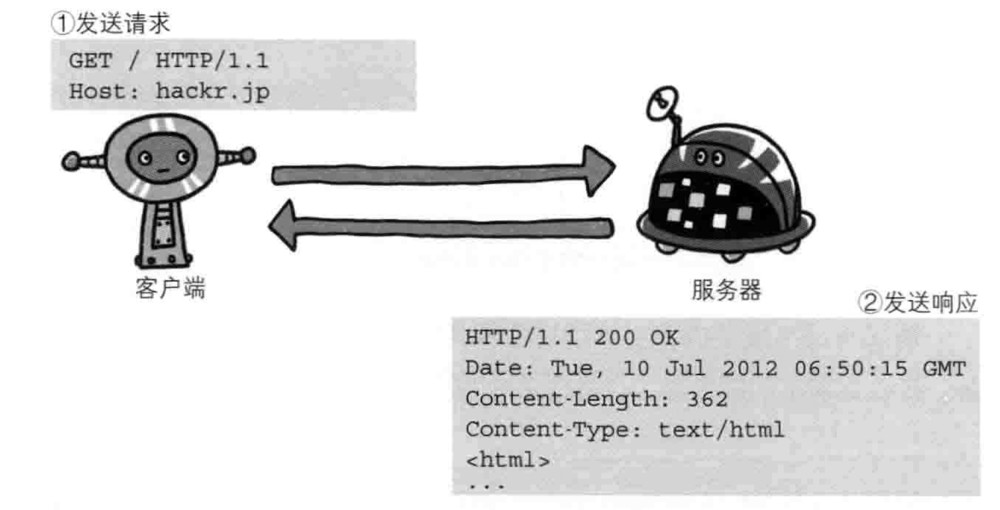


如下是客户端发送给HTTP服务器的请求报文:

```http
GET /index.htm HTTP/1.1
Host: hackr.jp
```

- GET: 方法，表示访问服务器的类型
- /index.htm: 请求URI，指明了请求访问的资源对象
- HTTP/1.1: HTTP的版本号，提示客户端使用的HTTP功能


请求报文的内容，通过GET方法访问某台服务器上的/index.htm页面资源

> 请求报文是由请求方法(method)、请求URI、协议版本、首部字段(可选)和内容实体构成的


请求报文的构成解析:

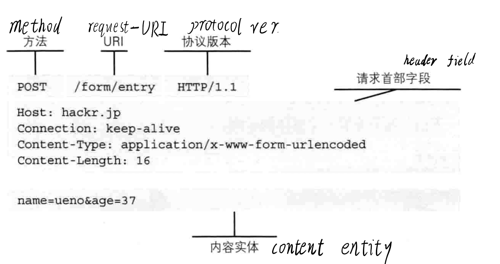


如下是服务器的响应报文:

```http
HTTP/1.1 200 OK
Date: XXX
Content-length: xxx

<html>
...
```

- HTTP/1.1: 服务器的HTTP版本
- 200: 状态码，表示请求成功或失败的数字
- OK: 原因短语，解释状态码

其余: 首部字段(header field)


以一个空行分隔后，之后的内容称为内容实体(entity body)

> 响应报文由协议版本、状态码、原因短语、首部字段(可选)、内容实体构成


响应报文构成解析:

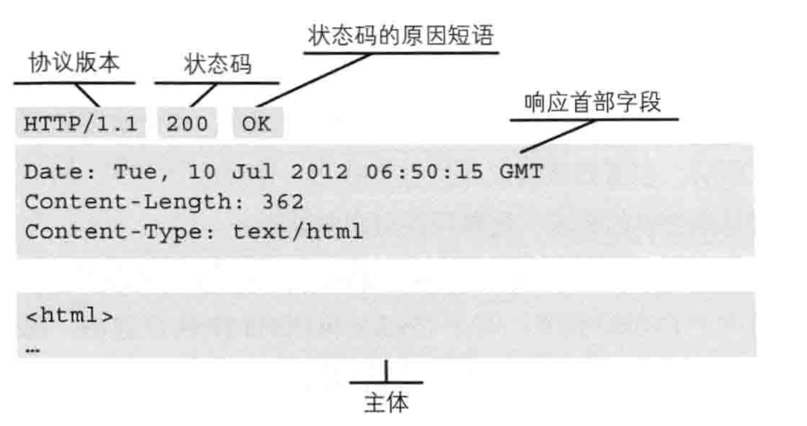

<hr>


## 2) HTTP是不保存状态的协议

- HTTP是一种无状态协议(stateless)，即自身不对请求和响应之间的通信状态进行保存

> 协议对发送过的请求和响应**都不做持久化处理**

- 这是为了更快地处理大量事务，确保协议的伸缩性，而故意将协议设计得如此简单的


为了实现保持状态的功能，引入了Cookie技术，**在HTTP协议通信时使用Cookie即可管理状态了**

<hr>


## 3) 请求URI定位资源

- HTTP使用URI来定位需要的资源


如果不访问任何资源，而是对服务器本身发起请求，可以用*代替URI

```http
OPTIONS * HTTP/1.1
```

<hr>


## 4) 告知服务器意图的HTTP方法

HTTP1.1中的方法(method，请求报文中的第一个部分)


### 1. GET

- 从服务器端获取资源

> 用来请求访问被URI识别的资源，资源经服务器解析后返回(HTML)


例子:

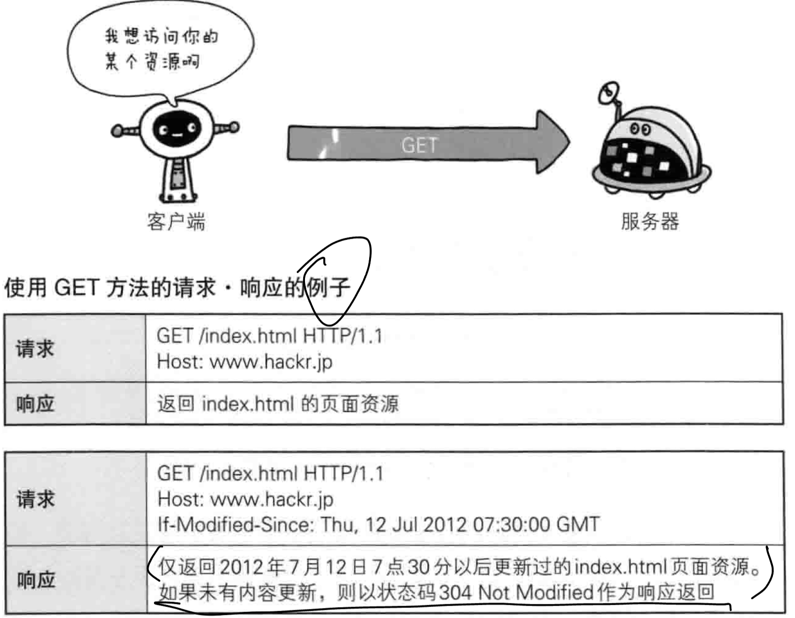

<hr>


### 2. POST

- 用来传输实体的主体

> 主要用于给服务器发送数据，而不是获取数据
>
> 服务器会根据发送的数据返回对应的处理结果


Eg:

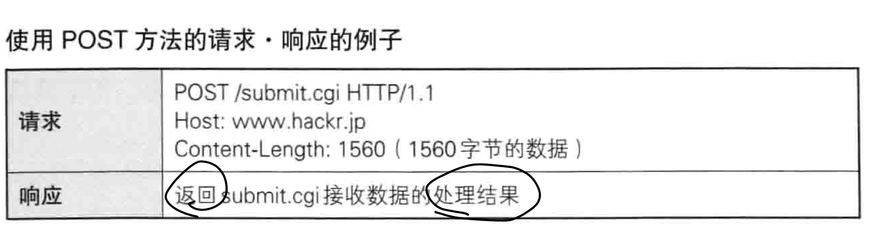

<hr>


### 3. PUT

- 用于传输文件给服务器

和FTP协议文件上传一样，需要在请求报文的内容实体部分包含文件内容，并将文件保存在URI指定的位置处


> 鉴于HTTP/1.1的PUT方法本身不带验证机制，所以存在安全性问题，因此一般的网站都不会使用该方法


Eg:

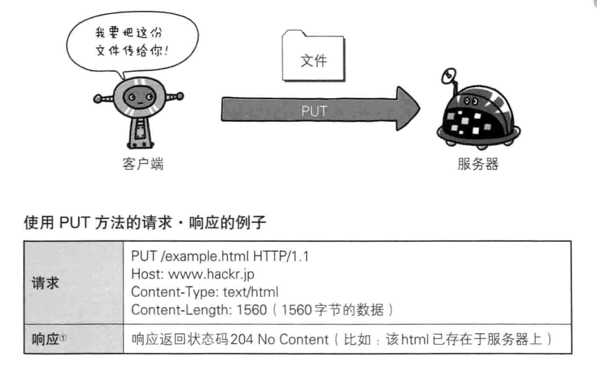

<hr>


### 4. HEAD

- 用来确定URI的有效性/资源更新的日期时间等等(查看相关的信息)

> 与GET不同的是，该方法不会返回报文主体


Eg:

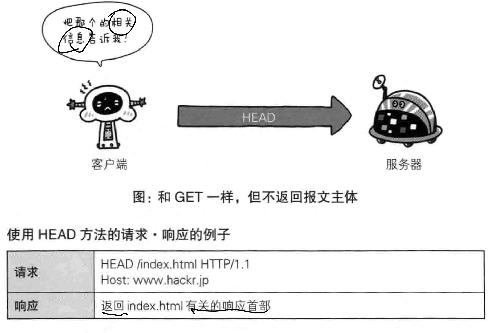

<hr>


### 5. DELETE

- 用来删除文件，与PUT相反
- 按照请求URI删除对应的资源


> 鉴于HTTP/1.1的PUT方法本身不带验证机制，所以存在安全性问题，因此一般的网站都不会使用该方法


Eg:

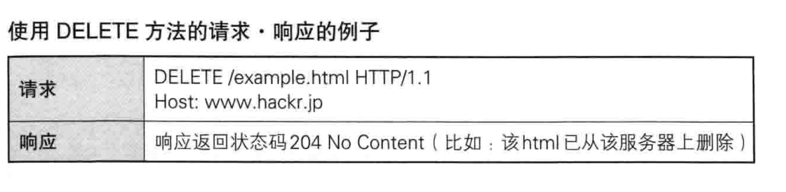

<hr>


### 6. OPTIONS

- 用来查询针对请求URI指定的资源支持的方法


Eg:

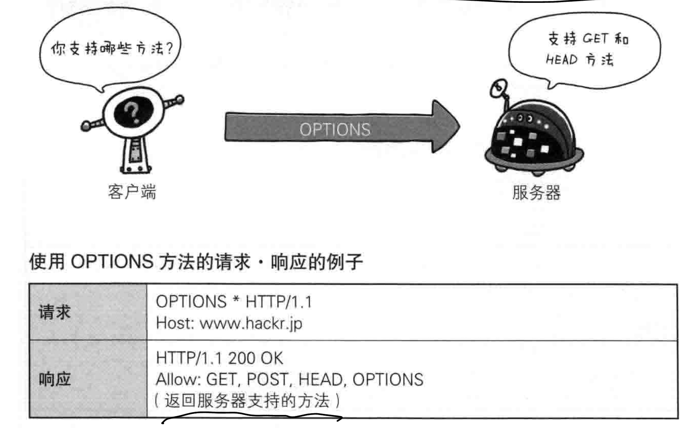

<hr>


### 7. TRACE

- 让服务器端将之前的请求通信环回给客户端；用来确认连接过程中发生的一系列操作

> 客户端可以通过TRACE方法查询发送出去的请求是怎样被加工修改/篡改的


TRACE方法容易引起XST(Cross-Site Tracing，跨站追踪)攻击，所以基本不会用到


Eg:

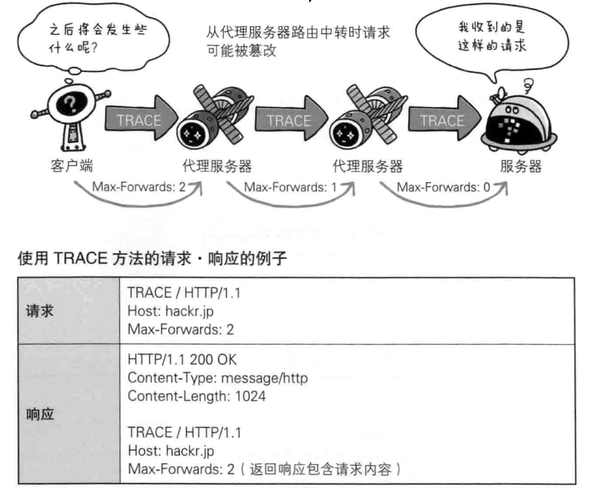

<hr>


### 8. CONNECT

- 要求在与代理服务器通信时建立隧道，实现用隧道协议进行TCP通信(SSL/TLS)


Eg:

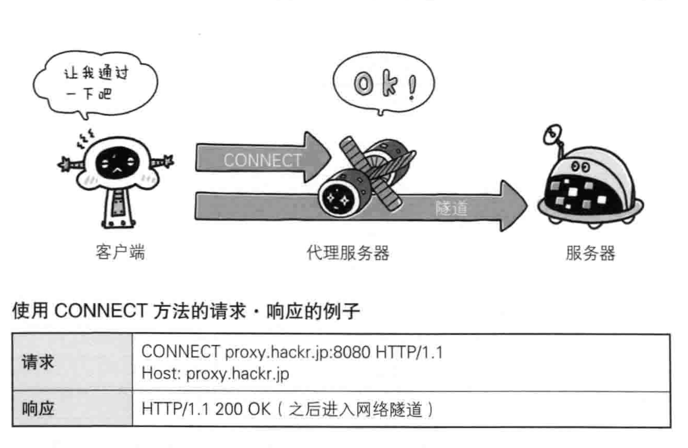

<hr>


## 5) 请求方法的命令

- 向URI指定的资源发送请求报文时，使用**称为方法的命令**


不同HTTP版本对于的方法

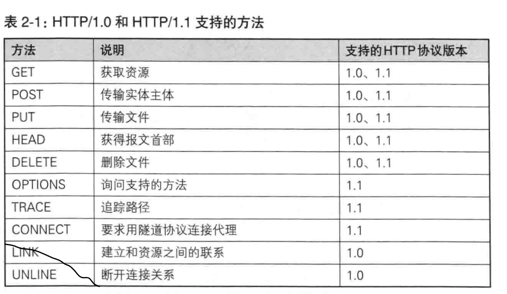

<hr>


## 6) 持久连接节省通信量

在HTTP/1.0中，每进行一次HTTP通信**就要断开一次TCP连接**(每次建立TCP连接都需要进行一次三次握手以建立连接)

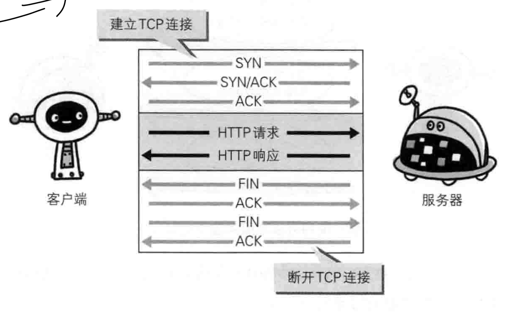


- 然而一旦页面的资源变多之后，就需要反复进行多次的TCP连接建立和断开操作，从而增加通信量的开销

<hr>


### 1. 持久连接

- 为了解决频繁建立/断开连接这样的情况，HTTP/1.1和部分HTTP/1.0想出了持久连接(HTTP Persistent Connections)，称为HTTP keep-alive/HTTP connection reuse

> 持久连接的特点: 只要任意一端没有明确提出断开连接，则保持TCP连接
>
> 只需要建立一次连接后，就能进行多次请求和响应了


Eg:

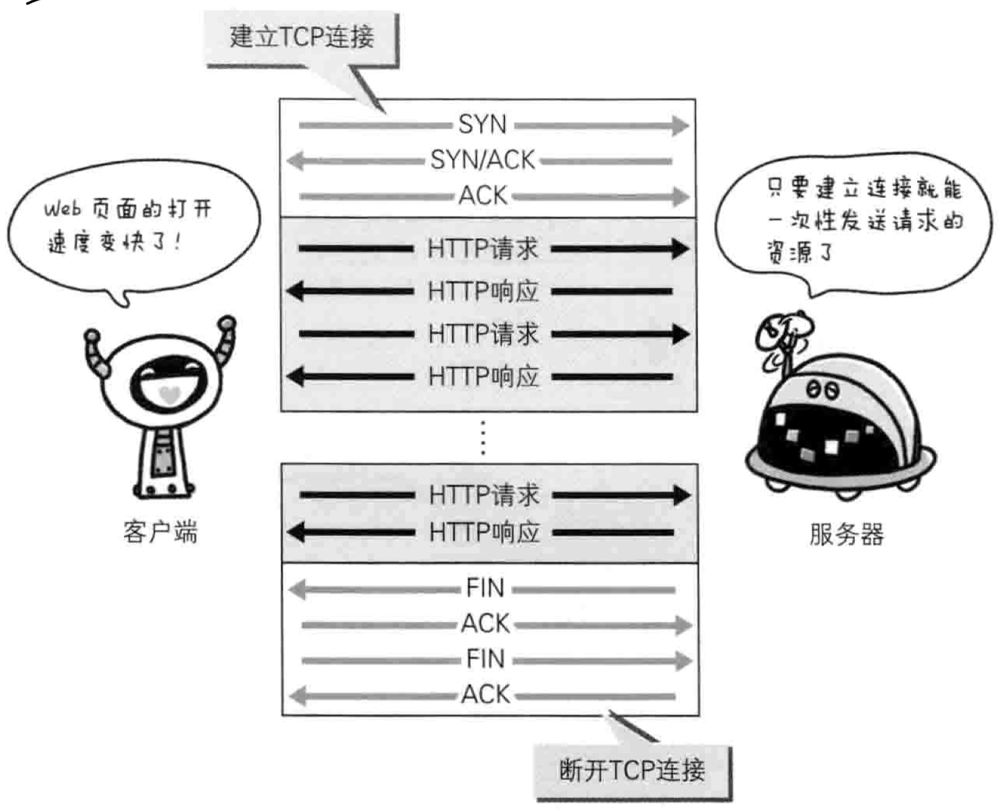


持久连接的好处:

- 减少了TCP连接的重复建立和断开所造成的额外开销，为服务器减负
- 减少开销的那部分时间，能够让HTTP请求和响应能够更早的结束，这样Web页面就能更快的显示出来

> HTTP/1.1中，所有的连接默认都是持久连接

<hr>


### 2. 管线化

- 管线化(pipelining)方式实现的前提是: 持久连接

> 以前发送请求时，需要等待并收到响应后才能发送下一个请求
>
> 管线化技术可以让请求之间不需要等待(并发)


请求数越多，管线化的优势越明显

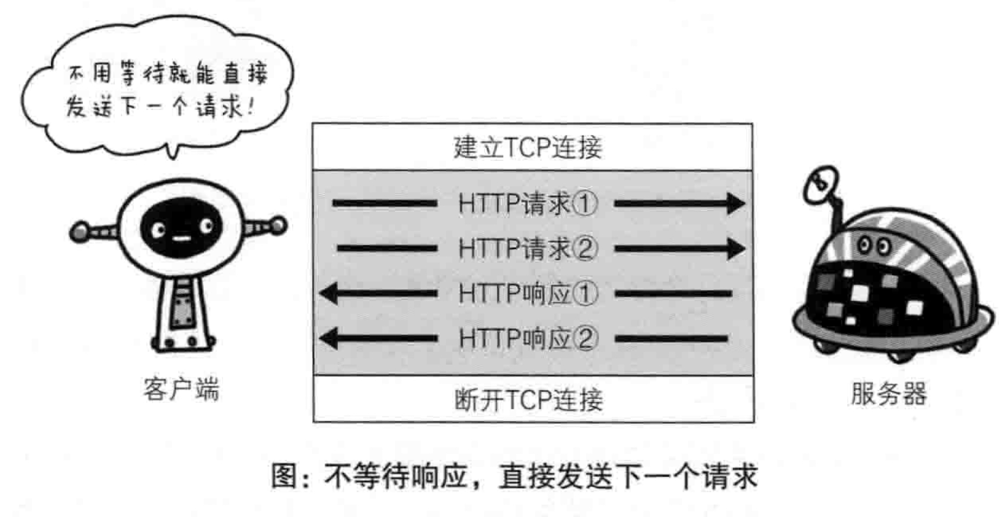

<hr>


### 3. 使用Cookie管理状态

- HTTP是无状态协议，其不会记录发送/接收过的请求和响应
- 所以就无法根据之前的数据/状态对本次请求做相关的处理


为什么HTTP不加上状态管理?

> 因为不必保存状态，可以减少服务器的CPU和内存资源的消耗
>
> 正因为HTTP如此简单，所以会被应用在各种场景中

- 但不可能让服务器记住所有的客户端状态，这是巨大的负担


- 为了保留HTTP无状态保留这个特征的同时，又要解决类似的矛盾问题，我们引入了Cookie技术

> 通过在请求/响应报文中写入Cookie信息来控制客户端的状态(服务器端写给客户端)


过程:

- 客户端第一次访问的时候，服务器端在响应报文中添加一个Set-Cookie的首部字段信息
- 下次客户端访问的时候，客户端就会在请求中加上之前得到的Cookie并发送出去
- 这样服务器端就能根据请求报文中的Cookie查询对应的客户端信息，从而得到对应的状态信息(登陆状态等等)

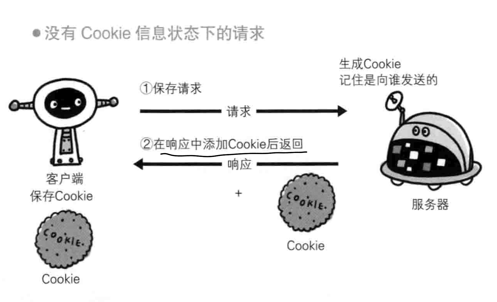


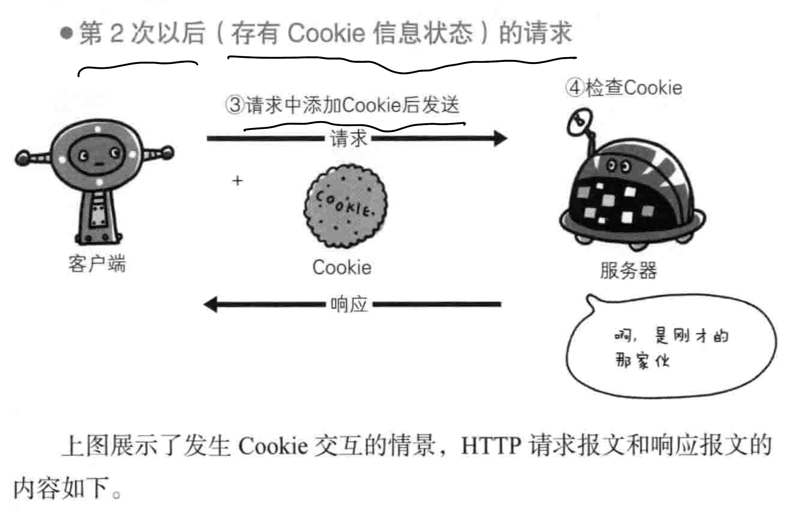


引入Cookie后的请求/响应报文:

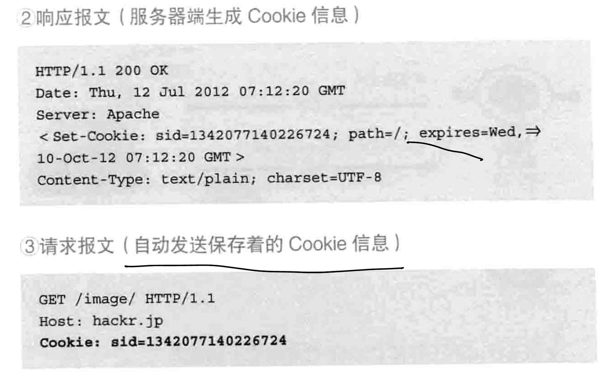

<hr>


# 三、HTTP报文内容

- 使用HTTP协议进行交互的信息都是HTTP报文
- 请求端(客户端)的HTTP报文称为请求报文
- 响应端(服务器)的HTTP报文称为响应报文
- HTTP报文就是多行数据构成的字符串文本


HTTP报文结构: 可大致分为报文首部和报文主体，两者中间有一个空行(CR+LF)划分

报文主体不是必须的


Eg:

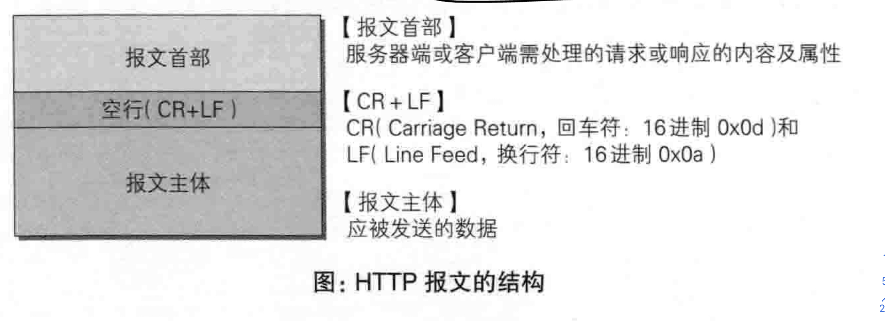

<hr>


## 1) 请求/响应报文的结构

 Eg:

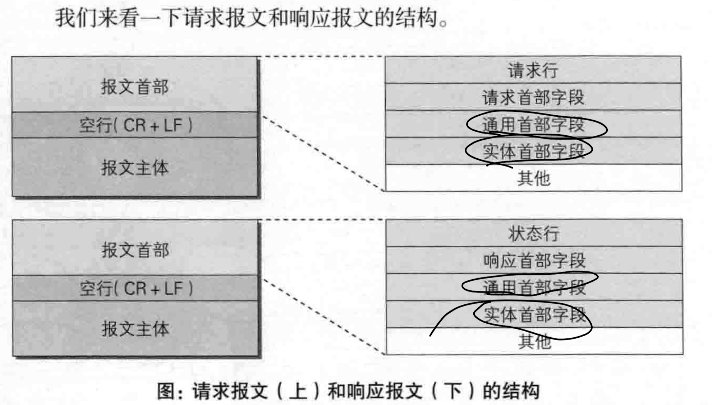


实例:

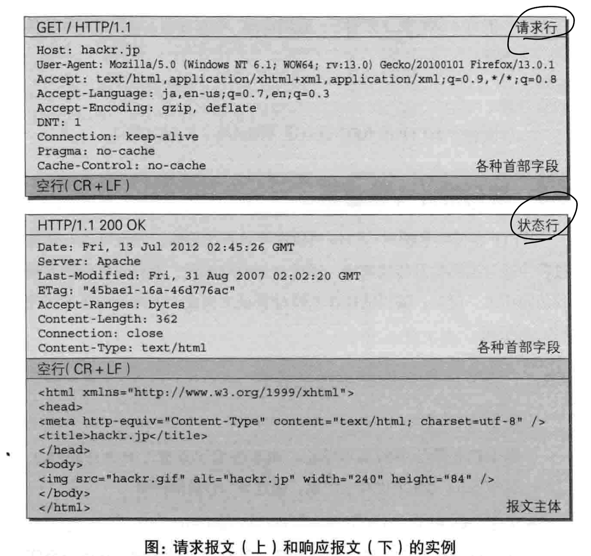

- 请求行:

请求的方法 + 请求URI + HTTP版本


- 状态行:

HTTP版本 + 响应结果的状态码 + 原因短语


- 首部字段:

请求/响应的各种条件和属性的各类首部

首部一般分为4种:

1. 通用首部
2. 请求首部
3. 响应首部
4. 实体首部

<hr>


## 2) 编码提升速率

- 使用HTTP传输数据时，不仅可以按照数据的原貌直接传输
- 还可以在传输时通过编码来提升传输的速率(但是编码的过程需要消耗一定的算力)


### 1. 报文主体和实体主体的差异

- 报文(message)

HTTP通信中的**基本单位**，由8位组字节流组成，**通过HTTP通信传输**


- 实体(entity)

作为请求/响应的载荷数据被传输，由实体首部和实体主体组成


> HTTP报文主体用于传输请求/响应的实体主体
>
> 如果传输中进行了编码操作，实体和报文主体就会出现差异
>
> 实体主体经过压缩后，就会得到报文主体

<hr>


### 2. 压缩传输的内容编码

- HTTP的**内容编码**功能可以对传输内容进行压缩
- 内容编码指明应用在实体内容上的编码格式

> 内容编码后的实体主体由客户端接收并负责编码


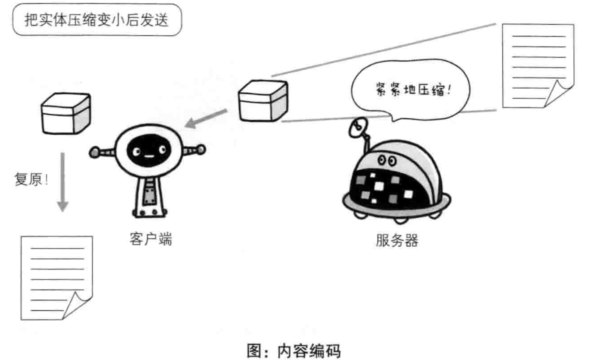

<hr>


### 3. 分割发送的分块传输编码

- 以前: 请求的资源尚未全部传输完成之前，浏览器无法显示请求的页面
- 现在: 将数据分割成多块进行传输，能够让浏览器逐步显示页面

> 把实体主体分块的功能称为分块传输编码(Chunked Transfer Coding)


Eg:

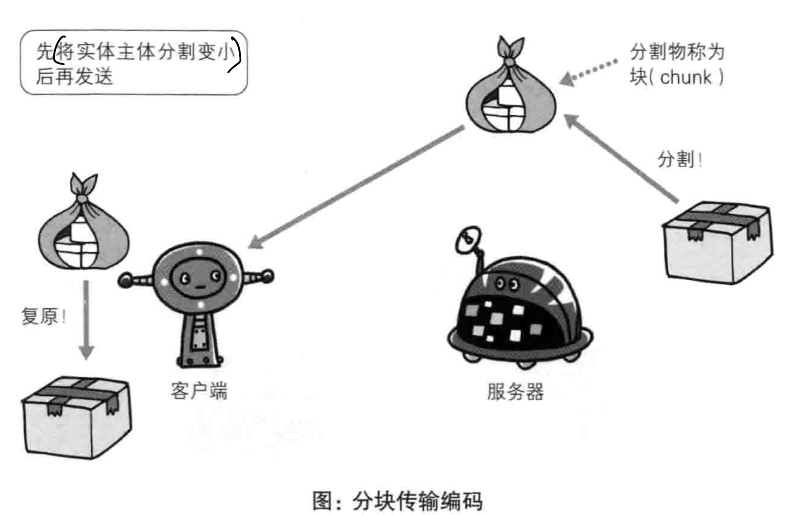


- 分块传输会将实体主体分为多个部分(块)
- 每块都会用16进制来标记块的大小，实体主体的最后一个块会使用0(CR+LF)来标记(即标记空行)
- 分块传输编码后的实体主体会由接收的客户端负责解码

> HTTP/1.1中的传输编码(Transfer Coding)机制可以指定通信时的传输编码方式，但只有在使用分块传输编码时才有用

<hr>


### 4. 发送多种数据的多部分对象集合

- 因为采用了MIME(Multipurpose Internet Mail Extensions)机制，所以邮件可以处理文本、图像、视频等不同类型的数据
- MIME扩展中，使用了一种称为多部分对象集合(multipart)的方法，来容纳多份不同类型的数据

> HTTP协议中也可以使用多部分对象集合方法，所以一个报文主体内可以含有多种类型的实体(一般是在图片/文本等上传时使用)


多部分对象集合对应的不同对象

- multipart/form-data

用于web表单文件上传

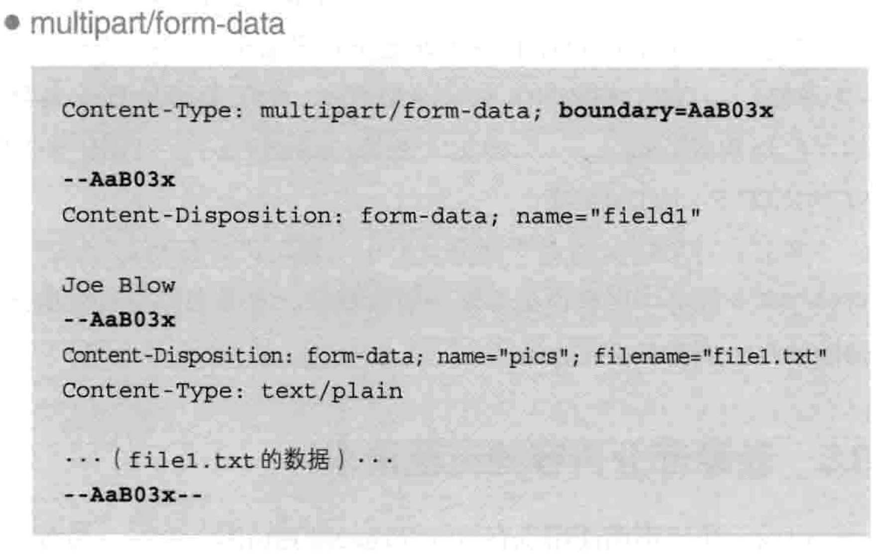


- multipart/byteranges

用于表明报文中包含多个范围的内容

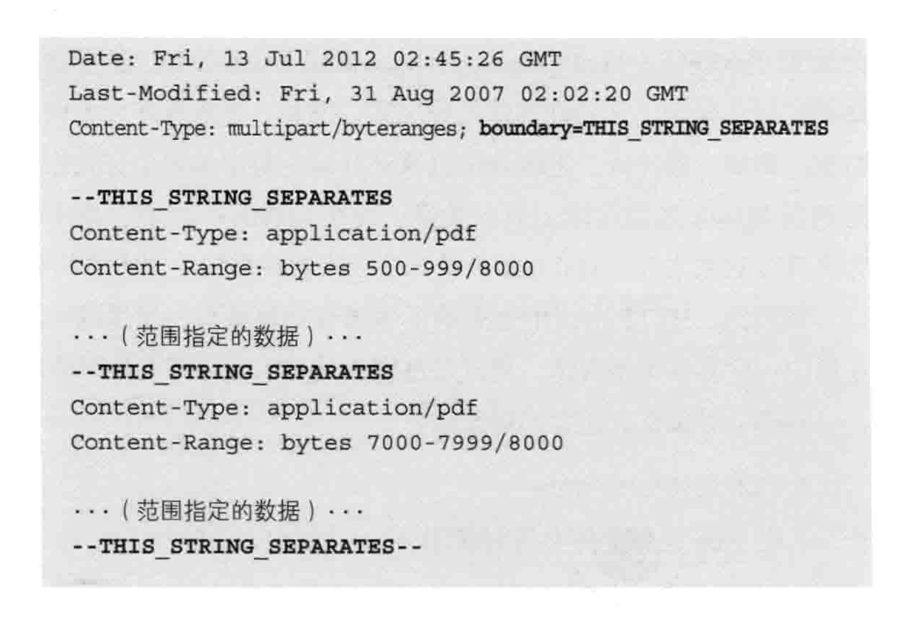


- 其中boundary指定一个字符串**作为划分各部分对象集合的各类实体的标志**

<hr>


## 3) 获取部分内容的范围请求

以前的问题:

- 如果文件比较大，下载过程中网络一旦中断，就必须从头开始


为了解决该问题，出现了一种可恢复的机制——范围请求(range request)

> 范围请求可以指定下载的实体范围


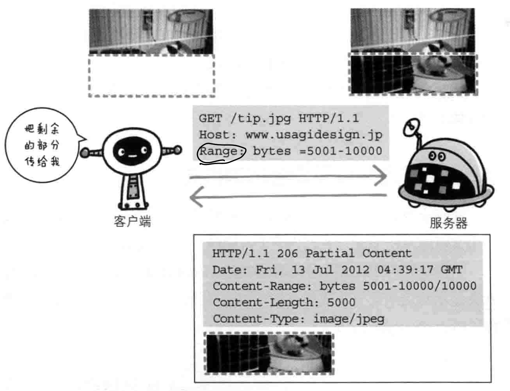


- 使用范围请求的方式: 在请求首部字段中添加Range字段，并指定资源的byte范围

```http
-- 指定范围为5001到10000字节
Range: bytes=5001-10000

-- 指定范围为5001字节之后的所有
Range: bytes=5001-

-- 指定多重字节范围
Range: bytes=-3000, 5000-7000
```

- 如果服务器无法响应(不支持)响应范围请求，则会返回200 OK，并返回完整的实体内容

<hr>


## 4) 内容协商返回合适的内容

- 一个网站可能有多份内容相同的页面，比如首页有不同语言的版本，它们在内容上相同，只是语言上不同

具体显示怎样的页面取决于浏览器的默认语言，这样的机制称为内容协商(Content Negotiation)

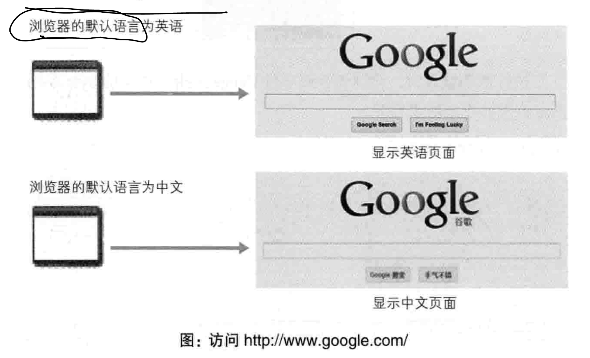


> 内容协商是指客户端和服务器端就响应的资源内容进行交涉，然后给客户端最合适的资源
>
> 内容协商的基准为响应资源的语言、字符集、编码方式等等


一些首部字段也能作为判断的基准:

- Accept
- Accept-Charset
- Accept-Encoding
- Accept-Language
- Content-Language


内容协商的3种类型:

- 服务器驱动协商(Server-driven Negotiation)

以请求的首部字段为参考(在服务端处理)


- 客户端驱动协商(Client-driven Negotiation)

用户自行选择


- 透明协商(Transparent Negotiation)

以上两者的结合

<hr>


# 四、HTTP状态码

- 状态码的职责:

当客户端向服务器端发送请求的时候，表示返回的请求结果


- 客户端可以根据状态码知道请求是否被正确处理
- 状态码的第一位指定了响应的类别，共有一下5类:

|      |           类别           |           原因短语           |
| :--: | :----------------------: | :--------------------------: |
| 1XX  |  Informational(信息性)   |         请求正在处理         |
| 2XX  |      Success(成功)       |       请求正常处理完毕       |
| 3XX  |   Redirection(重定向)    | 需要进行附加操作才能完成请求 |
| 4XX  | Client Error(客户端错误) |      服务器无法处理请求      |
| 5XX  | Server Error(服务器错误) |      服务器处理请求错误      |


- HTTP状态码一共有60种之多，但常用的只有14种

<hr>


## 1. 2XX成功

> 表示请求被正确地处理了


### 1) 200 OK

- 表示客户端发送的请求被服务器正确处理了

<hr>


### 2) 204 No Content

- 请求已经成功处理，但返回的响应报文中没有实体主体，也不允许返回任何实体的主体


一般只需要从客户端往服务器发送信息，且客户端不需要发送任何新内容时使用

<hr>


### 3) 206 Partial Content

- 表示客户端发起了范围请求，且服务器成功执行了该GET请求


此时响应报文中的实体内容为Content-Range指定的

<hr>


## 2. 3XX重定向

- 表明需要浏览器/客户端执行某些特殊处理才能正确地处理请求


### 1) 301 Moved Permanently

- 永久重定向

> 表示请求的资源已经被分配了新的URI
>
> 此时会在Location首部字段中提示新的URI

<hr>


### 2) 302 Found

表示请求的资源已经被分配了新的URI

> 和301类似，但302只是临时移动

<hr>


### 3) 303 See Other

表示请求的资源存在另一个URI，让客户端使用`GET`方法去获取对应URI的资源

> 功能上与302相同，但303明确表示客户端应该使用GET方法


### 小结

> 301, 302, 303返回时，所有浏览器都会将POST改为GET，并删除请求报文内的内容主体，然后再自动方法请求
>
>
> 虽然301、302禁止这种做法，但实际使用时大家都这样做

<hr>


### 4) 304 Not Modified

此时对应的客户端请求中必然包含附带条件

该状态表示服务器允许请求访问资源，但资源不满足请求中的附带条件

> 304返回时，不包含响应主体
>
> 304与重定向没有关系

<hr>


### 5) 307 Temporary Redirect

临时重定向

> 与302有相同的含义
>
> 307会遵照浏览器标准，不会从POST变为GET(具体还要看浏览器的请求)

<hr>


## 3. 4XX客户端错误

> 4开头的状态码说明客户端是错误发送的原因所在


### 1) 400 Bad Request

> 请求报文中存在语法错误

浏览器会像200 OK一样处理它

<hr>


### 2) 401 Unauthorized

> 发送的请求需要有通过HTTP认证的认证信息
>
> 如果之前请求过一次，则说明认证失败

<hr>


### 3) 403 Forbidden

> 请求资源的访问被服务器拒绝了

一般是用户的权限有问题

<hr>


### 4) 404 Not Found

> 服务器上没有对应的资源(URI错误)

<hr>


## 4. 5XX服务器错误

> 5XX表示服务器本身出现问题


### 1) 500 Internal Server Error

> 表示服务器在执行时发生了错误

<hr>


### 2) 503 Service Unavailable

> 表示服务器暂时处于维护/过载状态，现在无法处理

<hr>


# 五、Web服务器


## 1. 虚拟主机实现多个域名

- HTTP/1.1中，允许一台HTTP服务器利用虚拟主机的功能搭建多个站点(每个站点的域名不同)


因为多个站点都在一台服务器上，所以域名解析后得到的IP地址是相同的

为了区分它们，在发送请求的时候必须在Host首部内指定完整的主机名或者URI

> 一台服务器对应一个IP，但通过虚拟主机可以模拟成多个主机和多个域名站点
>
> 所以在请求同一个IP下的不同域名时，要指明访问的虚拟主机名

<hr>


## 2. 数据转发: 代理/网关/隧道

HTTP通信时，部分应用程序可以用于通信数据转发


- 代理: 接收客户端的请求并转发给服务器，同时接收服务器的响应并返回给客户端
- 网关: 接受客户端的请求，像拥有资源的源服务器那样处理请求
- 隧道: 在远距离传输时进行中转，保持通信连接

<hr>


### 1) 代理

- 代理服务器的行为:

接受客户端的请求后转发给其他服务器(不改变URI)

从源服务器(持有资源实体的服务器)返回的响应经过代理服务器后再传给客户端


- 通信时可以多台代理服务器级联
- 转发时会添加Via首部字段来标记经过的主机信息


代理服务器的优点:

> 可以使用缓存减少流量负担
>
> 设置针对特定网站的访问控制，以获取日志


代理的分类方式:

- 是否使用缓存
- 是否会修改报文


- 缓存代理(Caching Proxy)

> 缓冲代理会将资源的副本保存在代理服务器上，之后再次接收到相同请求时，直接返回代理服务器的资源即可


- 透明代理(Transparent Proxy)

> 转发请求和响应时，不对报文做任何修改/加工的代理
>
> 反之则为非透明代理

<hr>


### 2) 网关

- 其能为通信线路上的服务器提供非HTTP协议通信

优点:

>提高通信的安全性，在客户端与网关之间连接加密线路

<hr>


### 3) 隧道

- 不会解析HTTP请求，保持请求的原样中转给服务器

目的: 确保客户端和服务器之间进行安全的通信


> 通过隧道通信，可以远距离与服务器进行通信
>
> 客户端不用在意隧道的存在

<hr>


## 3. 缓存

因为客户端要求、缓存有效期等原因，有时需要向源服务器确定缓存资源的有效性

- 如果缓存判定为无效，则缓存服务器(代理)会再次向源服务器获取新的资源来更新缓存


### 1) 客户端上的缓存

- 缓存可以存在于客户端浏览器上
- 和缓存服务器一样，如果缓存过期，则依然会向源服务器请求更新缓存

<hr>


# 六、HTTPS


## 1. HTTP的缺点

- 通信时使用明文，内容会被窃听
- 不验证通信双方的身份，可能遭遇伪装
- 无法证明报文的完整性，无法保证接收到的报文没有被更改

未加密的协议都会存在这些问题

<hr>


### 1) 明文通信会被窃听

- HTTP本身不具备加密的功能，所以无法做到对通信内容(请求/响应的内容)进行加密
- 所以HTTP通过明文的方式对报文进行传输


#### TCP/IP可能被窃听

- 只要是按照TCP/IP协议族进行通信，则网络中所有的通信内容都会被看到(不管是否加密)


#### 加密处理

防止窃听的对策中，最普及的就是加密技术，按照加密的对象分类:


##### 1. 通信路线加密

- 即将通信路线进行加密

> HTTP通过和SSL或者TLS组合使用，可以加密HTTP的通信内容


用SSL建立安全的通信路线之后，即可在该路线上进行HTTP通信了，即为HTTPS(HTTP Secure)


Eg:

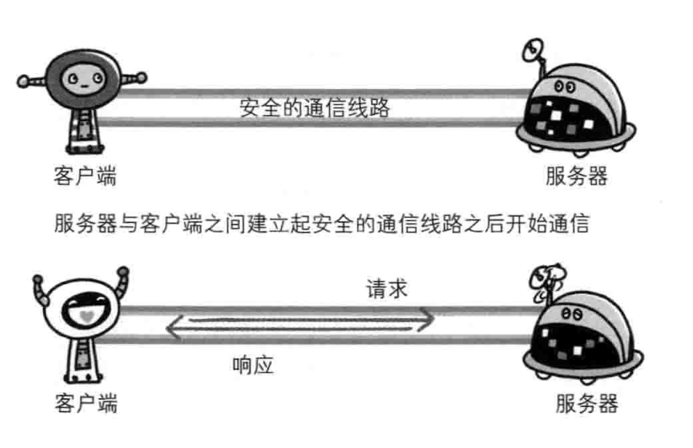

<hr>


##### 2. 内容加密

- 即将通信的内容本身进行加密处理(报文主体)

> 客户端需要对HTTP报文进行加密后才能发送请求

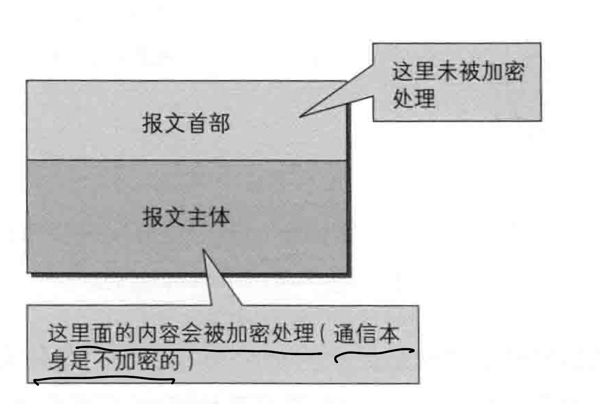


- 为了做到有效的内容加密，需要客户端和服务器都能进行加密和解密
- 因为通信路线依然没有加密，所以内容仍有可能被篡改

<hr>


### 2) 身份可能被伪装

- 因为HTTP不会对通信双方进行身份验证，所以会存在身份伪装的问题:

无法确定返回响应的是否就一定是真正的服务器，无法确定接收响应的一定是之前发送请求的客户端


#### 任何人都能发送请求

- 因为HTTP通信时，不会对通信方进行确认，所以任何人都能向服务器发送请求。而服务器接收到请求后不会进行任何验证而直接返回响应

因为不会确认通信双方的身份，所以会存在一些问题:

1. 无法确定返回响应的就是真正的目标服务器
2. 无法确定接收响应的就是真正的客户端
3. 无法确认访问权限
4. 无法获取请求的来源信息
5. 不会拒绝任何请求，无法阻止海量请求攻击

<hr>


#### 查看证书

- 使用SSL可以确定通信方，还可以进行加密处理
- 证书由值得信赖的第三方颁布，且伪造证书从技术角度来说很困难

> 所以只要能够确定客户端/服务器的证书，就能判断对方的身份了


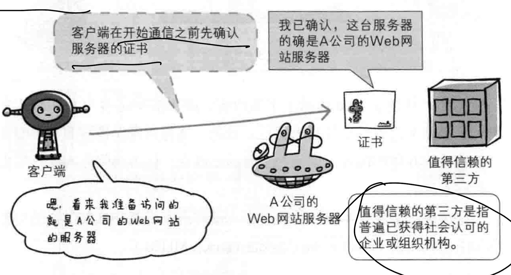

<hr>


### 3) 无法验证报文完整性，可能被篡改


#### 接收到的内容有误

- HTTP无法确认请求/响应在被接收到之后是相同的

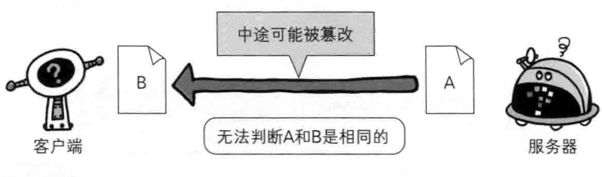


> 请求/响应的在传输时，遭到拦截并篡改内容的攻击称为中间人攻击

<hr>


#### 防止篡改

- 最常用的方法
    - MD5、SHA-1等Hash校验
    - 数字签名

缺点:

> 需要客户端自己验证下载的文件对应的Hash值

<hr>


## 2. HTTPS


### 1) 定义

> 在HTTP的基础上加上加密、认证和完整性保护，即为HTTPS


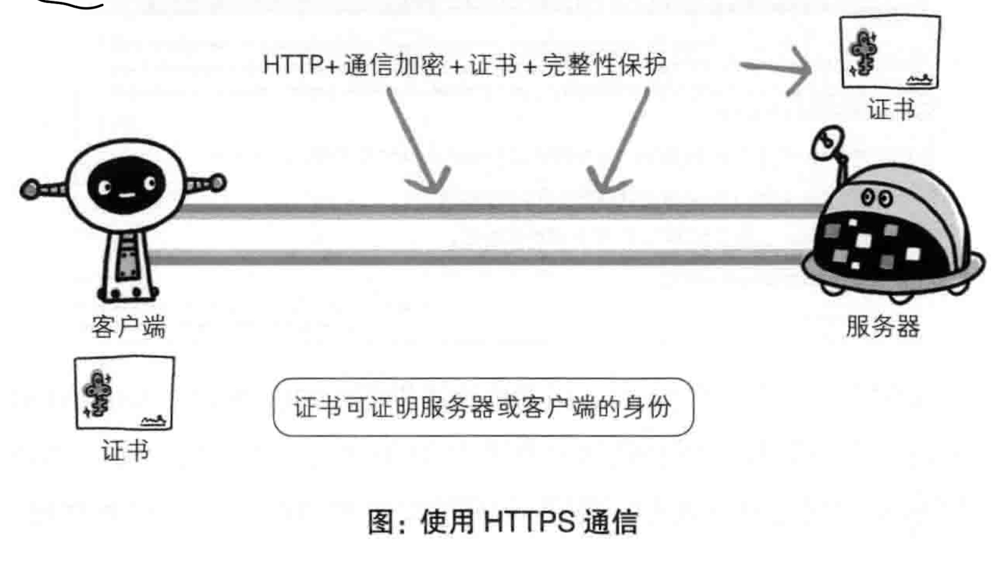

<hr>


### 2) SSL

> HTTPS只是HTTP协议通信接口部分使用了SSL和TLS协议代替而已


- 使用SSL之前:

HTTP直接和TCP进行通信


- 使用SSL之后

HTTP先和SSL通信，再由SSL和TCP通信

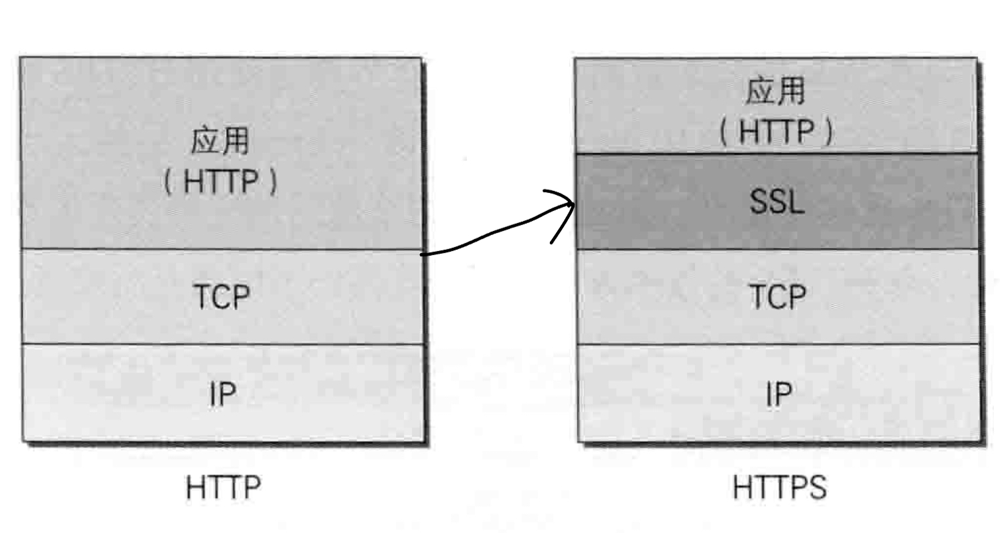

> SSL是应用最广泛的网络安全技术


## 3. 公开密钥加密

- SSL采用公开密钥加密的方式(Public-key cryptography)
- 这种加密方法中，加密算法是公开的，但密钥是保密的
- 加解密都会用到密钥，没有密钥则无法解密

<hr>


### 1) 共享密钥加密

> 加密解密使用同一个密钥的方式即为共享密钥加密，也称对称密钥加密


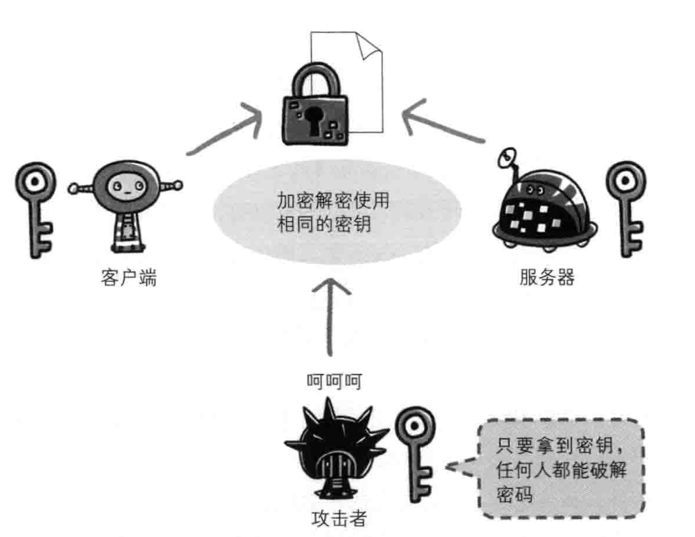

缺点:

- 共享密钥加密需要将密钥也发送给对方，但密钥可能在转发过程被窃取
- 如果能够保证安全发送密钥的化，数据也能安全发送了，这样一来加密也就没有意义了

<hr>


### 2) 公开密钥加密

- 公开密钥加密使用一把公开密钥和一把私有密钥，其中公开密钥可以随意发送给任何人

> 发送信息的一方使用对方的公钥进行加密，接收到信息的一方使用私钥进行解密
>
> 如此一来，不需要发送解密的私钥，就不用担心密钥被盗走了


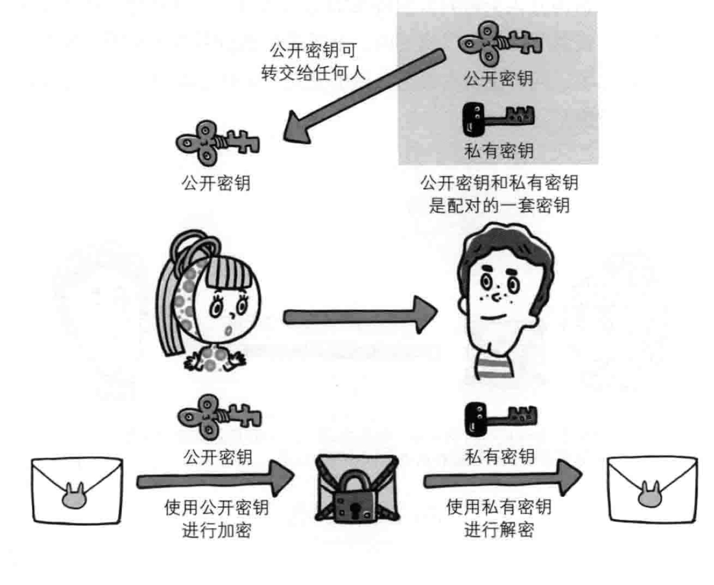

<hr>


### 3) HTTPS采用混合加密机制

> 对称加密方式不安全，但是处理速度快
>
> 非对称加密方式速度慢，但是安全

- 如果密钥能够实现安全交换，则使用对称加密方式


结合两者的优点:

> 在密钥交换环节使用非对称加密
>
> 建立通信后交换报文时则使用对称加密


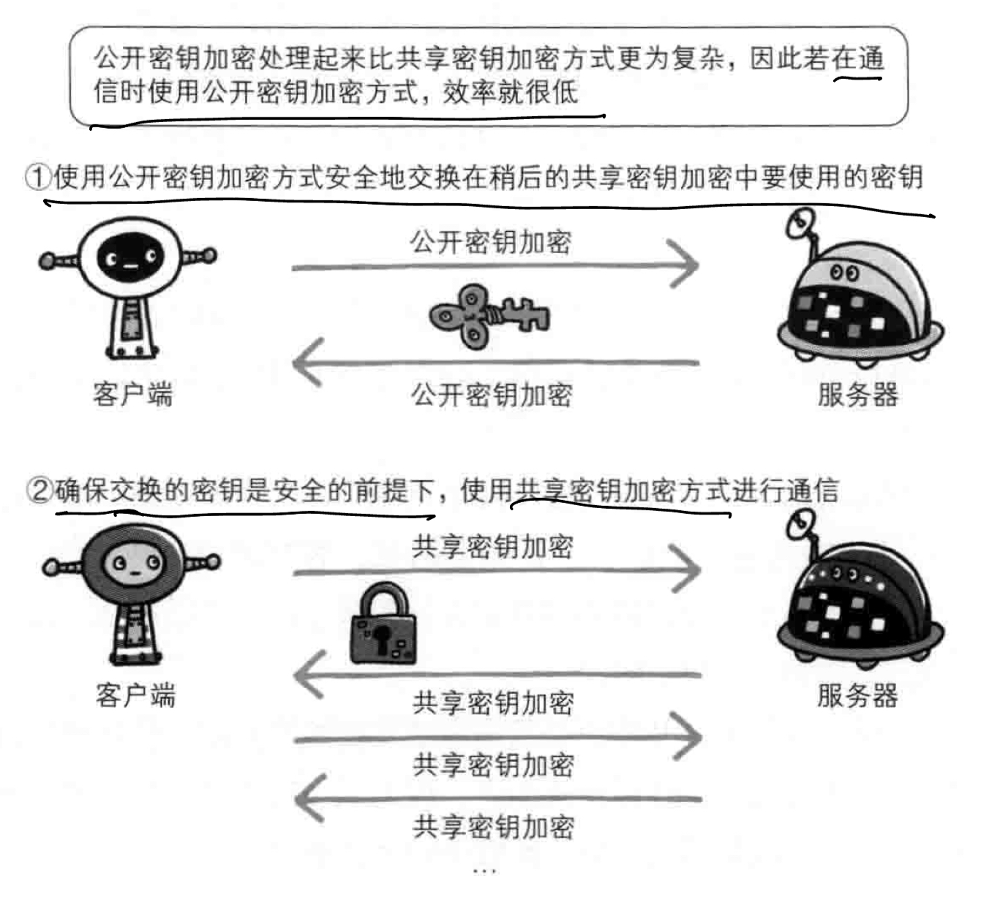

<hr>


### 4) 证明公钥正确

非对称加密的问题:

- 无法证明公开的密钥是真实可靠的(可能被中途替换)


为了解决这个问题，可以使用由数字证书认证机构(CA)和相关机构颁发的公钥证书

- 因为安全转交认证的公钥比较困难，所以浏览器一般会内置认证机关的公钥

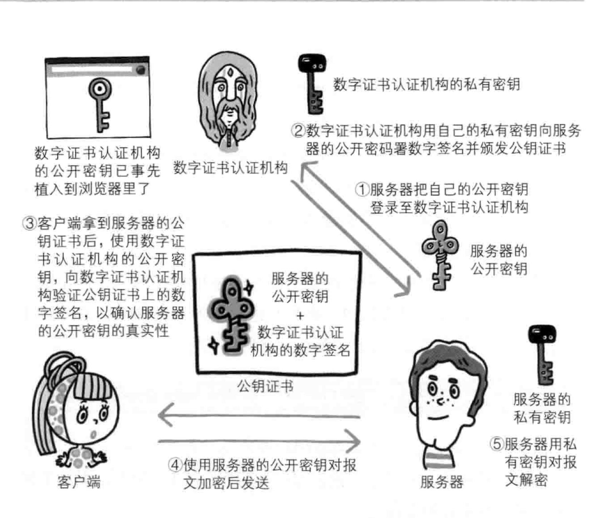

<hr>


### 5) HTTPS通信机制

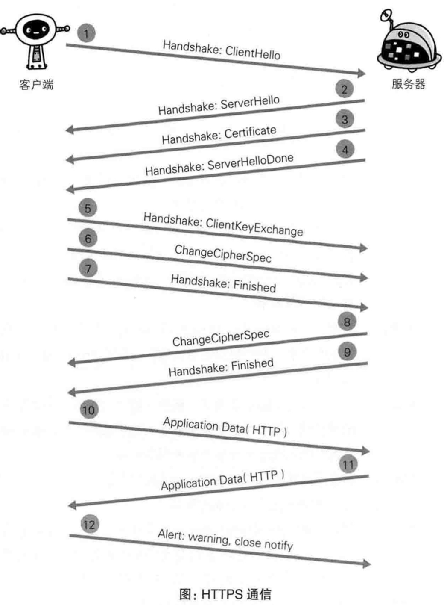


1. 客户端发送报文开始SSL通信，发送了客户端支持的SSL版本、加密组件列表
2. 服务器以Server Hello报文进行响应，同样会发生SSL版本和加密组件
3. 服务器发送公钥证书
4. 服务器发送Server Hello Done报文，表示SSL第一次握手部分协议结束
5. SSL第一次握手结束后，客户端回应Client Key Exchange报文，其中包含随机密码串(Pre-master secret)，且报文使用从3中获取的公钥进行加密
6. 客户端发送Change Cipher Spec报文，提示服务器之后会使用Pre-master secret密钥进行加密
7. 客户端发送Finished报文，包含至今所有报文的校验值
8. 服务器发送Change Cipher Spec报文
9. 服务器发送Finished报文
10. 服务器和客户端的Finished报文交换完成后，SSL连接就连接完成了，之后发送HTTP请求
11. 发送HTTP响应
12. 最后客户端断开连接，发送close_notify报文，再发送TCP FIN来关闭TCP通信


- 以上步骤中，应用层发送数据时会带上MAC，其作为一种报文摘要，可以查知报文是否遭到篡改(Message Authentication Code)

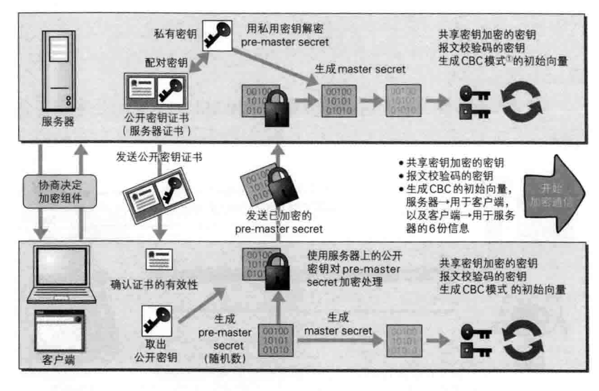

<hr>


#### SSL/TLS

- SSL: Secure Socket Layer
- TLS: Transport Layer Security

> TLS是以SSL为原型开发的协议


目前主流的是SSL3.0和TLS1.0

<hr>


#### SSL处理速度

- SSL处理慢的原因:
    - 通信慢
    - 大量消耗算力资源


与HTTP相比，网络负载会变慢2到100倍，处理和TCP、HTTP连接发送请求外，必须进行SSL通信，整体的处理通信量会增加

SSL必须进行加密处理，加密运算需要消耗服务器/客户端的硬件资源，会增加硬件的负载

<hr>


# 七、确定访问用户身份


## 1. 认证

认证即确定客户端的身份


HTTP/1.1使用的认证方式:

- BASIC认证(基本)
- DIGEST认证(摘要)
- SSL客户端认证(需要客户端证书，要钱)
- 表单认证(最常用)

<hr>


## 2. BASIC认证

- 在HTTP/1.0就定义了，其用于Web服务器与通信客户端之间进行认证


BASIC认证步骤:

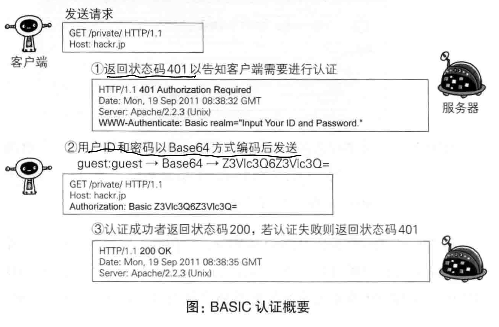


1. 服务器返回状态码为401的带WWW-Authenticate首部字段的响应，该字段包含认证方式(BASIC)和Request-URI安全域字符串(realm)
2. 客户端将用户和密码构造为字符串之后再进行Base64编码；如果客户端为浏览器，则会自动完成Base64编码的转换
3. 服务器对认证信息正确性进行验证


> Base64编码并不是加密处理，不需要任何附加信息即可对其解码
>
> 因此在非加密通信线路上进行BASIC认证时，极易被盗

<hr>


## 3. DIGEST认证

从HTTP/1.1开始

- DIGEST使用质询/响应的方式，而不是发送明文密码


过程:

- 客户端一方发送认证要求给另一方
- 从服务器接收质询码
- 根据质询码计算生成响应码并返回

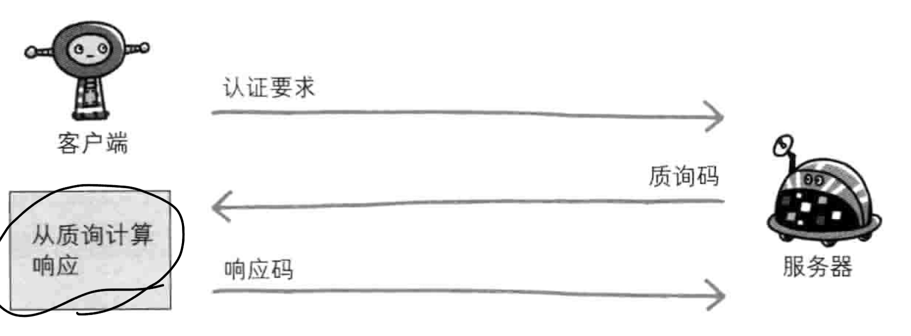

<hr>


## 4. SSL客户端认证

- 如果用户ID和密码被盗，则会被冒用，但SSL客户端认证可以避免该种情况发生

> SSL借助HTTPS客户端证书完成认证，借助客户端证书认证，服务器可以确定访问是否来自已经登录的客户端


### 1) SSL客户端认证的步骤

> 为了实现SSL客户端认证，需要客户端事先安装该证书


步骤

1. 服务器发送`Certificate Request`报文，要求客户端提供证书
2. 客户端将客户端证书信息以`Client Certificate`报文的形式发送给服务器
3. 服务器验证客户端证书通过后，使用证书内的公钥进行加密通信

<hr>


### 2) SSL客户端认证采用双因素认证

- SSL客户端认证和基于表单认证组合形成一种双因素认证来使用

> 客户端证书认证用来认证客户端PC
>
> 基于表单的密码认证则用来确定用户本人

<hr>


### 3) SSL客户端认证费用

客户端证书需要支付一定的费用才能使用

<hr>


## 5. 基于表单认证

- 基于表单的认证方法并不是在HTTP协议里定义的，服务器会按照登录信息的验证结果进行认证(就是账号密码认证)

<hr>


### 1) 表单认证最常用

- 出于便利性和安全性的考虑，BASIC和DIGEST认证几乎不使用
- SSL客户端认证需要证书导入，以及证书购买，所以还未普及


> Web网站的认证功能并没有满足安全使用级别的规范
>
> 所以一般用Web应用实现基于表单的认证方式

<hr>


### 2) Session管理/Cookie应用

- 使用基于表单的认证时，会使用Cookie来管理Session
- 我们会使用Cookie来管理Session以弥补HTTP协议中不存在状态管理功能的缺陷

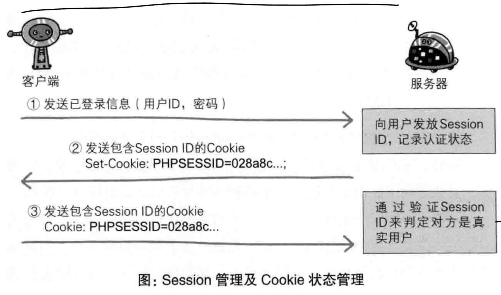


步骤:

1. 客户端将用户id和密码放入报文实体，以POST方法将请求发送给服务器
2. 服务器会识别用户的SessionID，将用户的认证状态与SessionID绑定后记录到服务器中
    客户端返回响应时，会在首部字段Set-Cookie中写入SessionID；必须防止SessionID被盗
3. 客户端接收服务器发送的Seesion ID，将其作为Cookie保存在客户端本地，之后请求时会自动在请求中添加Cookie，其中的Session ID也会发送到服务器


安全的保存方式: 给密码加盐以增加额外信息，再利用Hash函数计算出散列值后保存


加盐(salt):

> 由服务器随机生成一个够长的字符串，将其与密码字符串相连接，生成hash值
>
> 这样就算两个用户使用同样的密码，因为随机的salt值不同，所以生成的hash值也不同
>
> 这样一来就减少了密码特征

<hr>


# 八、基于HTTP的功能追加协议


## 1. 消除HTTP瓶颈的SPDY

- 2010由Google发布的一个新的协议，旨在解决HTTP性能问题，缩短Web页面加载时间

<hr>


### 1) HTTP瓶颈

> 使用HTTP协议探知服务器是否有内容更新，需要频繁从客户端到服务器进行确认
>
> 频繁的探知会产生徒劳的通信


HTTP目前的瓶颈:

- 一条连接上只能发送一个请求
- 请求只能从客户端开始，客户端不能接收响应外的指令
- 报文首部没有经过压缩，因此首部信息多的话，延迟就会变得严重
- 首部较多，互相发送相同首部造成较多浪费
- 不强制压缩发送

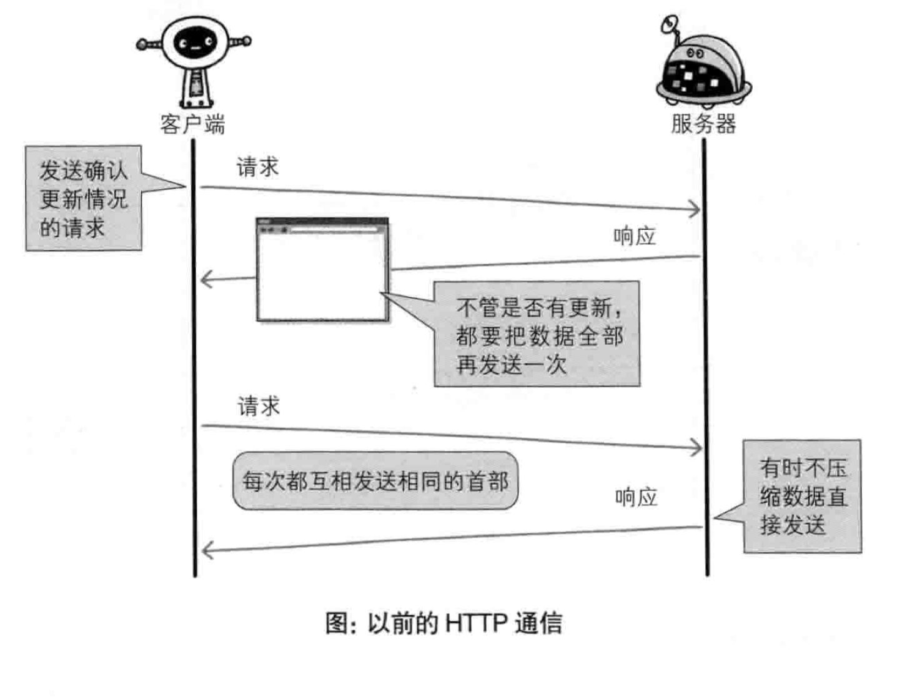


- Ajax(Asynchronous JavaScript and XML):

> 利用JavaScript和DOM的操作，实现局部替换Web页面加载的异步通信

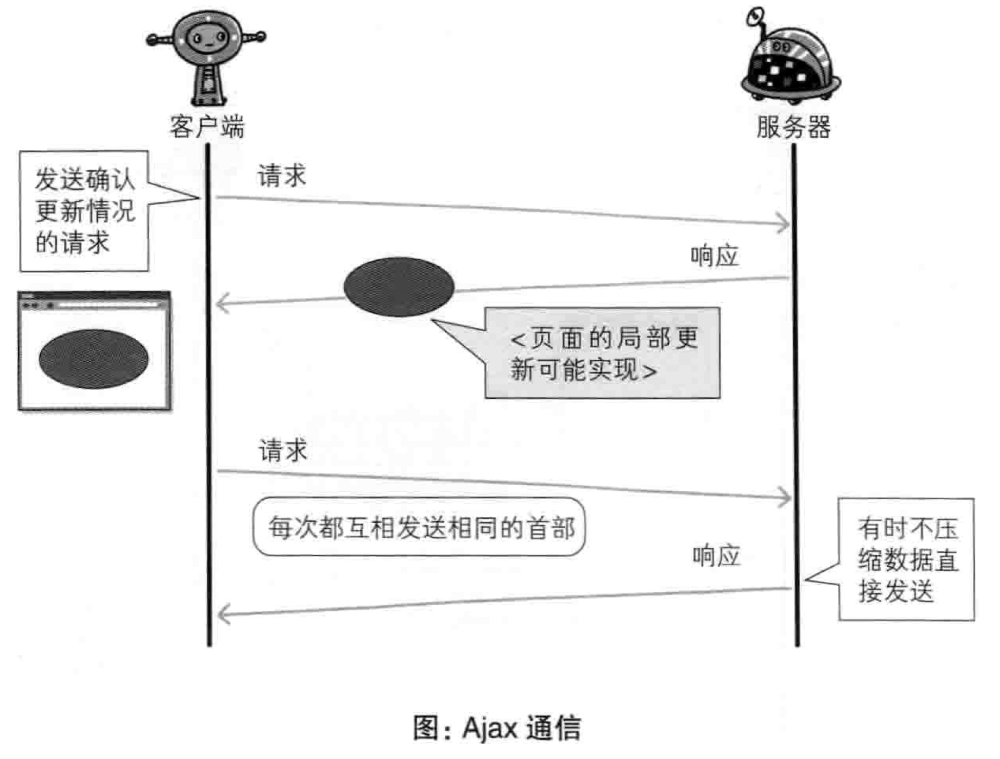


因为Ajax只更新一部分页面，响应中传输的数据量会减少

但是Ajax并未解决发送首部重复、数据未压缩的问题


- Comet

> 服务器内容一旦更新，Comet会直接向客户端发送响应


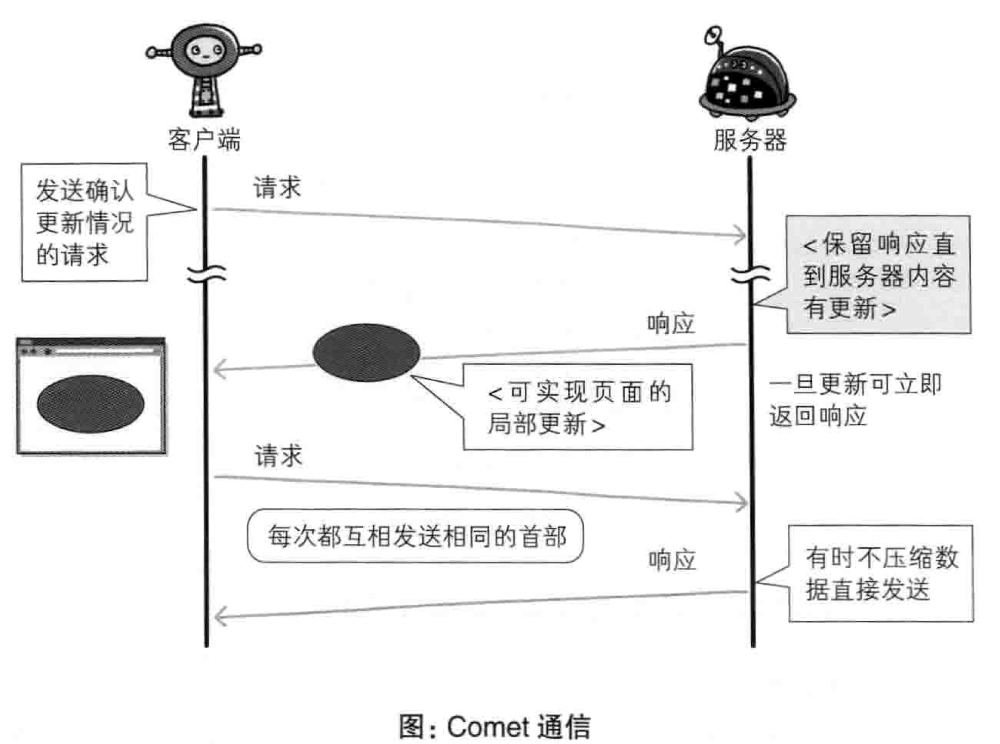


- SPDY

为了解决HTTP的问题，需要在协议层进行改进

<hr>


### 2) SPDY设计/功能

> SPDY在TCP/IP的应用层和传输层之间添加一个新的会话层，并规定通信使用SSL


将SPDY以会话层的形式添加，但本身还是使用HTTP

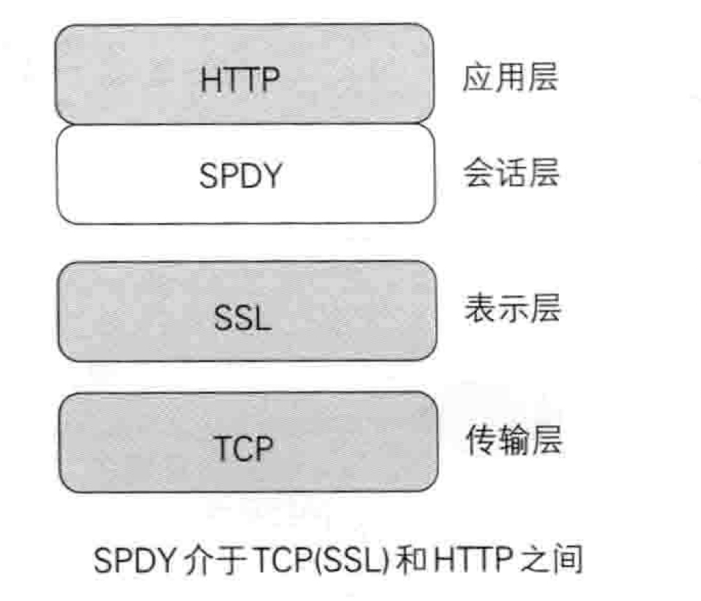


使用SPDY后，HTTP协议获得的额外功能:

- 多路复用

> 通过一个TCP连接，可以无限处理多个HTTP请求，使得TCP的处理效率提高


- 请求优先级

> 可以给请求逐个分配优先级顺序


- 压缩HTTP首部


- 推送服务

> 支持服务器主动向客户端推送数据，服务器可以直接发送数据而不是等待客户端请求


- 服务器提示

> 主动提示客户端所需的资源，避免发送不必要的请求

<hr>


## 2. 使用浏览器全双工通信的WebSocket

利用Ajax和Comet可以提升Web浏览速度，但无法彻底解决问题

> WebSocket作为HTML5标准的一部分

<hr>


### 1) WebSocket的设计和功能

- WebSocket是为了解决Ajax和Comet里XMLHttpRequest的问题

<hr>


### 2) WebSocket协议


主要特点:

1. 支持服务器向客户端推送数据
2. 减少通信量
    - 只要建立起WebSocket连接，就一直保持连接，首部信息小，通信量少
    - HTTP连接建立之前，需要完成一次握手
        - 为了实现WebSocket通信，需要使用HTTP的Upgrade首部告知服务器通信协议发生变化

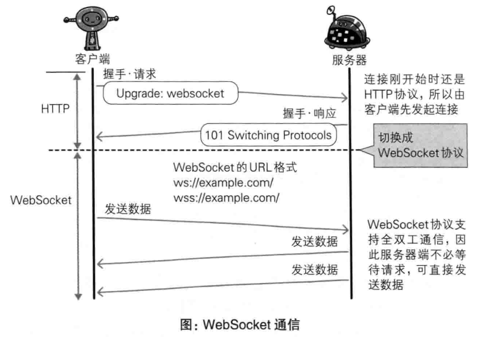

<hr>


