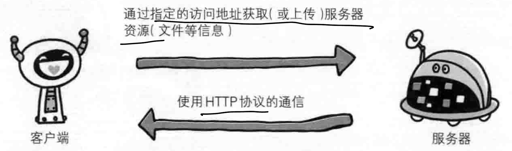
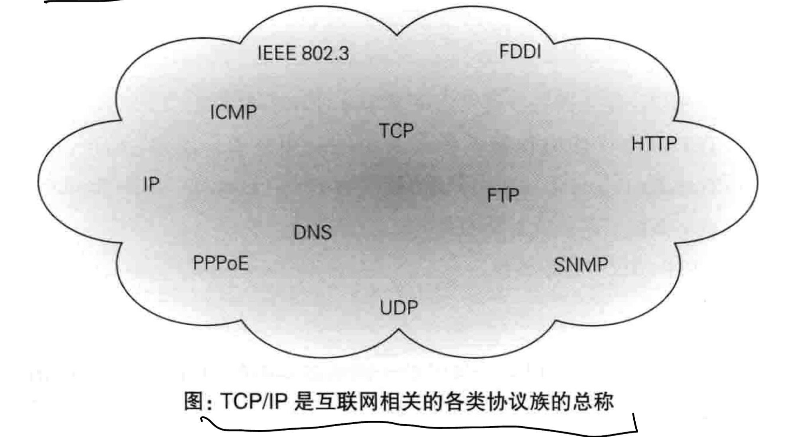

# 一、Web/网络基础

## 1) 使用HTTP协议访问Web

当我们在浏览其中输入URL时(地址栏的信息)，信息会送往某处，然后某处会发来回应，从而得以显示内容在Web页面上

大致原理:

- 根据浏览器地址栏中指定的URL，Web浏览器能够从Web服务器端获取对应的文件资源(resource)等信息，从而显示出对应的Web页面

通过发送请求获取服务器资源的Web浏览器等，都称为客户端(client)

在Web中，使用HTTP协议(Hyper Text Transfer Protocol)作为规范，完成从客户端到服务器的一系列流程，**协议是指规则的约定**

> 可以说，Web是建立在HTTP协议上通信的

## 2) HTTP诞生

### 1. 为了共享

最初的设计理念:

- 借助多文档之间互相关联形成的超文本(HyperText)，连成可以相互参阅的WWW
- 现在提出的3项WWW技术: 
    - HTML: 页面的文本标记语言
    - HTTP: **文档传输协议**
    - URL: 指定文档**所在地址**

WWW以前用来指代浏览超文本内容的客户端，现在指一系列的集合，可简称为Web

### 2. HTTP版本

- HTTP/1.0

1996-05，该协议标准至今仍被广泛使用在服务器端

- HTTP/1.1

1997-01，是目前最主流的HTTP版本

1999年发布RFC2616改进版

- HTTP/2.0

2015-02

## 3) 网络基础——TCP/IP

网络通常是在TCP/IP协议族的基础上运作的，**而HTTP是其内容的一个子集**

### 1. TCP/IP协议族

网络中的设备想要通信，则必须基于相同的方法，需要一种规则

> 这种规则称为协议

互联网相关的协议集合的总称就是TCP/IP

### 2. TCP/IP的分层管理

分层是TCP/IP协议族里重要的一点

TCP/IP协议族按照层次分为四层:

- 应用层
- 传输层
- 网络层
- 数据链路层

TCP/IP分层的好处:

> 各层之间的接口规划好之后，每层内部的设计就能自由改动了(解耦)
>
> 每层的应用只考虑自己的任务即可，而不必考虑整个过程

TCP/IP各层的作用:

1. 应用层

决定了提供应用服务时通信的活动

该层具有的协议:

- FTP: 文件传输协议
- DNS: 域名系统
- HTTP: 文档传输

2. 传输层

对应用层提供网络连接中的，两台设备之间的数据传输

该层的协议:

1. TCP(Transmission Control Protocol): 传输控制协议
2. UDP(User Data Protocol): 用户数据报协议

