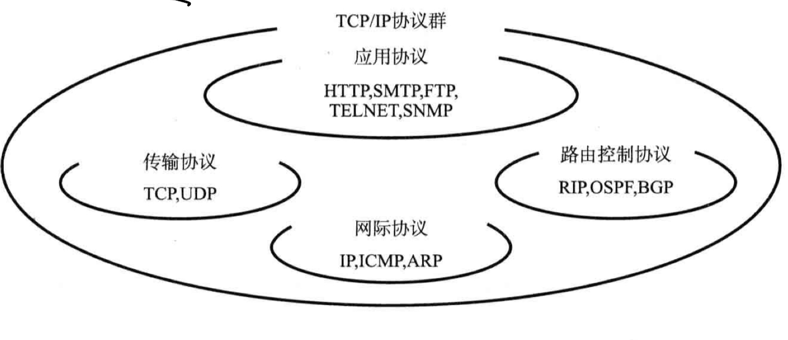
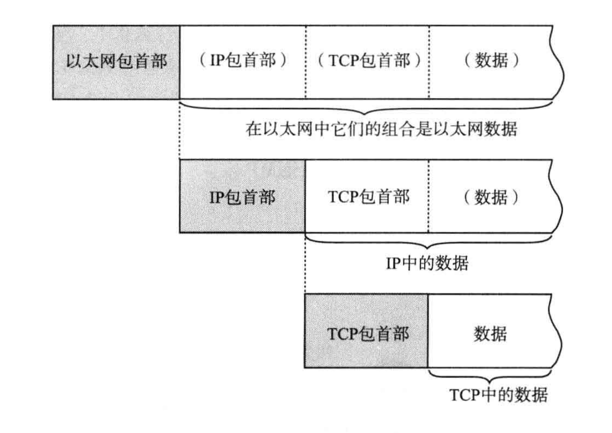
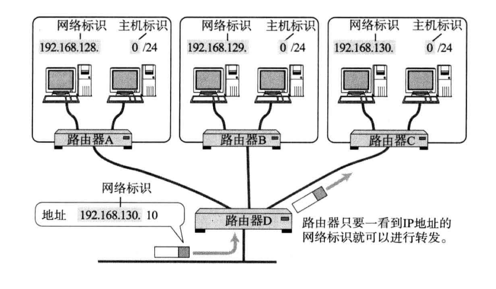
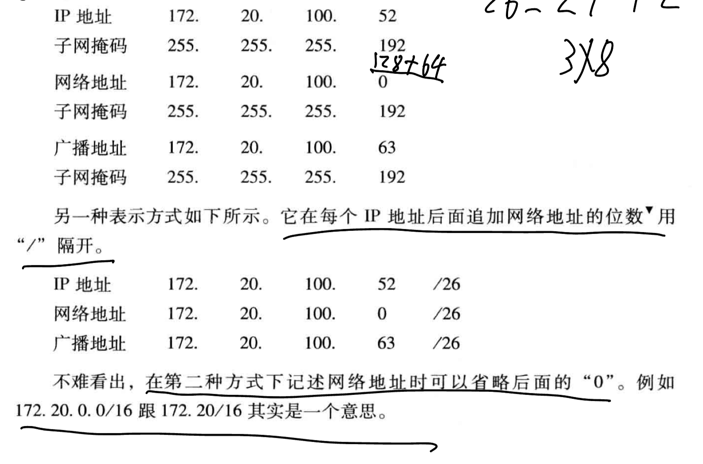
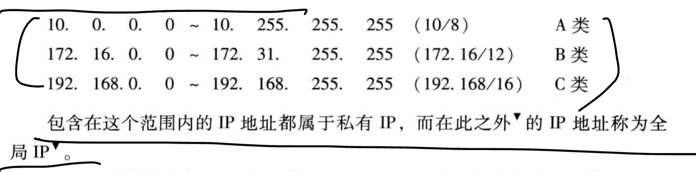
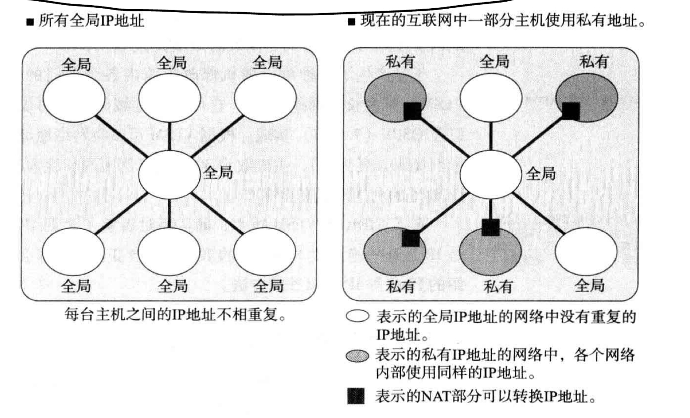
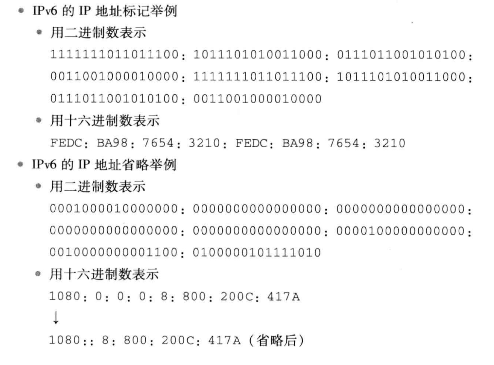

# 一、TCP/IP基础

## 1. TCP/IP标准化

### 1) TCP/IP具体含义

> 利用IP进行通信时用到的协议群的统称

### 2) RFC获取

- TCP/IP协议中需要标准化的，被列入到了RFC文档中(Request For Comment)

获取RFC文档:

[» RFC Editor (rfc-editor.org)](https://www.rfc-editor.org/)

[Index of /rfc (rfc-editor.org)](https://www.rfc-editor.org/rfc/)

## 2. TCP/IP协议分层模型

### 1. 物理层

- 即负责数据传输的硬件

### 2. 网络接口层(数据链路层)

- 负责让硬件起作用

### 3. 互联网层(网络层)

- 网络层使用IP协议，IP协议基于IP地址转发分组的数据

> 网络层和传输层的功能一般由操作系统提供，比如路由器，其必须实现通过网络层转发分组数据的功能
>
> 连接互联网的所有主机/路由器都必须实现IP的功能

#### IP

- IP在跨越网络传送数据包时，使用IP地址作为主机的标识
- IP还隐含数据链路层的功能，通过IP，互相通信的主机无论经过怎样的数据链路底层，都能实现通信

> IP协议不具备重发机制，属于非可靠传输协议

#### ICMP

- 当IP数据包在发送途中一旦发生异常无法正常到达，则需要会给发送端发送一个正常的通知

> 有时也被用来诊断网络的健康状况

#### ARP

- 从数据包的IP地址中解析出MAC地址

### 4. 传输层

功能:

- 让应用程序之间能够通信，识别应用程序的是端口号

#### TCP

- 面向有连接的传输层协议
- TCP可以正确处理传输过程中的丢包、传输顺序乱掉等异常情况，还能利用带宽缓解网络拥堵
- TCP为了建立连接，需要多次进行数据包的收发

> TCP不适用于对时效性要求高的应用

#### UDP

- UDP是一种面向无连接的传输层协议

> UDP常用于多媒体领域

### 5. 应用层

- 会话层、表示层和应用层的功能都集中在应用程序中

#### WWW

协议: HTTP(应用层协议)

数据格式: HTML

#### 电子邮件

协议: SMTP(simple mail transfer protocol)

数据格式: 文本(以前)，MIME协议拓展: 声音、图像等信息

MIME(表示层协议)

#### 文件传输(FTP)

- FTP进行文件传输时，会建立两个TCP连接(发送传输请求时用的控制连接，实际传输数据的数据连接)

#### 远程登录(TELNET/SSH)

- TCP/IP中远程登录常用TELNET和SSH协议

#### 网络管理(SNMP)

在TCP/IP中进行网络管理时，采用SNMP(simple network management protocol)

## 3. TCP/IP分层模型和示例

### 1) 数据包首部

Terminology:

- 帧: 表示**数据链路层**中，**包的单位**
- 数据包: **网络层以上层级中**，包的单位
- 段: TCP数据流中的信息
- 消息: 应用协议中数据的单位

### 2) 经过数据链路的包

- 每个包首部中至少包含两个信息: 
    - 发送端和接收端的地址
    - 上一层的协议类型

### 3) 数据包接收处理

接收流程是发送流程的逆序过程

1. 数据链路层(网络接口层)

从包首部中找到MAC地址判断是否是给自己的包，不是则丢弃

如果是，则查看类型域，确定数据类型(IP、ARP协议)

2. 网络层IP

判断包首部的IP地址是否与自己的匹配，是则接收数据并查找上一层

如果不是，则需要借助路由控制表查询应该转发的路径后，再进行转发

3. 传输层TCP
    - 首先计算一下检验和，判读数据是否被破坏
    - 然后检查是否按照序号接收数据
    - 最后检查端口号，确定具体的应用程序
    - 接收端会发送一个确认回执给给发送端

4. 应用程序处理

# 二、IP协议

## 1. 网际协议

- TCP/IP的心脏是网络层

> 网络层主要由IP和ICMP两个协议组成

### 1. OSI参考模型第三层

- 除去会话层和表示层，IP相当于OSI参考模型中的第3层——网络层

> 网络层的作用: 实现终端节点之间的通信

- 数据链路层只能在互连的**同一种链路节点之间进行包的传递**
- 一旦跨越了不同种的数据链路，就需要借助网络层来传递数据了(无线与有线，电信号与光信号)

### 2. 网络层与数据链路层的关系

- 数据链路层提供直连设备之间的通信
- 网络层的IP则提供没有直连的两个网络之间的通信

## 2. IP基础知识

- IP的三大模块:
    1. IP寻址
    2. 路由(转发)
    3. IP分包和组包

### 1) IP地址

> 要识别连接在网络中的所有主机，需要使用IP地址作为通信地址

- 所以在TCP/IP通信中的所有主机/路由器都必须设置自己的IP地址

### 2) 路由控制

> 是指将数据发送到最终目标地址的功能

- 路由控制确保了数据包能够成功到达最终的目标地址

IP路由也叫多跳路由，每个区间内决定着包在下一跳被转发的路径

- 多条路由指路由器/主机在转发IP数据包时，只指定下一个路由器或主机，而不是将最终目标地址为止的所有路径都指定出来
- 每个区间在转发IP数据包时，会分别制定下一跳的操作，直到包到达最终的目标地址

路由控制表

- 所有主机都维护着一张路由控制表，该表记录IP数据在下一步应该发送给的路由器，IP包会根据该路由表在各个数据链路上传输

### 3) 数据链路层的抽象

IP的重要作用之一:

> 可以将数据链路层上的地址抽象为IP地址，无论底层的数据链路是什么，都一视同仁

不同数据链路之间最大的区别:

- 各自的最大传输单位不同(MTU: Maximun Transmission Unit)

为了解决这个问题，IP会进行分片处理(IP Fragment):

- 将较大的IP包分成多个较小的IP包
- 分片的包到了对端目标地址后，会再被组合起来传递给上层

> IP通过这种方式抽象化了数据链路层，使得上层更不容易得知底层的网络构造

### 4) IP无连接

- IP面向无连接:

​	在发送数据包之前，不需要建立与对端目标之间的连接

IP采用面向无连接的原因:

1. 简化: 面向连接更复杂
2. 提速: 每次通信之前都要先建立连接，会降低处理速度

## 3. IP地址基础

### 1) 定义

IPv4地址由32位表示，在TCP/IP参与通信的主机都要分配这样一个IP地址

IP地址并非是根据主机台数，而是根据网卡来配置的

### 2) IP地址的组成

> IP地址由网络标识(网络地址)和主机标识(主机地址)两个部分组成

- 同一网段内，网络标识必须相同，主机标识不能重复
- 通过网络标识即可判断两台主机是否在同一网段内

为了划分网络标识和主机标识的部分，使用子网掩码即可区分这两个部分

### 3) IP地址的分类

- A类地址:

首位以0开头，1到8位为网络标识

即从0.0.0.0到127.0.0.0

后24位为主机标识

- B类地址:

前两位为10，1到16位为网络标识

从128.0.0.1到191.255.0.0

后16位为主机标识

- C类地址:

前三位为110，1到24位为网络标识

从192.168.0.0到239.255.255.0

后8位为主机标识

- D类地址:

前四位为1110，1到32位为网络标识

从224.0.0.0到239.255.255.255

没有主机标识，用于多播

注意事项:

> IP地址不能全部为0或者1
>
> 全为0只有在对应IP地址不可获知的情况下使用
>
> 全为1通常作为广播地址

### 4) 广播地址

> 用于在同一个数据链路相互连接的主机之间发送数据包
>
> 将IP地址中的主机地址部分全部设置为1后，就变成了广播地址

- 广播的种类

本地广播: 本网络内的广播

直接广播: 不同网络之间的广播

### 5) IP多播

> 多播用于将包发送给特定组内的主机，其直接使用IP协议，所以也是不可靠的

- 使用多播之前，一直使用广播的方式:

将数据发送给所有的主机，再由这些主机IP的上一层来判断是否接受数据

这种方式会给毫无关系的网络/主机带来影响，造成不必要的流量

- 多播可以穿透路由器，可以实现只给必要的组发送数据包

- IP多播/地址

多播使用D类地址

### 6) 子网掩码

- 网络标识相同的计算机必须同属于一个链路

子网/子网掩码:

- 通过子网掩码的识别码可以通过网络地址细分出更细的子网地址

- 引入子网后，IP地址有了两种识别码: IP地址本身和网络部分的子网掩码

> 对应IP地址网络标识部分全为1，主机标识部分全为0

- 从此，一个IP地址不再受限于自己的类别，而是通过子网掩码来自由地定位自己的网络长度

两种表示方式:

### 7) 全局/私有地址

为了不出现IP地址重复后出现地址冲突的问题，出现了一种新技术:

> 不要求每个主机/路由器都分配一个固定的IP地址，而是在必要的时候只为相应数量的设备分配唯一的IP地址

部分主机没有联网需求的话，可以设置对应的私有网络IP地址:

- 通过`NAT`技术后，可以互换私有IP和全局IP，从而实现私有网络内的设备连接网络

## 4. 路由控制

> 数据发送过程中，使用的是IP地址，但发送过程中还需要指明路由器/主机的信息，才能真正地发往目标地址
>
> 保存这种信息的就是`路由控制表`

- 实现IP通信的主机和路由器必须维护一张路由控制表
- 该表由一个`路由协议`的协议制作而成

### 1) IP地址/路由控制

> 路由控制表中记录着网络地址与下一步应该发送到路由器的地址

- 发送IP包时，需要首先确定IP包首部的目标地址
- 再从路由控制表中找到对应相同的网络地址记录，根据该记录转发给相应的下一个路由器

默认路由:

- 路由表中任何一个地址都能与之匹配的记录

主机路由:

- 要基于主机网卡上配置的IP来

环回地址:

- 127.0.0.1/localhost

### 2) 路由控制表的聚合

> 通过路由信息的聚合可以有效减少路由表的条目
>
> 从而构建大规模、高性能的网络

## 5. IP分割处理/再构成

### 1) IP报文的分片和重组

- 当数据包较大时，**路由器需要将报文进行分片**
- 分片重组时，`只能由目标主机进行`，**路由器不进行重组**

### 2) 路径MTU发现

分片机制的不足:

> 路由器的负荷重，路由器需要做的处理越来越多
>
> 分片丢失，则整个IP数据作废

为了应对上述问题，产生了新技术——路径MTU发现(Path MTU Discovery)

> 路径MTU: 路径中存在的所有数据链路中最小的MTU

- 通过路径MTU，可以避免中途在路由器上进行分片处理

## 6. IPv6

### 1) 特点

- IP地址的扩大与路由控制表的聚合
- 性能提升:

首部长度固定，不再采用首部校验码

- 支持即插即用

没有DHCP服务器也能实现自动分配IP地址

- 采用认证和加密功能
- 多播、Mobile IP成为拓展功能

### 2) IP地址的标记方法

> 使用128bit，以16bit为一组，每组用冒号`:`隔开
>
> 如果出现连续的0，可以使用`::`隔开

# 三、IP协议相关技术

