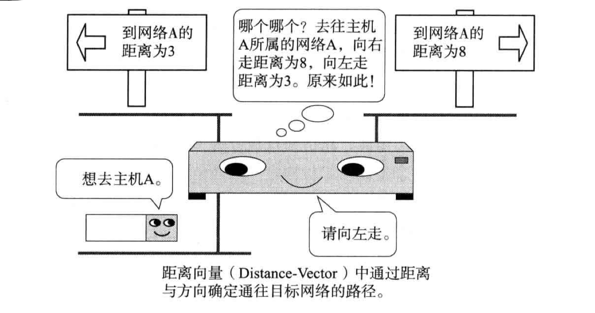

# 一、TCP/IP基础

## 1. TCP/IP标准化

### 1) TCP/IP具体含义

> 利用IP进行通信时用到的协议群的统称

### 2) RFC获取

- TCP/IP协议中需要标准化的，被列入到了RFC文档中(Request For Comment)

获取RFC文档:

[» RFC Editor (rfc-editor.org)](https://www.rfc-editor.org/)

[Index of /rfc (rfc-editor.org)](https://www.rfc-editor.org/rfc/)

## 2. TCP/IP协议分层模型

### 1. 物理层

- 即负责数据传输的硬件

### 2. 网络接口层(数据链路层)

- 负责让硬件起作用

### 3. 互联网层(网络层)

- 网络层使用IP协议，IP协议基于IP地址转发分组的数据

> 网络层和传输层的功能一般由操作系统提供，比如路由器，其必须实现通过网络层转发分组数据的功能
>
> 连接互联网的所有主机/路由器都必须实现IP的功能

#### IP

- IP在跨越网络传送数据包时，使用IP地址作为主机的标识
- IP还隐含数据链路层的功能，通过IP，互相通信的主机无论经过怎样的数据链路底层，都能实现通信

> IP协议不具备重发机制，属于非可靠传输协议

#### ICMP

- 当IP数据包在发送途中一旦发生异常无法正常到达，则需要会给发送端发送一个正常的通知

> 有时也被用来诊断网络的健康状况

#### ARP

- 从数据包的IP地址中解析出MAC地址

### 4. 传输层

功能:

- 让应用程序之间能够通信，识别应用程序的是端口号

#### TCP

- 面向有连接的传输层协议
- TCP可以正确处理传输过程中的丢包、传输顺序乱掉等异常情况，还能利用带宽缓解网络拥堵
- TCP为了建立连接，需要多次进行数据包的收发

> TCP不适用于对时效性要求高的应用

#### UDP

- UDP是一种面向无连接的传输层协议

> UDP常用于多媒体领域

### 5. 应用层

- 会话层、表示层和应用层的功能都集中在应用程序中

#### WWW

协议: HTTP(应用层协议)

数据格式: HTML

#### 电子邮件

协议: SMTP(simple mail transfer protocol)

数据格式: 文本(以前)，MIME协议拓展: 声音、图像等信息

MIME(表示层协议)

#### 文件传输(FTP)

- FTP进行文件传输时，会建立两个TCP连接(发送传输请求时用的控制连接，实际传输数据的数据连接)

#### 远程登录(TELNET/SSH)

- TCP/IP中远程登录常用TELNET和SSH协议

#### 网络管理(SNMP)

在TCP/IP中进行网络管理时，采用SNMP(simple network management protocol)

## 3. TCP/IP分层模型和示例

### 1) 数据包首部

Terminology:

- 帧: 表示**数据链路层**中，**包的单位**
- 数据包: **网络层以上层级中**，包的单位
- 段: TCP数据流中的信息
- 消息: 应用协议中数据的单位

### 2) 经过数据链路的包

- 每个包首部中至少包含两个信息: 
    - 发送端和接收端的地址
    - 上一层的协议类型

### 3) 数据包接收处理

接收流程是发送流程的逆序过程

1. 数据链路层(网络接口层)

从包首部中找到MAC地址判断是否是给自己的包，不是则丢弃

如果是，则查看类型域，确定数据类型(IP、ARP协议)

2. 网络层IP

判断包首部的IP地址是否与自己的匹配，是则接收数据并查找上一层

如果不是，则需要借助路由控制表查询应该转发的路径后，再进行转发

3. 传输层TCP
    - 首先计算一下检验和，判读数据是否被破坏
    - 然后检查是否按照序号接收数据
    - 最后检查端口号，确定具体的应用程序
    - 接收端会发送一个确认回执给给发送端

4. 应用程序处理

# 二、IP协议

## 1. 网际协议

- TCP/IP的心脏是网络层

> 网络层主要由IP和ICMP两个协议组成

### 1. OSI参考模型第三层

- 除去会话层和表示层，IP相当于OSI参考模型中的第3层——网络层

> 网络层的作用: 实现终端节点之间的通信

- 数据链路层只能在互连的**同一种链路节点之间进行包的传递**
- 一旦跨越了不同种的数据链路，就需要借助网络层来传递数据了(无线与有线，电信号与光信号)

### 2. 网络层与数据链路层的关系

- 数据链路层提供直连设备之间的通信
- 网络层的IP则提供没有直连的两个网络之间的通信

## 2. IP基础知识

- IP的三大模块:
    1. IP寻址
    2. 路由(转发)
    3. IP分包和组包

### 1) IP地址

> 要识别连接在网络中的所有主机，需要使用IP地址作为通信地址

- 所以在TCP/IP通信中的所有主机/路由器都必须设置自己的IP地址

### 2) 路由控制

> 是指将数据发送到最终目标地址的功能

- 路由控制确保了数据包能够成功到达最终的目标地址

IP路由也叫多跳路由，每个区间内决定着包在下一跳被转发的路径

- 多条路由指路由器/主机在转发IP数据包时，只指定下一个路由器或主机，而不是将最终目标地址为止的所有路径都指定出来
- 每个区间在转发IP数据包时，会分别制定下一跳的操作，直到包到达最终的目标地址

路由控制表

- 所有主机都维护着一张路由控制表，该表记录IP数据在下一步应该发送给的路由器，IP包会根据该路由表在各个数据链路上传输

### 3) 数据链路层的抽象

IP的重要作用之一:

> 可以将数据链路层上的地址抽象为IP地址，无论底层的数据链路是什么，都一视同仁

不同数据链路之间最大的区别:

- 各自的最大传输单位不同(MTU: Maximun Transmission Unit)

为了解决这个问题，IP会进行分片处理(IP Fragment):

- 将较大的IP包分成多个较小的IP包
- 分片的包到了对端目标地址后，会再被组合起来传递给上层

> IP通过这种方式抽象化了数据链路层，使得上层更不容易得知底层的网络构造

### 4) IP无连接

- IP面向无连接:

​	在发送数据包之前，不需要建立与对端目标之间的连接

IP采用面向无连接的原因:

1. 简化: 面向连接更复杂
2. 提速: 每次通信之前都要先建立连接，会降低处理速度

## 3. IP地址基础

### 1) 定义

IPv4地址由32位表示，在TCP/IP参与通信的主机都要分配这样一个IP地址

IP地址并非是根据主机台数，而是根据网卡来配置的

### 2) IP地址的组成

> IP地址由网络标识(网络地址)和主机标识(主机地址)两个部分组成

- 同一网段内，网络标识必须相同，主机标识不能重复
- 通过网络标识即可判断两台主机是否在同一网段内

为了划分网络标识和主机标识的部分，使用子网掩码即可区分这两个部分

### 3) IP地址的分类

- A类地址:

首位以0开头，1到8位为网络标识

即从0.0.0.0到127.0.0.0

后24位为主机标识

- B类地址:

前两位为10，1到16位为网络标识

从128.0.0.1到191.255.0.0

后16位为主机标识

- C类地址:

前三位为110，1到24位为网络标识

从192.168.0.0到239.255.255.0

后8位为主机标识

- D类地址:

前四位为1110，1到32位为网络标识

从224.0.0.0到239.255.255.255

没有主机标识，用于多播

注意事项:

> IP地址不能全部为0或者1
>
> 全为0只有在对应IP地址不可获知的情况下使用
>
> 全为1通常作为广播地址

### 4) 广播地址

> 用于在同一个数据链路相互连接的主机之间发送数据包
>
> 将IP地址中的主机地址部分全部设置为1后，就变成了广播地址

- 广播的种类

本地广播: 本网络内的广播

直接广播: 不同网络之间的广播

### 5) IP多播

> 多播用于将包发送给特定组内的主机，其直接使用IP协议，所以也是不可靠的

- 使用多播之前，一直使用广播的方式:

将数据发送给所有的主机，再由这些主机IP的上一层来判断是否接受数据

这种方式会给毫无关系的网络/主机带来影响，造成不必要的流量

- 多播可以穿透路由器，可以实现只给必要的组发送数据包

- IP多播/地址

多播使用D类地址

### 6) 子网掩码

- 网络标识相同的计算机必须同属于一个链路

子网/子网掩码:

- 通过子网掩码的识别码可以通过网络地址细分出更细的子网地址

- 引入子网后，IP地址有了两种识别码: IP地址本身和网络部分的子网掩码

> 对应IP地址网络标识部分全为1，主机标识部分全为0

- 从此，一个IP地址不再受限于自己的类别，而是通过子网掩码来自由地定位自己的网络长度

两种表示方式:

### 7) 全局/私有地址

为了不出现IP地址重复后出现地址冲突的问题，出现了一种新技术:

> 不要求每个主机/路由器都分配一个固定的IP地址，而是在必要的时候只为相应数量的设备分配唯一的IP地址

部分主机没有联网需求的话，可以设置对应的私有网络IP地址:

- 通过`NAT`技术后，可以互换私有IP和全局IP，从而实现私有网络内的设备连接网络

## 4. 路由控制

> 数据发送过程中，使用的是IP地址，但发送过程中还需要指明路由器/主机的信息，才能真正地发往目标地址
>
> 保存这种信息的就是`路由控制表`

- 实现IP通信的主机和路由器必须维护一张路由控制表
- 该表由一个`路由协议`的协议制作而成

### 1) IP地址/路由控制

> 路由控制表中记录着网络地址与下一步应该发送到路由器的地址

- 发送IP包时，需要首先确定IP包首部的目标地址
- 再从路由控制表中找到对应相同的网络地址记录，根据该记录转发给相应的下一个路由器

默认路由:

- 路由表中任何一个地址都能与之匹配的记录

主机路由:

- 要基于主机网卡上配置的IP来

环回地址:

- 127.0.0.1/localhost

### 2) 路由控制表的聚合

> 通过路由信息的聚合可以有效减少路由表的条目
>
> 从而构建大规模、高性能的网络

## 5. IP分割处理/再构成

### 1) IP报文的分片和重组

- 当数据包较大时，**路由器需要将报文进行分片**
- 分片重组时，`只能由目标主机进行`，**路由器不进行重组**

### 2) 路径MTU发现

分片机制的不足:

> 路由器的负荷重，路由器需要做的处理越来越多
>
> 分片丢失，则整个IP数据作废

为了应对上述问题，产生了新技术——路径MTU发现(Path MTU Discovery)

> 路径MTU: 路径中存在的所有数据链路中最小的MTU

- 通过路径MTU，可以避免中途在路由器上进行分片处理

## 6. IPv6

### 1) 特点

- IP地址的扩大与路由控制表的聚合
- 性能提升:

首部长度固定，不再采用首部校验码

- 支持即插即用

没有DHCP服务器也能实现自动分配IP地址

- 采用认证和加密功能
- 多播、Mobile IP成为拓展功能

### 2) IP地址的标记方法

> 使用128bit，以16bit为一组，每组用冒号`:`隔开
>
> 如果出现连续的0，可以使用`::`隔开

# 三、IP协议相关技术

## 1. 仅靠IP无法完成通信

- 日常使用时，通常只会输入网址，所以`需要将网络应用使用的网址/地址映射为IP地址`
- `在同一条数据链路中，只使用MAC地址传输数据包`，将IP数据包在网络上传输的是数据链路，所以需要知道发送端的MAC地址

## 2. DNS

> DNS可以将网址自动转换为对应的IP地址

适用于IPv4和IPv6

### 1) IP地址不好记

通常我们不会使用IP地址来访问其他网络应用，而是使用主机域名

- 起初，为了实现将主机名转换为具体的IP地址，主机会使用`hosts`文件来记录所有的主机名和对应的IP地址

但网络规模扩大后，这种方式就不适用了

### 2) DNS产生

> DNS系统中，维护一个表示主机名和IP地址对应关系的数据库

当用户输入域名后，会由DNS查询对应的IP地址并快速返回

### 3) 域名

域名是一种分层的结构，不同的部分由`.`隔开

- 当出现带有层次结构的域名后，每个组织结构对应的域名里的主机名就可以自由命名了

结构:

- 域名服务器

一般指管理域名的主机和相应的软件。其可以管理所在分层的域的相关信息

域名服务器的层次结构:

- 每层都设置有对应的域名服务器
- 每层域名服务器都了解该层及以下分层中所有域名服务器的IP地址
- 从根服务器开始按顺序追踪，可以访问世界上所有域名服务器的地址

如果域名服务器下没有分层，那么就能够自由指定主机名和子网名称，想要修改分层的域名，需要在上层服务器中进行添加/修改

> 所有域名服务器都必须记录根域名服务器的IP地址

- 解析器(Resolver)

> 执行DNS查询的主机和软件即为DNS解析器

其需要至少注册一个以上的域名服务器IP地址，其至少包括其所处组织内部的域名服务器IP地址

### 4) DNS查询

查询流程示例:

解析器会向当前层的域名服务器进行发送查询请求，如果当前层没有找到，则发送给上层的域名服务器，直到找到指定的数据再返回

- 解析器和域名服务器每次新查询到的信息都会保存到缓存里，从而减少每次查询时的性能损耗

## 3. ARP

IP包在发送的时候，需要知道目标地址在数据链路层对应的`MAC`地址

### 1) ARP概要

- ARP协议以IP地址为基础，**可以定位到下一个接收数据分包的网络设备对应的MAC地址**
- 如果目标主机**不在一个数据链路上，则可以通过ARP协议查找下一跳路由器的MAC地址**

ARP协议只适用于IPv4，不能用于IPv6，

### 2) ARP的工作机制

- ARP协议是根据ARP请求和ARP响应两种类型的包来确定MAC地址的

Eg:

- 其中的主机为了获取目标地址的MAC地址，会通过广播发送一个ARP请求包
- 同一个链路上的所有设备都能接收到这个广播的包
- 如果请求包中的IP地址和收到的设备一致，则这个设备会返回一个带有自己MAC地址的ARP响应包给发送请求包的主机

因为ARP可以动态地进行地址解析，所以在TCP/IP中通信时，只需要知道IP地址即可

> 通常会将获取到的MAC地址进行缓存，从而防止ARP包在网络上大量广播的可能性
>
> 执行一次ARP都会清空缓存

### 3) IP和MAC地址

只有通过MAC地址和IP地址才能将数据准确发送，所以转换两者的ARP协议也很重要

### 4) RARP

> RARP将ARP协议反过来，可以从MAC地址获取IP地址

当无法动态获取IP的时候，可以使用RAPR协议:

- 假设一台RAPR服务器，该服务器上注册了对应设备的MAC地址和IP地址

### 5) 代理ARP

> 使用代理ARP的服务器可以将ARP请求发送给临近的其他网段，从而实现不同网段间的直接通信

通过路由器控制多个网络，每个网段定义不同的子网，从而进行路由控制

## 4. ICMP

Internet Control Message Protocol

### 1) 辅助IP的ICMP

- ICMP的主要功能:

> 确认IP包是否成功送达，通知发送过程中IP包的废弃原因，改善网络设置等等
>
> 负责通知IP包未能成功送达的原因

ICMP通知失败原因的功能会使用IP进行发送

ICMP的消息种类:

1. 通知出错原因的错误消息
2. 诊断的查询消息

### 2) 主要的ICMP消息

- 目标不可达消息

- 重定向消息

发生在路由器有更好的路由信息的情况下，路由器会通过ICMP发送给主机一个更适合的发送路由

- 超时消息

当IP包中的TTL减为0时，该IP包会被丢弃，此时会给发送端发送一个ICMP超时的消息

为了避免IP包在网络上无休止地转发

- 回送消息

用于通信的主机、路由器之间，判断数据包是否成功到达

> PING命令就是利用这个消息实现的

### 3) ICMPv6

- 在IPv6中，没有ICMPv6，就无法正常通信

> 其中的邻居探索消息功能取代了IPv4中的ARP协议，还融合了ICMP重定向和路由选择信息等功能

- 邻居探索

> IPv6实现了即插即用，在没有DHCP服务器的环境中，也能够实现IP地址的自动获取

## 5. DHCP

Dynamic Host Configuration Protocol

### 1) 实现即插即用

> DHCP协议实现了自动设置IP地址，统一管理IP地址的分配

### 2) DHCP的工作机制

- 使用DHCP之前，需要架设一个DHCP服务器，并将需要分配的IP设置、子网掩码、路由控制信息和DNS服务器的地址设置到该服务器上

主机从DHCP服务器获取IP的过程:

为了防止分配的IP地址重复，进行DHCP通信的客户端和服务器需要具备的功能:

- 服务器: 给即将分配的IP地址发送请求包，确保没有回应(保证该IP没有被分配)
- 客户端: 使用获得的IP地址发送一个ARP请求，确认没有回应(确保该IP之前没有被分配)

### 3) DHCP中继代理

小型网络环境中，一般都由宽带路由器充当这个DHCP服务器

但大型网络环境中，则需要统一管理和运维

> 通过DHCP中继代理，可以让不同网段的IP地址分配也能由一个DHCP服务器统一管理和运维
>
> 只需要在每个网段内设置一个DHCP中继代理即可

- 中继代理收到客户端请求后，会通过单播的方式向DHCP服务器发送请求

Eg:

## 6. NAT

Netword Address Translator

### 1) NAT定义

> 用于将本地私有地址转换为全局IP地址

还有可以转换TCP和UDP端口的NAPT技术

- 在IPv4和IPv6之间的通信中，通常使用NAT-PT

### 2) NAT的工作机制

- 私有地址通过NAT路由器后，将地址改为全局地址后再发送数据
- 全局地址同样改为私有地址后再发送数据

Eg:

- NAT路由器内部有一张自动生成的用来转换地址的表，可以将私有地址和全局地址按照表中的映射关系进行处理
- 当私有网络中有多台设备时，会使用NAPT将包含的端口号一起转换

Eg:

如果端口号重复，还会自动进行修改

### 3) NAT-PT(NAPT-PT)

> NAT-PT可以将IPv6的首部转换为IPv4的首部
>
> 从而让只有IPv6地址的主机与IPv4地址通信

### 4) NAT的潜在问题

NAT技术依赖于自己的转换表，所以存在一些问题:

- 无法从NAT外部向内部建立连接
- 转换表的生成的转换操作需要产生一定开销
- 通信过程一旦NAT路由器重启，所有的TCP连接都要重置
- 即使有集群来做容灾备份，但连接依然会重置

### 5) 解决NAT的潜在问题和NAT穿越

解决NAT潜在问题的两种方式:

1. 改用IPv6

改用IPv6后，就不再需要使用NAT了

2. 通过应用代替NAT
    - NAT内侧主机上运行的应用为了生成NAT转换表，会先发送一个虚拟的网络包给NAT外侧

> 这样NAT外侧和内侧也能进行通信了，称为NAT穿越
>
> 但这样的应用比较复杂

## 7. IP隧道

> 为了让IPv4和IPv6网络之间进行通信，需要采用IP隧道的功能

对于从IPv6到IPv4:

- 将从IPv6发送过来的数据包统合后，为之追加一个IPv4首部后，转发给IPv4网络

> 通过在网络层首部后面继续追加网络层首部的通信方式就称做`IP隧道`

Eg:

构建网络时，对于不同时支持IPv4和IPv6的设备，可以通过IP隧道来转发数据包

## 8. 其他

### 1) IP多播

为了确定是否存在接收端，需要使用MLD来实现(Multicast Listener Discovery)，它是IPv4中IGMP和IPv6中ICMPv6中的重要功能

- IGMP: Internet Group Management Protocol

IGMP的两大作用:

1. 向路由器表明想要接收多播消息
2. 向交换集线器通知想要接收多播的地址

### 2) IP任播

> 为提供同一服务的服务器配置同一个IP地址，并与最近的服务器进行通信(类似CDN)

- 但其无法保证所有的包都发送给同一个主机

### 3) 通信质量控制

- QoS技术可以保证服务质量

### 4) 显示拥塞通知

网络发生拥塞时，发送主机应该减少数据包的发送量

> TCP可以控制网络拥塞，但其是通过数据包的实际损坏情况来判断的，不能在数据包损坏前减少数据包的发送量

IP层的`ECN`就是用来解决这个问题的

ECN的机制:

> 在发送包的IP首部中记录路由器是否遇到拥塞，并在返回包的TCP首部中通知是否发生过阻塞

- 在网络层进行拥塞的检查，在传输层进行拥塞的通知

### 5) Mobile IP

- 定义

与移动设备进行通信时，一旦其连接的子网发生改变，则无法通过TCP进行通信

> 因为TCP是面向连接的协议，至始至终都需要发送方和接收方的IP地址不变

> Mobile IP可以在主机连接的子网IP发生变化的情况下，主机IP依然不变，从而使得通信得以维系

- IP隧道和Mobile IP

名词:

移动主机: 

- 移动了位置，IP却不变的设备。

归属代理:

- 处于归属网络下，可监控移动设备的位置，并转发数据包给移动主机

外部代理:

- 支持移动主机的移动设备，适用于所有需要接入网络的移动主机

> 移动后通过外部代理发送转发数据包向归属代理通知自己的地址

# 四、TCP/UDP

## 1. 传输层的作用

- TCP提供可靠的通信传输
- UDP常用于将广播和细节控制交给应用的通信传输

### 1) 传输层定义

- IP首部中有一个协议字段用来表示传输层使用的协议(传输的是TCP还是UDP的数据)
- TCP和UDP各自为了识别传输的数据部分应该给哪个应用，也会设计一个编号

> 端口号就能够实现识别数据应该传输给哪个具体应用

### 2) 通信处理

服务端的应用需要提前启动，准备接收客户端的请求

- 这些服务端程序在UNIX中称为`守护进程`
- UNIX中，不需要将所有的守护进程依次启动，只需要启动一个可以代表它们接收请求的inetd(互联网守护进程)服务器进程即可，其是一个超级守护进程
- 超级守护进程收到客户端请求后，会创建(fork)新的进程再转换(exec)为httpd，sshd等守护进程

> 通过请求数据中的目标端口即可识别发送给的目标服务端应用(守护进程)

### 3) 两种传输层协议

- TCP

TCP是面向连接的、可靠的流协议

流: 指不间断的数据结构

- UDP

不具有可靠性传输

细微处理会交给上层的应用去完成，可以确保信息的大小一致，但无法确定消息一定到达

### 4) TCP/UDP区别

- TCP用于在传输层**需要实现可靠连接的情况下**
- UDP用于那些**对高速传输和实时性要求有较高的通信或广播通信**

注:

- 使用TCP或者UDP通信时，会使用到Socket API

## 2. 端口号

### 1) 端口号定义

> 在传输层中，通过端口号来识别一台主机中的各个应用程序，所以也被称为程序地址

### 2) 通过IP、端口号、协议号进行通信识别

在TCP/IP或UDP/IP通信中，通常采用5中信息来识别一个通信:

- 源IP地址
- 目标IP地址
- 协议号
- 源端口号
- 目标端口号

Eg:

### 3) 确认端口号

确认端口号的方法有两种:

- 标准既定的端口号

也称为静态方法。是指每个应用程序都有其指定的端口号，广为使用的协议中使用的端口号就是固定的，称为知名端口号

- 时序分配

也叫动态分配法，此时服务端必须监听端口，但客户端可以不确定端口号

- 此时客户端可以让操作系统为应用程序自行分配端口号

### 4) 端口号和协议

> 不同的传输协议可以使用同一个端口，数据到达IP层之后，会检查IP首部中的协议号，再传给对应协议的模块

- 即使在同一个端口中，因为传输层协议会各自独立地进行处理，所以相互之间不会受到影响

## 3. UDP

User Datagram Protocol

UDP的特点和目的:

> UDP利用IP提供面向无连接的通信服务，其收到数据的一刻会立刻照原样发送到网络中去

- UDP不负责重发，没有纠正功能
- 细节方法交由采用UDP的应用来处理

常用的方面:

- 数据总量少的通信(DNS等)
- 即时通信
- 特定网络中的应用通信
- 广播、多播

## 4. TCP

> TCP实现了数据传输时的各种控制功能，可以进行丢包时的重发控制，可以对包进行顺序控制

- TCP是一种面向连接的协议，只有在确认通信对方存在且建立连接后，才会发送数据，进而可以控制通信流量的浪费
- TCP可以在IP这种无连接的网络上实现高可靠的通信
- TCP负责控制连接的建立、断开、保持等工作

### 1) TCP的特点和目的

> TCP通过校验和、序列号、确认应答、重发控制、连接管理以及窗口控制等实现可靠性传输

### 2) 通过序列号确认应答提高可靠性

- 当确认接收到消息时，会发送一个已收到消息的通知，称做确认应答(ACK/acknowledgement)
- 否定确认应答: NACK/not acknowledgement

TCP通过确认应答来实现可靠的数据传输

如果一段时间内没有接收到确认应答，则认为数据丢失，发送端会进行数据重发

Eg:

还有可能是接收端回传的确认应答(ACK)包丢失，或者延迟到达

- 这种重发机制可能会一直向目标主机发送数据，此时目标主机可能会一直丢弃重复的数据包

> 为此，需要一种机制识别是否已经接收数据，还能判断是否需要接收

上述机制总结为: 确认应答处理、重发控制重复控制

- `这些功能都能够通过序列号实现`

序列号通过按照顺序给发送给数据的每个字节标上号码编号

> 接收端查询接收数据TCP首部中的序列号和长度，将自己下一步应该接收的序号作为应答返回

Eg:

### 3) 确定重发超时

重发超时:

- 重发数据之前，等待确认应答到来的那个等待时间间隔

### 4) 管理连接

> TCP在通信之前，会通过TCP发送一个SYN包作为建立连接的请求等待确认应答

通信结束后，会进行断开连接的处理(FIN包)

一般通过TCP首部字段来管理TCP连接

- 一个连接的建立与断开一般需要来回发送7个包(三次握手、四次挥手)

Eg:

### 5) 以段为单位发送数据

- 建立TCP连接的同时，可以确定发送数据包的大小单位，称为最大消息长度(MSS: Maximum Segment Size)

TCP传输大量数据时，会以MSS的大小进行分割发送，重发也是如此

MSS:

> 在三次握手时，在两端主机之间被计算得出
>
> 发送建立连接的请求后，会在TCP首部中写入MSS选项，并写入自己能够适应的MSS大小
>
> 最后会取两端中的较小值来使用

Eg:

### 6) 利用窗口控制提高速度

> TCP以一个段为单位发送数据，每次发送一个段都要进行一次确认应答的处理

- 这样的传输方式有一个缺点: 

包的往返时间越长，通信性能越低，网络吞吐量越差

Eg:

> 为了解决这个问题，TCP引入了`窗口`的概念，使得在往返时间较长的情况下，也依然能够控制网络性能的下降

即: 发送端发送一个段之后不需要一直等待确认应答(ACK)，而是继续发送数据

- 窗口大小:

无需等待确认应答而继续发送数据的最大值

该机制通过使用大量的缓冲区，实现了对多个段同时进行确认应答的功能

> 发送端主机在对应数据收到确认应答之前，都需要在缓冲区保留这部分数据
>
> 如果发送的数据已经收到了确认应答，则可以将数据从缓冲区清除

收到确认应答后，窗口会滑动到确认应答中的序列号的位置处，这种机制称为`滑动窗口控制`

Eg:

### 7) 窗口控制与重发机制

当确认应答未能返回时:

- 没有使用窗口控制时: 没有收到确认应答的数据都会进行重发
- 使用了窗户控制后: 某些确认应答即使丢失也不会进行重发(会通过下一个确认应答来判断是否成功接收)

Eg:

当某个报文段发送时丢失:

- 目标主机: 收到了自己应该接收的序号以外的数据时，只根据当前接收到的数据返回确认应答

Eg:

> 当发送端主机连续三次收到同一个确认应答时，则会重发对应数据(说明发送的数据丢失)
>
> 该种机制称为高速重发控制

### 8) 流控制

有时候，接收端无法接收数据，此时会因为弃置本该接收的数据而触发重发机制，此时就会造成流量的浪费

> 为了可以让发送端根据接收端的实际能力控制发送的数据量，TCP使用`流控制机制`

流控制:

- 接收端向发送端通知自己可以接收的数据大小
- 发送端不会发送超过这个大小的数据，该大小限度称为`窗口大小`

TCP首部中有一个字段表示通知窗口大小，接收端主机会将自己可以接收的缓冲区大小(动态的)放入该字段再返回给发送端

> 一旦缓冲区变小，返回的字段值就会变小，从而控制数据的发送量

Eg:

- 当接收端无法接收信息时，发送端会发送一个叫做`窗口探测的数据段`，以获取最新的窗口大小信息

### 9) 拥塞控制

- 如果在开始通信时就发送大量数据，则可能会引发其他问题(网络瘫痪)

> 通信一开始通过`慢启动算法`得出的值，对发送流量进行控制即可

- 为了调节发送端所要发送的数据量，定义了一个"拥塞窗口"的概念:

> 在慢启动的时候，会将这个拥塞窗口的大小设置为1个数据段(MSS)，之后每接收一个ACK应答就会给拥塞窗口的值增加1

发送数据包时，会将拥塞窗口和通知的窗口大小进行比较，再取小的那个发送对应大小的数据

- 通过拥塞窗口，即可避免网络拥塞情况的发生

为了防止拥塞窗口增长过快，引入了慢启动阈值的概念:

- TCP刚开始通信时，不会设置对应的慢启动阈值，而是在超市重发时，才会设置为拥塞窗口的一半大小

Eg:

### 10) 提高网络利用率

- Nagle算法

发送端还未发送的数据量很少时，则延时发送，仅在满足一下条件之一的情况下发送:

1.发送的数据都已经收到了确认应答

2.未发送数量大小达到MSS

> 该种算法可以提高网络利用率，但是会产生延迟

- 延迟确认应答

接收端收到数据后不立刻返回确认应答，而是延迟一段时间，除非满足条件:

1.收到的数据满足2 * 最大段长度的数据时

2.其他情况，最大延迟0.5秒(不固定)发送确认应答

> 在TCP文件传输中，绝大多数是每两个数据段返回一次确认应答

- 捎带应答

应用层中，发送的消息经过接收端处理后会返回一个回执

> TCP的确认应答和回执数据可以通过同一个包返回，这种机制即为捎带应答
>
> 可以减少收发的数量量

- 如果没有启动延迟确认，则无法实现捎带应答(需要等待接收端处理生成返回数据)

## 5. UDP首部格式

UDP首部:

- 源端口号(可选项)
- 目标端口号
- 包长度: 保存了UDP首部的长度和数据的长度之后
- 校验和: 提供可靠的UDP首部和数据(互联网中推荐使用)

> 通过伪首部，可以对5大要素进行校验，从而实现在IP首部不可靠的情况下依然能够提供可靠的通信传输

## 6. TCP首部格式

- 源端口号
- 目标端口号
- 序列号: 建立连接时由计算机生成的随机数作为初始值
- 确认应答号: 下一次应该收到的数据序列号
- 数据偏移: 表示传输的数据部分应该从TCP包的哪个位开始计算
- 保留
- 控制位: 

- 窗口大小

通知从相同TCP首部的确认应答号所指位置开始能够接收的数据大小

- 校验和

> TCP的校验和无法关闭

- 紧急指针

指出了紧急数据的末尾在报文段中的位置

窗口大小和吞吐量:

# 五、路由协议

## 1. 路由控制的定义

### 1) IP地址与路由控制

> 为了能够让数据包正确到达目标主机，需要路由器在途中正常的进行转发
>
> 向正确的方向转发数据的处理就叫做路由控制/路由

- 路由器根据路由控制表转发数据包(Routing Table)
- 根据收到的`数据包中目标主机的IP地址`与`路由控制表中的`对比，得出下一个应该接收的路由器

### 2) 静态路由/动态路由

路由控制分为静态和动态

静态路由：

> 事先设置好路由器和主机，并将路由信息固定

- 通常由手工操作完成
- 静态路由给管理者带来很大的负担
- 一旦某个路由器发生故障，不能自动绕开故障节点，只能在手工设置之后才能恢复正常

动态路由:

> 让路由协议在运行过程中自动地设置路由控制信息

- 管理员必须设置好路由协议，设置过程的复杂程度和设置路由协议的类型有关
- 新增网路时，只需要在新增网络的路由器上进行一个动态路由的设置即可
- 一旦发生故障，只要有可绕过的路径，数据包就会自动选择该路径，路由器设置也会自动重置

### 3) 动态路由的基础

动态路由的路由控制表制作:

> 路由器会给邻近路由器发送自己已知的网络连接信息，然后接力发送给其他路由器，直到整个网络都了解

## 2. 路由控制范围

根据路由控制的范围，将路由协议分为两种:

- IGP:

Interior Gateway Protocol

- EGP:

Exterior Gateway Protocol

### 1) 自治系统与路由协议

自治系统(Autonomous System)/路由选择域(Routing Domain): 

> 制定自己的路由策略，以此为准在一个或多个网路群体中采用的小型单位叫做自治系统或路由选择域

自治系统/路由选择域:

- 内部的动态路由采用的协议是域内路由协议，即`IGP`
- 自治系统之间采用的是域间路由协议，即`EGP`

### 2) IGP/EGP

- EGP用于在区域网络之间进行路由选择
- IGP用于在区域网络内部进行主机识别

IGP:

- 使用RIP、RIP2、OSPF等协议

EGP:

- 使用BGP协议

## 3. 路由算法

路由控制中最具有代表性的两种算法:

- 距离向量(Distance-Vector)算法
- 链路状态(Link State)算法

### 1) 距离向量算法

> 根据距离(代价/开销)和方向决定目标网络或者目标主机位置的一种方法

缺点:

- 网络变得复杂时，获取稳定的路由信息之前需要消耗一定时间
- 极易发生路由循环等问题
- 每个路由器中掌握的信息不同，不容易判断每个路由器上的信息是否正确

### 2) 链路状态算法

- 路由器了解整体连接状态的基础上生成路由控制表的一种方法

> 链路状态算法中，所有路由器都尽快与其他路由器同步路由信息，使得路由信息稳定

- 在链路状态算法中，即使网络变得复杂，每个路由器也能够保持正确的路由信息、进行稳定的路由选择

实现:

- 需要从网路代理中获取路由信息表(比较复杂)

Eg:

## 4. RIP

Routing Information Protocol，是距离向量型的一种路由协议，广泛用于LAN，被BSD UNIX作为标准

### 1) 广播路由控制信息

- RIP将路由控制信息定期(30秒一次)向全网广播一次

> RIP规定：等待6次仍未收到路由信息的话，就会关闭连接

### 2) 根据距离向量确定路由

- RIP基于距离向量算法决定路径，距离的单位为跳(hop)，即经过路由器的个数

> RIP根据距离向量生成距离向量表，再抽出较小的路由生成最终的路由控制表

### 3) 使用子网掩码时的RIP处理

RIP不交换子网掩码信息，但用在有子网掩码的环境时需要注意:

- 从路由接口的IP地址对应分类得出网络地址后，会和路由控制信息流中得到的IP地址对应的地址分类进行比较，如果网络地址相同，则以接口为准
- 如果不同，则以地址分类的网络长度为准

RIP进行路由控制的范围内需要注意的点:

1. 因IP地址的分类而产生不同的网络地址时
2. 构造网络地址长度不同的网络环境时

### 4) RIP中路由变更的处理

RIP基本行为归纳:

- 定期广播自己知道的路由信息
- 网络断开后，其他路由器也能知道网络已经断开

问题:

网络环境中存在众多环路时，路由信息要达到稳定需要花一段时间，为此，可以使用OSPF

### 5) RIP2

- RIP2是在RIP的基础上进行改良后的一种协议

- 使用多播

RIP中使用了广播，但在RIP2中改用了多播，其减少了网络的流量

- 支持子网掩码

- 路由选择域/自治系统

在同一个网络中可以使用逻辑上独立的多个RIP

- 外部路由标志

用于将从BGP等路由控制信息通过RIP传递给AS中(路由控制域/自治系统)

- 身份验证

RIP包中携带密码

## 5. OSPF

Open Shortest Path First

> 根据OSI的IS-IS协议提出的一种链路状态型路由协议

- 因为采用链路状态型协议，所以可以保证在有环路的情况下，也能稳定进行路由控制
- OSPF支持子网掩码

OSPF引入了`区域`的概念:

> 将一个自治网络划分为若干更小的范围，从而减少路由协议之间不必要的交换

### 1) OSPF是链路状态型路由协议

因为OSPF是链路状态型路由器，所以：

>路由器之间交换链路状态生成网络拓扑信息，然后根据该拓扑信息生成路由控制表

RIP: 途径的路由器数量越少越好

OSPF: 可以给每个链路赋予一个权重，始终选择权重最小路径作为最终路由

- 即: OSPF以每条链路上的代价为度量标准，始终选择一个总的代价最小的路径

Eg:

### 2) OSPF基础

- OSPF中，连接到同一链路中的路由器称为相邻路由器

> 如果在链路中添加了多种路由器，就不需要在所有相邻路由器之间都进行控制信息的交换了
>
> 而是确定一个指定路由器，并以此为中心交换路由信息即可

RIP中包的类型只有一种:

- 利用路由控制信息，确认是否连接了网络和传送网路信息，但网络数量越多，需要交换的信息越大

OSPF有5种类型的包:

### 3) OSPF原理

- OSPF进行连接确认的协议: HELLO协议

> LAN中每10秒发送一个HELLO包，到第4次没有反馈时，则认为连接断开
>
> 之后进行连接断开/恢复时，路由器发送链路状态更新包，其会通知其他路由器网络状态的变化

链路状态更新包所传达的信息分类:

- 网络LSA: 以网络为中心生成的信息
- 路由器LSA: 以路由器为中心生成的信息

上述信息以OSFP发送时，每个路由器都能生成一个表示网络结构链路状态数据库

> 可以根据该数据库，采用Dijiksta算法生成对应的路由控制表

- 上述过程生成的路由控制表更清晰，可以降低无线循环问题的发生
- 当网络规模逐渐增大时，最短路径优先算法处理的时间会越长

### 4) 区域分层化管理

链路状态型路由协议的潜在问题:

- 网络规模越大，表示数据链路状态的数据库就越大，路由控制信息的计算也越困难

> OSFP为减少计算负荷，引入了区域的概念

区域:

> 将连接在一起的网络主机划分为小组，使一个AS自治区域内可以拥有多个区域
>
> 具有多个区域的自治系统必须要有一个主干区域，且所有其他区域必须和该主干区域相连

- 区域边界路由器: 连接区域和主干区域的路由器
- 内部路由器: 区域内部的路由器
- 主干路由器: 只与主干区域内连接的路由器
- AS边界路由器: 与外部连接的路由器

Eg:

> 每个区域都有各自区域的网络拓扑的数据库
>
> 区域之外的信息只能从边界路由器获取

- 通过这种方式，内部路由器所持有的网络拓扑数据库会明显变小
- 内部路由器只了解区域内部的链路状态信息，并在该基础上计算出路由控制表

## 6. BGP

Border Gateway Protocol

- 属于外部网关协议，用于ISP之间的连接部分

> 只有BGP、RIP和OSPF共同进行路由控制，才能进行整个互联网的路由控制

### 1) BGP和AS号

- BGP的最终路由控制表由网络地址和下一站路由器组表示，其会根据AS的个数进行路由控制

BGP会根据每个AS对应的编号进行路由控制

Eg:

### 2) BGP是路径向量协议

- BGP扬声器: 根据BGP交换路由控制信息的路由器

BGP扬声器会和所有的AS建立对等的BGP连接，AS内部也需要建立BGP连接

- AS路径信息访问列表:

BGP数据包送达目标后，会生成一个途径经过所有AS的编号列表，该表格即为AS路径信息列表，出现多条路径时，则会从该表中选择一个较短的路由使用

不同的度量:

- RIP: 表示路由器的个数
- OSPF: 表示每个子网的成本
- BGP: 表示AS数最少的路径

> BGP属于路径向量型协议(Path Vector)

## 7. MPLS

多协议标记交换技术(Multi Protocol Lable Switching)

# 六、应用层协议

## 1. 概要

- 应用协议的定义

> 为了实现某种应用而设计和创造的协议

- 应用协议和协议分层

> 因为网络层的处理，应用可以直接使用传输层以下的基础部分

- OSI中5、6、7层协议

> 会话层: 管理通信连接
>
> 表示层: 转换数据格式
>
> 应用层: 与对端主机交互

## 2. 远程登录

远程登录主要使用的两种协议:

- TELNET
- SSH

### 1) TELNET

> TELNET利用TCP的一条连接，通过该连接发送命令

TELNET分为两类基本服务:

1. 仿真终端
2. 协商选项机制

TELNET的作用:

> 用于登录路由器或者高性能交换机等网络设备进行设置

- 选项

TELNET中，可以通过选项实现交互和协商功能(仿真终端的实现)

TELNET的端口号: 23

### 2) SSH

> SSH是加密的远程登录系统

- SSH可以加密通信内容

SSH提供的功能:

- 可以使用更强的认证机制
- 转发机制
- 端口转发: 

将特定端口号收到的信息转发到特定IP地址和端口号码的机制

Eg:

## 3. 文件传输

> FTP是在两个相连的计算机之间进行晚间传输时使用的协议

- FTP的工作机制

> FTP使用两条TCP连接:
>
> 一条用来控制
>
> 一条用于数据传输

用于控制的TCP连接:

通过ASCII码字符串发送请求和接收响应，端口号为21

> 在TCP21端口上进行文件`GET`(RETR), `PUT`(STOR), 文件一览操作时，每次都会建立一个用于数据传输TCP连接

控制用连接:

- 用户要求断开前，会一致保持(大多数FTP服务器都会强制断开长时间没有输入的用户连接)

用于数据传送的TCP连接:

- 数据传送完成后，传输数据的TCP连接会断开，然后在用于控制的连接上继续发送命令
- 使用的TCP连接端口号为20

> 数据传输的TCP连接是按照与控制用的连接相反的方向建立的

- 所以，在通过NAT连接外部FTP服务器时，无法直接建立传输数据时使用的TCP连接，必须使用`PASV`命令修改建立连接的方向

## 4. 电子邮件

### 1) 电子邮件的工作机制

> 提供电子邮件服务的协议为`SMTP`(Simple Mail Transfer Proto)，使用25端口

为了实现高效发送邮件内容，在传输层使用TCP协议

现在的做法:

- 发送和接收端通过邮件服务器进行收发邮件

接收端从邮件服务器接收邮件时使用POP3协议(Post Office Protocol)

电子邮件机制的3个组成方式:

- 邮件地址
- 数据格式
- 发送协议

### 2) 邮件地址

- 电子邮件的发送地址由DNS管理
    - DNS中注册有邮件地址和作为发送地址的对应的邮件服务器的域名
    - 这些映射信息为MX记录(Mail Exchange)

### 3) MIME

现今，电子邮件能够发送的数据类型已经被扩展到了MIME

> 其相当于OSI中的表示层

- MIME由两个部分组成
    - 首部: 不能为空行
    - 正文: 数据

### 4) SMTP

>SMTP建立连接一个TCP连接后，在该连接上进行控制和应答已经数据的发送

- 问题:

SMTP本身无法进行身份验证，所以无法避免垃圾邮件

- 通过POP before SMTP或者SMTP认证可以进行认证

### 5) POP

个人电脑不会一直开机，人们希望一开机就能收到邮件，但SMTP无法实现

- SMTP只支持发送端主机的行为，不会考虑接收端的请求

POP协议就是为了解决这个问题:

> 发送的邮件根据SMTP协议转发给一直运行的POP服务器
>
> 客户端使用POP协议从POP服务器接收邮件，其中还会进行用户验证

- POP同样通过连接一个TCP连接实现

### 6) IMAP

Internet Mail Access Protocol

> IMAP可以对服务器上的邮件进行管理

- IMAP可以在服务器上对邮件进行分类，从而使得多端设备上实现同步

## 5. WWW

### 1) WWW基本概念

WWW定义的3个基本概念:

- 访问信息的手段和位置(URI)
- 信息的表现形式(HTML)
- 信息转发(HTTP)

## 6. 网络管理

### 1) SNMP

Simple Network Management Protocol

> 通过SNMP协议可以收集必要的信息，其基于UDP/IP协议

- 管理器: SNMP中的管理端
- 代理(路由器、交换机等等): 被管理端

SNMP的处理:

- Fetch模式: 从设备读取数据
- Store模式: 向设备写入数据

如果网络设备的状态发生变化，这个变化会通过使用Trap通知给SNMP管理器

### 2) MIB

> MIB是SNMP中交互的信息(Management Information Base)

MIB分为标准MIB和扩展MIB

- MIB相当于SNMP的表示层

### 3) RMON

Remote Monitoring MIB的缩写

> RMON中可监控的信息从一个点拓展到了一条线上(某个设备到一条线路)

## 7. 其他应用层协议

### 1) 多媒体通信

VoIP: Voice over IP

在实时多媒体通信中，除了UDP，还需要使用H.323与SIP协议实现呼叫控制，还需要RTP协议传输和压缩

搭建时还需要考虑QoS

- H.323

ITU开发的用于IP网上传输音频、视频的一种协议

- SIP(Session Initiation Protocol)

与H.323相对的TCP/IP协议，其比H.323要简单

- 相当于会话层

- RTP

RTP(Real-Time Protocol)通过给报文添加序列号实现报文顺序管理

- 数字压缩

MPEG制定的规范:

mp3, 和ITU合作的H.264

- 相当于表示层

### 2) P2P

Peer to Peer

> 终端/主机不经过服务器直接1对1通信

P2P中，客户端必须能够从从互联网中穿越NAT使双方都能访问

### 3) LDAP

访问目录的一种协议

