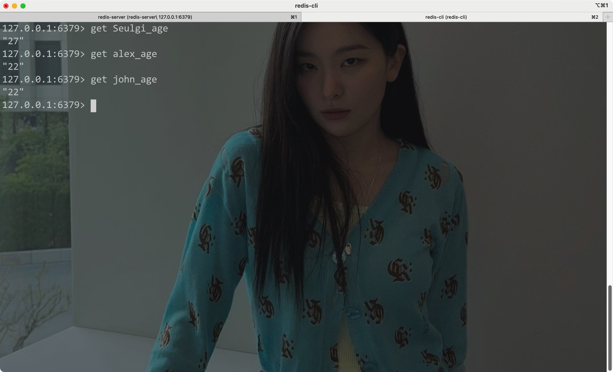
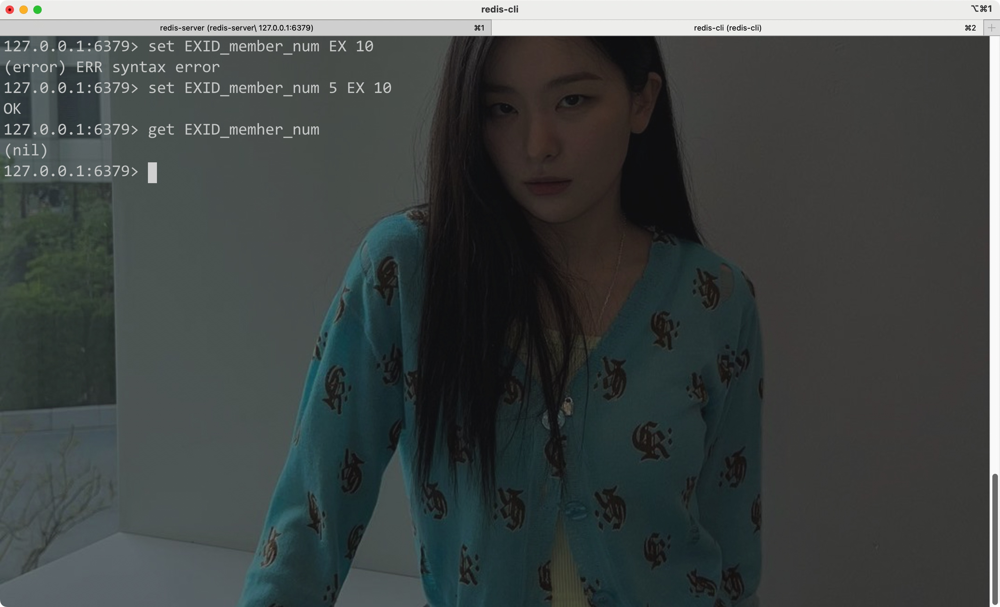

# 一、基本操作


## 1. 连接/启动/关闭


- 首先需要先启动服务器(server)

CLI:

```shell
redis-server
```

- 注意此时没有加载任何配置文件


Eg:


开启一个client客户端与之连接:

CLI:

```shell
redis-cli
```


Eg:


- 发送`ping`命令返回PONG则说明连接成功


- 通过`select`可以切换一个redis服务器实例中的数据库:

```sql
SELECT number
```

- 在使用终端建立连接时，默认会使用第一个数据库(序号为0)，默认一共有16个数据库；其中第1个数据库(序号为0)的序号不会显示出来

Eg:


- mac上通过brew安装后，redis的安装路径:


- Redis在mac上的配置文件路径:

```
/usr/local/etc/redis.conf
```


在启动时加载配置文件:


用Homebrew停止redis-server:

```shell
brew services stop redis
```

<hr>


## 2. 数据CRUD

> Redis中的数据(所有类型)都是以键值对的形式存放的(默认放在内存里)


### 1) 添加数据:

- 使用`set`命令(使用set命令添加的数据都是string类型):

Syntax:

```
set key value
```


Eg:


- 使用`mset`命令一次性添加多个键值对

Syntax:

```
mset key1 value1 key2 value2...
```


Eg:


<hr>


### 2) 获取/查询数据

对于使用`set`命令插入的string类型数据，通过`get`命令即可获取对应键的值

Syntax:

```
get key
```


Eg:



<hr>


### 3) 设置键值对的过期时间

- 在插入string类型数据时设置过期时间
- 插入时不设置过期时间则默认为永久

Syntax:

```
set key value EX expire_time
```




其中EX是指以秒为单位的过期时间，PX指以毫秒为单位的过期时间


- 使用`EXPIRE`命令为永久保存的键设置过期时间:

Syntax

```
EXPIRE key
```


Eg:


- 通过`ttl`命令查询键值对的过期时间
    - 返回结果为一个整数，其代表该键的过期时间
    - 如果为-1则说明该键值对是永久的
    - 如果为-2则说明该键值对已经过期，或者不存在


Syntax:

```
ttl key
```

- 通过PTTL可以返回以毫秒为单位的过期时间


Eg:


<hr>


