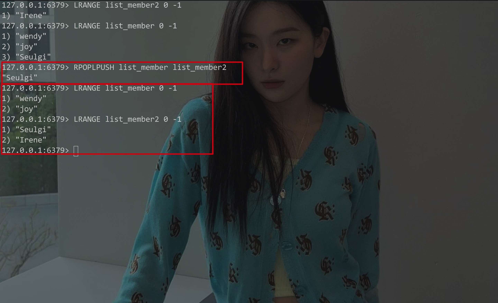
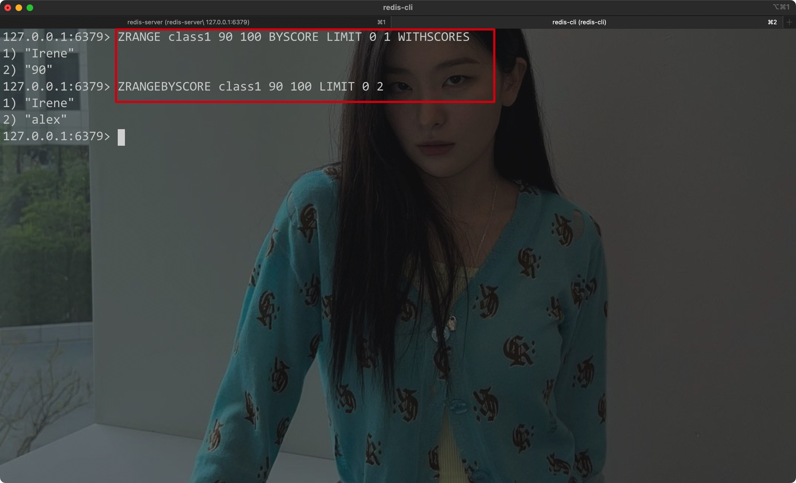

# 一、基本操作


## 1. 连接/启动/关闭


- 首先需要先启动服务器(server)

CLI:

```shell
redis-server
```

- 注意此时没有加载任何配置文件


Eg:


开启一个client客户端与之连接:

CLI:

```shell
redis-cli
```


Eg:


- 发送`ping`命令返回PONG则说明连接成功


- 通过`select`可以切换一个redis服务器实例中的数据库:

```sql
SELECT number
```

- 在使用终端建立连接时，默认会使用第一个数据库(序号为0)，默认一共有16个数据库；其中第1个数据库(序号为0)的序号不会显示出来

Eg:


- mac上通过brew安装后，redis的安装路径:


- Redis在mac上的配置文件路径:

```
/usr/local/etc/redis.conf
```


在启动时加载配置文件:


用Homebrew停止redis-server:

```shell
brew services stop redis
```


- 允许远程连接:

通过修改redis.conf文件中的`protected-mode`为no，并将`bind`字段注释掉即可

Eg:


<hr>


## 2. 数据CRUD

> Redis中的数据(所有类型)都是以键值对的形式存放的(默认放在内存里)


### 1) 添加数据:

- 使用`set`命令(使用set命令添加的数据都是string类型):

Syntax:

```
set key value
```


Eg:


- 使用`mset`命令一次性添加多个键值对

Syntax:

```
mset key1 value1 key2 value2...
```


Eg:


<hr>


### 2) 获取/查询数据

- 使用`set`命令插入的string类型数据，通过`get`命令即可获取对应键的值
- 通过`MGET`命令查询出所有的值

Syntax:

```
get key
```


Eg:


- 通过`EXISTS`命令可以查看键值对是否存在:

Syntax:

```
EXISTS key
```

- 返回0代表不存在
- 返回1代表存在


Eg:


- 通过`KEYS`命令可以查询出符合条件的键

Syntax:

```
KEYS *
```

- *代表匹配所有的键


Eg:


- 使用`RANDOMKEY`命令可以随机获取一个键

Syntax:

```
RANDONKEY
```


Eg:


- 通过`TYPE`命令可以查看键值对存储的值的类型

Syntax:

```
TYPE key
```


Eg:


<hr>


### 3) 设置键值对的过期时间

- 在插入string类型数据时设置过期时间
- 插入时不设置过期时间则默认为永久

Syntax:

```
set key value EX expire_time
```


其中EX是指以秒为单位的过期时间，PX指以毫秒为单位的过期时间


- 使用`EXPIRE`命令为永久保存的键设置过期时间:

Syntax

```
EXPIRE key
```


Eg:


- 通过`ttl`命令查询键值对的过期时间
    - 返回结果为一个整数，其代表该键的过期时间
    - 如果为-1则说明该键值对是永久的
    - 如果为-2则说明该键值对已经过期，或者不存在


Syntax:

```
ttl key
```

- 通过PTTL可以返回以毫秒为单位的过期时间


Eg:


- 通过`persist`将设置了过期时间的键值对改为永久有效

Syntax:

```
PERSIST key
```


Eg:


<hr>


### 4) 删除数据

- 使用`del`命令即可

Syntax:

```
del key
```


Eg:


<hr>


### 5) 移动键值对

- 通过`MOVE`命令可以将键值对移动到对应的数据库中

Syntax:

```
MOVE key db
```


Eg:


<hr>


### 6) 修改键值对

- 通过`RENAME`命令可以修改键值对的键前
- `RENAMENX`命令可以在修改键的名称前检测是否有重名

Syntax:

```
RENAME key newkey
```


Eg:


- 如果键值对中存储的值是纯数字，则可以使用命令进行加减操作:
    - `DECR`:自减
    - `INCR`: 自增
    - `DECRBY`: 减去对应的数字
    - `INCR`: 增加对应的数字


Eg:


<hr>


## 3. hash类型


### 1) 创建/修改

hash类型类似Java中值为map的一个map实例:

```java
Map<String, Map<String, T>> map = new HashMap<>();
```


- 通过`HSET`命令可以插入一个hash类型的键值对，该命令也可以为已经存在的Hash键值对增加字段，也可以修改字段
- 如果对应key的字段已经存在，则会用这次输入的值覆盖掉之前的值
- 可以一次性插入多个字段和值，返回的值即为插入/修改的字段值

Syntax:

```
HSET key field field_val...
```


Eg:


Eg:


<hr>


### 2) 查询

- 通过`HGET`命令可以获取对应key中对应字段的值

Syntax:

```
HSET key field_name
```


Eg:


- 通过`HGETALL`命令可以获取对应键中所有的字段和值

Syntax:

```
HGETALL key_name
```


Eg:


- 通过`HEXISTS`命令可以判断对应key中的字段是否存在

Syntax:

```
HEXISTS key field_name
```


Eg:


- 通过`HLEN`命令可以获取hash类型键值对的字段数量

Syntax:

```
HLEN key
```


Eg:


- 通过`HVALS`命令获取Hash类型键值对中所有的值

Syntax:

```
HVALS hash_key
```


Eg:


<hr>


### 3) 删除

- 通过`HDEL`命令可以删除对应键中的对应字段

Syntax:

```
HDEL key field
```


Eg:


<hr>


## 4. List类型


### 1) 插入/创建


- 通过`LPUSH`命令向列表头中插入元素(LEFT PUSH)

Syntax:

```
LPUSH key val...
```


Eg:


- 通过`RPUSH`在列表尾部插入元素

Syntax:

```
RPUSH key val...
```


Eg:


- 通过`LINSERT`命令选择在指定的元素前/后插入元素(只能插入一个元素)

Syntax:

```
LINSERT key BEFORE/AFTER pos_key insert_key
```


Eg:


<hr>


### 2) 查询


- 通过`LRANGE`命令查询对应索引范围内的元素

Syntax:

```
LRANGE key start_idx stop_idx
```


Eg:


- `LINDEX`命令以左边为准获取对于索引位置的元素(注意从0开始)，负数可以代表倒叙的索引

Syntax:

```
LINDEX key index
```


Eg:


- `RPOPLPUSH`将原列表中的最右侧元素弹出，并放入另一个列表的头部位置

Syntax:

```
RPOPLPUSH source_list destination_list
```


Eg:



<hr>


### 3) 删除

- `LPOP`弹出最左边指定数量的元素，`RPOP`弹出最右边指定数量的元素

Syntax:

```
LPOP key count
RPOP key count
```


Eg:


- `BLPOP`和`BRPOP`可以通过阻塞队列的方式从列表中弹出元素

Syntax:

```
BLPOP list timeout
BRPOP list timeout
```


可以同时对多个列表进行阻塞弹出操作:

Eg:


- 一旦多个列表中一个列表有了插入操作，则会立马弹出刚刚插入的元素

<hr>


## 5. Set/SortedSet


### 1) Set类型

- Set类型原理和HashSet一样，都是利用了HashMap，从而达到去重的作用，因为用到了Hash来获取索引，所以Set中的元素并不是按照自然顺序进行排序的


- `SADD`命令可以为一个SET集合添加元素

Syntax:

```
SADD key value...
```


- `SMEMBERS`命令可以查看集合中的所有元素

Syntax:

```
SMEMBERS key
```


Eg:


- `SISMEMBER`判断对应集合中是否包含指定的值

Syntax:

```
SISMEMBER key
```


Eg:


- 对Set集合进行集合运算:


```java
-- 差集,求出key1减去key2的结果
SDIFF key1 key2
  
-- 交集，求出两个集合中的共同元素
SINTER key1 key2

-- 并集，两个集合中的元素合在一起，并去重
SUNION key1 key2
```

Eg:


- 将集合运算的结果存放在对应的set中:

```
-- 存放key1与key2对应set做差集运算的结果
SDIFFSTORE destination key1 key2

-- 存放key1与key2对应set做交集运算的结果
SINTERSTORE destination key1 key2

-- 存放key1与key2对应set做并集运算的结果
SUNIONSTORE destination key1 key2
```


Eg:


- `SMOVE`命令可以将一个set中的指定元素移动到另一个set中去

Syntax:

```
SMOVE source destination member
```


Eg:


- `SPOP`随机删除集合中指定数量的元素

Syntax:

```
SPOP key count
```


- `SREM`删除SET中的指定元素(可以是多个)

Syntax:

```
SREM key member ...
```

Eg:


<hr>


### 2) SortedSet

- 其在Set的基础上，支持为每个元素添加一个分数，这样其中的元素就会根据插入时给定的分数进行排列


- `ZADD`命令向SortedSet列表中插入一个元素

Syntax:

```
ZADD key score value
```


- `ZCARD`命令查询SortedSet列表中元素的个数

Syntax:

```
ZCARD key
```


- `ZRANGE`命令可以查询出对应范围内的元素

Syntax:

```
ZRANGE key min max [WITHSCORES]
```

Eg:


- `ZRANGEBYSCORE`和`ZRANGE`加上SCORE选项后，都能根据分数来查找对应的元素
- 最后的`LIMIT offset count`类似SQL中的分页，即指定查询出的元素个数

Syntax:

```
ZRANGEBYSCORE key min max [WITHSCORES] [LIMIT offset count]
```


Eg:




- `ZCOUNT`命令统计对应分数段内的元素数量

Syntax:

```
ZCOUNT key min max
```


- `ZRANK`命令统计对应元素对应的排名

Syntax:

```
ZRANK key member
```


Eg:


<hr>


## 6. 持久化

- Redis的数据默认存储在内容中，一旦断电则会丢失数据
- 为了将数据保存在硬盘上，我们需要实现持久化


实现持久化的两种方案:

> 直接将内存中的数据写入到磁盘内
>
> 保存我们存放数据的所有过程(所有执行的命令)


<hr>


### 1) RDB(Redis DB)

- 将内存中的数据写入磁盘


- `SAVE`命令可以手动保存内存中的数据
- 保存后默认会在对应目录下生成一个dump.rdb文件
    - 通过配置文件中的`dbfilename`字段指定生成的文件名
    - 通过配置文件中的`dir`字段指定生产文件的路径
- `SAVE`命令在保存时会阻塞线程
- `BGSAVE`命令则不会阻塞线程，使得Redis能够在保持客户端运行的情况下异步进行保存

Eg:


Eg:


- 在配置文件中设置自动保存:


其中:

- 3600 1: 表示3600秒内进行了至少一次修改则会进行一次保存
- 300 100: 表示300秒内进行了至少100次修改，最会进行一次保存
- 60 10000: 一分钟内进行了至少10000次修改，则会进行一次保存


RDB保存的缺点

- 每次都要完整保存数据
- 保存操作并不是实时的，如果在保存间隙中，服务器突然宕机，则这在保存间隙所做的修改都会丢失

<hr>


### 2) AOF(Append Only File)

相比，RDB存储数据，AOF会直接存储命令，默认存储在appendonly.aof文件中，该文件与dump.rdb处于同一个位置


其有三种存储策略:

- always: 每次修改后都立马进行保存
- everysec: 每秒保存一次(默认策略)
- no: 随机


在配置文件中启用AOF:

- 首先需要在配置文件中，将`appendonly`设置为yes
- 之后将`appendfsync`字段设置为需要的策略


Eg:


- AOF的缺点:
    - Redis重启加载时，需要耗费大量时间推演
    - 最后aof文件可以会越来越大


解决AOF文件过大的问题:

- Redis有针对AOF文件的重写机制，可以对其中的命令进行压缩:

```
lpush test a
lpush test b
lpush test c

-- 上述命令可以压缩为:
lpush test a b c
```


- `BGREWRITEAOF`命令可以手动重写AOF中的命令
- 在配置文件中设置自动重写:

```
auto-aof-rewrite-percentage 100
auto-aof-rewrite-min-size 64mb
```


Eg:


<hr>


### 3) 总结


AOF:

- 存储速度快，消耗资源少，实时存储
- 加载速度慢，数据量大


RDB:

- 加载快，数据量小
- 存储速度慢，会发生数据丢失

<hr>


## 7. 事务/锁

事务:

- 使用`MULTI`命令开启事务
- 使用`EXEC`命令提交所有的命令
- 使用`DISCARD`命令终止事务


- 与MySQL不同，Redis中事务内的命令不会理解执行，而是先存放在执行队列中，在提交的时候才会执行
- 且Redis事务无法进行回滚，只能终止


Eg:


锁:

Redis中的锁是乐观锁，即只有当操作数据时才会判断是否有其他操作争抢资源

- 如果有则放弃当前操作
- 如果没有则进行修改，且不会对其他操作进行限制(加锁)


悲观锁:

即访问资源时会给资源加锁，不让其他操作访问该资源


- `WATCH`命令可以判断对应资源是否修改(根据版本号，而不是资源对应的值)

Eg:


- `UNWATCH`取消所有的监视


