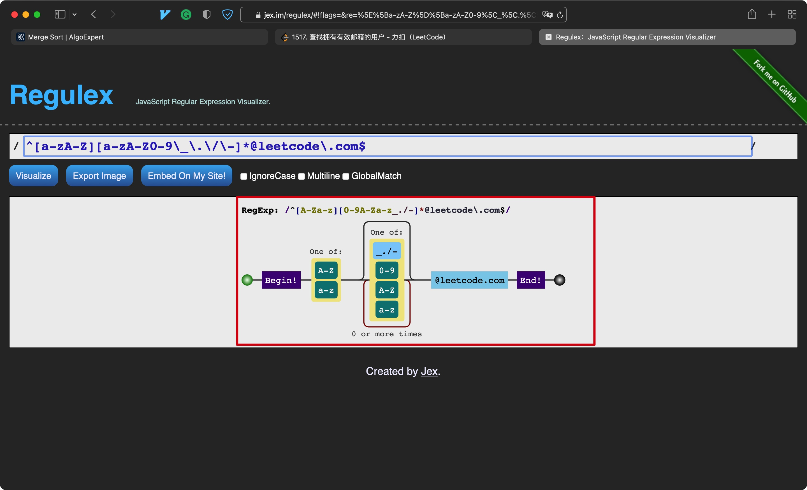

# 一、定义/作用

- 正则表达式本质就是一个公式
- 其作用在通过这个公式匹配对应的数据
- 正则表达式必须使用正则表达式语言书写，有专门的语法


注意:

在MySQL中，正则表达式默认不区分大小写，使用时需要结合WHERE子句

格式如下:

```mysql
WHERE column_name REGEXP 'regular expection';
```


如果需要区分大小写，则使用BINARY关键字即可:

```mysql
WHERE column_name BINARY REGEXP 'regular expection';
```

****


# 二、匹配符号


## 1. 基本字符匹配

- 通过"."可以匹配**任意一个**字符


## 2. 定位符

- "^": 其表示开头
- "$": 表示结尾


## 3. OR匹配

- 在字段中使用"|"可以将需要匹配的多个备选字段隔开


## 4. 匹配几个字符之一

- 该写法的作用同OR匹配"|"，但其在写法上更清晰，不会产生误解
- 其能明确指定需要匹配的范围


- 如果使用"|"，可能会造成如下结果:


- 如果需要否定该范围，在集合开始位置加上^即可:


- 对于连续的范围，可以使用-来省略中间的字符(数字和字母都可以)


## 5. 匹配特殊符号

- 如果想要查找".", "|"等在正则表达式中有特殊含义的符号，必须在其前面添加"\\"
- 在MySQL中还必须以"\\\\"开头，其中一个用于MySQL解释，另一个用于正则解释
- 重复前面任意字符任意次: *


*的用法:




