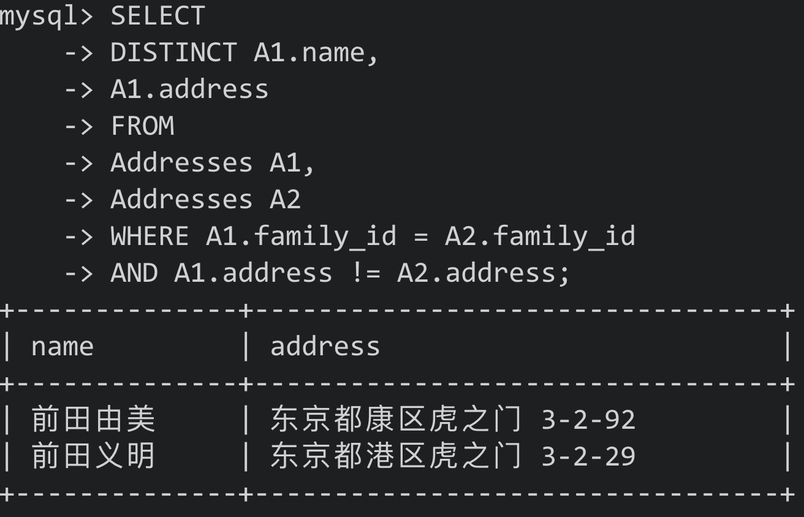

# 第一章


## 1. CASE表达式

- CASE从SQL-92标准开始被引进
- CASE的简略版本: DECODE(Oracle)，IF(MySQL)
- CASE不依赖具体的数据库，所以可移植性好


### 1.1 CASE概述

- CASE表达式分为简单CASE表达式(simple case)和搜索CASE表达式(search case)


- CASE表达式的写法:

```mysql 
-- 简单CASE表达式
CASE sex
	WHEN '1' THEN '男'
	WHEN '2' THEN '女'
ELSE '其他' END

-- 搜索CASE表达式
CASE WHEN sex = '1' THEN '男'
     WHEN sex = '2' THEN '女'
ELSE '其他' END
```


简单CASE能实现的事情比较有限，所以使用搜索CASE


在SQL中，发现WHEN子句为真时，CASE表达式中TRUE/FALSE会中止，**会跳过剩余的WHEN**，因此**应该注意条件的排他性**


- 剩余WHEN子句被忽略的写法:

```mysql
-- 一旦这样写，结果中不会出现"第二"
CASE WHEN col_1 IN ('a', 'b') THEN '第一'
     WHEN col_1 IN ('a') THEN '第二'
ELSE '其他' END
```


注意事项:

1. 统一各分支返回的数据类型

CASE表达式里各个分支返回的数据类型应该一致

2. 不要忘了写END

3. 习惯写ELSE

END是必须的，但ELSE是可选的。不写ELSE时，CASE对应的结果为NULL。但不写出先逻辑错误时不易追查原因，所以最好明确写上ELSE


### 1.2 将已有编号方式转换为新的方式统计


实现:

```mysql 
SELECT
	CASE pref_name
		WHEN '德岛' THEN '四国'
		WHEN '香川' THEN '四国'
		WHEN '爱媛' THEN '四国'
		WHEN '高知' THEN '四国'
		WHEN '福冈' THEN '九州'
		WHEN '佐贺' THEN '九州'
		WHEN '长崎' THEN '九州'
	ELSE '其他' END AS 'district',
	SUM(population)
FROM
	PopTbl
GROUP BY CASE pref_name
					WHEN '德岛' THEN '四国'
					WHEN '香川' THEN '四国'
					WHEN '爱媛' THEN '四国'
					WHEN '高知' THEN '四国'
					WHEN '福冈' THEN '九州'
					WHEN '佐贺' THEN '九州'
					WHEN '长崎' THEN '九州'
			ELSE '其他' END
```


按人口数量等级划分:

```mysql
SELECT
	CASE WHEN population < 100 THEN '01'
       WHEN population >= 100 AND population < 200 THEN '02'
       WHEN population >= 200 AND population < 300 THEN '03'
       WHEN population >= 300 THEN '04'
	ELSE NULL END AS 'pop_class',
	COUNT(*) AS 'cnt'
FROM
	PopTbl
GROUP BY CASE WHEN population < 100 THEN '01'
       WHEN population >= 100 AND population < 200 THEN '02'
       WHEN population >= 200 AND population < 300 THEN '03'
       WHEN population >= 300 THEN '04'
	ELSE NULL END
```

我们也可以使用列的别称，但严格来说，**这种写法违法SQL的规则**

**一般情况下GROUP BY里的内容比SELECT先执行，所以GROUP BY中引用SELECT子句里定义的别称是不被允许的**，在Oracle、DB2、SQL Server等数据库中该写法就会出错


但**部分数据库也支持该写法如: PostgreSQL和MySQL中**，这些数据库中会先对SELECT子句中的列表进行扫描，并对列进行计算


### 1.3 一条SQL语句进行不同条件的统计


例子:


通常的写法:

```mysql
-- 男性
SELECT
	pref_name,
	SUM(population)
FROM
	PopTbl2
WHERE sex = '1'
GROUP BY pref_name

-- 女性
SELECT
	pref_name,
	SUM(population)
FROM
	PopTbl2
WHERE sex = '2'
GROUP BY pref_name
```

- 这样写出的SQL很长，但用CASE的话，一条简单的SQL就行


```mysql
SELECT
	pref_name,
	SUM(CASE WHEN sex = '1' THEN population ELSE 0 END) AS 'cnt_m',
	SUM(CASE WHEN sex = '2' THEN population ELSE 0 END) AS 'cnt_f'
FROM
	PopTbl2
GROUP BY pref_name
```

- 这里我们使用了聚合函数**将行结构的数据，转换成了列结构的数据**(sex列)


总结:

新手用WHERE子句进行条件分支，高手用SELECT子句进行条件分支


### 1.4 用CHECK约束多个列的条件关系


注意:

- **在MySQL中CHECK约束不会起任何作用**，可以使用触发器、Set、ENUM来代替


示例: 规定女性员工的工资必须在20万以下

```mysql
CONSTRAINT check_salary CHECK
						(CASE WHEN sex = '2'
                 THEN CASE WHEN salary <= 200000
                           THEN 1 ELSE 0 END
                 ELSE 1 END = 1)
```

- 这里使用的逻辑表达式为蕴含式(conditional)，记为P -> Q
- 逻辑与(logical product)也是一种逻辑表达式，但其与蕴含式不同，逻辑与记为

$$
P\bigwedge Q
$$


- 用逻辑与改写后的CHECK约束:

```mysql
CONSTRAINT check_salary CHECK (sex = '2' AND salary <= 20000)
```


两种写法造成的约束并不一致:

- 逻辑与要求既为女性，且工资低于20000


- 逻辑与为真: 需要P和Q都为真(女性且工资低于20000)，或者其中一个条件不确定
- 蕴含式为真: 需要P和Q都为真，或者P为假或者P无法判断。即如果不满足为女性则不做限制(ELSE 1 END)


逻辑与和蕴含式的真值表:

(U: Unknown)

|  P   |  Q   | P AND Q |  P   |  Q   | p -> Q |
| :--: | :--: | :-----: | :--: | :--: | :----: |
|  T   |  T   |    T    |  T   |  T   |   T    |
|  T   |  F   |    F    |  T   |  F   |   F    |
|  T   |  U   |    U    |  T   |  U   |   F    |
|  F   |  T   |    F    |  F   |  T   |   T    |
|  F   |  F   |    F    |  F   |  F   |   T    |
|  F   |  U   |    F    |  F   |  U   |   T    |
|  U   |  T   |    U    |  U   |  T   |   T    |
|  U   |  F   |    F    |  U   |  F   |   T    |
|  U   |  U   |    U    |  U   |  U   |   T    |

- 可以说在前一个条件P(性别)为F的时候，蕴含式要比逻辑与更加宽松


### 1.5 在UPDATE中进行条件分支


示例表：


需求: 按照以下条件对表的数据进行更新

1. 对当前工资为30万元以上的员工，降薪10%
2. 对当前工资为25万元以上，但不满28万元的，加薪20%


- 如果直接使用两个UPDATE语句会出错:

```mysql
-- 条件1
UPDATE Salaries SET salary = salary * 0.9 WHERE salary >= 300000

-- 条件2
UPDATE Salaries SET salary = salary * 1.2 WHERE salary >= 250000 AND salary < 280000
```


- 这样的两个UPDATE语句彼此分开执行，不具有原子性(在第二条UPDATE处理前，数据已经被第一条UPDATE语句修改了)，此时发生了类似脏写的一致性问题


利用CASE的正确写法:

```mysql
UPDATE Salaries
	SET salary = CASE WHEN salary >= 300000
										 THEN salary * 0.9
										 WHEN salary >= 250000 AND salary < 280000
										 THEN salary * 1.2
										 ELSE salary END;
```

- 注意：**这里的ELSE一定不能省略**，如果CASE中**没有明确指定ELSE子句的话**，**不满足前面条件的数据就会被更新为NULL**


- 在中间值调换上的应用:

示例表


- 不使用CASE调换主键值a和b

```mysql
-- 设置为一个中间值
UPDATE SomeTable
	SET p_key = 'd'
WHERE p_key = 'a';

-- 将b调换为a
UPDATE SomeTable
 SET p_key = 'a'
WHERE p_key = 'b'

-- 再将d调换为b
UPDATE SomeTable
 SET p_key = 'b'
WHERE p_key = 'd'
```


- 使用CASE则只需要执行一次

```mysql
UPDATE SomeTable
	SET p_key = CASE WHEN p_key ='a'
					          THEN 'b'
					          WHEN p_key = 'b'
					          THEN 'a'
					          ELSE p_key END
	WHERE p_key IN ('a', 'b');
```


**注意：**该条SQL**在MySQL和PostgreSQL中**，会因为中间重复而报错，然而在Oracle、DB2、SQL Server中则能够正常执行


Eg:


// 如果需要这样的调换，说明表的设计有问题，需要重新审视表的设计


### 1.6 表之间的数据匹配

- CASE的一大优势为能够判断表达式

即在CASE表达式中，我们能够使用BETWEEN、LIKE等谓词组合，以及能够嵌套子查询的IN和EXISTS谓词


Eg Tables:


通过这两张表生成一张交叉表，以便了解每个月开设的课程


```mysql
-- IN谓词
SELECT
	course_name,
	CASE WHEN course_id IN
								(SELECT course_id FROM OpenCourses
                WHERE month = 200706) THEN '◯'
				ELSE '✕' END AS '6月',
	CASE WHEN course_id IN
								(SELECT course_id FROM OpenCourses
                WHERE month = 200707) THEN '◯'
				ELSE '✕' END AS '7月',
	CASE WHEN course_id IN
								(SELECT course_id FROM OpenCourses
                WHERE month = 200708) THEN '◯'
				ELSE '✕' END AS '8月')
FROM
	CourseMaster
	
-- EXISTS谓词
SELECT
	CM.course_name,
CASE
		WHEN EXISTS ( SELECT course_id FROM OpenCourses OC WHERE MONTH = 200706 AND OC.course_id = CM.course_id) THEN
		'◯' ELSE '✕' END AS '6月',
CASE
		WHEN EXISTS ( SELECT course_id FROM OpenCourses OC WHERE MONTH = 200707 AND OC.course_id = CM.course_id) THEN
		'◯' ELSE '✕' END AS '7月',
CASE
		WHEN EXISTS ( SELECT course_id FROM OpenCourses OC WHERE MONTH = 200708 AND OC.course_id = CM.course_id) THEN
		'◯' ELSE '✕' END AS '8月'
FROM
	CourseMaster CM
```


- 这样的SQL没有聚合，不需要排序，月份增加时只需要修改SELECT列表，**扩展性好**


### 1.7 在CASE中使用聚合函数

Eg Table


1. 获取只加入了一个社团的学生的社团id
2. 获取加入了多个社团学生的主社团id


常规方法:

- 分两次写，先查询出只加入一个社团的学生对应的社团id

```mysql
SELECT
	std_id,
	MAX(club_id) AS 'main_club'
FROM
	StudentClub
GROUP BY std_id
HAVING COUNT(*) = 1;
```


- 再查询出其余学生的主社团id

```mysql
SELECT
	std_id,
	club_id
FROM
	StudentClub
WHERE main_club_flg = 'Y'
```


使用CASE的方式

```mysql
SELECT
	std_id,
	CASE WHEN COUNT(*) = 1
	  	 THEN MAX(club_id)
	  	 ELSE MAX(CASE WHEN main_club_flg = 'Y'
                     THEN club_id
               			 ELSE NULL END)
	END AS 'main_club'
FROM
	StudentClub
GROUP BY std_id;
```


Eg:


### 小结

1. 在GROUP BY中使用CASE，可以自定义分组的单位
2. 在聚合函数中使用CASE，可以将行结构变为列结构(1.3)
3. 聚合函数也可以嵌套在CASE中使用(1.7)
4. CASE的表达能力更强，且移植性更好(不依赖具体的数据库)

<hr>


## 2. 自连接

- 自连接: 针对同一张表进行的连接称为自连接
- SQL为面向集合语言


### 2.1 可重排列/排列/组合

Eg Table:


组合分为两种: 有顺序的有序对<1, 2>，无顺序的无序对{1, 2}


在有序对中，元素顺序不同也是不同的对: <1, 2> ≠ <2, 1> (P: permutation/排列)

无序对中，元素顺序无关: {1, 2} = {2, 1} (C: combination/组合)


生成交叉连接生成笛卡尔积(直积)，从而获取有序对(顺序不同则算做不同的)

```mysql
SELECT
	P1.name AS 'name_1',
	P2.name AS 'name_2'
FROM
	Products AS P1,
	Products AS P2;
```


- 添加一个条件获取两个列值不同的组合:

```mysql
SELECT
	P1.name AS 'name_1',
	P2.name AS 'name_2'
FROM
	Products AS P1,
	Products AS P2
WHERE P1.name != P2.name;
```

Eg:


- 在SQL中，只要被赋予了不同的别名，即使是相同的表也应该看作不同的表


- 再处理只是调换了顺序的对，获取对应的排列:

```mysql
SELECT
	P1.name AS 'name_1',
	P2.name AS 'name_2'
FROM
	Products AS P1,
	Products AS P2
WHERE P1.name > P2.name;
```


- 此时只与"字符顺序比自己靠前"的商品进行匹配
- 同样获取三个元素的排列:

```mysql
SELECT
	P1.name AS 'name_1',
	P2.name AS 'name_2',
	P3.name AS 'name_3'
FROM
	Products AS P1,
	Products AS P2,
	Products AS P3
WHERE P1.name > P2.name
AND P2.name > P3.name
```


- 使用**除了"="外的比较运算符**进行的连接称为"**非等值连接**"
- 这里和自连接结合，因此称为"非等值自连接"，**这是获取组合的惯用套路**


### 2.2 删除重复行

Eg Table:


- 如果像这样所有的列都有重复的话，则需要使用数据库自带的行id(MySQL里的DB_ROW_ID)

```sql
-- 以Oracle中的rowid为例
DELETE FROM product P1
	WHERE rowid < (SELECT
                	MAX(P2.rowid)
                 FROM
                	product P2
                 WHERE P1.name = P2.name
                 AND P1.price = P2.price)
```

**注意:** 只有Oracle(rowid)和PostgreSQL(oid)提供了可用的行id；在PostgreSQL中需要在建表时指定WITH OID才能使用；其余数据库则只能自行创建主键列或者存入临时表


- 无论是表还是视图，本质上都是集合——**集合是SQL唯一能够处理的数据结构**


### 2.3 查找局部不一致的列

Eg Table:


其中前田夫妇中有一个人的地址错误，但family_id相同

```mysql
SELECT
	DISTINCT A1.name,
	A1.address
FROM
	Addresses A1,
	Addresses A2
WHERE A1.family_id = A2.family_id
AND A1.address != A2.address;
```





​	Eg Table:


```mysql
-- 用于查找价格相等但商品名称不同的记录
SELECT
	DISTINCT P1.name,
	P1.price
FROM
	Products P1,
	Products P2
WHERE P1.price = P2.price
AND P1.name != P2.name;
```


- 因为表中有多条价格相同的记录，所以查询结果需要去重

- 改用相关/关联子查询则不需要去重了:

```mysql
SELECT
	t1.name,
	t1.price
FROM
	Products AS t1
WHERE EXISTS (
  SELECT
    t2.name,
    t2.price
  FROM
    Products AS t2
  WHERE t1.`name` != t2.`name`
  AND t1.price = t2.price
)
```


