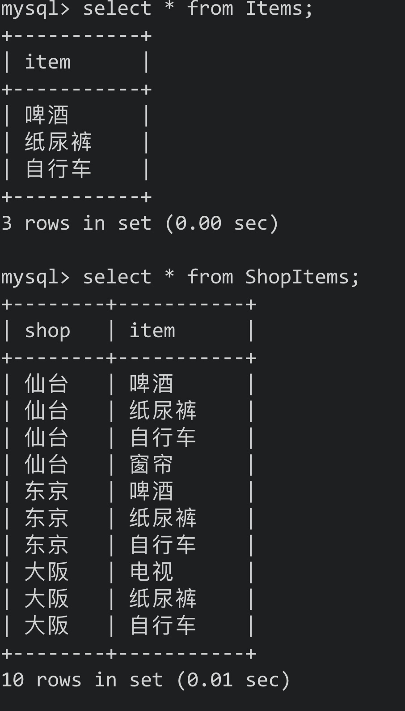

# 第一章


## 1. CASE表达式

- CASE从SQL-92标准开始被引进
- CASE的简略版本: DECODE(Oracle)，IF(MySQL)
- CASE不依赖具体的数据库，所以可移植性好


### 1.1 CASE概述

- CASE表达式分为简单CASE表达式(simple case)和搜索CASE表达式(search case)


- CASE表达式的写法:

```mysql 
-- 简单CASE表达式
CASE sex
	WHEN '1' THEN '男'
	WHEN '2' THEN '女'
ELSE '其他' END

-- 搜索CASE表达式
CASE WHEN sex = '1' THEN '男'
     WHEN sex = '2' THEN '女'
ELSE '其他' END
```


简单CASE能实现的事情比较有限，所以使用搜索CASE


在SQL中，发现WHEN子句为真时，CASE表达式中TRUE/FALSE会中止，**会跳过剩余的WHEN**，因此**应该注意条件的排他性**


- 剩余WHEN子句被忽略的写法:

```mysql
-- 一旦这样写，结果中不会出现"第二"
CASE WHEN col_1 IN ('a', 'b') THEN '第一'
     WHEN col_1 IN ('a') THEN '第二'
ELSE '其他' END
```


注意事项:

1. 统一各分支返回的数据类型

CASE表达式里各个分支返回的数据类型应该一致

2. 不要忘了写END

3. 习惯写ELSE

END是必须的，但ELSE是可选的。不写ELSE时，CASE对应的结果为NULL。但不写出先逻辑错误时不易追查原因，所以最好明确写上ELSE


### 1.2 将已有编号方式转换为新的方式统计


实现:

```mysql 
SELECT
	CASE pref_name
		WHEN '德岛' THEN '四国'
		WHEN '香川' THEN '四国'
		WHEN '爱媛' THEN '四国'
		WHEN '高知' THEN '四国'
		WHEN '福冈' THEN '九州'
		WHEN '佐贺' THEN '九州'
		WHEN '长崎' THEN '九州'
	ELSE '其他' END AS 'district',
	SUM(population)
FROM
	PopTbl
GROUP BY CASE pref_name
					WHEN '德岛' THEN '四国'
					WHEN '香川' THEN '四国'
					WHEN '爱媛' THEN '四国'
					WHEN '高知' THEN '四国'
					WHEN '福冈' THEN '九州'
					WHEN '佐贺' THEN '九州'
					WHEN '长崎' THEN '九州'
			ELSE '其他' END
```


按人口数量等级划分:

```mysql
SELECT
	CASE WHEN population < 100 THEN '01'
       WHEN population >= 100 AND population < 200 THEN '02'
       WHEN population >= 200 AND population < 300 THEN '03'
       WHEN population >= 300 THEN '04'
	ELSE NULL END AS 'pop_class',
	COUNT(*) AS 'cnt'
FROM
	PopTbl
GROUP BY CASE WHEN population < 100 THEN '01'
       WHEN population >= 100 AND population < 200 THEN '02'
       WHEN population >= 200 AND population < 300 THEN '03'
       WHEN population >= 300 THEN '04'
	ELSE NULL END
```

我们也可以使用列的别称，但严格来说，**这种写法违法SQL的规则**

**一般情况下GROUP BY里的内容比SELECT先执行，所以GROUP BY中引用SELECT子句里定义的别称是不被允许的**，在Oracle、DB2、SQL Server等数据库中该写法就会出错


但**部分数据库也支持该写法如: PostgreSQL和MySQL中**，这些数据库中会先对SELECT子句中的列表进行扫描，并对列进行计算


### 1.3 一条SQL语句进行不同条件的统计


例子:


通常的写法:

```mysql
-- 男性
SELECT
	pref_name,
	SUM(population)
FROM
	PopTbl2
WHERE sex = '1'
GROUP BY pref_name

-- 女性
SELECT
	pref_name,
	SUM(population)
FROM
	PopTbl2
WHERE sex = '2'
GROUP BY pref_name
```

- 这样写出的SQL很长，但用CASE的话，一条简单的SQL就行


```mysql
SELECT
	pref_name,
	SUM(CASE WHEN sex = '1' THEN population ELSE 0 END) AS 'cnt_m',
	SUM(CASE WHEN sex = '2' THEN population ELSE 0 END) AS 'cnt_f'
FROM
	PopTbl2
GROUP BY pref_name
```

- 这里我们使用了聚合函数**将行结构的数据，转换成了列结构的数据**(sex列)


总结:

新手用WHERE子句进行条件分支，高手用SELECT子句进行条件分支


### 1.4 用CHECK约束多个列的条件关系


注意:

- **在MySQL中CHECK约束不会起任何作用**，可以使用触发器、Set、ENUM来代替


示例: 规定女性员工的工资必须在20万以下

```mysql
CONSTRAINT check_salary CHECK
						(CASE WHEN sex = '2'
                 THEN CASE WHEN salary <= 200000
                           THEN 1 ELSE 0 END
                 ELSE 1 END = 1)
```

- 这里使用的逻辑表达式为蕴含式(conditional)，记为P -> Q
- 逻辑与(logical product)也是一种逻辑表达式，但其与蕴含式不同，逻辑与记为

$$
P\bigwedge Q
$$


- 用逻辑与改写后的CHECK约束:

```mysql
CONSTRAINT check_salary CHECK (sex = '2' AND salary <= 20000)
```


两种写法造成的约束并不一致:

- 逻辑与要求既为女性，且工资低于20000


- 逻辑与为真: 需要P和Q都为真(女性且工资低于20000)，或者其中一个条件不确定
- 蕴含式为真: 需要P和Q都为真，或者P为假或者P无法判断。即如果不满足为女性则不做限制(ELSE 1 END)


逻辑与和蕴含式的真值表:

(U: Unknown)

|  P   |  Q   | P AND Q |  P   |  Q   | p -> Q |
| :--: | :--: | :-----: | :--: | :--: | :----: |
|  T   |  T   |    T    |  T   |  T   |   T    |
|  T   |  F   |    F    |  T   |  F   |   F    |
|  T   |  U   |    U    |  T   |  U   |   F    |
|  F   |  T   |    F    |  F   |  T   |   T    |
|  F   |  F   |    F    |  F   |  F   |   T    |
|  F   |  U   |    F    |  F   |  U   |   T    |
|  U   |  T   |    U    |  U   |  T   |   T    |
|  U   |  F   |    F    |  U   |  F   |   T    |
|  U   |  U   |    U    |  U   |  U   |   T    |

- 可以说在前一个条件P(性别)为F的时候，蕴含式要比逻辑与更加宽松


### 1.5 在UPDATE中进行条件分支


示例表：


需求: 按照以下条件对表的数据进行更新

1. 对当前工资为30万元以上的员工，降薪10%
2. 对当前工资为25万元以上，但不满28万元的，加薪20%


- 如果直接使用两个UPDATE语句会出错:

```mysql
-- 条件1
UPDATE Salaries SET salary = salary * 0.9 WHERE salary >= 300000

-- 条件2
UPDATE Salaries SET salary = salary * 1.2 WHERE salary >= 250000 AND salary < 280000
```


- 这样的两个UPDATE语句彼此分开执行，不具有原子性(在第二条UPDATE处理前，数据已经被第一条UPDATE语句修改了)，此时发生了类似脏写的一致性问题


利用CASE的正确写法:

```mysql
UPDATE Salaries
	SET salary = CASE WHEN salary >= 300000
										 THEN salary * 0.9
										 WHEN salary >= 250000 AND salary < 280000
										 THEN salary * 1.2
										 ELSE salary END;
```

- 注意：**这里的ELSE一定不能省略**，如果CASE中**没有明确指定ELSE子句的话**，**不满足前面条件的数据就会被更新为NULL**


- 在中间值调换上的应用:

示例表


- 不使用CASE调换主键值a和b

```mysql
-- 设置为一个中间值
UPDATE SomeTable
	SET p_key = 'd'
WHERE p_key = 'a';

-- 将b调换为a
UPDATE SomeTable
 SET p_key = 'a'
WHERE p_key = 'b'

-- 再将d调换为b
UPDATE SomeTable
 SET p_key = 'b'
WHERE p_key = 'd'
```


- 使用CASE则只需要执行一次

```mysql
UPDATE SomeTable
	SET p_key = CASE WHEN p_key ='a'
					          THEN 'b'
					          WHEN p_key = 'b'
					          THEN 'a'
					          ELSE p_key END
	WHERE p_key IN ('a', 'b');
```


**注意：**该条SQL**在MySQL和PostgreSQL中**，会因为中间重复而报错，然而在Oracle、DB2、SQL Server中则能够正常执行


Eg:


// 如果需要这样的调换，说明表的设计有问题，需要重新审视表的设计


### 1.6 表之间的数据匹配

- CASE的一大优势为能够判断表达式

即在CASE表达式中，我们能够使用BETWEEN、LIKE等谓词组合，以及能够嵌套子查询的IN和EXISTS谓词


Eg Tables:


通过这两张表生成一张交叉表，以便了解每个月开设的课程


```mysql
-- IN谓词
SELECT
	course_name,
	CASE WHEN course_id IN
								(SELECT course_id FROM OpenCourses
                WHERE month = 200706) THEN '◯'
				ELSE '✕' END AS '6月',
	CASE WHEN course_id IN
								(SELECT course_id FROM OpenCourses
                WHERE month = 200707) THEN '◯'
				ELSE '✕' END AS '7月',
	CASE WHEN course_id IN
								(SELECT course_id FROM OpenCourses
                WHERE month = 200708) THEN '◯'
				ELSE '✕' END AS '8月')
FROM
	CourseMaster
	
-- EXISTS谓词
SELECT
	CM.course_name,
CASE
		WHEN EXISTS ( SELECT course_id FROM OpenCourses OC WHERE MONTH = 200706 AND OC.course_id = CM.course_id) THEN
		'◯' ELSE '✕' END AS '6月',
CASE
		WHEN EXISTS ( SELECT course_id FROM OpenCourses OC WHERE MONTH = 200707 AND OC.course_id = CM.course_id) THEN
		'◯' ELSE '✕' END AS '7月',
CASE
		WHEN EXISTS ( SELECT course_id FROM OpenCourses OC WHERE MONTH = 200708 AND OC.course_id = CM.course_id) THEN
		'◯' ELSE '✕' END AS '8月'
FROM
	CourseMaster CM
```


- 这样的SQL没有聚合，不需要排序，月份增加时只需要修改SELECT列表，**扩展性好**


### 1.7 在CASE中使用聚合函数

Eg Table


1. 获取只加入了一个社团的学生的社团id
2. 获取加入了多个社团学生的主社团id


常规方法:

- 分两次写，先查询出只加入一个社团的学生对应的社团id

```mysql
SELECT
	std_id,
	MAX(club_id) AS 'main_club'
FROM
	StudentClub
GROUP BY std_id
HAVING COUNT(*) = 1;
```


- 再查询出其余学生的主社团id

```mysql
SELECT
	std_id,
	club_id
FROM
	StudentClub
WHERE main_club_flg = 'Y'
```


使用CASE的方式

```mysql
SELECT
	std_id,
	CASE WHEN COUNT(*) = 1
	  	 THEN MAX(club_id)
	  	 ELSE MAX(CASE WHEN main_club_flg = 'Y'
                     THEN club_id
               			 ELSE NULL END)
	END AS 'main_club'
FROM
	StudentClub
GROUP BY std_id;
```


Eg:


### 小结

1. 在GROUP BY中使用CASE，可以自定义分组的单位
2. 在聚合函数中使用CASE，可以将行结构变为列结构(1.3)
3. 聚合函数也可以嵌套在CASE中使用(1.7)
4. CASE的表达能力更强，且移植性更好(不依赖具体的数据库)

<hr>


## 2. 自连接

- 自连接: 针对同一张表进行的连接称为自连接
- SQL为面向集合语言


### 2.1 可重排列/排列/组合

Eg Table:


组合分为两种: 有顺序的有序对<1, 2>，无顺序的无序对{1, 2}


在有序对中，元素顺序不同也是不同的对: <1, 2> ≠ <2, 1> (P: permutation/排列)

无序对中，元素顺序无关: {1, 2} = {2, 1} (C: combination/组合)


生成交叉连接生成笛卡尔积(直积)，从而获取有序对(顺序不同则算做不同的)

```mysql
SELECT
	P1.name AS 'name_1',
	P2.name AS 'name_2'
FROM
	Products AS P1,
	Products AS P2;
```


- 添加一个条件获取两个列值不同的组合:

```mysql
SELECT
	P1.name AS 'name_1',
	P2.name AS 'name_2'
FROM
	Products AS P1,
	Products AS P2
WHERE P1.name != P2.name;
```

Eg:


- 在SQL中，只要被赋予了不同的别名，即使是相同的表也应该看作不同的表


- 再处理只是调换了顺序的对，获取对应的排列:

```mysql
SELECT
	P1.name AS 'name_1',
	P2.name AS 'name_2'
FROM
	Products AS P1,
	Products AS P2
WHERE P1.name > P2.name;
```


- 此时只与"字符顺序比自己靠前"的商品进行匹配
- 同样获取三个元素的排列:

```mysql
SELECT
	P1.name AS 'name_1',
	P2.name AS 'name_2',
	P3.name AS 'name_3'
FROM
	Products AS P1,
	Products AS P2,
	Products AS P3
WHERE P1.name > P2.name
AND P2.name > P3.name
```


- 使用**除了"="外的比较运算符**进行的连接称为"**非等值连接**"
- 这里和自连接结合，因此称为"非等值自连接"，**这是获取组合的惯用套路**


### 2.2 删除重复行

Eg Table:


- 如果像这样所有的列都有重复的话，则需要使用数据库自带的行id(MySQL里的DB_ROW_ID)

```sql
-- 以Oracle中的rowid为例
DELETE FROM product P1
	WHERE rowid < (SELECT
                	MAX(P2.rowid)
                 FROM
                	product P2
                 WHERE P1.name = P2.name
                 AND P1.price = P2.price)
```

**注意:** 只有Oracle(rowid)和PostgreSQL(oid)提供了可用的行id；在PostgreSQL中需要在建表时指定WITH OID才能使用；其余数据库则只能自行创建主键列或者存入临时表


- 无论是表还是视图，本质上都是集合——**集合是SQL唯一能够处理的数据结构**


### 2.3 查找局部不一致的列

Eg Table:


其中前田夫妇中有一个人的地址错误，但family_id相同

```mysql
SELECT
	DISTINCT A1.name,
	A1.address
FROM
	Addresses A1,
	Addresses A2
WHERE A1.family_id = A2.family_id
AND A1.address != A2.address;
```


​	Eg Table:


```mysql
-- 用于查找价格相等但商品名称不同的记录
SELECT
	DISTINCT P1.name,
	P1.price
FROM
	Products P1,
	Products P2
WHERE P1.price = P2.price
AND P1.name != P2.name;
```


- 因为表中有多条价格相同的记录，所以查询结果需要去重

- 改用相关/关联子查询则不需要去重了:

```mysql
SELECT
	t1.name,
	t1.price
FROM
	Products AS t1
WHERE EXISTS (
  SELECT
    t2.name,
    t2.price
  FROM
    Products AS t2
  WHERE t1.`name` != t2.`name`
  AND t1.price = t2.price
)
```


### 2.4 排序

Eg Table:


将商品按照价格排序，如果价格相同，给出跳过和不跳过之后次序的排序位次

```mysql
-- MySQL8.0才支持
SELECT
	name,
	price,
	RANK() OVER(
    ORDER BY price DESC
  ) AS rank_1,
  DENSE_RANK() OVER(
    ORDER BY price DESC
  ) AS rank_2
FROM
	Products
```


不依赖具体数据库进行非分组排序的做法:

```mysql
-- 如果出现相同次序，则跳过之后的次序
SELECT
	P1.name,
	P1.price,
	(
  SELECT
  	COUNT(P2.price)
  FROM
  	Products P2
  WHERE P2.price > P1.price) + 1 AS rank_1
  )
FROM
	Products P1
ORDER BY rank_1;
```


Res:


- 如果加上DISTINCT去重，那么遇到相同位次时就不会跳过之后的位次(相当于DENSE_RANK)

```mysql
SELECT
	P1.name,
	P1.price,
	(SELECT
  	COUNT(P2.price)
  FROM
  	Products P2
  WHERE P2.price > P1.price) + 1 AS rank_1,
	(SELECT
  	COUNT(DISTINCT P3.price)
  FROM
  	Products P3
  WHERE P3.price > P1.price) + 1 AS rank_2
FROM
	Products P1
ORDER BY rank_1, rank_2
```


- 自连接的写法

```mysql
SELECT
	P1.name,
	MAX(P1.price) AS price,
	COUNT(P2.name) + 1 AS rank_1
FROM
	Products P1
LEFT JOIN Products P2 ON P1.price < P2.price
GROUP BY P1.name
ORDER BY rank_1
```


- 去掉聚合查看包含关系

```mysql
SELECT
	P1.name,
	P2.name
FROM
	Products P1
LEFT JOIN Products P2 ON P1.price < P2.price
```


- 一旦改为内连接则会跳过第一名(被WHERE子句的条件排除了)

```mysql
SELECT
	P1.name,
	MAX(P1.price) AS price,
	COUNT(P2.name) + 1 AS rank_1
FROM
	Products P1
INNER JOIN Products P2 ON P1.price < P2.price
GROUP BY P1.name
ORDER BY rank_1
```


### 2.5 小结

- 自连接的性能开销比多表连接要大，用于自连接的列最好是主键或者建立了索引的列


要点

1. 自连接与非等值连接使用
2. 自连接与GROUP BY结合生成递归集合
3. **把表看作行的集合**，用面向集合的方式来思考
4. 自连接开销大，经历在用于连接的列上建立索引


### 2.6 练习:


1-2-1

Table:


查询出对应的组合(combination)

```mysql
SELECT
	t1.name AS 'name_1',
	t2.name AS 'name_2'
FROM
	Products AS t1
INNER JOIN Products AS t2
WHERE t1.name >= t2.name
```


1-2-2

Table:


查询不同地区对应水果的价格和位次


```mysql
-- 不使用窗口函数，使用标量子查询
SELECT
	t1.district,
	t1.name,
	t1.price,
	(
	SELECT
		COUNT(t2.name)
	FROM
		DistrictProducts AS t2
	WHERE t1.district = t2.district
	AND t2.price > t1.price
	) + 1 AS 'rank_1'
FROM
	DistrictProducts AS t1
	
-- 自连接查询
SELECT
	t1.district,
	t1.name,
	MAX(t1.price) AS 'price',
	COUNT(t2.name) + 1 AS 'rank_1'
FROM
	DistrictProducts AS t1
LEFT JOIN DistrictProducts AS t2 ON t1.district = t2.district
AND t2.price > t1.price
GROUP BY t1.district, t1.name
```


1-2-3

Table:


填充其中的ranking列值

```mysql
UPDATE DistrictProducts2 P1
SET ranking = (
	SELECT
		COUNT(P2.price) + 1 
	FROM
		DistrictProducts2 P2 
	WHERE P1.district = P2.district 
	AND P2.price > P1.price
);
```

<hr>


## 3. 三值逻辑和NULL

- 在编程语言中，布尔型一般只有true和false两个值
- 但在SQL中还有第三个值: unknown，这种逻辑体系被称为三值逻辑(three-value logic)
- 因为关系型数据库中引入了NULL，所以不得不同时引进第三个值


### 3.1 理论

- NULL其实有两种:
    - 未知unknown
    - 不适用not applicable/inapplicable


- 未知(unknown):

是指虽然现在不知道，但加上某些条件后就能知道了(不知道戴墨镜的人眼睛是什么颜色的)


- 不适用(inapplicable):

无意义，不管怎么努力都无法知道(冰箱眼睛的颜色)


- 不能使用"= NULL"

像下面这样查找列中值为NULL的行是不行的:

```mysql
SELECT
	*
FROM
	tbl_A
WHERE col_1 = NULL;
```


**注：**对NULL使用比较谓词后得到的结果总是unknown(NULL的一种)，**而查询结果只会包含WHERE子句里判断为true的行，不会包含结果为false和unknown的行**

所以这里无论col_1是否为NULL，比较结果都为unknown


下列式子都会判断为unknown:

```mysql
1 = NULL
2 > NULL
3 < NULL
4 <> NULL
NULL = NULL
```


解释:

- NULL既不是值也不是变量
- NULL**只是一个表示"没有值"的标记**，所以对NULL只用比较谓词本身就是无意义的


- "列的值为NULL"，"NULL值"这样的说法本身就是错误的，因为NULL不是值
- 在SQL里的NULL和其他编程语言的NULL是完全不同的东西
- IS NULL是一个完整的谓词，不能将IS看作谓词，而将NUL看作值(MySQL值为ISNULL)


- unknown、第三个真值

真值unknown和作为NULL的一种的UNKOWN是不同的

```mysql
-- 明确的真值比较
unknown = unknown -> true

-- 相当于NULL = NULL
UNKNOWN = UNKNOWN -> unknown
```

unknown是明确的布尔型真值，而UNKNOWN既不是值也不是变量


三值逻辑的真值表:

|  x   | NOT x |
| :--: | :---: |
|  t   |   f   |
|  u   |   u   |
|  f   |   t   |


| AND  |  t   |  u   |  f   |
| :--: | :--: | :--: | :--: |
|  t   |  t   |  u   |  f   |
|  u   |  u   |  u   |  f   |
|  f   |  f   |  f   |  f   |


|  OR  |  t   |  u   |  f   |
| :--: | :--: | :--: | :--: |
|  t   |  t   |  t   |  t   |
|  u   |  t   |  u   |  u   |
|  f   |  t   |  u   |  f   |


中间涉及到和u的运算是三值逻辑中独有的运算，其余的SQL谓词全部都能够由这三个逻辑运算组合而来，该矩阵可以说是SQL的母体(matrix)


三个真值之间的优先级:

- AND: false > unknown > true
- OR: true > unknown > false

优先级高的会决定计算的结果


### 3.2 实践


#### 1) 比较谓词和NULL(1): 排中律不成立


P: john是20岁，或者不是20岁，二者必居其一

- 这是一个真命题，这样将命题和它的否命题通过'或者'连接而成的命题全都是真命题
- 这个命题在二值逻辑中被称为排中律(Law of Excluded Middle)，即不认可中间状态
- 排中律被认为是古典逻辑学和非古典逻辑学的分界线


Eg Table:


因为约翰的年龄不详，所以无法查询出来，查询步骤如下:

```mysql
-- 1
SELECT
	*
FROM
	Students
WHERE age = NULL
OR age != NULL

-- 2. 对NULL使用谓词后，结果为unknown
SELECT
	*
FROM
	Students
WHERE unknown
OR unknown;

-- 3. unknown OR unknown的结果为unknown
SELECT
	*
FROM
WHERE unknown;
```

- 因为SQL的查询结果里只有判断结果为true的行，想要让约翰出现在结果中，需要添加"第3个条件":

```mysql
SELECT
	*
FORM
	Students
WHERE age = 20
OR age != 20
OR age IS NULL;
```


实际上这个人有年龄，但我们无法从这条表知道

实际上，**关系模型不是用来描述现实世界的模型，而是用于描述人类认知状态的核心的模型，我们有限且不完备的只是也会直接反映在表里**


#### 2) 比较谓词和NULL(2): CASE表达式和NULL

在CASE中将NULL作为条件使用时经常会出现错误

``` mysql
CASE col_1
	WHEN 1 THEN '◯'
	WHEN NULl THEN 'X'
END
```

该表达式一定不会返回X

第二个WHEN子句是col_1 = NULL的缩写形式，**这个式子的真值永远是unknown**

CASE表达式的判断方法和WHERE子句一样，只认可真值为true的条件


正确的写法:

```mysql
CASE WHEN col_1 = 1 THEN '◯'
     WHEN col_1 IS NULL THEN 'X'
END
```


这种错误的原因是将NULL误解为了值


#### 3) NOT IN和NOT EXISTS不是等价的

在对SQL语句优化的时候，常用的技巧是将IN改写为EXISTS，这是等价改写

但将NOT IN改写成NOT EXISTS时，结果则未必


Eg Table:


查询出如何根据这两张表查询"与B班住在东京的学生年龄不同的A班学生"

```mysql
SELECT
	*
FROM
	Class_A
WHERE age NOT IN (
	SELECT
  	age
  FROM
  	Class_B
  WHERE city = '东京'
)
```

该条语句并不能顺利查询出结果:

```mysql
-- 1 子查询获取年龄列表
SELECT
	*
FROM
	Class_A
WHERE age NOT IN (
	22, 23, NULL
)

-- 2 用NOT和IN改写NOT IN
SELECT
	*
FROM
	Class_B
WHERE NOT age IN (22, 23, NULL)

-- 3 用OR等价改写谓词IN
SELECT
	*
FROM
	Class_A
WHERE NOT ((age = 22) OR (age = 23) OR (age == NULL))

-- 4 使用德·摩根定律等价改写
SELECT
	*
FROM
	Class_A
WHERE NOT (age == 22) AND NOT (age == 23) AND NOT (age == NULL)

-- 5 使用!=等价改写NOT和=
SELECT
	*
FROM
	Class_A
WHERE (age != 22) AND (age != 23) AND (age != NULL)

-- 6 对NULL使用!=后结果为unknown
SELECT
	*
FROM
	Class_a
WHERE (age != 22) AND (age != 23) AND unknown

-- 7 如果AND运算里包含unknown，则结果不为true
SELECT
	*
FROM
	Class_a
WHERE false OR unknown
```

- 如果NOT IN子查询中用到的表里被选择的列中存在NULL，则SQL语句整体的查询结果永远为空
- 为了获取正确结果，我们需要使用EXISTS谓词

```mysql
SELECT
	*
FROM
	Class_A A
WHERE NOT EXISTS (
	SELECT
  	*
 FROM
  	Class_B B
 WHERE A.age = B.age
 AND B.city = '东京'
)
```


改写后的处理过程:

```mysql
-- 1 和NULL进行比较运算
SELECT
	*
FROM
	Class_A A
WHERE NOT EXISTS (
	SELECT
  	*
 FROM
  	Class_B B
 WHERE A.age = NULl
 AND B.city = '东京'
)


-- 2 对NULL使用"="后，结果为unknown"
SELECT
	*
FROM
	Class_A A
WHERE NOT EXISTS (
	SELECT
  	*
 FROM
  	Class_B B
 WHERE unknown
 AND B.city = '东京'
)


-- 3 AND中包含unknown，则结果不会为true
SELECT
	*
FROM
	Class_A A
WHERE NOT EXISTS (
	SELECT
  	*
 FROM
  	Class_B B
 WHERE false OR unknown
)


-- 4 子查询没有返回结果，而相反的，NOT EXISTS为true
SELECT
	*
FROM
	Class_A A
WHERE true
```

- EXISTS谓词永远不会返回unknown，EXISTS只会返回true或者false，因此IN和EXISTS可以相互替换，但NOT IN和NOT EXISTS不能互换


#### 4) 限定谓词和NULL

- SQL的限定谓词: ALl/ANY，其中ANY和IN是等价的，主要看一下ALL的注意事项


Eg Table:


使用ALL谓词时，SQL的写法:

```mysql
SELECT
	*
FROM
	Class_A
WHERE age < ALL (
	SELECT
  	age
 	FROM
  	Class_B
 	WHERE city = '东京'
)
```

但该条语句的结果还是空


因为ALL谓词是以AND连接的逻辑表达式的省略写法，分析步骤:

```mysql
-- 1 执行子查询获取年龄列表
SELECT
	*
FROM
	Class_A
WHERE age < ALL (22, 23, NULL)


-- 2 将ALL谓词等价改写为AND
SELECT
	*
FROM
	Class_A
WHERE age < 22 AND age < 23 AND age < NULL


-- 3 对NULL使用 < 后会变为unknown
SELECT
	*
FROM
	Class_A
WHERE age < 22 AND age < 23 AND unknown


-- 4 AND中包含unknown，则结果不会为true
SELECT
	*
FROM
	Class_A
WHERE false OR unknown
```


#### 5) 限定谓词和极值函数不是等价的


用极值函数改写后的SQL:

```mysql
SELECT
	*
FROM
	Class_A
WHERE age < (
	SELECT
  	MIN(age)
 	FROM
  	Class_B
  WHERE city = '东京'
)
```

这种写法可以正确查询出结果，因为极值函数在统计的时候会自动排除掉为NULL的数据

- ALL谓词: 他的年龄比在东京住的所有学生都小
- 极值函数: 他的年龄比在东京住的年龄最小的学生还要小


如果表中存在NULL时，它们是不等价的

如果谓词的输入为空集的情况下(没有住在东京的B班同学):


此时使用ALL的SQL会查询A班的所有学生，而用极值函数查询时一行数据都无法查询出来

**极值函数在输入为空表(空集)时会返回NULL**


使用极值函数的SQL的执行步骤:

```mysql
-- 1 极值函数返回NULL
SELECT
	*
FROM
	Class_A
WHERE age < NULL

-- 2 对NULL使用"<"后结果为unknown
SELECT
	*
FROM
	Class_B
WHERE unknown
```


**比较对象原本就不存在时，需要返回所有行时**，需要**使用ALL谓词或者使用COALESCE函数**将极值函数返回的NULL处理成合适的值


#### 6) 聚合函数和NULL

COUNT以外的聚合函数也会返回NULL

```mysql
SELECT
	*
FROM
	Class_A
WHERE age < (
	SELECT
  	AVG(age)
	FROM
  	Class_B
  WHERE city = '东京'
)
```

- 聚合函数和极值函数的这个陷阱是函数本身带来的，仅靠为列加上NOT NULL约束是无法从根本上消除的，所以需要在编写时注意


### 小结

1. NULL不是值
2. 不能对NULL使用谓词
3. 对NULL使用谓词后的结果都是unknown
4. unknown参与到逻辑运算后，SQL的运行会和预想的不一样
5. 按步骤追踪SQL的执行过程可以应对4中的情况


## 4. HAVING子句的力量


### 4.1 寻找缺失的编号

Eg Table:


- 查询该表是否存在数据缺失的

如果使用面向过程的语言进行处理:

1. 对“连续编号”列按升序/降序排序
2. 循环比较每一行和下一行的编号


- 为了操作记录，我们需要对记录排序，**但SQL表/集合是无序的**
- **且SQL没有排序的运算符**(**ORDER BY不是SQL的运算符，它是光标定义的一部分**)
- SQL会**将多条记录作为一个集合来处理**


解题SQL:

```mysql
SELECT
	'存在缺失的编号' AS 'gap'
FROM
	SeqTbl
HAVING COUNT(*) != MAX(seq);
```

- 其中COUNT(*)计算了表中的记录行数，MAX(seq)为其中的最大编号，两者不等则说明缺失
- 这里没有使用GROUP BY，在以前的SQL标准中，HAVING子句必须和GROUP BY一起使用，但**以现在的SQL标准来说，HAVING可以单独使用了**
- 但**HAVING单独使用时不能在SELECT列表里引用原表里的列了，要么使用常量，要么使用聚合函数**


- 接下来查询缺失编号的最小值

```mysql
SELECT
	MIN(t1.seq + 1) AS 'gap'
FROM
	SeqTbl AS t1
WHERE NOT EXISTS (
	SELECT
		t2.seq
	FROM
		SeqTbl AS t2
	WHERE (t1.seq + 1) = t2.seq
	)
```

- 其检查了比每个编号大1的编号是否存在于表中，选取其中最小的一个即可
- 如果表中包含NULL，且该SQL改为IN的话，该表的查询结果就为空了


### 4.2 HAVING子查询(求众数)

Eg Table:


- 以平均收入来评估的话很容易受到离群值的影响，所以这里需要使用众数


- 统计出所有收入对应的人数
- 找出其中人数最多的即可

解答SQL:

```mysql
SELECT
	income,
	COUNT(*) AS 'cnt'
FROM
	Graduates
GROUP BY income
HAVING cnt >= ALL (
	SELECT
		COUNT(*)
	FROM
		Graduates
	GROUP BY income
	)
```


- 又因为ALL谓词在遇到NULL或者空集时会出现问题，所以这里可以用极值函数来代替:

```mysql
SELECT
	income,
	COUNT(*) AS 'cnt'
FROM
	Graduates
GROUP BY income
HAVING cnt >= (
	SELECT
		MAX(cnt)
	FROM (
		SELECT
			COUNT(*) AS 'cnt'
		FROM
			Graduates
		GROUP BY income
	) TMP
)
```


### 4.3 HAVING自连接(求中位数)

- 思路: 将集合按照大小分为上半部分和下半部分两个子集，同时让这两个子集共同拥有集合正中间的元素，那么共同部分的元素的平均值就是中位数
- 如果元素个数为奇数，那么不需要求平均值，计算平均值可以使得SQL更加通用


参照4.2中的示例表，求中位数

Eg Table:


SQL:

```mysql
-- 在HAVING子句中使用非等值自连接
SELECT
	AVG(DISTINCT income)
FROM
	(
	SELECT
		T1.income
	FROM
		Graduates T1,
		Graduates T2
	GROUP BY T1.income
	HAVING SUM(CASE WHEN T2.income >= T1.income THEN 1 ELSE 0 END) >= COUNT(*) / 2
	AND SUM(CASE WHEN T2.income <= T1.income THEN 1 ELSE 0 END) >= COUNT(*) / 2
	) TMP;
```


解析:

- COUNT(*)表示统计行数，除以2表示一般，而HAVING子句的第一个SUM用来统计前面一半，后一个SUM统计后面一半


### 4.4 查询不包含NULL的集合

COUNT函数有两种使用方法:

- COUNT(*): 可以统计NULL，**其统计的一定是所有行的数目，性能较好**
- COUNT(列名): 统计时会排除掉NULL，其统计的不一定是所有行的数目(含NULL时候)


Eg Table:


SQL:


Eg Table:


- 查询出那些学院的学生全部都提交了报告(没有NULL)
- 这里不能简单的使用WHERE ISNULL(sbmt_date)


SQL1:

```mysql
SELECT
	dpt
FROM
	Students
GROUP BY dpt
HAVING COUNT(*) = COUNT(sbmt_date)
```

- 利用COUNT(*)和COUNT(字段)的区别，查询出提交日期不为NULL的学院


SQL2:

```mysql
SELECT
	dpt
FROM
	Students
GROUP BY dpt
HAVING COUNT(*) = SUM(CASE WHEN NOT ISNULL(sbmt_date) THEN 1 ELSE 0 END)
```

- 使用CASE可以使得SQL更加通用
- CASE在这里的作用相当于进行判断的函数，用来判断各个元素是否满足了各种条件的集合，这样的函数称为特征函数(characteristic function)，从定义了集合的角度来将其称为定义函数
- HAVING子句用来研究集合性质


### 4.5 关系除法运算进行购物篮分析

Eg Table:



问题: 查询出囊括了Items中所有商品的店铺(该问题是**数据挖掘中的“购物篮分析”**)


分析:

- 像表ShopItems这种一个实体的信息分散在多个行的情况时，仅仅通过WHERE子句结合OR或者IN是无法得到的，因为**WHERE指定的条件只能针对表里的某一行**
- 针对多行数据设定查询条件:

```mysql
SELECT
	SI.shop
FROM
	ShopItems SI,
	Items I
WHERE SI.item = I.item
GROUP BY SI.shop
HAVING COUNT(SI.shop) = (SELECT COUNT(item) FROM Items)
```


解析:

- 先统计出Items表中商品的数量
- 再统计出每个店铺与Items表连接后，商品的数量
- 对比两个数量，留下一致的即可


**注意：**这里不能将HAVING改为:

```mysql
HAVING COUNT(SI.item) = COUNT(I.item)
```


因为后面的COUNT会受到之前内连接的影响，此时COUNT(I.item)已经不再代表Items表中商品的数量了，而是连接后剩余的商品数量，此时会查询出所有的商店


问题: 再排除掉仙台店，因为其多了一个窗帘

这类问题称为精确关系除法(exact relational division)，即只选择没有剩余商品的店铺(前一个问题称为“带余除法(division with a remainder)”)，此时需要外连接

```mysql
SELECT
	SI.shop
FROM
	ShopItems SI
LEFT JOIN Items I ON SI.item = I.item
GROUP BY SI.shop
HAVING COUNT(SI.item) = (SELECT COUNT(item) FROM Items)
AND COUNT(I.item) = (SELECT COUNT(item) FROM Items)
```


外连接的结果:


解析:

- 此时COUNT(I.item)的结果为外连接后的结果，**如果不等于(SELECT COUNT(item) FROM Items)，则说明该店铺有多余的商品**


### 4.6 小结

1. 表不是文件，记录没有顺序，SQL不进行排序
2. SQL不是面向过程语言，么有循环、分支、赋值操作(自定义函数和存储过程除外)
3. SQL通过不断生成子集来获取目标集合
4. 通常通过GROUP BY生成子集
5. **WHERE用来调查集合元素的性质，而HAVING用来调查集合本身的性质**

<hr>


### 练习

- 1-4-1

Table:


判断该表是否存在缺失的编号

我的解法:

```mysql
SELECT
	CASE WHEN col_num != max_row_num
	THEN '存在缺失的编号'
	WHEN col_num = max_row_num
	THEN '不存在缺失的编号'
	ELSE NULL END AS 'gap'
FROM (
	SELECT
		COUNT(*) AS 'col_num',
		MAX(seq) AS 'max_row_num'
	FROM
		SeqTbl
		) AS temp
```


更好的解法:

```mysql
SELECT
	CASE WHEN COUNT(*) != MAX(seq)
	THEN '存在缺失的编号'
	WHEN COUNT(*) = MAX(seq)
	THEN '不存在缺失的编号'
	ELSE NULL END AS 'gap'
FROM
	SeqTbl
```

<hr>


- 1-4-2

Table:


求出全体学生在9月份就全部提交了报告的学院


我的解法:

```mysql
SELECT
	dpt
FROM
	Students
GROUP BY dpt
HAVING COUNT(*) = COUNT(sbmt_date)
AND COUNT(*) = SUM(CASE WHEN MONTH(sbmt_date) = 9 THEN 1 ELSE 0  END)
```


更好的解法:

```mysql
SELECT
	dpt
FROM
	Students
GROUP BY dpt
HAVING COUNT(*) = SUM(CASE WHEN MONTH(sbmt_date) = 9 THEN 1 ELSE 0  END)
```

<hr>


- 1-4-3

Table:


查询出每个店铺现有Items表中的种类数和不足的种类数


我的解法(同答案):

```mysql
SELECT
	t2.shop,
	COUNT(t1.item) AS 'my_item_cnt',
	(SELECT COUNT(*) FROM Items) - COUNT(t1.item) AS 'diff_cnt'
FROM
	Items AS t1
INNER JOIN ShopItems AS t2 ON t1.item = t2.item
GROUP BY t2.shop
```

<hr>


## 5. 外连接

- SQL本身是用来生成报表的，所以其终究只是用来查询数据的，但现在的SQL还要求能够进行格式转换
- 本节将学习使用外连接进行格式转换


### 5.1 行列转换:制作交叉表

Eg Table:


- 将该表改为交叉表:


- 这里将员工姓名作为主表进行外连接即可(驱动表)

Eg:

```mysql
SELECT
	C0.name,
	CASE WHEN NOT ISNULL(C1.name) THEN '◯' ELSE NULL END AS 'SQL入门',
	CASE WHEN NOT ISNULL(C2.name) THEN '◯' ELSE NULL END AS 'UNIX入门',
	CASE WHEN NOT ISNULL(C3.name) THEN '◯' ELSE NULL END AS 'Java 中级'
FROM (
		SELECT
		DISTINCT `name`
		FROM
		`Courses`
	) AS C0
LEFT JOIN (
	SELECT
		NAME
		FROM
		Courses
		WHERE course = 'SQL入门'
	) AS C1 ON C0.name = C1.name
LEFT JOIN (
	SELECT
			NAME
		FROM
			Courses
		WHERE course = 'UNIX入门'
	) AS C2 ON C0.name = C1.name
LEFT JOIN (
	SELECT
		NAME
	FROM
		Courses
	WHERE course = 'Java 中级'
	) AS C3 ON C0.name = C3.name
```


