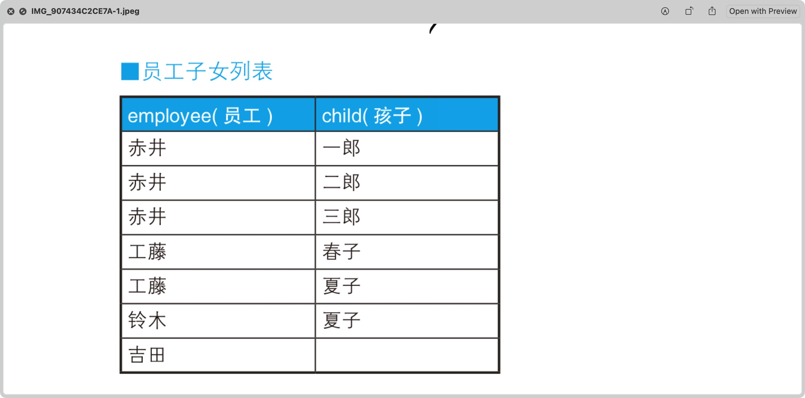
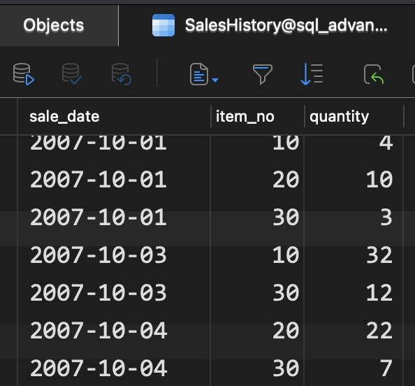
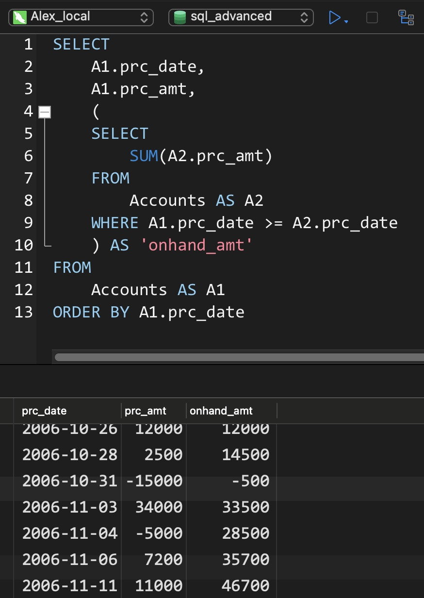
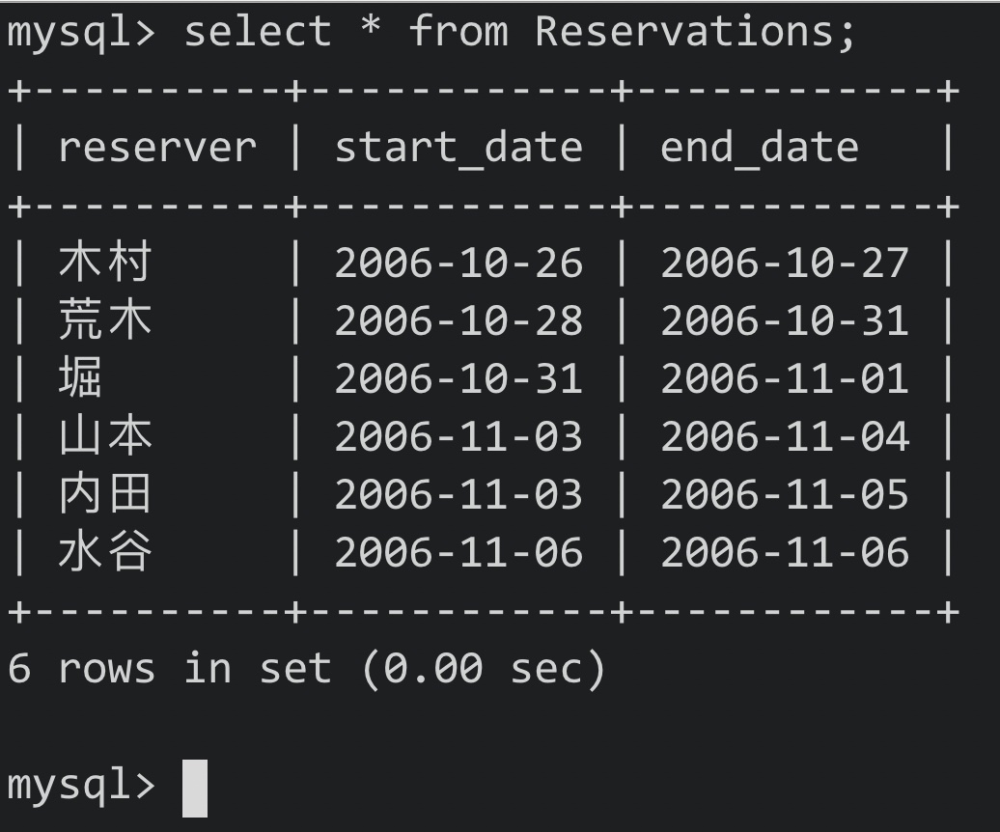
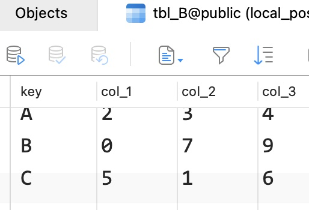
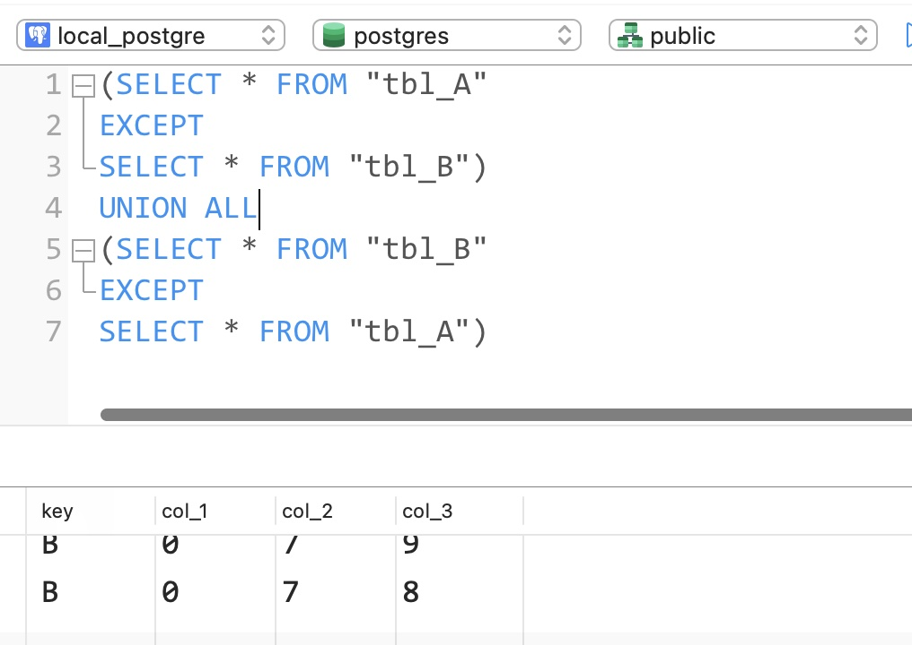
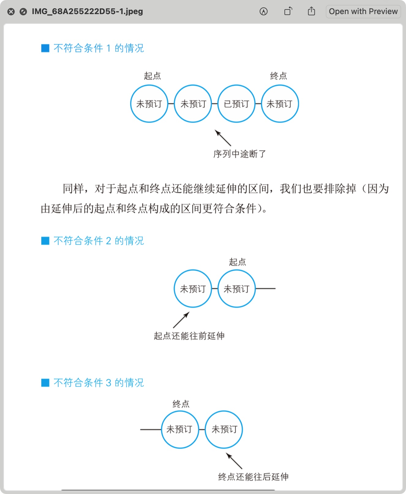

# 第一章


## 1. CASE表达式

- CASE从SQL-92标准开始被引进
- CASE的简略版本: DECODE(Oracle)，IF(MySQL)
- CASE不依赖具体的数据库，所以可移植性好


### 1.1 CASE概述

- CASE表达式分为简单CASE表达式(simple case)和搜索CASE表达式(search case)


- CASE表达式的写法:

```mysql 
-- 简单CASE表达式
CASE sex
	WHEN '1' THEN '男'
	WHEN '2' THEN '女'
ELSE '其他' END

-- 搜索CASE表达式
CASE WHEN sex = '1' THEN '男'
     WHEN sex = '2' THEN '女'
ELSE '其他' END
```


简单CASE能实现的事情比较有限，所以使用搜索CASE


在SQL中，发现WHEN子句为真时，CASE表达式中TRUE/FALSE会中止，**会跳过剩余的WHEN**，因此**应该注意条件的排他性**


- 剩余WHEN子句被忽略的写法:

```mysql
-- 一旦这样写，结果中不会出现"第二"
CASE WHEN col_1 IN ('a', 'b') THEN '第一'
     WHEN col_1 IN ('a') THEN '第二'
ELSE '其他' END
```


注意事项:

1. 统一各分支返回的数据类型

CASE表达式里各个分支返回的数据类型应该一致

2. 不要忘了写END

3. 习惯写ELSE

END是必须的，但ELSE是可选的。不写ELSE时，CASE对应的结果为NULL。但不写出先逻辑错误时不易追查原因，所以最好明确写上ELSE


### 1.2 将已有编号方式转换为新的方式统计


实现:

```mysql 
SELECT
	CASE pref_name
		WHEN '德岛' THEN '四国'
		WHEN '香川' THEN '四国'
		WHEN '爱媛' THEN '四国'
		WHEN '高知' THEN '四国'
		WHEN '福冈' THEN '九州'
		WHEN '佐贺' THEN '九州'
		WHEN '长崎' THEN '九州'
	ELSE '其他' END AS 'district',
	SUM(population)
FROM
	PopTbl
GROUP BY CASE pref_name
					WHEN '德岛' THEN '四国'
					WHEN '香川' THEN '四国'
					WHEN '爱媛' THEN '四国'
					WHEN '高知' THEN '四国'
					WHEN '福冈' THEN '九州'
					WHEN '佐贺' THEN '九州'
					WHEN '长崎' THEN '九州'
			ELSE '其他' END
```


按人口数量等级划分:

```mysql
SELECT
	CASE WHEN population < 100 THEN '01'
       WHEN population >= 100 AND population < 200 THEN '02'
       WHEN population >= 200 AND population < 300 THEN '03'
       WHEN population >= 300 THEN '04'
	ELSE NULL END AS 'pop_class',
	COUNT(*) AS 'cnt'
FROM
	PopTbl
GROUP BY CASE WHEN population < 100 THEN '01'
       WHEN population >= 100 AND population < 200 THEN '02'
       WHEN population >= 200 AND population < 300 THEN '03'
       WHEN population >= 300 THEN '04'
	ELSE NULL END
```

我们也可以使用列的别称，但严格来说，**这种写法违法SQL的规则**

**一般情况下GROUP BY里的内容比SELECT先执行，所以GROUP BY中引用SELECT子句里定义的别称是不被允许的**，在Oracle、DB2、SQL Server等数据库中该写法就会出错


但**部分数据库也支持该写法如: PostgreSQL和MySQL中**，这些数据库中会先对SELECT子句中的列表进行扫描，并对列进行计算


### 1.3 一条SQL语句进行不同条件的统计


例子:


通常的写法:

```mysql
-- 男性
SELECT
	pref_name,
	SUM(population)
FROM
	PopTbl2
WHERE sex = '1'
GROUP BY pref_name

-- 女性
SELECT
	pref_name,
	SUM(population)
FROM
	PopTbl2
WHERE sex = '2'
GROUP BY pref_name
```

- 这样写出的SQL很长，但用CASE的话，一条简单的SQL就行


```mysql
SELECT
	pref_name,
	SUM(CASE WHEN sex = '1' THEN population ELSE 0 END) AS 'cnt_m',
	SUM(CASE WHEN sex = '2' THEN population ELSE 0 END) AS 'cnt_f'
FROM
	PopTbl2
GROUP BY pref_name
```

- 这里我们使用了聚合函数**将行结构的数据，转换成了列结构的数据**(sex列)


总结:

新手用WHERE子句进行条件分支，高手用SELECT子句进行条件分支


### 1.4 用CHECK约束多个列的条件关系


注意:

- **在MySQL中CHECK约束不会起任何作用**，可以使用触发器、Set、ENUM来代替


示例: 规定女性员工的工资必须在20万以下

```mysql
CONSTRAINT check_salary CHECK
						(CASE WHEN sex = '2'
                 THEN CASE WHEN salary <= 200000
                           THEN 1 ELSE 0 END
                 ELSE 1 END = 1)
```

- 这里使用的逻辑表达式为蕴含式(conditional)，记为P -> Q
- 逻辑与(logical product)也是一种逻辑表达式，但其与蕴含式不同，逻辑与记为

$$
P\bigwedge Q
$$


- 用逻辑与改写后的CHECK约束:

```mysql
CONSTRAINT check_salary CHECK (sex = '2' AND salary <= 20000)
```


两种写法造成的约束并不一致:

- 逻辑与要求既为女性，且工资低于20000


- 逻辑与为真: 需要P和Q都为真(女性且工资低于20000)，或者其中一个条件不确定
- 蕴含式为真: 需要P和Q都为真，或者P为假或者P无法判断。即如果不满足为女性则不做限制(ELSE 1 END)


逻辑与和蕴含式的真值表:

(U: Unknown)

|  P   |  Q   | P AND Q |  P   |  Q   | p -> Q |
| :--: | :--: | :-----: | :--: | :--: | :----: |
|  T   |  T   |    T    |  T   |  T   |   T    |
|  T   |  F   |    F    |  T   |  F   |   F    |
|  T   |  U   |    U    |  T   |  U   |   F    |
|  F   |  T   |    F    |  F   |  T   |   T    |
|  F   |  F   |    F    |  F   |  F   |   T    |
|  F   |  U   |    F    |  F   |  U   |   T    |
|  U   |  T   |    U    |  U   |  T   |   T    |
|  U   |  F   |    F    |  U   |  F   |   T    |
|  U   |  U   |    U    |  U   |  U   |   T    |

- 可以说在前一个条件P(性别)为F的时候，蕴含式要比逻辑与更加宽松


### 1.5 在UPDATE中进行条件分支


示例表：


需求: 按照以下条件对表的数据进行更新

1. 对当前工资为30万元以上的员工，降薪10%
2. 对当前工资为25万元以上，但不满28万元的，加薪20%


- 如果直接使用两个UPDATE语句会出错:

```mysql
-- 条件1
UPDATE Salaries SET salary = salary * 0.9 WHERE salary >= 300000

-- 条件2
UPDATE Salaries SET salary = salary * 1.2 WHERE salary >= 250000 AND salary < 280000
```


- 这样的两个UPDATE语句彼此分开执行，不具有原子性(在第二条UPDATE处理前，数据已经被第一条UPDATE语句修改了)，此时发生了类似脏写的一致性问题


利用CASE的正确写法:

```mysql
UPDATE Salaries
	SET salary = CASE WHEN salary >= 300000
										 THEN salary * 0.9
										 WHEN salary >= 250000 AND salary < 280000
										 THEN salary * 1.2
										 ELSE salary END;
```

- 注意：**这里的ELSE一定不能省略**，如果CASE中**没有明确指定ELSE子句的话**，**不满足前面条件的数据就会被更新为NULL**


- 在中间值调换上的应用:

示例表


- 不使用CASE调换主键值a和b

```mysql
-- 设置为一个中间值
UPDATE SomeTable
	SET p_key = 'd'
WHERE p_key = 'a';

-- 将b调换为a
UPDATE SomeTable
 SET p_key = 'a'
WHERE p_key = 'b'

-- 再将d调换为b
UPDATE SomeTable
 SET p_key = 'b'
WHERE p_key = 'd'
```


- 使用CASE则只需要执行一次

```mysql
UPDATE SomeTable
	SET p_key = CASE WHEN p_key ='a'
					          THEN 'b'
					          WHEN p_key = 'b'
					          THEN 'a'
					          ELSE p_key END
	WHERE p_key IN ('a', 'b');
```


**注意：**该条SQL**在MySQL和PostgreSQL中**，会因为中间重复而报错，然而在Oracle、DB2、SQL Server中则能够正常执行


Eg:


// 如果需要这样的调换，说明表的设计有问题，需要重新审视表的设计


### 1.6 表之间的数据匹配

- CASE的一大优势为能够判断表达式

即在CASE表达式中，我们能够使用BETWEEN、LIKE等谓词组合，以及能够嵌套子查询的IN和EXISTS谓词


Eg Tables:


通过这两张表生成一张交叉表，以便了解每个月开设的课程


```mysql
-- IN谓词
SELECT
	course_name,
	CASE WHEN course_id IN
								(SELECT course_id FROM OpenCourses
                WHERE month = 200706) THEN '◯'
				ELSE '✕' END AS '6月',
	CASE WHEN course_id IN
								(SELECT course_id FROM OpenCourses
                WHERE month = 200707) THEN '◯'
				ELSE '✕' END AS '7月',
	CASE WHEN course_id IN
								(SELECT course_id FROM OpenCourses
                WHERE month = 200708) THEN '◯'
				ELSE '✕' END AS '8月')
FROM
	CourseMaster
	
-- EXISTS谓词
SELECT
	CM.course_name,
CASE
		WHEN EXISTS ( SELECT course_id FROM OpenCourses OC WHERE MONTH = 200706 AND OC.course_id = CM.course_id) THEN
		'◯' ELSE '✕' END AS '6月',
CASE
		WHEN EXISTS ( SELECT course_id FROM OpenCourses OC WHERE MONTH = 200707 AND OC.course_id = CM.course_id) THEN
		'◯' ELSE '✕' END AS '7月',
CASE
		WHEN EXISTS ( SELECT course_id FROM OpenCourses OC WHERE MONTH = 200708 AND OC.course_id = CM.course_id) THEN
		'◯' ELSE '✕' END AS '8月'
FROM
	CourseMaster CM
```


- 这样的SQL没有聚合，不需要排序，月份增加时只需要修改SELECT列表，**扩展性好**


### 1.7 在CASE中使用聚合函数

Eg Table


1. 获取只加入了一个社团的学生的社团id
2. 获取加入了多个社团学生的主社团id


常规方法:

- 分两次写，先查询出只加入一个社团的学生对应的社团id

```mysql
SELECT
	std_id,
	MAX(club_id) AS 'main_club'
FROM
	StudentClub
GROUP BY std_id
HAVING COUNT(*) = 1;
```


- 再查询出其余学生的主社团id

```mysql
SELECT
	std_id,
	club_id
FROM
	StudentClub
WHERE main_club_flg = 'Y'
```


使用CASE的方式

```mysql
SELECT
	std_id,
	CASE WHEN COUNT(*) = 1
	  	 THEN MAX(club_id)
	  	 ELSE MAX(CASE WHEN main_club_flg = 'Y'
                     THEN club_id
               			 ELSE NULL END)
	END AS 'main_club'
FROM
	StudentClub
GROUP BY std_id;
```


Eg:


### 小结

1. 在GROUP BY中使用CASE，可以自定义分组的单位
2. 在聚合函数中使用CASE，可以将行结构变为列结构(1.3)
3. 聚合函数也可以嵌套在CASE中使用(1.7)
4. CASE的表达能力更强，且移植性更好(不依赖具体的数据库)

<hr>


## 2. 自连接

- 自连接: 针对同一张表进行的连接称为自连接
- SQL为面向集合语言


### 2.1 可重排列/排列/组合

Eg Table:


组合分为两种: 有顺序的有序对<1, 2>，无顺序的无序对{1, 2}


在有序对中，元素顺序不同也是不同的对: <1, 2> ≠ <2, 1> (P: permutation/排列)

无序对中，元素顺序无关: {1, 2} = {2, 1} (C: combination/组合)


生成交叉连接生成笛卡尔积(直积)，从而获取有序对(顺序不同则算做不同的)

```mysql
SELECT
	P1.name AS 'name_1',
	P2.name AS 'name_2'
FROM
	Products AS P1,
	Products AS P2;
```


- 添加一个条件获取两个列值不同的组合:

```mysql
SELECT
	P1.name AS 'name_1',
	P2.name AS 'name_2'
FROM
	Products AS P1,
	Products AS P2
WHERE P1.name != P2.name;
```

Eg:


- 在SQL中，只要被赋予了不同的别名，即使是相同的表也应该看作不同的表


- 再处理只是调换了顺序的对，获取对应的排列:

```mysql
SELECT
	P1.name AS 'name_1',
	P2.name AS 'name_2'
FROM
	Products AS P1,
	Products AS P2
WHERE P1.name > P2.name;
```


- 此时只与"字符顺序比自己靠前"的商品进行匹配
- 同样获取三个元素的排列:

```mysql
SELECT
	P1.name AS 'name_1',
	P2.name AS 'name_2',
	P3.name AS 'name_3'
FROM
	Products AS P1,
	Products AS P2,
	Products AS P3
WHERE P1.name > P2.name
AND P2.name > P3.name
```


- 使用**除了"="外的比较运算符**进行的连接称为"**非等值连接**"
- 这里和自连接结合，因此称为"非等值自连接"，**这是获取组合的惯用套路**


### 2.2 删除重复行

Eg Table:


- 如果像这样所有的列都有重复的话，则需要使用数据库自带的行id(MySQL里的DB_ROW_ID)

```sql
-- 以Oracle中的rowid为例
DELETE FROM product P1
	WHERE rowid < (SELECT
                	MAX(P2.rowid)
                 FROM
                	product P2
                 WHERE P1.name = P2.name
                 AND P1.price = P2.price)
```

**注意:** 只有Oracle(rowid)和PostgreSQL(oid)提供了可用的行id；在PostgreSQL中需要在建表时指定WITH OID才能使用；其余数据库则只能自行创建主键列或者存入临时表


- 无论是表还是视图，本质上都是集合——**集合是SQL唯一能够处理的数据结构**


### 2.3 查找局部不一致的列

Eg Table:


其中前田夫妇中有一个人的地址错误，但family_id相同

```mysql
SELECT
	DISTINCT A1.name,
	A1.address
FROM
	Addresses A1,
	Addresses A2
WHERE A1.family_id = A2.family_id
AND A1.address != A2.address;
```


​	Eg Table:


```mysql
-- 用于查找价格相等但商品名称不同的记录
SELECT
	DISTINCT P1.name,
	P1.price
FROM
	Products P1,
	Products P2
WHERE P1.price = P2.price
AND P1.name != P2.name;
```


- 因为表中有多条价格相同的记录，所以查询结果需要去重

- 改用相关/关联子查询则不需要去重了:

```mysql
SELECT
	t1.name,
	t1.price
FROM
	Products AS t1
WHERE EXISTS (
  SELECT
    t2.name,
    t2.price
  FROM
    Products AS t2
  WHERE t1.`name` != t2.`name`
  AND t1.price = t2.price
)
```


### 2.4 排序

Eg Table:


将商品按照价格排序，如果价格相同，给出跳过和不跳过之后次序的排序位次

```mysql
-- MySQL8.0才支持
SELECT
	name,
	price,
	RANK() OVER(
    ORDER BY price DESC
  ) AS rank_1,
  DENSE_RANK() OVER(
    ORDER BY price DESC
  ) AS rank_2
FROM
	Products
```


不依赖具体数据库进行非分组排序的做法:

```mysql
-- 如果出现相同次序，则跳过之后的次序
SELECT
	P1.name,
	P1.price,
	(
  SELECT
  	COUNT(P2.price)
  FROM
  	Products P2
  WHERE P2.price > P1.price) + 1 AS rank_1
  )
FROM
	Products P1
ORDER BY rank_1;
```


Res:


- 如果加上DISTINCT去重，那么遇到相同位次时就不会跳过之后的位次(相当于DENSE_RANK)

```mysql
SELECT
	P1.name,
	P1.price,
	(SELECT
  	COUNT(P2.price)
  FROM
  	Products P2
  WHERE P2.price > P1.price) + 1 AS rank_1,
	(SELECT
  	COUNT(DISTINCT P3.price)
  FROM
  	Products P3
  WHERE P3.price > P1.price) + 1 AS rank_2
FROM
	Products P1
ORDER BY rank_1, rank_2
```


- 自连接的写法

```mysql
SELECT
	P1.name,
	MAX(P1.price) AS price,
	COUNT(P2.name) + 1 AS rank_1
FROM
	Products P1
LEFT JOIN Products P2 ON P1.price < P2.price
GROUP BY P1.name
ORDER BY rank_1
```


- 去掉聚合查看包含关系

```mysql
SELECT
	P1.name,
	P2.name
FROM
	Products P1
LEFT JOIN Products P2 ON P1.price < P2.price
```


- 一旦改为内连接则会跳过第一名(被WHERE子句的条件排除了)

```mysql
SELECT
	P1.name,
	MAX(P1.price) AS price,
	COUNT(P2.name) + 1 AS rank_1
FROM
	Products P1
INNER JOIN Products P2 ON P1.price < P2.price
GROUP BY P1.name
ORDER BY rank_1
```


### 2.5 小结

- 自连接的性能开销比多表连接要大，用于自连接的列最好是主键或者建立了索引的列


要点

1. 自连接与非等值连接使用
2. 自连接与GROUP BY结合生成递归集合
3. **把表看作行的集合**，用面向集合的方式来思考
4. 自连接开销大，经历在用于连接的列上建立索引


### 2.6 练习:


1-2-1

Table:


查询出对应的组合(combination)

```mysql
SELECT
	t1.name AS 'name_1',
	t2.name AS 'name_2'
FROM
	Products AS t1
INNER JOIN Products AS t2
WHERE t1.name >= t2.name
```


1-2-2

Table:


查询不同地区对应水果的价格和位次


```mysql
-- 不使用窗口函数，使用标量子查询
SELECT
	t1.district,
	t1.name,
	t1.price,
	(
	SELECT
		COUNT(t2.name)
	FROM
		DistrictProducts AS t2
	WHERE t1.district = t2.district
	AND t2.price > t1.price
	) + 1 AS 'rank_1'
FROM
	DistrictProducts AS t1
	
-- 自连接查询
SELECT
	t1.district,
	t1.name,
	MAX(t1.price) AS 'price',
	COUNT(t2.name) + 1 AS 'rank_1'
FROM
	DistrictProducts AS t1
LEFT JOIN DistrictProducts AS t2 ON t1.district = t2.district
AND t2.price > t1.price
GROUP BY t1.district, t1.name
```


1-2-3

Table:


填充其中的ranking列值

```mysql
UPDATE DistrictProducts2 P1
SET ranking = (
	SELECT
		COUNT(P2.price) + 1 
	FROM
		DistrictProducts2 P2 
	WHERE P1.district = P2.district 
	AND P2.price > P1.price
);
```

<hr>


## 3. 三值逻辑和NULL

- 在编程语言中，布尔型一般只有true和false两个值
- 但在SQL中还有第三个值: unknown，这种逻辑体系被称为三值逻辑(three-value logic)
- 因为关系型数据库中引入了NULL，所以不得不同时引进第三个值


### 3.1 理论

- NULL其实有两种:
    - 未知unknown
    - 不适用not applicable/inapplicable


- 未知(unknown):

是指虽然现在不知道，但加上某些条件后就能知道了(不知道戴墨镜的人眼睛是什么颜色的)


- 不适用(inapplicable):

无意义，不管怎么努力都无法知道(冰箱眼睛的颜色)


- 不能使用"= NULL"

像下面这样查找列中值为NULL的行是不行的:

```mysql
SELECT
	*
FROM
	tbl_A
WHERE col_1 = NULL;
```


**注：**对NULL使用比较谓词后得到的结果总是unknown(NULL的一种)，**而查询结果只会包含WHERE子句里判断为true的行，不会包含结果为false和unknown的行**

所以这里无论col_1是否为NULL，比较结果都为unknown


下列式子都会判断为unknown:

```mysql
1 = NULL
2 > NULL
3 < NULL
4 <> NULL
NULL = NULL
```


解释:

- NULL既不是值也不是变量
- NULL**只是一个表示"没有值"的标记**，所以对NULL只用比较谓词本身就是无意义的


- "列的值为NULL"，"NULL值"这样的说法本身就是错误的，因为NULL不是值
- 在SQL里的NULL和其他编程语言的NULL是完全不同的东西
- IS NULL是一个完整的谓词，不能将IS看作谓词，而将NUL看作值(MySQL值为ISNULL)


- unknown、第三个真值

真值unknown和作为NULL的一种的UNKOWN是不同的

```mysql
-- 明确的真值比较
unknown = unknown -> true

-- 相当于NULL = NULL
UNKNOWN = UNKNOWN -> unknown
```

unknown是明确的布尔型真值，而UNKNOWN既不是值也不是变量


三值逻辑的真值表:

|  x   | NOT x |
| :--: | :---: |
|  t   |   f   |
|  u   |   u   |
|  f   |   t   |


| AND  |  t   |  u   |  f   |
| :--: | :--: | :--: | :--: |
|  t   |  t   |  u   |  f   |
|  u   |  u   |  u   |  f   |
|  f   |  f   |  f   |  f   |


|  OR  |  t   |  u   |  f   |
| :--: | :--: | :--: | :--: |
|  t   |  t   |  t   |  t   |
|  u   |  t   |  u   |  u   |
|  f   |  t   |  u   |  f   |


中间涉及到和u的运算是三值逻辑中独有的运算，其余的SQL谓词全部都能够由这三个逻辑运算组合而来，该矩阵可以说是SQL的母体(matrix)


三个真值之间的优先级:

- AND: false > unknown > true
- OR: true > unknown > false

优先级高的会决定计算的结果


### 3.2 实践


#### 1) 比较谓词和NULL(1): 排中律不成立


P: john是20岁，或者不是20岁，二者必居其一

- 这是一个真命题，这样将命题和它的否命题通过'或者'连接而成的命题全都是真命题
- 这个命题在二值逻辑中被称为排中律(Law of Excluded Middle)，即不认可中间状态
- 排中律被认为是古典逻辑学和非古典逻辑学的分界线


Eg Table:


因为约翰的年龄不详，所以无法查询出来，查询步骤如下:

```mysql
-- 1
SELECT
	*
FROM
	Students
WHERE age = NULL
OR age != NULL

-- 2. 对NULL使用谓词后，结果为unknown
SELECT
	*
FROM
	Students
WHERE unknown
OR unknown;

-- 3. unknown OR unknown的结果为unknown
SELECT
	*
FROM
WHERE unknown;
```

- 因为SQL的查询结果里只有判断结果为true的行，想要让约翰出现在结果中，需要添加"第3个条件":

```mysql
SELECT
	*
FORM
	Students
WHERE age = 20
OR age != 20
OR age IS NULL;
```


实际上这个人有年龄，但我们无法从这条表知道

实际上，**关系模型不是用来描述现实世界的模型，而是用于描述人类认知状态的核心的模型，我们有限且不完备的只是也会直接反映在表里**


#### 2) 比较谓词和NULL(2): CASE表达式和NULL

在CASE中将NULL作为条件使用时经常会出现错误

``` mysql
CASE col_1
	WHEN 1 THEN '◯'
	WHEN NULl THEN 'X'
END
```

该表达式一定不会返回X

第二个WHEN子句是col_1 = NULL的缩写形式，**这个式子的真值永远是unknown**

CASE表达式的判断方法和WHERE子句一样，只认可真值为true的条件


正确的写法:

```mysql
CASE WHEN col_1 = 1 THEN '◯'
     WHEN col_1 IS NULL THEN 'X'
END
```


这种错误的原因是将NULL误解为了值


#### 3) NOT IN和NOT EXISTS不是等价的

在对SQL语句优化的时候，常用的技巧是将IN改写为EXISTS，这是等价改写

但将NOT IN改写成NOT EXISTS时，结果则未必


Eg Table:


查询出如何根据这两张表查询"与B班住在东京的学生年龄不同的A班学生"

```mysql
SELECT
	*
FROM
	Class_A
WHERE age NOT IN (
	SELECT
  	age
  FROM
  	Class_B
  WHERE city = '东京'
)
```

该条语句并不能顺利查询出结果:

```mysql
-- 1 子查询获取年龄列表
SELECT
	*
FROM
	Class_A
WHERE age NOT IN (
	22, 23, NULL
)

-- 2 用NOT和IN改写NOT IN
SELECT
	*
FROM
	Class_B
WHERE NOT age IN (22, 23, NULL)

-- 3 用OR等价改写谓词IN
SELECT
	*
FROM
	Class_A
WHERE NOT ((age = 22) OR (age = 23) OR (age == NULL))

-- 4 使用德·摩根定律等价改写
SELECT
	*
FROM
	Class_A
WHERE NOT (age == 22) AND NOT (age == 23) AND NOT (age == NULL)

-- 5 使用!=等价改写NOT和=
SELECT
	*
FROM
	Class_A
WHERE (age != 22) AND (age != 23) AND (age != NULL)

-- 6 对NULL使用!=后结果为unknown
SELECT
	*
FROM
	Class_a
WHERE (age != 22) AND (age != 23) AND unknown

-- 7 如果AND运算里包含unknown，则结果不为true
SELECT
	*
FROM
	Class_a
WHERE false OR unknown
```

- 如果NOT IN子查询中用到的表里被选择的列中存在NULL，则SQL语句整体的查询结果永远为空
- 为了获取正确结果，我们需要使用EXISTS谓词

```mysql
SELECT
	*
FROM
	Class_A A
WHERE NOT EXISTS (
	SELECT
  	*
 FROM
  	Class_B B
 WHERE A.age = B.age
 AND B.city = '东京'
)
```


改写后的处理过程:

```mysql
-- 1 和NULL进行比较运算
SELECT
	*
FROM
	Class_A A
WHERE NOT EXISTS (
	SELECT
  	*
 FROM
  	Class_B B
 WHERE A.age = NULl
 AND B.city = '东京'
)


-- 2 对NULL使用"="后，结果为unknown"
SELECT
	*
FROM
	Class_A A
WHERE NOT EXISTS (
	SELECT
  	*
 FROM
  	Class_B B
 WHERE unknown
 AND B.city = '东京'
)


-- 3 AND中包含unknown，则结果不会为true
SELECT
	*
FROM
	Class_A A
WHERE NOT EXISTS (
	SELECT
  	*
 FROM
  	Class_B B
 WHERE false OR unknown
)


-- 4 子查询没有返回结果，而相反的，NOT EXISTS为true
SELECT
	*
FROM
	Class_A A
WHERE true
```

- EXISTS谓词永远不会返回unknown，EXISTS只会返回true或者false，因此IN和EXISTS可以相互替换，但NOT IN和NOT EXISTS不能互换


#### 4) 限定谓词和NULL

- SQL的限定谓词: ALl/ANY，其中ANY和IN是等价的，主要看一下ALL的注意事项


Eg Table:


使用ALL谓词时，SQL的写法:

```mysql
SELECT
	*
FROM
	Class_A
WHERE age < ALL (
	SELECT
  	age
 	FROM
  	Class_B
 	WHERE city = '东京'
)
```

但该条语句的结果还是空


因为ALL谓词是以AND连接的逻辑表达式的省略写法，分析步骤:

```mysql
-- 1 执行子查询获取年龄列表
SELECT
	*
FROM
	Class_A
WHERE age < ALL (22, 23, NULL)


-- 2 将ALL谓词等价改写为AND
SELECT
	*
FROM
	Class_A
WHERE age < 22 AND age < 23 AND age < NULL


-- 3 对NULL使用 < 后会变为unknown
SELECT
	*
FROM
	Class_A
WHERE age < 22 AND age < 23 AND unknown


-- 4 AND中包含unknown，则结果不会为true
SELECT
	*
FROM
	Class_A
WHERE false OR unknown
```


#### 5) 限定谓词和极值函数不是等价的


用极值函数改写后的SQL:

```mysql
SELECT
	*
FROM
	Class_A
WHERE age < (
	SELECT
  	MIN(age)
 	FROM
  	Class_B
  WHERE city = '东京'
)
```

这种写法可以正确查询出结果，因为极值函数在统计的时候会自动排除掉为NULL的数据

- ALL谓词: 他的年龄比在东京住的所有学生都小
- 极值函数: 他的年龄比在东京住的年龄最小的学生还要小


如果表中存在NULL时，它们是不等价的

如果谓词的输入为空集的情况下(没有住在东京的B班同学):


此时使用ALL的SQL会查询A班的所有学生，而用极值函数查询时一行数据都无法查询出来

**极值函数在输入为空表(空集)时会返回NULL**


使用极值函数的SQL的执行步骤:

```mysql
-- 1 极值函数返回NULL
SELECT
	*
FROM
	Class_A
WHERE age < NULL

-- 2 对NULL使用"<"后结果为unknown
SELECT
	*
FROM
	Class_B
WHERE unknown
```


**比较对象原本就不存在时，需要返回所有行时**，需要**使用ALL谓词或者使用COALESCE函数**将极值函数返回的NULL处理成合适的值


#### 6) 聚合函数和NULL

COUNT以外的聚合函数也会返回NULL

```mysql
SELECT
	*
FROM
	Class_A
WHERE age < (
	SELECT
  	AVG(age)
	FROM
  	Class_B
  WHERE city = '东京'
)
```

- 聚合函数和极值函数的这个陷阱是函数本身带来的，仅靠为列加上NOT NULL约束是无法从根本上消除的，所以需要在编写时注意


### 小结

1. NULL不是值
2. 不能对NULL使用谓词
3. 对NULL使用谓词后的结果都是unknown
4. unknown参与到逻辑运算后，SQL的运行会和预想的不一样
5. 按步骤追踪SQL的执行过程可以应对4中的情况


## 4. HAVING子句的力量


### 4.1 寻找缺失的编号

Eg Table:


- 查询该表是否存在数据缺失的

如果使用面向过程的语言进行处理:

1. 对“连续编号”列按升序/降序排序
2. 循环比较每一行和下一行的编号


- 为了操作记录，我们需要对记录排序，**但SQL表/集合是无序的**
- **且SQL没有排序的运算符**(**ORDER BY不是SQL的运算符，它是光标定义的一部分**)
- SQL会**将多条记录作为一个集合来处理**


解题SQL:

```mysql
SELECT
	'存在缺失的编号' AS 'gap'
FROM
	SeqTbl
HAVING COUNT(*) != MAX(seq);
```

- 其中COUNT(*)计算了表中的记录行数，MAX(seq)为其中的最大编号，两者不等则说明缺失
- 这里没有使用GROUP BY，在以前的SQL标准中，HAVING子句必须和GROUP BY一起使用，但**以现在的SQL标准来说，HAVING可以单独使用了**
- 但**HAVING单独使用时不能在SELECT列表里引用原表里的列了，要么使用常量，要么使用聚合函数**


- 接下来查询缺失编号的最小值

```mysql
SELECT
	MIN(t1.seq + 1) AS 'gap'
FROM
	SeqTbl AS t1
WHERE NOT EXISTS (
	SELECT
		t2.seq
	FROM
		SeqTbl AS t2
	WHERE (t1.seq + 1) = t2.seq
	)
```

- 其检查了比每个编号大1的编号是否存在于表中，选取其中最小的一个即可
- 如果表中包含NULL，且该SQL改为IN的话，该表的查询结果就为空了


### 4.2 HAVING子查询(求众数)

Eg Table:


- 以平均收入来评估的话很容易受到离群值的影响，所以这里需要使用众数


- 统计出所有收入对应的人数
- 找出其中人数最多的即可

解答SQL:

```mysql
SELECT
	income,
	COUNT(*) AS 'cnt'
FROM
	Graduates
GROUP BY income
HAVING cnt >= ALL (
	SELECT
		COUNT(*)
	FROM
		Graduates
	GROUP BY income
	)
```


- 又因为ALL谓词在遇到NULL或者空集时会出现问题，所以这里可以用极值函数来代替:

```mysql
SELECT
	income,
	COUNT(*) AS 'cnt'
FROM
	Graduates
GROUP BY income
HAVING cnt >= (
	SELECT
		MAX(cnt)
	FROM (
		SELECT
			COUNT(*) AS 'cnt'
		FROM
			Graduates
		GROUP BY income
	) TMP
)
```


### 4.3 HAVING自连接(求中位数)

- 思路: 将集合按照大小分为上半部分和下半部分两个子集，同时让这两个子集共同拥有集合正中间的元素，那么共同部分的元素的平均值就是中位数
- 如果元素个数为奇数，那么不需要求平均值，计算平均值可以使得SQL更加通用


参照4.2中的示例表，求中位数

Eg Table:


SQL:

```mysql
-- 在HAVING子句中使用非等值自连接
SELECT
	AVG(DISTINCT income)
FROM
	(
	SELECT
		T1.income
	FROM
		Graduates T1,
		Graduates T2
	GROUP BY T1.income
	HAVING SUM(CASE WHEN T2.income >= T1.income THEN 1 ELSE 0 END) >= COUNT(*) / 2
	AND SUM(CASE WHEN T2.income <= T1.income THEN 1 ELSE 0 END) >= COUNT(*) / 2
	) TMP;
```


解析:

- COUNT(*)表示统计行数，除以2表示一般，而HAVING子句的第一个SUM用来统计前面一半，后一个SUM统计后面一半


### 4.4 查询不包含NULL的集合

COUNT函数有两种使用方法:

- COUNT(*): 可以统计NULL，**其统计的一定是所有行的数目，性能较好**
- COUNT(列名): 统计时会排除掉NULL，其统计的不一定是所有行的数目(含NULL时候)


Eg Table:


SQL:


Eg Table:


- 查询出那些学院的学生全部都提交了报告(没有NULL)
- 这里不能简单的使用WHERE ISNULL(sbmt_date)


SQL1:

```mysql
SELECT
	dpt
FROM
	Students
GROUP BY dpt
HAVING COUNT(*) = COUNT(sbmt_date)
```

- 利用COUNT(*)和COUNT(字段)的区别，查询出提交日期不为NULL的学院


SQL2:

```mysql
SELECT
	dpt
FROM
	Students
GROUP BY dpt
HAVING COUNT(*) = SUM(CASE WHEN NOT ISNULL(sbmt_date) THEN 1 ELSE 0 END)
```

- 使用CASE可以使得SQL更加通用
- CASE在这里的作用相当于进行判断的函数，用来判断各个元素是否满足了各种条件的集合，这样的函数称为特征函数(characteristic function)，从定义了集合的角度来将其称为定义函数
- HAVING子句用来研究集合性质


### 4.5 关系除法运算进行购物篮分析

Eg Table:


问题: 查询出囊括了Items中所有商品的店铺(该问题是**数据挖掘中的“购物篮分析”**)


分析:

- 像表ShopItems这种一个实体的信息分散在多个行的情况时，仅仅通过WHERE子句结合OR或者IN是无法得到的，因为**WHERE指定的条件只能针对表里的某一行**
- 针对多行数据设定查询条件:

```mysql
SELECT
	SI.shop
FROM
	ShopItems SI,
	Items I
WHERE SI.item = I.item
GROUP BY SI.shop
HAVING COUNT(SI.shop) = (SELECT COUNT(item) FROM Items)
```


解析:

- 先统计出Items表中商品的数量
- 再统计出每个店铺与Items表连接后，商品的数量
- 对比两个数量，留下一致的即可


**注意：**这里不能将HAVING改为:

```mysql
HAVING COUNT(SI.item) = COUNT(I.item)
```


因为后面的COUNT会受到之前内连接的影响，此时COUNT(I.item)已经不再代表Items表中商品的数量了，而是连接后剩余的商品数量，此时会查询出所有的商店


问题: 再排除掉仙台店，因为其多了一个窗帘

这类问题称为精确关系除法(exact relational division)，即只选择没有剩余商品的店铺(前一个问题称为“带余除法(division with a remainder)”)，此时需要外连接

```mysql
SELECT
	SI.shop
FROM
	ShopItems SI
LEFT JOIN Items I ON SI.item = I.item
GROUP BY SI.shop
HAVING COUNT(SI.item) = (SELECT COUNT(item) FROM Items)
AND COUNT(I.item) = (SELECT COUNT(item) FROM Items)
```


外连接的结果:


解析:

- 此时COUNT(I.item)的结果为外连接后的结果，**如果不等于(SELECT COUNT(item) FROM Items)，则说明该店铺有多余的商品**


### 4.6 小结

1. 表不是文件，记录没有顺序，SQL不进行排序
2. SQL不是面向过程语言，么有循环、分支、赋值操作(自定义函数和存储过程除外)
3. SQL通过不断生成子集来获取目标集合
4. 通常通过GROUP BY生成子集
5. **WHERE用来调查集合元素的性质，而HAVING用来调查集合本身的性质**

<hr>


### 练习

- 1-4-1

Table:


判断该表是否存在缺失的编号

我的解法:

```mysql
SELECT
	CASE WHEN col_num != max_row_num
	THEN '存在缺失的编号'
	WHEN col_num = max_row_num
	THEN '不存在缺失的编号'
	ELSE NULL END AS 'gap'
FROM (
	SELECT
		COUNT(*) AS 'col_num',
		MAX(seq) AS 'max_row_num'
	FROM
		SeqTbl
		) AS temp
```


更好的解法:

```mysql
SELECT
	CASE WHEN COUNT(*) != MAX(seq)
	THEN '存在缺失的编号'
	WHEN COUNT(*) = MAX(seq)
	THEN '不存在缺失的编号'
	ELSE NULL END AS 'gap'
FROM
	SeqTbl
```

<hr>


- 1-4-2

Table:


求出全体学生在9月份就全部提交了报告的学院


我的解法:

```mysql
SELECT
	dpt
FROM
	Students
GROUP BY dpt
HAVING COUNT(*) = COUNT(sbmt_date)
AND COUNT(*) = SUM(CASE WHEN MONTH(sbmt_date) = 9 THEN 1 ELSE 0  END)
```


更好的解法:

```mysql
SELECT
	dpt
FROM
	Students
GROUP BY dpt
HAVING COUNT(*) = SUM(CASE WHEN MONTH(sbmt_date) = 9 THEN 1 ELSE 0  END)
```

<hr>


- 1-4-3

Table:


查询出每个店铺现有Items表中的种类数和不足的种类数


我的解法(同答案):

```mysql
SELECT
	t2.shop,
	COUNT(t1.item) AS 'my_item_cnt',
	(SELECT COUNT(*) FROM Items) - COUNT(t1.item) AS 'diff_cnt'
FROM
	Items AS t1
INNER JOIN ShopItems AS t2 ON t1.item = t2.item
GROUP BY t2.shop
```

<hr>


## 5. 外连接

- SQL本身是用来生成报表的，所以其终究只是用来查询数据的，但现在的SQL还要求能够进行格式转换
- 本节将学习使用外连接进行格式转换


### 5.1 行列转换:制作交叉表

Eg Table:


- 将该表改为交叉表:


- 这里将员工姓名作为主表进行外连接即可(驱动表)

Eg:

```mysql
SELECT
	C0.name,
	CASE WHEN NOT ISNULL(C1.name) THEN '◯' ELSE NULL END AS 'SQL入门',
	CASE WHEN NOT ISNULL(C2.name) THEN '◯' ELSE NULL END AS 'UNIX入门',
	CASE WHEN NOT ISNULL(C3.name) THEN '◯' ELSE NULL END AS 'Java 中级'
FROM (
		SELECT
		DISTINCT `name`
		FROM
		`Courses`
	) AS C0
LEFT JOIN (
	SELECT
		NAME
		FROM
		Courses
		WHERE course = 'SQL入门'
	) AS C1 ON C0.name = C1.name
LEFT JOIN (
	SELECT
			NAME
		FROM
			Courses
		WHERE course = 'UNIX入门'
	) AS C2 ON C0.name = C1.name
LEFT JOIN (
	SELECT
		NAME
	FROM
		Courses
	WHERE course = 'Java 中级'
	) AS C3 ON C0.name = C3.name
```


这里生成了四个子集:


其中C0起到了员工主表的作用，C1～C3是每门课程对应的学习者的集合

如果原表的列数增加了，则再增加外连接即可，但这样写出的SQL会很臃肿，性能会恶化


- 这里我们可以将外连接用标量子查询代替:

```mysql
SELECT
	C0.name,
	(SELECT 
			'◯'
		FROM
			`Courses` AS C1
		WHERE course = 'SQL入门'
		AND C1.name = C0.name) AS 'SQL入门',
		(SELECT
			'◯'
		FROM
			Courses AS C2
		WHERE course = 'UNIX基础'
		AND C2.name = C0.name) AS 'UNIX基础',
		(SELECT
			'◯'
		FROM
			Courses AS C3
		WHERE course = 'Java 中级'
		AND C3.name = C0.name) AS 'Java 中级'
FROM (SELECT DISTINCT NAME FROM courses) AS C0
```


- 这样我们在增加/删除课程的时候，只需要增加/删除SELECT子句即可
- 这对需要动态生成SQL的系统是很有好处的，但其性能很差
- 我们可以嵌套使用CASE表达式

```mysql
SELECT
	name,
	CASE WHEN SUM(CASE WHEN course = 'SQL入门' THEN 1 ELSE NULL END) = 1 THEN '◯' ELSE NULL END AS 'SQL入门',
	CASE WHEN SUM(CASE WHEN course = 'UNIX基础' THEN 1 ELSE NULL END) = 1 THEN '◯' ELSE NULL END AS 'UNIX基础',
	CASE WHEN SUM(CASE WHEN course = 'Java 中级' THEN 1 ELSE NULL END) = 1 THEN '◯' ELSE NULL END AS 'Java 中级'
FROM
	Courses
GROUP BY name;
```

- 这里我们先将SUM的结果处理为1或者NULL，之后在外层的CASE中将1转换为◯


- 如果不使用聚合，那么返回结果就是course的行数
- SELECT子句中，聚合函数的结果其实是标量值，可以像常量/普通列那样使用

<hr>


### 5.2 行列转换(2): 汇总重复项于一列

- 再来试一试列转行


Eg Table:


- 将该表转换为员工 + 孩子的形式

Eg:

```mysql
SELECT
	employee,
	child_1 AS 'child'
FROM
	Personnel
UNION ALL
SELECT
	employee,
	child_2 AS 'child'
FROM
	Personnel
UNION ALl
SELECT
	employee,
	child_3 AS 'child'
FROM
	Personnel
```


- 这种解法把没有孩子的吉田查询出了三次，所以最好把child为NULL排除
- 但出于需求，我们还需要将吉田保留一行

Eg:



- 想要解决这个问题，我们不能简单的将child为NULL的排除


其中一个解法:

- 首先创建一个视图

Eg:


- 之后将员工表作为驱动表进行外连接:

```mysql
SELECT
	EMP.employee,
	CHILDREN.child
FROM
	Personnel AS EMP
LEFT JOIN Children ON CHILDREN.child IN (EMP.child_1, EMP.child_2, EMP.child_3)
```


- 当对应的名字存在于视图中时，返回名字，否则返回NULL

<hr>


### 5.3 交叉表内制作嵌套式表侧栏

Eg Table:


根据该表生成交叉表"包含嵌套式表侧栏的统计表"


- 生成表侧栏需要使用外连接，侧栏是年龄层级和性别，所以要将TblAge和TblSex作为驱动表进行外连接
- 但如果直接进行外连接的话其实会出问题

Eg:

``` mysql
SELECT
	MASTER1.age_class AS 'age_class',
	MASTER2.sex_cd AS 'sex_cd',
	DATA.pop_tohoku AS 'pop_tohoku',
	DATA.pop_kanto AS 'pop_kanto'
FROM (
	SELECT
		age_class,
		sex_cd,
		SUM(CASE WHEN pref_name IN ('青森', '秋田')
		THEN population ELSE NULL END) AS 'pop_tohoku',
		SUM(CASE WHEN pref_name IN ('东京', '千叶')
		THEN population ELSE NULL END) AS 'pop_kanto'
	FROM
		TblPop
	GROUP BY age_class, sex_cd
	) AS DATA
RIGHT JOIN TblAge AS MASTER1 ON DATA.age_class = MASTER1.age_class
RIGHT JOIN TblSex AS MASTER2 ON DATA.sex_cd = MASTER2.sex_cd
```


- 其实在与TblAge表进行第一次外连接的时候还有age_class = 2的记录

Eg:


- 但TblPop中没有age_class为2的记录对应的sex_cd，所以其对应的sex_cd全为NULL
- 所以在与TblAge表进行连接的时候，条件DATA.sex_cd = MASTER2.sex_cd就变为了:

```mysql
NULL = MASTER2.sex_cd
```

最终没有任何age_class为2的记录被返回(这些记录与TbleAge连接的结果都不为真)


正确的写法:

```mysql
SELECT
	MASTER.age_class AS 'age_class',
	MASTER.sex_cd AS 'sex.cd',
	DATA.pop_tohoku AS 'pop_tohoku',
	DATA.pop_kanto AS 'pop_kanto'
FROM (
	SELECT
		age_class,
		sex_cd
	FROM
		TblAge
	INNER JOIN TblSex
	) AS MASTER
LEFT JOIN (
	SELECT
		age_class,
		sex_cd,
		SUM( CASE WHEN pref_name IN ( '青森', '秋田' ) THEN population ELSE NULL END ) AS 'pop_tohoku',
		SUM( CASE WHEN pref_name IN ( '东京', '千叶' ) THEN population ELSE NULL END ) AS 'pop_kanto' 
	FROM
		TblPop 
	GROUP BY age_class, sex_cd
	) AS DATA ON MASTER.age_class = DATA.age_class AND MASTER.sex_cd = DATA.sex_cd
```


- 这里的关键是将TblAge和TblSex进行交叉连接形成笛卡尔积，从而获取表侧栏


交叉连接时，使用CROSS JOIN和FROM TblAge, TblSex的效果是一样的，后者更通用一些

<hr>


### 5.4 作为乘法运算的连接

- 在SQL里，交叉连接相当于乘法运算

Eg Tables:




- 以商品为单位汇总各自的销量(轻松秒杀，没意思)

Eg:


<hr>


### 5.5 全外连接

标准SQL中定义了外连接的三种类型:

- LEFT OUTER JOIN
- RIGHT OUTER JOIN
- FULL OUTER JOIN


三种中，全外连接使用很少，这里结合实例进行理解:

Eg Table:


两表中，田中和铃木都同时属于这两张表，而伊集院和西园寺则只属于其中一张表

全外连接能够从两张内容不一致的表中没有遗漏地获取所有信息，类似将两张表都作为驱动表的连接

Eg:

```mysql
SELECT COALESCE(A.id, B.id) AS id,
       A.name AS A_name,
       B.name AS B_name
FROM Class_A  A  FULL OUTER JOIN Class_B  B
  ON A.id = B.id;
```


**注意：MySQL暂时还不支持全外连接，可以使用左右连接加上UNION进行模拟**

Eg:

```mysql
SELECT
	A.name,
	B.name
FROM
	Class_A AS A
LEFT JOIN Class_B AS B ON A.id = B.id
UNION
SELECT
	A.name,
	B.name
FROM
	Class_A AS A
RIGHT JOIN Class_B AS B ON A.id = B.id
```


从集合运算的角度来看，内连接相当于求集合的积(intersect，交集)，全外连接相当于求集合的和(UNION，并集)


Eg:


<hr>


### 5.6 外连接集合运算

- SQL是以集合论为基础的，但在之前连基础的集合运算都不支持，INTERSECT和EXCEPT都是SQL-92才加入的
- 各个DBMS提供商在集合上的实现也各有不同，所以需要了解一下集合运算符的替代方案


#### 1) 外连接求差集: A - B

伊集院只存在于A班，因此我们可以通过判断外连接后的字段是否为NULL来得到差集

Eg:


<hr>


#### 2) 外连接求差集: B - A

- 西园寺只存在于B班，因此我们可以通过判断外连接后的字段是否为NULL来得到差集

Eg:


注：使用外连接解决这种问题不符合外连接的设计目的，但对于不支持差值运算的数据库来说，其可以作为NOT IN 和 NOT EXISTS之外的另一种解法了

**而且其可能是差值运算中效率最高的**

<hr>


#### 3) 全外连接求异或集

SQL中没有定义求异或集的运算符，如果使用集合运算符，则有两种方法:

- (A UNION B) EXCEPT (A INTERSECT B)
- (A INTERSECT B) EXCEPT (B INTERSECT A)

Eg:

```mysql
SELECT COALESCE(A.id, B.id) AS id,
       COALESCE(A.name , B.name ) AS name
  FROM Class_A  A  FULL OUTER JOIN Class_B  B
    ON A.id = B.id
 WHERE A.name IS NULL 
    OR B.name IS NULL;
```


不支持全外连接的数据库(MySQL)的写法:

```mysql
SELECT
	id,
	COALESCE(A_name, B_name)
FROM (
	SELECT
		A.id,
		A.name AS 'A_name',
		B.name AS 'B_name'
	FROM
		Class_A AS A
	LEFT JOIN Class_B AS B ON A.id = B.id
	UNION
	SELECT
		B.id,
		A.name,
		B.name
	FROM
		Class_A AS A
	RIGHT JOIN Class_B AS B ON A.id = B.id
	) AS temp
WHERE ISNULL(A_name)
OR ISNULL(B_name)
```

<hr>


### 5.7 小结

1. SQL不是用来生成报表的语言，一般不建议用SQL来做格式转换
2. 如果一定要格式转换的话，则需要考虑外连接或者CASE表达式
3. 需要生成嵌套式表侧栏时，最好先获取主表的笛卡尔积
4. 外连接和集合运算很像，使用外连接可以实现各种集合运算

<hr>


### 练习


1-5-1:


根据以上三表生成如下带有嵌套式表侧栏的统计结果，尽量减少临时视图:


我的答案(同答案):

```mysql
SELECT
	t1.age_class,
	t1.sex_cd,
	SUM(CASE WHEN t2.pref_name IN ('青森', '秋田') 
	THEN t2.population ELSE NULL END) AS '东北',
	SUM(CASE WHEN t2.pref_name IN ('东京', '千叶') 
	THEN t2.population ELSE NULL END) AS '关东'
FROM (
	SELECT
		age_class,
		sex_cd
	FROM
		TblAge,
		TblSex
	) AS t1
LEFT JOIN TblPop AS t2 ON t1.age_class = t2.age_class AND t1.sex_cd = t2.sex_cd
GROUP BY t1.age_class, t1.sex_cd
```


<hr>


1-5-2


根据上面一张表和对应的孩子视图，查询出每个职工对应的孩子数量


我的解法(同答案):

```mysql
SELECT
	t1.employee,
	COUNT(t2.child) AS 'child_cnt'
FROM
	Personnel AS t1
LEFT JOIN children AS t2 ON t2.child IN (t1.child_1, t1.child_2, t1.child_3)
GROUP BY t1.employee
```


<hr>


1-5-3


给你两张班级学生表，要求你将B的信息合并到A里去: 如果id相同则用B班的姓名进行覆盖，如果不同则直接插入


我的答案:

- 注意，MySQL不支持Merge语法，但可以使用INSERT ... ON DUPLICATE KEY UPDATE...

```mysql
INSERT INTO Class_A (id, name) 
SELECT * FROM Class_B
ON DUPLICATE KEY UPDATE name = VALUES(name)
```


官方文档:


答案:

```sql
MERGE INTO Class_A A
    USING (SELECT *
             FROM Class_B ) B
      ON (A.id = B.id)
    WHEN MATCHED THEN
        UPDATE SET A.name = B.name
    WHEN NOT MATCHED THEN
        INSERT (id, name) VALUES (B.id, B.name);
```

<hr>


## 6. 关联子查询比较行与行

在进行行与行之间的比较时，除了窗口函数外，主要使用的是关联子查询，特别是结合连接的关联子查询


### 1) 增长、减少、维持现状

需要行间数据的代表性业务: 基于时间序列表进行时间序列分析

Eg Table:


要求:

根据该表数据，输出与上一年相比营业额的变化情况


1. 先考虑求出相比上一年不变的情况


思路:

- 在Sales的基础上，再加上一个存储了上一年数据的集合

```mysql
SELECT
	year,
	sale
FROM
	Sales AS S1
WHERE sale = (
	SELECT
		sale
	FROM
		Sales AS S2
	WHERE S2.year + 1 = S1.year
)
```

其中S2.year代表开始的年份，S1.year代表之后的一个年份

示意图:


Eg:


- 关联子查询和自连接很多时候是等价的，所以我们可以直接用自连接进行替换:

```mysql
SELECT
	S1.year,
	S1.sale
FROM
	Sales AS S1,
	Sales AS S2
WHERE S1.sale = S2.sale
AND S1.year - S2.year = 1
```

Eg:


<hr>


### 2) 列表展示与上一年的比较结果

```mysql
SELECT
	S1.year,
	S1.sale,
	CASE WHEN sale = (SELECT sale FROM Sales AS S2 WHERE S1.year - S2.year = 1) THEN '→'
	WHEN sale > (SELECT sale FROM Sales AS S2 WHERE S1.year - S2.year = 1) THEN '↑'
	WHEN sale < (SELECT sale FROM Sales AS S2 WHERE S1.year - S2.year = 1) THEN '↓'
	ELSE '-' END AS 'var'
FROM
	Sales AS S1
ORDER BY S1.year
```

Eg:


- 这里将前面关联子查询的逻辑放在了SELECT列表里


- 用自连接改写:

```mysql
SELECT
	S1.year,
	S1.sale,
	CASE WHEN S1.sale = S2.sale THEN '→'
	WHEN S1.sale > S2.sale THEN '↑'
	WHEN S1.sale < S2.sale THEN '↓'
	ELSE '-' END AS 'var'
FROM
	Sales AS S1,
	Sales AS S2
WHERE S1.year - S2.year = 1
ORDER BY S1.year
```

Eg:


由于没有1990年之前的数据，所以自连接将其排除了


尝试将时间轴改为横着的方式展示:


<hr>


### 3) 时间轴有间断时

Eg Table:


对于这种表，之前年份 - 1的条件就不能使用了，我们需要让某年的数据与最临近的年份比较，该最临近年份需要满足如下两个条件:

- 与基准年份相比是过去的日期
- 满足上个的条件下，距基准年份最近


注意:这里是查询相比前一年营业额不变的数据

SQL:

```mysql
SELECT
	year,
	sale
FROM
	Sales2 AS S1
WHERE sale = (
	SELECT
		sale
	FROM
		Sales2 AS S2
	WHERE S2.year = (
		SELECT
			MAX(year)
		FROM
			Sales2 AS S3
		WHERE S3.year < S1.year
	)
)
ORDER BY year
```


使用自连接改写:

```mysql
SELECT
	S1.year,
	S1.sale
FROM
	Sales2 AS S1,
	Sales2 AS S2
WHERE S1.sale = S2.sale
AND S1.year = (
	SELECT
  	MAX(year)
 	FROM
  	Sales2 AS S3
  WHERE S3.year < S1.year
)
ORDER BY S1.year
```


Eg:


- 利用该方法查询出每一年与之最临近年份对应的营业额变化

```mysql
SELECT
	S2.year AS 'pre_year',
	S1.year AS 'now_year',
	S2.sale AS 'pre_sale',
	S1.sale AS 'now_year',
	S1.sale - S2.sale AS 'diff'
FROM
	Sales2 AS S1,
	Sales2 AS S2
WHERE S2.year = (
	SELECT
		MAX(year)
	FROM
		Sales2 AS S3
	WHERE S3.year < S1.year
)
```


Eg:


- 上述写法中，1990年对应的变化在内连接中被排除了，想要让其出现在结果集中的话，可该为外自连接:

```mysql
SELECT
	S2.year AS 'pre_year',
	S1.year AS 'now_year',
	S2.sale AS 'pre_sale',
	S1.sale AS 'now_year',
	S1.sale - S2.sale AS 'diff'
FROM
	Sales2 AS S1
LEFT JOIN Sales2 AS S2 ON S2.year = (
	SELECT
		MAX(year)
	FROM
		Sales2 AS S3
	WHERE S3.year < S1.year
)
ORDER BY pre_year
```


Eg:


<hr>


### 4) 移动累计值和移动平均值

Eg Table:


要求：求出按照时间记录的累计值


窗口函数:

```mysql
SELECT
	prc_date,
	prc_amt,
	SUM(prc_amt) OVER(
    ORDER BY prc_date
  ) AS onhand_amt
FROM
	Accounts
```


使用标准SQL-92:

```mysql
SELECT
	A1.prc_date,
	A1.prc_amt,
	(
	SELECT
		SUM(A2.prc_amt)
	FROM
		Accounts AS A2
	WHERE A1.prc_date >= A2.prc_date
	) AS 'onhand_amt'
FROM
	Accounts AS A1
ORDER BY A1.prc_date
```


Eg:



上述方法和第二节中的位次计算属于同种类型，只是将COUNT替换为了SUM


修改:

- 以3为单位求累计值(每次计算3行以内的数据)
- 在上述查询中添加条件：A2与A1日期之间的记录在3行以内


窗口函数:

```mysql
SELECT
	prc_date,
	prc_amt,
	SUM(prc_amt) OVER(
  	ORDER BY prc_date
    ROWS 2 PRECEDING
  ) AS onhand_amt
FROM
	Accounts
```


标量子查询:

```mysql
SELECT
	A1.prc_date,
	A1.prc_amt,
	(
	SELECT
		SUM(prc_amt)
	FROM
		Accounts AS A2
	WHERE A1.prc_date >= A2.prc_date
	AND (
		SELECT
			COUNT(*)
		FROM
			Accounts AS A3
		WHERE A3.prc_date BETWEEN A2.prc_date AND A1.prc_date) <= 3
	) AS 'mvg_sum'
FROM
	Accounts AS A1
ORDER BY A1.prc_date
```


Eg:


查看聚合后的结果:


- 同样的，我们也可以直接将SUM改为AVG从而得以求出AVG函数

<hr>


### 5) 重叠的时间区间

Eg Table:




要求：查出住宿日期重叠的客人


- 该题目中有三种日期重叠类型:
    - 入住日期在别人的住宿期内
    - 离店日期在别人的住宿期内
    - 入住和离店都在别人的住宿期内

因此我们只需要查询出满足任意一种条件的客人即可，其中第3个条件其实就是同时满足条件1、2的情况

```mysql
SELECT
	reserver,
	start_date,
	end_date
FROM
	Reservations AS R1
WHERE EXISTS (
	SELECT
		R2.reserver
	FROM
		Reservations AS R2
	WHERE R1.reserver != R2.reserver
	AND (R1.start_date BETWEEN R2.start_date AND R2.end_date
	OR R1.end_date BETWEEN R2.start_date AND R2.end_date)
)
```


为了不与自身比较，这里需要使用R1.reserver != R2.reserver进行排除

因为我们需要查询的是满足条件1、2的，所以需要入住日期值或者离店日期值在表二的其他人的住宿期间内


- 但如果有人的住宿区间被其他人完全包含了，那么这样的住宿记录就不会被查询出来
- 例如，将山本的入住日期推迟到11-04，那么其住宿期间会被内田完全包含，想要将这样的期间也输出的话，我们就需要追加条件了:

```mysql
SELECT
	reserver,
	start_date,
	end_date
FROM
	Reservations AS R1
WHERE EXISTS (
	SELECT
		R2.reserver
	FROM
		Reservations AS R2
	WHERE R1.reserver != R2.reserver
	AND ((R1.start_date BETWEEN R2.start_date AND R2.end_date
		OR R1.end_date BETWEEN R2.start_date AND R2.end_date)
	OR (R2.start_date BETWEEN R2.start_date AND R2.end_date
		AND R2.end_date BETWEEN R1.start_date AND R1.end_date))
)
```


Eg:


这样我们就将两种包含关系都解决了

<hr>


### 6) 小结

关联子查询的缺点:

- 代码的可读性差
- 性能不好


要点:

1. 作为面向集合的语言，SQL比较多行数据时，不进行循环和排序
2. SQL在比较多行数据时，是通过关联子查询偏移处理得到的
3. 关联子查询的缺点是性能和可读性不好

<hr>


### 练习


#### 1-6-1

Eg Table:


在之前的部分中，我们用如下的SQL查询出了企业每年营业额与上一年相比是和否有增加:

```mysql
SELECT
	S1.year,
	S1.sale,
	CASE WHEN sale = (SELECT sale FROM Sales AS S2 WHERE S1.year - S2.year = 1) THEN '→'
	WHEN sale > (SELECT sale FROM Sales AS S2 WHERE S1.year - S2.year = 1) THEN '↑'
	WHEN sale < (SELECT sale FROM Sales AS S2 WHERE S1.year - S2.year = 1) THEN '↓'
	ELSE '-' END AS 'var'
FROM
	Sales AS S1
ORDER BY S1.year
```

在该SQL中，同样的子查询执行了三次，请把它们整合在一个WHEN子句里


答案:

```mysql
SELECT
	S1.year,
	S1.sale,
	CASE SIGN(S1.sale - (SELECT sale FROM Sales AS S2 WHERE S1.year - S2.year = 1))
	WHEN 0 THEN '→'
	WHEN -1 THEN '↓'
	WHEN 1 THEN '↑'
	ELSE '-' END AS 'var'
FROM
	Sales AS S1
ORDER BY S1.year
```

- 这里我们需要使用**SIGN谓词将**S1.sale - S2.sale的结果转换为-1, 0, 1
- 之后只需要通过简单CASE表达式，对三种情况进行判断输出即可


官方文档:


<hr>


#### 1-6-2

在重叠的时间区间中，我们其实可以使用SQL-92提供的OVERLAPS谓词，其就是用来查询重叠的时间区间的，请你用Overlaps来重写以下SQL来获取重叠的时间区间:

```mysql
SELECT
	reserver,
	start_date,
	end_date
FROM
	Reservations AS R1
WHERE EXISTS (
	SELECT
		R2.reserver
	FROM
		Reservations AS R2
	WHERE R1.reserver != R2.reserver
	AND ((R1.start_date BETWEEN R2.start_date AND R2.end_date
		OR R1.end_date BETWEEN R2.start_date AND R2.end_date)
	OR (R2.start_date BETWEEN R2.start_date AND R2.end_date
		AND R2.end_date BETWEEN R1.start_date AND R1.end_date))
)
```


Eg:


MySQL:

- 在MySQL5.7.6及之后的版本中，使用MBROverlaps代替Overlaps


官方文档:


PostgreSQL运行:

```postgresql
SELECT
	R1.reserver,
	R1.start_date,
	R1.end_date
FROM
	reservations R1,
	reservations R2 
WHERE R1.reserver != R2.reserver
AND (R1.start_date, R1.end_date) OVERLAPS (R2.start_date, R2.end_date);
```


Eg:


官方文档:


这里没有出现荒木和堀，说明Overlaps并不会将只有时间点重叠的记录区间算做重叠区间，这里和BETWEEN AND不同

<hr>


## 7. 集合运算

SQL是一种面向集合的语言，但在很长一段时间里，标准SQL甚至不支持基础的集合运算符

UNION在SQL-86标准开始加入，INTERSECT和EXCEPT都在SQL-92标准才开始加入


### 1) 导入：集合运算注意事项


#### 注意1:

SQL可以操作具有重复行的集合，用ALL选项来支持即可


一般的集合论是不允许集合里存在重复元素的，但关系数据库里的表是允许的，称为多重集合(multiset, bag)


标准SQL中就提供了允许重复和不允许的用法:

- 直接使用UNION或者INTERSECT，结果里就不会出现重复的行
- 如果想要留下重复的行，则加上ALL即可: UNION ALL


- 两者除了运算结果不同外，集合运算符其实还会为了排除重复行而进行排序，所以加上ALL后就不会排序了，进行提升性能

<hr>


#### 注意2:

集合运算符优先级


标准SQL规定: INTERSECT比UNION和EXCEPT优先级要更高

如果同时使用UNION和INTERSECT，还想让UNION先执行的话，则必须使用括号明确指定运算的顺序

<hr>


#### 注意3: 

不同的DBMS对集合运算的实现程度上参差不齐


SQL Server从2005版才开始支持INTERSECT和EXCEPT

MySQL到现在都还不支持INTERSECT和EXCEPT

Oracle实现了EXCEPT功能，但却命名为MINUS

<hr>


#### 注意4:

除法运算没有标准定义


集合四则运算:

UNION、EXCEPT、CROSS JOIN都已经被引入标准SQL了，但DIVIDE BY却仍旧没能标准化

<hr>


### 2) 比较表和表: 检查集合相等性(base)

场景：

我们需要迁移数据库，或者比较备份数据与最新数据时，我们需要调查两表是否相等(行，列数和内容)


Eg Table:




上述两表除了表名外，其余部分一模一样


使用UNION进行判断:

```sql
SELECT
	COUNT(*) AS "row_cnt"
FROM (
	SELECT
		*
	FROM
		"tbl_A"
	UNION
	SELECT
		*
	FROM
		"tbl_B"
) AS TMP
```


Eg:


这里使用了UNION进行去重，因为如果两表是相等的，那么排除掉重复行之后，两个集合是完全重合的


- 从示例可看出：

对于任意的表S，都有如下公式成立

S UNION S = S


这是UNION一个很重要的性质，在数学上称为幂等性，即二目运算符*对于任意S，都有S * S = S成立，所以UNION是幂等的


在开发中，将这个意思拓展为：同一个程序无论执行多少次，结果都是一样的

例如：C语言的头文件无论引用多少次，效果都是一样的；HTTP的GET方法无论进行多少次请求，都是幂等安全的


因为UNION是幂等的，我们可以直接使用UNION判断多张表是否相等


- 相应的，对于UNION ALL:

如果对同一张表多次执行UNION ALL，则每次的结果都不同，所以UNION ALL不具有幂等性

同样的，如果对拥有重复行的表执行UNION，则每次的结果也不同，从而使得UNION失去幂等性


**所以UNION的幂等性只适用于数学意义上的集合!** 因此，主键的存在保证了UNION的幂等性

<hr>


### 3) 比较表和表: 检查集合相等性(advanced)

在集合论中，判断两个集合是否相等的方法:

1. A包含B 且 B 包含 A，则可得到: A = B
2. A并B = A 交 B，则可得到: A = B


其中第二种方法在SQL中可表示为: 如果 A UNION B = A INTERSECT B，则集合A和集合B相等


- 如果集合A = B，则A UNION B = A = B以及A INTERSECT B = A = B都是成立的

所以INTERSECT也是具有幂等性!

- 但如果A ≠ B，则UNION的结果 > INTERSECT，**UNION的结果肯定会变多**


在SQL中，因为A并B 包含 A交B，所以如果A = B的话，A并B 排除掉 A交B = 空集

```postgresql
SELECT
	CASE WHEN COUNT(*) = 0
	THEN '相等'
	ELSE '不相等' END AS "result"
FROM ((SELECT * FROM "tbl_A"
			UNION
			 SELECT * FROM "tbl_B")
			EXCEPT
			(SELECT * FROM "tbl_A"
			INTERSECT
			SELECT * 	FROM "tbl_B")) AS temp
```

- 该写法不需要统计表的行数，但需要四次排序，所以性能不行


如果知道表有差异后，查询出它们的异或集:

```postgresql
(SELECT * FROM "tbl_A"
EXCEPT
SELECT * FROM "tbl_B")
UNION ALL
(SELECT * FROM "tbl_B"
EXCEPT
SELECT * FROM "tbl_A")
```

Eg:



<hr>


### 4) 用差集实现关系除法

- 因为标准SQL还没能将设置标准的关系除法，所以需要我们自己来实现
- 其中有代表性的方法有三个:
    1. 嵌套使用NOT EXISTS
    2. 使用HAVING子句转换一对一关系
    3. 将除法变为乘法


在1-5外连接实现差集时提到过：外连接本身不是用来获取差集的，只是在没有差集运算符的数据库上实现差集的代替方法


Eg Table:


要求:

找出所有精通表Skills中所有技术的员工


SQL:

```postgresql
SELECT
	emp
FROM
	"EmpSkills" AS t1
WHERE NOT EXISTS (
	SELECT
		skill
	FROM
		"Skills"
	EXCEPT
	SELECT
		skill
	FROM
		"EmpSkills" AS t2
	WHERE t2.emp = t1.emp
)
GROUP BY emp
```

Eg:


<hr>


### 5) 寻找相等的子集

Eg Table


要求:

查询出所有零件数和种类完全相同的供应商组合(A-C和B-D)


- SQL并没有检查集合包含关系或者相等性的谓词，IN只针对单个元素
- 所以该问题的难点在于比较的对象为集合，且这次比较的双方都不固定。我们需要比较所有子集的全部组合


第一步：生成供应商的全部组合

```postgresql
SELECT
	SP1.sup AS s1,
	SP2.sup AS s2
FROM
	"SupParts" AS SP1,
	"SupParts" AS SP2
WHERE SP1.sup < SP2.sup
GROUP BY SP1.sup, SP2.sup
```


Eg:


- 第二步：检查条件

我们需要检查供应组合是否满足以下公式:

A 包含 B 且 B 包含 A -> A = B


该公式等价于:

1. 两个供应商都经营同种类型的零件
2. 两个供应商经营的零件种类相同


条件一只需要连接part字段，条件二则需要比较COUNT函数的结果

```postgresql
SELECT
	SP1.sup AS s1,
	SP2.sup AS s2
FROM
	"SupParts" AS SP1,
	"SupParts" AS SP2
WHERE SP1.sup < SP2.sup
AND SP1.part = SP2.part
GROUP BY SP1.sup, SP2.sup
HAVING COUNT(*) = (
	SELECT
		COUNT(*)
	FROM
		"SupParts" AS SP3
	WHERE SP3.sup = SP1.sup
)
AND COUNT(*) = (
	SELECT
		COUNT(*)
	FROM
		"SupParts" AS SP4
	WHERE SP4.sup = SP2.sup
)
```


Eg:


- 其中HAVING子句对比了两个供应商的零件数量，而WHERE子句又保证了两个供应商的零件类型相同

<hr>


### 6) 删除重复行的高效SQL

Eg Table:


请你删除其中重复的行


之前的做法:

```postgresql
DELETE 
FROM
	"Products" AS P1 
WHERE
	P1.rowid < ( SELECT MAX ( P2.rowid ) FROM "Products" AS P2 WHERE P1.NAME = P2.NAME AND P1.price = P2.price )
```


不使用相关子查询的做法:

```postgresql
DELETE FROM "Products"
WHERE rowid IN (
	SELECT
		rowid
	FROM
		"Products"
	EXCEPT
	SELECT
		MAX(rowid)
	FROM
		"Products"
	GROUP BY name, price
)
```


改写为NOT IN:

```postgresql
DELETE FROM "Products"
WHERE rowid NOT IN (
	SELECT
		MAX(rowid)
	FROM
		"Products"
	GROUP BY name, price
)
```

- 该种方法可以用在不支持EXCEPT的数据库上
- 两种方法的性能优劣取决于表的规模，以及删除的行与留下的行之间的比例


逻辑:


- 实现了行id的数据库只有Oracle和PostgreSQL
- 在PostgreSQL想要使用，还必须在创建表的时候指定选项WITH OLDS

<hr>


### 7) 小结

1. 在集合运算标准化上，目前进行得很缓慢，所以在使用的时候需要参照具体的数据库
2. 集合运算符在不指定ALL选项的情况下会排除重复项并排序，所以性能不好
3. UNION和INTERSECT都具有幂等性(仅针对数学定义上的集合)，EXCEPT不具有幂等性
4. 标准SQL中没有关系除法运算符，需要自己来实现
5. 判断两个集合是否相等可通过幂等性进行映射
6. 通过EXCEPT可以求出补集

<hr>


### 8) 练习


#### 1-7-1


Eg Table:


不统计行数，判断这两张表是否相等


我的解答:

```postgresql
SELECT
	CASE WHEN COUNT(*) = 0 
	THEN '相等'
	ELSE '不相等' END AS "result"
FROM (
	(SELECT * FROM "tbl_A"
	UNION
	SELECT * FROM "tbl_B")
	EXCEPT
	(SELECT * FROM "tbl_A"
	INTERSECT
	SELECT * FROM "tbl_B")
) AS "temp"
```


答案:

```sql
SELECT CASE WHEN COUNT(*) = (SELECT COUNT(*) FROM tbl_A )
             AND COUNT(*) = (SELECT COUNT(*) FROM tbl_B )
            THEN '相等'
            ELSE '不相等' END AS result
  FROM ( SELECT * FROM tbl_A
         UNION
         SELECT * FROM tbl_B ) TMP;
```

<hr>


#### 1-7-2

Eg Table:


请查询出刚好拥有全部技术的员工(不能多也不能少)


我的解答(同答案二):

```postgresql
SELECT
	emp
FROM
	"EmpSkills" AS t1
WHERE NOT EXISTS (
	SELECT
		skill
	FROM
		"Skills"
	EXCEPT
	SELECT
		skill
	FROM
		"EmpSkills" AS t2
	WHERE t2.emp = t1.emp
)
GROUP BY emp
HAVING COUNT(t1.skill) = (SELECT COUNT(*) FROM "Skills")
```


答案一:

```sql
SELECT DISTINCT emp
  FROM EmpSkills ES1
 WHERE NOT EXISTS
        (SELECT skill
           FROM Skills
         EXCEPT
         SELECT skill
           FROM EmpSkills ES2
          WHERE ES1.emp = ES2.emp)
  AND NOT EXISTS
        (SELECT skill
           FROM EmpSkills ES3
          WHERE ES1.emp = ES3.emp
         EXCEPT
         SELECT skill
           FROM Skills );
```

<hr>


## 8. EXISTS的用法

支撑SQL和关系型数据库的基础理论：

- 集合论
- 谓词逻辑(predicate logic)，准确说是"一阶谓词逻辑"


引入EXISTS的目的:

- 为了实现谓词逻辑中的量化(quantification)


### 1) 理论

**谓词是什么？引入的目的？**


在SQL中，很多保留字都是谓词: "=, <, >"等是比较谓词，"BETWEEN, LIKE, IN, IS NULL"

其实谓词就是一种特殊的函数，其返回值为真值(true, false, unknown)


引入谓词其实就是为了判断命题的真假

例如：x is female，我们只需要指定x为具体的人即可判断该命题的真假


逻辑谓词的出现在于为命题分析工作提供了函数式的方法/工具


Eg Table:


该表第一行数据就可以视作这样一个命题:

田中性别为男，且年龄为28岁


- 由此，表除了可以认为是行的集合，也可以看作是命题的集合
- 同样的，我们使用的WHERE子句其实也可以看作是多个谓词组合后的新谓词。只有让该WHERE子句对应的谓词组合返回true的命题(一行数据)，才能从表中查询到

<hr>


**实体的阶层**


都是谓词，但与=，BETWEEN相比，EXISTS还不太一样

区别在于：谓词参数的取值


=和BETWEEN等谓词的参数取值只是像"13"或者"本田"这样的标量值(单一的值)

而EXISTS的参数则不是单一值:

```sql
SELECT
	id
FROM
	Foo F
WHERE EXISTS (
	SELECT
  	*
 	FROM
  	Bar B
  WHERE F.id = B.id
)
```


其参数明显为一条SQL语句，或者说，参数是行的集合

在EXISTS的子查询列表里，SELECT子句的列表里无非就三种写法:

1. 通配符"*"
2. 常量: SELECT 'xxx'
3. 列名: SELECT col_name...


不管是哪种写法，EXISTS的输出值都是一样的:


EXISTS和其他谓词不同的是输入值的阶数(输出值都是真值)


=、BETWEEN等**输入值为一行的谓词称为"一阶谓词"**

而像EXISTS这样**输入值为行的集合的谓词称为"二阶谓词"**

(阶order是用来区分集合/谓词阶数的概念)


同理：

- 三阶谓词 = 输入值为"集合的集合"的谓词
- 四阶谓词 = 输入值为"集合的集合的集合"的谓词

...


在函数值语言中，有高阶函数这一概念，这里的阶和谓词逻辑里的阶是同一个意思(order的概念原本就源于集合论和谓词逻辑)

所以EXISTS因为参数为集合这样一个一阶的实体而被称为二级谓词

又因为谓词其实是特殊的函数，所以我们也可以称其为一个高阶函数


- 开头中，我提到过SQL使用的是"一阶谓词逻辑"，这是因为EXISTS谓词最高只能接受一阶的实体作为参数

<hr>


**全称量化和存在量化**


谓词逻辑中有量词这类的特殊谓词，可以用它们表达这样的命题: "所有的x都满足条件p"或者"存在满足条件p的x"。前者为"全称量词"，后者为"存在量词"，分别记为$\forall$和$\exists$


来历:

- 其中全称量词是A颠倒得到的，由来为: for All x
- 存在的英语为 there Exists x that


- 在SQL中，全称量词并没有对应的实现
- 但这样并不是致命的缺陷，因为全称量词只要定义了一个，另一个就能推导出来


德·摩根定律:

$\forall$ xPx = !$\exists$ x!P

(所有x满足条件P = 不存在不满足条件P的x)


$\exists$ xPx = !$\forall$ x!Px

(存在满足条件P的x = 并非所有的x都不满足条件P)


- 所以在SQL不支持全称量词的当下，为了表达全称量化，需要将"所有的行/命题都满足P"转换为"不存在不满足条件的行/命题"

<hr>


### 2) 实践


**查询表中"不"存在的数据**


一般来说，我们的需求是从表中查询即存的数据，但有时候也需要我们查询出不存在的数据

Eg Table:


要求查询出每次会议中没有参加的人


- 在该示例中，我们不是要根据现有数据进行查询"满足添加"的数据，而是要查询"数据是否存在"
- 所以这是更高一阶的问题了


思路:

- 假设所有人都参加了会议，并生成对应的集合，然后从中减去实际参加会议的人即可


交叉连接获取笛卡尔积:

```postgresql
SELECT
	DISTINCT M1.meeting,
	M2.meeting
FROM
	"Meetings" AS M1
CROSS JOIN "Meetings" AS M2
```


Eg:


之后我们从该表中减去实际的参会者即可:

```postgresql
SELECT
	DISTINCT M1.meeting,
	M2.person
FROM
	"Meetings" AS M1
CROSS JOIN "Meetings" AS M2
WHERE NOT EXISTS (
	SELECT
		*
	FROM
		"Meetings" AS M3
	WHERE M1.meeting = M3.meeting
	AND M2.person = M3.person
)
```


同样，我们可以用集合论的方式来解答:

```postgresql
SELECT
	DISTINCT M1.meeting,
	M2.person
FROM
	"Meetings" AS M1,
	"Meetings" AS M2
EXCEPT
SELECT
	meeting,
	person
FROM
	"Meetings"
```

所以**NOT EXISTS是具备差集功能的**

<hr>


**全称量化(1): 习惯 "肯定 $\leftrightarrow$ 双重否定"之间的转换**


使用EXISTS谓词可以表达全称量化，这是EXISTS一个很有代表性的一个用法

Eg Table:


查询出"所有科目分数都在50分以上的学生"


解法:

- 将查询条件"所有科目分数都在50分以上"，转换为它的双重否定:"没有一个科目不满90分"，然后用`NOT EXISTS`来转换即可

```postgresql
SELECT
	DISTINCT student_id
FROM
	"TestScores" AS TS1
WHERE NOT EXISTS (
	SELECT
		*
	FROM
		"TestScores" TS2
	WHERE TS2.student_id = TS1.student_id
	AND TS2.score < 50
)
```


- 再将条件改复杂一些:
    1. 数学的分数在80分以上
    2. 语文的分数在50分以上


结果应该为: 100, 200, 400；其中学号为400的学生没有语文分数，但依然需要包含在结果集中


稍微改一下题意以匹配全称量化:

> 某个学生的所有行数据中，如果科目为数学，则分数在80分以上，如果为语文，则分数为50分以上


所以要求就是针对同一个集合内行数据进行了条件分枝后的全称量化，分支:

```sql
CASE WHEN subject = '数学' AND score >= 80 THEN 1
		 WHEN subject = '语文' AND score >= 50 THEN 1
		 ELSE 0 END
```


为了用EXISTS来表示，我们只需要将条件反过来即可

```postgresql
SELECT
	DISTINCT student_id
FROM
	"TestScores" AS TS1
WHERE subject IN ('数学', '语文')
AND NOT EXISTS (
	SELECT
		*	
	FROM
		"TestScores" AS TS2
	WHERE TS1.student_id = TS2.student_id
	AND 1 = CASE WHEN subject = '数学' AND score < 80 THEN 1
				 WHEN subject = '语文' AND score < 50 THEN 1
				 ELSE 0 END
)
```


Eg:


想要去掉没有语文分数的id为400的学生的话，只需要使用HAVING子句即可

```postgresql
SELECT
	student_id
FROM
	"TestScores" AS TS1
WHERE subject IN ('数学', '语文')
AND NOT EXISTS (
	SELECT
		*	
	FROM
		"TestScores" AS TS2
	WHERE TS1.student_id = TS2.student_id
	AND 1 = CASE WHEN subject = '数学' AND score < 80 THEN 1
				 WHEN subject = '语文' AND score < 50 THEN 1
				 ELSE 0 END
)
GROUP BY student_id
HAVING COUNT(*) = 2
```


这里有了GROUP BY后，就不再需要DISTINCT去重了

<hr>


**集合/谓词 -> 谁更强大**

EXISTS和HAVING都以集合为单位来操作数据，所以两者在很多情况下是可以互换的


Eg Table:


问题：哪些项目已经完成到了工程1(超过的不算)


解法:

```postgresql
SELECT
	project_id
FROM
	"Projects"
GROUP BY project_id
HAVING COUNT(*) = SUM(CASE WHEN step_nbr <= 1 AND status = '完成' THEN 1
						   WHEN step_nbr > 1 AND status = '等待' THEN 1
						   ELSE 0 END)
```


Eg:


这里通过统计编号为1以下且状态为"完成"的行数，和工程编号大于1且状态为"等待的"行数之和，如果等于项目数据总行数则符合条件


谓词逻辑的解法:


转换后的全称量词:

> "某个项目中的所有行数据中，如果工程编号小于1，则该工程已完成；如果工程编号大于1，则该工程还在等待"


对应的分支:

```sql
step_status = CASE WHEN step_nbr <= 1
								    THEN '完成'
								    ELSE '等待' END
```


最终SQL使用上述条件的否定形式:

```postgresql
SELECT
	*
FROM
	"Projects" AS P1
WHERE NOT EXISTS (
	SELECT
		status
	FROM
		"Projects" AS P2
	WHERE P1.project_id = P2.project_id
	AND status != CASE WHEN step_nbr <= 1
					   THEN '完成'
					   ELSE '等待' END
)
```


Eg:


对比分析：

NOT EXISTS写法的优劣:

缺点1:

使用HAVING和NOT EXISTS都能实现全称量化，但NOT EXISTS因为使用了双重否定，所以代码可读性很差


优点1:

但其性能较好，只要有一行满足条件，那么查询就会终止；而且这里通过连接使用到了`project_id`列的索引


优点2:

其不需要像HAVING那样聚合，所以能获取更多的信息

<hr>


**对列进行量化：查询全是1的行**


Eg Table:


需求:

1. 查询"都为1"的行
2. 查询"至少有一个9"的行


EXISTS主要用于行的量化，但该问题需要进行列的量化

Bad Version:

```sql
SELECT
	*
FROM
	ArrayTbl
WHERE col1 = 1
AND col2 = 1
.
.
.
AND col10 = 1
```


- 其实我们使用ALL就能解决这个问题:

```postgresql
SELECT
	*
FROM
	"ArrayTbl"
WHERE 1 = ALL(values(col1), (col2), (col3), (col4), (col5), (col6), (col7), (col8), (col9), (col10))
```


Eg:


**注意：**在PostgreSQL中，需要将IN/ANY/ALL中的多个值用values包裹，且每个值用括号括好即可


- 反过来使用ALL的反义词ANY就能解决"至少一个9"这个命题

```postgresql
SELECT
	*
FROM
	"ArrayTbl"
WHERE 9 = ANY(values(col1), (col2), (col3), (col4), (col5), (col6), (col7), (col8), (col9), (col10))
```


Eg:


同样，使用IN也是可以的:

```postgresql
SELECT
	*
FROM
	"ArrayTbl"
WHERE 9 IN (values(col1), (col2), (col3), (col4), (col5), (col6), (col7), (col8), (col9), (col10))
```


- 但如果要用这种方法查询NULL值的话就不行了

```sql
-- 错误解法
SELECT
	*
FROM
	ArrayTbl
WHERE NULL = ALL(col1, col2, col3...col10);
```


- 此时需要我们使用COALESCE函数(返回第一个不为NULL的值，否则返回NULL)

```postgresql
SELECT
	*
FROM
	"ArrayTbl"
WHERE COALESCE(col1, col2, col3, col4, col5, col6, col7, col8, col9, col10) IS NULL
```


Eg:


<hr>


### 3) 小结

1. SQL中的谓词是返回真值的函数
2. EXISTS接收的参数为集合(一阶逻辑谓词)
3. 因此EXISTS可以看作是一个高阶函数
4. SQL中没有与全称量词对应的谓词，可以使用NOT EXISTS替代

<hr>


### 4) 练习


#### 1-8-1

将ArrayTbl改为行结构，并以此为基础来练习(主键为key, i)


Eg Table:


请查询出其中val全为1的key


我的解答一:

```postgresql
SELECT
	key
FROM
	"ArrayTbl2"
WHERE key NOT IN (
	SELECT
		DISTINCT key
	FROM
		"ArrayTbl2"
	WHERE val != 1
	OR val IS NULL
)
GROUP BY key
```


我的解答二:

```postgresql
SELECT
	key
FROM
	"ArrayTbl2"
WHERE val = 1
GROUP BY key
HAVING COUNT(*) = (SELECT COUNT(*) FROM "ArrayTbl2" WHERE val = 1 GROUP BY key)
```


我的解答三(同答案一):

```postgresql
SELECT
	t1.key
FROM
	"ArrayTbl2" AS t1
WHERE NOT EXISTS(
	SELECT
		DISTINCT t2.key
	FROM
		"ArrayTbl2" AS t2
	WHERE (val != 1
	OR val IS NULL)
	AND t1.key = t2.key
)
GROUP BY t1.key
```


我的解答四(同答案三):

```postgresql
SELECT 
	key
FROM "ArrayTbl2"
GROUP BY key
HAVING SUM(CASE WHEN val = 1 THEN 1 ELSE 0 END) = 10
```


答案二:

```postgresql
SELECT 
	DISTINCT KEY 
FROM
	"ArrayTbl2" A1 
WHERE
	1 = ALL (SELECT val FROM "ArrayTbl2" A2 WHERE A1.KEY = A2.KEY);
```


答案四:

```postgresql
SELECT 
	key
FROM "ArrayTbl2"
GROUP BY key
HAVING MAX(val) = 1 AND MIN(val) = 1;
```

<hr>


#### 1-8-2


原需求:

哪些项目已经完成到了工程1？(超过的不算)


```postgresql
SELECT
	*
FROM
	"Projects" AS P1
WHERE NOT EXISTS (
	SELECT
		status
	FROM
		"Projects" AS P2
	WHERE P1.project_id = P2.project_id
	AND status != CASE WHEN step_nbr <= 1
					   THEN '完成'
					   ELSE '等待' END
)
```


问题: 用ALL改写上述SQL

(无思路...)


答案:

```postgresql
SELECT 
	*
FROM 
	"Projects" P1
WHERE 1 = ALL(
	SELECT 
		CASE WHEN step_nbr <= 1 AND status = '完成' THEN 1
			 WHEN step_nbr > 1  AND status = '等待' THEN 1	
			 ELSE 0 END
	FROM 
		"Projects" P2
	WHERE P1.project_id = P2. project_id
)
```

<hr>


#### 1-8-3

给你一张存有数字1到100的表，请你查询出其中的质数(这里我们通过CTE的RECURSIVE方式生成存储有1到100数字的临时表)

Eg Table:


我的解法:

```postgresql
WITH RECURSIVE temp (num) AS (
	SELECT 
		2 
	UNION ALL 
	SELECT 
		num + 1 
	FROM 
		temp
	WHERE num < 100
) 

SELECT 
  num AS prime 
FROM
  temp a 
WHERE num > 1
AND NOT EXISTS
  (SELECT 
    NULL
  FROM
    temp b
  WHERE b.num <= SQRT(a.num) 
    AND a.num % b.num = 0)
```


答案:

```sql
SELECT num AS prime
  FROM Numbers Dividend
 WHERE num > 1
   AND NOT EXISTS
        (SELECT *
           FROM Numbers Divisor
          WHERE Divisor.num <= Dividend.num / 2 /* 除了自身之外的约数必定小于等于自身值的一半 */
            AND Divisor.num <> 1 /* 约数中不包含1 */
            AND MOD(Dividend.num, Divisor.num) = 0)  /*“除不尽”的否定条件是“除尽” */
ORDER BY prime;
```

<hr>


## 9. SQL处理数列

在数据库关系模型中，并没有"顺序"这一概念，所以基于其的表/视图的行/列也没有顺序

所以SQL并不是用来处理顺序集合的

<hr>


### 1) 生成连续编号


前置:

在00到99这100个数中，0～9这十个数字分别出现了多少次？


把0到99这100个数看作字符串，每个数其实就是各个数位上的数字组成的集合


生成一张存储了0～9这10个数字的表(10行)，在该表的基础上，任何数字都能生成出来

Eg Table:


求出0～99的数字:

```postgresql
SELECT
	D1.digit + (D2.digit * 10) AS seq
FROM
	"Digits" AS D1
CROSS JOIN "Digits" AS D2
ORDER BY seq
```


Eg:


- 同样的，想要生成更大数位的数，只需要再追加交叉连接的表即可

例如：生成1～542，只需要使用WHERE子句加上限制即可

```postgresql
SELECT
	D1.digit + (D2.digit * 10) + (D3.digit * 100) AS seq
FROM
	"Digits" AS D1
CROSS JOIN "Digits" AS D2
CROSS JOIN "Digits" AS D3
WHERE D1.digit + (D2.digit * 10) + (D3.digit * 100) BETWEEN 1 AND 542
ORDER BY seq
```

- 这一解法抛弃了顺序这一概念，只是将数看作是单个数字的组合


- 将查询结果存储在视图中:

```postgresql
CREATE VIEW Sequence (seq) AS 
SELECT
	D1.digit + (D2.digit * 10) + (D3.digit * 100) AS seq
FROM
	"Digits" AS D1
CROSS JOIN "Digits" AS D2
CROSS JOIN "Digits" AS D3
```


Eg:


<hr>


### 2) 寻找全部缺失的编号

1-4中的方法只查询出了缺失编号中的最小值，如果要查询出全部缺失的编号呢？

- 其实我们只需要生成对应的自然数集合，然后与缺失的表进行差集运算即可，这里可以使用EXCEPT、NOT EXISTS、IN，甚至外连接


Eg:


在已知表中最大值为12的情况下，我们只需要获取1到12的集合再与表进行差集运算即可

```postgresql
-- EXCEPT
SELECT
	seq
FROM
	sequence
WHERE seq BETWEEN 1 AND 12
EXCEPT
SELECT
	seq
FROM
	"Seqtbl"
	
	
-- NOT IN
SELECT
	seq
FROM
	sequence
WHERE seq BETWEEN 1 AND 12
AND seq NOT IN(
	SELECT
		seq
	FROM
		"Seqtbl"
	)
	
	
-- NOT EXISTS
SELECT
	seq
FROM
	sequence AS t1
WHERE seq BETWEEN 1 AND 12
AND NOT EXISTS(
	SELECT
		seq
	FROM
		"Seqtbl" AS t2
	WHERE t1.seq = t2.seq
	)
```


Eg:


- 但如果不知道表的上下限呢？这里我们将BETWEEN AND进行扩展即可

```postgresql
SELECT
	seq
FROM
	sequence
WHERE seq BETWEEN (SELECT MIN(seq) FROM "Seqtbl")
AND (SELECT MAX(seq) FROM "Seqtbl")
EXCEPT
SELECT
	seq
FROM
	"Seqtbl"
```

<hr>


### 3) 连坐问题

Eg Table:


问题:

请你查询出其中三个连续的空位组合，希望的四种结果:

- 3 ~ 5
- 7 ~ 9
- 8 ~ 10
- 9 ~ 11


在表中，(7, 8, 9, 10 ,11)这个序列里有3个长度为3的子序列(7, 8, 9), (8, 9, 10), (9, 10, 11)，我们将它们看作不同的序列，而且这里我们也忽略掉座位不在一排的情况


解法:

```postgresql
SELECT
	S1.seat AS "Start_seat",
	'~' AS "~",
	S2.seat AS "end_seat"
FROM
	"Seats" AS S1,
	"Seats" AS S2
WHERE S2.seat = S1.seat + 2
AND NOT EXISTS (
	SELECT
		*
	FROM
		"Seats" AS S3
	WHERE S3.seat BETWEEN S1.seat AND S2.seat
	AND S3.status != '未预定'
)
```

- 注意，其中2 = 3 - 1


解析:

1. 通过自连接生成起始组合

通过S2.seat = S1.seat + cnt - 1将长度不是3的组合排除了，从而保证序列的长度正好为3


2. 描述起点到终点需要满足的条件

有了起点和终点后，我们需要描述内部的点满足的条件，这里我们用S3表示在起点和终点之间移动的点的集合，所以用到了BETWEEN

我们需要满足的是序列中的点都是未预定，所以需要全称量化，但SQL中没有对应的实现，所以我们只能将其转换为双重否定: "都是未预定" -> "没有一个不是未预定"


增加条件，即所有的座位现在都有对应的行号

Eg Table


- 解决这个问题则需要在之前的前提下，加入"都在一排"这样的一个条件


解法:

```postgresql
SELECT
	S1.seat AS "Start_seat",
	'~' AS "~",
	S2.seat AS "end_seat"
FROM
	"Seats2" AS S1,
	"Seats2" AS S2
WHERE S2.seat = S1.seat + 2
AND NOT EXISTS (
	SELECT
		*
	FROM
		"Seats2" AS S3
	WHERE S3.seat BETWEEN S1.seat AND S2.seat
	AND (S3.status != '未预定' OR S1.row_id != S3.row_id)
)
```


Eg:


因为不存在全称量词，所以原条件:

"所有座位都是未预定且行编号相同"改为"没有一个座位不是未预定且不在同一排"

<hr>


### 4) 最长序列问题

Eg Table:


查询出的数据需要满足的条件:

- 起点到终点之间的所有座位状态都是"未预定"
- 起点之前的座位状态不是"未预定"
- 终点之后的座位状态不是"未预定"

表现如图:




我们分两步解决，首先创建一个存储了所有序列的视图:

```postgresql
 SELECT 
 	s1.seat AS start_seat,
	s2.seat AS end_seat,
	s2.seat - s1.seat + 1 AS seat_cnt
FROM 
	"Seat3" s1,
	"Seat3" s2
WHERE s1.seat <= s2.seat 
AND NOT EXISTS (
  SELECT 
  	s3.seat,
		s3.status
	FROM 
  	"Seat3" s3
	WHERE (s3.seat BETWEEN s1.seat AND s2.seat AND s3.status <> '未预订')
  OR (s3.seat = (s2.seat + 1) AND s3.status = '未预订')
  OR (s3.seat = (s1.seat - 1) AND s3.status = '未预订')
)
```


Eg:


通过该视图，我们只需要获取座位数最大的数据即可

```postgresql
SELECT
	start_seat,
	'~' AS "~",
	end_seat
FROM
	"Sequences"
WHERE seat_cnt = (SELECT MAX(seat_cnt) FROM "Sequences")
```


Eg:


方法总结：

1. 通过自连接获取起点和终点的集合
2. 通过存在量化的否定形式表达全称量化

<hr>


### 5) 单调递减和递增

Eg Table:


需求:

求出股价单调递增的时间区间


根据基本方法：

第一步，通过内连接生成起点和终点的组合

```postgresql
SELECT
	S1.deal_date AS Start_date,
	S2.deal_date AS end_date
FROM
	"MyStock" AS S1,
	"MyStock" AS S2
WHERE S1.deal_date < S2.deal_date
```


第二步，描述起点到终点之间所有点需要满足的条件:

- 在区间内的任意两个时间点内，"较晚时间的股价高于较高时间的股价"这一命题应该成立
- 反过来，需要的条件为: "区间内不存在两个时间点，使得较早时间的股价高于之后时间的股价"

```postgresql
SELECT
	S1.deal_date AS Start_date,
	S2.deal_date AS end_date
FROM
	"MyStock" AS S1,
	"MyStock" AS S2
WHERE S1.deal_date < S2.deal_date -- First step: get all interval
-- Set all the conditions
AND NOT EXISTS (
	SELECT
		*
	FROM
		"MyStock" AS S3,
		"MyStock" AS S4
	WHERE S3.deal_date BETWEEN S1.deal_date AND S2.deal_date
	AND S4.deal_date BETWEEN S1.deal_date AND S2.deal_date
	AND S3.deal_date < S4.deal_date
	AND S3.price >= S4.price
)
```


Eg:


解析:

- 因为我们需要取区间内的两个点，所以我们需要增加两个集合来表示两个点
- 最后的两个AND表示了日期关系和股价关系


- 查询结果中有2007-01-14~2007-01-16这样的子集，所以需要将它们排除掉，这里使用极值函数即可

```postgresql
SELECT
	MIN(start_date) AS start_date,
	end_date
FROM (
	SELECT
		S1.deal_date AS start_date,
		MAX(S2.deal_date) AS end_date
	FROM
		"MyStock" AS S1,
		"MyStock" AS S2
	WHERE S1.deal_date < S2.deal_date
	AND NOT EXISTS (
		SELECT
			*
		FROM
			"MyStock" AS S3,
			"MyStock" AS S4
		WHERE S3.deal_date BETWEEN S1.deal_date AND S2.deal_date
		AND S4.deal_date BETWEEN S1.deal_date AND S2.deal_date
		AND S3.deal_date < S4.deal_date
		AND S3.price >= S4.price
	)
	GROUP BY S1.deal_date
) AS temp
GROUP BY end_date
```


Eg:


- 此处的修改在与最大程度的延伸起点和终点，如果想要包含持平的区间，则去掉S3.price >= S4.price里的等号即可(≤取反为>)

<hr>


### 小结

1. SQL处理数据的两种方法:
    - 将数据看作忽略顺序的集合
    - 把数据看作有序的集合，此时的两步方法:
        1. 用自连接生成起点和终点
        2. 在子查询中描述内部每个元素需要满足的元素

2. 在SQL表达全称量化，需要将全称量化命题转换为量化命题的否定形式，并使用NOT EXISTS

<hr>


### 练习

#### 1-9-1


Eg Table:


问题：用NOT EXISTS和外连接查询出表中缺失的编号


- 我的解法

NOT EXISTS(同解法1):

```postgresql
SELECT
	t1.seq
FROM
	"Sequence" AS t1
WHERE t1.seq BETWEEN (SELECT MIN(seq) FROM "Seqtbl") AND (SELECT MAX(seq) FROM "Seqtbl") 
AND NOT EXISTS (
	SELECT
		t2.seq
	FROM
		"Seqtbl" AS t2
	WHERE t1.seq = t2.seq
)
```


外连接:

```postgresql
SELECT
	t1.seq
FROM (
	SELECT
		t1.seq
	FROM
		"Sequence" AS t1
	WHERE t1.seq BETWEEN (SELECT MIN(seq) FROM "Seqtbl") AND (SELECT MAX(seq) FROM "Seqtbl")
	) AS t1
LEFT JOIN "Seqtbl" AS t2 ON t1.seq = t2.seq
WHERE t2.seq IS NULL
```


答案:

```sql
SELECT N.seq
  FROM Sequence N LEFT OUTER JOIN SeqTbl S
    ON N.seq = S.seq
 WHERE N.seq BETWEEN 1 AND 12
   AND S.seq IS NULL;
```

<hr>


#### 1-9-2

Eg Table:


问题：查询出其中三个同一排的未预定的座位，请你使用HAVING而不是NOT EXISTS解决


太菜不会


答案:

```postgresql
SELECT
	S1.seat AS Start_seat,
	'～' AS "~",
	S2.seat AS end_seat
FROM
	"Seats" S1,
	"Seats" S2,
	"Seats" S3
WHERE S2.seat = S1.seat + 2
AND S3.seat BETWEEN S1.seat AND S2.seat
GROUP BY S1.seat, S2.seat
HAVING COUNT (*) = SUM (CASE WHEN S3.status = '未预订' THEN 1 ELSE 0 END)


/* 坐位有换排时 */
SELECT 
	S1.seat AS start_seat,
	' ～ ' AS "~",
	S2.seat AS end_seat
FROM 
	"Seats2" S1, 
	"Seats2" S2, 
	"Seats2" S3
WHERE S2.seat = S1.seat + 2
AND S3.seat BETWEEN S1.seat AND S2.seat
GROUP BY S1.seat, S2.seat
HAVING COUNT(*) = SUM(CASE WHEN S3.status = '未预订' AND S3.row_id = S1.row_id THEN 1 ELSE 0 END);
```

<hr>


#### 1-9-3

Eg Table:


问题:

使用HAVING查询出其中所有的未预定序列


解答(同答案)

```postgresql
SELECT
	S1.seat AS "start_seat",
	S2.seat AS "end_seat",
	S2.seat - S1.seat + 1 AS "seat_cnt"
FROM
	"Seats3" AS S1,
	"Seats3" AS S2,
	"Seats3" AS S3
WHERE S1.seat <= S2.seat
AND S3.seat BETWEEN S1.seat - 1 AND S2.seat + 1
GROUP BY S1.seat, S2.seat
HAVING COUNT(*) = SUM(CASE WHEN S3.seat BETWEEN S1.seat AND S2.seat 
	AND S3.status = '未预订' THEN 1
	WHEN S3.seat = S2.seat + 1 AND S3.status = '已预订' THEN 1
	WHEN S3.seat = S1.seat - 1 AND S3.status = '已预订' THEN 1
	ELSE 0 END);
```


