# 一、最晚入职员工

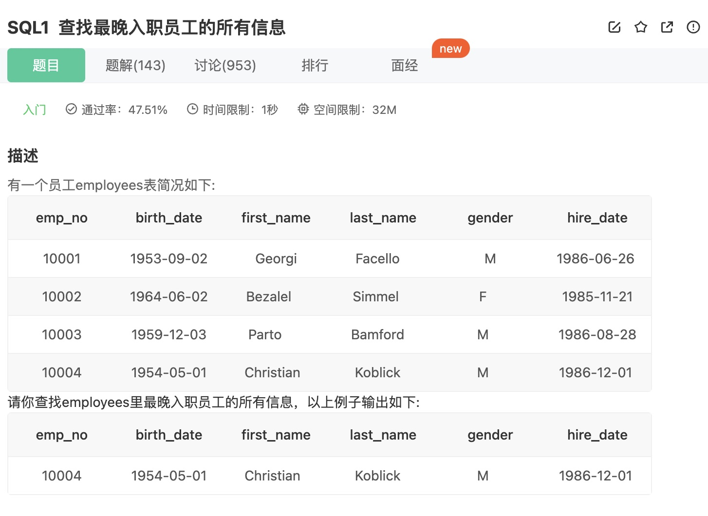


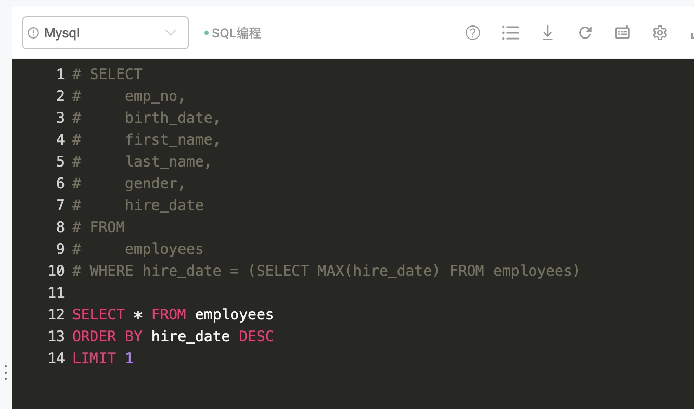

题意:

给你一张员工信息表，请你查询出其中最晚入职的员工信息


思路:

- 所谓最晚入职其实就是hire_day字段最大，所以我们可以先查询出hire_day字段中的最大值，然后用来匹配即可
- 但这样写的话需要进行子查询或者连接查询，其实我们只需要对表中的数据按照hire_day字段进行倒序排序即可，然后利用LIMIT分页取第一条记录即可(tuple)
- 面试中千万不要在SELECT列表中使用*

SQL如下

```mysql
SELECT
    emp_no,
    birth_date,
    first_name,
    last_name,
    gender,
    hire_date
FROM
    employees
WHERE hire_date = (SELECT MAX(hire_date) FROM employees)

SELECT * FROM employees
ORDER BY hire_date DESC 
LIMIT 1
```

<hr>


# 二、时间上倒数第三入职的员工

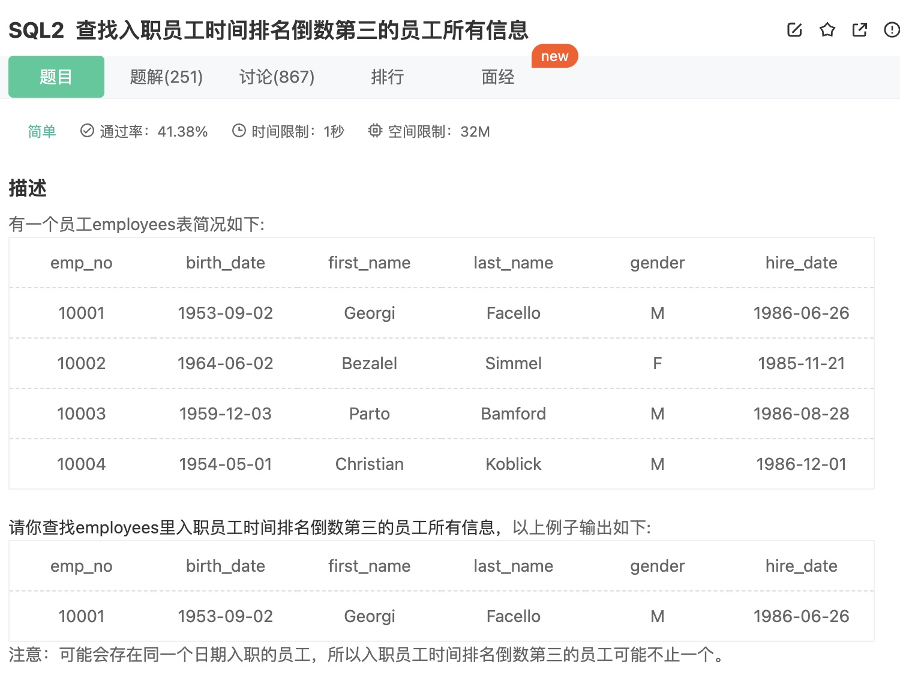


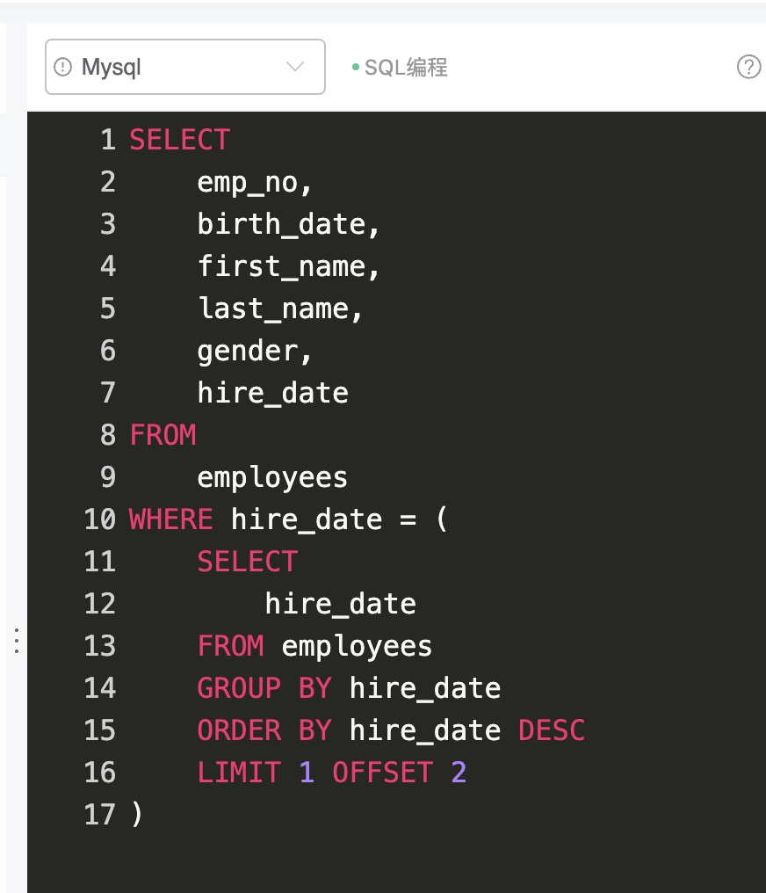

题意:
给你一张员工信息表，请查询出其中入职时间上倒数第三的员工


思路:

- 因为同一个入职时间可能存在多个员工，所以我们需要先获取倒数第三入职对应的时间，我们同样根据hire_date字段进行排序分页即可，SQL如下

SQL1:

```mysql
SELECT 
		hire_date 
FROM employees 
GROUP BY hire_date
ORDER BY hire_date DESC
LIMIT 1 OFFSET 2
```

- 最后只需要查询出所有匹配该日期的记录即可(注意结果去重)，最终SQL如下

```mysql
SELECT
    emp_no,
    birth_date,
    first_name,
    last_name,
    gender,
    hire_date
FROM
    employees
WHERE hire_date = (
    SQL1
)
```


优化:

- 首先使用EXPLAIN查看执行计划，发现子查询和外部查询都使用全表扫描，没有用到索引
- 且子查询需要使用临时表和文件排序

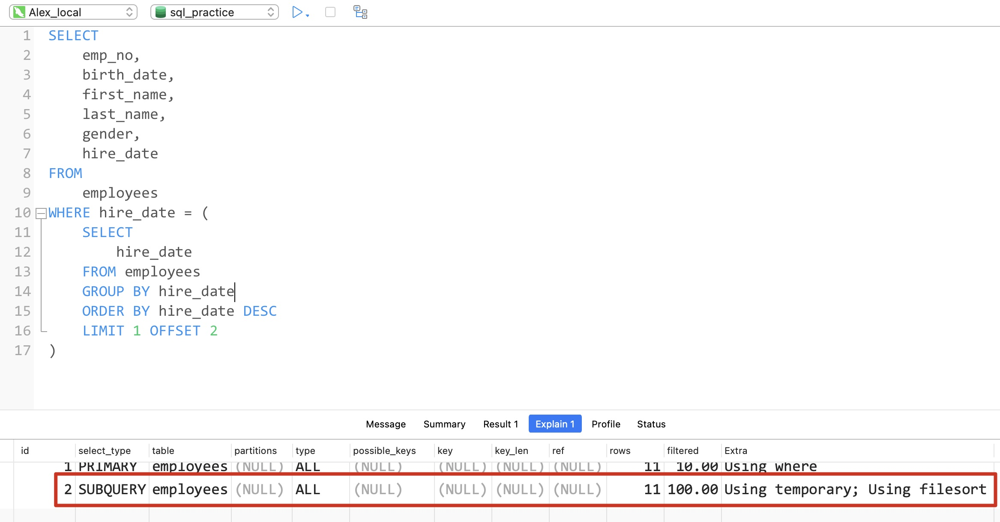

- 再查看JSON格式，发现开销为3.20

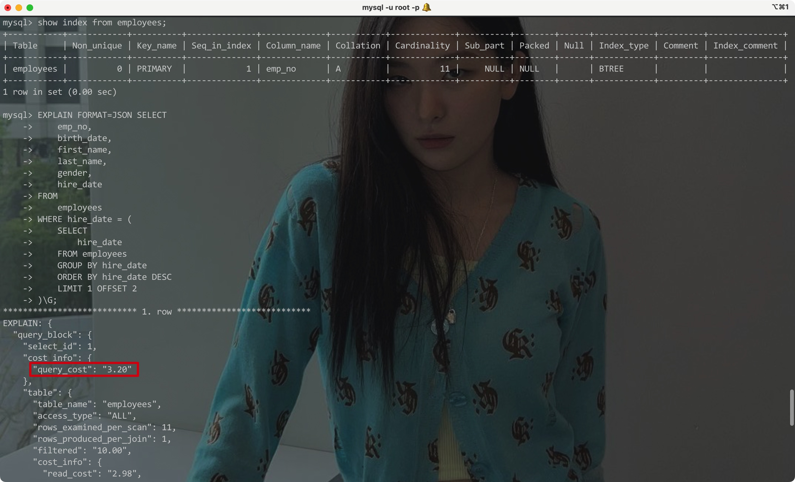


- 根据执行计划，我们的想办法将文件排序去除，从SQL上看，排序针对的是hire_date字段，所以我们只需要在该字段上建立索引即可
- 此时再查看执行计划，发现文件排序和临时表都消失了

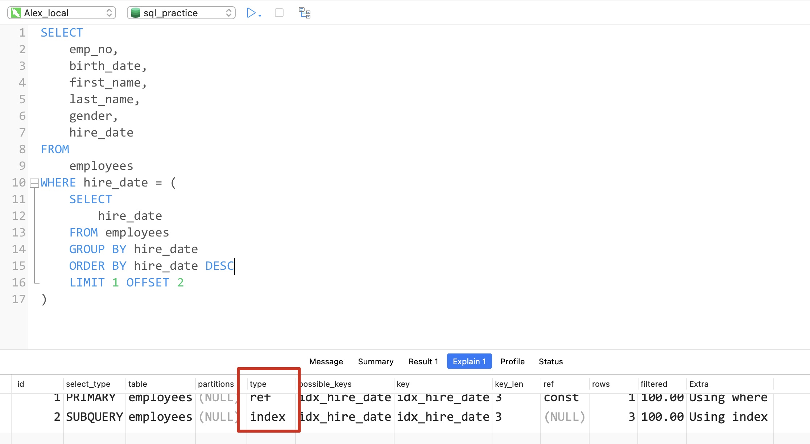

- 再查看开销，此时降为了1.20!


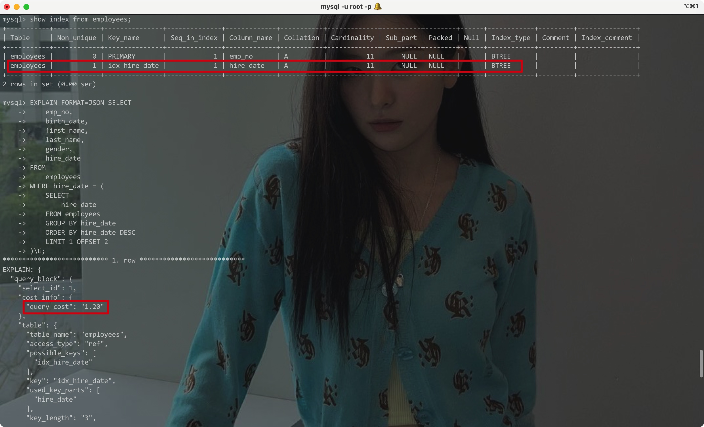

<hr>


# 三、各部门领导薪水

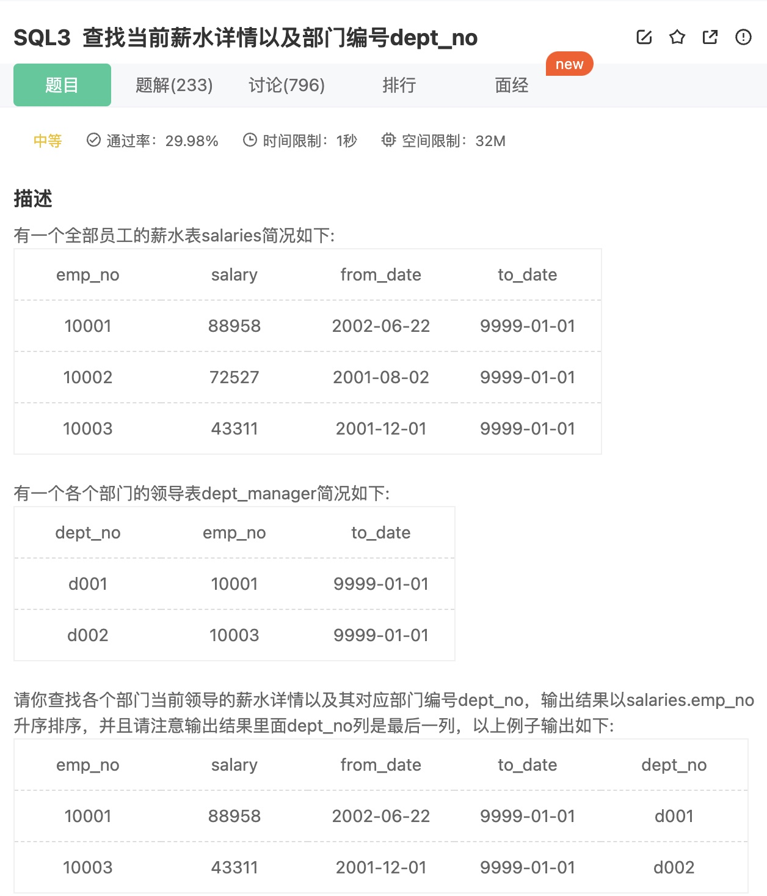


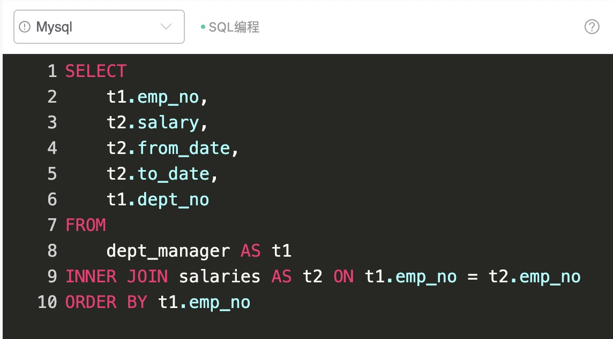

题意:

给你一张薪资表，一张部门领导信息表，请你查询出其中所有部门对应的部门领导信息和薪资


思路:

- 很明显，我们只需要根据emp_no字段，进行一次内连接即可，最后根据emp_no排序就是了
- 这条SQL的优化空间也很少，只需要在两张表的emp_no字段上建立索引即可(连接字段必须建立索引)，所以SQL如下

```mysql
SELECT
    t1.emp_no,
    t2.salary,
    t2.from_date,
    t2.to_date,
    t1.dept_no
FROM
    dept_manager AS t1
INNER JOIN salaries AS t2 ON t1.emp_no = t2.emp_no
ORDER BY t1.emp_no
```

<hr>


# 四、已分配员工信息

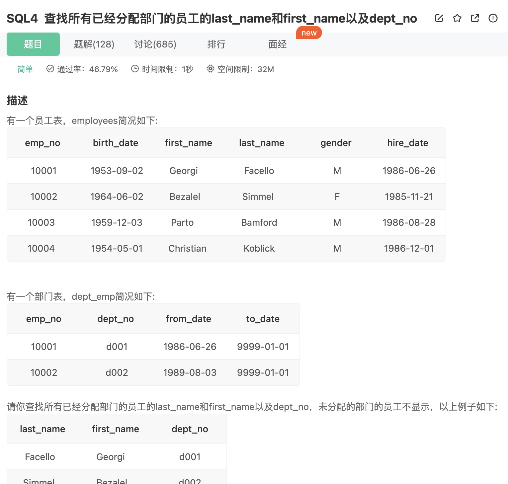


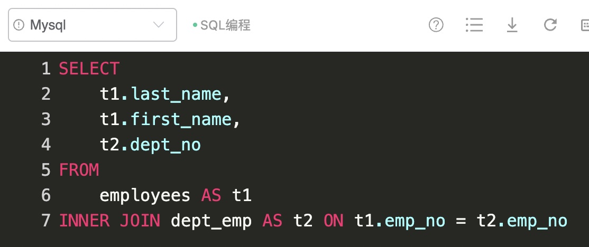

<hr>


# 五、所有员工信息

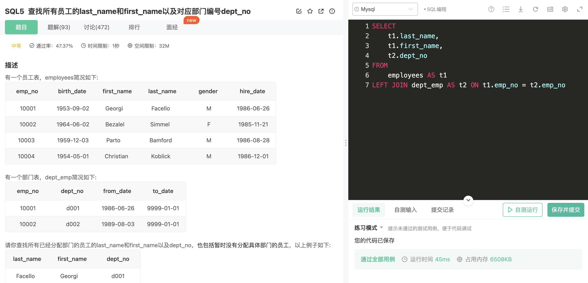


题意:

给你一张员工信息表，一张部门信息表，请你查询出其中所有员工的信息


思路:

- 昨天我们查询的是已经被分配部门的员工，而今天我们需要的是所有的员工信息，所以我们应该以员工表为准进行查询，在SQL上就是将员工表作为驱动表，所以使用外连接即可，SQL如下

```sql
SELECT
    t1.last_name,
    t1.first_name,
    t2.dept_no
FROM
    employees AS t1
LEFT JOIN dept_emp AS t2 ON t1.emp_no = t2.emp_no
```

<hr>


# 六、记录超过15条的员工

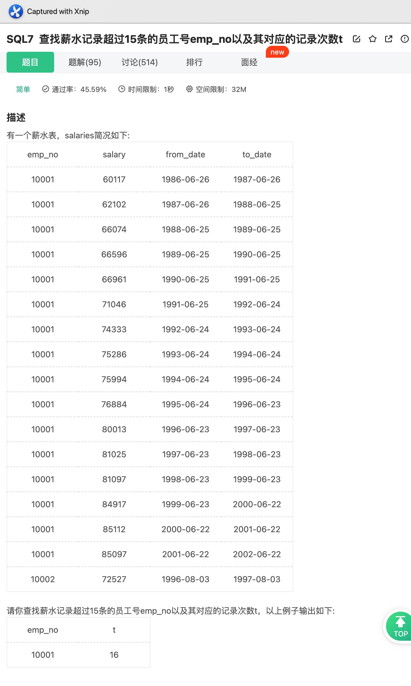


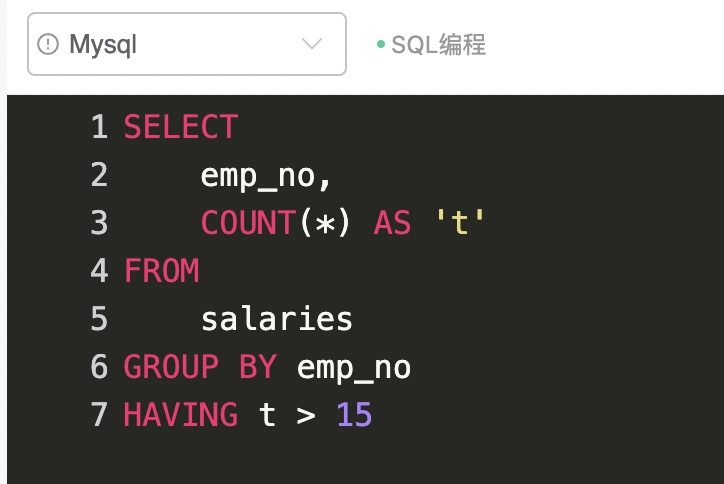

题意:

给你一张员工薪资表，请你查询出其中薪水记录出现次数超过15次的员工对应的员工号和出现次数


思路:

- 因为是按照不同的员工为基准，所以我们需要根据员工来分组统计，因此需要使用`GROUP BY`分组
- 统计出现次数在这里其实就是行数，统计行数最好使用`COUNT(*)`，最后因为我们需要限制的是每个员工对应的薪水出现次数，抽象来看就是每个员工对应的集合中元素的个数
- 所以我们限制的是一个集合的特征，因此需要使用`HAVING`子句而不是`WHERE`子句，SQL如下

```mysql
SELECT
    emp_no,
    COUNT(*) AS 't'
FROM
    salaries
GROUP BY emp_no
HAVING t > 15
```

<hr>


# 七、所有salary情况

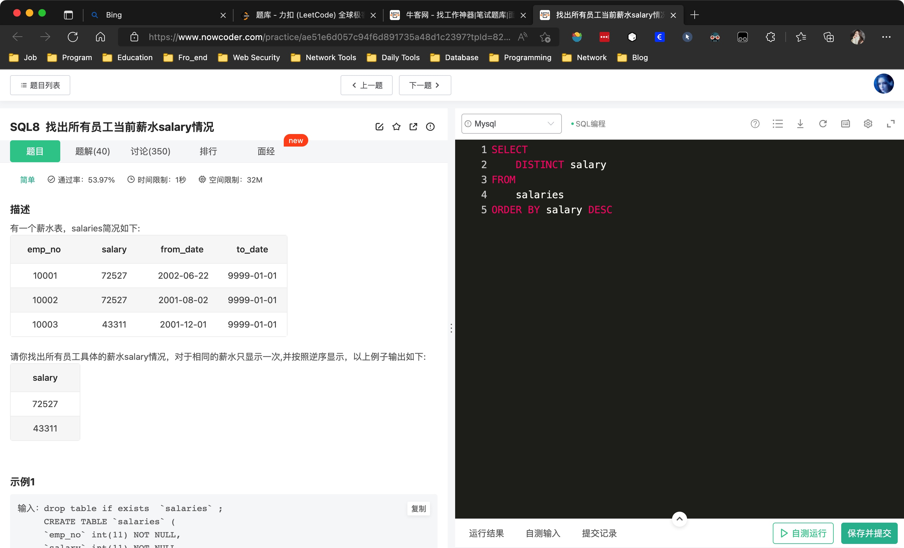

题意:

给你一张薪水表，请你查询出所有的薪水数字，相同的数字只显示一次，且结果逆序显示


思路:

- 提取一下要求，其实就是去重和排序，去重有两种选择，要么用`DISTINCT`要么用`GROUP BY`，如果有`WHERE`子句，且数据量较大的话，推荐用`GROUP BY`，最后排序只需要记得用`DESC`即可，SQL如下

```mysql
SELECT
    DISTINCT salary
FROM
    salaries
ORDER BY salary DESC
```

<hr>


# 八、非manager的员工emp_no

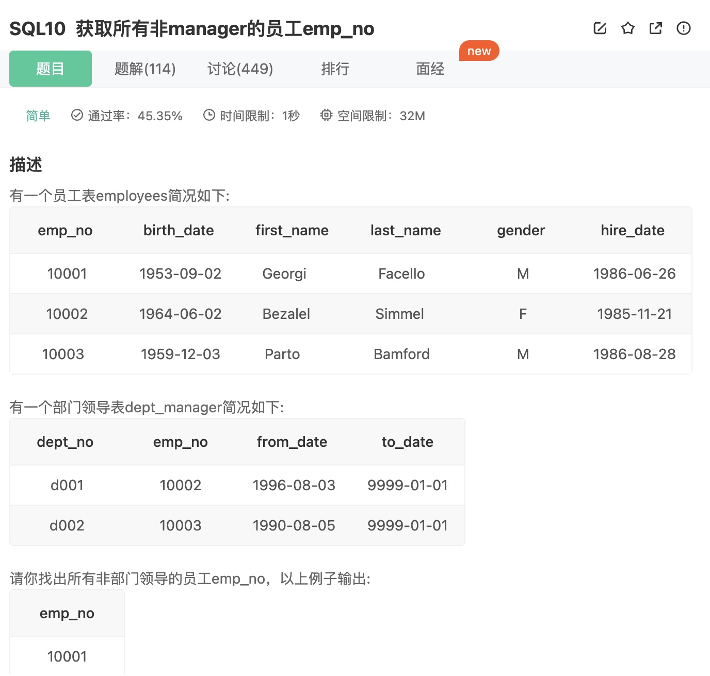


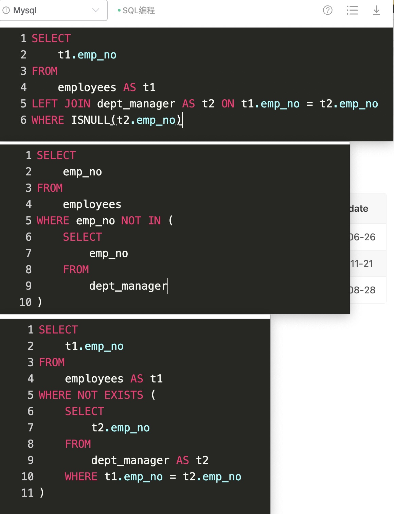

题意:

给你一张员工信息表，一张部门经理信息表，请你查询出其中不是manager的员工emp_no


思路:

- 最简单的方法自然是查询出所有的经理，再用所有的员工来做集合间的减法，这里使用NOT IN即可解决，SQL如下

```mysql
SELECT
    emp_no
FROM
    employees
WHERE emp_no NOT IN (
    SELECT
        emp_no
    FROM
        dept_manager
)
```


- 然而，当数据量大起来的话，使用IN/NOT IN会受到其中参数的数量限制(MySQL默认对语句的限制为最大4MB，可以通过修改max_allowed_packet变量来设置)，大致对应1000个参数，所以有可能出问题
- 因此，我们应该在IN中调用的参数上建立索引，不然的话，最好使用NOT EXISTS来代替这种做法，SQL如下

```mysql
SELECT
    t1.emp_no
FROM
    employees AS t1
WHERE NOT EXISTS (
    SELECT
        t2.emp_no
    FROM
        dept_manager AS t2
    WHERE t1.emp_no = t2.emp_no
)
```


- 如果觉得这种写法麻烦的话，其实通过两表外连接后，经理表中没有对应emp_no字段数据的记录就是我们需要的结果，SQL如下

```mysql
SELECT
    t1.emp_no
FROM
    employees AS t1
LEFT JOIN dept_manager AS t2 ON t1.emp_no = t2.emp_no
WHERE ISNULL(t2.emp_no)
```

<hr>


# 九、获取所有员工的manager

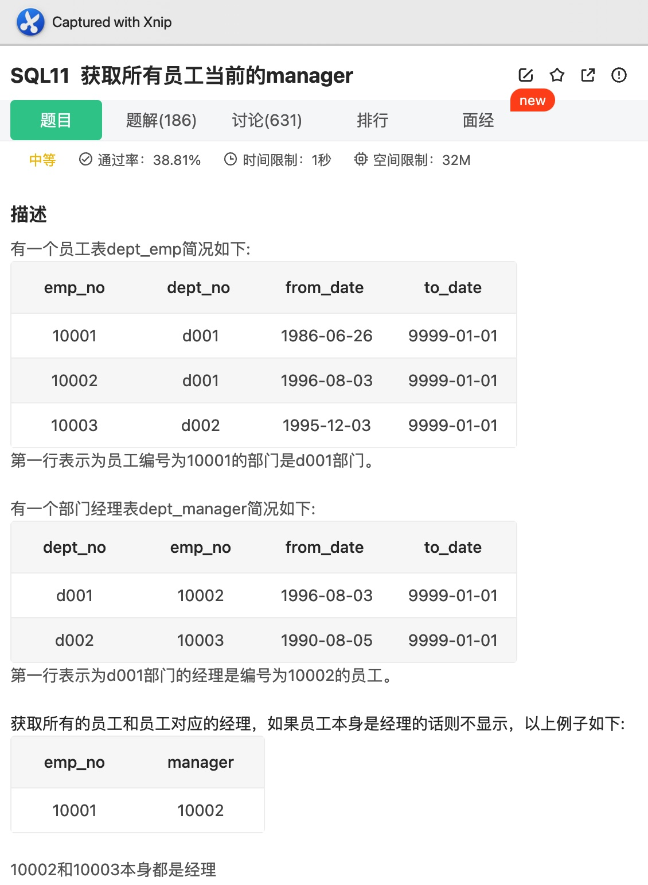


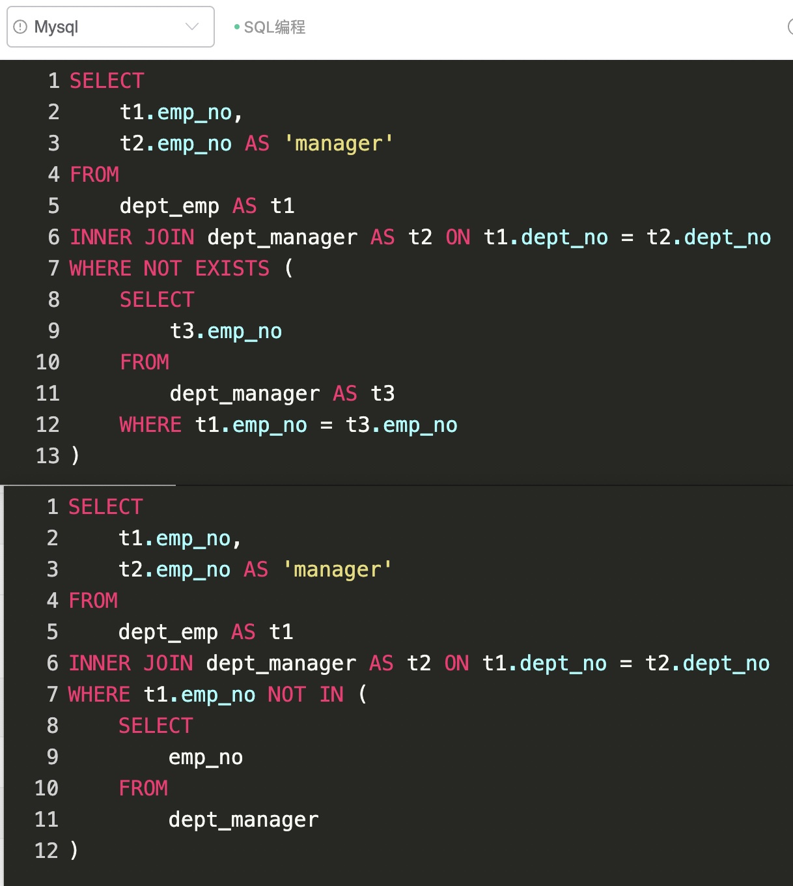

题意:

给你一张员工信息表，一张部门经理表，请查询出其中每个员工和对应的部门经理


思路:

- 将题目抽象一下，其实就是将两表进行连接，再对所有的员工id和经理id这两个集合进行差集运算
- 这道题目只需要使用内连接即可(如果不是每个员工都有部门经理的话，则需要使用外连接)将两表进行连接
- 因为最后返回的id中不能存在经理id，所以我们要对查询出的员工id进行限定
- 最简单的方式莫过于使用NOT IN，即将所有的经理id查询出后，判断每个查询出的员工id是否存在于该经理id集合中
- 但和昨天一样，使用NOT IN可能会成为性能瓶颈，所以最好改用EXISTS，SQL如下

```mysql
SELECT
    t1.emp_no,
    t2.emp_no AS 'manager'
FROM
    dept_emp AS t1
INNER JOIN dept_manager AS t2 ON t1.dept_no = t2.dept_no
WHERE NOT EXISTS (
    SELECT
        t3.emp_no
    FROM
        dept_manager AS t3
    WHERE t1.emp_no = t3.emp_no
)
```

<hr>


# 十、每个部门的最高薪资员工

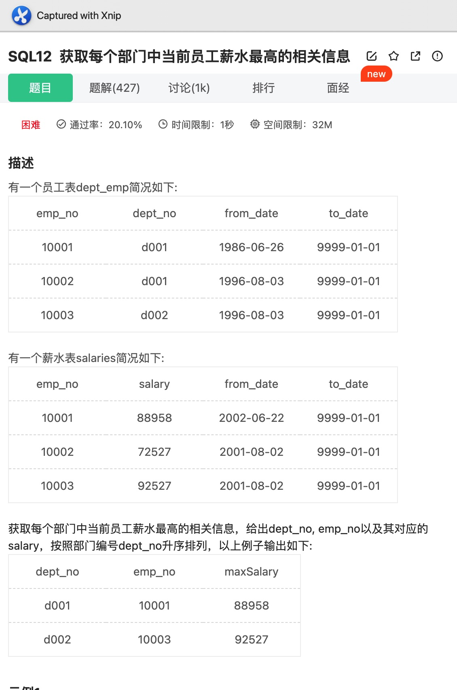


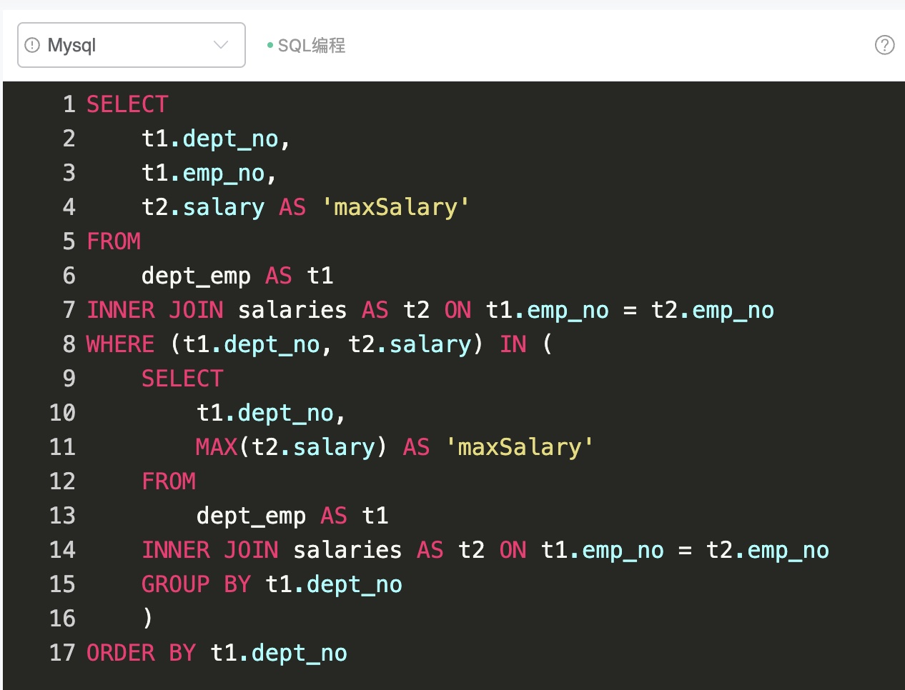

题意:

给你一张员工信息表，一张薪水表，请你计算出其中每个部门中薪资最高的员工对应的工资


思路:

- 因为部门id和薪水是分别放在两张表里的，所以我们需要连接两表来查询出每个部门中的最高薪资，可能有人会想直接加入对应的员工id不久把这道题目解决了吗？
- 在MySQL中，如果sql_mode不是ONLY_FULL_GROUP_BY的话，确实可以这样做，但一般来说，sql_mode默认都是ONLY_FULL_GROUP_BY，即SELECT列表中的非聚合函数字段必须和分组字段对应，否则不合法，这也符合标准SQL中的规定
- 所以我们在获取每个部门对于的最值时，不能一并获取对应的员工id，SQL如下

SQL1:

```mysql
SELECT
		t1.dept_no,
		MAX(t2.salary) AS 'maxSalary'
FROM
		dept_emp AS t1
INNER JOIN salaries AS t2 ON t1.emp_no = t2.emp_no
GROUP BY t1.dept_no
```


- 有了这张临时表/内联视图后，我们只需要连接原始两表，并限制这两个字段即可，这里可以使用IN，SQL如下

```mysql
SELECT
    t1.dept_no,
    t1.emp_no,
    t2.salary AS 'maxSalary'
FROM
    dept_emp AS t1
INNER JOIN salaries AS t2 ON t1.emp_no = t2.emp_no
WHERE (t1.dept_no, t2.salary) IN (
    SQL1
    )
ORDER BY t1.dept_no
```


