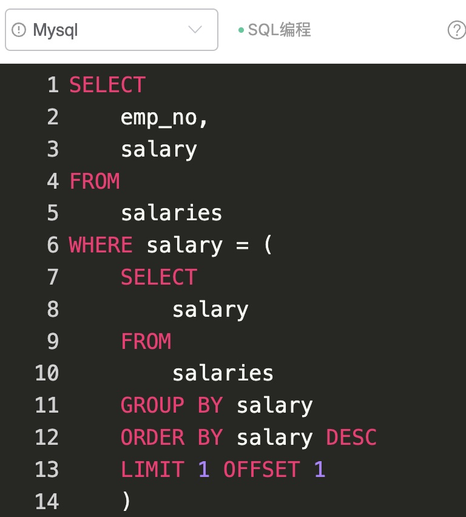
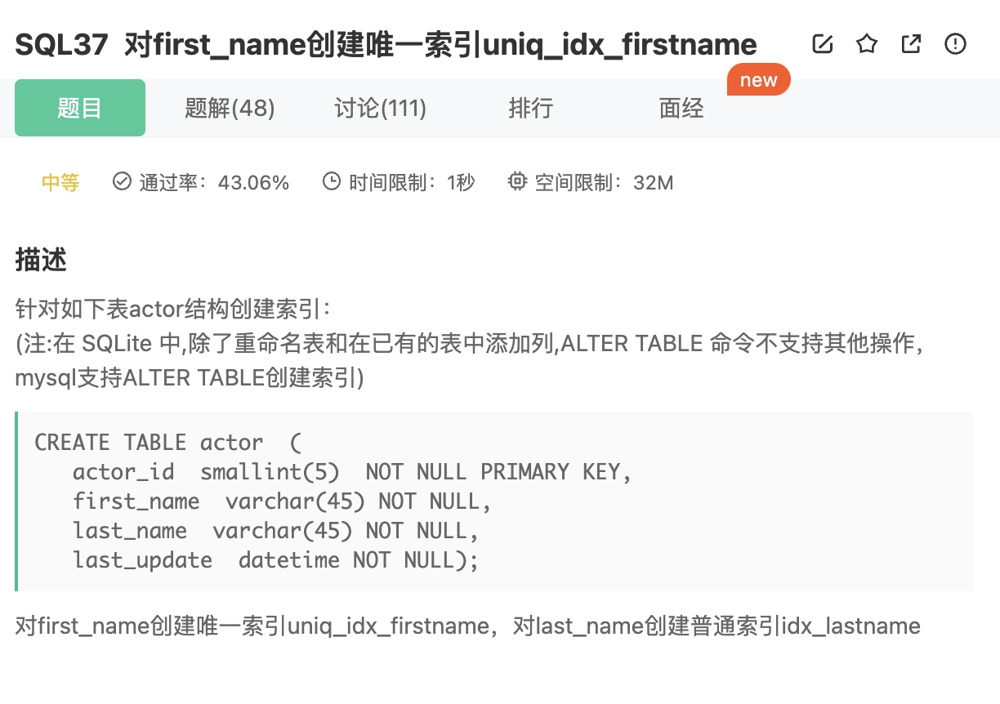
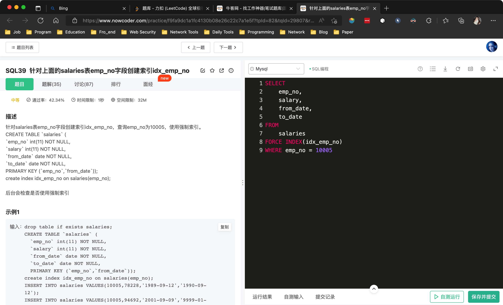
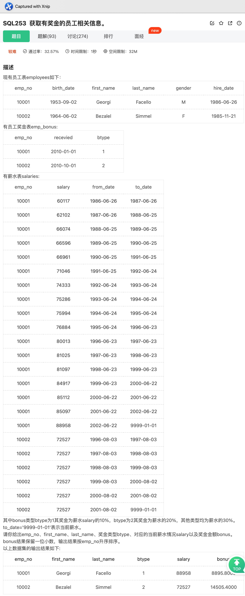
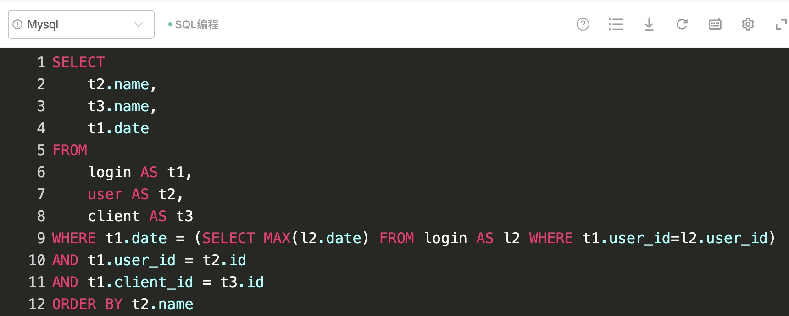
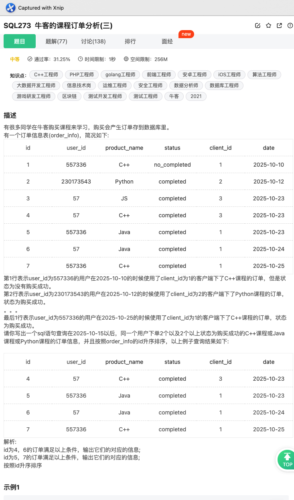
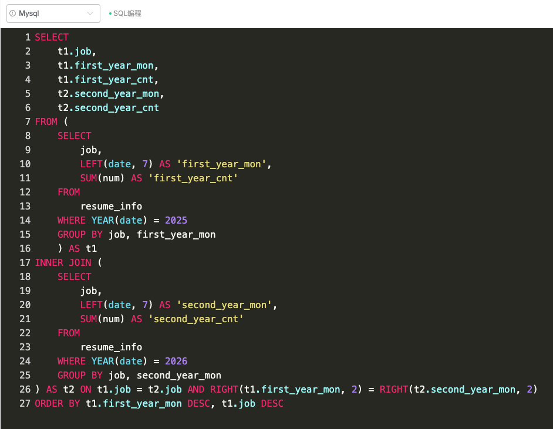

# 一、最晚入职员工


题意:

给你一张员工信息表，请你查询出其中最晚入职的员工信息


思路:

- 所谓最晚入职其实就是hire_day字段最大，所以我们可以先查询出hire_day字段中的最大值，然后用来匹配即可
- 但这样写的话需要进行子查询或者连接查询，其实我们只需要对表中的数据按照hire_day字段进行倒序排序即可，然后利用LIMIT分页取第一条记录即可(tuple)
- 面试中千万不要在SELECT列表中使用*

SQL如下

```mysql
SELECT
    emp_no,
    birth_date,
    first_name,
    last_name,
    gender,
    hire_date
FROM
    employees
WHERE hire_date = (SELECT MAX(hire_date) FROM employees)

SELECT * FROM employees
ORDER BY hire_date DESC 
LIMIT 1
```

<hr>


# 二、时间上倒数第三入职的员工


题意:
给你一张员工信息表，请查询出其中入职时间上倒数第三的员工


思路:

- 因为同一个入职时间可能存在多个员工，所以我们需要先获取倒数第三入职对应的时间，我们同样根据hire_date字段进行排序分页即可，SQL如下

SQL1:

```mysql
SELECT 
		hire_date 
FROM employees 
GROUP BY hire_date
ORDER BY hire_date DESC
LIMIT 1 OFFSET 2
```

- 最后只需要查询出所有匹配该日期的记录即可(注意结果去重)，最终SQL如下

```mysql
SELECT
    emp_no,
    birth_date,
    first_name,
    last_name,
    gender,
    hire_date
FROM
    employees
WHERE hire_date = (
    SQL1
)
```


优化:

- 首先使用EXPLAIN查看执行计划，发现子查询和外部查询都使用全表扫描，没有用到索引
- 且子查询需要使用临时表和文件排序


- 再查看JSON格式，发现开销为3.20


- 根据执行计划，我们的想办法将文件排序去除，从SQL上看，排序针对的是hire_date字段，所以我们只需要在该字段上建立索引即可
- 此时再查看执行计划，发现文件排序和临时表都消失了


- 再查看开销，此时降为了1.20!


<hr>


# 三、各部门领导薪水


题意:

给你一张薪资表，一张部门领导信息表，请你查询出其中所有部门对应的部门领导信息和薪资


思路:

- 很明显，我们只需要根据emp_no字段，进行一次内连接即可，最后根据emp_no排序就是了
- 这条SQL的优化空间也很少，只需要在两张表的emp_no字段上建立索引即可(连接字段必须建立索引)，所以SQL如下

```mysql
SELECT
    t1.emp_no,
    t2.salary,
    t2.from_date,
    t2.to_date,
    t1.dept_no
FROM
    dept_manager AS t1
INNER JOIN salaries AS t2 ON t1.emp_no = t2.emp_no
ORDER BY t1.emp_no
```

<hr>


# 四、已分配员工信息


<hr>


# 五、所有员工信息


题意:

给你一张员工信息表，一张部门信息表，请你查询出其中所有员工的信息


思路:

- 昨天我们查询的是已经被分配部门的员工，而今天我们需要的是所有的员工信息，所以我们应该以员工表为准进行查询，在SQL上就是将员工表作为驱动表，所以使用外连接即可，SQL如下

```sql
SELECT
    t1.last_name,
    t1.first_name,
    t2.dept_no
FROM
    employees AS t1
LEFT JOIN dept_emp AS t2 ON t1.emp_no = t2.emp_no
```

<hr>


# 六、记录超过15条的员工


题意:

给你一张员工薪资表，请你查询出其中薪水记录出现次数超过15次的员工对应的员工号和出现次数


思路:

- 因为是按照不同的员工为基准，所以我们需要根据员工来分组统计，因此需要使用`GROUP BY`分组
- 统计出现次数在这里其实就是行数，统计行数最好使用`COUNT(*)`，最后因为我们需要限制的是每个员工对应的薪水出现次数，抽象来看就是每个员工对应的集合中元素的个数
- 所以我们限制的是一个集合的特征，因此需要使用`HAVING`子句而不是`WHERE`子句，SQL如下

```mysql
SELECT
    emp_no,
    COUNT(*) AS 't'
FROM
    salaries
GROUP BY emp_no
HAVING t > 15
```

<hr>


# 七、所有salary情况


题意:

给你一张薪水表，请你查询出所有的薪水数字，相同的数字只显示一次，且结果逆序显示


思路:

- 提取一下要求，其实就是去重和排序，去重有两种选择，要么用`DISTINCT`要么用`GROUP BY`，如果有`WHERE`子句，且数据量较大的话，推荐用`GROUP BY`，最后排序只需要记得用`DESC`即可，SQL如下

```mysql
SELECT
    DISTINCT salary
FROM
    salaries
ORDER BY salary DESC
```

<hr>


# 八、非manager的员工emp_no


题意:

给你一张员工信息表，一张部门经理信息表，请你查询出其中不是manager的员工emp_no


思路:

- 最简单的方法自然是查询出所有的经理，再用所有的员工来做集合间的减法，这里使用NOT IN即可解决，SQL如下

```mysql
SELECT
    emp_no
FROM
    employees
WHERE emp_no NOT IN (
    SELECT
        emp_no
    FROM
        dept_manager
)
```


- 然而，当数据量大起来的话，使用IN/NOT IN会受到其中参数的数量限制(MySQL默认对语句的限制为最大4MB，可以通过修改max_allowed_packet变量来设置)，大致对应1000个参数，所以有可能出问题
- 因此，我们应该在IN中调用的参数上建立索引，不然的话，最好使用NOT EXISTS来代替这种做法，SQL如下

```mysql
SELECT
    t1.emp_no
FROM
    employees AS t1
WHERE NOT EXISTS (
    SELECT
        t2.emp_no
    FROM
        dept_manager AS t2
    WHERE t1.emp_no = t2.emp_no
)
```


- 如果觉得这种写法麻烦的话，其实通过两表外连接后，经理表中没有对应emp_no字段数据的记录就是我们需要的结果，SQL如下

```mysql
SELECT
    t1.emp_no
FROM
    employees AS t1
LEFT JOIN dept_manager AS t2 ON t1.emp_no = t2.emp_no
WHERE ISNULL(t2.emp_no)
```

<hr>


# 九、获取所有员工的manager


题意:

给你一张员工信息表，一张部门经理表，请查询出其中每个员工和对应的部门经理


思路:

- 将题目抽象一下，其实就是将两表进行连接，再对所有的员工id和经理id这两个集合进行差集运算
- 这道题目只需要使用内连接即可(如果不是每个员工都有部门经理的话，则需要使用外连接)将两表进行连接
- 因为最后返回的id中不能存在经理id，所以我们要对查询出的员工id进行限定
- 最简单的方式莫过于使用NOT IN，即将所有的经理id查询出后，判断每个查询出的员工id是否存在于该经理id集合中
- 但和昨天一样，使用NOT IN可能会成为性能瓶颈，所以最好改用EXISTS，SQL如下

```mysql
SELECT
    t1.emp_no,
    t2.emp_no AS 'manager'
FROM
    dept_emp AS t1
INNER JOIN dept_manager AS t2 ON t1.dept_no = t2.dept_no
WHERE NOT EXISTS (
    SELECT
        t3.emp_no
    FROM
        dept_manager AS t3
    WHERE t1.emp_no = t3.emp_no
)
```

<hr>


# 十、每个部门的最高薪资员工


题意:

给你一张员工信息表，一张薪水表，请你计算出其中每个部门中薪资最高的员工对应的工资


思路:

- 因为部门id和薪水是分别放在两张表里的，所以我们需要连接两表来查询出每个部门中的最高薪资，可能有人会想直接加入对应的员工id不久把这道题目解决了吗？
- 在MySQL中，如果sql_mode不是ONLY_FULL_GROUP_BY的话，确实可以这样做，但一般来说，sql_mode默认都是ONLY_FULL_GROUP_BY，即SELECT列表中的非聚合函数字段必须和分组字段对应，否则不合法，这也符合标准SQL中的规定
- 所以我们在获取每个部门对于的最值时，不能一并获取对应的员工id，SQL如下

SQL1:

```mysql
SELECT
		t1.dept_no,
		MAX(t2.salary) AS 'maxSalary'
FROM
		dept_emp AS t1
INNER JOIN salaries AS t2 ON t1.emp_no = t2.emp_no
GROUP BY t1.dept_no
```


- 有了这张临时表/内联视图后，我们只需要连接原始两表，并限制这两个字段即可，这里可以使用IN，SQL如下

```mysql
SELECT
    t1.dept_no,
    t1.emp_no,
    t2.salary AS 'maxSalary'
FROM
    dept_emp AS t1
INNER JOIN salaries AS t2 ON t1.emp_no = t2.emp_no
WHERE (t1.dept_no, t2.salary) IN (
    SQL1
    )
ORDER BY t1.dept_no
```

<hr>


# 十一、查找对应信息


题意:

给你一张员工信息表，请你查询出其中所有工号为奇数，且姓不是Mary的员工，最后按照hire_date字段倒序排序


思路:

- 查询奇数可以通过与2取余后判断，也可以对1做按位于运算，限制姓直接使用!=即可
- 最后注意倒序使用`DESC`即可，最终SQL如下

```mysql
SELECT
    emp_no,
    birth_date,
    first_name,
    last_name,
    gender,
    hire_date
FROM
    employees
WHERE emp_no & 1 = 1
AND last_name != 'Mary'
ORDER BY hire_date DESC
```

<hr>


# 十二、各个title对应的平均薪资


题意:

给你一张员工职称表，一张薪资信息表，请你统计每个title对应的平均薪资


思路:

- 因为需要按照title来分组计算平均值，而title和薪水在不同的两张表中
- 因此我们需要进行表的连接才能进行分组计算，SQL如下

```mysql
SELECT
    t1.title AS 'title',
    AVG(t2.salary) AS 'avg(s.salary)'
FROM
    titles AS t1
INNER JOIN salaries AS t2 ON t1.emp_no = t2.emp_no
GROUP BY t1.title
ORDER BY AVG(t2.salary)
```

<hr>


# 十三、薪水第二多的员工信息




题意:

给你一张员工薪水表，请你查询出其中薪水第二高的所有员工


思路:

- 因为可能存在薪水重复的情况，所以不能简单的按照薪水排序后分页，而是要先求出第二高的薪水，SQL如下

SQL1:

```mysql
SELECT
	salary
FROM
	salaries
GROUP BY salary
ORDER BY salary DESC
LIMIT 1 OFFSET 1
```

- 注意这里需要按照薪资分组，这样才不会有重复


- 有了上述临时表/内联视图后，我们直接匹配该薪资即可，最终SQL如下

```mysql
SELECT
    emp_no,
    salary
FROM
    salaries
WHERE salary = (
    SQL1
    )
```

<hr>


# 十四、薪水第二多的员工信息(不用ORDER BY)


题意:

需求和昨天一样，同样是求薪水第二高的员工信息，不过这里要求我们不能使用ORDER BY来排序解决


思路:

- 昨天的我们的做法是通过排序后跳过第一条数据后取第二条数据即为第二高的薪资
- 但本质上其实是求除去最大值之外的最大值，刚好，求最大值可以使用聚合函数之一的MAX，所以我们只需要两次MAX即可获取第二高的薪资，SQL如下

SQL1:

```mysql
SELECT
	MAX(salary)
FROM
	salaries
WHERE salary < (
		SELECT
			MAX(salary)
		FROM
			salaries
)
```


- 同样的，剩下的部分也和昨天一致，只需要简单的匹配salary字段即可，SQL如下

```mysql
SELECT
    t1.emp_no,
    t2.salary,
    t1.last_name,
    t1.first_name
FROM
    employees AS t1
INNER JOIN salaries AS t2 ON t1.emp_no = t2.emp_no
WHERE t2.salary = (
    SQL1
)
```

<hr>


# 十五、查找所有员工的信息


题意:

给你一张员工信息表，一张部门信息表，一张部门员工关系表，请你查询出其中所有员工的对应信息和对应部门，也包括没有分配部门的员工


思路:

- 依然要查询出所有的员工信息，所以在连接表时，要以员工信息表为准，因此需要将员工信息表作为驱动表来写，因此需要使用外连接，然后连接相应字段即可，SQL如下

```mysql
SELECT
    t1.last_name,
    t1.first_name,
    t3.dept_name
FROM
    employees AS t1
LEFT JOIN dept_emp AS t2 ON t1.emp_no = t2.emp_no
LEFT JOIN departments AS t3 ON t2.dept_no = t3.dept_no
```

<hr>


# 十六、员工工资涨幅


题意:

给你一张员工信息表，一张员工薪资信息表，请你计算出每个员工从入职开始到现在还在职时的薪资涨幅


思路:

- 部分老铁可能上来就是最大薪资减去最小薪资，还觉得员工信息表没用，但一提交就G了
- 这是因为部分员工可能存在入职时的薪资不是最低数值的情况(出个P0事故降薪很正常吧?)
- 所以我们不能简单地用最值相减的方式来做，而是需要老老实实的查询出当前薪资再减去入职当天的薪资
- 因为部分员工可能中途就跑路了，所以我们需要先筛选出至今还在摸鱼的员工，即to_date为9999-01-01的员工，SQL如下

SQL1:

```mysql
SELECT
	emp_no
FROM
	salaries
WHERE to_date = '9999-01-01'
```


- 然后我们需要通过两表连接获取入职当天对应员工的薪资
- 而一旦连接后，当前薪资就需要在另一张表中去取了，所以我们需要写一个三表连接，最终SQL如下

```mysql
SELECT
    t1.emp_no,
    t3.salary - t1.salary AS 'growth'
FROM
    salaries AS t1,
    employees AS t2,
    salaries AS t3
WHERE t1.from_date = t2.hire_date
AND t1.emp_no = t2.emp_no
AND t1.emp_no IN (
    SQL1
)
AND t3.emp_no = t2.emp_no
AND t3.to_date = '9999-01-01'
ORDER BY growth
```

<hr>


# 十七、各部门工资数


题意:

给你一张部门信息表，一张员工关系表，一张薪水表，请你查询出每个部门对应的工资记录数量


思路:

- 因为部门信息和薪资表没有直接关联的字段，所以我们需要借助员工关系表来做中转
- 最后注意分组和排序即可，不过在统计的时候推荐使用`COUNT(*)`，因为该写法不会对列进行任何判断，而`COUNT(列名)`会对列进行NOT NULL的判断，该思路适用于MySQL、MariaDB和PostgreSQL
- 所以最终SQL如下

```mysql
SELECT
    t1.dept_no,
    t1.dept_name,
    COUNT(*) AS 'sum'
FROM
    departments AS t1
INNER JOIN dept_emp AS t2 ON t1.dept_no = t2.dept_no
INNER JOIN salaries AS t3 ON t2.emp_no = t3.emp_no
GROUP BY t1.dept_no, t1.dept_name
ORDER BY t1.dept_no
```

<hr>


# 十八、员工薪资排名


题意:

给你一张薪资信息表，请你查询出每个员工的薪资排名


思路:

- 最简单的方法就是使用窗口函数了，只需要按照salary字段进行倒序排列即可，SQL如下

```mysql
SELECT
    emp_no,
    salary,
    DENSE_RANK() OVER(
        ORDER BY salary DESC
    ) AS 't_rank'
FROM
    salaries
ORDER BY t_rank, emp_no
```


- 但如果MySQL版本不是8.0及以上呢？那就需要使用关联子查询了，而且需要放在SELECT列表上，SQL如下

```mysql
SELECT
    t1.emp_no,
    t1.salary,
    (
        SELECT
            COUNT(DISTINCT t2.salary)
        FROM
            salaries AS t2
        WHERE t2.salary >= t1.salary
    ) AS 't_rank'
FROM
    salaries AS t1
ORDER BY t_rank, t1.emp_no
```

<hr>


# 十九、非经理员工的薪水


题意:

给你一张员工信息表，一张部门员工关系表，一张部门经理表，一张薪资表，请你查询出其中所有非经理的员工信息和薪资


思路:

- 看起来有四张表，其实我们只需要用到其中的三张，员工信息表是多余的
- 从结果上看，我们只需要部门号、员工号和薪资即可，但最后需要排除掉所有的经理，所以使用NOT IN是最简单的写法，SQL如下

```mysql
SELECT
    t1.dept_no,
    t1.emp_no,
    t2.salary
FROM
    dept_emp AS t1
INNER JOIN salaries AS t2 ON t1.emp_no = t2.emp_no
WHERE t1.emp_no NOT IN (
    SELECT
        emp_no
    FROM
        dept_manager
)
```


- 当然，有NOT IN，就有NOT EXISTS，SQL如下

```mysql
SELECT
    t1.dept_no,
    t1.emp_no,
    t2.salary
FROM
    dept_emp AS t1
INNER JOIN salaries AS t2 ON t1.emp_no = t2.emp_no
WHERE NOT EXISTS (
    SELECT
        emp_no
    FROM
        dept_manager AS t3
    WHERE t1.emp_no = t3.emp_no
)
```

<hr>


# 二十、薪水高于经理的员工


题意:

给你一张员工部门关系表，一张部门经理信息表，一张薪水表，请你查询出其中薪资大于其经理的员工对应的信息和其经理的信息


思路:

- 解法很简单，只需要连接表后查询出员工、经理的id和薪资即可，需要注意的是，员工和经理的薪资需要分开处理，所以salaries表需要连接两次，最终SQL如下

```mysql
SELECT
    t1.emp_no,
    t2.emp_no AS 'manager_no',
    t3.salary AS 'emp_salary',
    t4.salary AS 'manager_salary'
FROM
    dept_emp AS t1
INNER JOIN dept_manager AS t2 ON t1.dept_no = t2.dept_no
INNER JOIN salaries AS t3 ON t1.emp_no = t3.emp_no
INNER JOIN salaries AS t4 ON t2.emp_no = t4.emp_no
WHERE t3.salary > t4.salary
```

<hr>


# 二十一、各部门不同title的员工数量


题意:

给你一张部门信息表，一张员工部门关系表，一张员工职称表，请你查询出每个部门中不同职称的员工数量，并按照指定规则对结果排序


思路:

- 又一道外强中干的题目，别看它是困难，其实最多就算个中等题
- 其实只需要连接三张表，取出相应字段并进行分组统计就行了，排序规则自然也就不算什么了，最终SQL如下

```mysql
SELECT
    t1.dept_no,
    t1.dept_name,
    t3.title,
    COUNT(*) AS 'count'
FROM
    departments AS t1
INNER JOIN dept_emp AS t2 ON t1.dept_no = t2.dept_no
INNER JOIN titles AS t3 ON t2.emp_no = t3.emp_no
GROUP BY t1.dept_no, t1.dept_name, t3.title
ORDER BY t1.dept_no, t3.title
```

<hr>


# 二十二、没有分类的电影


题意:

给你一张电影信息表，一张电影类别表，一张电影分类表，请你查询出其中没有分类的电影信息


思路:

- 所谓的没有分类其实就是仅存在于电影信息表内，但不存在于电影分类表中
- 所以以电影信息表为驱动表，进行外连接后，不存在分类id的自然就是没有分类的电影了，所以最终SQL如下:

```mysql
SELECT
    t1.film_id,
    t1.title
FROM
    film AS t1
LEFT JOIN film_category AS t2 ON t1.film_id = t2.film_id
WHERE t2.category_id IS NULL
```

<hr>


# 二十三、动作电影信息


题意:

给你一张电影信息表，一张电影类别表，一张电影类别对应表，请你通过子查询的方式查询出其中所有的动作电影(name字段为Action)


思路:

- 因为要用子查询，所以我们可以先查询出所有的动作电影对应的id，SQL如下

SQL1:

```mysql
SELECT
	film_id
FROM
	film_category AS t1
INNER JOIN category AS t2 ON t1.category_id = t2.category_id
WHERE name = 'Action'
```


- 最后只需要使用IN即可，最终查询如下:

```mysql
SELECT
    title,
    description
FROM
    film
WHERE film_id IN (
    SQL1
    )
```


- 当然，我们也可以使用EXISTS将其改写为关联子查询:

```mysql
SELECT
    t3.title,
    t3.description
FROM
    film AS t3
WHERE EXISTS (
    SELECT
        t1.film_id
    FROM
        film_category AS t1
    INNER JOIN category AS t2 ON t1.category_id = t2.category_id
    WHERE name = 'Action'
    AND t3.film_id = t1.film_id
    )
```

<hr>


# 二十四、建表


<hr>


# 二十五、非重复插入


<hr>


# 二十六、从既有表中创建新表


题意:

给你一张actor表，请你根据其中的`first_name`和`last_name`字段创建一个新的表


思路:

- 记住语法即可:

```mysql
CREATE TABLE IF NOT EXISTS table_name (
  
)
SELECT
	field1,
	field2
FROM
	actor
```

<hr>


# 二十七、创建索引




题意:

给你一张表，请你为其中的两个字段创建索引


思路:

- MySQL中，创建索引的语法有两种:

```mysql
ALTER TABLE table_name ADD [UNIQUE/PRIMARY/INDEX] index_name(field);
CREATE [UNIQUE/PRIMARY] INDEX index_name ON table_name(field);
```

<hr>


# 二十八、创建视图


题意:

给你一张actor表，请你以其中的两个列为基础创建一个视图，且视图的两个列需要创建别名


思路:

- 同样的，只需要记住语法即可(Navicat里只需要直接写SQL):

```mysql
CREATE VIEW view_name AS
SQL
```

<hr>


# 二十九、使用强制索引



题意:

给你一张salary表，请你通过使用强制索引idx_emp_no来查询出其中emp_no = 10005的记录


思路:

- 使用强制索引会在查询时直接使用对应的索引，而不是先让查询优化器去得出一个查询计划
- 只需要在查询时添加一句即可:

```mysql
SELECT
	[field...]
FROM
	table_name
FORCE INDEX(idx_name)
WHERE ...
```

<hr>


# 三十、添加列


<hr>


# 三十一、添加触发器


题意:

给你一张测试表，一张日志表，请你创建一个触发器，使得任何插入到测试表中的数据都能够被记录到日志表中


思路:

- 这里需要我们使用INSERT触发器，所以记住触发器的语法即可:

```mysql
CREATE TRIGGER trigger_name AFTER/BEFORE INSERT/UPDATE/DELETE ON modify_table
(FOR EACH ROW)
BEGIN
	SQL;
END;
```

- 对于添加的数据，我们需要从NEW表中取，删除的数据则需要从OLD表中取，所以这里我们需要从NEW中取，最终创建触发器的SQL语句如下:

```mysql
CREATE TRIGGER audit_log AFTER INSERT ON employees_test
FOR EACH ROW 
BEGIN
    INSERT INTO audit VALUES(NEW.id, NEW.name);
END;
```

<hr>


# 三十二、删除重复记录


题意:
给你一张测试表，请你删除其中emp_no重复的记录，保留最小的id记录


思路:

- 对于每个emp_no而言，其实只需要删除除了最小id之外的所有记录即可
- 所以我们只需要查询出每个emp_no对应的最小id即可，SQL如下

SQL1:

```mysql
SELECT
	min_id
FROM (
	SELECT
		MIN(id) AS 'min_id'
	FROM
		titles_test
	GROUP BY emp_no
) AS temp
```


最后删除时直接排除掉这些id即可，最终SQL如下

```mysql
DELETE FROM titles_test
WHERE id NOT IN (
    SQL1
)
```

<hr>


# 三十三、更新记录


题意:

请你更新表中对应的记录中的两个字段


思路:

- 更新的语法如下:

```mysql
UPDATE table_name SET field1 = new_val, ...
[WHERE field1 = cur_val, ...]
```

<hr>


# 三十四、REPLACE


题意:

给你一张测试表，请你将其中id为5且emp_no为10001的数据替换为emp_no = 10005


思路:

- 替换操作对应的函数为REPLACE，所以我们直接调用即可，SQL如下

```mysql
UPDATE titles_test
SET emp_no = REPLACE(emp_no, 10001, 10005)
WHERE id = 5
```

<hr>


# 三十五、外键


<hr>


# 三十六、奖金增加


题意:

给你一张员工奖金表，一张薪水信息表，请将你奖金表中的员工在薪水表中的薪资提高10%


思路:

- 简单的UPDATE语句确实不难，但在这里我们需要更新的是to_date字段值为'9999-01-01'的记录，所以需要加上对应的条件限制才行，最终SQL如下:

```mysql
UPDATE salaries SET salary = salary * 1.1
WHERE emp_no IN (SELECT emp_no FROM emp_bonus)
AND to_date = '9999-01-01'
```

<hr>


# 三十七、字符串拼接


题意:

给你一张职员表，请你将其中每个人的last_name和first_name用'连接起来


思路:

- 题目已经说了要用到CONCAT函数，不过这里的'不能简单的写入，而是要进行转义，可以通过两个连续的单引号进行转义，也可以通过\进行转义，最终SQL如下

```mysql
SELECT
    CONCAT(last_name, '\'',first_name) AS 'name'
FROM
    employees
```

<hr>


# 三十八、统计逗号


题意:
给你一张字符串表，请你计算出其中每行字符中的逗号数量


思路:

- 一个一个计算对于SQL来说显然不现实，这里我们可以利用REPLACE函数将逗号替换为空字符串，这样其与原字符串之间的长度差就是我们替换掉的逗号数量了，SQL如下

```mysql
SELECT
    id,
    LENGTH(string) - LENGTH(REPLACE(string, ",", "")) AS 'cnt'
FROM
    strings
```

<hr>


# 三十九、聚合分组


题意:

给你一张部门职员信息表，请你查询出其中不同部门对应的员工id


思路:

- 因为示例中将同一个部门的职员id放在了一起，所以不能使用常规的分组，而是要使用聚合分组`GROUP_CONCAT`，最终SQL如下

```mysql
SELECT
    dept_no,
    GROUP_CONCAT(emp_no) AS 'employees'
FROM
    dept_emp
GROUP BY dept_no
```

<hr>


# 四十、平均工资


题意:
给你一张薪资表，请你查询出在职员工中除了最大、最小salary之后的其他在职员工的平均工资


思路:

- 因为计算平均值的前提是排除最大最小值，所以我们需要先查询出这两个值，因为之后需要一并使用，所以我们直接通过上下连接将两个最值连在一起即可，SQL如下

SQL1:

```mysql
SELECT
	MAX(salary)
FROM
	salaries
UNION ALL
SELECT
	MIN(salary)
FROM
	salaries
WHERE to_date = '9999-01-01'
```


- 最后我们只需要调用AVG函数求平均值即可，最终SQL如下

```mysql
SELECT
    AVG(salary) AS 'avg_salary'
FROM
    salaries
WHERE salary NOT IN (
    SQL1
)
AND to_date = '9999-01-01'
```

<hr>


# 四十一、分页查询


题意:

给你一张雇员信息表，以5条数据为一页，请你查询出其中第2页的数据


思路:

- 这其实就是传说中的分页，在MySQL中只需要使用LIMIT或者LIMIT配合OFFSET即可(个人推荐使用后者)，最终SQL如下

```mysql
SELECT
    *
FROM
    employees
LIMIT 5
OFFSET 5
```

<hr>


# 四十二、EXISTS查询


题意:

给你一张职员表，一张部门关系表，请你使用`EXISTS`查询出其中没有分配部门的员工信息


思路:

- 使用`EXISTS`需要使用连接，所以通过`NOT EXISTS`即可，只需要通过`emp_no`字段进行连接即可，最终SQL如下

```mysql
SELECT
    *
FROM
    employees AS t1
WHERE NOT EXISTS (
    SELECT
        emp_no
    FROM
        dept_emp AS t2
    WHERE t1.emp_no = t2.emp_no
)
```

<hr>


# 四十三、有奖金员工




题意:

给你一张员工信息表，一张员工奖金信息表，一张薪水表，请你查询所有员工的信息和对应的奖金，奖金的计算方式参照题目


思路:

- 该题目有三个需要注意的点，一是需要根据不同的奖金类型对奖金进行计算，即需要通过`btype`的值进行分支计算，这里我们使用`CASE WHEN`即可
- 二是保留一位小数，在MySQL中，我们只需要使用`ROUND`函数即可
- 三是注意我们计算奖金时对应的薪资基准是`to_date`字段值为'9999-01-01'的数据，因此最终SQL如下

```mysql
SELECT
    t1.emp_no,
    t1.first_name,
    t1.last_name,
    t2.btype,
    t3.salary,
    ROUND(
    CASE WHEN btype = 1 THEN t3.salary * 0.1
    WHEN btype = 2 THEN t3.salary * 0.2
    ELSE t3.salary * 0.3 END, 1) AS 'bonus'
FROM
    employees AS t1
INNER JOIN emp_bonus AS t2 ON t1.emp_no = t2.emp_no
INNER JOIN salaries AS t3 ON t2.emp_no = t3.emp_no
WHERE t3.to_date = '9999-01-01'
ORDER BY t1.emp_no
```

<hr>


# 四十四、累加值


题意:

给你一张薪资表，请你查询出其中每个员工对应的薪资信息和对应的薪资累加值


思路:

- 说到累加，那首先想到的必然是窗口函数之一——`SUM() OVER()`
- 所以这里所谓的薪资累加值只需要一个窗口函数即可解决，SQL如下:

```mysql
SELECT
    emp_no,
    salary,
    SUM(salary) OVER(
        ORDER BY emp_no
    )
FROM
    salaries
WHERE to_date = '9999-01-01'
ORDER BY emp_no
```


- 如果不用窗口函数的话，其实也能做，只不过会稍微麻烦一点，这里我们需要使用非等值自连接:

```mysql
SELECT
    t1.emp_no,
    t1.salary,
    (
        SELECT
            SUM(t2.salary)
        FROM
            salaries AS t2
        WHERE t1.emp_no >= t2.emp_no
        AND t2.to_date = '9999-01-01'
    ) AS 'running_total'
FROM
    salaries AS t1
WHERE t1.to_date = '9999-01-01'
ORDER BY t1.emp_no
```

<hr>


# 四十五、奇数排序


题意:

给你一张员工信息表，请你查询出其中按照姓名排序后排名为奇数的所有员工的名字，而且结果中的顺序要与原表保持一致


思路:

- 该题目的难点在于，如果保持原有的顺序
- 为了解决这点，我们需要先查询出所有员工对应的排名，我们可以使用窗口函数，或者非等值自连接，SQL如下

SQL1:

```mysql
SELECT
	first_name,
	DENSE_RANK() OVER(
		ORDER BY first_name
	) AS 'rk'
FROM
	employees
```


- 最后只需要连接该表即可，最终SQL如下:

```mysql
SELECT
    t1.first_name AS 'first'
FROM
    employees AS t1
INNER JOIN (
    SQL1
) AS t2 ON t1.first_name = t2.first_name
WHERE t2.rk % 2 = 1
```

<hr>


# 四十六、相同积分


题意:

给你一张积分表，请你查询出其中出现次数大于等于3次的积分


思路:

- 最基础的做法就是查询出每个积分的出现次数，所以需要根据积分分组，然后再筛选出出现次数≥3的积分
- 搞清楚逻辑后，其实我们限制的是分组后的数据，因此使用`HAVING`是较好的选择，最终SQL如下:

```mysql
SELECT
    number
FROM
    grade
GROUP BY number
HAVING COUNT(*) >= 3
```

<hr>


# 四十七、刷题排名


题意:

给你一张题目通过记录表，请你将其中所有用户按照答题通过的数量进行排名，且题目数相同的，排名相同，相同排名的按照id排序


思路:

- 最简单的方法自然是使用窗口函数，毕竟它就是干这个的，SQL如下:

```mysql
SELECT
    id,
    number,
    DENSE_RANK() OVER(
        ORDER BY number DESC
    ) AS 't_rank'
FROM
    passing_number 
ORDER BY t_rank, id
```


- 如果不用窗口函数改用自连接的话就比较麻烦了，这里需要在SELECT列表里写一个关联子查询，且需要使用非等值自连接
- 又因为题目要求重复排名后，之后的排名不能跳过，所以需要对统计的字段进行去重才行(详见SQL进阶教程第一章2.4节的内容)，所以SQL如下:

```mysql
SELECT 
    t1.id,
    t1.number,
    (
        SELECT
            COUNT(DISTINCT t2.number) 
        FROM 
            passing_number AS t2
        WHERE t2.number >= t1.number 
    )
FROM 
    passing_number AS t1 
ORDER BY t1.number DESC, t1.id;
```

<hr>


# 四十八、任务信息


题意:

给你一张人员信息表，一张任务信息表，请你查询出其中所有人的任务情况


思路:

- 这道题目需要注意的是，我们需要查询出所有人的情况，甚至包括没有任务的人，所以需要使用外连接，最终SQL如下

```mysql
SELECT
    t1.id,
    t1.name,
    t2.content
FROM
    person AS t1
LEFT JOIN task AS t2 ON t1.id = t2.person_id
ORDER BY t1.id
```

<hr>


# 四十九、邮件异常概率


题意:

给你一张邮件发送记录表，一张用户信息表，请你查询出其中正常用户之间发送邮件的失败概率


思路:

- 题目首先对用户进行了限制，即发送方和接收方都必须是正常用户
- 想要实现这一限制有多种方法，要么就先查询出所有的黑名单用户然后用NOT IN或者NOT EXISTS来排除，要么就在自连接中进行限制
- 为了理清逻辑，这里我们选择前者，使用WITH AS语法创建一个临时表来保存黑名单用户的id，SQL如下

SQL1:

```mysql
WITH black_user AS (
    SELECT
        id
    FROM
        user
    WHERE is_blacklist = 1
)
```


- 获取所有的正常用户后，我们只需要根据记录中的type字段值进行分支计算，然后注意保留三位小数即可，最终如下

```mysql
SQL1

SELECT
    t1.date,
    ROUND(SUM(CASE WHEN t1.type = 'no_completed' THEN 1 ELSE 0 END) / COUNT(*), 3) AS 'p'
FROM
    email AS t1
WHERE t1.send_id NOT IN(SELECT id FROM black_user)
AND t1.receive_id NOT IN(SELECT id FROM black_user)
GROUP BY t1.date
ORDER BY t1.date
```


- 如果觉得太多了，也可以用自连接来代替，SQL如下:

```mysql
SELECT
    t1.date,
    ROUND(SUM(CASE WHEN t1.type = 'no_completed' THEN 1 ELSE 0 END) / COUNT(*), 3) AS 'p'
FROM
    email AS t1
INNER JOIN user AS t2 ON t1.send_id = t2.id AND t2.is_blacklist = 0
INNER JOIN user AS t3 ON t1.receive_id = t3.id AND t3.is_blacklist = 0
GROUP BY t1.date
ORDER BY t1.date
```

<hr>


# 五十、最近登录日期1


题意:
给你一张登录记录表，请你查询出其中所有人最近一天的登录日期


思路:

- 很明显，因为要分人，所以我们需要进行分组，而最近日期自然就是日期值最大的日期，所以使用MAX函数即可，最终SQL如下

```mysql
SELECT
	user_id,
	MAX(date) AS 'id'
FROM
	login
GROUP BY user_id
ORDER BY user_id
```

<hr>


# 五十一、最近登录日期2




题意:

给你一张登录记录表，一张用户信息表，一张客户端信息表，请查询出每个用户最近一次登录时使用的客户端和日期


思路:

- 看完题目后，估计有不少老哥和我一样，以为只需要两次内连接即可，但连接后发现，因为这里存在客户端，所以在SELECT列表中必然会存在用户名和客户端两个字段
- 稍微了解过标准SQL和MySQL的老哥应该知道：标准SQL中，GROUP BY分组的列表中必须和SELECT列表中的字段一一对应才行，而MySQL中可以利用sql_mode来修改这一规则
- 然而牛客网中，MySQL的sql_mode规则就设置为了与标准SQL一致，因此这里我们直接使用内连接分组的话，求得的是每个用户不同终端的最近登录日期记录
- 为了让我们获取到的是最近日期的记录，我们需要先获取每个用户的最近登录日期，SQL如下:

SQL1:

```mysql
SELECT
	user_id,
	MAX(date) AS 'last_date'
FROM
	login
GROUP BY user_id
```


- 有了该记录作为保证后，我们再使用自连接就可以获取正确的结果了，最终SQL如下

```mysql
SELECT
    t2.name AS 'u_n',
    t3.name AS 'c_n',
    MAX(t1.date) AS 'date'
FROM
    login AS t1
INNER JOIN user AS t2 ON t1.user_id = t2.id
INNER JOIN client AS t3 ON t1.client_id = t3.id
WHERE (t1.user_id, t1.date) IN (
    SQL1
)
GROUP BY t2.name, t3.name
ORDER BY t2.name
```


- 当然，这并不是最简洁的写法，这里再po一个其他大佬的版本:

```mysql
SELECT
    t2.name,
    t3.name,
    t1.date
FROM
    login AS t1,
    user AS t2,
    client AS t3
WHERE t1.date = (SELECT MAX(l2.date) FROM login AS l2 WHERE t1.user_id=l2.user_id)
AND t1.user_id = t2.id
AND t1.client_id = t3.id
ORDER BY t2.name
```

---


# 五十二、最近登录日期3


题意:
给你一张用户登录记录表，请你查询出新用户的留存率


思路:

- 首先我们需要明确计算新用户留存率的方法：即每个新用户第二天登录的人数 / 新用户的总数量
- 所以我们首先需要的是新用户首次登录的记录，SQL如下

SQL1:

```mysql
SELECT
	user_id,
	MIN(date) AS 'first_login'
FROM
	login
GROUP BY user_id
```


- 有了这些记录后，我们只需要在同一个新用户的首次登录的日期上加1，即可获取其对应的次日记录了
- 然后使用外连接通过COUNT(字段) / COUNT(*)的方法即可计算出留存率了，最终SQL如下:

```mysql
SELECT
   ROUND(COUNT(t2.date) / COUNT(*), 3) AS 'p'
FROM (
    SQL1
    ) AS t1
LEFT JOIN login AS t2 ON DATEDIFF(t2.date, t1.first_login) = 1
AND t1.user_id = t2.user_id
```

- 这里用外连接是考虑到部分新用户次日可能没有任何登录记录，此时使用自连接的话，其首日登录记录也不会被查询出来，所以这里以首日记录为基准使用了外连接

---


# 五十三、最近登录日期4


题意:
给你一张登录记录表，请你查询出其中每天的新用户登录人次


思路:

- 因为计算的是新用户，所以我们首先需要将用户和其第一次登录的日期对应起来，SQL如下

SQL1:

```mysql
SELECT
	user_id,
	MIN(date) AS 'date'
FROM
	login
GROUP BY user_id
```


- 之后因为需要根据日期来计算对应的人次，所以我们需要以原表中的日期为准
- 但需要注意的是，原表中的日期有重复，直接使用外连接的话，获取的记录条数会比原有的要多，所以我们需要先去重才行，SQL如下:

SQL2:

```mysql
SELECT
	date
FROM
	login
GROUP BY date
```


- 最后，我们只需要连接两表，记录相关的字段即可，最终SQL如下:

```mysql
SELECT
    t1.date,
    COUNT(t2.user_id)
FROM (
    SQL2
) AS t1
LEFT JOIN (
    SQL1
    ) AS t2 ON t1.date = t2.date
GROUP BY t1.date
ORDER BY t1.date
```

---


# 五十四、最近登录日期5


题意:
给你一张登录记录表，请你查询出其中每天的用户留存率


思路:

- 该题目需要注意的是，留存率对应的日期是其当天的新用户数对应的留存率
- 为了有新用户的记录，我们需要先查询出所有的新用户记录，SQL如下

SQL1:

```mysql
WITH new_login AS (
    SELECT
        user_id,
        MIN(date) AS 'date'
    FROM
        login AS t1
    GROUP BY user_id
)
```


- 之后只需要连接原表后统计每天的留存率即可，SQL如下\

SQL2:

```mysql
SQL1

SELECT
    t1.date,
    ROUND(COUNT(DISTINCT t2.user_id) / COUNT(*), 3) AS 'p'
FROM
    new_login AS t1
LEFT JOIN login AS t2 ON t1.user_id = t2.user_id
AND DATEDIFF(t2.date, t1.date) = 1
GROUP BY t1.date
```


- 但这样查询出来的是所有有新用户的日期，没有新用户的日期则没法被查询出来，因此我们还需要查询出没有新用户的日期，最终SQL如下

```mysql
SQL2
UNION ALL
SELECT
    date,
    0.000 AS 'p'
FROM
    login
WHERE date NOT IN(
    SELECT
        date
    FROM
        new_login
)
GROUP BY date
ORDER BY date
```

---


# 五十五、最近登录日期6


题意:

给你一张通过记录表，一张用户信息表，一张登录记录表，请你查询出其每个用户每天的累积刷题数


思路:

- 看起来有三张表，其实我们只需要其中的两张表，即刷题通过和用户表
- 因为我们需要的是每天的累加通过数，所以用窗口函数是一个极好的选择，因此我们连接两表后，再排序即可，最终SQL如下:

```mysql
SELECT
    t2.name AS 'u_n',
    t1.date,
    SUM(t1.number) OVER(
        PARTITION BY t2.name
        ORDER BY t1.date
    ) AS 'ps_num'
FROM
    passing_number AS t1
INNER JOIN user AS t2 ON t1.user_id = t2.id
ORDER BY t1.date, t2.name
```

---


# 五十六、考试分数1


题意:

给你一张考试成绩表，请你查询出其中所有岗位对应的平均分数


思路:

- 求平均分需要用到AVG函数，又因为这里是各科平均分，所以需要分组才行，最终SQL如下

```mysql
SELECT
    job,
    ROUND(AVG(score), 3) AS 'avg'
FROM
    grade
GROUP BY job
ORDER BY `avg` DESC
```

---


# 五十七、考试分数2


题意:

给你一张考试成绩表，请你查询出其中所有大于当前岗位平均分的用户记录


思路:

- 因为这里需要和平均分比较，所以我们可以先直接查询出每个岗位的平均分，SQL如下

SQL1:

```mysql
SELECT
	job,
	AVG(score) AS 'avg_score'
FROM
	grade
GROUP BY job
```


- 最后只需要保证job字段一致，且score大于即可，最终SQL如下

```mysql
SELECT
    t1.id,
    t1.job,
    t1.score
FROM
    grade AS t1
INNER JOIN (
    SQL1
    ) AS t2 ON t1.job = t2.job
WHERE t1.score > t2.avg_score
ORDER BY t1.id
```

---


# 五十八、考试分数3


题意:

给你一张考试记录表，一张语言岗位表，请你查询每个岗位中排名前两位的用户信息


思路:

- 根据示例可知，我们需要匹配的排名是需要考虑分数并列的情况的，所以我们首先需要查询出每个岗位对应的分数排名和对应的用户id及分数
- 从需要的字段来看，我们简单地使用GROUP BY是无法一次性满足条件的，因此需要借助窗口函数的帮助，因为我们需要考虑分数并列的排名情况，所以我们应该选择`DENSE_RANK`而不是`ROW_NUMBER`，SQL如下

```mysql
SELECT
	language_id,
	id,
	score,
	DENSE_RANK() OVER(
		PARTITION BY language_id
		ORDER BY score DESC
	) AS 'rn'
FROM
	grade
```


- 有了这排名信息后，我们只需要连接岗位信息表，查询出对应的字段即可，最终SQL如下

```mysql
SELECT
    t1.id,
    t2.name,
    t1.score
FROM (
    SQL1
    ) AS t1
INNER JOIN language AS t2 ON t1.language_id = t2.id
WHERE t1.rn <= 2
ORDER BY t2.name, t1.score DESC, t1.id
```

----


# 五十九、考试分数4


题意:

给你一张成绩表，请你查询出其中每个岗位对应的中位数范围内的起止排名


思路:

- 中位数有两种情况: 要么只有一个，要么有两个，要是在常规的Code里，我们自然可以通过判断奇偶等方式进行分支处理，但SQL并不擅长数据的运算处理，所以我们需要偷一下懒
- 这里我们只需要利用整数相除后截断小数部分的做法即可，SQL如下

```mysql
SELECT
    job,
    FLOOR((COUNT(*) + 1) / 2) AS 'start',
    FLOOR((COUNT(*) + 2) / 2) AS 'end'
FROM
    grade
GROUP BY job
ORDER BY job
```

---


# 六十、考试分数5


题意:

给你一张考试记录表，请你查询出其中各个岗位中位数对应的用户信息和排名


思路:

- 因为昨天我们已经查询出了每个岗位中位数对应的起止排名，所以我们可以利用昨天的查询结果
- 基本的思路就是获取每条记录对应的排名后，将其与这张表中的起止位置排名进行对照即可，所以我们需要先查询出每条记录对应的排名，SQL如下

SQL1:

```mysql
SELECT
	id,
	job,
	score,
	ROW_NUMBER() OVER(
		PARTITION BY job
		ORDER BY score DESC
	) AS 't_rank'
FROM
	grade
```


- 之后我们只需要使用之前的中位数排名进行限制即可，最终SQL如下

```mysql
WITH mid_rank AS (
    SELECT
        job,
        FLOOR((COUNT(*) + 1) / 2) AS 'start',
        FLOOR((COUNT(*) + 2) / 2) AS 'end'
    FROM
        grade
    GROUP BY job
)

SELECT
    t1.id,
    t1.job,
    t1.score,
    t1.t_rank
FROM (
    SQL1
) AS t1
WHERE EXISTS (
    SELECT
        t2.job
    FROM
        mid_rank AS t2
    WHERE t1.job = t2.job
    AND t1.t_rank BETWEEN t2.start AND t2.end
)
ORDER BY t1.id
```


- 当然，我们其实还有取巧的方法，不过就不太好理解了:

```mysql
SELECT
	id,
	job,
	score,
	t_rank
FROM (
	SELECT
		*,
		DENSE_RANK() OVER( 
            PARTITION BY job
            ORDER BY score DESC 
        ) AS 't_rank',
		COUNT(score) OVER (
            PARTITION BY job 
        ) AS 'num'
	FROM
		grade
	) AS t1
WHERE ABS(t1.t_rank - (t1.num + 1) / 2) <= 0.5
ORDER BY id;
```

---


# 六十一、订单分析1


题意:

给你一张订单信息表，请你查询出对应时间、状态和产品类型的订单


思路:

- 这里可能稍微麻烦一点的就是限制产品类型，常规思路可能是使用多个OR，但这里其实使用IN就好了，最终SQL如下

```mysql
SELECT
    id,
    user_id,
    product_name,
    status,
    client_id,
    date
FROM
    order_info
WHERE date > '2025-10-15'
AND status = 'completed'
AND product_name IN ('C++', 'Java', 'Python')
ORDER BY id
```

---


# 六十二、订单分析2


题意:
给你一张订单表，请你查询出其中成功购买过两个及以上指定产品的用户信息


思路:

- 因为要按照用户来查询，所以很明显需要按照用户来分组，而我们限制的订单数是分组后的数据，所以我们在限制数量的时候需要使用`HAVING`，其他和昨天差不多，最终SQL如下

```mysql
SELECT
    user_id
FROM
    order_info
WHERE date > '2025-10-15'
AND status = 'completed'
AND product_name IN ('C++', 'Java', 'Python')
GROUP BY user_id
HAVING COUNT(*) >= 2
ORDER BY user_id
```

---


# 六十三、订单分析3




题意:

给你一张订单信息表，请你查询出其中在对应日期中购买对应产品两次及以上用户的订单信息


思路:

- 乍一看好像和昨天的题目差不多，但注意这里需要的是整个订单信息，而不只是用户id而已
- 所以基础的思路就是求出对应的用户id后再去找对应的订单即可
- 但我们用昨天的写法得出对应的用户id后，我们还需要在原订单的基础上再次限制对应的日期、产品类型和状态，相当于这三个字段重复筛选了三次
- 为了减少重复的SQL，我们可以先将重复查询的部分放在CTE里作为临时表，SQL如下

SQL1:

```mysql
WITH correct_info AS (
    SELECT
        *
    FROM
        order_info
    WHERE status = 'completed'
    AND date > '2025-10-15'
    AND product_name IN ('C++', 'Java', 'Python')
)
```


- 之后我们需要按照思路先查询出对应的用户id，SQL如下

SQL2:

```mysql
SQL1


SELECT
	user_id
FROM
	correct_info
GROUP BY user_id
HAVING COUNT(*) >= 2
```


- 最后只需要限制用户id即可，最终SQL如下

```mysql
SQL1

SELECT
    *
FROM
    correct_info
WHERE user_id IN (
    SQL2
)
ORDER BY id
```

----


# 六十四、订单分析4


题意:

给你一张订单信息表，请你查询出其中对应日期范围内成功购买对应产品2次及以上的用户、日期、次数信息


思路:

- 看起来是3种需求，但其实一个SELECT就能解决，反而没有昨天的中等题目麻烦，思路和之前一样，SQL如下

```mysql
SELECT
    user_id,
    MIN(date) AS 'first_buy_date',
    COUNT(*) AS 'cnt'
FROM
    order_info
WHERE date > '2025-10-15'
AND product_name IN ('Java', 'Python', 'C++')
AND status = 'completed'
GROUP BY user_id
HAVING cnt >= 2
ORDER BY user_id
```

---


# 六十五、订单分析5


题意:

给你一张订单信息表，请你查询出其中对应条件的用户订单信息，且需要包含第一次购买和第二次购买的日期


思路:

- 除开第二次购买的日期，剩余三个字段其实复用昨天的SQL就行了，所以可以先解决三个字段，SQL如下

SQL1:

```mysql
SELECT
    user_id,
    MIN(date) AS 'first_buy_date',
    COUNT(*) AS 'cnt'
FROM
    order_info AS t1
WHERE date > '2025-10-15'
AND status = 'completed'
AND product_name IN ('C++', 'Java', 'Python')
GROUP BY user_id
HAVING cnt >= 2
ORDER BY user_id
```


- 而剩余的"第二次购买日期"这个字段就比较麻烦了，思路有多种: 在排除掉第一次购买日期之后，分组获取最小日期，这种思路需要复用第一次购买的日期，需要SQL1多次执行，比较麻烦
- 这里我们可以取巧: 通过user_id连接两表，之后获取对应的date值并排序后通过分页跳过第一条记录(即第一次购买的日期)，然后取第一条即为第二次购买的日期了
- 看起来很简单，但别忘了，我们在获取信息的这张表是原始表，其并未限制日期、状态、产品，所以同样的限制条件还需要再写一次，所以SQL如下

SQL2:

```mysql
SELECT
	t2.date
FROM
	order_info AS t2
WHERE t2.date > '2025-10-15'
AND t2.status = 'completed'
AND t2.product_name IN ('C++', 'Java', 'Python')
AND t1.user_id = t2.user_id
ORDER BY t2.date
LIMIT 1 OFFSET 1
```

- 将该段SQL放在之前的SELECT列表里即可，最终SQL如下:

```mysql
SELECT
    user_id,
    MIN(date) AS 'first_buy_date',
    SQL2 AS 'second_buy_date',
    COUNT(*) AS 'cnt'
FROM
    order_info AS t1
WHERE date > '2025-10-15'
AND status = 'completed'
AND product_name IN ('C++', 'Java', 'Python')
GROUP BY user_id
HAVING cnt >= 2
ORDER BY user_id
```


- 此时再看我们的SQL，其实两次SELECT中有重复的地方，解决这种问题的方法其实在订单分析3中就讲到过，即使用CTE即可，最终可改写为:

```mysql
WITH temp AS (
    SELECT
        *
    FROM
        order_info
    WHERE date >= '2025-10-15'
    AND status = 'completed'
    AND product_name IN ('Java', 'Python', 'C++')
)

SELECT
	user_id,
	MIN(date) AS 'first_buy_date',
	(
        SELECT
            date
        FROM 
            temp
        WHERE t1.user_id = user_id
        ORDER BY date
        LIMIT 1 OFFSET 1
    ) AS 'second_buy_date',
	COUNT(*) AS 'cnt'
FROM
	temp AS t1
GROUP BY user_id
HAVING cnt >= 2
ORDER BY user_id;
```

---


# 六十六、订单分析6


题意:

给你一张订单信息表，一张客户端信息表，请你查询出其中对于条件的订单信息，并根据是否拼团输出对于的客户端信息


思路:

- 首先要解决就是条件中的同一个用户下单2次及以上，所以我们首先需要根据用户分组，SQL如下

SQL1:

```mysql
SELECT
	user_id
FROM
	order_info
WHERE date > '2025-10-15'
AND product_name IN ('C++', 'Python', 'Java')
AND status = 'completed'
GROUP BY user_id
HAVING COUNT(*) >= 2
```


- 之后我们需要将限制条件再走一遍，且用上述SQL限制用户的id，而客户端则使用简单的CASE WHEN分支即可，最终SQL如下:

```mysql
SELECT
    t1.id,
    t1.is_group_buy,
    CASE WHEN t1.is_group_buy = 'Yes' THEN NULL
    ELSE t2.name END AS 'client_name'
FROM
    order_info AS t1
LEFT JOIN client AS t2 ON t1.client_id = t2.id
WHERE t1.date > '2025-10-15'
AND status = 'completed'
AND product_name IN ('C++', 'Python', 'Java')
AND t1.user_id IN (
    SQL1
)
ORDER BY t1.id
```

---


# 六十七、订单分析7


题意:

给你一张订单信息表，一张客户端信息表，请你查询出其中满足指定条件的订单来源和不同来源的订单数


思路:

- 和昨天差不多，我们依然需要先查询出对应的用户ID，不过因为需要重复查询同样条件下的一些记录，所以我们可以将对应条件的记录先查询出来作为临时表，SQL如下

SQL1:

```mysql
WITH specified_info AS (
    SELECT
        *
    FROM
        order_info
    WHERE status = 'completed'
    AND date > '2025-10-15'
    AND product_name IN ('C++', 'Python', 'Java')
)
```


- 然后再查询对应用户ID，SQL如下

SQL2:

```mysql
SELECT
	user_id
FROM
	specified_info
GROUP BY user_id
HAVING COUNT(*) >= 2
```


- 最后只需要简单做一下分支判断并分组即可，最终SQL如下

```mysql
SQL1

SELECT
    CASE WHEN t1.client_id = 0 THEN 'GroupBuy'
    ELSE t2.name END AS 'source',
    COUNT(*) AS 'cnt'
FROM
    specified_info AS t1
LEFT JOIN client AS t2 ON t1.client_id = t2.id
WHERE t1.user_id IN (
    SQL2
)
GROUP BY source
ORDER BY source
```

---


# 七十、简历分析1


题意:

给你一张简历信息表，请你查询出2025内各个岗位的投递数量


思路:

- 因为要按照岗位划分，所以字段需要分组，限制日期值的年份最简单的方法就是使用`YEAR`函数，所以最终SQL如下

```mysql
SELECT
    job,
    SUM(num) AS 'cnt'
FROM
    resume_info
WHERE YEAR(date) = 2025
GROUP BY job
ORDER BY cnt DESC
```

---


# 七十一、简历分析2


题意:

给你一张简历投递信息表，请你查询出其中对应年份中每个月中不同岗位对应的投递数量


思路:

- 同样的，我们可以使用YEAR函数来限制年份，而将日期值转换为年份 + 月份可以使用DATE_FORMAT，也可以使用LEFT函数来截断，为了偷懒，这里我使用了后者，SQL如下

```mysql
SELECT
    job,
    LEFT(date, 7) AS 'mon',
    SUM(num) AS 'cnt'
FROM
    resume_info
WHERE YEAR(date) = 2025
GROUP BY job, mon
ORDER BY mon DESC, cnt DESC
```

---


# 七十二、简历分析3




题意:

给你一张简历投递记录表，请你查询出其中2025年和2026年不同岗位每月对应的简历投递数量


思路:

- 很明显，我们需要分组，但我们计算出的简历数是根据每一年来分组的，不可能同时根据两个年份来分组
- 因此，我们需要分别查询出两年的数据，最后再连接起来，首先是2025年，SQL如下

SQL1:

```mysql
SELECT
	job,
	LEFT(date, 7) AS 'first_year_mon',
	SUM(num) AS 'first_year_cnt'
FROM
	resume_info
WHERE YEAR(date) = 2025
GROUP BY job, first_year_mon
```


- 然后是2026年，SQL如下

SQL2:

```mysql
SELECT
	job,
	LEFT(date, 7) AS 'second_year_mon',
	SUM(num) AS 'second_year_cnt'
FROM
	resume_info
WHERE YEAR(date) = 2026
GROUP BY job, second_year_mon
) AS t2 ON t1.job = t2.job AND RIGHT(t1.first_year_mon, 2
```


- 最后连接起来即可，SQL如下

```mysql
SELECT
    t1.job,
    t1.first_year_mon,
    t1.first_year_cnt,
    t2.second_year_mon,
    t2.second_year_cnt
FROM (
    SQL1
    ) AS t1
INNER JOIN (
    SQL2
) AS t2 ON t1.job = t2.job AND RIGHT(t1.first_year_mon, 2) = RIGHT(t2.second_year_mon, 2)
ORDER BY t1.first_year_mon DESC, t1.job DESC
```

---


# 七十三、最差名次1


题意:

给你一张班级成绩表，请你查询出其中每个等级的学生中最差的名次


思路:

- 看起来是计算排名，但其实就是根据grade来累加number字段的值而已，累积的首选自然是窗口函数之一的SUM() OVER()，所以SQL如下

```mysql
SELECT
    grade,
    SUM(number) OVER (
        ORDER BY grade
    ) AS 't_rank'
FROM
    class_grade
ORDER BY grade
```


- 有窗口函数自然也就有标准SQL的写法，最终SQL如下

```mysql
SELECT
    t1.grade,
    (
        SELECT
            SUM(t2.number)
        FROM
            class_grade AS t2
        WHERE t2.grade <= t1.grade
    ) AS 't_rank'
FROM
    class_grade AS t1
ORDER BY t1.grade
```

---


# 七十四、最差名次2


题意:

给你一张成绩表，请你查询出排名为中位数的人对应的成绩等级


思路:

- 最简单的方式就是按顺序和逆序累加得到对应的排名累加值，并获取最终的人数
- 人数 / 2就是中位数的排名，而正反序求得的累加值均 ≥ 最终人数 / 2对应的数据自然就是中位数对应的等级了，所以我们需要先求出对应的正反序累加值和最终人数，SQL如下

SQL1:

```mysql
SELECT
	grade,
	SUM(number) OVER(
		ORDER BY grade
	) AS 'first_part',
	SUM(number) OVER(
		ORDER BY grade DESC
	) AS 'second_part',
	(SELECT SUM(number) FROM class_grade) AS 'number_sum'
FROM
	class_grade
```


- 最终再限制对应的关系即可，最终SQL如下

```mysql
SELECT
    grade
FROM (
    SQL1
    ) AS temp
WHERE first_part >= number_sum / 2
AND second_part >= number_sum / 2
ORDER BY grade
```

---


# 七十五、最多积分1


题意:

给你一张积分记录表，一张用户信息表，请你查询出其中积分最高的用户信息


思路:

- 因为我们要限制的是总分，其是分组后的数据，所以想要用MAX聚合函数的话则需要先求总分才行
- 但求最值并不是只能用MAX，我们通过ORDER BY结合LIMIT分页也是可以的，最终SQL如下

```mysql
SELECT
    t2.name,
    SUM(CASE WHEN type = 'add' THEN grade_num ELSE 0 END) AS 'grade_num'
FROM
    grade_info AS t1
INNER JOIN user AS t2 ON t1.user_id = t2.id
GROUP BY t2.name
ORDER BY grade_num DESC
LIMIT 1
```


